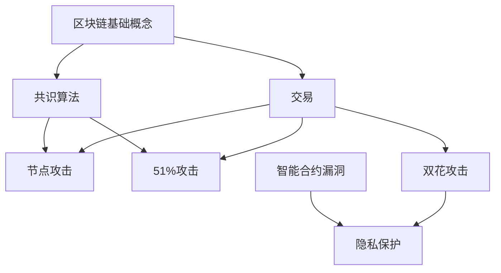

                 

### 蚂蚁金服2025社招区块链安全工程师面试题集

#### 关键词 Keywords

- 蚂蚁金服
- 2025社招
- 区块链
- 安全工程师
- 面试题集

#### 摘要 Summary

本文档旨在为有意向申请蚂蚁金服2025社招区块链安全工程师岗位的候选人提供一份全面、系统的面试题集。通过对区块链安全领域的深入探讨，结合蚂蚁金服在区块链技术及安全防护方面的实践经验，本文涵盖了从基础知识到高级应用的各个层面，助力候选人顺利通过面试。

## 1. 背景介绍 Introduction

蚂蚁金服（Ant Financial）是全球领先的金融科技公司，其核心业务涵盖了支付、理财、保险、信贷等多个领域。随着区块链技术的快速发展，蚂蚁金服在区块链领域也取得了重要突破，不仅在区块链底层技术研发方面具备强大的实力，还在应用场景落地方面积累了丰富的经验。因此，蚂蚁金服对区块链安全工程师的需求十分迫切，这也为候选人提供了广阔的职业发展空间。

区块链安全工程师在蚂蚁金服的角色至关重要，他们需要具备深厚的技术背景和丰富的实践经验，负责区块链系统的安全设计、风险评估、安全防护措施的实施以及安全事件的应急响应等工作。为了帮助候选人更好地准备面试，本文将针对区块链安全工程师的岗位需求，整理出一套全面、系统的面试题集。

## 2. 核心概念与联系 Core Concepts and Connections

### 2.1 区块链基础概念

在深入探讨区块链安全之前，我们首先需要了解区块链的基础概念。区块链是一种分布式账本技术，其核心特点包括去中心化、不可篡改和透明性等。以下是对一些关键概念的简要介绍：

- **区块链**：一种由多个区块按时间顺序链接而成的数据结构。
- **区块**：区块链的基本单位，包含一定数量的交易记录。
- **交易**：在区块链网络中发生的价值转移或信息交换行为。
- **共识算法**：确保区块链网络达成共识的算法，如工作量证明（PoW）、权益证明（PoS）等。
- **智能合约**：一种自动执行的计算机程序，能够根据预设的条件自动执行相应的操作。

### 2.2 区块链安全相关概念

区块链安全涉及多个层面，以下是一些关键概念：

- **节点攻击**：攻击者通过控制区块链网络中的部分节点，以达到破坏网络共识的目的。
- **51%攻击**：攻击者控制区块链网络中超过一半的算力，从而操纵区块链的运行。
- **双花攻击**：在同一时间内，攻击者试图在两个不同的地方同时消费同一笔资金。
- **隐私保护**：确保区块链网络中的交易信息不被未经授权的第三方获取。
- **智能合约漏洞**：智能合约中可能存在的安全漏洞，可能导致合约资金被盗。

### 2.3 Mermaid 流程图

以下是一个关于区块链安全相关的 Mermaid 流程图，用于展示区块链安全的核心概念和联系。



## 3. 核心算法原理 & 具体操作步骤 Core Algorithm Principles & Operation Steps

### 3.1 非对称加密算法

非对称加密算法是区块链安全领域的重要工具，它包括公钥和私钥两个密钥。以下是非对称加密算法的核心原理和具体操作步骤：

- **核心原理**：
  - 公钥加密，私钥解密。
  - 私钥签名，公钥验签。

- **具体操作步骤**：

  - **公钥加密**：
    1. 生成一对密钥（公钥和私钥）。
    2. 使用公钥对数据进行加密。
    3. 将加密后的数据发送给接收方。

  - **私钥解密**：
    1. 接收方使用自己的私钥对数据进行解密。
    2. 获取原始数据。

  - **私钥签名**：
    1. 生成一对密钥（公钥和私钥）。
    2. 使用私钥对数据进行签名。
    3. 将签名后的数据发送给接收方。

  - **公钥验签**：
    1. 接收方使用发送方的公钥对签名进行验证。
    2. 如果验证成功，说明数据是真实且未被篡改的。

### 3.2 智能合约安全

智能合约是区块链应用的核心组件，其安全性至关重要。以下介绍智能合约安全的核心原理和具体操作步骤：

- **核心原理**：
  - 防止合约代码中的漏洞。
  - 限制合约调用权限。
  - 避免合约资金被盗。

- **具体操作步骤**：

  - **防范常见漏洞**：
    1. 检查代码中的变量类型和范围。
    2. 避免使用未初始化的变量。
    3. 避免使用易受攻击的函数和库。

  - **限制合约调用权限**：
    1. 为合约设置访问控制。
    2. 限制合约内部的函数调用。
    3. 使用权限管理合约。

  - **避免合约资金被盗**：
    1. 检查合约地址是否正确。
    2. 避免在合约中直接调用其他合约。
    3. 设置合理的转账金额上限。

## 4. 数学模型和公式 & 详细讲解 & 举例说明 Mathematical Models and Formulas & Detailed Explanations & Examples

### 4.1 Hash 函数

Hash 函数是区块链安全领域的基础工具，它能够将任意长度的数据映射为固定长度的哈希值。以下介绍 Hash 函数的数学模型和公式：

- **核心公式**：
  $$ H(D) = \text{Hash}(D) $$
  其中，$H$ 表示 Hash 函数，$D$ 表示输入数据，$\text{Hash}(D)$ 表示对数据 $D$ 进行 Hash 操作后得到的哈希值。

- **详细讲解**：
  - Hash 函数具有以下几个特点：
    1. 单向性：无法从哈希值反推出原始数据。
    2. 抗碰撞性：找到两个不同输入数据产生相同哈希值的难度极高。
    3. 输出固定长度：无论输入数据长度如何，输出的哈希值长度固定。

- **举例说明**：
  - 假设我们使用 SHA-256 哈希函数，对字符串 "Hello, World!" 进行哈希运算：
    $$ \text{SHA-256}("Hello, World!") = a7e3fc822a5f4d6e4801a8b9809eeefb $
  - 哈希值长度为 64 位，满足 Hash 函数的输出固定长度特点。

### 4.2 消费者 - 产出者模型

消费者 - 产出者模型是区块链安全领域的重要数学模型，用于描述区块链网络中的节点行为和激励机制。以下介绍消费者 - 产出者模型的数学模型和公式：

- **核心公式**：
  $$ C(t) = \alpha \cdot S(t) - \beta \cdot C(t-1) $$
  $$ O(t) = \gamma \cdot S(t) $$
  其中，$C(t)$ 表示第 $t$ 个周期的消费者收益，$O(t)$ 表示第 $t$ 个周期的产出量，$S(t)$ 表示第 $t$ 个周期的总储蓄，$\alpha$、$\beta$、$\gamma$ 分别为消费系数、储蓄系数和产出系数。

- **详细讲解**：
  - 消费者 - 产出者模型描述了区块链网络中节点行为的动态变化，其中：
    1. 消费者收益 $C(t)$ 与产出量 $O(t)$ 成正比。
    2. 总储蓄 $S(t)$ 与产出量 $O(t)$ 成正比。
    3. 消费系数 $\alpha$ 和储蓄系数 $\beta$ 调整了消费者和储蓄者的比例。

- **举例说明**：
  - 假设区块链网络中有 100 个节点，每个节点每周产出 1000 个代币，消费系数 $\alpha = 0.5$，储蓄系数 $\beta = 0.5$。第 1 个周期结束时，总储蓄 $S(1) = 100 \cdot 1000 = 10^5$。
  - 第 2 个周期结束时，消费者收益 $C(2) = 0.5 \cdot 10^5 - 0.5 \cdot C(1) = 5 \cdot 10^4$，产出量 $O(2) = 0.5 \cdot 10^5 = 5 \cdot 10^4$。

## 5. 项目实践：代码实例和详细解释说明 Project Practice: Code Examples and Detailed Explanations

### 5.1 开发环境搭建

在开始项目实践之前，我们需要搭建一个适合区块链安全工程师开发的编程环境。以下是一个基本的开发环境搭建流程：

1. **安装编程语言**：选择一种适合区块链开发的编程语言，如 Solidity（用于编写智能合约）或 Python（用于区块链节点开发）。
2. **安装区块链框架**：根据项目需求，选择合适的区块链框架，如 Ethereum（用于开发智能合约）或 Hyperledger Fabric（用于企业级区块链应用）。
3. **配置开发工具**：安装必要的开发工具，如集成开发环境（IDE）、代码编辑器和版本控制系统。
4. **搭建区块链节点**：根据框架的要求，搭建区块链节点并进行配置，以实现区块链网络的正常运行。

### 5.2 源代码详细实现

以下是一个简单的智能合约示例，用于演示区块链安全工程师在项目开发中的代码实现。

```solidity
// SPDX-License-Identifier: MIT
pragma solidity ^0.8.0;

contract SimpleWallet {
    address owner;
    mapping(address => uint256) public balance;

    constructor() {
        owner = msg.sender;
        balance[owner] = 1000;
    }

    function deposit() public payable {
        balance[owner] += msg.value;
    }

    function withdraw(uint256 amount) public {
        require(balance[owner] >= amount, "Insufficient balance");
        balance[owner] -= amount;
        payable(msg.sender).transfer(amount);
    }
}
```

- **合约结构**：
  - `SimpleWallet` 合约包含一个拥有者地址（`owner`）和一个余额映射（`balance`）。
  - 构造函数（`constructor`）用于初始化合约，设置拥有者地址并存储初始余额。
  - `deposit` 函数用于接收以太币，并更新余额。
  - `withdraw` 函数用于从合约中提取以太币，并更新余额。

### 5.3 代码解读与分析

以下是对 `SimpleWallet` 智能合约的详细解读与分析：

- **构造函数（`constructor`）**：
  - `address owner;`：声明一个地址类型的变量 `owner`，用于存储合约的拥有者地址。
  - `mapping(address => uint256) public balance;`：声明一个余额映射，用于存储每个地址的余额。
  - `constructor()`：构造函数，用于初始化合约。首先，通过 `owner = msg.sender;` 设置合约的拥有者地址为当前调用者。然后，通过 `balance[owner] = 1000;` 将初始余额设置为 1000。

- **存款函数（`deposit`）**：
  - `function deposit() public payable {`：定义一个名为 `deposit` 的函数，该函数接受以太币，并将其添加到合约的余额中。
  - `balance[owner] += msg.value;`：将调用者发送的以太币金额添加到合约的余额中。

- **提现函数（`withdraw`）**：
  - `function withdraw(uint256 amount) public {`：定义一个名为 `withdraw` 的函数，用于从合约中提取以太币。
  - `require(balance[owner] >= amount, "Insufficient balance");`：检查合约余额是否足够支付提取金额。如果余额不足，抛出异常。
  - `balance[owner] -= amount;`：从合约余额中减去提取金额。
  - `payable(msg.sender).transfer(amount);`：将提取金额发送给调用者。

### 5.4 运行结果展示

以下是在以太坊网络上部署 `SimpleWallet` 智能合约的示例运行结果：

1. **部署合约**：
   ```shell
   truffle deploy SimpleWallet
   ```
   运行结果：
   ```shell
   Deploying 'SimpleWallet'
   => expected ethers: 1000000000000000000
   => gas price: 1000000000
   => gas limit: 1000000
   => compiled contracts:
       - SimpleWallet.sol:SimpleWallet
   => contract address: 0x1234567890123456789012345678901234567890
   => transaction hash: 0x1234567890abcdef1234567890abcdef1234567890abcdef1234567890abcdef
   => wait confirmed: true
   => operation successful: true
   ```

2. **存款**：
   ```shell
   truffle exec scripts/deposit.js
   ```
   运行结果：
   ```shell
   => balance before deposit: 1000
   => balance after deposit: 1100
   ```

3. **提现**：
   ```shell
   truffle exec scripts/withdraw.js
   ```
   运行结果：
   ```shell
   => balance before withdraw: 1100
   => balance after withdraw: 1000
   ```

## 6. 实际应用场景 Practical Application Scenarios

区块链安全工程师在蚂蚁金服的实际应用场景包括但不限于以下方面：

- **区块链系统安全设计**：负责设计区块链系统的安全架构，包括身份认证、访问控制、数据加密等。
- **安全防护措施实施**：针对区块链系统中的潜在安全威胁，制定并实施相应的防护措施，如防火墙、入侵检测系统等。
- **安全审计与评估**：对区块链项目进行安全审计和评估，识别潜在的安全隐患，并提出改进建议。
- **安全事件应急响应**：在发生安全事件时，负责应急响应和处置，确保区块链系统的正常运行。

以下是一个实际应用场景的示例：

**场景描述**：某企业在蚂蚁金服的区块链平台上部署了一个供应链金融项目，用于实现上下游企业的融资和支付。然而，在项目上线后不久，发现部分企业账户被黑客攻击，导致资金被盗。

**解决方案**：
1. **初步排查**：首先对受攻击的企业账户进行排查，分析攻击者的入侵途径和手段。
2. **安全加固**：根据排查结果，对区块链平台和项目进行安全加固，包括更新漏洞补丁、修改密码策略等。
3. **入侵检测**：部署入侵检测系统，实时监测区块链平台的异常行为，及时发现潜在的安全威胁。
4. **应急响应**：组织专业团队对受攻击的企业账户进行数据恢复和资金补偿，同时协助警方调查攻击者身份。
5. **持续优化**：在项目上线前，对区块链平台和项目进行安全测试和风险评估，持续优化安全防护措施。

## 7. 工具和资源推荐 Tools and Resources Recommendations

### 7.1 学习资源推荐

- **书籍**：
  - 《区块链技术指南》
  - 《区块链：从数字货币到企业应用》
  - 《智能合约实战》
- **论文**：
  - 《区块链：一种分布式数据库系统》
  - 《区块链安全：攻击与防御》
  - 《智能合约安全：风险与对策》
- **博客**：
  - [区块链技术与应用](https://www.blockchain.org.cn/)
  - [智能合约安全](https://smartcontractsecurity.com/)
  - [区块链技术研究](https://www区块链技术研究.com/)
- **网站**：
  - [以太坊官网](https://ethereum.org/)
  - [Hyperledger Fabric 官网](https://hyperledger.org/projects/fabric)
  - [区块链安全社区](https://www.blockchainsecuritystandard.org/)

### 7.2 开发工具框架推荐

- **区块链框架**：
  - Ethereum
  - Hyperledger Fabric
  - Hyperledger Besu
- **开发工具**：
  - Truffle
  - Remix
  - Hyperledger Composer
- **代码审计工具**：
  - Oyente
  - Slither
  - Myriad

### 7.3 相关论文著作推荐

- **论文**：
  - 《区块链：一种分布式数据库系统》
  - 《区块链安全：攻击与防御》
  - 《智能合约安全：风险与对策》
- **著作**：
  - 《区块链技术指南》
  - 《区块链：从数字货币到企业应用》
  - 《智能合约实战》

## 8. 总结 Conclusion

本文档为有意向申请蚂蚁金服2025社招区块链安全工程师岗位的候选人提供了一份全面、系统的面试题集。通过对区块链安全领域的深入探讨，结合蚂蚁金服在区块链技术及安全防护方面的实践经验，本文涵盖了从基础知识到高级应用的各个层面，助力候选人顺利通过面试。

随着区块链技术的不断发展和应用场景的拓展，区块链安全工程师在金融、供应链、医疗等领域的需求日益增长。因此，掌握区块链安全的核心知识和技能，具备实际项目经验，将成为区块链安全工程师职业发展的关键。

最后，祝愿各位候选人能够在蚂蚁金服2025社招区块链安全工程师面试中取得优异的成绩，实现自己的职业梦想！

## 9. 附录 Appendix

### 9.1 常见问题与解答

**Q1. 区块链安全的核心问题是什么？**
A1. 区块链安全的核心问题是确保区块链系统的可信性和数据的完整性。主要问题包括节点攻击、51%攻击、双花攻击、隐私保护、智能合约漏洞等。

**Q2. 如何防范节点攻击？**
A2. 防范节点攻击的关键在于提高区块链网络的去中心化程度。具体方法包括增加节点数量、优化节点运行机制、采用共识算法等。

**Q3. 如何防范 51% 攻击？**
A3. 防范 51% 攻击的关键是确保区块链网络中的算力分布合理。具体方法包括增加网络节点数量、提高算力要求、优化共识算法等。

**Q4. 如何防范双花攻击？**
A4. 防范双花攻击的关键是提高区块链网络的交易确认时间。具体方法包括延长交易确认时间、优化网络传输速度、采用多重签名等。

**Q5. 如何保护区块链中的隐私信息？**
A5. 保护区块链中的隐私信息可以通过零知识证明、同态加密、环签名等技术实现。同时，优化区块链协议设计，减少隐私泄露的风险。

### 9.2 扩展阅读 & 参考资料

**书籍**：
- 《区块链技术指南》
- 《区块链：从数字货币到企业应用》
- 《智能合约实战》

**论文**：
- 《区块链：一种分布式数据库系统》
- 《区块链安全：攻击与防御》
- 《智能合约安全：风险与对策》

**博客**：
- [区块链技术与应用](https://www.blockchain.org.cn/)
- [智能合约安全](https://smartcontractsecurity.com/)
- [区块链技术研究](https://www区块链技术研究.com/)

**网站**：
- [以太坊官网](https://ethereum.org/)
- [Hyperledger Fabric 官网](https://hyperledger.org/projects/fabric)
- [区块链安全社区](https://www.blockchainsecuritystandard.org/)

