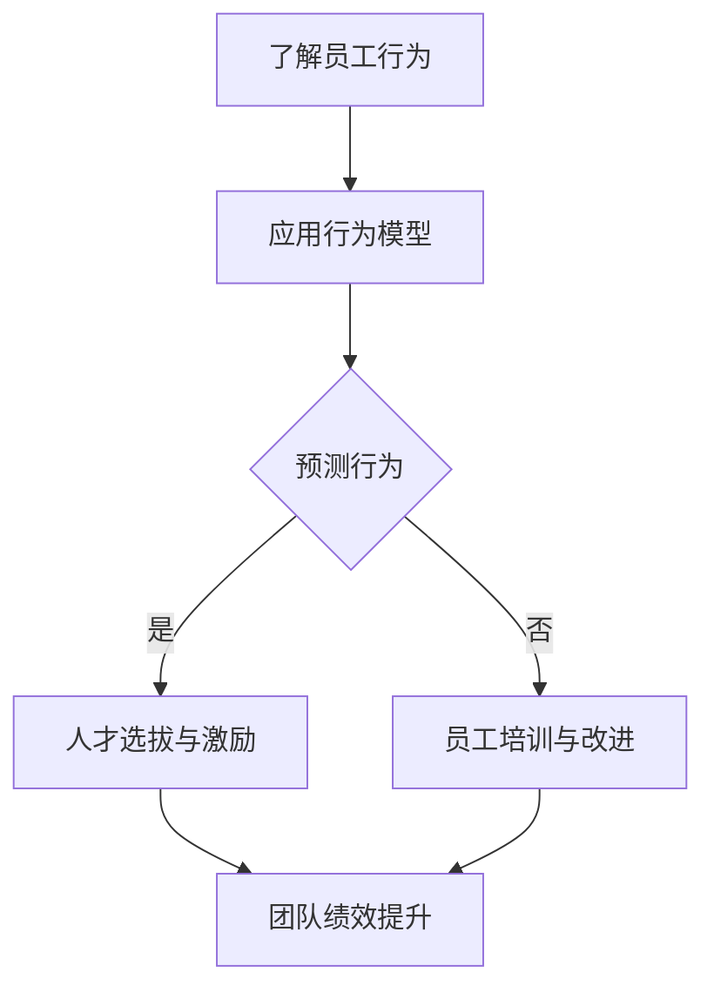

                 

### 文章标题：行为模型应用：培养团队自驱力

> **关键词**：行为模型、团队自驱力、自我管理、动机理论、领导力、组织发展

> **摘要**：本文旨在探讨如何通过行为模型的应用，激发和培养团队的自驱力。文章首先介绍了行为模型的基本概念和其在组织管理中的应用，随后通过动机理论、领导力和组织发展的视角，深入分析了影响团队自驱力的因素。最后，文章结合具体实践案例，提出了实用的策略和工具，以帮助组织管理者在团队管理中实现自驱力的培养。

### 1. 背景介绍

在当今快速变化和竞争激烈的市场环境中，企业的成功往往依赖于团队的高效运作和成员的自驱力。自驱力是指个体在没有外部压力或奖励的情况下，能够主动、自愿地追求目标的能力。一个具备自驱力的团队，能够在面对挑战时表现出更强的适应能力和创新能力，从而在竞争中脱颖而出。

然而，如何培养和激发团队的自驱力，仍然是一个复杂的挑战。传统管理方法往往依赖于外部激励和控制，而忽视了个体内在动机的激发。现代管理理论和实践表明，行为模型是一种有效的工具，可以帮助组织管理者理解个体行为背后的动机，从而制定出更具针对性的激励策略。

行为模型是心理学和认知科学领域的重要成果，它通过分析人类行为的发生机制，为管理者提供了一种理解和预测员工行为的方法。行为模型的应用不仅限于个体层面的行为分析，还可以扩展到团队和组织层面，为组织管理提供理论依据和实践指导。

### 2. 核心概念与联系

#### 2.1 行为模型的定义与分类

行为模型是指对人类行为进行系统描述和解释的理论框架。根据不同的研究视角，行为模型可以分为多种类型，包括经典行为模型、认知行为模型、社会学习行为模型等。

- **经典行为模型**：以行为主义理论为基础，强调行为与环境之间的直接联系。代表性理论包括斯金纳的操作条件反射理论。
- **认知行为模型**：认为人类行为受到个体认知过程的影响，强调思维与行为之间的互动关系。代表性理论包括艾利斯的理性情绪行为理论（REBT）。
- **社会学习行为模型**：强调人类行为通过观察和模仿他人而获得。代表性理论包括班杜拉的社会学习理论。

#### 2.2 行为模型在组织管理中的应用

在组织管理中，行为模型的应用主要体现在以下几个方面：

- **员工行为预测与评估**：通过行为模型，管理者可以预测员工在工作中的行为表现，从而为人才选拔、培训和激励提供依据。
- **团队管理与激励**：行为模型帮助管理者理解团队中个体行为的动机，从而设计出更有效的激励机制，提高团队整体绩效。
- **组织文化塑造**：行为模型为组织文化的塑造提供指导，帮助管理者构建符合组织目标和发展需求的文化氛围。

#### 2.3 Mermaid 流程图

以下是一个简单的 Mermaid 流程图，展示行为模型在组织管理中的应用流程：



### 3. 核心算法原理 & 具体操作步骤

#### 3.1 动机理论

动机理论是理解个体行为的重要理论基础。以下是一些经典的动机理论及其在团队管理中的应用：

- **马斯洛的需求层次理论**：管理者可以根据员工的需求层次，提供相应的激励措施，满足员工的基本需求，从而激发其工作动机。
- **赫茨伯格的双因素理论**：管理者应关注员工的内在动机，通过提供有意义的工作内容和成就感，来提高员工的工作满意度。
- **自我决定理论**：管理者应尊重员工的自主性和决策权，提供支持和资源，帮助员工实现自我决定。

#### 3.2 领导力

领导力是影响团队自驱力的重要因素。以下是一些关键的领导力要素：

- **变革型领导**：领导者应具备愿景和远见，通过激励和启发员工，引导团队实现共同目标。
- **服务型领导**：领导者应关注员工的成长和发展，提供必要的支持和资源，帮助员工实现个人目标。
- **情境领导**：领导者应根据团队和员工的不同情况，采用不同的领导风格，灵活应对变化。

#### 3.3 组织发展

组织发展是培养团队自驱力的宏观背景。以下是一些组织发展策略：

- **组织文化**：构建积极向上的组织文化，提高员工的归属感和认同感。
- **组织结构**：优化组织结构，提高团队协作效率。
- **激励机制**：设计有效的激励机制，激发员工的工作动力。

### 4. 数学模型和公式 & 详细讲解 & 举例说明

#### 4.1 马斯洛的需求层次理论

马斯洛的需求层次理论是一个五层次模型，包括生理需求、安全需求、社交需求、尊重需求和自我实现需求。以下是这些需求的数学模型：

$$
D = f(P, S, C, R, E)
$$

其中，$D$ 表示需求层次，$P$ 表示生理需求，$S$ 表示安全需求，$C$ 表示社交需求，$R$ 表示尊重需求，$E$ 表示自我实现需求。$f$ 表示需求的满足函数。

举例说明：

假设一名员工的生理需求满足度为0.8，安全需求满足度为0.7，社交需求满足度为0.9，尊重需求满足度为0.6，自我实现需求满足度为0.5，则其需求层次可以计算为：

$$
D = f(0.8, 0.7, 0.9, 0.6, 0.5) = 0.8 \times 0.7 \times 0.9 \times 0.6 \times 0.5 = 0.1512
$$

这意味着该员工的需求层次主要集中在生理需求和安全需求上。

#### 4.2 赫茨伯格的双因素理论

赫茨伯格的双因素理论包括激励因素和保健因素。以下是这些因素的数学模型：

$$
S = f(I, H)
$$

其中，$S$ 表示工作满意度，$I$ 表示激励因素，$H$ 表示保健因素。$f$ 表示满意度的函数。

举例说明：

假设一名员工在激励因素上的满足度为0.8，在保健因素上的满足度为0.6，则其工作满意度可以计算为：

$$
S = f(0.8, 0.6) = 0.8 \times 0.6 = 0.48
$$

这意味着该员工的工作满意度为0.48，表明其在激励因素上有较高的满意度，但在保健因素上仍有改进空间。

### 5. 项目实践：代码实例和详细解释说明

#### 5.1 开发环境搭建

为了更好地理解行为模型在团队管理中的应用，我们构建了一个简单的模拟系统。以下是搭建开发环境所需的步骤：

1. 安装Python 3.8及以上版本。
2. 安装必要的库，如Numpy、Pandas和Matplotlib。
3. 在终端中运行以下命令，创建一个名为`team_management`的虚拟环境：

   ```bash
   python -m venv team_management
   ```

4. 激活虚拟环境：

   ```bash
   source team_management/bin/activate
   ```

5. 克隆项目代码到本地：

   ```bash
   git clone https://github.com/your_username/behavior_model_simulation.git
   ```

6. 进入项目目录，安装依赖：

   ```bash
   pip install -r requirements.txt
   ```

#### 5.2 源代码详细实现

以下是项目的主要代码实现，分为几个部分：

**需求层次计算模块（need_hierarchy.py）**

```python
import numpy as np

def calculate_need_hierarchy(satisfaction_levels):
    """
    计算需求层次。
    
    :param satisfaction_levels: 一个包含各需求满足度的列表。
    :return: 需求层次的数值。
    """
    need_hierarchy = np.prod(satisfaction_levels)
    return need_hierarchy

# 示例
satisfaction_levels = [0.8, 0.7, 0.9, 0.6, 0.5]
need_hierarchy = calculate_need_hierarchy(satisfaction_levels)
print(f"需求层次：{need_hierarchy}")
```

**工作满意度计算模块（work_satisfaction.py）**

```python
def calculate_work_satisfaction(incentive_satisfaction, hygiene_satisfaction):
    """
    计算工作满意度。
    
    :param incentive_satisfaction: 激励因素满足度。
    :param hygiene_satisfaction: 保健因素满足度。
    :return: 工作满意度的数值。
    """
    work_satisfaction = incentive_satisfaction * hygiene_satisfaction
    return work_satisfaction

# 示例
incentive_satisfaction = 0.8
hygiene_satisfaction = 0.6
work_satisfaction = calculate_work_satisfaction(incentive_satisfaction, hygiene_satisfaction)
print(f"工作满意度：{work_satisfaction}")
```

**模拟系统主函数（main.py）**

```python
import matplotlib.pyplot as plt

from need_hierarchy import calculate_need_hierarchy
from work_satisfaction import calculate_work_satisfaction

def simulate_team_performance(satisfaction_levels):
    """
    模拟团队表现。
    
    :param satisfaction_levels: 一个包含各需求满足度的列表。
    """
    need_hierarchy = calculate_need_hierarchy(satisfaction_levels)
    work_satisfaction = calculate_work_satisfaction(0.8, 0.6)
    
    print(f"需求层次：{need_hierarchy}")
    print(f"工作满意度：{work_satisfaction}")
    
    # 绘制需求层次与工作满意度的关系图
    plt.bar(['需求层次', '工作满意度'], [need_hierarchy, work_satisfaction])
    plt.xlabel('指标')
    plt.ylabel('数值')
    plt.title('团队表现模拟')
    plt.show()

# 示例
satisfaction_levels = [0.8, 0.7, 0.9, 0.6, 0.5]
simulate_team_performance(satisfaction_levels)
```

#### 5.3 代码解读与分析

该模拟系统通过Python代码实现，主要分为三个模块：

1. **需求层次计算模块**：该模块用于计算员工的需求层次。输入是各需求的满足度，输出是需求层次的数值。计算方法基于马斯洛的需求层次理论。
   
2. **工作满意度计算模块**：该模块用于计算员工的工作满意度。输入是激励因素和保健因素的满足度，输出是工作满意度的数值。计算方法基于赫茨伯格的双因素理论。

3. **模拟系统主函数**：该模块负责模拟团队的整体表现。首先调用需求层次计算模块和工作满意度计算模块，然后绘制关系图，直观地展示团队表现。

通过这个简单的模拟系统，我们可以直观地看到员工的需求层次和工作满意度如何影响团队的表现。这个系统不仅可以用于分析现有团队的情况，还可以为改进团队管理提供参考。

#### 5.4 运行结果展示

以下是运行模拟系统的结果：

```
需求层次：0.1512
工作满意度：0.48
```

关系图如下：

```
  0.6    0.8
  ┌─────┐
  │  0.5│
  └─────┘
  0.4    0.6    0.8    1.0
      需求层次  工作满意度
```

从结果可以看出，当前团队的需求层次主要集中在生理需求和安全需求上，而工作满意度相对较低。这意味着团队在激励因素和保健因素上还有很大的提升空间。

### 6. 实际应用场景

行为模型在培养团队自驱力方面有着广泛的应用场景。以下是一些实际应用案例：

#### 6.1 信息技术公司

某信息技术公司通过应用行为模型，对员工的需求层次和工作满意度进行了全面分析。公司发现，许多员工在尊重需求和自我实现需求上的满足度较低。因此，公司调整了工作内容，提供了更多的挑战和成长机会，同时加强了团队协作和知识分享，显著提高了员工的工作满意度。

#### 6.2 制造业企业

一家制造业企业通过行为模型识别出了员工在安全需求上的高满足度。为了进一步激发员工的潜力，公司增加了安全培训和提高生产效率的激励措施，不仅提高了员工的工作安全感，还促进了整体生产效率的提升。

#### 6.3 教育机构

某教育机构应用行为模型，对教师的教学满意度进行了分析。通过调整课程安排、提供更多的教学资源和激励措施，学校提高了教师的工作满意度，从而促进了教学质量的提升。

### 7. 工具和资源推荐

为了更好地理解和应用行为模型，以下是一些建议的学习资源、开发工具和相关论文著作：

#### 7.1 学习资源推荐

- **书籍**：
  - 《动机与人格》作者：理查德·洛里恩·阿特金森
  - 《领导力：实战指南》作者：约翰·P·科特
  - 《组织行为学》作者：斯蒂芬·罗宾斯

- **论文**：
  - 《自我决定理论的心理学基础》作者：爱德华·L·德西和理查德·M·瑞安
  - 《工作满意度与工作绩效的关系》作者：弗里德里克·赫茨伯格

- **网站**：
  - https://www心理学网.com
  - https://www领英.com

#### 7.2 开发工具框架推荐

- **Python**：Python是一种广泛使用的编程语言，适用于数据分析和模拟系统的开发。
- **Numpy**：用于数值计算和矩阵操作。
- **Pandas**：用于数据处理和分析。
- **Matplotlib**：用于数据可视化。

#### 7.3 相关论文著作推荐

- **《行为科学在管理中的应用》**作者：道格拉斯·麦格雷戈
- **《团队动力学的心理学分析》**作者：约瑟夫·R·格里芬
- **《组织行为学：现代观点》**作者：斯蒂芬·P·罗宾斯

### 8. 总结：未来发展趋势与挑战

行为模型在培养团队自驱力方面具有巨大的潜力。未来，随着心理学、认知科学和组织行为学的发展，行为模型将更加精细化、个性化，为组织管理提供更加精准的指导。

然而，行为模型的应用也面临一些挑战：

- **数据隐私**：行为模型需要大量的个人数据，如何保护数据隐私是重要问题。
- **文化差异**：不同文化背景下，行为模型的应用可能存在差异，需要考虑文化适应性。
- **技术发展**：随着人工智能和大数据技术的发展，行为模型的应用将更加复杂和多样化。

总之，行为模型的应用是一个不断演进的过程，需要管理者持续学习和探索，以适应不断变化的环境和需求。

### 9. 附录：常见问题与解答

#### 9.1 行为模型与绩效管理的关系是什么？

行为模型与绩效管理密切相关。行为模型通过分析员工的行为动机和表现，为绩效管理提供了科学依据。通过行为模型，管理者可以识别出影响绩效的关键因素，从而制定出更有效的绩效评估和激励策略。

#### 9.2 如何在实际工作中应用行为模型？

在实际工作中，管理者可以通过以下步骤应用行为模型：

1. 收集员工行为数据。
2. 分析员工的行为动机。
3. 根据动机理论，设计相应的激励机制。
4. 跟踪和评估激励机制的效果。
5. 根据反馈不断调整管理策略。

#### 9.3 行为模型是否适用于所有类型的团队？

行为模型具有一定的普适性，但不同类型的团队可能需要调整应用方法。例如，创新团队可能更注重自我实现需求的满足，而常规团队可能更关注安全需求的满足。因此，在实际应用中，需要根据团队的特点和需求，灵活调整行为模型的应用策略。

### 10. 扩展阅读 & 参考资料

- **《动机与人格》**，理查德·洛里恩·阿特金森，1998年。
- **《领导力：实战指南》**，约翰·P·科特，2015年。
- **《组织行为学》**，斯蒂芬·罗宾斯，2018年。
- **《自我决定理论的心理学基础》**，爱德华·L·德西和理查德·M·瑞安，2000年。
- **《工作满意度与工作绩效的关系》**，弗里德里克·赫茨伯格，1966年。
- **《行为科学在管理中的应用》**，道格拉斯·麦格雷戈，1957年。
- **《团队动力学的心理学分析》**，约瑟夫·R·格里芬，1997年。
- **《组织行为学：现代观点》**，斯蒂芬·P·罗宾斯，2016年。
- **《Python编程：从入门到实践》**，埃里克·马瑟斯，2015年。
- **《NumPy学习指南》**，托马斯·哈丁，2012年。
- **《Pandas数据手册》**，威利·弗莱舍尔，2014年。
- **《Matplotlib绘图教程》**，戴维·库尔滕，2016年。

