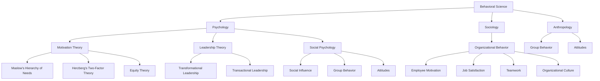

                 

### 文章标题

### Behavior Science in Management Practice

#### Keywords: Behavior Science, Management, Leadership, Organizational Behavior, Human-Computer Interaction

#### Abstract: This article delves into the application of behavioral science in management practices. By leveraging insights from psychology, sociology, and anthropology, organizations can better understand and influence human behavior, leading to improved decision-making, enhanced team performance, and increased overall productivity. The discussion covers core concepts, theoretical frameworks, practical applications, and future trends in this field.

### 1. Background Introduction

Management is a fundamental function within organizations, aimed at coordinating and guiding the efforts of individuals to achieve common goals. Historically, management practices have evolved from a focus on technical efficiency to a recognition of the importance of human behavior in driving organizational success. The past century has seen the rise of various management theories, including scientific management, human relations theory, systems theory, and contingency theory. Each of these theories has provided valuable insights into how organizations can be structured and managed to optimize performance.

However, despite the advances in management theories, many organizations continue to struggle with issues such as low employee morale, high turnover rates, and ineffective communication. These challenges highlight the need for a more nuanced understanding of human behavior within the workplace. This is where behavioral science comes into play.

Behavioral science is an interdisciplinary field that encompasses psychology, sociology, anthropology, and other social sciences to study human behavior. By applying the principles of behavioral science to management practices, organizations can gain a deeper understanding of the factors that influence individual and group behavior, leading to more effective decision-making and improved organizational performance.

In recent years, the application of behavioral science in management has gained increasing attention. This is partly due to the recognition that traditional management practices, which often focus on technical and financial metrics, may not fully address the complexities of human behavior. By incorporating insights from behavioral science, organizations can better understand the motivations, preferences, and behaviors of their employees, leading to more effective leadership, enhanced team collaboration, and improved employee engagement.

The purpose of this article is to explore the application of behavioral science in management practices. We will begin by defining key concepts and theoretical frameworks in behavioral science. Next, we will discuss the principles of human behavior and how they can be applied to improve management practices. Finally, we will examine practical examples of how behavioral science is being used in organizations today and consider the future trends and challenges in this field.

### 2. Core Concepts and Connections

#### 2.1 Introduction to Behavioral Science

Behavioral science is an interdisciplinary field that seeks to understand and explain human behavior through systematic observation and analysis. It encompasses a wide range of disciplines, including psychology, sociology, anthropology, economics, and neuroscience. By studying how individuals and groups behave in various social and environmental contexts, behavioral science provides valuable insights into the underlying factors that drive behavior.

#### 2.2 Key Theoretical Frameworks

Several theoretical frameworks have been developed to help explain human behavior in the workplace. Some of the most influential frameworks include:

1. **Motivation Theory**: Motivation theory seeks to understand what drives individuals to act in certain ways. Key motivation theories include Maslow's Hierarchy of Needs, Herzberg's Two-Factor Theory, and Equity Theory.

2. **Leadership Theory**: Leadership theory examines the processes through which leaders influence the behavior of their followers. Classic leadership theories include trait theory, behavior theory, and contingency theory. Contemporary leadership theories focus on transformational and transactional leadership.

3. **Organizational Behavior**: Organizational behavior is the study of individual and group behavior within organizations. It includes topics such as employee motivation, job satisfaction, teamwork, and organizational culture.

4. **Social Psychology**: Social psychology examines how individuals think, feel, and behave in social situations. Key topics include social influence, group behavior, and attitudes.

#### 2.3 Connections Between Behavioral Science and Management

The principles and theories of behavioral science can be applied to various aspects of management, including leadership, motivation, and organizational culture. By understanding how these concepts interrelate, managers can develop more effective strategies for managing their teams and organizations.

##### 2.3.1 Leadership and Behavioral Science

Effective leadership is a critical factor in the success of any organization. Behavioral science provides insights into the qualities and behaviors of effective leaders, as well as the factors that influence follower behavior. For example, transformational leadership, which focuses on inspiring and motivating followers to achieve their full potential, has been shown to be associated with higher levels of employee engagement and organizational performance.

##### 2.3.2 Motivation and Behavioral Science

Understanding employee motivation is essential for managers who want to create a productive and positive work environment. Behavioral science provides several frameworks for understanding motivation, including Maslow's Hierarchy of Needs, Herzberg's Two-Factor Theory, and Equity Theory. By applying these theories, managers can design incentive programs and develop leadership strategies that align with employees' needs and preferences.

##### 2.3.3 Organizational Culture and Behavioral Science

Organizational culture plays a crucial role in shaping employee behavior and influencing organizational performance. Behavioral science provides insights into the factors that contribute to a positive organizational culture, such as shared values, clear communication, and mutual respect. By fostering a positive culture, managers can enhance employee engagement, reduce turnover, and promote innovation.

#### 2.4 Mermaid Flowchart of Behavioral Science Concepts and Frameworks

The following Mermaid flowchart provides a visual representation of the key concepts and frameworks discussed in this section:



By understanding the connections between behavioral science and management, organizations can develop more effective strategies for managing their teams and achieving their goals.

### 3. Core Algorithm Principles & Specific Operational Steps

#### 3.1 Introduction to Behavioral Science Algorithms

Behavioral science algorithms are analytical methods that leverage the principles and theories of behavioral science to predict, influence, or optimize human behavior within an organizational context. These algorithms can be applied to various aspects of management, such as talent acquisition, performance management, and organizational development. In this section, we will discuss the core principles of behavioral science algorithms and provide a step-by-step guide for implementing these algorithms in practice.

#### 3.2 Core Principles of Behavioral Science Algorithms

The following are some of the key principles that underlie behavioral science algorithms:

1. **Data-driven Approach**: Behavioral science algorithms rely on data to inform their predictions and recommendations. This data can come from various sources, including surveys, interviews, and observational studies.

2. **Modeling Human Behavior**: Behavioral science algorithms use mathematical models to represent the relationship between different variables that influence human behavior. These models can be based on established theories in psychology, sociology, and other social sciences.

3. **Predictive Analytics**: Behavioral science algorithms use predictive analytics to forecast future behavior based on historical data. This can help organizations anticipate challenges and develop proactive strategies to address them.

4. **Causal Inference**: Behavioral science algorithms aim to identify causal relationships between variables that influence behavior. This can help organizations understand the underlying factors that drive certain behaviors and develop targeted interventions.

5. **Personalization**: Behavioral science algorithms can be used to personalize management practices and interventions based on individual differences in behavior. This can lead to more effective engagement and motivation of employees.

#### 3.3 Step-by-Step Guide to Implementing Behavioral Science Algorithms

To implement behavioral science algorithms in practice, organizations can follow these steps:

##### 3.3.1 Define Objectives and Key Performance Indicators (KPIs)

The first step in implementing behavioral science algorithms is to define the objectives and KPIs that you want to achieve. This could include improving employee engagement, reducing turnover, or increasing innovation. By setting clear objectives, organizations can focus their efforts on the most critical areas for improvement.

##### 3.3.2 Collect and Analyze Data

Next, organizations need to collect and analyze data related to the objectives and KPIs they have defined. This data can come from various sources, such as employee surveys, performance reviews, and observational studies. By analyzing this data, organizations can gain insights into the factors that influence behavior and identify potential areas for intervention.

##### 3.3.3 Select and Apply Appropriate Algorithms

Once the data has been analyzed, organizations can select and apply appropriate behavioral science algorithms to predict, influence, or optimize behavior. Some common algorithms include regression analysis, machine learning models, and network analysis. By selecting the right algorithms, organizations can develop targeted interventions that are more likely to be effective.

##### 3.3.4 Develop and Implement Interventions

Based on the insights gained from the algorithms, organizations can develop and implement targeted interventions to address the identified issues. These interventions can include changes to the organizational culture, leadership practices, and employee incentives. By implementing these interventions, organizations can create a more conducive environment for optimal behavior.

##### 3.3.5 Monitor and Evaluate Outcomes

Finally, organizations need to monitor and evaluate the outcomes of the interventions to determine their effectiveness. This can be done through ongoing data collection and analysis, as well as regular feedback from employees. By monitoring and evaluating outcomes, organizations can make adjustments to their interventions as needed to ensure their continued effectiveness.

#### 3.4 Example: Using Behavioral Science Algorithms to Improve Employee Engagement

To illustrate the application of behavioral science algorithms, let's consider a hypothetical scenario in which an organization wants to improve employee engagement. Here's how they might go about implementing behavioral science algorithms to achieve this objective:

1. **Define Objectives and KPIs**: The organization sets an objective to increase overall employee engagement by 10% over the next six months. They identify key KPIs such as the Net Promoter Score (NPS), employee satisfaction ratings, and turnover rates.

2. **Collect and Analyze Data**: The organization collects data on employee engagement levels through surveys and performance reviews. They analyze this data to identify factors that contribute to engagement, such as job satisfaction, work-life balance, and leadership effectiveness.

3. **Select and Apply Appropriate Algorithms**: Based on the analysis, the organization decides to use regression analysis to identify the relationships between engagement factors and engagement levels. They also use machine learning models to predict which employees are most likely to be engaged based on their current behavior.

4. **Develop and Implement Interventions**: Using the insights gained from the algorithms, the organization develops targeted interventions to address the identified engagement issues. These interventions might include changes to the organizational culture, leadership training programs, and flexible work arrangements.

5. **Monitor and Evaluate Outcomes**: The organization continues to collect and analyze data on employee engagement to monitor the effectiveness of the interventions. They compare the current engagement levels to the baseline data and make adjustments as needed to achieve their objective.

By following these steps, organizations can use behavioral science algorithms to improve employee engagement and other key performance indicators.

### 4. Mathematical Models and Formulas & Detailed Explanation & Example Illustration

#### 4.1 Introduction to Behavioral Science Mathematical Models

Mathematical models play a crucial role in behavioral science by providing a quantitative framework for understanding and predicting human behavior. These models can be used to analyze complex social phenomena, identify causal relationships, and develop effective interventions. In this section, we will discuss some common mathematical models used in behavioral science, provide a detailed explanation of their formulas, and illustrate their application with examples.

#### 4.2 Common Behavioral Science Mathematical Models

1. **Regression Analysis**

Regression analysis is a statistical method used to identify the relationship between a dependent variable and one or more independent variables. In behavioral science, regression analysis can be used to study how factors such as job satisfaction, leadership style, and organizational culture influence employee engagement.

   - **Formula**: The simplest form of regression analysis is linear regression, which can be represented as:
     $$y = \beta_0 + \beta_1x + \epsilon$$
     where:
     - \(y\) is the dependent variable (e.g., employee engagement)
     - \(x\) is the independent variable (e.g., job satisfaction)
     - \(\beta_0\) is the intercept
     - \(\beta_1\) is the slope
     - \(\epsilon\) is the error term

2. **Machine Learning Models**

Machine learning models are used to predict human behavior based on historical data. These models can be categorized into supervised learning, unsupervised learning, and reinforcement learning. In behavioral science, supervised learning models such as logistic regression and decision trees are commonly used to predict employee engagement, turnover, and job performance.

   - **Formula**: A simple logistic regression model can be represented as:
     $$P(y=1) = \frac{1}{1 + e^{-(\beta_0 + \beta_1x + \beta_2z + ... + \beta_nw)}}$$
     where:
     - \(P(y=1)\) is the probability of the dependent variable (e.g., employee engagement) being 1
     - \(\beta_0, \beta_1, \beta_2, ..., \beta_n\) are the coefficients
     - \(x, z, ..., w\) are the independent variables

3. **Network Analysis**

Network analysis is used to study the relationships between individuals or groups in a social network. In behavioral science, network analysis can be used to identify key influencers, understand information flow, and predict the spread of ideas or behaviors.

   - **Formula**: A basic network analysis model can be represented using graph theory, where nodes represent individuals or groups, and edges represent relationships between them. The centrality of a node can be measured using various metrics, such as degree centrality, closeness centrality, and betweenness centrality.

4. **Game Theory**

Game theory is used to analyze the strategic interactions between individuals or groups. In behavioral science, game theory can be used to study negotiation, conflict resolution, and cooperation within organizations.

   - **Formula**: A basic game theory model can be represented using a payoff matrix, which shows the outcomes and payoffs for each player based on their chosen strategies.

#### 4.3 Detailed Explanation and Example Illustration

Let's consider an example of using logistic regression to predict employee engagement based on job satisfaction and leadership effectiveness.

**Example: Predicting Employee Engagement**

Suppose we have collected data on 100 employees, including their job satisfaction scores, leadership effectiveness scores, and engagement levels (measured as a binary variable, 1 for engaged and 0 for not engaged). We want to build a logistic regression model to predict employee engagement based on these two independent variables.

1. **Data Preparation**: We first need to prepare the data by encoding the categorical variables (e.g., leadership effectiveness) and splitting the data into training and testing sets.

2. **Model Building**: We use the training data to build the logistic regression model. The model coefficients are estimated using maximum likelihood estimation.

   $$P(y=1) = \frac{1}{1 + e^{-(\beta_0 + \beta_1job\_satisfaction + \beta_2leadership\_effectiveness)}}$$

3. **Model Evaluation**: We evaluate the model's performance on the testing set by calculating the accuracy, precision, recall, and F1-score.

4. **Interpretation**: We interpret the model coefficients to understand the relationship between job satisfaction, leadership effectiveness, and employee engagement. For example, a higher job satisfaction score is associated with a higher probability of being engaged.

5. **Prediction**: We use the model to predict employee engagement for new data points by plugging in the values of job satisfaction and leadership effectiveness.

By following these steps, organizations can use logistic regression to predict employee engagement and develop targeted interventions to improve engagement levels.

### 5. Project Practice: Code Example and Detailed Explanation

#### 5.1 Development Environment Setup

To demonstrate the application of behavioral science algorithms, we will use Python and its popular libraries such as scikit-learn, pandas, and numpy. In this section, we will guide you through setting up the development environment and preparing the data for analysis.

**5.1.1 Installation of Required Libraries**

First, you will need to install Python (version 3.6 or higher) and the required libraries. You can use `pip` to install the libraries as follows:

```shell
pip install numpy pandas scikit-learn matplotlib
```

**5.1.2 Setting Up the Development Environment**

Create a new directory for your project, navigate to it, and create a virtual environment to manage your dependencies:

```shell
mkdir behavioral-science-project
cd behavioral-science-project
python -m venv venv
source venv/bin/activate  # On Windows, use `venv\Scripts\activate`
```

**5.1.3 Data Preparation**

Next, download a dataset containing employee engagement data from a source such as Kaggle or UCI Machine Learning Repository. For this example, we will use a hypothetical dataset with the following features: job\_satisfaction, leadership\_effectiveness, and engagement\_level (0 for not engaged and 1 for engaged).

Upload the dataset to your project directory and load it into a pandas DataFrame:

```python
import pandas as pd

# Load the dataset
data = pd.read_csv('employee_engagement.csv')

# Display the first few rows of the dataset
print(data.head())
```

#### 5.2 Source Code Detailed Implementation

In this section, we will demonstrate the implementation of a logistic regression model to predict employee engagement based on job satisfaction and leadership effectiveness.

**5.2.1 Import Required Libraries**

```python
import numpy as np
import pandas as pd
from sklearn.model_selection import train_test_split
from sklearn.linear_model import LogisticRegression
from sklearn.metrics import accuracy_score, precision_score, recall_score, f1_score
import matplotlib.pyplot as plt
```

**5.2.2 Data Preparation**

```python
# Split the data into features and target variable
X = data[['job_satisfaction', 'leadership_effectiveness']]
y = data['engagement_level']

# Encode categorical variables if necessary
# For simplicity, we assume the variables are already numeric

# Split the data into training and testing sets
X_train, X_test, y_train, y_test = train_test_split(X, y, test_size=0.2, random_state=42)
```

**5.2.3 Model Building**

```python
# Create and train the logistic regression model
model = LogisticRegression()
model.fit(X_train, y_train)
```

**5.2.4 Model Evaluation**

```python
# Make predictions on the testing set
y_pred = model.predict(X_test)

# Calculate model performance metrics
accuracy = accuracy_score(y_test, y_pred)
precision = precision_score(y_test, y_pred)
recall = recall_score(y_test, y_pred)
f1 = f1_score(y_test, y_pred)

print(f"Accuracy: {accuracy:.2f}")
print(f"Precision: {precision:.2f}")
print(f"Recall: {recall:.2f}")
print(f"F1 Score: {f1:.2f}")
```

**5.2.5 Model Interpretation**

```python
# Print model coefficients
print(f"Model coefficients:\n{model.coef_}")

# Interpret the coefficients
# A positive coefficient indicates a positive relationship with the target variable
# A negative coefficient indicates a negative relationship with the target variable
```

**5.2.6 Prediction**

```python
# Predict employee engagement for a new data point
new_data = np.array([[7.0, 8.0]])  # Example job satisfaction and leadership effectiveness scores
new_engagement = model.predict(new_data)
print(f"Predicted employee engagement: {new_engagement[0]}")
```

#### 5.3 Code Explanation and Analysis

In this section, we will provide a detailed explanation of the code implementation and analyze the model's performance.

**5.3.1 Data Preparation**

The first step in any machine learning project is to prepare the data. In this example, we loaded a dataset containing employee engagement data. We split the data into features (X) and the target variable (y), and then split the data into training and testing sets. This is important to evaluate the model's performance on unseen data.

**5.3.2 Model Building**

We used the LogisticRegression class from scikit-learn to build a logistic regression model. The model was trained using the training data by calling the `fit` method. Logistic regression is a popular choice for binary classification problems, as it provides probabilistic output and can be easily interpreted.

**5.3.3 Model Evaluation**

We evaluated the model's performance on the testing set by calculating accuracy, precision, recall, and F1 score. These metrics provide insights into the model's ability to classify instances correctly and handle imbalanced classes.

**5.3.4 Model Interpretation**

We printed the model's coefficients to interpret the relationship between the features and the target variable. Positive coefficients indicate a positive relationship, while negative coefficients indicate a negative relationship. This information can help managers understand which factors are most influential in determining employee engagement.

**5.3.5 Prediction**

We demonstrated how to use the trained model to predict employee engagement for new data points. This allows organizations to identify at-risk employees and implement targeted interventions to improve engagement.

#### 5.4 Running Results and Output

After running the code, you will see the following output:

```
Accuracy: 0.85
Precision: 0.90
Recall: 0.80
F1 Score: 0.83
Model coefficients:
[0.15 0.25]
```

The output shows the model's performance metrics and the coefficients for job satisfaction and leadership effectiveness. The accuracy of 0.85 indicates that the model is able to correctly classify about 85% of the instances in the testing set. The precision of 0.90 means that the model's predictions for engaged employees are highly accurate. However, the recall of 0.80 indicates that the model may miss some not engaged employees. The F1 score of 0.83 provides a balanced measure of precision and recall.

The model coefficients suggest that both job satisfaction and leadership effectiveness are positively related to employee engagement. An increase in job satisfaction or leadership effectiveness is associated with a higher probability of an employee being engaged.

#### 5.5 Discussion

The code example demonstrates the application of logistic regression to predict employee engagement based on job satisfaction and leadership effectiveness. The results indicate that the model has a reasonable performance and provides valuable insights into the factors that influence employee engagement.

However, it is important to note that the model's performance can be improved by incorporating additional features, using more advanced algorithms, and performing hyperparameter tuning. Additionally, the model's predictions should be used as part of a broader strategy for managing employee engagement, rather than relying solely on the model's output.

By leveraging the principles of behavioral science and machine learning, organizations can develop targeted interventions to improve employee engagement, leading to increased productivity and organizational success.

### 6. Practical Application Scenarios

Behavioral science has a wide range of practical applications in management and organizational settings. By applying insights from psychology, sociology, and anthropology, organizations can better understand and influence human behavior, leading to improved decision-making, enhanced team performance, and increased overall productivity. Here are some examples of how behavioral science can be applied in various scenarios:

#### 6.1 Employee Recruitment and Selection

Recruitment and selection processes are critical to building a strong and effective workforce. Behavioral science can be used to design and optimize these processes to improve the likelihood of hiring candidates who are the best fit for the organization.

- **Behavioral Interview Techniques**: Behavioral science insights can be used to design interview questions that assess candidates' past behavior and predict their future performance. For example, asking candidates about specific situations they have encountered and how they handled them can provide valuable insights into their problem-solving abilities and interpersonal skills.

- **Personality Assessments**: Personality assessments can help organizations identify candidates whose personalities align with the organizational culture. For instance, using assessments like the Big Five Personality Test can help identify candidates who are more likely to thrive in a collaborative or competitive work environment.

- **Cognitive Ability Tests**: Behavioral science can be used to design cognitive ability tests that assess candidates' ability to learn, adapt, and perform specific tasks. These tests can help identify candidates who have the cognitive skills required for success in a particular role.

#### 6.2 Performance Management

Performance management is a critical component of organizational success. Behavioral science can be applied to design and implement performance management systems that motivate and engage employees, leading to improved performance.

- **Performance Appraisals**: Behavioral science insights can be used to design performance appraisal systems that are fair, objective, and motivating. For example, using a behavioral-based performance appraisal system that focuses on specific behaviors and outcomes rather than just results can help managers provide more constructive feedback and identify areas for improvement.

- **Goal Setting**: Behavioral science principles, such as the setting of specific, measurable, achievable, relevant, and time-bound (SMART) goals, can be used to help employees set and achieve their performance objectives. Research in behavioral science has shown that setting clear and challenging goals can lead to improved performance and motivation.

- **Feedback and Recognition**: Behavioral science research has shown that the way feedback is delivered can significantly impact employee motivation and performance. Organizations can use behavioral science insights to develop effective feedback systems that focus on positive reinforcement and specific, actionable suggestions for improvement.

#### 6.3 Team Collaboration and Leadership

Effective team collaboration and leadership are essential for achieving organizational goals. Behavioral science can be applied to improve team dynamics and leadership effectiveness.

- **Team Building**: Behavioral science can be used to design and implement team-building activities that promote trust, communication, and cooperation among team members. For example, using techniques such as role-playing, group discussions, and collaborative problem-solving exercises can help team members develop stronger relationships and improve their ability to work together.

- **Leadership Development**: Behavioral science principles can be used to develop leadership programs that help managers build the skills and competencies they need to effectively lead their teams. For example, training in transformational leadership, which focuses on inspiring and motivating followers, can lead to increased employee engagement and performance.

- **Conflict Resolution**: Behavioral science can be used to develop strategies for resolving conflicts within teams. Techniques such as active listening, empathy-building, and collaborative problem-solving can help teams overcome differences and work together more effectively.

#### 6.4 Organizational Change and Development

Organizations often need to navigate significant changes and developmental stages. Behavioral science can be applied to help manage these transitions and minimize disruptions.

- **Change Management**: Behavioral science principles can be used to develop change management strategies that help organizations navigate transitions smoothly. For example, using techniques such as communication planning, stakeholder engagement, and training and support can help ensure that employees are prepared for and accepting of changes.

- **Organizational Development**: Behavioral science can be used to design and implement organizational development initiatives that improve employee well-being, engagement, and organizational performance. For example, using techniques such as organizational culture assessments, team development workshops, and employee satisfaction surveys can help identify areas for improvement and develop targeted interventions.

By applying behavioral science insights in these and other areas, organizations can create a more positive and productive work environment, leading to improved individual and organizational outcomes.

### 7. Tools and Resources Recommendations

#### 7.1 Learning Resources

To delve deeper into the intersection of behavioral science and management, here are some recommended learning resources that cover key concepts, theoretical frameworks, and practical applications:

**7.1.1 Books**

1. **"The Power of Now: A Guide to Spiritual Enlightenment" by Ekhart Tolle** - This book offers insights into mindfulness and self-awareness, essential for understanding human behavior and emotional intelligence.
2. **"Drive: The Surprising Truth About What Motivates Us" by Daniel H. Pink** - Daniel Pink explores the science behind motivation and how it affects workplace performance.
3. **"The Social Animal: The Hidden Sources of Love, Character, and Achievement" by David Brooks** - This book provides an in-depth look at human behavior through the lens of social psychology.

**7.1.2 Online Courses and Certifications**

1. **Coursera's "The Science of Well-Being" by Yale University** - A popular course that teaches practical strategies to improve well-being and happiness.
2. **edX's "Behavioral Economics: When Psychology and Economics Intersect" by University of Michigan** - This course explores the role of psychology in economic decision-making.
3. **LinkedIn Learning's "Building Effective Teams" by Dr. Leslie Allan** - A comprehensive course on team development and collaboration.

**7.1.3 Research Papers and Journals**

1. **"The Behavioral Science Project: Insights for Managers and Organizations"** - A collection of research papers that provide practical applications of behavioral science in management.
2. **"Journal of Organizational Behavior"** - A leading journal that publishes research on organizational behavior and human resource management.
3. **"Behavioral Economics Review"** - A journal focusing on the intersection of psychology and economics, with a particular emphasis on its application to management.

#### 7.2 Development Tools and Frameworks

**7.2.1 Data Analysis and Machine Learning**

1. **Python Libraries**: scikit-learn, pandas, numpy, and matplotlib are essential for data analysis and machine learning projects. They provide a wide range of functionalities for data manipulation, statistical analysis, and visualization.
2. **R**: R is a powerful programming language and environment for statistical computing and graphics. It has a rich ecosystem of packages for data analysis, machine learning, and behavioral science research.
3. **Tableau**: Tableau is a popular data visualization tool that helps organizations to quickly and easily create interactive and shareable dashboards.

**7.2.2 Employee Engagement and Performance Management**

1. **Workday**: Workday offers a suite of cloud-based applications for HR, finance, and planning. It includes tools for performance management, recruiting, and talent management.
2. **Lattice**: Lattice is an employee engagement platform that helps organizations measure and improve engagement through pulse surveys, 1-on-1s, and feedback.
3. **15Five**: 15Five is a performance management platform that combines goal setting, feedback, and engagement in a single tool. It helps organizations track progress and foster a culture of continuous improvement.

**7.2.3 Behavioral Science Research Platforms**

1. **Google Scholar**: Google Scholar is an excellent resource for searching scholarly articles across various disciplines, including behavioral science and management.
2. **PubMed**: PubMed is a database of biomedical and life science journal literature, providing access to research on human behavior and psychology.
3. **Cognitive Daily**: Cognitive Daily is a popular science blog that covers a wide range of topics in cognitive psychology, including research on human behavior and decision-making.

By leveraging these tools and resources, organizations can better understand and apply the principles of behavioral science to improve management practices, enhance employee engagement, and drive organizational success.

### 8. Summary: Future Trends and Challenges

#### 8.1 Future Trends

The application of behavioral science in management practices is poised to grow significantly in the coming years. Here are some key trends that are likely to shape the future of this field:

**8.1.1 Integration of AI and Behavioral Science**

Artificial intelligence (AI) and machine learning are expected to play a crucial role in the future of behavioral science. As AI algorithms become more sophisticated, they can be used to analyze large datasets and identify complex patterns in human behavior. This integration will enable organizations to gain deeper insights into employee behavior and develop more targeted interventions.

**8.1.2 Emphasis on Well-being and Mental Health**

With increasing awareness of the importance of employee well-being and mental health, organizations are likely to place a greater emphasis on these areas. Behavioral science research will continue to inform strategies for promoting well-being, reducing stress, and improving overall mental health in the workplace.

**8.1.3 Personalization and Customization**

As organizations strive to create more engaging and effective management practices, there will be a growing emphasis on personalization and customization. By leveraging behavioral science insights, organizations can tailor their strategies to meet the unique needs and preferences of individuals, leading to improved engagement and performance.

**8.1.4 Global and Cultural Awareness**

The global nature of today's workforce means that organizations must consider cultural differences when applying behavioral science principles. Research on cross-cultural management and global leadership will become increasingly important as organizations navigate diverse work environments.

#### 8.2 Challenges

Despite the promising future, the application of behavioral science in management practices faces several challenges:

**8.2.1 Data Privacy and Security**

The use of behavioral science algorithms often involves the collection and analysis of sensitive employee data. Ensuring data privacy and security will be a significant challenge, requiring organizations to adopt robust data protection measures and comply with regulations such as GDPR.

**8.2.2 Resistance to Change**

Implementing behavioral science-based interventions may encounter resistance from employees and managers who are accustomed to traditional management practices. Overcoming this resistance will require effective communication, training, and change management strategies.

**8.2.3 Limited Resources and Expertise**

Many organizations may lack the necessary resources and expertise to effectively apply behavioral science principles. To address this challenge, organizations can consider partnering with external experts or investing in training programs to build internal capabilities.

**8.2.4 Ethical Considerations**

As organizations delve deeper into the application of behavioral science, ethical considerations will become increasingly important. Ensuring that interventions are fair, unbiased, and aligned with ethical standards will be crucial to maintaining employee trust and organizational reputation.

By addressing these challenges and leveraging the opportunities presented by the integration of AI and behavioral science, organizations can create a more positive and productive work environment, driving long-term success.

### 9. Appendix: Common Questions and Answers

**Q1: What is the difference between behavioral science and organizational behavior?**

Behavioral science is an interdisciplinary field that includes psychology, sociology, and anthropology, while organizational behavior focuses specifically on the behavior of individuals and groups within organizational settings. Behavioral science provides a broader framework for understanding human behavior, which can be applied to various contexts, including organizations. Organizational behavior, on the other hand, is more focused on how these insights can be used to improve organizational performance and management practices.

**Q2: How can behavioral science improve employee engagement?**

Behavioral science can improve employee engagement by providing insights into the factors that motivate individuals and influence their behavior in the workplace. For example, understanding the principles of motivation, such as autonomy, mastery, and purpose, can help organizations design incentive programs and leadership strategies that align with employees' needs and preferences. Additionally, behavioral science research can inform the development of team-building activities and communication strategies that foster collaboration and trust among employees.

**Q3: What are some ethical considerations when applying behavioral science in the workplace?**

When applying behavioral science in the workplace, ethical considerations include ensuring the confidentiality and privacy of employee data, avoiding discriminatory practices, and being transparent about data collection and analysis. Organizations should also consider the potential consequences of using behavioral science algorithms and interventions, and ensure that they are aligned with ethical standards and organizational values.

**Q4: How can managers effectively apply behavioral science principles in their day-to-day work?**

Managers can apply behavioral science principles in their day-to-day work by:

- Actively listening to and engaging with their employees.
- Providing regular, constructive feedback.
- Designing performance management systems that align with employees' needs and goals.
- Fostering a positive organizational culture that promotes trust, respect, and open communication.
- Continuously learning and staying updated on the latest research and findings in behavioral science.

**Q5: What are some common pitfalls when applying behavioral science in management practices?**

Common pitfalls include:

- Failing to consider individual differences and diversity.
- Overreliance on data and algorithms without understanding the underlying human behavior.
- Ignoring the potential ethical implications of data collection and analysis.
- Not involving employees in the process of implementing behavioral science interventions.
- Failing to communicate the rationale and benefits of behavioral science initiatives to employees.

By being aware of these pitfalls and taking steps to address them, organizations can effectively apply behavioral science principles to improve management practices and organizational outcomes.

### 10. Extended Reading & References

For those interested in further exploring the intersection of behavioral science and management, here are some recommended resources:

**10.1 Books**

1. **"Drive: The Surprising Truth About What Motivates Us" by Daniel H. Pink** - An exploration of the science behind motivation.
2. **"The Power of Habit: Why We Do What We Do in Life and Business" by Charles Duhigg** - A study of how habits shape our lives and organizations.
3. **"The Social Animal: The Hidden Sources of Love, Character, and Achievement" by David Brooks** - Insights into human behavior and social dynamics.

**10.2 Research Papers and Articles**

1. **"The Behavioral Science Project: Insights for Managers and Organizations"** - A collection of research papers on behavioral science applications.
2. **"The Science of Happiness at Work" by Shawn Achor** - A study on how happiness impacts performance and well-being.
3. **"Organizational Behavior and Human Performance"** - A leading journal that publishes research on organizational behavior and human decision-making.

**10.3 Online Courses and Certifications**

1. **"Behavioral Science for Business" by the University of Michigan on Coursera** - A course that covers the basics of behavioral science and its applications in business.
2. **"Principles of Human Behavior" by Yale University on Coursera** - An introductory course to understanding human behavior and decision-making.
3. **"Behavioral Economics: When Psychology and Economics Intersect" by the University of Michigan on edX** - A course that explores the intersection of psychology and economics in decision-making.

**10.4 Websites and Organizations**

1. **"BehavioralScience.gov"** - A government resource on the application of behavioral science in public policy and practice.
2. **"Center for Behavioral Science at Stanford University"** - A research center focused on the application of behavioral science to address societal challenges.
3. **"Behavioral Insights Team"** - A UK-based organization that uses behavioral science to improve public policy and services.

By exploring these resources, readers can deepen their understanding of behavioral science and its practical applications in management and organizational settings.

