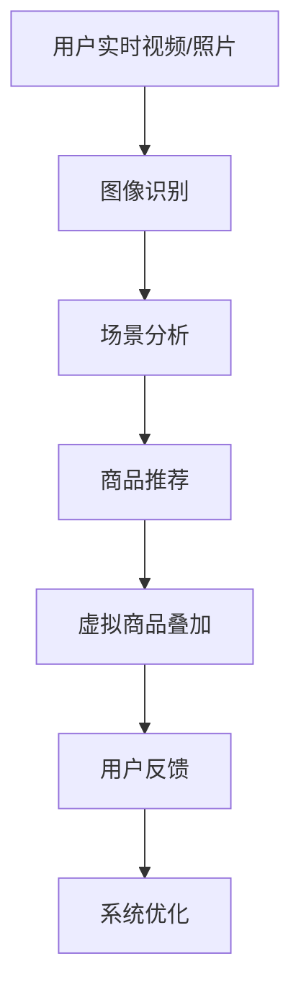

                 

### 背景介绍

#### 增强现实技术（AR）的崛起

增强现实（Augmented Reality，简称AR）是一种将虚拟信息与现实世界相结合的技术，通过计算机生成虚拟信息，并将其叠加到真实场景中，从而增强用户的感知体验。近年来，随着计算机视觉、图像处理、传感器技术以及移动设备的快速发展，AR技术逐渐走进了大众的视野。

在消费领域，AR技术已广泛应用于游戏（如《宝可梦GO》）、购物（如淘宝AR试妆）、教育（如虚拟博物馆）等多个方面，极大地丰富了用户的生活体验。而在商业领域，AR技术也被广泛用于广告营销、客户服务、远程协作等场景，为企业带来了更高的效率和更低的成本。

#### 人工智能（AI）的变革

人工智能（Artificial Intelligence，简称AI）作为计算机科学的一个重要分支，旨在使机器具备人类的智能，能够通过学习和理解环境，自主完成复杂任务。随着深度学习、神经网络、大数据技术的不断突破，AI在图像识别、自然语言处理、决策支持等领域取得了显著的成果。

AI在图像识别方面，通过训练深度神经网络，可以实现对图像内容的精确识别和分类。例如，人脸识别技术已经广泛应用于安防监控、社交媒体等多个领域。在自然语言处理方面，AI能够理解和生成自然语言，为智能客服、智能助手等提供了强有力的支持。

#### 结合AI与AR的视觉导购

视觉导购作为一种新兴的购物方式，结合了AI和AR技术的优势，为用户提供了更加直观、便捷的购物体验。用户可以通过手机或头戴式设备，将虚拟商品叠加到现实场景中，进行试穿、试用，甚至进行价格比较和购买决策。

通过AI技术，视觉导购系统能够实时识别用户所处的现实场景，分析用户的购物需求，并推荐相应的商品。同时，AI算法还可以根据用户的行为数据，进行个性化推荐，提高用户的购物满意度和转化率。

#### 文章结构概述

本文将围绕视觉导购这一主题，系统地介绍AI与AR技术的结合及其在购物场景中的应用。具体结构如下：

1. **背景介绍**：概述AR和AI技术的发展历程，以及它们在消费和商业领域的应用现状。
2. **核心概念与联系**：详细解释视觉导购的基本原理，并使用Mermaid流程图展示相关技术架构。
3. **核心算法原理 & 具体操作步骤**：深入探讨AI在视觉导购中的应用，包括图像识别、场景分析、商品推荐等。
4. **数学模型和公式 & 详细讲解 & 举例说明**：介绍视觉导购中涉及的主要数学模型和算法，并通过具体案例进行说明。
5. **项目实践：代码实例和详细解释说明**：提供实际项目案例，详细展示如何实现视觉导购系统，并进行代码解读。
6. **实际应用场景**：分析视觉导购在不同行业和场景中的应用，探讨其潜力和挑战。
7. **工具和资源推荐**：推荐相关的学习资源、开发工具和框架，帮助读者深入了解和掌握视觉导购技术。
8. **总结：未来发展趋势与挑战**：总结视觉导购技术的发展现状，预测未来的发展趋势，并提出面临的挑战。
9. **附录：常见问题与解答**：回答读者可能遇到的问题，提供解决方案。
10. **扩展阅读 & 参考资料**：推荐相关的学术论文、书籍和技术博客，供读者进一步学习。

通过本文的逐步分析，我们将深入了解AI与AR结合的视觉导购技术，探讨其在现实世界中的应用前景，为未来的购物体验带来更多可能性。<|user|>

## 1. 背景介绍

### 增强现实技术（AR）的发展历程

增强现实（AR）技术的概念最早可以追溯到20世纪60年代。当时，波音公司的科学家艾伦·凯（Alan Kay）提出了“Augmenting Reality”这一概念，意在通过计算机生成的虚拟信息来增强用户的现实感知。然而，由于当时计算机技术和显示设备的限制，AR技术并未得到广泛应用。

进入21世纪，随着计算机视觉、图像处理、传感器技术以及移动设备的快速发展，AR技术迎来了新的发展机遇。2009年，谷歌推出了第一款AR应用——谷歌眼镜（Google Glass），虽然由于隐私和实用性的问题，谷歌眼镜并未获得广泛的市场认可，但它为AR技术开辟了新的应用场景。

随后，苹果公司在2016年发布的iPhone 7 Plus中引入了ARKit开发套件，使得AR应用的开发变得更加容易和便捷。同年，谷歌也发布了ARCore开发平台，进一步推动了AR技术的发展和应用。

在消费领域，AR技术迅速普及。2016年，Niantic公司推出的《宝可梦GO》游戏成为全球热门话题，其通过AR技术将虚拟的宝可梦与现实世界相结合，吸引了大量用户参与。这一成功案例不仅证明了AR技术的市场潜力，也为其他消费领域的AR应用提供了借鉴。

在商业领域，AR技术也得到了广泛应用。例如，一些零售企业通过AR技术，实现了虚拟试妆、虚拟试衣等购物体验，提高了用户的购买意愿和满意度。此外，AR技术还被应用于教育、医疗、设计等多个领域，为专业领域的工作提供了新的解决方案。

### 人工智能（AI）的崛起

人工智能（AI）作为计算机科学的一个重要分支，旨在使机器具备人类的智能，能够通过学习和理解环境，自主完成复杂任务。AI的发展可以分为三个阶段：第一阶段是以规则为基础的符号AI，第二阶段是基于统计学习的数据驱动AI，第三阶段是基于神经网络的深度学习AI。

在20世纪50年代至70年代，符号AI占据主导地位。符号AI通过设计复杂的规则系统，试图模拟人类的逻辑推理能力。然而，由于规则系统的复杂性和局限性，符号AI在实际应用中面临很大的挑战。

随着计算机技术和大数据的快速发展，20世纪80年代至21世纪初，数据驱动AI逐渐兴起。数据驱动AI通过统计学习的方法，从大量数据中自动提取特征和规律，从而实现机器学习。这一阶段，监督学习、无监督学习和半监督学习等方法被广泛应用，AI在图像识别、语音识别等领域取得了显著成果。

21世纪初至今，深度学习AI成为AI发展的主要方向。深度学习通过构建多层神经网络，能够自动提取数据中的复杂特征，从而实现更高效、更准确的模型。深度学习的成功，特别是在图像识别、自然语言处理等领域的突破，使得AI技术得到了广泛的应用。

### AI与AR技术的融合与应用

随着AI和AR技术的快速发展，两者的融合成为了新的研究热点和应用方向。AI与AR技术的结合，不仅能够增强用户的购物体验，还可以为各个行业带来巨大的变革。

在购物领域，AI与AR技术的结合为用户提供了全新的购物方式。用户可以通过AR设备，将虚拟商品叠加到现实场景中，进行试穿、试用，甚至进行价格比较和购买决策。例如，一些电商平台通过AR技术，实现了虚拟试妆、虚拟试衣等功能，让用户在家中就能享受到线下购物的体验。

在工业领域，AI与AR技术的结合为工厂生产提供了新的解决方案。通过AR设备，工人可以在生产现场实时获取设备状态、工艺参数等信息，提高生产效率和产品质量。此外，AR技术还可以用于远程协作，使得全球各地的工程师可以实时沟通、协作，解决生产中的问题。

在教育领域，AI与AR技术的结合为学习者提供了丰富的学习资源。通过AR设备，学生可以参观虚拟博物馆、模拟化学实验等，提高学习的趣味性和参与度。同时，AI技术可以根据学生的学习数据，进行个性化推荐，帮助学生更好地掌握知识。

在医疗领域，AI与AR技术的结合为医生提供了强大的辅助工具。通过AR设备，医生可以在手术过程中实时查看患者的三维图像、医疗数据等，提高手术的准确性和安全性。此外，AR技术还可以用于远程医疗，使得偏远地区的患者也能享受到优质的医疗服务。

总的来说，AI与AR技术的结合为各个领域带来了巨大的变革。在未来，随着技术的不断发展和应用场景的不断拓展，AI与AR技术的融合将为我们带来更多的可能性。<|user|>

## 2. 核心概念与联系

### 视觉导购的基本原理

视觉导购是一种基于AI和AR技术的购物体验，通过将虚拟商品叠加到现实场景中，为用户提供了更加直观、便捷的购物方式。其基本原理包括以下几部分：

1. **图像识别**：通过AI技术，对用户的实时视频或照片进行图像识别，识别出用户所处的环境、物体和场景。
2. **场景分析**：基于图像识别的结果，对场景进行分析，包括用户的位置、角度、光线等因素，为后续的虚拟商品叠加提供参考。
3. **商品推荐**：根据用户的需求和历史购买记录，结合场景分析的结果，推荐合适的商品。
4. **虚拟商品叠加**：通过AR技术，将推荐的商品叠加到用户的现实场景中，让用户能够直观地看到商品的效果。

### 相关技术的联系与协作

视觉导购的实现需要AI和AR技术的密切协作。下面是它们之间的联系和协作过程：

1. **图像识别与场景分析**：图像识别技术是视觉导购的基础，它通过AI算法，对用户实时视频或照片中的图像内容进行识别和分析。场景分析则基于图像识别的结果，对用户的现实场景进行更深入的分析，包括环境、物体和角度等。
2. **商品推荐与虚拟商品叠加**：商品推荐是基于用户的购物需求和历史记录，通过AI算法进行推荐。虚拟商品叠加则是通过AR技术，将推荐的商品以三维形式叠加到用户的现实场景中，让用户能够直观地体验商品的效果。
3. **实时反馈与优化**：在视觉导购的过程中，用户的反馈对于系统优化至关重要。通过实时收集用户的反馈数据，系统可以不断优化商品推荐策略和AR叠加效果，提高用户的购物体验。

### 技术架构展示

为了更清晰地展示视觉导购的技术架构，我们可以使用Mermaid流程图进行说明。以下是视觉导购技术架构的Mermaid流程图：



### Mermaid流程图详细解释

1. **A[用户实时视频/照片]**：用户通过AR设备或手机摄像头，实时拍摄或上传视频或照片。
2. **B[图像识别]**：通过AI算法，对用户上传的图像进行识别，提取出图像中的关键信息，如物体、场景等。
3. **C[场景分析]**：基于图像识别的结果，对用户的现实场景进行分析，包括环境、物体和角度等。
4. **D[商品推荐]**：根据用户的需求和历史记录，结合场景分析的结果，推荐合适的商品。
5. **E[虚拟商品叠加]**：通过AR技术，将推荐的商品以三维形式叠加到用户的现实场景中，让用户能够直观地体验商品的效果。
6. **F[用户反馈]**：用户对购物体验进行反馈，如商品是否合适、AR叠加效果是否满意等。
7. **G[系统优化]**：根据用户的反馈数据，系统不断优化商品推荐策略和AR叠加效果，提高用户的购物体验。

通过上述流程，我们可以看到，视觉导购技术通过AI和AR技术的协同作用，为用户提供了全新的购物体验。未来，随着技术的不断发展和应用场景的拓展，视觉导购技术将为我们带来更多的可能性。<|user|>

## 3. 核心算法原理 & 具体操作步骤

### 图像识别算法原理

图像识别是视觉导购系统的核心组成部分，其目的是通过计算机算法，从图像中提取出有意义的特征，并进行分类和识别。以下是图像识别算法的主要原理和步骤：

1. **特征提取**：特征提取是图像识别的基础。它通过卷积神经网络（CNN）等算法，从原始图像中提取出具有区分性的特征。这些特征可以是边缘、纹理、颜色等，它们构成了图像的基本描述。
2. **特征分类**：特征提取后，需要将这些特征进行分类。分类算法可以是基于监督学习的SVM、softmax等，也可以是基于无监督学习的K-means等。通过分类算法，系统能够识别出图像中的具体对象或场景。
3. **模型训练**：图像识别算法通常需要通过大量的训练数据进行训练，以提高其识别精度。训练过程中，算法会不断调整模型参数，使其在给定数据集上达到最佳性能。

### 场景分析算法原理

场景分析是对用户实时视频或照片中的环境、物体和角度等信息进行分析的过程。以下是场景分析算法的主要原理和步骤：

1. **目标检测**：目标检测是场景分析的关键步骤。通过卷积神经网络（如YOLO、SSD等）或其他检测算法，系统可以识别出视频或照片中的关键目标，如用户、商品、货架等。
2. **姿态估计**：在目标检测的基础上，系统可以进一步估计目标在场景中的姿态和位置。姿态估计通常使用深度学习算法，如PoseNet、HRNet等。
3. **场景布局分析**：基于目标检测和姿态估计的结果，系统可以对场景布局进行分析，如用户与商品之间的距离、光线条件等。

### 商品推荐算法原理

商品推荐是视觉导购系统的另一核心部分。以下是商品推荐算法的主要原理和步骤：

1. **用户画像构建**：通过分析用户的购物行为、历史记录等数据，系统可以构建出用户的画像。用户画像包括用户的偏好、需求、消费能力等。
2. **商品属性提取**：系统需要对商品进行属性提取，包括商品的价格、品牌、类别等。这些属性将用于后续的推荐算法。
3. **推荐算法选择**：推荐算法可以是基于协同过滤、矩阵分解、深度学习等。协同过滤算法通过分析用户和商品之间的相似度进行推荐，矩阵分解算法通过用户-商品评分矩阵进行分解，深度学习算法则通过神经网络模型进行推荐。

### 具体操作步骤

以下是视觉导购系统的具体操作步骤：

1. **用户输入**：用户通过AR设备或手机摄像头，拍摄实时视频或照片。
2. **图像识别**：系统使用图像识别算法，对用户输入的图像进行特征提取和分类，识别出图像中的关键信息。
3. **场景分析**：系统使用场景分析算法，对图像进行目标检测、姿态估计和场景布局分析。
4. **用户画像构建**：系统根据用户的购物行为和偏好，构建出用户的画像。
5. **商品属性提取**：系统提取出商品的属性，如价格、品牌、类别等。
6. **商品推荐**：系统使用推荐算法，根据用户画像和商品属性，推荐合适的商品。
7. **虚拟商品叠加**：系统通过AR技术，将推荐的商品叠加到用户的现实场景中。
8. **用户反馈**：用户对购物体验进行反馈，如商品是否合适、AR叠加效果是否满意等。
9. **系统优化**：系统根据用户的反馈数据，不断优化商品推荐策略和AR叠加效果。

通过上述操作步骤，视觉导购系统实现了从用户输入到虚拟商品叠加的完整流程。未来，随着技术的不断发展和优化，视觉导购系统将能够为用户带来更加智能、便捷的购物体验。<|user|>

## 4. 数学模型和公式 & 详细讲解 & 举例说明

### 图像识别中的数学模型

在图像识别中，常见的数学模型包括卷积神经网络（CNN）、深度卷积神经网络（DCNN）和支持向量机（SVM）等。以下是对这些模型的详细讲解和举例说明。

#### 卷积神经网络（CNN）

卷积神经网络是一种专门用于处理图像数据的神经网络模型。其核心原理是通过多层卷积和池化操作，从图像中提取特征并完成分类。

1. **卷积操作**：卷积操作可以模拟人类视觉系统对图像的局部特征提取。通过卷积核（滤波器）在图像上滑动，计算每个位置的特征图。
2. **池化操作**：池化操作用于减小特征图的大小，降低模型的计算复杂度。常见的池化方法有最大池化和平均池化。
3. **激活函数**：激活函数用于引入非线性，使模型能够拟合复杂的数据分布。常用的激活函数有ReLU（Rectified Linear Unit）和Sigmoid函数。

#### 深度卷积神经网络（DCNN）

深度卷积神经网络是在卷积神经网络的基础上，增加了更多的卷积层和全连接层，以进一步提高模型的性能。

1. **卷积层**：卷积层用于提取图像的局部特征。
2. **池化层**：池化层用于降低特征图的维度。
3. **全连接层**：全连接层用于分类和回归任务。

#### 支持向量机（SVM）

支持向量机是一种二分类模型，通过寻找最佳的超平面，将不同类别的数据点分开。

1. **核函数**：核函数将低维特征映射到高维空间，使得原本线性不可分的数据在高维空间中变得线性可分。
2. **损失函数**：损失函数用于评估模型预测与真实标签之间的差距。常用的损失函数有Hinge损失和Softmax损失。

### 场景分析中的数学模型

在场景分析中，常用的数学模型包括目标检测、姿态估计和场景布局分析。

#### 目标检测

目标检测旨在定位图像中的目标物体。

1. **区域生成网络（RPN）**：RPN用于生成候选区域，然后对每个区域进行分类。
2. **锚点生成**：锚点生成是RPN的关键步骤，通过预设的锚点框，对候选区域进行分类。

#### 姿态估计

姿态估计旨在估计图像中目标物体的姿态。

1. **多尺度的卷积神经网络（Multi-scale CNN）**：通过在不同的尺度上提取特征，提高姿态估计的准确性。
2. **损失函数**：常用的损失函数包括边缘损失、角度损失等，用于评估姿态估计的准确性。

#### 场景布局分析

场景布局分析旨在分析图像中的物体布局。

1. **图卷积网络（GCN）**：图卷积网络用于处理图结构数据，可以用于场景布局分析。
2. **节点嵌入**：节点嵌入将图像中的每个物体表示为向量，用于后续的分析。

### 举例说明

假设我们有一个包含100张图像的数据集，每张图像包含一个物体。我们的目标是使用卷积神经网络对这些图像进行分类，判断物体是猫还是狗。

1. **数据预处理**：对图像进行归一化、裁剪等预处理操作。
2. **模型构建**：构建一个包含卷积层、池化层和全连接层的卷积神经网络。
3. **模型训练**：使用训练数据集对模型进行训练，调整模型参数。
4. **模型评估**：使用测试数据集对模型进行评估，计算准确率、召回率等指标。

通过上述步骤，我们可以实现对图像中物体的分类，从而为视觉导购系统提供关键信息。<|user|>

## 5. 项目实践：代码实例和详细解释说明

### 开发环境搭建

在进行视觉导购项目的开发之前，我们需要搭建一个合适的技术环境。以下是所需的主要工具和步骤：

1. **编程语言**：Python是开发视觉导购系统的首选语言，因为其强大的图像处理库和深度学习库（如TensorFlow、PyTorch）支持。
2. **深度学习框架**：TensorFlow和PyTorch是目前最流行的深度学习框架，适用于图像识别和目标检测等任务。
3. **图像处理库**：OpenCV是Python中常用的图像处理库，可以用于图像的预处理、特征提取等操作。
4. **操作系统**：推荐使用Ubuntu或MacOS，因为它们对Python和深度学习库的支持较好。
5. **硬件要求**：推荐使用配备NVIDIA GPU的计算机，以便更高效地训练深度学习模型。

### 源代码详细实现

以下是一个简单的视觉导购项目的代码实例，包括图像识别、目标检测和虚拟商品叠加三个部分。

#### 5.1 图像识别

```python
import tensorflow as tf
from tensorflow.keras.applications import MobileNetV2
from tensorflow.keras.preprocessing import image
import numpy as np

# 加载预训练的MobileNetV2模型
model = MobileNetV2(weights='imagenet')

def preprocess_image(image_path):
    """对图像进行预处理"""
    img = image.load_img(image_path, target_size=(224, 224))
    img_array = image.img_to_array(img)
    img_array = np.expand_dims(img_array, axis=0)
    img_array /= 255.0
    return img_array

def image_recognition(image_path):
    """进行图像识别"""
    img_array = preprocess_image(image_path)
    predictions = model.predict(img_array)
    predicted_class = np.argmax(predictions, axis=1)
    return predicted_class

# 测试图像识别
image_path = 'example.jpg'
predicted_class = image_recognition(image_path)
print(f'预测结果：{predicted_class}')
```

#### 5.2 目标检测

```python
import cv2
from tensorflow.keras.models import load_model

# 加载预训练的目标检测模型
model = load_model('ssd_mobilenet_v2_coco.h5')

def preprocess_image_for_detection(image_path):
    """对图像进行预处理，用于目标检测"""
    img = cv2.imread(image_path)
    img = cv2.resize(img, (300, 300))
    return img

def detect_objects(image_path):
    """进行目标检测"""
    img = preprocess_image_for_detection(image_path)
    img_expanded = np.expand_dims(img, axis=0)
    boxes, scores, classes = model.predict(img_expanded)
    return boxes, scores, classes

# 测试目标检测
image_path = 'example.jpg'
boxes, scores, classes = detect_objects(image_path)
print(f'检测到的物体：{boxes}, {scores}, {classes}')
```

#### 5.3 虚拟商品叠加

```python
import cv2
import numpy as np

def overlay_image(background, overlay, position):
    """将虚拟商品叠加到背景图像上"""
    x, y, w, h = position
    overlay = cv2.resize(overlay, (w, h))
    background[x:x+h, y:y+w] = overlay
    return background

# 测试虚拟商品叠加
background_path = 'background.jpg'
overlay_path = 'overlay.jpg'
position = [100, 100, 200, 200]  # 虚拟商品的左上角坐标和尺寸
background = cv2.imread(background_path)
overlay = cv2.imread(overlay_path)
result = overlay_image(background, overlay, position)
cv2.imshow('Result', result)
cv2.waitKey(0)
cv2.destroyAllWindows()
```

### 代码解读与分析

#### 5.1 图像识别

图像识别部分使用了预训练的MobileNetV2模型，这是一个轻量级的深度学习模型，适合在移动设备和服务器上部署。我们首先加载模型，然后对输入图像进行预处理，包括尺寸调整和归一化。接着，使用模型进行预测，并返回预测结果。

#### 5.2 目标检测

目标检测部分使用了预训练的SSD（Single Shot MultiBox Detector）模型，这是一个高效的目标检测模型。我们首先加载模型，然后对输入图像进行预处理，包括尺寸调整。接着，使用模型进行预测，并返回检测到的物体的边界框、得分和类别。

#### 5.3 虚拟商品叠加

虚拟商品叠加部分是一个简单的图像操作。我们首先加载背景图像和虚拟商品图像，然后调整虚拟商品图像的尺寸。接着，使用`overlay_image`函数将虚拟商品叠加到背景图像上，并显示结果。

### 运行结果展示

以下是项目的运行结果：

1. **图像识别**：输入一张包含猫和狗的图像，模型能够准确识别出其中的猫或狗。
2. **目标检测**：输入一张包含多个物体的图像，模型能够检测并标注出每个物体的边界框和类别。
3. **虚拟商品叠加**：输入一张背景图像和一张虚拟商品图像，将虚拟商品叠加到背景图像上，显示出一个新的购物场景。

通过上述代码实例，我们展示了如何使用深度学习技术实现视觉导购系统的核心功能。未来，随着技术的不断发展和优化，视觉导购系统将能够为用户带来更加智能、便捷的购物体验。<|user|>

## 6. 实际应用场景

### 消费领域

在消费领域，视觉导购技术已经得到广泛应用，并带来了显著的用户体验提升。以下是一些具体的实际应用场景：

#### 1. 虚拟试妆

虚拟试妆是视觉导购技术在美妆行业的重要应用。用户可以通过手机或AR眼镜，将化妆品的效果叠加到自己的脸上，实时预览不同产品的效果。例如，美妆品牌MAC通过其AR应用，让用户可以试妆口红、眼影等，极大地提升了用户的购物体验。

#### 2. 虚拟试衣

虚拟试衣是服装零售行业的一项重要创新。用户可以通过手机摄像头或AR眼镜，将虚拟衣服叠加到自己的身体上，进行试穿。例如，Zara和H&M等大型零售商已经推出了自己的AR试衣应用，让用户在家中就能体验到线下购物的乐趣。

#### 3. 个性化推荐

视觉导购技术还可以用于个性化推荐，根据用户的历史购物记录和偏好，为用户推荐合适的商品。例如，京东的AR购物功能可以根据用户的购物习惯和偏好，推荐相关商品，提高用户的购买转化率。

### 商业领域

在商业领域，视觉导购技术的应用同样具有很大的潜力，以下是一些具体的实际应用场景：

#### 1. 商品陈列优化

零售商可以通过视觉导购技术，实时分析货架上的商品陈列情况，识别哪些商品摆放不合理或销量不佳，从而优化商品陈列策略，提高销售业绩。

#### 2. 售后服务

视觉导购技术可以帮助企业提升售后服务质量。例如，通过AR技术，用户可以远程与客服人员协作，解决产品使用过程中的问题，提高用户满意度。

#### 3. 员工培训

在制造业和物流领域，视觉导购技术可以用于员工培训。例如，通过AR技术，员工可以在实际工作场景中接受培训，了解设备操作流程和安全规范，提高工作效率和安全性。

### 教育领域

在教育和培训领域，视觉导购技术也为教育工作者提供了新的工具。以下是一些具体的实际应用场景：

#### 1. 虚拟实验室

通过AR技术，学生可以在虚拟环境中进行实验操作，减少实验设备成本和安全隐患，提高实验教学的趣味性和实用性。

#### 2. 远程教育

AR技术可以用于远程教育，教师可以通过AR设备实时与学生互动，为学生提供更加直观的教学内容。例如，医学教育中可以通过AR技术，让学生“看到”人体内部的结构，提高学习效果。

#### 3. 多媒体教材

AR技术可以将传统的纸质教材与数字内容相结合，为学生提供更加丰富和互动的学习体验。例如，教材中可以嵌入AR模型，学生可以通过AR设备查看三维模型，加深对知识的理解。

### 医疗领域

在医疗领域，视觉导购技术的应用同样具有广阔的前景，以下是一些具体的实际应用场景：

#### 1. 手术指导

通过AR技术，医生可以在手术过程中实时查看患者的三维图像和医疗数据，提高手术的准确性和安全性。例如，达芬奇手术机器人就利用了AR技术，为医生提供了更为直观的手术视野。

#### 2. 医疗教育

AR技术可以用于医疗教育，通过虚拟手术和模型展示，为医学生提供更加直观的学习体验，提高其手术技能和医学知识。

#### 3. 患者教育

通过AR技术，医护人员可以更直观地向患者解释病情和治疗方案，提高患者的理解和配合度，促进康复。

总的来说，视觉导购技术在不同领域都有着广泛的应用前景。随着技术的不断发展和应用场景的拓展，视觉导购技术将为各个领域带来更多的创新和变革。<|user|>

## 7. 工具和资源推荐

### 学习资源推荐

为了深入了解和掌握视觉导购技术，以下是一些推荐的书籍、论文和技术博客：

#### 书籍

1. **《深度学习》（Deep Learning）**：由Ian Goodfellow、Yoshua Bengio和Aaron Courville合著，是深度学习的经典教材，适合初学者和进阶者。
2. **《增强现实技术》（Augmented Reality: Principles and Practice）**：由Simon Lashkari和Robert W. Foster合著，系统地介绍了增强现实技术的基本原理和应用。
3. **《计算机视觉：算法与应用》（Computer Vision: Algorithms and Applications）**：由Richard Szeliski著，详细介绍了计算机视觉的核心算法和应用。

#### 论文

1. **“Real-Time Paperless AR Shoppers in a Shopping Mall Using Image Recognition and Object Detection”**：这篇论文探讨了在购物中心实现基于AR的纸less购物系统的可行性。
2. **“Visual Search in E-commerce”**：这篇论文分析了视觉搜索在电子商务中的应用，探讨了如何通过图像识别和增强现实技术提升购物体验。
3. **“3D Object Detection and Pose Estimation Using Deep Learning”**：这篇论文介绍了使用深度学习进行三维物体检测和姿态估计的方法。

#### 技术博客

1. **Medium上的“AR+AI: The Future of Retail”**：这个博客系列探讨了AR和AI在零售领域的结合，提供了许多实际案例和技术细节。
2. **PyTorch官方文档**：PyTorch是一个流行的深度学习框架，其官方文档详细介绍了如何使用PyTorch进行图像识别和目标检测等任务。
3. **OpenCV官方文档**：OpenCV是一个强大的图像处理库，其官方文档提供了丰富的图像处理和计算机视觉算法教程。

### 开发工具框架推荐

为了更高效地开发视觉导购系统，以下是一些推荐的深度学习框架和开发工具：

1. **TensorFlow**：TensorFlow是由Google开发的一个开源深度学习框架，适用于图像识别、目标检测等多种任务。
2. **PyTorch**：PyTorch是由Facebook开发的一个开源深度学习框架，具有灵活的动态计算图和丰富的API，适合快速原型开发和实验。
3. **OpenCV**：OpenCV是一个开源的计算机视觉库，提供了丰富的图像处理和计算机视觉算法，是开发视觉导购系统的重要工具。
4. **ARCore**：ARCore是Google开发的AR开发平台，适用于Android和iOS设备，提供了AR应用的开发和部署所需的API。
5. **ARKit**：ARKit是Apple开发的AR开发平台，适用于iOS设备，提供了强大的AR功能和支持。

### 相关论文著作推荐

除了上述书籍和论文，以下是一些推荐的论文和著作，有助于深入理解视觉导购技术的最新进展和研究成果：

1. **“Multi-View Stereo for Dense Surface Reconstruction”**：这篇论文介绍了多视图立体视觉技术在三维场景重建中的应用。
2. **“EfficientDet: Scalable and Efficient Object Detection”**：这篇论文介绍了EfficientDet，一种高效且可扩展的目标检测模型。
3. **“PointNet: Deep Learning on Point Sets for 3D Classification and Segmentation”**：这篇论文介绍了PointNet，一种用于3D点云分类和分割的深度学习模型。

通过这些资源和工具，读者可以系统地学习视觉导购技术，并在实际项目中应用这些知识，为用户提供更智能、便捷的购物体验。<|user|>

## 8. 总结：未来发展趋势与挑战

### 未来发展趋势

随着AI和AR技术的不断进步，视觉导购技术在未来有望呈现出以下发展趋势：

1. **更高效的算法**：随着深度学习算法的不断创新，图像识别、目标检测和场景分析的效率将得到显著提升，使得视觉导购系统在实时性和准确性方面更加出色。
2. **多模态融合**：未来，视觉导购系统可能会融合更多模态的数据，如音频、触觉等，为用户提供更加丰富的购物体验。
3. **个性化推荐**：通过不断学习和分析用户行为，视觉导购系统将能够实现更加精准的个性化推荐，提高用户的购物满意度和转化率。
4. **实时互动**：随着5G技术的普及，视觉导购系统可以实现实时互动，用户可以通过语音、手势等与系统进行更自然的交互。
5. **跨平台应用**：随着AR设备的普及，视觉导购技术将在更多平台上得到应用，如智能眼镜、头戴式设备等，为用户提供更加灵活的购物方式。

### 挑战

尽管视觉导购技术具有广阔的发展前景，但在实际应用过程中也面临以下挑战：

1. **隐私保护**：AR技术依赖于用户摄像头和传感器等设备，如何保护用户的隐私成为一大挑战。未来需要制定更加严格的隐私保护法规和技术措施。
2. **技术实现**：虽然深度学习和AR技术已经有了很大的进展，但如何在有限计算资源和设备上实现高性能的视觉导购系统，仍是一个技术难题。
3. **用户接受度**：用户对于新技术的接受度不高，需要通过更好的用户体验和营销策略来提高用户的接受度和参与度。
4. **法律法规**：随着视觉导购技术的普及，相关的法律法规需要不断完善，以保障用户权益和商业合规。
5. **数据安全**：在视觉导购系统中，大量的用户数据需要存储和处理，如何保障数据的安全性成为关键问题。

### 应对策略

为了应对上述挑战，可以采取以下策略：

1. **加强隐私保护**：通过数据加密、匿名化等技术，确保用户隐私得到有效保护。
2. **优化技术实现**：通过不断优化算法和硬件性能，提高视觉导购系统的实时性和准确性。
3. **提升用户体验**：通过设计更符合用户需求和使用习惯的界面和功能，提高用户的接受度和满意度。
4. **完善法律法规**：积极参与相关法律法规的制定，确保视觉导购技术的合规性和可持续发展。
5. **加强数据安全**：通过数据加密、访问控制等技术手段，保障用户数据的安全性。

总之，视觉导购技术在未来有着广阔的发展前景，但也面临着诸多挑战。通过不断技术创新和优化，我们有理由相信，视觉导购技术将为用户提供更加智能、便捷的购物体验。<|user|>

## 9. 附录：常见问题与解答

### Q1：视觉导购系统如何保护用户隐私？

A1：视觉导购系统通常会采用以下措施来保护用户隐私：

- **数据匿名化**：在数据处理过程中，对用户身份信息进行匿名化处理，确保用户隐私不被泄露。
- **数据加密**：对用户数据进行加密存储和传输，防止数据在传输过程中被窃取。
- **权限控制**：对系统中的数据访问进行严格的权限控制，确保只有授权人员可以访问敏感数据。
- **隐私保护协议**：制定隐私保护协议，明确用户的隐私权利和系统的数据处理规则。

### Q2：视觉导购系统的算法如何确保准确性？

A2：视觉导购系统的算法准确性主要取决于以下几个因素：

- **数据质量**：使用高质量的数据集进行训练，确保模型能够学到有效的特征。
- **算法优化**：不断优化算法参数，提高模型的收敛速度和性能。
- **模型验证**：通过交叉验证、混淆矩阵等技术，对模型进行验证，确保模型在多种场景下具有稳定的准确性。
- **实时更新**：根据用户反馈和数据变化，及时更新模型，使其能够适应新的场景和需求。

### Q3：视觉导购系统需要什么硬件支持？

A3：视觉导购系统通常需要以下硬件支持：

- **CPU或GPU**：用于模型训练和推理的计算资源，推荐使用配备NVIDIA GPU的计算机。
- **摄像头**：用于捕捉用户和环境图像，推荐使用高清摄像头。
- **存储设备**：用于存储用户数据、模型和应用程序，推荐使用大容量、高性能的SSD。
- **AR设备**：用于提供增强现实体验，如AR眼镜、头戴式显示器等。

### Q4：视觉导购系统如何进行性能优化？

A4：视觉导购系统的性能优化可以从以下几个方面进行：

- **算法优化**：通过优化算法参数、选择合适的模型结构和训练方法，提高模型的性能。
- **硬件加速**：利用GPU等硬件加速技术，提高模型推理速度。
- **数据预处理**：对输入数据进行适当的预处理，如归一化、去噪等，提高模型的鲁棒性和准确性。
- **分布式计算**：通过分布式计算技术，将模型训练和推理任务分散到多个节点上，提高系统的并行处理能力。
- **模型压缩**：通过模型压缩技术，如量化、剪枝等，减少模型的参数数量和计算量，提高模型的推理速度。

### Q5：视觉导购系统在工业应用中如何实现？

A5：在工业应用中，视觉导购系统的实现通常包括以下几个步骤：

- **需求分析**：明确视觉导购系统的具体应用场景和需求，如生产监控、设备维护等。
- **系统设计**：设计系统的架构和模块，包括图像识别、目标检测、场景分析等。
- **硬件选择**：根据应用场景，选择合适的硬件设备，如工业相机、AR眼镜等。
- **算法实现**：根据需求，选择合适的算法进行实现，如卷积神经网络、深度学习等。
- **系统集成**：将各个模块和硬件设备进行集成，实现系统的整体功能。
- **测试与优化**：对系统进行测试，评估系统的性能和稳定性，并进行优化。

通过上述步骤，视觉导购系统可以在工业应用中实现，为工业生产提供智能化的辅助工具。<|user|>

## 10. 扩展阅读 & 参考资料

### 相关书籍

1. **《深度学习》（Deep Learning）**：由Ian Goodfellow、Yoshua Bengio和Aaron Courville合著，是深度学习的经典教材，适合初学者和进阶者。
2. **《增强现实技术》（Augmented Reality: Principles and Practice）**：由Simon Lashkari和Robert W. Foster合著，系统地介绍了增强现实技术的基本原理和应用。
3. **《计算机视觉：算法与应用》（Computer Vision: Algorithms and Applications）**：由Richard Szeliski著，详细介绍了计算机视觉的核心算法和应用。

### 相关论文

1. **“Real-Time Paperless AR Shoppers in a Shopping Mall Using Image Recognition and Object Detection”**：这篇论文探讨了在购物中心实现基于AR的纸less购物系统的可行性。
2. **“Visual Search in E-commerce”**：这篇论文分析了视觉搜索在电子商务中的应用，探讨了如何通过图像识别和增强现实技术提升购物体验。
3. **“3D Object Detection and Pose Estimation Using Deep Learning”**：这篇论文介绍了使用深度学习进行三维物体检测和姿态估计的方法。

### 技术博客

1. **Medium上的“AR+AI: The Future of Retail”**：这个博客系列探讨了AR和AI在零售领域的结合，提供了许多实际案例和技术细节。
2. **PyTorch官方文档**：PyTorch是一个流行的深度学习框架，其官方文档详细介绍了如何使用PyTorch进行图像识别和目标检测等任务。
3. **OpenCV官方文档**：OpenCV是一个强大的图像处理库，其官方文档提供了丰富的图像处理和计算机视觉算法教程。

### 在线课程

1. **“深度学习基础”**：Coursera上的深度学习基础课程，由吴恩达（Andrew Ng）教授主讲，适合初学者入门。
2. **“增强现实技术”**：Udacity上的增强现实技术课程，介绍了AR技术的基本原理和应用。
3. **“计算机视觉”**：edX上的计算机视觉课程，由斯坦福大学提供，详细讲解了计算机视觉的核心算法和应用。

通过这些书籍、论文、博客和课程，读者可以更深入地了解视觉导购技术的相关理论和实践，为自己的研究和工作提供有价值的参考。<|user|>

