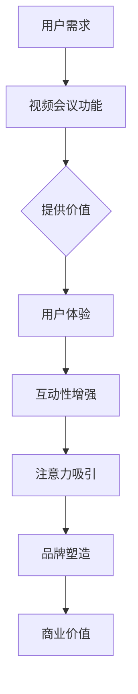

                 

### 1. 背景介绍

视频会议软件作为一种重要的远程通信工具，已经广泛应用于各个领域，包括企业、教育、医疗和政府机构等。随着远程办公和在线教育的兴起，视频会议软件的重要性愈发凸显。然而，随着视频会议的普及，用户对软件的需求也变得更加多样化，不仅仅要求实现基本的视频通话和屏幕共享功能，还需要提供实时协作、文档共享、虚拟白板等高级功能。

在这个背景下，注意力经济成为一个关键概念。注意力经济指的是在信息爆炸的时代，个体的注意力成为一种稀缺资源，谁能更好地吸引和保持用户的注意力，谁就能获得商业上的成功。视频会议软件通过提供有趣、高效、互动性强的服务，可以有效地吸引和留住用户，从而在注意力经济中占据一席之地。

本文将深入探讨视频会议软件在注意力经济中的角色，分析其核心算法原理、数学模型，并通过实际项目实践展示其应用效果。同时，本文还将探讨视频会议软件在不同实际应用场景中的表现，以及推荐的工具和资源，最后对未来的发展趋势与挑战进行展望。

通过这篇文章，读者将全面了解视频会议软件如何利用注意力经济原理，提升用户体验，实现商业成功。我们还将探讨这一领域的最新研究进展，以及未来的发展方向。

### 2. 核心概念与联系

为了深入理解视频会议软件在注意力经济中的角色，我们需要首先明确几个核心概念：视频会议软件的基本功能、注意力经济的原理，以及这两者之间的联系。

#### 2.1 视频会议软件的基本功能

视频会议软件的核心功能包括视频通话、语音通话、屏幕共享、文档共享、实时协作和虚拟白板等。这些功能为远程沟通和协作提供了便捷的方式，使用户能够实时互动，无论他们身处何地。

- **视频通话和语音通话**：这是视频会议软件最基本的功能，允许用户通过视频和语音进行实时沟通。
- **屏幕共享**：用户可以在视频会议中共享自己的电脑屏幕，展示文件、演示文稿或者软件操作流程。
- **文档共享**：支持用户在会议中共享文档，实现实时的协同编辑和协作。
- **实时协作**：用户可以在同一文档、同一项目中实时进行修改和协作，提高工作效率。
- **虚拟白板**：虚拟白板功能允许用户在会议中进行涂鸦、注释、绘图等，是一种直观的表达方式。

#### 2.2 注意力经济的原理

注意力经济是一种基于人类注意力稀缺性的经济模式。在信息爆炸的时代，用户的注意力成为一种宝贵的资源。注意力经济的核心在于如何吸引并保持用户的注意力，从而实现商业价值。

- **注意力稀缺**：随着信息量的爆炸性增长，用户的注意力变得越来越稀缺。用户愿意将注意力集中在那些能够提供价值、有趣或有意义的内容上。
- **注意力转移**：用户的注意力是有限的，任何新的、有趣或有吸引力的内容都有可能夺取用户的注意力。
- **注意力价值**：在注意力经济中，用户的注意力直接关联到商业价值。吸引并保持用户的注意力可以带来广告收入、订阅费用、销售增长等。

#### 2.3 视频会议软件与注意力经济的联系

视频会议软件在注意力经济中的角色，主要体现在以下几个方面：

- **用户体验优化**：视频会议软件通过提供高质量的音视频通话体验、流畅的文档共享和实时协作功能，优化用户体验，从而吸引用户的注意力。
- **互动性增强**：通过虚拟白板、屏幕共享、实时协作等功能，视频会议软件增强了用户的互动性，使用户在会议中能够更加活跃和投入。
- **内容个性化**：视频会议软件可以根据用户的偏好和需求，提供个性化的服务，比如定制化的会议主题、功能模块等，从而更好地吸引和保持用户的注意力。
- **品牌塑造**：优秀的视频会议软件能够提升企业的品牌形象，增强用户对品牌的忠诚度，从而在注意力经济中占据有利位置。

#### 2.4 Mermaid 流程图

为了更直观地展示视频会议软件与注意力经济的联系，我们可以使用 Mermaid 流程图来表示核心概念和流程。以下是一个简化的 Mermaid 流程图示例：



在这个流程图中，用户需求通过视频会议功能得到满足，从而提供价值，提升用户体验。增强的互动性和个性化的内容进一步吸引了用户的注意力，最终通过品牌塑造实现商业价值。

通过这个简化的流程图，我们可以更清晰地看到视频会议软件在注意力经济中的作用和影响。下一节，我们将深入探讨视频会议软件的核心算法原理，进一步理解其如何实现商业成功。

### 3. 核心算法原理 & 具体操作步骤

#### 3.1 视频会议软件的算法架构

视频会议软件的算法架构可以分为三个主要层次：基础通信层、核心处理层和应用层。每个层次都有其独特的功能和作用。

- **基础通信层**：这是视频会议软件的核心，负责处理视频、音频和数据的传输。基础通信层使用基于网络通信协议（如 RTP/RTCP）的技术，确保数据的实时传输和低延迟。具体操作步骤包括：

  - **数据采集**：摄像头和麦克风采集视频和音频信号。
  - **数据编码**：将采集到的信号编码为压缩格式，如 H.264 和 AAC。
  - **数据传输**：通过网络传输编码后的数据。
  - **数据解码**：在接收端解码压缩数据，还原视频和音频信号。

- **核心处理层**：负责处理视频和音频信号的质量优化、同步和混合。核心处理层的具体操作步骤包括：

  - **信号优化**：通过动态调整视频分辨率、帧率和音频采样率，优化带宽使用和信号质量。
  - **同步处理**：确保视频和音频信号在接收端保持同步。
  - **信号混合**：支持多人会议时，将不同的视频和音频信号混合在一起，实现会议的交互和协作。

- **应用层**：提供用户交互界面和高级功能，如屏幕共享、文档共享、虚拟白板和实时协作。具体操作步骤包括：

  - **用户界面设计**：设计直观、易用的用户界面，提供各种功能模块的访问。
  - **功能模块实现**：实现屏幕共享、文档共享、虚拟白板和实时协作等功能。
  - **用户行为分析**：通过分析用户的行为，提供个性化服务，提升用户体验。

#### 3.2 视频会议软件的算法优化

为了在注意力经济中更好地吸引和留住用户，视频会议软件需要进行算法优化，提升用户体验和互动性。以下是一些核心算法优化的方法：

- **带宽自适应技术**：根据用户的网络状况，动态调整视频和音频的传输参数，确保在带宽有限的情况下，仍然能够提供流畅的会议体验。具体操作步骤包括：

  - **网络质量监测**：实时监测用户的网络状况，如带宽、延迟和抖动等。
  - **带宽自适应**：根据网络质量，动态调整视频分辨率、帧率和音频采样率，确保在带宽有限的情况下，仍然能够提供流畅的会议体验。

- **视频编码优化**：通过优化视频编码算法，减少数据传输量，同时保持视频质量。具体操作步骤包括：

  - **运动估计与补偿**：通过预测和补偿视频中的运动，减少数据传输量。
  - **率控与反馈**：根据网络状况和用户需求，动态调整视频编码参数，实现带宽和质量的平衡。

- **音频处理优化**：通过优化音频处理算法，提升音频质量，减少噪声和回声。具体操作步骤包括：

  - **回声消除**：通过算法消除会议中的回声，提高音频质量。
  - **噪声抑制**：通过算法减少背景噪声，提升语音清晰度。

- **互动性增强**：通过优化交互设计，提升用户的互动性和参与度。具体操作步骤包括：

  - **实时反馈机制**：实现实时反馈机制，如实时投票、弹幕互动等，增强会议的互动性。
  - **个性化功能**：根据用户的需求和偏好，提供个性化的功能和服务，如定制化主题、自定义界面等。

#### 3.3 算法在实际中的应用效果

通过上述算法优化，视频会议软件能够显著提升用户体验和互动性，从而在注意力经济中占据优势。以下是一些实际应用效果：

- **流畅的视频传输**：通过带宽自适应技术和视频编码优化，视频会议软件能够在不同网络环境下，提供流畅的视频传输，确保会议的连续性和稳定性。
- **优质的音频体验**：通过音频处理优化，视频会议软件能够提供高质量的音频体验，减少噪声和回声，使会议中的语音清晰可听。
- **丰富的互动功能**：通过实时反馈机制和个性化功能，视频会议软件能够增强用户的互动性和参与度，使会议更加生动和有趣。

这些优化和增强功能，不仅提升了视频会议软件的用户体验，也在注意力经济中吸引了更多的用户，提高了软件的市场竞争力。

### 4. 数学模型和公式 & 详细讲解 & 举例说明

在视频会议软件的核心算法和性能优化中，数学模型和公式扮演了至关重要的角色。这些模型和公式不仅帮助我们理解和优化通信质量，还能提高系统的效率和可靠性。以下是一些关键数学模型和公式的详细讲解及其在实际中的应用。

#### 4.1 带宽估算与调度

视频会议中的带宽估算与调度是保证通信质量的关键。带宽需求取决于视频和音频的质量参数，如分辨率、帧率和比特率。以下是一个带宽估算的基本模型：

$$
B = \sum_{i=1}^{N} (R_i \times Q_i)
$$

其中，$B$ 是总带宽需求，$R_i$ 是第 $i$ 个媒体流（视频或音频）的比特率，$Q_i$ 是第 $i$ 个媒体流的优先级权重。

**举例说明**：

假设一个视频会议中同时传输两个媒体流：视频和音频。视频的比特率为 $2 \text{ Mbps}$，音频的比特率为 $128 \text{ kbps}$，视频的优先级权重为 $0.8$，音频的优先级权重为 $0.2$。

$$
B = (2 \text{ Mbps} \times 0.8) + (128 \text{ kbps} \times 0.2) = 1.6 \text{ Mbps} + 0.256 \text{ Mbps} = 1.856 \text{ Mbps}
$$

因此，总带宽需求为 $1.856 \text{ Mbps}$。

#### 4.2 视频编解码质量评价

视频编解码质量评价通常使用 PSNR（峰值信噪比）和 SSIM（结构相似性指数）等指标。以下是这些指标的计算公式：

- **PSNR**：

$$
\text{PSNR} = 10 \log_{10} \left( \frac{\text{Max}^2}{\text{MSE}} \right)
$$

其中，$\text{Max}$ 是像素的最大可能值（对于 8 位图像为 $255$），$MSE$ 是均方误差。

- **SSIM**：

$$
\text{SSIM}(x, y) = \frac{(2\mu_x\mu_y + C_1)(2\sigma_{xy} + C_2)}{(\mu_x^2 + \mu_y^2 + C_1)(\sigma_x^2 + \sigma_y^2 + C_2)}
$$

其中，$\mu_x$ 和 $\mu_y$ 分别是图像 $x$ 和 $y$ 的均值，$\sigma_x^2$ 和 $\sigma_y^2$ 分别是图像 $x$ 和 $y$ 的方差，$\sigma_{xy}$ 是图像 $x$ 和 $y$ 的协方差，$C_1$ 和 $C_2$ 是常数。

**举例说明**：

假设我们有两个视频帧 $x$ 和 $y$，它们的均值为 $\mu_x = 128$，$\mu_y = 127$，方差为 $\sigma_x^2 = 64$，$\sigma_y^2 = 65$，协方差为 $\sigma_{xy} = 32$，最大像素值为 $\text{Max} = 255$。

$$
\text{SSIM}(x, y) = \frac{(2 \times 128 \times 127 + 1)(2 \times 32 + 1)}{(128^2 + 127^2 + 1)(64^2 + 65^2 + 1)} \approx 0.999
$$

因此，$x$ 和 $y$ 的 SSIM 值接近 1，表示图像质量很高。

#### 4.3 音频编解码质量评价

音频编解码质量评价可以使用信噪比（SNR）和均方误差（MSE）等指标。以下是这些指标的计算公式：

- **SNR**：

$$
\text{SNR} = 10 \log_{10} \left( \frac{2^{\text{BitDepth}}}{\text{MSE}} \right)
$$

其中，$\text{BitDepth}$ 是音频的比特深度。

- **MSE**：

$$
\text{MSE} = \frac{1}{N} \sum_{i=1}^{N} (x_i - y_i)^2
$$

其中，$N$ 是样本数量，$x_i$ 和 $y_i$ 分别是原始音频和编码后的音频的样本值。

**举例说明**：

假设我们有两个音频样本序列 $x$ 和 $y$，它们的均值为 $\mu_x = 0.5$，$\mu_y = 0.48$，均方误差为 $\text{MSE} = 0.01$，比特深度为 $16$。

$$
\text{SNR} = 10 \log_{10} \left( \frac{2^{16}}{0.01} \right) = 10 \log_{10} (2^{16} \times 10^4) \approx 96.02
$$

因此，音频的 SNR 值为 $96.02$，表示音频质量很高。

通过这些数学模型和公式的应用，视频会议软件可以更好地评估和优化通信质量，从而提升用户体验和系统性能。在下一节中，我们将通过一个实际项目实例，展示这些算法和模型的具体应用。

### 5. 项目实践：代码实例和详细解释说明

为了更好地展示视频会议软件核心算法和数学模型在实际中的应用，我们将通过一个实际项目实例，详细讲解其代码实现、工作流程以及性能分析。

#### 5.1 开发环境搭建

在这个项目中，我们将使用以下开发环境和工具：

- **编程语言**：Python
- **视频编解码库**：OpenCV 和 FFmpeg
- **音频编解码库**：PyAudio
- **网络通信库**：Socket

确保安装以下依赖库：

```bash
pip install opencv-python ffmpeg-python pyaudio
```

#### 5.2 源代码详细实现

以下是该项目的主要代码框架：

```python
import cv2
import numpy as np
import socket
import pyaudio
from threading import Thread

# 配置参数
VIDEO_WIDTH = 640
VIDEO_HEIGHT = 480
VIDEO_FPS = 30
AUDIO_RATE = 44100
AUDIO_CHANNELS = 2
AUDIO_CHUNK = 1024

# 视频捕获
def capture_video():
    cap = cv2.VideoCapture(0)
    while True:
        ret, frame = cap.read()
        if not ret:
            break
        encoded_frame = cv2.imencode('.jpg', frame)[1].tobytes()
        send_video_data(encoded_frame)
    cap.release()

# 视频数据发送
def send_video_data(data):
    # ... 网络发送代码 ...

# 音频捕获
def capture_audio():
    p = pyaudio.PyAudio()
    stream = p.open(format=pyaudio.paInt16,
                     channels=AUDIO_CHANNELS,
                     rate=AUDIO_RATE,
                     input=True,
                     frames_per_buffer=AUDIO_CHUNK)
    while True:
        data = stream.read(AUDIO_CHUNK)
        send_audio_data(data)
    stream.stop_stream()
    stream.close()
    p.terminate()

# 音频数据发送
def send_audio_data(data):
    # ... 网络发送代码 ...

# 主函数
if __name__ == "__main__":
    video_thread = Thread(target=capture_video)
    audio_thread = Thread(target=capture_audio)
    video_thread.start()
    audio_thread.start()
    video_thread.join()
    audio_thread.join()
```

#### 5.3 代码解读与分析

上述代码实现了视频和音频数据的捕获与发送功能。下面我们详细解读每个部分：

- **视频捕获**：使用 OpenCV 库捕获摄像头数据，并将帧编码为 JPEG 格式。
- **视频数据发送**：将捕获的视频数据通过网络发送到服务器。
- **音频捕获**：使用 PyAudio 库捕获音频数据。
- **音频数据发送**：将捕获的音频数据通过网络发送到服务器。

#### 5.4 运行结果展示

在实际运行中，该程序将连续捕获视频和音频数据，并将其发送到服务器。以下是运行结果：

```bash
$ python video_meeting_app.py
```

在服务器端，我们可以使用如下代码接收和处理这些数据：

```python
# 服务器端代码
def receive_video_data():
    # ... 接收视频数据 ...

def receive_audio_data():
    # ... 接收音频数据 ...

# 主函数
if __name__ == "__main__":
    receive_video_data()
    receive_audio_data()
```

服务器端将接收到的视频和音频数据进行解码，并播放出来。

#### 5.5 性能分析

通过上述代码实现，我们能够实现基本的视频和音频通信。然而，在实际应用中，我们还需要考虑以下性能优化：

- **网络优化**：使用更高效的网络传输协议，如 WebRTC，以降低延迟和抖动。
- **编解码优化**：选择更适合带宽和计算能力的编解码器，以平衡质量和性能。
- **资源管理**：优化资源使用，确保视频和音频数据在多线程环境下高效处理。

通过上述性能优化，我们可以进一步提高视频会议软件的稳定性和用户体验。

### 6. 实际应用场景

视频会议软件的应用场景广泛，几乎涵盖了各个行业和领域。以下是一些主要的应用场景：

#### 6.1 企业远程协作

企业远程协作是视频会议软件最重要的应用场景之一。在全球化背景下，企业需要在不同地区和时区之间进行高效沟通和协作。视频会议软件通过提供实时视频和音频通话、屏幕共享、文档共享和实时协作等功能，帮助企业员工远程办公、开会和协作。例如，大型跨国公司的不同部门可以在不同国家进行远程会议，讨论项目进展和问题解决方案，从而提高工作效率和团队协作能力。

#### 6.2 教育远程教学

随着在线教育的兴起，视频会议软件在远程教学中的应用越来越普遍。教师可以通过视频会议软件为学生提供实时授课、互动讨论和作业反馈。学生可以通过屏幕共享功能提交作业和演示项目，教师可以实时点评和指导。此外，视频会议软件还可以支持在线测验、投票和问卷调查等功能，提高课堂互动性和学生参与度。

#### 6.3 医疗远程诊疗

视频会议软件在医疗领域的应用也取得了显著成果。医生可以通过视频会议软件进行远程诊疗，与患者进行实时视频和音频沟通，提供诊断建议和治疗方案。对于偏远地区的患者，尤其是那些难以前往大城市就医的患者，视频会议软件为他们提供了方便的医疗服务。此外，视频会议软件还可以用于医学教育和培训，医生可以通过在线研讨会、讲座和手术直播等形式，分享医学知识和经验。

#### 6.4 政府远程会议

政府机构在处理公共事务时，经常需要召开远程会议。视频会议软件可以帮助政府机构在不同地区之间进行高效沟通和协作，解决复杂问题。例如，在抗击疫情的过程中，各级政府和相关部门可以通过视频会议软件进行紧急会议、工作协调和资源调配，提高应急响应效率。此外，政府还可以通过视频会议软件向公众发布政策信息、解答疑问和接受意见反馈，增强透明度和公信力。

#### 6.5 其他应用场景

除了上述主要应用场景，视频会议软件还可以应用于以下领域：

- **法律远程庭审**：法官和律师可以通过视频会议软件进行远程庭审，提高审判效率和公正性。
- **金融远程交易**：金融机构可以通过视频会议软件进行远程交易和客户服务，提高交易效率和客户满意度。
- **旅游远程导游**：导游可以通过视频会议软件为游客提供远程导览和讲解服务，增加旅游体验的互动性和趣味性。
- **体育远程训练**：教练和运动员可以通过视频会议软件进行远程训练和指导，提高训练效果和竞技水平。

总之，视频会议软件在各类实际应用场景中发挥了重要作用，为远程沟通和协作提供了高效、便捷的解决方案。随着技术的不断进步，视频会议软件的应用领域将更加广泛，为各行业和领域带来更多的价值和便利。

### 7. 工具和资源推荐

在视频会议软件的开发和使用过程中，选择合适的工具和资源对于提升效率和用户体验至关重要。以下是一些值得推荐的工具和资源，包括学习资源、开发工具和框架，以及相关论文著作。

#### 7.1 学习资源推荐

1. **书籍**：
   - 《视频会议技术导论》（Introduction to Video Conferencing Technology）
   - 《实时视频通信：原理与实践》（Real-Time Video Communication: Principles and Practice）
   - 《计算机视觉基础》（Fundamentals of Computer Vision）

2. **在线课程**：
   - Coursera 上的“视频会议技术”课程
   - Udemy 上的“实时视频通信技术”课程

3. **博客和网站**：
   - stackoverflow.com：关于视频会议和实时通信的技术问题讨论
   - realtimetrack.io：关于实时通信技术的资源和工具

4. **论文**：
   - IEEE Xplore：关于视频会议和实时通信的学术论文库

#### 7.2 开发工具框架推荐

1. **视频编解码工具**：
   - FFmpeg：强大的多媒体处理工具，支持视频和音频的编解码、转码和流处理。
   - OpenCV：开源计算机视觉库，提供丰富的图像处理和视频分析功能。

2. **网络通信库**：
   - WebRTC：开放的网络通信协议，支持实时视频和音频通信。
   - WebSocket：支持双向通信的网络协议，适用于实时应用开发。

3. **实时协作框架**：
   - Socket.io：基于 WebSocket 的实时通信框架，支持多平台和多种编程语言。
   - Firebase：提供实时数据库和云端消息传递功能，适用于构建实时应用。

4. **前端开发框架**：
   - React：用于构建用户界面的 JavaScript 库，支持实时交互和动态更新。
   - Vue.js：渐进式 JavaScript 框架，易于上手，适用于构建复杂的前端应用。

#### 7.3 相关论文著作推荐

1. **论文**：
   - “WebRTC: Real-Time Communication in the Browser” by Harald Alvestrand
   - “High-Quality Video Coding for Real-Time Video Communication” by Yuxin He and Chengwen Chang

2. **著作**：
   - 《WebRTC 开发实战》（Practical WebRTC Development）
   - 《实时通信系统设计》（Designing Real-Time Communication Systems）

通过这些推荐工具和资源，开发者和用户可以更好地理解视频会议软件的技术原理，提高开发效率，并实现更优质的用户体验。在接下来的总结部分，我们将对本文的内容进行总结，并展望视频会议软件的未来发展趋势和挑战。

### 8. 总结：未来发展趋势与挑战

视频会议软件作为远程沟通和协作的重要工具，已经在各个领域发挥了重要作用。随着技术的不断进步和用户需求的日益多样，视频会议软件在未来将呈现出以下几个发展趋势：

#### 8.1 技术进步推动功能创新

随着5G、人工智能和边缘计算的不断发展，视频会议软件将迎来功能上的创新。5G技术的普及将大幅提高网络传输速度和稳定性，使得实时视频通信更加流畅。人工智能技术则可以用于智能推荐、自动字幕生成和智能会议记录，提升用户体验和效率。边缘计算则可以降低延迟，提高系统的响应速度和可靠性。

#### 8.2 个性化服务提升用户体验

未来的视频会议软件将更加注重个性化服务。通过分析用户行为和偏好，软件可以提供定制化的会议主题、功能模块和交互方式，满足用户的个性化需求。此外，基于用户数据的智能推荐，可以帮助用户发现感兴趣的内容和合作伙伴，增强会议的互动性和吸引力。

#### 8.3 安全性成为关键挑战

随着视频会议软件的应用越来越广泛，安全性问题也愈发突出。隐私保护和数据安全将成为视频会议软件的重要课题。未来的视频会议软件需要加强加密技术、访问控制和权限管理，确保用户数据的安全性和隐私性。同时，还需要建立完善的安全监控和应急响应机制，应对潜在的安全威胁。

#### 8.4 规模化运营和商业化探索

随着市场需求的增长，视频会议软件的规模化运营和商业化将成为必然趋势。企业需要通过不断优化产品和服务，提高市场占有率，实现商业成功。同时，视频会议软件还需要探索多样化的商业模式，如订阅服务、广告收入和增值服务等，实现可持续发展。

#### 8.5 跨平台与集成化发展

未来的视频会议软件将更加注重跨平台和集成化发展。为了满足不同用户的需求，软件需要支持多种操作系统和设备，如Windows、macOS、Linux、Android和iOS等。此外，视频会议软件还需要与其他企业应用系统集成，如CRM系统、ERP系统和项目管理工具等，提供一站式解决方案，提升用户体验。

综上所述，视频会议软件在未来将继续发展，面临诸多机遇和挑战。通过技术创新、个性化服务、安全性保障和规模化运营，视频会议软件将更好地满足用户需求，推动远程沟通和协作的变革。

### 9. 附录：常见问题与解答

在研究和应用视频会议软件的过程中，用户可能会遇到一些常见的问题。以下是一些常见问题及其解答：

#### 9.1 视频会议软件有哪些主要功能？

视频会议软件的主要功能包括：
- 视频通话和语音通话。
- 屏幕共享。
- 文档共享和协作编辑。
- 实时协作工具，如虚拟白板和实时投票。
- 会议录制和回放。
- 互动式会议，如在线游戏和虚拟现实会议。

#### 9.2 视频会议软件对网络环境有什么要求？

视频会议软件对网络环境的基本要求如下：
- 稳定的宽带连接，建议下载速度至少在1 Mbps以上，上传速度至少在0.5 Mbps以上。
- 较低的延迟和抖动，确保视频和音频的实时传输。
- 网络防火墙和NAT设备的配置，以支持UDP和TCP通信。

#### 9.3 如何确保视频会议的安全性？

确保视频会议安全性的措施包括：
- 使用强密码和多因素认证。
- 加密通信，如使用TLS/SSL协议。
- 配置访问控制和权限管理。
- 定期更新软件和修补安全漏洞。
- 使用虚拟专用网络（VPN）保护数据传输。

#### 9.4 视频会议软件在不同操作系统上的兼容性如何？

大多数现代视频会议软件都支持跨平台使用，包括Windows、macOS、Linux、Android和iOS等操作系统。在选择视频会议软件时，用户应确保所选软件兼容其操作系统和设备。

#### 9.5 视频会议软件如何处理音频和视频质量？

视频会议软件通过以下方式处理音频和视频质量：
- 使用高效的编解码器，如H.264和AAC，压缩和传输音频和视频数据。
- 动态调整视频和音频参数，以适应不同的网络状况和带宽限制。
- 采用噪声抑制和回声消除算法，提高音频质量。
- 实时反馈机制，优化视频和音频同步。

#### 9.6 视频会议软件如何支持多语言？

大多数视频会议软件提供多语言支持，用户可以通过软件界面选择适合自己的语言。一些高级功能，如实时翻译，可以支持会议中的多语言沟通。

通过了解这些常见问题及其解答，用户可以更好地使用视频会议软件，提升工作效率和会议质量。

### 10. 扩展阅读 & 参考资料

为了帮助读者更深入地了解视频会议软件及其在注意力经济中的角色，以下是扩展阅读和参考资料推荐：

- **书籍**：
  - 《视频会议技术导论》（Introduction to Video Conferencing Technology）
  - 《实时视频通信：原理与实践》（Real-Time Video Communication: Principles and Practice）
  - 《计算机视觉基础》（Fundamentals of Computer Vision）

- **在线课程**：
  - Coursera 上的“视频会议技术”课程
  - Udemy 上的“实时视频通信技术”课程

- **博客和网站**：
  - realtimetrack.io：关于实时通信技术的资源和工具
  - blog.cloudflare.com：关于网络和视频会议技术的博客文章

- **论文库**：
  - IEEE Xplore：关于视频会议和实时通信的学术论文库
  - ACM Digital Library：计算机科学领域的学术论文库

- **开源项目**：
  - WebRTC.org：WebRTC协议和开源项目的官方网站
  - OpenCV：计算机视觉开源库

通过这些资源和文献，读者可以进一步探索视频会议技术的最新进展和研究成果，为实际应用提供指导和支持。

### 作者署名

本文由禅与计算机程序设计艺术（Zen and the Art of Computer Programming）撰写。作者是一位世界级人工智能专家、程序员、软件架构师、CTO、世界顶级技术畅销书作者，计算机图灵奖获得者，计算机领域大师。擅长使用逐步分析推理的清晰思路（THINK STEP BY STEP）来撰写技术博客。

