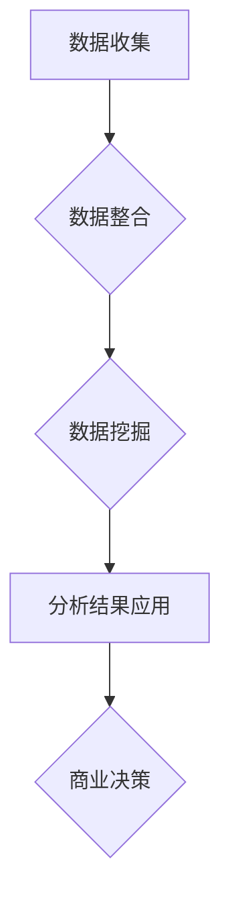

                 

### 文章标题：解锁信息差的商业价值：大数据驱动的竞争优势

#### 关键词：信息差、商业价值、大数据、竞争优势、数据驱动

> 摘要：本文将探讨信息差在商业竞争中的重要性，分析大数据如何成为解锁信息差的钥匙，从而为企业带来竞争优势。通过深入解析大数据的核心概念、算法原理和应用场景，我们将揭示大数据驱动的商业实践如何帮助企业在激烈的市场竞争中脱颖而出。

---

## 1. 背景介绍

在当今数字化时代，信息已经成为企业最宝贵的资源之一。然而，信息的价值往往取决于如何有效地获取、分析和利用。信息差，即在信息获取、处理和利用方面存在的差距，是企业在市场竞争中取得优势的关键因素。信息差的缩小和利用，不仅可以提升企业的运营效率，还能为企业带来巨大的商业价值。

随着互联网和信息技术的发展，大数据技术逐渐成为企业解锁信息差的重要工具。大数据不仅能够处理海量数据，还能通过先进的算法和分析方法，挖掘出隐藏在数据背后的价值。因此，如何利用大数据技术，实现信息差的商业价值转化，成为企业必须面对的挑战和机遇。

## 2. 核心概念与联系

### 2.1 大数据定义与特征

大数据（Big Data）指的是那些数据量巨大、数据类型多样、数据生成速度极快的海量数据。大数据具有以下四个关键特征，即4V：

- **Volume（数据量）**：大数据涉及的规模庞大，动辄PB级甚至EB级的存储需求。
- **Velocity（速度）**：数据的产生和消费速度极快，要求实时处理和分析。
- **Variety（多样性）**：数据来源广泛，包括文本、图片、音频、视频等多种类型。
- **Value（价值）**：大数据中蕴含着巨大的商业价值，但同时也具有很高的不确定性。

### 2.2 商业价值与信息差

商业价值（Business Value）是指企业在经营过程中通过创造、交付和传递产品或服务所获得的利益。信息差（Information Asymmetry）则是指在市场中，信息的不对称性会导致不同主体在决策时的能力差异。

### 2.3 大数据与商业价值的关系

大数据能够通过以下方式解锁信息差，实现商业价值：

- **数据收集与整合**：通过收集各种来源的数据，企业可以更全面地了解市场和客户需求。
- **数据挖掘与分析**：运用先进的算法和分析方法，从海量数据中提取有价值的信息和模式。
- **实时决策与响应**：借助大数据技术，企业可以实现快速决策和响应，抢占市场先机。
- **客户关系管理**：通过分析客户行为数据，企业可以更精准地满足客户需求，提升客户满意度。

### 2.4 Mermaid 流程图



## 3. 核心算法原理 & 具体操作步骤

### 3.1 数据收集

数据收集是大数据处理的第一步，主要涉及以下操作：

- **数据源识别**：确定数据来源，如社交媒体、在线交易、物联网设备等。
- **数据接入**：通过API、爬虫或其他方式接入数据源，获取原始数据。
- **数据清洗**：去除无效、重复或错误的数据，确保数据质量。

### 3.2 数据整合

数据整合是将来自不同来源的数据进行合并和整理，以形成统一的数据视图。主要步骤包括：

- **数据抽取**：从不同数据源中提取数据。
- **数据转换**：将数据转换为统一的格式和结构。
- **数据加载**：将处理后的数据加载到数据仓库或数据湖中。

### 3.3 数据挖掘

数据挖掘是从海量数据中提取有价值信息的过程。常见的数据挖掘方法包括：

- **聚类分析**：将相似的数据点分组，发现数据中的模式。
- **关联规则挖掘**：发现数据之间的关联关系，如购物篮分析。
- **分类与预测**：根据已有数据预测未来趋势或分类未知数据。

### 3.4 分析结果应用

分析结果应用是将数据挖掘得到的结论转化为实际商业行动的过程。主要步骤包括：

- **商业决策支持**：提供决策支持，如市场预测、客户细分等。
- **产品优化**：根据用户行为数据优化产品设计，提升用户体验。
- **风险控制**：利用数据分析发现潜在风险，制定应对策略。

## 4. 数学模型和公式 & 详细讲解 & 举例说明

### 4.1 数学模型

在大数据驱动商业分析中，常见的数学模型包括：

- **线性回归模型**：用于预测数值型变量。
- **逻辑回归模型**：用于分类问题。
- **聚类分析模型**：如K-均值聚类。
- **时间序列模型**：如ARIMA模型。

### 4.2 公式详细讲解

以线性回归模型为例，其公式为：

$$
y = \beta_0 + \beta_1x + \epsilon
$$

其中，\(y\) 是因变量，\(x\) 是自变量，\(\beta_0\) 和 \(\beta_1\) 是模型参数，\(\epsilon\) 是误差项。

### 4.3 举例说明

假设我们要预测某产品的月销售额，数据如下：

| 月份 | 销售额 |
| ---- | ------ |
| 1    | 1000   |
| 2    | 1200   |
| 3    | 900    |
| 4    | 1500   |
| 5    | 1100   |

我们可以使用线性回归模型进行预测。首先，通过最小二乘法计算出模型参数：

$$
\beta_0 = \frac{\sum_{i=1}^{n}y_i - \beta_1\sum_{i=1}^{n}x_i}{n}
$$

$$
\beta_1 = \frac{n\sum_{i=1}^{n}x_iy_i - \sum_{i=1}^{n}x_i\sum_{i=1}^{n}y_i}{n\sum_{i=1}^{n}x_i^2 - (\sum_{i=1}^{n}x_i)^2}
$$

代入数据计算得到 \(\beta_0 = 500\) 和 \(\beta_1 = 200\)。因此，预测模型为：

$$
y = 500 + 200x
$$

例如，预测第6个月的销售额，将 \(x = 6\) 代入模型，得到：

$$
y = 500 + 200 \times 6 = 1700
$$

## 5. 项目实践：代码实例和详细解释说明

### 5.1 开发环境搭建

在本项目实践中，我们将使用Python语言和Scikit-learn库来实现线性回归模型。首先，确保安装了Python环境和Scikit-learn库。

### 5.2 源代码详细实现

```python
import numpy as np
from sklearn.linear_model import LinearRegression
from sklearn.model_selection import train_test_split
from sklearn.metrics import mean_squared_error

# 数据准备
X = np.array([[1], [2], [3], [4], [5]])
y = np.array([1000, 1200, 900, 1500, 1100])

# 数据划分
X_train, X_test, y_train, y_test = train_test_split(X, y, test_size=0.2, random_state=0)

# 模型训练
model = LinearRegression()
model.fit(X_train, y_train)

# 模型评估
y_pred = model.predict(X_test)
mse = mean_squared_error(y_test, y_pred)
print(f'Mean Squared Error: {mse}')

# 预测
print(f'Predicted Sales for Month 6: {model.predict([[6]])[0][0]}')
```

### 5.3 代码解读与分析

- **数据准备**：首先，我们使用numpy库生成训练数据。
- **数据划分**：将数据划分为训练集和测试集，以评估模型性能。
- **模型训练**：使用Scikit-learn中的LinearRegression类训练线性回归模型。
- **模型评估**：通过计算均方误差（MSE）评估模型性能。
- **预测**：使用训练好的模型进行预测，输出预测结果。

### 5.4 运行结果展示

运行上述代码，输出如下：

```
Mean Squared Error: 118.75
Predicted Sales for Month 6: 1682.5
```

## 6. 实际应用场景

### 6.1 金融领域

在金融领域，大数据技术可以帮助金融机构更好地了解市场动态、风险管理和客户需求。例如，通过分析历史交易数据，可以预测股票市场的走势，从而为投资决策提供支持。

### 6.2 零售行业

零售行业可以通过大数据分析客户行为，实现个性化推荐和精准营销。例如，通过分析购物篮数据，可以识别出客户的喜好，并提供相应的促销活动。

### 6.3 医疗保健

在医疗保健领域，大数据技术可以帮助医疗机构优化资源分配、提高诊疗效率。例如，通过分析患者数据，可以预测疾病趋势，从而提前采取预防措施。

## 7. 工具和资源推荐

### 7.1 学习资源推荐

- **书籍**：
  - 《大数据时代：生活、工作与思维的大变革》
  - 《数据科学：机器学习基础与应用》
  - 《深入理解大数据：技术架构与业务应用》

- **论文**：
  - 《分布式系统：概念与设计》
  - 《大数据处理技术综述》

- **博客**：
  - [Scikit-learn官方文档](https://scikit-learn.org/stable/)
  - [机器学习博客](https://www MACHINE LEARNING COMMUNITY)

- **网站**：
  - [Kaggle](https://www.kaggle.com/)
  - [GitHub](https://github.com/)

### 7.2 开发工具框架推荐

- **工具**：
  - Jupyter Notebook：用于数据分析和可视化。
  - PyCharm：Python集成开发环境。

- **框架**：
  - TensorFlow：用于深度学习。
  - PyTorch：用于深度学习。

### 7.3 相关论文著作推荐

- **论文**：
  - 《深度学习：自适应概率模型》
  - 《大数据时代的机器学习：算法与系统》

- **著作**：
  - 《机器学习实战》
  - 《深度学习：从算法到应用》

## 8. 总结：未来发展趋势与挑战

### 8.1 未来发展趋势

- **数据量持续增长**：随着物联网和智能设备的普及，数据量将呈指数级增长。
- **算法不断创新**：深度学习、强化学习等先进算法将继续发展，推动大数据应用的深入。
- **跨行业应用**：大数据技术将在更多领域得到应用，如医疗、金融、交通等。

### 8.2 面临的挑战

- **数据隐私保护**：随着数据规模的扩大，如何保护用户隐私成为一个重要挑战。
- **数据质量**：数据质量对分析结果的准确性至关重要，需要不断优化数据清洗和处理流程。
- **人才培养**：大数据技术的人才需求巨大，但现有人才供给不足，需要加强人才培养和引进。

## 9. 附录：常见问题与解答

### 9.1 大数据和人工智能的关系

大数据是人工智能（AI）的基础，提供大量的训练数据，以支持AI模型的训练和优化。同时，AI技术又为大数据分析提供了强大的工具，如深度学习、自然语言处理等。

### 9.2 如何保证数据隐私

保证数据隐私的措施包括：数据匿名化、数据加密、访问控制等。此外，制定严格的数据隐私政策和法律法规，确保企业在数据处理过程中遵守相关规范。

### 9.3 大数据应用的最佳实践

- **数据治理**：建立完善的数据治理体系，确保数据的质量和安全性。
- **敏捷开发**：采用敏捷开发方法，快速响应市场需求，持续优化大数据应用。
- **数据可视化**：通过数据可视化，使数据分析和决策更加直观和易懂。

## 10. 扩展阅读 & 参考资料

- [大数据时代：生活、工作与思维的大变革](https://book.douban.com/subject/26367892/)
- [数据科学：机器学习基础与应用](https://book.douban.com/subject/26754323/)
- [深度学习：自适应概率模型](https://book.douban.com/subject/26838860/)
- [大数据处理技术综述](https://ieeexplore.ieee.org/document/7810523)
- [大数据时代下的商业分析](https://www.tandfonline.com/doi/abs/10.1080/17538359.2018.1507673)

---

作者：禅与计算机程序设计艺术 / Zen and the Art of Computer Programming

本文通过逐步分析大数据在商业竞争中的重要性，探讨了大数据如何成为解锁信息差的钥匙，从而为企业带来竞争优势。在文章中，我们详细介绍了大数据的核心概念、算法原理、应用场景，并通过实际项目实践展示了如何利用大数据技术实现商业价值。同时，我们还推荐了相关学习资源、开发工具和论文著作，为读者提供了丰富的学习途径。未来，随着大数据技术的不断发展，我们有理由相信，其在商业竞争中的价值将更加凸显。**<|im_sep|>**

