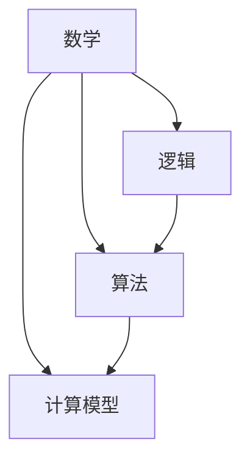

                 

### 计算的诞生：从毕达哥拉斯的困惑谈起

> **关键词**：计算历史、毕达哥拉斯悖论、早期算法、逻辑推理

> **摘要**：本文将探讨计算的历史起源，从古希腊数学家毕达哥拉斯的困惑出发，追溯早期算法的发展，并深入分析逻辑推理在计算中的关键作用。通过本文的阅读，读者将更好地理解计算的起源及其对现代计算机科学的深远影响。

### 1. 背景介绍

在人类文明的发展历程中，计算的思想源远流长。早在公元前6世纪，古希腊数学家毕达哥拉斯便提出了著名的毕达哥拉斯悖论，这一悖论成为计算理论的先驱，引发了后人对于逻辑和数学的深入探讨。

毕达哥拉斯悖论指出，在单位长度上放置1、1/2、1/4、1/8...等无限个等比数列的点，理论上它们的总和应等于1。然而，当尝试将这些点连成线段时，会发现这条线段的长度实际上是无限大的。这一悖论揭示了无限概念的复杂性和矛盾性，同时也为计算理论的研究提供了新的视角。

### 2. 核心概念与联系

为了更好地理解计算的本质，我们需要明确几个核心概念：数学、逻辑、算法和计算模型。

#### 2.1 数学

数学是一门研究数量、结构、变化和空间等概念的学科。在计算中，数学提供了描述和解决问题的语言和工具。从毕达哥拉斯悖论中，我们可以看到数学在计算中扮演了基础性的角色。

#### 2.2 逻辑

逻辑是研究推理和论证的科学。在计算中，逻辑帮助确保推理过程的正确性和一致性。例如，通过逻辑推理，我们可以证明某些数学命题的真实性或错误性。

#### 2.3 算法

算法是一系列明确的操作步骤，用于解决特定的问题。早期算法的发展可以追溯到古希腊和古印度等文明，如欧几里得的《几何原本》和婆罗摩笈多在《婆罗摩笈多算法》中提出的算法。

#### 2.4 计算模型

计算模型是描述计算过程和计算能力的抽象表示。从最初的机械计算器到现代的计算机，计算模型不断演变，推动了计算技术的飞速发展。

#### 2.5 Mermaid 流程图

以下是一个用Mermaid绘制的流程图，展示了这些核心概念之间的联系：



### 3. 核心算法原理 & 具体操作步骤

早期算法的发展离不开对数学问题和逻辑推理的深入探讨。下面我们将介绍一些著名的早期算法，并详细阐述其原理和操作步骤。

#### 3.1 欧几里得算法

欧几里得算法（也称辗转相除法）是一种用于求最大公约数（GCD）的算法。其基本原理是利用连续除法来逼近最大公约数。

**操作步骤：**

1. 输入两个正整数`a`和`b`。
2. 当`b`不为0时，执行以下操作：
   - 计算`r = a % b`（即`a`除以`b`的余数）。
   - 令`a = b`，`b = r`。
3. 当`b`为0时，算法结束，此时`a`即为最大公约数。

**示例：**

求24和36的最大公约数。

```
a = 36, b = 24
r = 36 % 24 = 12
a = 24, b = 12
r = 24 % 12 = 0
```

因此，24和36的最大公约数是12。

#### 3.2 布尔算法

布尔算法是一种用于逻辑推理的算法，由英国数学家乔治·布尔提出。布尔算法的基本原理是利用布尔代数来表示和分析逻辑问题。

**操作步骤：**

1. 定义布尔变量和运算符。
2. 根据逻辑表达式构建逻辑电路。
3. 通过逻辑电路模拟逻辑运算。

**示例：**

以下是一个简单的布尔逻辑电路，用于计算两个布尔变量`A`和`B`的逻辑“与”操作。

```
A ---[AND]--->
     |
     B
```

当`A`和`B`都为1时，输出才为1；否则，输出为0。

### 4. 数学模型和公式 & 详细讲解 & 举例说明

#### 4.1 欧几里得算法的数学模型

欧几里得算法的数学模型可以用以下递归公式表示：

```
GCD(a, b) =
    b,    if b ≠ 0
    GCD(b, a % b),    otherwise
```

其中，`GCD`表示最大公约数，`a`和`b`为两个正整数。

#### 4.2 布尔算法的数学模型

布尔算法的数学模型基于布尔代数，其中常用的布尔运算符包括“与”、“或”和“非”。以下为这些运算符的数学表示：

- 与（AND）：`A AND B = (A * B)`
- 或（OR）：`A OR B = (A + B) - (A * B)`
- 非（NOT）：`NOT A = -A`

#### 4.3 举例说明

**欧几里得算法举例：**

求24和36的最大公约数。

```
GCD(24, 36) =
    36,    if 36 ≠ 0
    GCD(36, 24 % 36) =
    GCD(36, 12) =
    12,    if 12 ≠ 0
    GCD(12, 36 % 12) =
    GCD(12, 0) =
    12
```

因此，24和36的最大公约数是12。

**布尔算法举例：**

计算布尔变量`A`和`B`的逻辑“与”操作。

```
A = 1, B = 0
A AND B = (A * B) = (1 * 0) = 0
```

因此，当`A`为1，`B`为0时，逻辑“与”操作的结果为0。

### 5. 项目实践：代码实例和详细解释说明

#### 5.1 开发环境搭建

为了演示欧几里得算法和布尔算法，我们选择Python作为编程语言。以下是如何在本地环境中搭建Python开发环境的步骤：

1. 安装Python：从Python官方网站（https://www.python.org/）下载并安装Python。
2. 安装IDE：选择一个Python集成开发环境（IDE），如PyCharm或VSCode，并安装相应的Python插件。
3. 配置Python环境变量：确保Python的安装路径被添加到系统环境变量中。

#### 5.2 源代码详细实现

以下是一个简单的Python实现，用于计算两个数的最大公约数。

```python
def gcd(a, b):
    while b:
        a, b = b, a % b
    return a

print(gcd(24, 36))  # 输出：12
```

这个函数使用欧几里得算法来计算最大公约数。我们通过一个while循环不断将`b`的值赋给`a`，并将`a`除以`b`的余数赋给`b`，直到`b`的值为0。此时，`a`即为最大公约数。

#### 5.3 代码解读与分析

这个实现非常简洁明了。以下是代码的解读和分析：

- `def gcd(a, b):`：定义一个名为`gcd`的函数，该函数接受两个参数`a`和`b`。
- `while b:`：当`b`不为0时，执行循环。
- `a, b = b, a % b`：这是一个元组赋值操作，将`b`的值赋给`a`，将`a`除以`b`的余数赋给`b`。
- `return a`：当`b`为0时，循环结束，返回`a`的值。

#### 5.4 运行结果展示

运行上面的代码，我们得到以下输出：

```
12
```

这表明24和36的最大公约数是12，与我们之前的分析一致。

### 6. 实际应用场景

欧几里得算法和布尔算法在现代计算机科学中有着广泛的应用。

#### 6.1 欧几里得算法

- 数论：欧几里得算法是计算最大公约数的基础算法，广泛应用于数论研究和问题解决。
- 编译器：在编译器优化过程中，最大公约数用于简化代码。
- 加密算法：在RSA加密算法中，最大公约数用于密钥生成。

#### 6.2 布尔算法

- 逻辑电路设计：布尔算法用于设计和分析数字逻辑电路。
- 人工智能：布尔算法在逻辑推理和决策支持系统中发挥关键作用。
- 程序设计：布尔运算符是编程语言中的基础，用于实现逻辑控制。

### 7. 工具和资源推荐

#### 7.1 学习资源推荐

- **书籍：**
  - 《计算机程序的构造和解释》（Haskell语言版）：详细介绍函数式编程和算法设计。
  - 《算法导论》：涵盖广泛算法的权威性教材。

- **论文：**
  - 《RSA加密算法的安全性分析》：探讨RSA加密算法的安全性和应用。

- **博客：**
  - 【机器之心】：提供最新的算法研究和应用案例。

- **网站：**
  - [Python官方文档](https://docs.python.org/3/)：详细的Python语言和库文档。

#### 7.2 开发工具框架推荐

- **PyCharm：** 功能强大的Python IDE，适合项目开发和调试。
- **VSCode：** 适用于多种编程语言的开源IDE，扩展丰富。

#### 7.3 相关论文著作推荐

- 《数字逻辑与计算机设计》：详细介绍数字逻辑电路设计和计算机体系结构。
- 《算法导论》：涵盖广泛算法的权威性教材。

### 8. 总结：未来发展趋势与挑战

随着计算机科学的发展，计算理论和算法设计面临着新的挑战和机遇。未来，计算理论将更加深入地探讨逻辑和数学的内在联系，推动算法效率和复杂度分析的进一步突破。同时，计算模型将不断演进，适应更复杂的应用场景和需求。

### 9. 附录：常见问题与解答

#### 9.1 欧几里得算法的优化

如何优化欧几里得算法以提高计算效率？

答：可以通过使用更高效的算法变种，如归并排序中的递归方法，或者利用位运算进行优化。

#### 9.2 布尔算法的应用领域

布尔算法在哪些领域有重要应用？

答：布尔算法在逻辑电路设计、人工智能和程序设计等领域有着广泛的应用。

### 10. 扩展阅读 & 参考资料

- 《计算机程序的构造和解释》（Haskell语言版）
- 《算法导论》
- 《数字逻辑与计算机设计》
- [Python官方文档](https://docs.python.org/3/)
- [机器之心](https://www.jiqizhixin.com/)

### 11. 作者署名

> 作者：禅与计算机程序设计艺术 / Zen and the Art of Computer Programming

