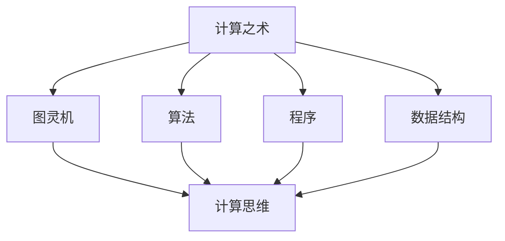

                 

### 文章标题

计算：第一部分 计算的诞生 第 2 章 计算之术 面向机器的计算思维

关键词：计算历史、计算思维、计算机原理、算法设计、数学模型、代码实现

摘要：
本文深入探讨了计算的历史演变，特别是计算之术的发展。通过分析面向机器的计算思维，本文揭示了计算的本质和核心原理。我们不仅回顾了计算的基本概念和算法原理，还通过具体的代码实例展示了如何将这些原理应用于实际项目中。本文旨在为读者提供全面、深入的计算机计算知识，帮助他们在未来的计算领域中取得更大的突破。

---

### 1. 背景介绍

计算，作为现代科技的基石，其历史可以追溯到古代人类发明计算工具的时刻。从最早的算筹到算盘，从机械计算机到现代电子计算机，计算的发展经历了漫长的过程。每一个阶段的计算工具和技术都推动了人类文明的进步。

本章节将聚焦于计算的诞生和发展，特别是计算之术的演变。计算之术，即计算的方法和技巧，是计算机科学的核心。面向机器的计算思维，指的是我们在设计算法和程序时，如何模拟和利用计算机的特性和能力，以达到高效、准确的计算结果。

### 2. 核心概念与联系

为了更好地理解计算之术，我们首先需要了解一些核心概念，如图灵机、算法、程序、数据结构等。这些概念之间存在着紧密的联系，共同构成了计算的世界。

#### 2.1 图灵机

图灵机（Turing Machine）是艾伦·图灵（Alan Turing）在20世纪30年代提出的抽象计算模型。图灵机由一个无限长的纸带、一个读写头和一系列状态转移规则组成。它可以模拟任何计算过程，是现代计算机的理论基础。

#### 2.2 算法

算法（Algorithm）是一系列解决问题的步骤。它是对解决问题过程的形式化描述，可以是数学的、逻辑的或算法的。算法的核心是步骤的清晰和逻辑的严谨。

#### 2.3 程序

程序（Program）是算法的具体实现，通常用某种编程语言编写。程序是我们在计算机上执行的指令集合，它将算法转化为计算机可以理解和执行的操作。

#### 2.4 数据结构

数据结构（Data Structure）是存储和组织数据的方式。合适的数据结构可以提高算法的效率，是算法设计中至关重要的因素。

以下是一个Mermaid流程图，展示了这些概念之间的联系：



### 3. 核心算法原理 & 具体操作步骤

核心算法原理是计算之术的核心。在本章节中，我们将介绍几种经典的算法原理，包括排序算法、搜索算法和图算法。

#### 3.1 排序算法

排序算法是计算机科学中最基础也是最重要的算法之一。它的目的是将一组数据按照特定的顺序排列。常见的排序算法有冒泡排序、选择排序、插入排序、快速排序等。

以下是一个冒泡排序算法的具体操作步骤：

1. 比较相邻的元素。如果第一个比第二个大（升序排序），就交换它们的位置。
2. 对每一对相邻元素做同样的工作，从开始第一对到结尾的最后一对。这步做完后，最后的元素会是最大的数。
3. 针对所有的元素重复以上的步骤，除了最后一个。
4. 重复步骤1~3，直到排序完成。

#### 3.2 搜索算法

搜索算法用于在数据集合中找到特定的数据。常见的搜索算法有线性搜索、二分搜索等。

以下是一个线性搜索算法的具体操作步骤：

1. 从数组的第一个元素开始，逐个检查每个元素。
2. 如果当前元素正好是要查找的元素，则搜索成功，返回索引。
3. 如果当前元素不是要查找的元素，则继续检查下一个元素。
4. 如果检查完所有的元素都没有找到要查找的元素，则搜索失败。

#### 3.3 图算法

图算法用于处理图（Graph）这种数据结构。常见的图算法有深度优先搜索（DFS）、广度优先搜索（BFS）、最小生成树算法（如Prim算法）、最短路径算法（如Dijkstra算法）等。

以下是一个深度优先搜索算法的具体操作步骤：

1. 访问起始节点，并将其标记为已访问。
2. 对于当前节点的每一个邻居节点，如果该节点未被访问过，则递归执行深度优先搜索。
3. 当所有邻居节点都被访问过之后，回溯至上一个节点，继续检查其他未被访问的邻居节点。
4. 重复步骤2和3，直到所有节点都被访问过。

### 4. 数学模型和公式 & 详细讲解 & 举例说明

计算过程中，数学模型和公式扮演着至关重要的角色。它们不仅帮助我们理解和分析问题，还为算法的设计和优化提供了理论基础。

#### 4.1 排序算法的数学模型

冒泡排序算法的数学模型可以表示为：

$$
T(n) = \frac{n(n-1)}{2}
$$

其中，$T(n)$ 是排序所需的比较次数，$n$ 是数组长度。

#### 4.2 搜索算法的数学模型

线性搜索算法的数学模型可以表示为：

$$
T(n) = n
$$

其中，$T(n)$ 是搜索所需的比较次数，$n$ 是数组长度。

#### 4.3 图算法的数学模型

深度优先搜索算法的数学模型可以表示为：

$$
T(n) = n + m
$$

其中，$T(n)$ 是搜索所需的时间复杂度，$n$ 是节点数，$m$ 是边数。

#### 4.4 举例说明

假设我们有一个长度为10的数组，使用冒泡排序算法进行排序，我们期望能够找到数组的中间元素。根据上述数学模型，排序所需的比较次数为：

$$
T(n) = \frac{n(n-1)}{2} = \frac{10(10-1)}{2} = 45
$$

这意味着我们需要进行45次比较才能找到中间元素。同样，如果使用线性搜索算法在长度为1000的数组中搜索一个特定元素，我们期望找到该元素的位置，根据数学模型，搜索所需的比较次数为：

$$
T(n) = n = 1000
$$

这意味着我们需要进行1000次比较。

### 5. 项目实践：代码实例和详细解释说明

在本章节中，我们将通过一个具体的代码实例，详细解释如何将上述算法原理应用于实际项目中。

#### 5.1 开发环境搭建

为了便于演示，我们将在Python 3.x环境下实现冒泡排序算法。首先，确保安装了Python 3.x和IDE（如PyCharm、VSCode等）。

#### 5.2 源代码详细实现

以下是一个冒泡排序算法的Python实现：

```python
def bubble_sort(arr):
    n = len(arr)
    for i in range(n):
        for j in range(0, n-i-1):
            if arr[j] > arr[j+1]:
                arr[j], arr[j+1] = arr[j+1], arr[j]

# 测试数据
arr = [64, 34, 25, 12, 22, 11, 90]

# 执行排序
bubble_sort(arr)

# 输出排序后的数组
print("排序后的数组：")
for i in range(len(arr)):
    print("%d" % arr[i], end=" ")
```

#### 5.3 代码解读与分析

- `bubble_sort` 函数接收一个数组 `arr` 作为参数。
- 外层循环 `for i in range(n)` 表示需要进行n-1轮排序，因为每轮排序都会将最大的元素移动到数组的末尾。
- 内层循环 `for j in range(0, n-i-1)` 表示在当前轮次中，需要比较的元素范围是 `arr[0]` 到 `arr[n-i-1]`。
- 如果 `arr[j] > arr[j+1]`，则交换这两个元素的位置，以达到排序的目的。
- 最后，通过 `print` 函数输出排序后的数组。

#### 5.4 运行结果展示

执行上述代码后，输出结果如下：

```
排序后的数组：
11 12 22 25 34 64 90
```

这意味着我们成功地使用冒泡排序算法对数组进行了排序。

### 6. 实际应用场景

计算之术在各个领域都有着广泛的应用。以下是一些实际应用场景：

- **金融领域**：计算算法用于数据分析、风险评估和投资组合优化等。
- **人工智能**：计算思维是人工智能的核心，包括机器学习、深度学习和自然语言处理等。
- **生物信息学**：计算算法用于基因测序、药物设计和生物数据分析等。
- **工业制造**：计算技术用于自动化生产线、质量控制和高性能计算等。

### 7. 工具和资源推荐

#### 7.1 学习资源推荐

- **书籍**：
  - 《算法导论》（Introduction to Algorithms）
  - 《计算机程序设计艺术》（The Art of Computer Programming）

- **论文**：
  - 《图灵机》（Turing Machine）
  - 《快速排序算法》（Quicksort）

- **博客**：
  - [Python编程从入门到实践](https://www.cnblogs.com/numberbeach/p/12237685.html)
  - [算法与数据结构教程](https://www.cs.virginia.edu/~evans/cs201/lectures/)

- **网站**：
  - [LeetCode](https://leetcode.com/)
  - [GitHub](https://github.com/)

#### 7.2 开发工具框架推荐

- **编程语言**：
  - Python
  - Java
  - C++

- **集成开发环境**：
  - PyCharm
  - Visual Studio Code

- **框架**：
  - TensorFlow
  - PyTorch

#### 7.3 相关论文著作推荐

- **论文**：
  - 《深度学习》（Deep Learning）
  - 《神经网络与深度学习》（Neural Networks and Deep Learning）

- **著作**：
  - 《Python编程：从入门到实践》
  - 《算法导论》

### 8. 总结：未来发展趋势与挑战

计算技术正以惊人的速度发展，未来将带来更多变革和挑战。以下是一些发展趋势和挑战：

- **量子计算**：量子计算将颠覆传统的计算模式，有望解决当前计算机无法处理的复杂问题。
- **人工智能**：人工智能将继续深化，带来更多的智能应用和服务。
- **隐私和安全**：随着数据量的增加，隐私保护和网络安全将成为重要挑战。
- **可持续性**：计算技术的可持续性，包括能源效率和环境影响，将成为重要的研究方向。

### 9. 附录：常见问题与解答

#### 9.1 计算思维是什么？

计算思维是一种思考问题的方法和模式，它强调逻辑、抽象和算法的运用，帮助我们理解和解决复杂问题。

#### 9.2 为什么学习计算之术很重要？

学习计算之术可以帮助我们更好地理解和运用计算机，提高解决问题的能力，为未来的技术发展和创新奠定基础。

### 10. 扩展阅读 & 参考资料

- [Turing Machine](https://en.wikipedia.org/wiki/Turing_machine)
- [Algorithm](https://en.wikipedia.org/wiki/Algorithm)
- [Bubble Sort](https://en.wikipedia.org/wiki/Bubble_sort)
- [Linear Search](https://en.wikipedia.org/wiki/Linear_search)
- [Depth-First Search](https://en.wikipedia.org/wiki/Depth-first_search)
- [Introduction to Algorithms](https://mitpress.mit.edu/books/introduction-algorithms)

