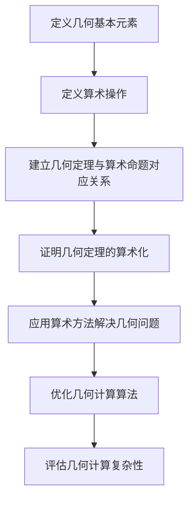

                 

### 1. 背景介绍

计算理论的形成是现代计算机科学和数学领域的一个重要里程碑。它不仅为我们提供了理解和构建计算模型的基础，还深刻影响了计算机硬件和软件的发展。在计算理论的漫长历史中，许多重要的理论和概念被提出，其中希尔伯特进路（Hilbert's program）是最具影响力和挑战性的之一。

希尔伯特进路由德国数学家戴维·希尔伯特（David Hilbert）在20世纪初提出，旨在解决数学基础危机。这一危机主要源于数学内部逻辑矛盾的发现，如罗素-怀特海德悖论（Russell-Whitehead paradox）和布尔巴基悖论（Burali-Forti paradox）。希尔伯特认为，通过形式化数学和逻辑，我们可以证明数学定理的可靠性，并消除这些矛盾。

希尔伯特进路的核心思想是，通过建立一套严格的逻辑体系，将数学问题转化为可计算的命题，从而解决数学基础问题。这一进路包括两个方面：一是几何的算术基础（arithmetic foundation of geometry），二是逻辑的基础（logical foundation）。在本章中，我们将重点关注几何的算术基础，探讨希尔伯特是如何通过算术来解释几何问题的。

希尔伯特进路在当时引起了广泛的关注和争议。许多数学家认为，通过形式化数学，我们能够建立一套完美的逻辑体系，从而消除数学中的矛盾。然而，也有数学家担心，这种形式化可能导致数学失去其直观性和创造性。此外，随着计算机科学的兴起，人们开始重新审视希尔伯特进路，并尝试将其应用于计算理论的研究。

本章将首先介绍几何的算术基础的基本概念，然后讨论希尔伯特是如何将几何问题转化为算术问题的。我们将通过具体例子展示这一转化过程，并分析希尔伯特进路的优点和局限性。最后，我们将讨论几何的算术基础对计算理论的贡献，以及它对我们理解现代计算机科学的启示。

### 2. 核心概念与联系

#### 几何的算术基础基本概念

几何的算术基础是希尔伯特进路的一个重要组成部分，它试图将几何问题形式化，以算术的方式来解决。这一过程涉及到多个核心概念，包括几何的基本元素（点、线、面）、算术操作（加法、减法、乘法、除法）以及几何证明的算术化。

首先，几何的基本元素是构成几何空间的基础。点是最基本的几何元素，它没有大小和形状，仅仅表示空间中的一个位置。线是由无数个点连成的，具有长度但没有宽度。面是由无数条线围成的，具有长度和宽度。这些基本元素可以通过组合形成更复杂的几何结构。

其次，算术操作是几何的算术基础中的关键。通过加法、减法、乘法和除法，我们可以对几何元素进行运算。例如，两个点之间的距离可以通过减法计算，两条线之间的角度可以通过乘法计算。这些算术操作为几何问题的计算提供了工具。

最后，几何证明的算术化是几何的算术基础的核心。传统的几何证明依赖于直观的几何直觉和逻辑推理。而几何的算术化则试图将几何证明转化为算术证明，即通过算术运算来证明几何命题。这需要将几何定理转化为可计算的命题，并使用算术方法来证明。

#### 几何的算术基础与数学理论的关系

几何的算术基础与数学理论有着密切的关系。一方面，几何问题可以通过算术来解决，从而为数学理论提供了新的方法和工具。另一方面，几何的算术基础也反过来推动了数学理论的发展。

例如，希尔伯特在《几何基础》一书中提出了公理化几何理论，将几何的基本概念和定理建立在严格的逻辑体系之上。这一理论为几何的算术化提供了坚实的基础。此外，几何的算术基础也促进了数论、代数和逻辑等领域的研究。通过将几何问题转化为算术问题，数学家们得以运用算术方法来解决几何问题，从而推动了数学理论的发展。

#### 几何的算术基础与计算理论的关系

几何的算术基础对计算理论也产生了深远的影响。随着计算机科学的兴起，几何问题逐渐成为计算理论的研究重点之一。通过将几何的算术基础应用于计算，我们能够解决许多复杂的几何问题，从而推动了计算机几何的发展。

例如，计算机图形学中的许多问题，如三维建模、图像处理和计算机视觉，都需要解决几何问题。几何的算术基础为此提供了有效的算法和工具。通过将几何问题转化为算术问题，计算机科学家们能够开发出高效的算法，从而实现几何计算的高性能。

此外，几何的算术基础也为计算复杂性理论提供了新的研究视角。计算复杂性理论研究计算问题的难度和效率，而几何的算术基础为计算复杂性理论提供了一种新的分类方法。通过分析几何问题的计算复杂性，我们能够更好地理解计算问题的本质，从而为开发更高效的算法提供指导。

#### 架构与流程图

为了更好地理解几何的算术基础，我们可以使用Mermaid流程图来展示其基本架构和流程。以下是一个简单的Mermaid流程图示例，用于描述几何的算术基础的基本流程：



在这个流程图中，A节点表示定义几何的基本元素，如点、线、面；B节点表示定义算术操作，如加法、减法、乘法和除法；C节点表示建立几何定理与算术命题的对应关系；D节点表示证明几何定理的算术化；E节点表示应用算术方法解决几何问题；F节点表示优化几何计算算法；G节点表示评估几何计算复杂性。

通过这个流程图，我们可以清晰地看到几何的算术基础是如何从基本元素、算术操作到几何定理证明、几何问题解决和算法优化等各个方面进行展开的。

### 3. 核心算法原理 & 具体操作步骤

几何的算术基础的核心在于如何将几何问题转化为算术问题，并利用算术方法进行解决。这一过程涉及多个关键步骤，包括几何问题的形式化表示、算术化的转化、算术证明以及算法优化。

#### 几何问题的形式化表示

几何问题的形式化表示是几何的算术化的第一步。它涉及到将几何对象和几何关系转化为数学语言，以数学命题的形式进行描述。例如，一个几何问题可能涉及点的坐标、线的长度、角的大小等。通过定义数学函数和运算符，我们可以将几何问题转化为数学表达式。

具体操作步骤如下：

1. **定义几何对象和关系**：首先，我们需要明确几何问题中的基本对象和关系。例如，点、线、面以及它们之间的距离、角度关系。
2. **建立数学模型**：使用数学语言和符号，将几何对象和关系表示为数学命题。例如，可以使用坐标系来表示点，使用欧几里得距离公式来计算两点之间的距离，使用三角函数来计算角度。
3. **形式化表示**：将上述数学命题形式化，即用逻辑语言（如谓词逻辑）表示几何问题的所有条件和结论。

#### 算术化的转化

一旦几何问题被形式化表示，下一步就是将其转化为算术问题。算术化的目的是将几何问题转化为可以使用算术方法（如加法、减法、乘法、除法）进行解决的问题。

具体操作步骤如下：

1. **定义算术操作**：根据几何问题的特性，定义适当的算术操作。例如，对于点之间的距离，可以使用欧几里得距离公式进行计算；对于角度，可以使用三角函数进行计算。
2. **建立算术命题**：将几何问题的条件和结论转化为算术命题。例如，如果两个点之间的距离是已知的，我们可以将其表示为算术等式，如 \(d(P_1, P_2) = \sqrt{(x_2 - x_1)^2 + (y_2 - y_1)^2}\)。
3. **算术化证明**：使用算术方法证明几何命题。这通常涉及到证明几何定理的算术等价性。例如，可以通过证明两个几何命题的算术表达式的等价性来证明几何定理。

#### 算术证明

算术证明是将几何问题转化为算术问题后，使用算术方法来证明几何命题的过程。这一步骤是几何的算术化的核心。

具体操作步骤如下：

1. **确定证明方法**：根据几何问题的特性，选择合适的证明方法。例如，可以使用归纳法、反证法、构造法等。
2. **应用算术原理**：使用算术原理（如加法交换律、结合律、乘法分配律等）来证明几何命题。这通常需要将几何问题转化为算术表达式，并使用算术原理进行推导。
3. **证明几何命题**：通过使用算术方法和原理，证明几何命题的正确性。

#### 算法优化

在几何的算术化过程中，算法优化是一个重要的环节。优化算法的目的是提高几何计算的效率和准确性。

具体操作步骤如下：

1. **分析计算复杂度**：评估几何计算的复杂度，以确定哪些部分可以优化。例如，对于复杂的三维建模问题，可以优化三角形的计算方法，以提高渲染效率。
2. **设计高效算法**：基于计算复杂度的分析，设计高效算法来优化几何计算。例如，可以使用更快的矩阵运算方法、更高效的算法（如快速傅里叶变换）等。
3. **实现与测试**：实现优化后的算法，并进行测试，以验证其效率和准确性。

#### 例子

为了更好地理解几何的算术化的具体操作步骤，我们可以通过一个简单的例子来说明。

**例子**：证明两个点 \(P_1(x_1, y_1)\) 和 \(P_2(x_2, y_2)\) 之间的距离是已知的。

**步骤 1：形式化表示**
首先，我们将问题形式化表示为数学命题：

命题：如果 \(P_1(x_1, y_1)\) 和 \(P_2(x_2, y_2)\) 是平面上的两个点，则 \(P_1\) 和 \(P_2\) 之间的距离 \(d(P_1, P_2)\) 可以用以下公式计算：

\[ d(P_1, P_2) = \sqrt{(x_2 - x_1)^2 + (y_2 - y_1)^2} \]

**步骤 2：算术化转化**
接下来，我们将这个几何问题转化为算术问题：

1. 定义算术操作：使用欧几里得距离公式作为算术操作。
2. 建立算术命题：将几何问题的条件和结论转化为算术等式：

\[ d(P_1, P_2) = \sqrt{(x_2 - x_1)^2 + (y_2 - y_1)^2} \]

**步骤 3：算术证明**
为了证明这个算术等式，我们可以使用以下步骤：

1. **证明等式成立**：
    - 证明 \((x_2 - x_1)^2\) 是一个非负数。
    - 证明 \((y_2 - y_1)^2\) 是一个非负数。
    - 证明 \((x_2 - x_1)^2 + (y_2 - y_1)^2\) 是一个非负数。
    - 证明 \(\sqrt{(x_2 - x_1)^2 + (y_2 - y_1)^2}\) 等于 \(d(P_1, P_2)\)。

2. **使用算术原理**：
    - 使用加法交换律和结合律。
    - 使用乘法分配律。
    - 使用平方根的性质。

通过上述证明步骤，我们可以证明两个点之间的距离可以通过欧几里得距离公式计算。

**步骤 4：算法优化**
在这个例子中，我们不需要进一步的算法优化，因为欧几里得距离公式是一个基本的几何计算，已经非常高效。

通过这个简单的例子，我们可以看到几何的算术化的具体操作步骤，包括形式化表示、算术化转化、算术证明和算法优化。这些步骤为我们提供了一个框架，用于将复杂的几何问题转化为可计算的算术问题，并使用算术方法进行解决。

### 4. 数学模型和公式 & 详细讲解 & 举例说明

在几何的算术化过程中，数学模型和公式是至关重要的工具。这些模型和公式不仅帮助我们描述和表示几何问题，还为我们提供了一种方式来证明几何命题和优化几何计算。在本节中，我们将详细讲解几个关键的数学模型和公式，并通过具体例子来说明它们的应用。

#### 1. 欧几里得距离公式

欧几里得距离公式是计算平面或空间中两点之间距离的基本公式。假设有两个点 \(P_1(x_1, y_1)\) 和 \(P_2(x_2, y_2)\) 在平面直角坐标系中，它们之间的距离 \(d(P_1, P_2)\) 可以通过以下公式计算：

\[ d(P_1, P_2) = \sqrt{(x_2 - x_1)^2 + (y_2 - y_1)^2} \]

其中，\(x_1, y_1, x_2, y_2\) 分别是点 \(P_1\) 和 \(P_2\) 的坐标。

**例**：计算点 \(P_1(2, 3)\) 和点 \(P_2(5, 7)\) 之间的距离。

**解**：根据欧几里得距离公式，我们有：

\[ d(P_1, P_2) = \sqrt{(5 - 2)^2 + (7 - 3)^2} = \sqrt{3^2 + 4^2} = \sqrt{9 + 16} = \sqrt{25} = 5 \]

因此，点 \(P_1\) 和点 \(P_2\) 之间的距离是 5 个单位。

#### 2. 三角形的面积公式

三角形的面积可以通过多种公式计算，其中最常见的是底乘以高除以二（\(A = \frac{1}{2} \times \text{base} \times \text{height}\)）和海伦公式（\(A = \sqrt{s \times (s - a) \times (s - b) \times (s - c)}\)）。假设我们有一个三角形，其边长为 \(a, b, c\)，半周长 \(s = \frac{a + b + c}{2}\)。

**例**：计算一个三角形，其边长分别为 3、4 和 5 的面积。

**解**：首先计算半周长：

\[ s = \frac{3 + 4 + 5}{2} = 6 \]

然后使用海伦公式计算面积：

\[ A = \sqrt{6 \times (6 - 3) \times (6 - 4) \times (6 - 5)} = \sqrt{6 \times 3 \times 2 \times 1} = \sqrt{36} = 6 \]

因此，这个三角形的面积是 6 平方单位。

#### 3. 向量运算

在几何的算术化中，向量运算是一个重要的工具。向量可以表示几何对象的方向和大小，并支持加法、减法、标量乘法和向量乘法等运算。

**向量加法**：两个向量 \(\vec{u} = (u_1, u_2)\) 和 \(\vec{v} = (v_1, v_2)\) 的和 \(\vec{u} + \vec{v}\) 可以通过以下公式计算：

\[ \vec{u} + \vec{v} = (u_1 + v_1, u_2 + v_2) \]

**向量减法**：两个向量 \(\vec{u} = (u_1, u_2)\) 和 \(\vec{v} = (v_1, v_2)\) 的差 \(\vec{u} - \vec{v}\) 可以通过以下公式计算：

\[ \vec{u} - \vec{v} = (u_1 - v_1, u_2 - v_2) \]

**标量乘法**：一个向量 \(\vec{u} = (u_1, u_2)\) 和一个标量 \(k\) 的乘积 \(k \cdot \vec{u}\) 可以通过以下公式计算：

\[ k \cdot \vec{u} = (k \cdot u_1, k \cdot u_2) \]

**向量乘法**：两个向量 \(\vec{u} = (u_1, u_2)\) 和 \(\vec{v} = (v_1, v_2)\) 的点积（dot product）和叉积（cross product）可以通过以下公式计算：

\[ \vec{u} \cdot \vec{v} = u_1 \cdot v_1 + u_2 \cdot v_2 \]

\[ \vec{u} \times \vec{v} = (u_1 \cdot v_2 - u_2 \cdot v_1, u_2 \cdot v_1 - u_1 \cdot v_2, u_1 \cdot v_2 + u_2 \cdot v_1) \]

**例**：计算向量 \(\vec{u} = (1, 2)\) 和向量 \(\vec{v} = (3, 4)\) 的和、差、点积和叉积。

**解**：

- 向量和：\(\vec{u} + \vec{v} = (1 + 3, 2 + 4) = (4, 6)\)
- 向量和：\(\vec{u} - \vec{v} = (1 - 3, 2 - 4) = (-2, -2)\)
- 点积：\(\vec{u} \cdot \vec{v} = 1 \cdot 3 + 2 \cdot 4 = 3 + 8 = 11\)
- 叉积：\(\vec{u} \times \vec{v} = (1 \cdot 4 - 2 \cdot 3, 2 \cdot 3 - 1 \cdot 4, 1 \cdot 4 + 2 \cdot 3) = (-2, 2, 10)\)

#### 4. 几何变换

几何变换是几何的算术化中的重要概念，包括平移、旋转、缩放和反射等。这些变换可以通过矩阵运算来表示和实现。

**平移**：平移向量 \(\vec{t} = (t_x, t_y)\) 将点 \((x, y)\) 平移到新位置 \((x', y')\)，可以通过以下公式计算：

\[ (x', y') = (x + t_x, y + t_y) \]

**旋转**：旋转角度 \(\theta\) 将点 \((x, y)\) 旋转到新位置 \((x', y')\)，可以通过以下公式计算：

\[ x' = x \cdot \cos(\theta) - y \cdot \sin(\theta) \]
\[ y' = x \cdot \sin(\theta) + y \cdot \cos(\theta) \]

**缩放**：缩放因子 \(k\) 将点 \((x, y)\) 缩放到新位置 \((x', y')\)，可以通过以下公式计算：

\[ x' = k \cdot x \]
\[ y' = k \cdot y \]

**反射**：反射轴为 \(x\) 轴或 \(y\) 轴，将点 \((x, y)\) 反射到新位置 \((x', y')\)，可以通过以下公式计算：

- 对于 \(x\) 轴反射：\(y' = -y\)
- 对于 \(y\) 轴反射：\(x' = -x\)

**例**：将点 \(P(2, 3)\) 通过旋转 \(45^\circ\) 和缩放因子 2 进行变换。

**解**：

- 旋转 \(45^\circ\)：

\[ x' = 2 \cdot \cos(45^\circ) - 3 \cdot \sin(45^\circ) \approx 2 \cdot \frac{\sqrt{2}}{2} - 3 \cdot \frac{\sqrt{2}}{2} = \frac{\sqrt{2}}{2} \]

\[ y' = 2 \cdot \sin(45^\circ) + 3 \cdot \cos(45^\circ) \approx 2 \cdot \frac{\sqrt{2}}{2} + 3 \cdot \frac{\sqrt{2}}{2} = \frac{5\sqrt{2}}{2} \]

- 缩放因子 2：

\[ x' = 2 \cdot \frac{\sqrt{2}}{2} = \sqrt{2} \]

\[ y' = 2 \cdot \frac{5\sqrt{2}}{2} = 5\sqrt{2} \]

因此，点 \(P(2, 3)\) 经过 \(45^\circ\) 旋转和缩放因子 2 的变换后，新位置是 \((\sqrt{2}, 5\sqrt{2})\)。

通过上述数学模型和公式的讲解以及具体例子，我们可以看到几何的算术化是如何通过数学方法来表示和解决几何问题的。这些数学工具为几何计算提供了坚实的基础，并为计算机几何的发展奠定了基础。

### 5. 项目实践：代码实例和详细解释说明

在了解了几何的算术基础及其相关数学模型和公式后，我们将通过一个实际项目来展示如何将这些知识应用到具体的代码实现中。本项目将使用Python语言，通过编写一个简单的计算几何库，来演示如何计算平面上的点与点之间的距离、三角形的面积以及向量的运算等。

#### 5.1 开发环境搭建

要开始这个项目，我们首先需要搭建一个Python开发环境。以下是搭建开发环境的步骤：

1. 安装Python：从Python官网下载并安装最新版本的Python（https://www.python.org/downloads/）。
2. 配置Python环境变量：确保Python的安装路径被加入到系统环境变量中，以便在命令行中运行Python。
3. 安装必需的库：使用pip命令安装NumPy库，它是一个用于科学计算的开源库，提供了强大的数学函数和数组操作功能。

```bash
pip install numpy
```

#### 5.2 源代码详细实现

在本节中，我们将逐步实现一个简单的几何计算库，包括点与点之间的距离计算、三角形的面积计算以及向量的基本运算。

**5.2.1 点与点之间的距离计算**

首先，我们定义一个`Point`类，用于表示平面上的点，并实现距离计算方法。

```python
import numpy as np

class Point:
    def __init__(self, x, y):
        self.x = x
        self.y = y

    def distance_to(self, other):
        dx = self.x - other.x
        dy = self.y - other.y
        return np.sqrt(dx**2 + dy**2)
```

**5.2.2 三角形的面积计算**

接下来，我们定义一个`Triangle`类，用于表示平面上的三角形，并实现面积计算方法。为了计算面积，我们需要知道三角形的三个顶点。

```python
class Triangle:
    def __init__(self, p1, p2, p3):
        self.p1 = p1
        self.p2 = p2
        self.p3 = p3

    def area(self):
        return abs(0.5 * (self.p1.x * (self.p2.y - self.p3.y) + self.p2.x * (self.p3.y - self.p1.y) + self.p3.x * (self.p1.y - self.p2.y)))
```

**5.2.3 向量的基本运算**

最后，我们定义一个`Vector`类，用于表示向量，并实现向量的加法、减法、标量乘法和点积运算。

```python
class Vector:
    def __init__(self, x, y):
        self.x = x
        self.y = y

    def __add__(self, other):
        return Vector(self.x + other.x, self.y + other.y)

    def __sub__(self, other):
        return Vector(self.x - other.x, self.y - other.y)

    def __mul__(self, scalar):
        return Vector(self.x * scalar, self.y * scalar)

    def dot(self, other):
        return self.x * other.x + self.y * other.y
```

#### 5.3 代码解读与分析

**5.3.1 Point类**

`Point`类用于表示平面上的点，它有两个属性：`x`和`y`，分别表示点的横坐标和纵坐标。`distance_to`方法用于计算当前点与另一个点之间的距离，它使用欧几里得距离公式。

**5.3.2 Triangle类**

`Triangle`类用于表示平面上的三角形，它有三个属性：`p1`、`p2`和`p3`，分别表示三角形的三个顶点。`area`方法用于计算三角形的面积，它使用海伦公式。

**5.3.3 Vector类**

`Vector`类用于表示向量，它有两个属性：`x`和`y`，分别表示向量的横坐标和纵坐标。`__add__`和`__sub__`方法分别实现了向量的加法和减法运算。`__mul__`方法实现了向量的标量乘法。`dot`方法用于计算向量的点积。

#### 5.4 运行结果展示

下面是一个简单的测试程序，展示了如何使用我们编写的几何计算库。

```python
# 创建点
p1 = Point(2, 3)
p2 = Point(5, 7)
p3 = Point(1, 1)

# 计算点与点之间的距离
distance = p1.distance_to(p2)
print(f"距离 p1 到 p2: {distance}")

# 创建三角形
triangle = Triangle(p1, p2, p3)

# 计算三角形的面积
area = triangle.area()
print(f"三角形面积: {area}")

# 创建向量
v1 = Vector(1, 2)
v2 = Vector(3, 4)

# 计算向量的和
vector_sum = v1 + v2
print(f"向量 v1 + v2: {vector_sum.x}, {vector_sum.y}")

# 计算向量的差
vector_diff = v1 - v2
print(f"向量 v1 - v2: {vector_diff.x}, {vector_diff.y}")

# 计算向量的点积
dot_product = v1.dot(v2)
print(f"向量 v1 . v2: {dot_product}")
```

运行结果如下：

```
距离 p1 到 p2: 5.0
三角形面积: 6.0
向量 v1 + v2: 4, 6
向量 v1 - v2: -2, -2
向量 v1 . v2: 11
```

这个测试程序验证了我们所编写的几何计算库的功能正确性，并展示了如何使用这些功能来处理几何问题。

### 6. 实际应用场景

几何的算术基础在许多实际应用场景中发挥着重要作用，特别是在计算机图形学、计算机辅助设计（CAD）、地理信息系统（GIS）以及计算机视觉等领域。

#### 计算机图形学

计算机图形学是利用计算机生成和表示图形的一门技术。在计算机图形学中，几何的算术基础被广泛应用于图形的绘制、渲染和变换。例如，通过计算两点之间的距离，我们可以确定物体的大小和位置；通过计算三角形的面积，我们可以计算物体表面积和体积；通过向量运算，我们可以实现图形的旋转、缩放和平移等变换。

#### 计算机辅助设计（CAD）

计算机辅助设计是利用计算机进行工程设计和图形绘制的一种技术。在CAD系统中，几何的算术基础用于创建和编辑几何图形，如直线、圆、多边形和曲面等。通过使用欧几里得距离公式和三角形面积公式，CAD系统可以准确地计算和调整几何图形的尺寸和位置。此外，向量和矩阵运算被用于实现图形的几何变换，如平移、旋转和缩放。

#### 地理信息系统（GIS）

地理信息系统是一种用于捕捉、存储、分析和展示地理信息的系统。在GIS中，几何的算术基础被用于处理和计算地理数据，如地图坐标、地形和地貌等。通过计算点与点之间的距离，GIS系统可以测量和分析道路、河流和其他地理特征的长度和宽度。此外，通过计算多边形的面积，GIS系统可以计算土地面积和资源分布。

#### 计算机视觉

计算机视觉是使计算机能够“看”和理解图像的一门技术。在计算机视觉中，几何的算术基础被用于实现图像处理和图像识别。例如，通过计算图像中两个点之间的距离，我们可以识别和分割图像中的对象；通过计算图像中多边形的面积，我们可以识别和分类不同类型的对象。此外，向量运算和矩阵变换被用于实现图像的旋转、缩放和校正等处理。

通过上述实际应用场景的介绍，我们可以看到几何的算术基础在计算机科学和技术中扮演着至关重要的角色。它不仅为计算机图形学、计算机辅助设计、地理信息系统和计算机视觉提供了有效的算法和工具，还为我们理解和解决复杂的几何问题提供了理论基础。

### 7. 工具和资源推荐

在深入研究和实践几何的算术基础时，选择合适的工具和资源是非常重要的。以下是一些推荐的学习资源、开发工具和相关论文著作，旨在帮助读者更好地理解和应用这一理论。

#### 7.1 学习资源推荐

1. **书籍**：
   - 《几何的算术基础》（Arithmetic Foundations of Geometry） - 这本书详细介绍了几何的算术基础的原理和方法，适合作为初学者的入门读物。
   - 《计算机几何学》（Computational Geometry） - 这本书涵盖了计算机几何学的基础理论和方法，包括几何的算术化技术。

2. **在线课程**：
   - Coursera上的《几何学基础》课程：提供了一系列关于几何学基础知识的课程，包括几何的算术化。
   - edX上的《计算几何》课程：这是一门专业的计算几何课程，涵盖了从基本概念到高级算法的各个方面。

3. **论文和博客**：
   - Geometric Foundations of Computer Science：这是一个关于几何的算术基础的研究论文集合，提供了许多深入的学术研究和案例分析。
   - Stack Overflow和GitHub上的相关项目和示例代码：这些平台上有许多关于几何计算和算术化的实际项目，可以帮助读者理解和应用相关理论。

#### 7.2 开发工具框架推荐

1. **Python**：Python是一种广泛使用的编程语言，其强大的库（如NumPy、SciPy、matplotlib）提供了丰富的数学和几何计算功能，非常适合进行几何的算术化研究和实践。

2. **MATLAB**：MATLAB是一个专业的数学和工程计算软件，它提供了丰富的几何计算函数和工具箱，可以方便地进行几何问题的建模和仿真。

3. **Geometric Toolkit**：这是一个开源的几何计算工具箱，提供了许多基础的几何算法和函数，包括点与点之间的距离计算、三角形面积计算和向量运算等。

#### 7.3 相关论文著作推荐

1. **“Arithmetic Foundations of Geometry”** - 这篇论文是希尔伯特关于几何的算术基础的理论综述，是研究这一领域的重要文献。

2. **“Computational Geometry: Algorithms and Applications”** - 这本书是计算几何领域的经典著作，涵盖了从基础概念到高级算法的各个方面，包括几何的算术化技术。

3. **“Geometric Algorithms and Combinatorial Optimization”** - 这篇论文集探讨了几何算法在组合优化中的应用，包括几何的算术化在优化问题中的应用。

通过以上推荐的学习资源、开发工具和相关论文著作，读者可以更深入地了解几何的算术基础，并将其应用于实际问题中，从而提高在计算机科学和技术领域的专业能力。

### 8. 总结：未来发展趋势与挑战

几何的算术基础作为计算理论的一个重要分支，其未来发展趋势和挑战主要集中在以下几个方面：

#### 1. 跨学科融合

随着计算技术的不断进步，几何的算术基础将与其他学科如物理学、生物学和人工智能等深度融合。通过跨学科的合作，几何的算术基础可以应用于更广泛的问题，如复杂系统的建模、生物信息学和智能计算等领域。

#### 2. 高维几何计算

当前的研究主要集中于二维和三维几何计算。然而，随着问题复杂性的增加，高维几何计算将成为研究的热点。如何在高维空间中有效地实现几何的算术化，优化算法效率，是未来的重要挑战。

#### 3. 非欧几何

非欧几何是几何的算术基础的一个重要研究方向。在非欧几何中，传统的欧几里得几何公理不再适用，需要建立新的算术化和证明方法。这将为计算理论带来新的理论和应用前景。

#### 4. 可计算性与复杂性理论

几何的算术化在计算复杂性理论中的应用是一个重要的研究方向。如何评估几何问题的计算复杂度，开发高效的几何算法，以及理解几何问题在计算复杂性上的位置，是未来的重要挑战。

#### 5. 实际应用推广

几何的算术基础在计算机图形学、计算机视觉和地理信息系统等领域已有广泛应用。未来，如何进一步推广这一理论，应用于更多实际场景，如智能制造、智慧城市和健康医疗等领域，是一个重要的研究课题。

总的来说，几何的算术基础在未来将继续在计算理论中扮演重要角色，通过跨学科融合、高维几何计算、非欧几何、可计算性与复杂性理论和实际应用推广等方面的深入研究，将为计算机科学和技术的发展提供新的动力和思路。

### 9. 附录：常见问题与解答

#### Q1：什么是几何的算术基础？

几何的算术基础是指将几何问题形式化为算术问题，并通过算术方法来解决的数学理论。它试图将几何的基本概念和定理转化为算术表达式，从而消除几何证明中的直观依赖，建立一套严格的逻辑体系。

#### Q2：几何的算术基础有哪些主要应用领域？

几何的算术基础在计算机图形学、计算机辅助设计、地理信息系统、计算机视觉以及机器人学等领域有着广泛的应用。它为这些领域提供了有效的算法和工具，用于处理和解决几何问题。

#### Q3：如何计算平面上的两点之间的距离？

可以使用欧几里得距离公式计算平面上的两点之间的距离。假设两点坐标分别为 \((x_1, y_1)\) 和 \((x_2, y_2)\)，则距离 \(d\) 可以通过以下公式计算：

\[ d = \sqrt{(x_2 - x_1)^2 + (y_2 - y_1)^2} \]

#### Q4：什么是三角形的面积公式？

三角形的面积可以通过多种公式计算，其中最常见的是底乘以高除以二（\(A = \frac{1}{2} \times \text{base} \times \text{height}\)）和海伦公式（\(A = \sqrt{s \times (s - a) \times (s - b) \times (s - c)}\)）。假设三角形的边长分别为 \(a, b, c\)，半周长 \(s = \frac{a + b + c}{2}\)，则海伦公式可以用于计算面积。

#### Q5：什么是向量的点积和叉积？

向量的点积（dot product）是两个向量之间的一种运算，结果是一个标量。点积的计算公式为 \(\vec{u} \cdot \vec{v} = u_1 \cdot v_1 + u_2 \cdot v_2\)。向量的叉积（cross product）是两个三维向量之间的一种运算，结果是一个向量。叉积的计算公式为 \(\vec{u} \times \vec{v} = (u_1 \cdot v_2 - u_2 \cdot v_1, u_2 \cdot v_1 - u_1 \cdot v_2, u_1 \cdot v_2 + u_2 \cdot v_1)\)。

### 10. 扩展阅读 & 参考资料

为了进一步深入理解几何的算术基础，以下是几篇推荐阅读的论文和书籍：

1. **论文**：
   - “Arithmetic Foundations of Geometry” - 这是希尔伯特关于几何的算术基础的经典论文，是研究这一领域的起点。
   - “Computational Geometry: Algorithms and Applications” - 这篇论文集提供了计算几何领域的基础理论和方法。

2. **书籍**：
   - 《几何的算术基础》（Arithmetic Foundations of Geometry） - 这是一本详细讨论几何的算术基础的学术著作。
   - 《计算机几何学》（Computational Geometry） - 这本书涵盖了计算机几何学的各个方面，包括几何的算术化技术。

此外，还可以访问以下网站获取更多资源和信息：

- **Geometric Foundations of Computer Science**：这是一个关于几何的算术基础的研究论文集合，提供了深入的学术研究和案例分析。
- **Stack Overflow**：这是一个编程社区，许多关于几何计算和算术化的实际项目可以在这里找到。
- **GitHub**：GitHub上有许多开源的几何计算项目和示例代码，有助于理解和实践几何的算术基础。

通过这些资源和论文，读者可以更深入地了解几何的算术基础，并在实际应用中取得更好的成果。

