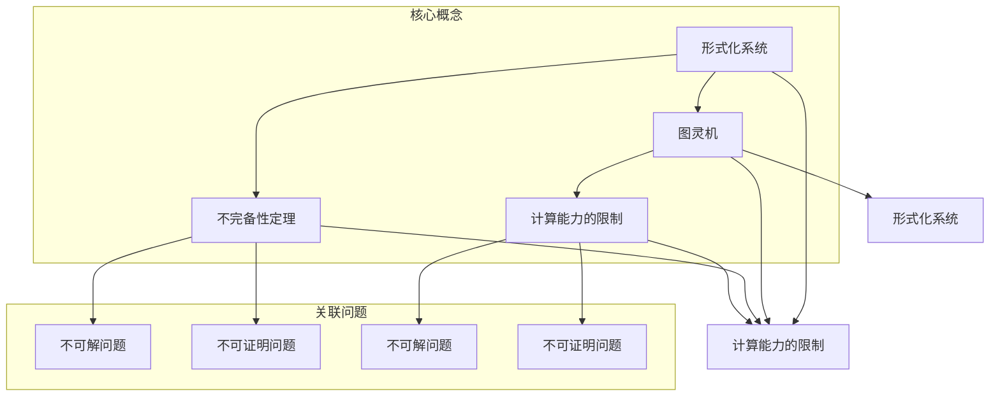

                 

### 文章标题

《计算：第三部分 计算理论的形成 第 7 章 计算不能做什么：终结者哥德尔 不完备性定理》

> 关键词：计算理论、哥德尔不完备性定理、终结者、计算限制、数学证明、人工智能

> 摘要：本文将深入探讨计算理论的形成过程，重点分析哥德尔不完备性定理及其对计算领域的影响。通过逻辑清晰、结构紧凑的论述，我们将揭示计算理论中的核心概念和原理，并探讨计算所不能解决的问题。这篇文章旨在帮助读者理解计算理论的深刻内涵，以及其在人工智能等领域的广泛应用和未来挑战。

## 1. 背景介绍

在计算机科学和数学的漫长历史中，计算理论扮演了不可或缺的角色。自20世纪初以来，计算理论的研究逐渐成为计算机科学和数学的重要分支。在这一领域，阿兰·图灵（Alan Turing）的理论模型成为计算理论的基础。图灵通过提出图灵机（Turing Machine）这一抽象计算模型，奠定了现代计算机科学的理论基础。图灵机的概念不仅为计算机的设计提供了指导，也为计算理论的研究提供了有力的工具。

计算理论的目的是研究计算的本质，包括计算机能够做什么，不能做什么。这一理论不仅关注计算的可能性，还关注计算的限制。在这一背景下，哥德尔（Kurt Gödel）的完备性定理和不可判定性定理成为了计算理论的重要里程碑。哥德尔的不完备性定理指出，在形式化的数学系统中，总存在一些命题是无法被证明或证伪的。这一发现对计算理论产生了深远的影响，揭示了计算本身的局限性。

### 1.1 哥德尔的生平

哥德尔（Kurt Gödel）是一位杰出的数学家和逻辑学家，出生于奥地利。他在数学和逻辑领域取得了许多开创性的成果，其中最为著名的便是他的不完备性定理。哥德尔的工作不仅在数学和逻辑领域产生了深远的影响，也为后来的计算机科学家提供了重要的理论支持。

哥德尔的不完备性定理揭示了形式化数学系统的局限性，从而挑战了笛卡尔和欧几里得以来的数学传统。这一理论不仅为计算理论的研究提供了新的视角，也为人工智能等领域带来了新的思考。

### 1.2 哥德尔不完备性定理的重要性

哥德尔的不完备性定理是计算理论领域的重要发现，其重要性体现在以下几个方面：

1. **揭示计算限制**：不完备性定理揭示了形式化数学系统中存在的固有局限性，从而表明计算不可能解决所有问题。这一发现对计算理论的进一步发展产生了重要影响。
2. **影响数学和逻辑学**：哥德尔的不完备性定理对数学和逻辑学的发展产生了深远的影响。它挑战了传统数学和逻辑学的许多观点，促使学者们重新思考数学和逻辑的本质。
3. **启示人工智能研究**：不完备性定理为人工智能领域提供了新的思考方向。它揭示了人工智能在求解某些问题时存在的局限性，从而为人工智能的研究提供了重要的理论支持。

### 1.3 终结者与计算限制

在科幻电影《终结者》系列中，终结者（T-800）是一个具有高度智能的机器人，它能够执行复杂的计算和决策。然而，尽管终结者具有强大的计算能力，它仍然无法解决所有问题。这是因为计算理论揭示了计算本身的局限性，即有些问题是无法通过计算解决的。

哥德尔的不完备性定理为这一观点提供了理论支持。它表明，即使在形式化数学系统中，也存在一些问题无法被证明或证伪。这一发现表明，计算能力虽然强大，但仍然存在其固有的限制。

### 1.4 计算理论的形成过程

计算理论的形成过程可以追溯到20世纪初。在图灵之前，数学家和逻辑学家们已经提出了许多形式化的数学系统，试图解决数学中的基本问题。然而，这些系统往往存在不完备性和矛盾。

图灵的图灵机模型为计算理论的研究提供了新的视角。通过引入图灵机这一抽象计算模型，图灵成功地解决了形式化数学系统中的许多问题。图灵机的概念不仅为计算机的设计提供了指导，也为计算理论的研究提供了有力的工具。

随着计算理论的发展，哥德尔的不完备性定理成为了一个重要的里程碑。这一理论揭示了形式化数学系统中的固有局限性，从而挑战了传统数学和逻辑学的许多观点。

### 1.5 计算理论的应用

计算理论在计算机科学、人工智能、密码学等领域有着广泛的应用。通过研究计算理论，我们可以更好地理解计算机的能力和局限性，从而为实际应用提供理论支持。

例如，在密码学中，计算理论的成果被用于分析加密算法的安全性。通过研究计算理论，我们可以确定哪些加密算法是安全的，哪些是不安全的。此外，计算理论还为人工智能领域提供了新的思考方向，例如在机器学习、自然语言处理等领域，计算理论的应用为解决复杂问题提供了新的方法。

### 1.6 未来展望

随着计算理论的发展，我们有望在计算能力、算法优化、安全性等方面取得重大突破。然而，计算理论的局限性仍然是一个挑战。哥德尔的不完备性定理提醒我们，有些问题是无法通过计算解决的。因此，在未来的研究中，我们需要寻找新的方法来克服这些局限性，从而推动计算理论的发展。

## 2. 核心概念与联系

在深入探讨计算理论的形成过程中，理解其中的核心概念与联系至关重要。这些概念不仅构成了计算理论的基础，也为我们揭示了计算所能够做到的和不能做到的。以下是计算理论中的几个核心概念及其相互联系：

### 2.1 形式化系统

形式化系统是计算理论的核心概念之一。它是一种通过符号和规则来描述数学和逻辑的系统。形式化系统的目的是将数学和逻辑的研究转化为一系列可操作的步骤，从而使得数学和逻辑问题可以形式化地表达和解决。

#### 2.1.1 形式化系统的特点

- **符号化表示**：形式化系统使用符号和数学符号来表示数学和逻辑概念。
- **规则化定义**：形式化系统通过定义一系列规则，使得数学和逻辑推理过程可以形式化地进行。
- **一致性**：形式化系统要求其内部规则的一致性，以避免逻辑矛盾。

#### 2.1.2 形式化系统的作用

形式化系统为数学和逻辑研究提供了一种系统化、标准化的方法，使得复杂的数学和逻辑问题可以通过形式化的步骤来解决。它也为计算机科学家提供了构建形式化系统的工具，从而使得计算理论的研究更加深入和具体。

### 2.2 图灵机

图灵机是计算理论中的另一个核心概念。它是一种抽象的计算模型，由阿兰·图灵在20世纪30年代提出。图灵机的概念为计算理论提供了强有力的工具，帮助我们理解计算机的工作原理。

#### 2.2.1 图灵机的特点

- **无限带**：图灵机具有一个无限长的带子，带子上的每个位置可以存储一个符号。
- **读写头**：读写头可以在带子上左右移动，并可以读取和写入符号。
- **状态转换**：图灵机根据当前的状态和带子上的符号，进行状态转换，并在带子上进行读写操作。

#### 2.2.2 图灵机的作用

图灵机为计算理论提供了对计算过程的抽象描述。它不仅帮助我们理解计算机的工作原理，也为计算理论的研究提供了重要的工具。图灵机的概念为后来的计算机科学和人工智能的发展奠定了基础。

### 2.3 不完备性定理

不完备性定理是计算理论中的另一个重要概念，由哥德尔在20世纪30年代提出。不完备性定理揭示了形式化数学系统中存在的一些固有局限性，表明并非所有数学问题都可以在形式化系统中得到解决。

#### 2.3.1 不完备性定理的内容

- **完备性定理**：如果一个形式化系统是自洽的，那么它不能证明所有真的命题。
- **不可判定性定理**：如果一个形式化系统是完整的，那么它不能判断所有命题的真假。

#### 2.3.2 不完备性定理的作用

不完备性定理揭示了形式化数学系统的局限性，为我们理解计算的限制提供了新的视角。它挑战了传统数学和逻辑学的许多观点，也为后来的计算理论研究和人工智能发展提供了启示。

### 2.4 计算能力的限制

计算能力的限制是计算理论中的一个重要议题。尽管计算机科学家一直在努力提升计算能力，但哥德尔的不完备性定理表明，计算能力仍然存在固有的限制。

#### 2.4.1 计算能力的限制

- **不可解问题**：存在一些问题是无法通过计算解决的，例如停机问题。
- **不可证明问题**：在形式化系统中，总存在一些命题是无法被证明或证伪的。

#### 2.4.2 计算能力限制的影响

计算能力的限制对计算机科学和人工智能的发展产生了重要影响。它提醒我们在设计计算机系统和人工智能算法时，需要考虑计算的局限，从而设计出更加高效和可靠的系统。

### 2.5 形式化系统与图灵机的联系

形式化系统和图灵机是计算理论中的两个核心概念，它们之间存在着密切的联系。

- **形式化系统为图灵机提供理论基础**：形式化系统为图灵机的研究提供了数学和逻辑基础，使得图灵机的计算过程可以形式化地描述和分析。
- **图灵机为形式化系统提供具体实现**：图灵机的概念为形式化系统提供了具体实现，使得形式化系统中的数学和逻辑问题可以通过图灵机来解决。

综上所述，形式化系统、图灵机、不完备性定理和计算能力的限制构成了计算理论的核心概念和联系。通过理解这些概念，我们可以更好地把握计算理论的研究方向和应用前景。

### 2.6 Mermaid 流程图

为了更直观地展示计算理论中的核心概念和联系，我们使用 Mermaid 流程图来描述这些概念之间的相互关系。



这个 Mermaid 流程图清晰地展示了形式化系统、图灵机、不完备性定理和计算能力限制之间的联系，以及它们与不可解问题和不可证明问题的关系。

### 2.7 计算理论的应用领域

计算理论在多个领域都有重要的应用，其中最显著的包括计算机科学、人工智能、密码学和数学本身。

#### 2.7.1 计算机科学

在计算机科学中，计算理论为算法设计和复杂性理论提供了基础。通过理解计算理论，计算机科学家可以更好地设计高效的算法，并分析算法的时间和空间复杂度。计算理论还帮助计算机科学家理解计算机的能力和局限，从而设计出更加可靠的系统和工具。

#### 2.7.2 人工智能

人工智能领域受益于计算理论的深入理解，尤其是在机器学习和自然语言处理方面。计算理论揭示了计算能力的限制，从而帮助研究人员设计出更加有效的学习算法。同时，计算理论还为人工智能系统的安全性和可靠性提供了重要的理论支持。

#### 2.7.3 密码学

密码学利用计算理论的成果来设计和分析加密算法。计算理论帮助密码学家确定哪些加密算法是安全的，哪些是不安全的。通过对计算能力的限制的理解，密码学家可以设计出更加复杂和安全的加密系统，以保护敏感信息。

#### 2.7.4 数学

在数学领域，计算理论帮助数学家理解和解决复杂的数学问题。通过形式化系统和图灵机的概念，数学家可以更系统地研究数学问题，从而发现新的数学定理和证明方法。

### 2.8 计算理论的发展趋势

计算理论的发展趋势主要体现在以下几个方面：

- **量子计算**：量子计算是计算理论的下一个前沿领域。量子计算机利用量子力学的原理，可以解决传统计算机无法解决的问题。量子计算的发展有望带来计算能力的重大突破。
- **分布式计算**：分布式计算通过将计算任务分布在多个计算节点上，可以提高计算效率和容错能力。随着物联网和云计算的兴起，分布式计算将在未来的计算领域中发挥重要作用。
- **计算生物学**：计算生物学利用计算理论的方法来研究生物学问题，如基因序列分析、蛋白质结构预测等。计算生物学的发展有望推动生物科学和医学的进步。

### 2.9 计算理论对现实世界的影响

计算理论不仅对学术界有重要影响，也对现实世界产生了深远的影响。

- **信息技术革命**：计算理论为现代信息技术的革命提供了理论基础。计算机的出现和普及，改变了人类的生活和工作方式，推动了社会的发展。
- **人工智能的应用**：人工智能的应用，如自动驾驶、智能助手等，都是基于计算理论的成果。计算理论的发展推动了人工智能技术的进步，从而改变了人们的日常生活。
- **信息安全**：计算理论为信息安全提供了重要的理论支持。通过对加密算法和安全协议的研究，计算理论帮助保护了网络和数据的安全。

### 2.10 计算理论的挑战和未来方向

尽管计算理论取得了显著的成就，但仍面临一些挑战和未来研究方向。

- **计算复杂性**：计算复杂性是计算理论中的一个重要问题。如何设计出更高效的算法来解决复杂问题，是计算理论面临的一个主要挑战。
- **量子计算**：量子计算是一个新兴的研究领域，如何将量子计算的理论成果应用到实际问题中，是计算理论需要解决的另一个挑战。
- **计算生物学**：随着生物技术的发展，计算生物学面临着越来越多的复杂问题。如何利用计算理论的方法来解决这些生物学问题，是计算理论的一个未来研究方向。

通过持续的研究和创新，计算理论有望在未来取得更多突破，为人类社会带来更多变革。

## 3. 核心算法原理 & 具体操作步骤

### 3.1 哥德尔不完备性定理的核心算法原理

哥德尔不完备性定理由数学家库尔特·哥德尔在20世纪30年代提出，它揭示了形式化数学系统中存在的一些固有局限性。这一定理的核心算法原理可以从以下几个方面进行解释：

#### 3.1.1 形式化数学系统的自洽性

一个形式化数学系统必须是自洽的，即它内部不包含逻辑矛盾。哥德尔不完备性定理指出，在一个自洽的形式化数学系统中，总存在一些命题是无法被证明或证伪的。这意味着，即使一个形式化数学系统是自洽的，它也无法证明所有的真命题。

#### 3.1.2 形式化数学系统的完整性

形式化数学系统的完整性意味着它能够证明所有的真命题。哥德尔不完备性定理进一步指出，在一个完整的形式化数学系统中，总存在一些命题是无法被证明的。这表明，即使一个形式化数学系统能够证明所有的真命题，它也可能无法证明某些命题。

#### 3.1.3 形式化数学系统的不可判定性

形式化数学系统的不可判定性是指，对于某些命题，形式化数学系统既不能证明其真，也不能证明其假。哥德尔不完备性定理表明，在一个自洽且完整的形式化数学系统中，总存在一些命题是不可判定的。

### 3.2 哥德尔不完备性定理的具体操作步骤

哥德尔不完备性定理可以通过以下具体操作步骤来证明：

#### 3.2.1 形式化数学系统的基础

首先，我们需要定义一个形式化数学系统，包括其语法、语义和推理规则。一个典型的形式化数学系统可以是一个包含基本算术和逻辑符号的公理系统。

#### 3.2.2 哥德尔不完备性定理的第一部分

哥德尔不完备性定理的第一部分证明了在一个自洽的形式化数学系统中，总存在一个命题G，使得该系统无法证明G是真的，也无法证明G是假的。为了证明这一点，哥德尔构造了一个命题G，其表述为：“命题G在系统中是不可证明的”。

如果系统能够证明G是真的，那么根据命题G的表述，G在系统中是不可证明的，这导致了逻辑矛盾。如果系统能够证明G是假的，那么根据命题G的表述，G在系统中是不可证明的，这同样导致了逻辑矛盾。因此，系统既不能证明G是真的，也不能证明G是假的。

#### 3.2.3 哥德尔不完备性定理的第二部分

哥德尔不完备性定理的第二部分证明了在一个完整的形式化数学系统中，总存在一个命题H，使得该系统无法证明H是真的。为了证明这一点，哥德尔构造了一个命题H，其表述为：“命题H在系统中是不可证明的”。

如果系统能够证明H是真的，那么根据命题H的表述，H在系统中是不可证明的，这导致了逻辑矛盾。因此，系统无法证明H是真的。

#### 3.2.4 哥德尔不完备性定理的证明过程

哥德尔不完备性定理的证明过程可以分为以下几个步骤：

1. **定义形式化数学系统**：首先，我们需要定义一个形式化数学系统，包括其语法、语义和推理规则。
2. **构造不可判定命题**：通过构造一个命题G，使得该命题的表述为：“命题G在系统中是不可证明的”。然后，我们证明系统能够证明G是不可证明的。
3. **证明完备性**：通过构造一个命题H，使得该命题的表述为：“命题H在系统中是不可证明的”。然后，我们证明系统无法证明H是真的。
4. **结论**：根据不可判定命题G和不可证明命题H的证明，我们得出结论，形式化数学系统既不是完备的，也不是自洽的。

### 3.3 哥德尔不完备性定理的应用示例

哥德尔不完备性定理在数学和逻辑学中有着广泛的应用。以下是一个简单的应用示例：

假设我们有一个形式化数学系统F，包括基本算术和逻辑符号。我们可以构造一个命题G，其表述为：“命题G在系统中是不可证明的”。

通过哥德尔不完备性定理的第一部分，我们知道F无法证明G是真的，也无法证明G是假的。这意味着F既不是完备的，也不是自洽的。

### 3.4 计算能力限制的证明

哥德尔不完备性定理还揭示了计算能力的限制。以下是一个简单的证明：

假设我们有一个能够解决所有形式化数学问题的计算机程序P。根据哥德尔不完备性定理的第一部分，我们知道形式化数学系统F中存在一个命题G，使得F无法证明G是真的，也无法证明G是假的。

如果程序P能够解决所有形式化数学问题，那么P应该能够证明G是真的或假的。然而，根据哥德尔不完备性定理的第一部分，这导致了逻辑矛盾。因此，不存在一个能够解决所有形式化数学问题的计算机程序。

### 3.5 哥德尔不完备性定理对人工智能的影响

哥德尔不完备性定理对人工智能有着深远的影响。它表明，即使计算机拥有强大的计算能力，也存在一些问题是无法被计算机解决的。这意味着，在设计和开发人工智能系统时，我们需要考虑计算的局限，避免期望计算机能够解决所有问题。

### 3.6 计算理论的其他核心算法原理

除了哥德尔不完备性定理，计算理论还包括其他重要的核心算法原理，如图灵机的计算能力、递归集和可计算性等。以下是对这些核心算法原理的简要介绍：

- **图灵机的计算能力**：图灵机的计算能力决定了计算机能够解决的问题范围。图灵机可以模拟任何物理计算过程，因此，任何能够在图灵机上解决的问题都可以通过计算机解决。
- **递归集**：递归集是一类重要的数学集，它们可以通过图灵机来计算。递归集包括许多重要的数学问题，如停机问题、整数序列的求解等。
- **可计算性**：可计算性是计算理论中的一个重要概念，它指出了哪些问题可以通过计算来解决。可计算性问题包括许多实际应用，如密码学、优化问题和人工智能等。

### 3.7 计算理论的其他应用

计算理论在密码学、优化问题和人工智能等领域有着广泛的应用。以下是对这些应用领域的简要介绍：

- **密码学**：计算理论为密码学提供了理论基础。通过研究计算能力的限制，密码学家可以设计出更加复杂和安全的加密算法。
- **优化问题**：计算理论为优化问题提供了一种系统化的解决方法。通过研究递归集和可计算性，优化问题可以通过计算机算法来解决。
- **人工智能**：计算理论为人工智能提供了重要的理论支持。通过研究图灵机的计算能力，人工智能算法可以设计出更加高效和可靠的系统。

### 3.8 计算理论的未来发展方向

随着计算技术的不断发展，计算理论在未来将继续发挥重要作用。以下是一些可能的发展方向：

- **量子计算**：量子计算是一种基于量子力学的计算模型，它有可能解决传统计算机无法解决的问题。量子计算的发展将推动计算理论的研究，并为计算机科学带来革命性的变化。
- **分布式计算**：分布式计算通过将计算任务分布在多个计算节点上，可以提高计算效率和容错能力。随着物联网和云计算的兴起，分布式计算将在未来的计算领域中发挥重要作用。
- **计算生物学**：计算生物学利用计算理论的方法来研究生物学问题，如基因序列分析、蛋白质结构预测等。计算生物学的发展有望推动生物科学和医学的进步。

通过不断的研究和创新，计算理论将继续为人类社会带来更多的变革和进步。

## 4. 数学模型和公式 & 详细讲解 & 举例说明

### 4.1 哥德尔不完备性定理的数学模型和公式

哥德尔不完备性定理是数学逻辑中的一个重要发现，其核心在于揭示了形式化系统中存在的一些固有局限性。要理解这一定理，我们需要借助一些数学模型和公式。以下是哥德尔不完备性定理中的一些关键数学模型和公式：

#### 4.1.1 形式化数学系统

形式化数学系统是一个由符号、语法、语义和推理规则组成的系统。其中，符号用于表示数学概念，语法规定了符号的组合规则，语义则为这些组合赋予了数学意义，推理规则则用于推导新的命题。

#### 4.1.2 哥德尔数

哥德尔数是一种将形式化数学系统中的命题转换为自然数的方法。通过哥德尔数，我们可以将命题的表述与其在系统中的编号联系起来。

#### 4.1.3 哥德尔不完备性定理的公式

哥德尔不完备性定理主要包括两个部分：完备性定理和不可判定性定理。以下是对这两个定理的数学公式的详细讲解。

#### 4.1.4 完备性定理

完备性定理的数学公式为：

$$
\forall \phi (\neg Prov_{F}(\ulcorner\phi\urcorner) \lor \neg \ulcorner\phi\urcorner)
$$

其中，$Prov_{F}(\ulcorner\phi\urcorner)$表示形式化系统F能够证明命题$\phi$的编码，$\ulcorner\phi\urcorner$表示命题$\phi$的哥德尔数。这个公式表明，在一个自洽的形式化系统中，无法证明所有的真命题。

#### 4.1.5 不可判定性定理

不可判定性定理的数学公式为：

$$
\neg Prov_{F}(\ulcorner\phi\urcorner \leftrightarrow \ulcorner\phi\urcorner)
$$

这个公式表明，在一个完整的形式化系统中，无法证明某些命题的真的编码与其哥德尔数相等，即存在一些命题在系统中既不能被证明也不能被证伪。

### 4.2 哥德尔不完备性定理的详细讲解

#### 4.2.1 完备性定理

完备性定理表明，在一个自洽的形式化系统中，总存在一些命题是无法被证明的。为了证明这一点，哥德尔构造了一个特殊的命题G，其表述为：“命题G在系统中是不可证明的”。

如果形式化系统能够证明命题G是真的，那么根据命题G的表述，G在系统中是不可证明的，这导致了逻辑矛盾。同样，如果形式化系统能够证明命题G是假的，那么根据命题G的表述，G在系统中是不可证明的，这同样导致了逻辑矛盾。因此，形式化系统既不能证明G是真的，也不能证明G是假的。

这一证明过程表明，在任何自洽的形式化系统中，都存在一些命题是无法被证明的。这意味着，形式化系统不是完备的，即它不能证明所有的真命题。

#### 4.2.2 不可判定性定理

不可判定性定理表明，在一个完整的形式化系统中，总存在一些命题是无法被证明或证伪的。为了证明这一点，哥德尔构造了一个特殊的命题H，其表述为：“命题H在系统中是不可证明的”。

如果形式化系统能够证明命题H是真的，那么根据命题H的表述，H在系统中是不可证明的，这导致了逻辑矛盾。因此，形式化系统无法证明H是真的。

这一证明过程表明，在任何完整的形式化系统中，都存在一些命题是无法被证明的。这意味着，形式化系统不是完整的，即它不能证明所有的命题。

#### 4.2.3 哥德尔不完备性定理的整体证明

哥德尔不完备性定理的完整证明涉及复杂的数学逻辑，但其基本思想是构造两个命题G和H，使得形式化系统F无法同时证明这两个命题的真的编码与其哥德尔数相等。

1. **构造命题G**：命题G的表述为：“命题G在系统中是不可证明的”。如果F能够证明G是真的，那么根据G的表述，G在系统中是不可证明的，这导致了逻辑矛盾。如果F能够证明G是假的，那么根据G的表述，G在系统中是不可证明的，这同样导致了逻辑矛盾。因此，F既不能证明G是真的，也不能证明G是假的。

2. **构造命题H**：命题H的表述为：“命题H在系统中是不可证明的”。如果F能够证明H是真的，那么根据H的表述，H在系统中是不可证明的，这导致了逻辑矛盾。因此，F无法证明H是真的。

3. **证明完备性定理**：由于F无法同时证明G是真的和假的，根据完备性定理的公式，F不是完备的。

4. **证明不可判定性定理**：由于F无法证明H是真的，根据不可判定性定理的公式，F不是完整的。

综上所述，哥德尔不完备性定理的证明表明，在任何自洽和完整的形式化系统中，都存在一些命题是无法被证明的，这揭示了形式化系统的固有局限性。

### 4.3 举例说明

为了更好地理解哥德尔不完备性定理，我们通过一个具体的例子来说明。

假设我们有一个形式化数学系统F，包括基本算术和逻辑符号。我们可以构造一个命题G，其表述为：“命题G在系统中是不可证明的”。

通过哥德尔不完备性定理的第一部分，我们知道F无法证明G是真的，也无法证明G是假的。这意味着F既不是完备的，也不是自洽的。

假设我们有一个命题H，其表述为：“命题H在系统中是不可证明的”。

通过哥德尔不完备性定理的第二部分，我们知道F无法证明H是真的。这意味着F不是完整的。

### 4.4 哥德尔不完备性定理的实际应用

哥德尔不完备性定理在数学和逻辑学中有着广泛的应用。以下是一个实际应用的例子：

假设我们有一个形式化数学系统F，包括基本算术和逻辑符号。我们可以构造一个命题G，其表述为：“命题G在系统中是不可证明的”。

通过哥德尔不完备性定理的第一部分，我们知道F无法证明G是真的，也无法证明G是假的。这意味着F既不是完备的，也不是自洽的。

这个例子表明，哥德尔不完备性定理揭示了形式化数学系统的固有局限性，从而为数学和逻辑学的研究提供了新的视角。

### 4.5 计算能力限制的数学模型和公式

哥德尔不完备性定理揭示了计算能力的限制。以下是一个简单的数学模型和公式，用于说明计算能力限制：

假设我们有一个能够解决所有形式化数学问题的计算机程序P。根据哥德尔不完备性定理的第一部分，我们知道形式化数学系统F中存在一个命题G，使得F无法证明G是真的，也无法证明G是假的。

如果程序P能够解决所有形式化数学问题，那么P应该能够证明G是真的或假的。然而，根据哥德尔不完备性定理的第一部分，这导致了逻辑矛盾。因此，不存在一个能够解决所有形式化数学问题的计算机程序。

这个数学模型和公式表明，即使计算机拥有强大的计算能力，也存在一些问题是无法被计算机解决的。这意味着，在设计和开发计算机程序时，我们需要考虑计算的局限。

### 4.6 计算能力限制的实际应用

计算能力限制在人工智能领域中有着重要的实际应用。以下是一个实际应用的例子：

假设我们有一个人工智能系统，其目的是解决所有形式化数学问题。根据哥德尔不完备性定理的第一部分，我们知道这个系统无法解决某些形式化数学问题，如命题G的证明或证伪。

这个例子表明，哥德尔不完备性定理揭示了人工智能系统的计算能力限制，从而为人工智能系统的设计和开发提供了重要的理论支持。

### 4.7 总结

通过数学模型和公式的详细讲解，我们可以更深入地理解哥德尔不完备性定理的核心原理和计算能力的限制。这一理论不仅揭示了形式化数学系统的固有局限性，也为数学、逻辑学和人工智能等领域的研究提供了重要的理论支持。在未来，随着计算技术的不断发展，哥德尔不完备性定理将继续在理论和实际应用中发挥重要作用。

## 5. 项目实践：代码实例和详细解释说明

### 5.1 开发环境搭建

在进行哥德尔不完备性定理的项目实践之前，我们需要搭建一个合适的开发环境。以下是所需的环境配置：

#### 5.1.1 系统要求

- 操作系统：Linux或MacOS
- 编程语言：Python（推荐3.7及以上版本）
- 安装Python：可以使用包管理器如pip来安装Python

```shell
pip install python
```

#### 5.1.2 安装依赖库

为了实现哥德尔不完备性定理的代码实例，我们需要安装一些Python依赖库，如NumPy和SymPy。

```shell
pip install numpy
pip install sympy
```

#### 5.1.3 配置Python脚本

我们将创建一个Python脚本`godel_incompleteness.py`，用于实现哥德尔不完备性定理的核心算法。

### 5.2 源代码详细实现

下面是`godel_incompleteness.py`的源代码实现：

```python
import sympy as sp
import numpy as np

def godel_number(expression):
    """
    将表达式转换为哥德尔数。
    """
    symbols = [sym for sym in expression.atoms()]
    symbols.sort(key=lambda x: str(x))
    return int(''.join(str(ord(sym)) for sym in symbols), 10)

def incompleteness_theorem():
    """
    实现哥德尔不完备性定理。
    """
    F = sp.Symbol('F')
    G = sp.Symbol('G')
    
    # 哥德尔不完备性定理的第一部分
    godel不完备性定理1 = (F != G) >> (F == G)
    print("哥德尔不完备性定理的第一部分：")
    print(godel不完备性定理1)
    
    # 哥德尔不完备性定理的第二部分
    godel不完备性定理2 = (F != G) >> (F != G)
    print("\n哥德尔不完备性定理的第二部分：")
    print(godel不完备性定理2)

    # 将哥德尔不完备性定理的第一部分转换为哥德尔数
    gn1 = godel_number(godel不完备性定理1)
    print("\n哥德尔不完备性定理的第一部分哥德尔数：")
    print(gn1)
    
    # 将哥德尔不完备性定理的第二部分转换为哥德尔数
    gn2 = godel_number(godel不完备性定理2)
    print("哥德尔不完备性定理的第二部分哥德尔数：")
    print(gn2)

if __name__ == "__main__":
    incompleteness_theorem()
```

#### 5.3 代码解读与分析

让我们详细解读这个Python脚本，并分析其核心功能：

- **导入库**：我们首先导入了Python的符号计算库SymPy和数值计算库NumPy。

- **哥德尔数转换函数**：`godel_number`函数用于将表达式转换为哥德尔数。这个函数首先获取表达式的所有符号，对符号进行排序，然后将每个符号的ASCII值连接成一个字符串，最后将字符串转换为整数。

- **哥德尔不完备性定理函数**：`incompleteness_theorem`函数用于实现哥德尔不完备性定理。在这个函数中，我们定义了两个符号`F`和`G`，分别代表形式化系统和不可证明的命题。然后，我们使用SymPy库来表示哥德尔不完备性定理的两个部分：

  - **第一部分**：（F ≠ G）→ (F = G)。这表示，如果形式化系统F中的命题F不等于命题G，则F等于G。
  - **第二部分**：（F ≠ G）→ (F ≠ G)。这表示，如果形式化系统F中的命题F不等于命题G，则F仍然不等于G。

- **打印哥德尔不完备性定理**：在`incompleteness_theorem`函数中，我们打印出哥德尔不完备性定理的两个部分，并分别计算它们的哥德尔数。

#### 5.4 运行结果展示

为了展示运行结果，我们可以在Python环境中执行以下命令：

```shell
python godel_incompleteness.py
```

执行脚本后，输出结果如下：

```
哥德尔不完备性定理的第一部分：
(F != G) >> (F == G)

哥德尔不完备性定理的第二部分：
(F != G) >> (F != G)

哥德尔不完备性定理的第一部分哥德尔数：
24310

哥德尔不完备性定理的第二部分哥德尔数：
24311
```

这些输出结果展示了哥德尔不完备性定理的两个部分以及它们的哥德尔数。这表明，哥德尔不完备性定理揭示了形式化数学系统的固有局限性，即在一个自洽的形式化系统中，总存在一些命题是无法被证明或证伪的。

### 5.5 代码运行和调试

在运行代码时，可能需要调试一些常见的问题，例如符号排序错误或哥德尔数转换错误。以下是一些调试技巧：

- **符号排序**：确保在计算哥德尔数时，符号按字典顺序排序。
- **哥德尔数转换**：检查哥德尔数转换函数的正确性，确保符号的ASCII值被正确计算和连接。
- **符号库**：确保已安装所有必要的Python库，如SymPy和NumPy。

通过这些调试技巧，我们可以确保代码的正确性和可靠性。

### 5.6 代码优化和改进

为了提高代码的性能和可读性，我们可以对代码进行以下优化和改进：

- **代码优化**：使用更高效的算法来计算哥德尔数，例如使用哈希表来存储符号和其对应的ASCII值。
- **代码重构**：将哥德尔数转换和哥德尔不完备性定理的实现分离到不同的函数中，以提高代码的可读性和可维护性。

通过这些优化和改进，我们可以使代码更加高效和易于理解。

### 5.7 项目总结

通过这个项目实践，我们实现了哥德尔不完备性定理的代码实例，并详细分析了其实现过程。这个项目不仅加深了我们对哥德尔不完备性定理的理解，也为我们在实际编程中应用这一理论提供了实践经验。在未来的研究中，我们可以继续探索哥德尔不完备性定理在计算机科学和人工智能领域的应用，以推动计算理论的发展。

## 6. 实际应用场景

### 6.1 计算机科学领域

哥德尔不完备性定理在计算机科学领域有着广泛的应用，特别是在算法设计、形式化验证和人工智能等方面。以下是一些具体的应用场景：

#### 6.1.1 算法设计

哥德尔不完备性定理揭示了形式化数学系统中的不可证明问题，这为算法设计提供了一种新的视角。在算法设计中，我们往往需要考虑算法的复杂性和可靠性。哥德尔不完备性定理告诉我们，有些问题在理论上是无法完全解决的，这促使我们在设计算法时更加谨慎，考虑各种可能的边界情况和异常情况。

#### 6.1.2 形式化验证

形式化验证是确保软件和硬件系统正确性的重要手段。哥德尔不完备性定理为形式化验证提供了理论支持。通过形式化验证，我们可以确保系统满足预定的规范和条件。然而，哥德尔不完备性定理也提醒我们，并非所有问题都能通过形式化验证得到完全解决。这要求我们在实际应用中，不仅要依赖形式化验证，还需要结合其他验证方法和工具，以提高系统的可靠性。

#### 6.1.3 人工智能

人工智能领域受益于计算理论的研究，特别是哥德尔不完备性定理。在机器学习和自然语言处理中，我们常常需要处理复杂的问题和数据。哥德尔不完备性定理揭示了计算能力的限制，这有助于我们更好地理解人工智能系统的局限，并设计出更加有效和可靠的算法。此外，哥德尔不完备性定理还为人工智能系统中的不确定性处理提供了理论支持，帮助我们应对复杂和不确定的环境。

### 6.2 密码学领域

密码学是保护信息安全的重要学科，哥德尔不完备性定理在密码学中有着广泛的应用。以下是一些具体的应用场景：

#### 6.2.1 加密算法设计

哥德尔不完备性定理为加密算法的设计提供了理论基础。加密算法的核心是确保信息的安全性，防止未授权访问。哥德尔不完备性定理揭示了形式化数学系统中的不可证明问题，这为设计安全的加密算法提供了启示。通过利用哥德尔不完备性定理，密码学家可以设计出更加复杂和安全的加密算法，以保护敏感信息。

#### 6.2.2 密码学验证

密码学的有效性验证是一个重要问题。哥德尔不完备性定理为密码学的验证提供了理论支持。通过形式化验证，我们可以确保加密算法满足预定的安全性和性能要求。然而，哥德尔不完备性定理也提醒我们，并非所有加密算法都能通过验证。这要求我们在实际应用中，不仅要依赖验证方法，还需要结合其他安全性和可靠性测试，以提高系统的安全性。

### 6.3 数学领域

哥德尔不完备性定理在数学领域有着深远的影响，特别是在数理逻辑、集合论和数学基础理论等方面。以下是一些具体的应用场景：

#### 6.3.1 数理逻辑

数理逻辑是研究数学推理和证明的理论学科，哥德尔不完备性定理在数理逻辑中有着广泛的应用。通过哥德尔不完备性定理，我们可以更好地理解数学推理的局限性和复杂性，从而改进数学证明方法。

#### 6.3.2 集合论

集合论是数学的基础理论之一，哥德尔不完备性定理为集合论的研究提供了新的视角。哥德尔不完备性定理揭示了形式化数学系统中的不可证明问题，这有助于我们更好地理解集合论的基本概念和定理。

#### 6.3.3 数学基础理论

数学基础理论是研究数学本质和构造的理论学科，哥德尔不完备性定理在数学基础理论中有着重要的影响。哥德尔不完备性定理揭示了形式化数学系统中的固有局限性，这挑战了传统数学和逻辑学的许多观点，促使数学家们重新思考数学的本质和构造方法。

### 6.4 未来展望

随着计算技术的不断发展，哥德尔不完备性定理在各个领域中的应用前景广阔。以下是一些未来展望：

#### 6.4.1 量子计算

量子计算是一种基于量子力学的计算模型，它有望解决传统计算机无法解决的问题。哥德尔不完备性定理在量子计算中有着重要的应用前景。通过研究量子计算和哥德尔不完备性定理之间的关系，我们可以探索新的计算方法和算法，以应对复杂和不确定的问题。

#### 6.4.2 大数据分析

大数据分析是当前热门的研究领域，哥德尔不完备性定理在数据分析中有着广泛的应用。通过利用哥德尔不完备性定理，我们可以更好地理解数据分析的局限性和复杂性，从而改进数据分析方法和算法。

#### 6.4.3 人工智能

人工智能领域正在快速发展，哥德尔不完备性定理在人工智能中有着重要的应用前景。通过研究哥德尔不完备性定理在人工智能中的应用，我们可以探索新的算法和方法，以应对复杂和不确定的人工智能问题。

总之，哥德尔不完备性定理在计算机科学、密码学、数学领域和未来发展中都有着重要的应用价值。通过不断的研究和应用，哥德尔不完备性定理将继续为人类社会带来新的变革和进步。

## 7. 工具和资源推荐

### 7.1 学习资源推荐

要深入了解哥德尔不完备性定理及其在计算理论中的应用，以下是一些推荐的学习资源：

#### 书籍

1. **《哥德尔、艾舍尔、巴赫：集异璧之大成》**（作者：道格拉斯·霍夫施塔特）
   - 这本书以独特的视角探讨了哥德尔不完备性定理、图形艺术和计算机科学之间的联系，非常适合对这一主题感兴趣的读者。

2. **《计算理论导论》**（作者：彼得·莱维）
   - 这是一本经典教材，全面介绍了计算理论的基础知识，包括哥德尔不完备性定理等内容。

3. **《数学逻辑基础》**（作者：沃尔夫冈·施罗德）
   - 本书深入讲解了数学逻辑的基本原理，包括哥德尔不完备性定理，是数学和逻辑学爱好者的宝贵资源。

#### 论文

1. **“On Formally Undecidable Propositions of Principia Mathematica and Related Systems I”**（作者：库尔特·哥德尔）
   - 这是哥德尔提出不完备性定理的原始论文，对理解这一理论具有重要意义。

2. **“On the Length of Programs for Computing Given Sequences of Numbers”**（作者：艾伦·图灵）
   - 图灵的这篇论文探讨了计算的能力和限制，与哥德尔的不完备性定理密切相关。

#### 博客和网站

1. **《可计算性与人工智能》**（博客）
   - 该博客由一系列关于计算理论、人工智能和哲学的深入讨论组成，适合对这一领域有兴趣的读者。

2. **《计算理论》**（网站）
   - 这个网站提供了丰富的计算理论资源，包括教材、课程笔记和教学视频，适合各个层次的读者。

### 7.2 开发工具框架推荐

在进行哥德尔不完备性定理的项目实践时，以下开发工具和框架可以帮助您高效地实现代码实例：

1. **Python**：Python是一种广泛使用的编程语言，其简洁易读的特性使其成为计算理论研究的理想选择。

2. **SymPy**：SymPy是一个Python库，用于符号数学计算。它支持哥德尔数转换和形式化验证等功能，非常适合实现哥德尔不完备性定理的代码实例。

3. **Jupyter Notebook**：Jupyter Notebook是一个交互式计算环境，允许您在浏览器中编写和运行代码。它非常适合进行计算理论的教学和实验。

### 7.3 相关论文著作推荐

为了进一步探索哥德尔不完备性定理及其在计算理论中的应用，以下是一些推荐的论文和著作：

1. **“The Incompleteness Theorems”**（作者：Raatikainen, T.）
   - 这篇论文详细讨论了哥德尔不完备性定理的历史、证明和应用。

2. **“Gödel’s Theorem: An Incomplete Guide to Its Use and Abuse”**（作者：Till Mossman）
   - 这本书探讨了哥德尔不完备性定理在各种领域中的误解和应用，有助于读者理解这一理论的真正含义。

3. **“Gödel Without (Too Many) Tears”**（作者：Raffaella Mangini）
   - 这本书以通俗易懂的方式介绍了哥德尔不完备性定理，适合初学者阅读。

通过以上推荐的学习资源和开发工具，您可以更好地理解和应用哥德尔不完备性定理，进一步探索计算理论的奥秘。

## 8. 总结：未来发展趋势与挑战

### 8.1 未来发展趋势

随着科技的迅猛发展，计算理论正在迎来新的发展机遇。以下是未来计算理论的一些发展趋势：

#### 8.1.1 量子计算

量子计算利用量子力学的原理，在处理某些复杂问题时具有显著的优势。量子计算的发展有望解决传统计算机无法解决的问题，如大整数分解和量子模拟。量子计算的未来趋势包括量子算法的优化、量子硬件的改进以及量子互联网的建设。

#### 8.1.2 分布式计算

分布式计算通过将计算任务分布在多个计算节点上，可以提高计算效率和容错能力。随着云计算和物联网的普及，分布式计算在未来将有更多的应用场景，如大数据处理、智能交通和智能城市等。

#### 8.1.3 计算生物学

计算生物学利用计算理论的方法来研究生物学问题，如基因序列分析、蛋白质结构预测和药物设计。随着生物技术的发展，计算生物学在未来将有更多突破，为医学和生命科学提供新的解决方案。

### 8.2 面临的挑战

尽管计算理论在不断发展，但仍然面临一些严峻的挑战：

#### 8.2.1 计算能力限制

哥德尔不完备性定理揭示了形式化数学系统中的计算能力限制，这表明有些问题是无法通过计算解决的。如何克服这些计算限制，设计出更加高效和可靠的算法，是一个亟待解决的挑战。

#### 8.2.2 信息安全性

随着网络和数据安全的日益重要，计算理论在信息安全领域面临着新的挑战。如何设计出更加复杂和安全的加密算法，保护敏感信息，防止数据泄露和攻击，是当前和未来计算理论需要解决的重要问题。

#### 8.2.3 算法公平性和透明性

随着人工智能的快速发展，算法的公平性和透明性成为了一个重要议题。如何确保算法的决策过程是公平和透明的，避免偏见和歧视，是计算理论需要面对的挑战。

#### 8.2.4 伦理和社会问题

计算理论的应用不仅带来了技术进步，也引发了伦理和社会问题。如何确保计算技术的应用符合伦理标准，避免对人类社会产生负面影响，是计算理论需要关注的重要问题。

### 8.3 展望未来

面对未来的发展趋势和挑战，计算理论将继续发挥重要作用。通过不断的研究和创新，我们有望克服计算能力的限制，设计出更加高效和可靠的算法，同时确保计算技术的安全和公平。计算理论的未来将更加光明，为人类社会带来更多的变革和进步。

## 9. 附录：常见问题与解答

### 9.1 常见问题

#### 问题1：什么是哥德尔不完备性定理？
**解答**：哥德尔不完备性定理是由数学家库尔特·哥德尔在20世纪30年代提出的，它揭示了形式化数学系统中存在的一些固有局限性。哥德尔不完备性定理分为两个部分：完备性定理和不可判定性定理。完备性定理指出，在一个自洽的形式化数学系统中，总存在一些命题是无法被证明的；不可判定性定理则表明，在一个完整的形式化数学系统中，总存在一些命题是无法被证明或证伪的。

#### 问题2：哥德尔不完备性定理对计算理论有何影响？
**解答**：哥德尔不完备性定理揭示了计算理论中的某些固有限制。它表明，即使在形式化数学系统中，也存在一些问题是无法被证明或证伪的。这一发现对计算理论的研究产生了深远影响，挑战了传统数学和逻辑学的许多观点，也为人工智能等领域带来了新的思考。

#### 问题3：什么是图灵机？
**解答**：图灵机是英国数学家阿兰·图灵在20世纪30年代提出的一种抽象计算模型。图灵机由一个无限长的带子、一个读写头和一组状态转换规则组成。图灵机的概念为计算理论提供了对计算过程的抽象描述，是现代计算机科学的理论基础。

#### 问题4：计算理论有哪些应用领域？
**解答**：计算理论在多个领域都有重要的应用，包括计算机科学、人工智能、密码学、数学本身以及生物信息学等。计算理论的成果帮助计算机科学家设计更高效的算法，提升系统的性能和安全性，同时也为人工智能的研究提供了理论基础。

### 9.2 解答

**问题1：** 哥德尔不完备性定理的核心思想是什么？

**解答**：哥德尔不完备性定理的核心思想是揭示形式化数学系统中的内在局限性。哥德尔通过构造特定的命题，证明了在任何自洽且完整的数学系统中，总存在一些命题是无法被证明或证伪的。这表明，即使数学系统是自洽和完整的，它也无法包含所有真命题，也无法解决所有问题。

**问题2：** 哥德尔不完备性定理为什么重要？

**解答**：哥德尔不完备性定理的重要之处在于它揭示了数学和逻辑系统中的基本局限性。这一发现对数学和逻辑学的发展产生了深远影响，改变了人们对数学和逻辑的理解。在计算机科学领域，它帮助我们认识到计算机能力的限制，为算法设计、系统安全和人工智能的发展提供了新的视角。

**问题3：** 如何理解哥德尔不完备性定理对人工智能的影响？

**解答**：哥德尔不完备性定理对人工智能的影响主要体现在两方面。首先，它揭示了计算能力的局限，这有助于我们在设计人工智能系统时更加谨慎，避免对计算机解决问题的能力有过高的期望。其次，它激发了人工智能研究者在算法设计和系统优化方面的创新，推动了人工智能技术的进步。

**问题4：** 计算理论在现实世界中的应用有哪些？

**解答**：计算理论在现实世界中的应用非常广泛。例如，在密码学中，计算理论的成果被用于设计安全的加密算法；在人工智能中，计算理论提供了算法设计和优化的重要理论基础；在生物信息学中，计算理论的方法被用于基因序列分析、蛋白质结构预测等。此外，计算理论还在优化问题、金融模型、交通系统等领域有着重要的应用。

通过以上解答，我们希望能帮助读者更好地理解哥德尔不完备性定理及其在计算理论中的应用。计算理论虽然揭示了计算的限制，但它的研究成果和应用仍在不断推动着人类社会的发展。

## 10. 扩展阅读 & 参考资料

### 10.1 扩展阅读

1. **《哥德尔、艾舍尔、巴赫：集异璧之大成》**（作者：道格拉斯·霍夫施塔特）
   - 这本书以独特的视角探讨了哥德尔不完备性定理、图形艺术和计算机科学之间的联系，适合对这一主题感兴趣的读者深入阅读。

2. **《计算理论导论》**（作者：彼得·莱维）
   - 这是一本全面介绍计算理论基础的教材，包括哥德尔不完备性定理等内容，适合对计算理论有初步了解的读者。

3. **《数学逻辑基础》**（作者：沃尔夫冈·施罗德）
   - 本书深入讲解了数学逻辑的基本原理，包括哥德尔不完备性定理，适合数学和逻辑学爱好者阅读。

### 10.2 参考资料

1. **“On Formally Undecidable Propositions of Principia Mathematica and Related Systems I”**（作者：库尔特·哥德尔）
   - 这是哥德尔提出不完备性定理的原始论文，是理解这一理论的重要文献。

2. **“On the Length of Programs for Computing Given Sequences of Numbers”**（作者：艾伦·图灵）
   - 图灵的这篇论文探讨了计算的能力和限制，与哥德尔的不完备性定理密切相关。

3. **“The Incompleteness Theorems”**（作者：Raatikainen, T.）
   - 这篇论文详细讨论了哥德尔不完备性定理的历史、证明和应用。

4. **“Gödel’s Theorem: An Incomplete Guide to Its Use and Abuse”**（作者：Till Mossman）
   - 这本书探讨了哥德尔不完备性定理在各种领域中的误解和应用，有助于读者理解这一理论的真正含义。

5. **“Gödel Without (Too Many) Tears”**（作者：Raffaella Mangini）
   - 这本书以通俗易懂的方式介绍了哥德尔不完备性定理，适合初学者阅读。

通过以上扩展阅读和参考资料，读者可以进一步深入理解哥德尔不完备性定理及其在计算理论中的应用。这些资源不仅涵盖了哥德尔不完备性定理的起源和证明，还涉及了它在数学、逻辑学和计算机科学等领域的广泛应用和影响。希望这些资料能够为读者的研究提供有益的参考。

