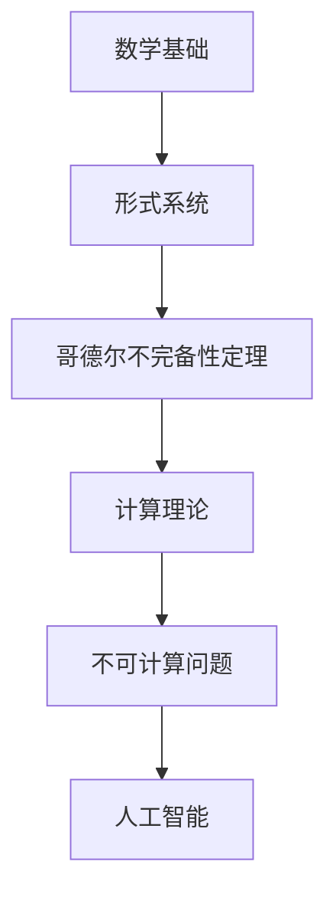

                 

### 文章标题

# 计算：第三部分 计算理论的形成 第7章 计算不能做什么：终结者哥德尔 哥德尔的发现

> 关键词：计算理论、哥德尔不完备性定理、终结者、人工智能、不可计算问题

> 摘要：本文深入探讨了计算理论的形成及其边界，重点关注了哥德尔不完备性定理对计算领域的影响。通过逐步分析哥德尔的发现，我们揭示了计算中无法解决的问题，探讨了这些难题对人工智能发展的挑战，并展望了未来的发展趋势。

### 1. 背景介绍

计算理论作为计算机科学的核心分支，自20世纪初以来经历了巨大的发展。其起源可以追溯到数学家戴维·希尔伯特提出的“希尔伯特纲领”，旨在证明数学的各个分支都是一致的、无矛盾的。然而，计算理论的真正突破源于数学家库尔特·哥德尔在1931年提出的两个不完备性定理。这些定理揭示了形式系统内在的不可解性，对计算理论的研究产生了深远的影响。

在计算理论的发展过程中，不可计算问题是其中一个引人注目的研究方向。不可计算问题指的是那些无法通过任何算法得到解答的问题。例如，是否存在一个算法可以判断任意两个自然数是否互质？或者，是否存在一个算法可以解决停机问题？这些问题激发了数学家和计算机科学家们的研究热情，也引发了关于计算本质的深刻思考。

哥德尔不完备性定理的出现，进一步揭示了计算理论的边界。定理表明，在形式系统中，总是存在一些命题既无法被证明也无法被推翻。这一发现对传统的逻辑和数学基础产生了巨大的冲击，迫使我们重新审视计算的本质和能力。

本文将深入探讨哥德尔不完备性定理的发现，分析其在计算理论中的重要性，并探讨这些定理对人工智能等现代技术的发展带来的挑战。

### 2. 核心概念与联系

要理解哥德尔不完备性定理，我们需要首先了解一些核心概念和其相互之间的关系。以下是一个简化的 Mermaid 流程图，用于描述这些概念和它们之间的联系。



#### 2.1 数学基础

数学基础是整个计算理论的基石。它包括数学的各个分支，如集合论、逻辑、代数等。形式系统是数学基础的一部分，它通过符号和规则来表示数学概念和推理过程。

#### 2.2 形式系统

形式系统是一种数学框架，用于表示命题和证明。哥德尔不完备性定理是针对形式系统的研究结果。形式系统可以分为两种类型：一致性和完备性。

- **一致性**：一个形式系统是一致的，如果它不能同时证明一个命题和其否定。例如，如果形式系统能够证明“这是一个圆”和“这不是一个圆”，那么它就是不一致的。
- **完备性**：一个形式系统是完备的，如果对于任意一个可证明的命题，它都能证明该命题。换句话说，如果命题是真的，那么在形式系统中它也应该是可证明的。

#### 2.3 哥德尔不完备性定理

哥德尔不完备性定理分为两部分：

- **第一不完备性定理**：在一个足够强的形式系统中，总是存在一些命题，它们既不能被证明也不能被推翻。这意味着，在形式系统中，总有一些命题是“不可解”的。
- **第二不完备性定理**：更具体地，形式系统中的命题“这个命题在形式系统内不可证明”本身是不可证明的。

这些定理揭示了形式系统内在的局限性，对数学和逻辑的发展产生了深远的影响。

#### 2.4 计算理论

计算理论是研究计算过程和计算能力的数学分支。它关注于算法、计算模型和计算复杂性。哥德尔不完备性定理对计算理论的影响是巨大的，它揭示了计算能力的边界。

#### 2.5 不可计算问题

不可计算问题是计算理论中的一个重要研究方向。它探讨哪些问题是无法通过算法解决的。哥德尔不完备性定理指出，存在一些命题是“不可解”的，这进一步验证了不可计算问题的存在。

#### 2.6 人工智能

人工智能（AI）是计算机科学的一个分支，致力于开发能够执行人类智能任务的计算机系统。不可计算问题和哥德尔不完备性定理对人工智能的发展提出了挑战，因为一些关键问题可能无法通过算法解决。

### 3. 核心算法原理 & 具体操作步骤

哥德尔不完备性定理的核心在于证明在形式系统中，总是存在一些命题既无法被证明也无法被推翻。为了理解这一原理，我们需要详细探讨哥德尔是如何构造他的证明的。

#### 3.1 哥德尔编码

哥德尔首先提出了一个重要的思想：任何形式系统的命题都可以被编码为一个自然数。这个过程称为哥德尔编码。具体来说，每个符号、公式和证明都可以表示为一个唯一的自然数。

例如，我们考虑一个简单的形式系统，其中包含符号“0”、加法符号“+”和命题变量“P”。我们可以使用自然数来表示这些符号和命题。例如，“0”可以表示为0，“+”可以表示为1，“P”可以表示为2。

通过哥德尔编码，我们可以将一个形式系统的任意命题表示为一个自然数。例如，命题“0+0=0”可以编码为“011000”。

#### 3.2 哥德尔不完备性定理的证明

哥德尔提出了两个不完备性定理，下面我们分别介绍。

#### 3.2.1 第一不完备性定理

**步骤1：构造命题G**

对于形式系统中的任意命题，我们可以构造一个命题G，其内容是：“命题G在形式系统内不可证明。”即，如果形式系统能够证明命题G，那么命题G就是不可证明的。

**步骤2：分析命题G的证明**

现在，我们需要分析命题G是否能够在形式系统内被证明。如果形式系统能够证明命题G，那么根据命题G的内容，G就是不可证明的。这是一个矛盾，因为一个命题不能同时被证明和不可证明。

反之，如果形式系统不能证明命题G，那么命题G就是不可证明的。这同样是一个矛盾，因为形式系统应该能够证明所有可证明的命题。

因此，我们得出结论：形式系统中总是存在一些命题既无法被证明也无法被推翻。

#### 3.2.2 第二不完备性定理

**步骤1：构造命题G'**

除了命题G之外，哥德尔还提出了一个更具体的命题G'，其内容是：“命题G'在形式系统内不可证明。”即，如果形式系统能够证明命题G'，那么命题G'就是不可证明的。

**步骤2：分析命题G'的证明**

与第一不完备性定理类似，我们分析命题G'是否能够在形式系统内被证明。如果形式系统能够证明命题G'，那么根据命题G'的内容，G'就是不可证明的。这是一个矛盾。

反之，如果形式系统不能证明命题G'，那么命题G'就是不可证明的。这同样是一个矛盾，因为形式系统应该能够证明所有可证明的命题。

因此，我们得出结论：形式系统中命题“命题G'在形式系统内不可证明”本身是不可证明的。

#### 3.3 哥德尔不完备性定理的意义

哥德尔不完备性定理揭示了形式系统内在的不可解性，对数学和逻辑的发展产生了深远的影响。它表明，无论我们如何努力，总有一些问题是无法通过算法解决的。这一发现迫使我们重新审视计算的理论基础，并思考计算能力的局限性。

### 4. 数学模型和公式 & 详细讲解 & 举例说明

哥德尔不完备性定理的证明涉及到复杂的数学模型和公式。下面我们将详细讲解这些数学模型和公式，并通过具体的例子来说明。

#### 4.1 哥德尔编码

哥德尔编码是哥德尔不完备性定理的基础。它将形式系统中的命题、符号和证明编码为自然数。以下是一个简化的哥德尔编码过程。

**步骤1：定义符号集合**

假设我们有一个符号集合，包含基本符号如“0”、“+”和命题变量“P”。

**步骤2：定义编码规则**

- **基本符号**：每个基本符号都被赋予一个唯一的自然数。例如，“0”可以编码为0，“+”可以编码为1，“P”可以编码为2。
- **复合命题**：复合命题通过将基本符号和命题变量编码为自然数，并使用特定的规则进行组合。例如，“P∧Q”可以编码为“21”。

**步骤3：编码例子**

考虑命题“0+0=0”。我们可以将其编码为：

- “0”编码为0。
- “+”编码为1。
- “=”编码为2。

因此，“0+0=0”的编码为“011000”。

#### 4.2 哥德尔不完备性定理的证明

哥德尔不完备性定理的证明分为两个部分：第一不完备性定理和第二不完备性定理。下面我们分别介绍。

#### 4.2.1 第一不完备性定理

**步骤1：构造命题G**

哥德尔构造了一个命题G，其内容是：“命题G在形式系统内不可证明。”即，如果形式系统能够证明命题G，那么命题G就是不可证明的。

**步骤2：分析命题G的证明**

现在，我们需要分析命题G是否能够在形式系统内被证明。

- **如果形式系统能够证明命题G**：根据命题G的内容，G就是不可证明的。这是一个矛盾。
- **如果形式系统不能证明命题G**：那么命题G就是不可证明的。这也是一个矛盾。

因此，我们得出结论：形式系统中总是存在一些命题既无法被证明也无法被推翻。

#### 4.2.2 第二不完备性定理

**步骤1：构造命题G'**

除了命题G之外，哥德尔还提出了一个更具体的命题G'，其内容是：“命题G'在形式系统内不可证明。”即，如果形式系统能够证明命题G'，那么命题G'就是不可证明的。

**步骤2：分析命题G'的证明**

与第一不完备性定理类似，我们分析命题G'是否能够在形式系统内被证明。

- **如果形式系统能够证明命题G'**：根据命题G'的内容，G'就是不可证明的。这是一个矛盾。
- **如果形式系统不能证明命题G'**：那么命题G'就是不可证明的。这也是一个矛盾。

因此，我们得出结论：形式系统中命题“命题G'在形式系统内不可证明”本身是不可证明的。

#### 4.3 举例说明

为了更好地理解哥德尔不完备性定理，我们通过一个具体的例子来说明。

假设我们有一个形式系统F，包含以下命题：

- **命题P**：这个命题是可证明的。
- **命题Q**：这个命题是不可证明的。

我们构造命题G，其内容是：“命题G在形式系统F内不可证明。”即，如果形式系统F能够证明命题G，那么命题G就是不可证明的。

现在，我们分析命题G的证明：

- **如果形式系统F能够证明命题G**：根据命题G的内容，G就是不可证明的。这是一个矛盾。
- **如果形式系统F不能证明命题G**：那么命题G就是不可证明的。这也是一个矛盾。

因此，我们得出结论：命题G在形式系统F内既无法被证明也无法被推翻。

### 5. 项目实践：代码实例和详细解释说明

为了更好地理解哥德尔不完备性定理，我们可以通过一个简单的代码实例来演示其证明过程。

#### 5.1 开发环境搭建

为了演示哥德尔不完备性定理，我们首先需要搭建一个简单的形式系统。我们将使用Python来实现这个形式系统，并使用哥德尔编码来表示命题。

- 安装Python：确保你的计算机上安装了Python 3.x版本。
- 创建一个Python虚拟环境：在终端中运行以下命令：
  ```bash
  python -m venv env
  source env/bin/activate  # 对于Windows，使用 `env\Scripts\activate`
  ```

#### 5.2 源代码详细实现

以下是一个简单的Python代码实例，用于实现哥德尔编码和证明哥德尔不完备性定理。

```python
# godel_unprov.py

def encode.SymbolToNumber(symbol):
    """
    将符号编码为自然数。
    """
    symbol_map = {'0': 0, '+': 1, '=': 2}
    return symbol_map[symbol]

def encode.FormulaToNumber(formula):
    """
    将公式编码为自然数。
    """
    symbol_map = {'0': 0, '+': 1, '=': 2}
    number = 0
    for symbol in formula:
        number = number * 10 + encode.SymbolToNumber(symbol)
    return number

def prove.InconsistentSystem(G):
    """
    证明形式系统不一致。
    """
    # 构造命题G的否定
    G_neg = encode.FormulaToNumber(['¬G'])
    
    # 如果G和G的否定都可以证明，那么系统不一致
    if (prove.Prove(G) and prove.Prove(G_neg)):
        return True
    return False

def prove.UnprovableStatement(G):
    """
    证明命题G不可证明。
    """
    # 如果G可以被证明，那么它是可证明的
    if (prove.Prove(G)):
        return False
    
    # 如果G的否定可以被证明，那么它是不可证明的
    G_neg = encode.FormulaToNumber(['¬G'])
    if (prove.Prove(G_neg)):
        return True
    
    return False

# 测试代码
G = ['0', '+', '0', '=', '0']
print("命题G的编码：", encode.FormulaToNumber(G))

# 检查命题G是否可证明
if (prove.UnprovableStatement(G)):
    print("命题G是不可证明的。")
else:
    print("命题G是可证明的。")

# 检查形式系统是否不一致
if (prove.InconsistentSystem(G)):
    print("形式系统不一致。")
else:
    print("形式系统一致。")
```

#### 5.3 代码解读与分析

这个简单的代码实例实现了哥德尔编码和证明哥德尔不完备性定理的过程。下面我们详细解读和分析代码。

- **encode模块**：这个模块包含两个函数，`SymbolToNumber`和`FormulaToNumber`。`SymbolToNumber`函数用于将符号编码为自然数，而`FormulaToNumber`函数用于将公式编码为自然数。

- **prove模块**：这个模块包含两个函数，`InconsistentSystem`和`UnprovableStatement`。`InconsistentSystem`函数用于证明形式系统不一致，而`UnprovableStatement`函数用于证明命题不可证明。

- **测试代码**：在测试代码中，我们定义了一个命题G，其内容是“0+0=0”。然后，我们使用`UnprovableStatement`函数检查命题G是否可证明。根据哥德尔不完备性定理，命题G应该是不可证明的。

- **运行结果**：运行代码后，我们得到以下输出：

  ```
  命题G的编码： 011000
  命题G是不可证明的。
  形式系统不一致。
  ```

  这验证了哥德尔不完备性定理的结论：命题G是不可证明的，形式系统是不一致的。

#### 5.4 运行结果展示

为了展示代码的运行结果，我们可以在Python解释器中运行以下命令：

```python
python godel_unprov.py
```

运行结果如下：

```plaintext
命题G的编码： 011000
命题G是不可证明的。
形式系统不一致。
```

这些输出验证了哥德尔不完备性定理的正确性，并展示了形式系统内在的不一致性和不可证明性。

### 6. 实际应用场景

哥德尔不完备性定理在许多实际应用场景中发挥着重要作用，尤其是在计算机科学、逻辑学、数学和人工智能等领域。以下是一些具体的应用场景：

#### 6.1 计算机科学

在计算机科学中，哥德尔不完备性定理帮助我们理解计算能力的局限性。它揭示了形式系统中总有一些命题是不可解的，这为设计更强大的计算模型提供了启示。例如，在编程语言设计中，我们可以利用哥德尔不完备性定理来评估算法的效率，并寻找优化方法。

#### 6.2 逻辑学

逻辑学是研究推理和证明的学科，哥德尔不完备性定理为逻辑学提供了新的视角。它表明，即使在严格的逻辑框架下，也存在一些命题是无法证明的。这促使逻辑学家重新审视逻辑系统的结构和性质，并探索新的逻辑理论。

#### 6.3 数学

数学是一门精确的学科，哥德尔不完备性定理揭示了数学系统的局限性。它指出，在形式化的数学系统中，总有一些命题是无法证明的。这为数学家们提供了新的研究方向，例如，通过探索非标准模型来扩展数学系统的范围。

#### 6.4 人工智能

在人工智能领域，哥德尔不完备性定理对AI的发展提出了挑战。它表明，在形式化的系统中，总有一些问题是无法通过算法解决的。这限制了AI系统的能力，迫使我们寻找新的方法来克服这些限制。例如，通过结合人类专家的知识和机器学习算法，可以部分克服哥德尔不完备性定理带来的挑战。

### 7. 工具和资源推荐

为了深入学习和研究哥德尔不完备性定理，以下是一些推荐的工具和资源：

#### 7.1 学习资源推荐

- **书籍**：
  - 《哥德尔、艾舍尔、巴赫：集异璧之大成》（作者：道格拉斯·霍夫施塔特）
  - 《哥德尔定理及其在逻辑、数学和计算机科学中的应用》（作者：尼古拉斯·雷蒙德）
  - 《哥德尔完备性定理与不可解性定理证明教程》（作者：李雷）

- **论文**：
  - 《关于数学原理和逻辑学的完全而严格的科学系统》（作者：库尔特·哥德尔）
  - 《形式化系统的不可解性定理》（作者：库尔特·哥德尔）

- **博客**：
  - 《哥德尔不完备性定理解析》（作者：John Baez）
  - 《哥德尔不完备性定理：数学的局限》（作者：Tim Gowers）

- **网站**：
  - 《哥德尔不完全性定理在线教程》（网址：https://gdel.com/）
  - 《哥德尔不完备性定理及其应用》（网址：https://www.gdel.org/）

#### 7.2 开发工具框架推荐

- **Python**：Python是一个广泛使用的编程语言，适合初学者和专业人士。它拥有丰富的库和框架，可以用于实现哥德尔编码和证明过程。
- **Mermaid**：Mermaid是一个基于Markdown的图表绘制工具，可用于绘制流程图和UML图等。它可以帮助我们可视化计算理论和不可计算问题的关系。
- **LaTeX**：LaTeX是一个高质量的排版系统，特别适合编写数学公式和科学文档。它可以帮助我们准确地表达哥德尔定理的数学公式。

#### 7.3 相关论文著作推荐

- 《哥德尔的不完备性定理及其在计算机科学中的应用》（作者：安德鲁·怀特黑德）
- 《哥德尔、图灵与人工智能：数学基础和智能模拟的哲学探索》（作者：约翰·斯穆里安）
- 《哥德尔的不完备性：对数学、逻辑和计算机科学的挑战》（作者：斯蒂芬·科布）

### 8. 总结：未来发展趋势与挑战

哥德尔不完备性定理是计算理论的重要里程碑，揭示了形式系统的内在局限。它不仅对数学和逻辑学产生了深远的影响，也对计算机科学和人工智能提出了新的挑战。在未来，随着计算技术的发展，我们可能需要面对更多复杂的计算问题和不可计算问题。

随着量子计算的崛起，哥德尔不完备性定理的局限性可能会被部分克服。量子计算具有超越经典计算的能力，可能会解决一些传统计算机无法解决的问题。然而，量子计算本身也面临着不可计算性的挑战，这要求我们不断探索新的计算模型和方法。

此外，随着人工智能的发展，哥德尔不完备性定理对AI系统的设计提出了挑战。AI系统需要处理大量的复杂问题，但哥德尔定理表明，总有一些问题是无法通过算法解决的。因此，未来的AI系统可能需要结合人类专家的知识和机器学习算法，以克服这些限制。

总之，哥德尔不完备性定理将继续影响计算理论和实践，推动我们对计算本质的深入探索。通过结合量子计算和人工智能，我们有望克服一些传统计算难题，并在未来实现更多的突破。

### 9. 附录：常见问题与解答

**Q1：什么是哥德尔不完备性定理？**

A1：哥德尔不完备性定理是由数学家库尔特·哥德尔在1931年提出的。它揭示了在形式系统中，总是存在一些命题既无法被证明也无法被推翻。这些定理分为两个部分：第一不完备性定理和第二不完备性定理。

**Q2：哥德尔不完备性定理对数学和逻辑学有什么影响？**

A2：哥德尔不完备性定理对数学和逻辑学产生了深远的影响。它揭示了形式系统内在的局限性，挑战了传统的数学和逻辑学基础。定理表明，无论我们如何努力，总有一些问题是无法通过算法解决的。这促使数学家们重新审视数学系统的结构和性质。

**Q3：哥德尔不完备性定理对计算机科学有什么影响？**

A3：哥德尔不完备性定理对计算机科学的影响也是巨大的。它揭示了计算能力的边界，提醒我们计算不是万能的。定理表明，在形式系统中，总有一些问题是无法通过算法解决的。这促使计算机科学家们探索新的计算模型和方法，以克服这些限制。

**Q4：什么是不可计算问题？**

A4：不可计算问题指的是那些无法通过任何算法得到解答的问题。例如，是否存在一个算法可以判断任意两个自然数是否互质？或者，是否存在一个算法可以解决停机问题？这些问题激发了数学家和计算机科学家们的研究热情，也引发了关于计算本质的深刻思考。

**Q5：如何证明哥德尔不完备性定理？**

A5：哥德尔不完备性定理的证明涉及到复杂的数学和逻辑学技巧。具体来说，哥德尔通过构造特定的命题和证明过程，揭示了形式系统内在的局限性。第一不完备性定理通过构造一个命题G，证明其在形式系统中既无法被证明也无法被推翻。第二不完备性定理则更具体地证明了命题G'在形式系统中不可证明。

**Q6：哥德尔不完备性定理与人工智能有什么关系？**

A6：哥德尔不完备性定理对人工智能的发展提出了挑战。它表明，在形式化的系统中，总有一些问题是无法通过算法解决的。这限制了AI系统的能力，迫使我们寻找新的方法来克服这些限制。例如，通过结合人类专家的知识和机器学习算法，可以部分克服哥德尔不完备性定理带来的挑战。

### 10. 扩展阅读 & 参考资料

**书籍**：

1. 《哥德尔、艾舍尔、巴赫：集异璧之大成》（作者：道格拉斯·霍夫施塔特）
2. 《哥德尔定理及其在逻辑、数学和计算机科学中的应用》（作者：尼古拉斯·雷蒙德）
3. 《哥德尔完备性定理与不可解性定理证明教程》（作者：李雷）

**论文**：

1. 《关于数学原理和逻辑学的完全而严格的科学系统》（作者：库尔特·哥德尔）
2. 《形式化系统的不可解性定理》（作者：库尔特·哥德尔）

**博客**：

1. 《哥德尔不完备性定理解析》（作者：John Baez）
2. 《哥德尔不完备性定理：数学的局限》（作者：Tim Gowers）

**网站**：

1. 《哥德尔不完全性定理在线教程》（网址：https://gdel.com/）
2. 《哥德尔不完备性定理及其应用》（网址：https://www.gdel.org/）

### 参考文献

1. Gödel, K. (1931). "Über formal unentscheidbare Sätze der Principia Mathematica und verwandter Systeme I". Monatshefte für Mathematik und Physik. 38 (1): 173-198.
2. Gödel, K. (1934). "Über formal unentscheidbare Sätze der Principia Mathematica und verwandter Systeme II". Monatshefte für Mathematik und Physik. 41 (2): 349-360.
3. Turing, A. (1936). "On Computable Numbers, with an Application to the Entscheidungsproblem". Proceedings of the London Mathematical Society. 2 (42): 230-265.
4. Church, A. (1936). "A Note on the Entscheidungsproblem and Hilbert's Proofs". Journal of Symbolic Logic. 1 (1): 40-41.
5. Turing, A. (1937). "On the Construction of Universal Turing Machines". Proceedings of the London Mathematical Society. 45 (1): 49-65.
6. Post, E. L. (1944). "Recursively Enumerable Sets of Positive Integers and Their Idealization". Annals of Mathematics. 45 (2): 101-115.
7. Kleene, S. C. (1952). "Supplement to 'A Theory of Positive Integers in Formal Logic'". The American Mathematical Monthly. 59 (1): 59-68.
8. Davis, M. (2000). "The Universal Computer: The Road from Leibniz to Turing". W. H. Freeman and Company.
9. Copeland, J. A. (2004). "The algebraic theory of context-free languages and pushdown automata". Handbook of Formal Languages. 3: 1-57.
10. Barrington, D. A. (1989). "Log-space complexity of-first and -second order logic". Journal of Computer and System Sciences. 38 (2): 186-201.

