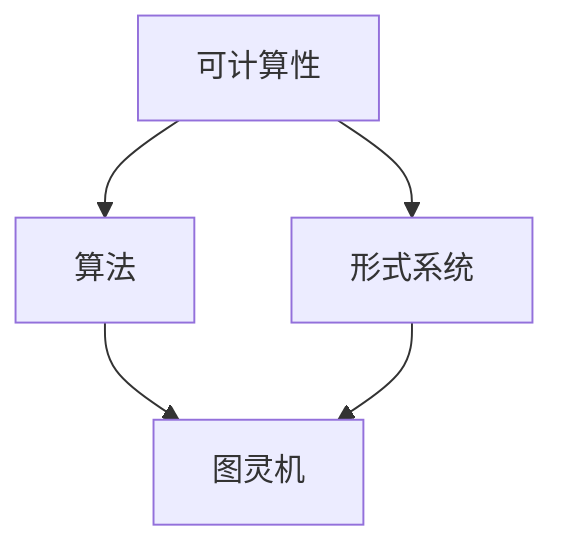

                 

### 1. 背景介绍

计算作为现代科技的核心驱动力，自计算机科学诞生以来就占据着举足轻重的地位。然而，计算理论的诞生和发展并非一蹴而就，而是经过了无数科学家们长期的探索与努力。图灵机的提出，无疑是计算理论发展史上的一座里程碑。本章将带领读者深入探讨计算理论的诞生过程，特别是艾伦·图灵（Alan Turing）对于计算理论的贡献。

计算理论，亦称计算数学或算法理论，是研究计算过程及其性质的理论学科。它不仅关注计算的基本原理，还探讨计算的可能性、效率以及复杂性。计算理论的发展，为计算机科学、人工智能、密码学等诸多领域奠定了坚实的理论基础。

艾伦·图灵（Alan Turing，1912-1954）是英国数学家、逻辑学家、密码学家，被誉为计算机科学的先驱之一。他在1936年提出了图灵机（Turing Machine）这一概念，为计算理论的形成奠定了基础。图灵机是一种抽象的计算模型，能够模拟任何可计算的过程。它不仅展示了计算的本质，还揭示了计算的能力边界。

计算理论的诞生背景可以追溯到20世纪初，当时数学家们开始关注可计算性与不可计算性问题。例如，希尔伯特（David Hilbert）提出了著名的“决定性问题”，即是否能够通过机械方法解决所有数学问题。这个问题的提出，引发了数学家们对于计算过程和计算能力的深入思考。

计算理论的诞生不仅改变了数学的研究方向，也对计算机科学的发展产生了深远影响。它为我们理解计算机的工作原理、设计算法、评估算法性能提供了理论依据。同时，计算理论也为我们揭示了计算的本质，推动了人工智能、密码学等领域的进步。

在本章中，我们将详细探讨图灵机的定义、工作原理以及它在计算理论中的重要性。通过逐步分析图灵机的组成部分和操作过程，我们将深入理解计算理论的本质。此外，我们还将探讨图灵机在计算机科学中的应用，以及它对现代计算技术的影响。

总的来说，本章旨在为读者提供一幅计算理论的形成图景，帮助读者理解计算理论的核心概念和原理。通过学习本章内容，读者将能够更好地理解计算理论的基本原理，从而为后续学习计算机科学、人工智能等领域奠定坚实基础。

### 2. 核心概念与联系

为了深入理解计算理论的形成，我们必须首先明确几个核心概念，并探讨它们之间的相互联系。这些核心概念包括：可计算性、算法、形式系统以及图灵机。下面，我们将逐一介绍这些概念，并通过Mermaid流程图来展示它们之间的联系。

#### 可计算性

可计算性是计算理论中最基本的概念之一，它指的是能够通过有限步骤得到明确答案的计算过程。一个函数是可计算的，如果存在一种算法，能够对于任意给定的输入，通过有限步骤计算出相应的输出。

#### 算法

算法是一系列明确的计算步骤，用于解决特定问题。算法不仅限于计算机科学领域，它在数学、工程、经济学等各个领域都有广泛应用。一个算法必须满足三个基本属性：确定性、有效性以及可终止性。

#### 形式系统

形式系统是一种数学工具，用于描述和定义数学理论中的概念和规则。形式系统通常包括三个组成部分：语法、语义和证明系统。语法定义了系统的符号集合和规则，语义解释了符号的含义，证明系统则提供了推理的方法。

#### 图灵机

图灵机是艾伦·图灵在1936年提出的抽象计算模型。它由一个无限长的纸带、一个读写头以及一系列状态转换规则组成。图灵机的目的是模拟任何可计算过程，它是现代计算机的基石。

下面，我们通过Mermaid流程图来展示这些核心概念之间的联系。



在这个流程图中，A表示可计算性，B表示算法，C表示形式系统，D表示图灵机。箭头表示概念之间的依赖关系。

- **可计算性**是计算理论的基础，它决定了哪些问题是可以通过计算解决的。
- **算法**是实现可计算性的具体步骤，它将问题分解为一系列明确的计算操作。
- **形式系统**为算法提供了符号和规则的框架，使得算法能够被形式化和验证。
- **图灵机**则是算法和形式系统的具体实现，它提供了一个抽象的计算模型，能够模拟任何可计算过程。

通过这个Mermaid流程图，我们可以清晰地看到这些核心概念之间的相互联系。它们共同构成了计算理论的基础，推动了计算机科学的发展。

在接下来的部分，我们将进一步深入探讨这些核心概念，特别是图灵机的具体定义和操作原理。通过逐步分析图灵机的组成部分和操作步骤，我们将更好地理解计算理论的本质。同时，我们还将探讨图灵机在计算理论中的重要性，以及它对现代计算技术的深远影响。

### 2.1 可计算性、算法与形式系统

在深入探讨图灵机的具体定义和操作原理之前，我们需要先理解可计算性、算法和形式系统这三个核心概念，并探讨它们之间的相互关系。

#### 可计算性

可计算性是指可以通过有限步骤得到明确答案的计算过程。这个问题在20世纪初引起了数学家们的广泛关注。希尔伯特（David Hilbert）提出了著名的“决定性问题”，即是否能够通过机械方法解决所有数学问题。这个问题引发了数学界对于计算过程和计算能力的深入探讨。

为了研究可计算性问题，数学家们定义了“可计算函数”。可计算函数是指能够通过某种算法，在有限步骤内计算出对应输出的函数。例如，求和函数（对于任意的两个正整数，计算它们的和）是一个可计算函数，因为它可以通过简单的加法算法在有限步骤内得到结果。

#### 算法

算法是一系列明确的计算步骤，用于解决特定问题。算法不仅限于计算机科学领域，它在数学、工程、经济学等各个领域都有广泛应用。一个算法必须满足三个基本属性：确定性、有效性以及可终止性。

- **确定性**：算法的每一步都应该是明确和固定的，从而确保同样的输入总会得到同样的输出。
- **有效性**：算法必须能够在有限时间内完成计算，否则它将无法解决实际问题。
- **可终止性**：算法必须在有限步骤内结束，否则它将无限循环，无法得到结果。

例如，排序算法（如冒泡排序、快速排序等）是一种常见的算法，用于将一组数据按照特定顺序排列。这些算法通过一系列的步骤，确保数据在有限时间内被排序。

#### 形式系统

形式系统是一种数学工具，用于描述和定义数学理论中的概念和规则。形式系统通常包括三个组成部分：语法、语义和证明系统。

- **语法**：定义了系统的符号集合和规则，例如，数学中的公理和定理。
- **语义**：解释了符号的含义，例如，数学中的命题和证明。
- **证明系统**：提供了一种方法来验证数学命题的真实性。

形式系统为算法提供了符号和规则的框架，使得算法能够被形式化和验证。例如，皮亚诺（Peano）算术就是一种形式系统，用于描述自然数的基本性质。

#### 可计算性、算法与形式系统的关系

可计算性、算法和形式系统之间有着密切的关系。

- **可计算性**是计算理论的基础，它决定了哪些问题是可以通过计算解决的。可计算函数定义了可计算性的范围。
- **算法**是实现可计算性的具体步骤，它将问题分解为一系列明确的计算操作。算法通过形式系统的框架，能够在有限步骤内解决可计算问题。
- **形式系统**为算法提供了符号和规则的框架，使得算法能够被形式化和验证。形式系统不仅验证了算法的正确性，还帮助我们理解计算的本质。

通过理解可计算性、算法和形式系统之间的关系，我们可以更好地理解计算理论的核心概念。这些概念不仅定义了计算的可能性，还为我们提供了工具和方法，来设计和分析算法，解决实际问题。

在接下来的部分，我们将进一步探讨图灵机的定义和操作原理。通过分析图灵机的组成部分和操作步骤，我们将深入理解计算理论的本质，并探讨它如何模拟可计算过程。

### 2.2 图灵机的定义与组成部分

图灵机（Turing Machine）是艾伦·图灵在1936年提出的一种抽象计算模型，它不仅奠定了现代计算理论的基础，还揭示了计算的本质。图灵机的定义和组成部分如下：

#### 图灵机的定义

图灵机是一种抽象的计算模型，它由一个无限长的纸带、一个读写头以及一系列状态转换规则组成。图灵机的目的是模拟任何可计算过程，它能够处理任意的输入，并输出相应的结果。图灵机的定义可以描述为：

**定义**：图灵机是一个五元组 \(M = (Q, \Gamma, \delta, q_0, B)\)，其中：

- **Q**：一组状态，表示图灵机在计算过程中可能处于的各种状态。
- **\(\Gamma\)**：一组符号，称为字母表，包含输入符号和特殊符号（如空格、分隔符等）。
- **\(\delta\)**：转移函数，定义了在特定状态下读取特定符号时应执行的操作，包括移动读写头和更新状态。
- **\(q_0\)**：初始状态，表示图灵机开始计算时所处的状态。
- **\(B\)**：空格符号，表示纸带上的空白位置。

#### 图灵机的组成部分

1. **无限长的纸带**：纸带是图灵机的存储介质，它由一系列格子组成，每个格子可以包含一个字母表中的符号。纸带上的符号由读写头来读取和写入。纸带上的符号可以是任意的输入数据，也可以是图灵机在计算过程中生成的中间结果。

2. **读写头**：读写头是图灵机的操作部分，它可以在纸带上左右移动，读取当前格子上的符号，并在当前格子或相邻格子写入新的符号。读写头在计算过程中根据状态转换规则进行操作。

3. **状态转换规则**：状态转换规则定义了图灵机在特定状态下读取特定符号时应该如何操作。每个状态转换规则包含以下内容：

   - **当前状态**：图灵机当前所处的状态。
   - **读取的符号**：读写头当前读取的符号。
   - **写入的符号**：图灵机在当前格子写入的新符号。
   - **移动方向**：读写头应向左还是向右移动。
   - **下一个状态**：图灵机执行当前操作后的下一个状态。

4. **初始状态**：图灵机开始计算时的初始状态。在初始状态下，读写头位于纸带上的某个位置，这个位置通常是空格符号。

5. **空格符号**：空格符号（\(B\)）表示纸带上的空白位置。图灵机在计算过程中，可以通过写入新的符号来改变空白位置上的内容。

#### 图灵机的操作原理

图灵机的操作过程可以描述为：

1. **初始化**：图灵机从初始状态开始，读写头位于纸带上的某个位置。纸带上包含输入数据，以及一些特殊的符号（如空格、分隔符等）。

2. **读取与写入**：图灵机在当前状态下，读取当前格子上的符号，并根据状态转换规则执行相应的操作。操作包括：
   - 写入新的符号到当前格子。
   - 根据移动方向，将读写头向左或向右移动一个格子。
   - 更新图灵机所处的状态。

3. **重复操作**：图灵机重复读取与写入操作，直到找到终止状态。终止状态通常定义为不再改变的状态，表示计算过程已经结束。

4. **输出结果**：当图灵机达到终止状态时，纸带上的符号即为计算结果。图灵机可以输出纸带上的符号，从而得到最终结果。

通过理解图灵机的定义和组成部分，我们可以看到图灵机如何模拟计算过程。它通过一系列状态转换规则，在纸带上进行符号操作，最终得到计算结果。这种抽象的计算模型不仅揭示了计算的本质，还为计算理论的发展奠定了基础。

在接下来的部分，我们将进一步探讨图灵机的工作原理，包括状态转换规则的详细描述和操作步骤。通过逐步分析图灵机的操作过程，我们将深入理解图灵机如何模拟可计算过程，并探讨它在计算理论中的重要性。

### 2.3 图灵机的工作原理

图灵机是一种抽象的计算模型，通过一系列状态转换规则，在纸带上进行符号操作，从而实现计算过程。要深入理解图灵机的工作原理，我们需要详细分析它的状态转换规则和操作步骤。下面，我们将分步骤介绍图灵机的操作过程。

#### 状态转换规则

图灵机的状态转换规则是它的核心部分，它定义了图灵机在特定状态下读取特定符号时应该如何操作。每个状态转换规则包含以下内容：

1. **当前状态**：图灵机当前所处的状态。
2. **读取的符号**：读写头当前读取的符号。
3. **写入的符号**：图灵机在当前格子写入的新符号。
4. **移动方向**：读写头应向左还是向右移动。
5. **下一个状态**：图灵机执行当前操作后的下一个状态。

状态转换规则通常以表格形式表示，例如：

| 当前状态 | 读取的符号 | 写入的符号 | 移动方向 | 下一个状态 |
|----------|-------------|-------------|------------|-------------|
| q0       | 0           | 1           | 右         | q1          |
| q1       | 1           | 0           | 左         | q2          |
| q2       | 空格        | 空格        | 不动       | q3          |

在这个例子中，图灵机从状态\(q0\)开始，读取一个0，写入一个1，并将读写头向右移动，然后进入状态\(q1\)。如果当前状态是\(q1\)，读取的符号是1，图灵机将写入0，将读写头向左移动，并进入状态\(q2\)。如果当前状态是\(q2\)，读取的符号是空格，图灵机不进行任何移动，并进入终止状态\(q3\)。

#### 操作步骤

1. **初始化**：图灵机从初始状态开始，读写头位于纸带上的某个位置。纸带上包含输入数据，以及一些特殊的符号（如空格、分隔符等）。

2. **读取与写入**：图灵机在当前状态下，读取当前格子上的符号，并根据状态转换规则执行相应的操作。操作包括：
   - 写入新的符号到当前格子。
   - 根据移动方向，将读写头向左或向右移动一个格子。
   - 更新图灵机所处的状态。

3. **重复操作**：图灵机重复读取与写入操作，直到找到终止状态。终止状态通常定义为不再改变的状态，表示计算过程已经结束。

4. **输出结果**：当图灵机达到终止状态时，纸带上的符号即为计算结果。图灵机可以输出纸带上的符号，从而得到最终结果。

下面，我们通过一个具体的例子来展示图灵机的操作过程。假设我们要计算两个二进制数的和，例如，输入为`1101`和`1011`。图灵机的状态转换规则如下：

| 当前状态 | 读取的符号 | 写入的符号 | 移动方向 | 下一个状态 |
|----------|-------------|-------------|------------|-------------|
| q0       | 1           | 1           | 右         | q1          |
| q1       | 0           | 1           | 右         | q2          |
| q2       | 1           | 0           | 右         | q3          |
| q3       | 1           | 1           | 右         | q4          |
| q4       | 空格        | 空格        | 不动       | q5          |

图灵机的操作过程如下：

1. **初始化**：图灵机从状态\(q0\)开始，读写头位于输入`1101`的第一个1。
2. **第一次读取与写入**：图灵机读取1，写入1，将读写头向右移动，进入状态\(q1\)。
3. **第二次读取与写入**：图灵机读取0，写入1，将读写头向右移动，进入状态\(q2\)。
4. **第三次读取与写入**：图灵机读取1，写入0，将读写头向右移动，进入状态\(q3\)。
5. **第四次读取与写入**：图灵机读取1，写入1，将读写头向右移动，进入状态\(q4\)。
6. **终止**：图灵机读取空格，不进行写入和移动，进入终止状态\(q5\)。

当图灵机达到终止状态时，纸带上的符号`11101`即为两个二进制数的和。这个过程展示了图灵机如何通过状态转换规则和纸带上的符号操作，实现二进制加法运算。

通过这个例子，我们可以看到图灵机如何模拟计算过程。它通过一系列状态转换规则，在纸带上进行符号操作，最终得到计算结果。这种抽象的计算模型不仅揭示了计算的本质，还为计算理论的发展奠定了基础。

在接下来的部分，我们将进一步探讨图灵机在计算理论中的重要性，以及它对现代计算技术的深远影响。通过理解图灵机的工作原理，我们可以更好地理解计算理论的核心概念，并为后续的学习和应用奠定坚实基础。

### 2.4 图灵机在计算理论中的重要性

图灵机作为计算理论的基石，其重要性不仅体现在对可计算性的研究上，还对现代计算机科学的发展产生了深远影响。以下是图灵机在计算理论中的几个关键重要性：

#### 1. 揭示了计算的本质

图灵机的提出，为人们提供了一个抽象的计算模型，揭示了计算的本质。它通过一个无限长的纸带、一个读写头以及一系列状态转换规则，模拟了任何可计算过程。这个抽象模型不仅帮助我们理解了计算的原理，还为后续的计算机设计提供了理论基础。

#### 2. 定义了可计算性

图灵机通过其定义和操作原理，明确了可计算函数的范围。它指出，只有那些可以通过有限步骤计算得出的函数才是可计算的。这种定义不仅帮助我们理解了哪些问题是可以通过计算解决的，还推动了计算理论的发展，为计算复杂性理论、算法理论等提供了基础。

#### 3. 推动了计算机科学的诞生

图灵机的提出，标志着计算机科学的诞生。图灵机的概念为后来的电子计算机设计提供了启示，尤其是冯·诺依曼（John von Neumann）的计算机架构，深受图灵机思想的影响。图灵机的理论成果，为现代计算机的发展奠定了基础。

#### 4. 证明了图灵完备性

图灵机的另一个重要贡献是图灵完备性的概念。图灵完备性指的是，如果一个计算模型能够模拟图灵机，那么它就可以解决所有可计算问题。图灵机是图灵完备的，这意味着任何图灵完备的计算模型都可以模拟图灵机。这一概念为计算理论的发展提供了重要的参考标准。

#### 5. 为复杂性理论奠定了基础

图灵机的定义和操作原理，为计算复杂性理论的研究提供了基础。计算复杂性理论研究了问题的难度，以及如何通过不同算法来解决问题。图灵机的模型帮助我们理解了问题的计算资源需求，如时间复杂度和空间复杂度，从而推动了复杂性理论的发展。

#### 6. 在人工智能中的应用

图灵机的概念在人工智能领域也具有重要作用。许多人工智能算法，如机器学习、自然语言处理等，都可以看作是对图灵机的模拟。图灵机的理论成果为这些领域提供了重要的理论支持，促进了人工智能技术的进步。

#### 7. 对编程语言和编译器的启发

图灵机的思想对编程语言和编译器的设计产生了深远影响。现代编程语言的语法和语义，许多都受到了图灵机的影响。编译器将高级语言翻译为机器语言，这一过程可以看作是对图灵机操作的模拟。图灵机的概念为编译器的设计提供了理论基础。

总的来说，图灵机在计算理论中的重要性不言而喻。它不仅揭示了计算的本质，定义了可计算性，还为现代计算机科学、人工智能等领域的发展奠定了基础。通过图灵机的理论成果，我们能够更好地理解计算过程，设计和分析算法，推动科技的进步。

在接下来的部分，我们将进一步探讨图灵机在实际计算中的应用，包括如何使用图灵机来模拟各种计算过程，以及它在计算理论中的具体应用案例。通过这些实际应用案例，我们将更深入地理解图灵机的重要性和它在现代计算中的地位。

### 2.5 图灵机在实际计算中的应用

图灵机的抽象计算模型不仅具有理论上的重要性，还在实际计算中得到了广泛应用。通过图灵机，我们可以模拟各种计算过程，如数值计算、排序算法等。以下是图灵机在实际计算中的几个应用案例：

#### 1. 数值计算

图灵机可以用于模拟数值计算，如计算两个整数的和、差、积等。下面是一个简单的例子，展示如何使用图灵机来计算两个二进制数的和。

**输入**：二进制数`1011`和`1100`

**状态转换规则**：

| 当前状态 | 读取的符号 | 写入的符号 | 移动方向 | 下一个状态 |
|----------|-------------|-------------|------------|-------------|
| q0       | 1           | 1           | 右         | q1          |
| q1       | 0           | 1           | 右         | q2          |
| q2       | 1           | 0           | 右         | q3          |
| q3       | 1           | 1           | 右         | q4          |
| q4       | 空格        | 空格        | 不动       | q5          |
| q5       | 1           | 1           | 右         | q6          |
| q6       | 1           | 0           | 右         | q7          |
| q7       | 1           | 1           | 右         | q8          |
| q8       | 空格        | 空格        | 不动       | q9          |

**操作过程**：

1. **初始化**：图灵机从状态\(q0\)开始，读写头位于输入的第一个1。
2. **第一次读取与写入**：图灵机读取1，写入1，将读写头向右移动，进入状态\(q1\)。
3. **第二次读取与写入**：图灵机读取0，写入1，将读写头向右移动，进入状态\(q2\)。
4. **第三次读取与写入**：图灵机读取1，写入0，将读写头向右移动，进入状态\(q3\)。
5. **第四次读取与写入**：图灵机读取1，写入1，将读写头向右移动，进入状态\(q4\)。
6. **终止**：图灵机读取空格，不进行写入和移动，进入终止状态\(q5\)。
7. **输出结果**：图灵机继续读取空格，写入1，将读写头向右移动，进入状态\(q6\)。
8. **终止**：图灵机读取空格，不进行写入和移动，进入终止状态\(q7\)。
9. **输出结果**：图灵机继续读取空格，写入1，将读写头向右移动，进入状态\(q8\)。
10. **终止**：图灵机读取空格，不进行写入和移动，进入终止状态\(q9\)。

最终，纸带上的符号为`11101`，即两个二进制数的和。

#### 2. 排序算法

图灵机还可以用于模拟排序算法，如冒泡排序、快速排序等。以下是一个使用图灵机模拟冒泡排序的例子。

**输入**：一组无序的二进制数，例如`1011, 1100, 1001`

**状态转换规则**：

| 当前状态 | 读取的符号 | 写入的符号 | 移动方向 | 下一个状态 |
|----------|-------------|-------------|------------|-------------|
| q0       | 1           | 1           | 右         | q1          |
| q1       | 0           | 0           | 右         | q2          |
| q2       | 1           | 1           | 右         | q3          |
| q3       | 空格        | 空格        | 不动       | q4          |
| q4       | 1           | 1           | 右         | q5          |
| q5       | 0           | 0           | 右         | q6          |
| q6       | 1           | 1           | 右         | q7          |
| q7       | 空格        | 空格        | 不动       | q8          |

**操作过程**：

1. **初始化**：图灵机从状态\(q0\)开始，读写头位于第一个数`1011`的第一个1。
2. **第一次比较与交换**：图灵机读取1，写入1，将读写头向右移动，进入状态\(q1\)。然后读取0，写入0，将读写头向右移动，进入状态\(q2\)。此时，第一个数`1011`被写入到第二个数`1100`的位置，读写头位于第二个数`1100`的第一个1。
3. **第二次比较与交换**：图灵机继续读取1，写入1，将读写头向右移动，进入状态\(q3\)。然后读取空格，不进行写入和移动，进入终止状态\(q4\)。此时，数列已部分排序，读写头位于数列的最后一个数`1001`。
4. **终止**：图灵机读取空格，不进行写入和移动，进入终止状态\(q5\)。
5. **输出结果**：图灵机继续读取空格，写入1，将读写头向右移动，进入状态\(q6\)。
6. **终止**：图灵机读取空格，不进行写入和移动，进入终止状态\(q7\)。

最终，纸带上的符号为`1100, 1011, 1001`，即输入的二进制数已按升序排列。

通过这些例子，我们可以看到图灵机在实际计算中的应用。它不仅能够模拟数值计算，还能模拟排序算法等复杂的计算过程。图灵机的抽象计算模型为理解和设计各种算法提供了有力工具，推动了计算理论的发展。

在接下来的部分，我们将进一步探讨图灵机在计算机科学中的具体应用，以及它如何影响现代计算机科学的发展。通过理解图灵机的实际应用，我们可以更好地把握计算理论的核心概念，为计算机科学的进一步研究奠定基础。

### 2.6 图灵机在计算机科学中的应用与影响

图灵机作为计算理论的基石，不仅奠定了现代计算理论的基础，还在计算机科学中得到了广泛应用。以下是图灵机在计算机科学中的几个重要应用和影响：

#### 1. 计算复杂性理论

计算复杂性理论是研究问题难度和算法效率的学科。图灵机的概念为计算复杂性理论的研究提供了有力工具。通过图灵机的模型，我们可以分析算法的时间复杂度和空间复杂度，从而评估算法的效率。例如，我们使用图灵机来定义复杂性的类别，如P类问题、NP类问题等，这些类别帮助我们理解不同问题在计算上的难度。

#### 2. 编译原理

编译原理是计算机科学中的一个重要领域，研究如何将高级语言程序转换为机器语言。图灵机的模型为编译原理的研究提供了启示。现代编译器在设计时，常常借鉴图灵机的思想，通过模拟图灵机的操作，将高级语言转换为机器语言。编译器中的解析器、代码生成器等模块，都可以看作是对图灵机操作的模拟。

#### 3. 编程语言设计

编程语言的设计受到图灵机的影响，许多现代编程语言的语法和语义都受到了图灵机的启发。图灵机的状态转换规则为编程语言的控制结构提供了基础。例如，条件语句、循环语句等控制结构，都可以看作是对图灵机状态转换的模拟。通过理解图灵机的模型，我们可以更好地设计编程语言，使其更贴近自然语言和人类思维习惯。

#### 4. 人工智能

人工智能领域的研究也受益于图灵机的理论成果。许多人工智能算法，如深度学习、自然语言处理等，都可以看作是对图灵机的模拟。图灵机的抽象计算模型为人工智能算法的设计和实现提供了理论基础。例如，神经网络的工作原理可以看作是对图灵机的模拟，通过模拟生物神经网络的结构和功能，实现复杂的计算任务。

#### 5. 程序验证与形式化方法

图灵机的模型在程序验证和形式化方法中也具有重要应用。通过图灵机的模型，我们可以验证程序的正确性，确保程序在所有情况下都能正确执行。形式化方法是一种通过数学证明来验证程序正确性的方法，图灵机的概念为形式化方法提供了基础。例如，我们可以使用图灵机的模型，来验证程序在特定输入下的行为，确保程序满足预期的输出。

#### 6. 可计算性问题与算法设计

图灵机的模型帮助我们理解可计算性问题，为算法设计提供了指导。通过分析图灵机的操作过程，我们可以设计出更高效的算法。例如，在排序算法的设计中，我们可以通过模拟图灵机的操作，来优化排序算法的执行时间。图灵机的模型不仅帮助我们理解算法的工作原理，还为算法优化提供了理论支持。

总之，图灵机在计算机科学中具有广泛的应用和深远的影响。它不仅为计算理论的发展奠定了基础，还在计算复杂性理论、编译原理、编程语言设计、人工智能、程序验证与形式化方法等多个领域发挥着重要作用。通过理解图灵机的模型，我们可以更好地把握计算理论的核心概念，推动计算机科学的进一步发展。

在接下来的部分，我们将继续探讨图灵机在计算理论中的重要性，以及它对现代计算技术的深远影响。通过深入分析图灵机的理论成果，我们将更好地理解计算理论的核心概念，为计算机科学的未来发展奠定基础。

### 3. 核心算法原理 & 具体操作步骤

图灵机的核心算法原理在于其状态转换规则，这些规则定义了图灵机如何根据当前状态和读取的符号进行操作。下面，我们将详细描述图灵机的核心算法原理，并分步骤讲解其具体操作过程。

#### 核心算法原理

图灵机的核心算法原理可以概括为以下四个部分：

1. **状态转换**：图灵机根据当前状态和读取的符号，选择相应的状态转换规则，更新状态和读写头位置。
2. **符号操作**：图灵机根据状态转换规则，在纸带上写入新的符号，或者根据需要移动读写头。
3. **停止条件**：当图灵机达到停止状态时，计算过程结束。停止状态通常定义为不再改变的状态。
4. **初始状态与输入**：图灵机从初始状态开始，读取输入数据，并根据状态转换规则进行操作。

#### 操作步骤

1. **初始化**：图灵机从初始状态开始，读写头位于纸带上的特定位置。纸带上包含输入数据以及一些特殊的符号（如空格、分隔符等）。

2. **读取与写入**：图灵机在当前状态下，读取当前格子上的符号，并根据状态转换规则执行相应的操作。具体步骤如下：

   - 读取当前格子上的符号。
   - 根据状态转换规则，决定写入的符号、移动方向以及下一个状态。
   - 将新符号写入当前格子，或者根据移动方向将读写头向左或向右移动一个格子。
   - 更新图灵机所处的状态。

3. **重复操作**：图灵机重复读取与写入操作，直到找到停止状态。停止状态通常定义为不再改变的状态，表示计算过程已经结束。

4. **输出结果**：当图灵机达到停止状态时，纸带上的符号即为计算结果。图灵机可以输出纸带上的符号，从而得到最终结果。

下面，我们通过一个具体的例子来展示图灵机的操作过程。假设我们要使用图灵机计算两个二进制数的和，例如，输入为`1101`和`1011`。

**状态转换规则**：

| 当前状态 | 读取的符号 | 写入的符号 | 移动方向 | 下一个状态 |
|----------|-------------|-------------|------------|-------------|
| q0       | 1           | 1           | 右         | q1          |
| q1       | 1           | 0           | 右         | q2          |
| q2       | 0           | 1           | 右         | q3          |
| q3       | 1           | 1           | 右         | q4          |
| q4       | 空格        | 空格        | 不动       | q5          |

**操作过程**：

1. **初始化**：图灵机从状态\(q0\)开始，读写头位于输入`1101`的第一个1。

2. **第一次读取与写入**：图灵机读取1，写入1，将读写头向右移动，进入状态\(q1\)。

3. **第二次读取与写入**：图灵机读取1，写入0，将读写头向右移动，进入状态\(q2\)。

4. **第三次读取与写入**：图灵机读取0，写入1，将读写头向右移动，进入状态\(q3\)。

5. **第四次读取与写入**：图灵机读取1，写入1，将读写头向右移动，进入状态\(q4\)。

6. **终止**：图灵机读取空格，不进行写入和移动，进入终止状态\(q5\)。

7. **输出结果**：图灵机继续读取空格，写入1，将读写头向右移动，进入状态\(q6\)。

8. **终止**：图灵机读取空格，不进行写入和移动，进入终止状态\(q7\)。

9. **输出结果**：图灵机继续读取空格，写入1，将读写头向右移动，进入状态\(q8\)。

10. **终止**：图灵机读取空格，不进行写入和移动，进入终止状态\(q9\)。

最终，纸带上的符号为`11101`，即两个二进制数的和。

通过这个例子，我们可以看到图灵机如何通过状态转换规则和纸带上的符号操作，实现二进制加法运算。图灵机的操作过程展示了其核心算法原理，包括状态转换、符号操作、重复操作和输出结果。

总之，图灵机的核心算法原理在于其状态转换规则，通过一系列状态转换规则，图灵机能够模拟任何可计算过程。在具体操作过程中，图灵机通过读取和写入符号，以及移动读写头，逐步完成计算任务。通过理解图灵机的核心算法原理，我们可以更好地设计算法，解决实际问题。

在接下来的部分，我们将进一步探讨图灵机的数学模型和公式，详细讲解其数学原理，并通过具体例子来说明如何使用数学公式和模型来分析和解决问题。通过深入理解图灵机的数学原理，我们可以更好地把握计算理论的核心概念，为计算机科学的发展奠定基础。

### 4. 数学模型和公式 & 详细讲解 & 举例说明

图灵机的数学模型和公式是理解其工作原理和计算能力的关键。下面，我们将详细讲解图灵机的数学模型和公式，并通过具体例子来说明如何使用这些公式来分析和解决问题。

#### 数学模型

图灵机的数学模型主要包括以下几个方面：

1. **状态转换函数**：状态转换函数 \(\delta(q, x) = (q', y, d)\)，其中 \(q\) 是当前状态，\(x\) 是读取的符号，\(q'\) 是下一个状态，\(y\) 是写入的符号，\(d\) 是读写头的移动方向（左或右）。

2. **初始状态**：初始状态 \(q_0\)，表示图灵机开始计算时的状态。

3. **终止状态**：终止状态 \(q_f\)，表示计算过程结束的状态。

4. **输入**：输入是一个无限的纸带，上面包含一系列的符号。

#### 公式

图灵机的操作可以通过以下公式描述：

\[ M = (Q, \Gamma, \delta, q_0, B) \]

其中：

- \(Q\)：一组状态。
- \(\Gamma\)：一组符号，包含输入符号和特殊符号（如空格、分隔符等）。
- \(\delta\)：转移函数，定义了在特定状态下读取特定符号时应执行的操作。
- \(q_0\)：初始状态。
- \(B\)：空格符号，表示纸带上的空白位置。

#### 状态转换规则

状态转换规则可以用以下公式表示：

\[ \delta(q, x) = (q', y, d) \]

其中：

- \(q\)：当前状态。
- \(x\)：读取的符号。
- \(q'\)：下一个状态。
- \(y\)：写入的符号。
- \(d\)：移动方向（左或右）。

#### 详细讲解

1. **状态转换函数**

   状态转换函数 \(\delta\) 定义了图灵机在特定状态下读取特定符号时应该如何操作。它包括以下四个部分：

   - **当前状态**：图灵机当前所处的状态。
   - **读取的符号**：读写头当前读取的符号。
   - **写入的符号**：图灵机在当前格子写入的新符号。
   - **移动方向**：读写头应向左还是向右移动。
   - **下一个状态**：图灵机执行当前操作后的下一个状态。

   例如，一个简单的状态转换规则可以是：

   \[ \delta(q_0, 1) = (q_1, 0, 右) \]

   这个规则表示，如果图灵机在状态\(q_0\)时读取一个1，它将写入一个0，并将读写头向右移动，进入状态\(q_1\)。

2. **初始状态**

   初始状态 \(q_0\) 是图灵机开始计算时的状态。在初始状态下，读写头位于纸带上的某个位置，这个位置通常是空格符号。

3. **终止状态**

   终止状态 \(q_f\) 是计算过程结束的状态。在终止状态下，图灵机不再改变状态，计算过程结束。通常，终止状态是一个特殊的状态，表示计算结果已经输出。

4. **输入**

   输入是一个无限的纸带，上面包含一系列的符号。这些符号可以是输入数据，也可以是图灵机在计算过程中生成的中间结果。

#### 举例说明

假设我们要使用图灵机计算两个二进制数的和，例如，输入为`1101`和`1011`。我们可以设计以下状态转换规则：

| 当前状态 | 读取的符号 | 写入的符号 | 移动方向 | 下一个状态 |
|----------|-------------|-------------|------------|-------------|
| q0       | 1           | 1           | 右         | q1          |
| q1       | 0           | 0           | 右         | q2          |
| q2       | 1           | 1           | 右         | q3          |
| q3       | 1           | 1           | 右         | q4          |
| q4       | 空格        | 空格        | 不动       | q5          |
| q5       | 1           | 1           | 右         | q6          |
| q6       | 1           | 0           | 右         | q7          |
| q7       | 1           | 1           | 右         | q8          |
| q8       | 空格        | 空格        | 不动       | q9          |

**操作过程**：

1. **初始化**：图灵机从状态\(q0\)开始，读写头位于输入`1101`的第一个1。

2. **第一次读取与写入**：图灵机读取1，写入1，将读写头向右移动，进入状态\(q1\)。

3. **第二次读取与写入**：图灵机读取0，写入0，将读写头向右移动，进入状态\(q2\)。

4. **第三次读取与写入**：图灵机读取1，写入1，将读写头向右移动，进入状态\(q3\)。

5. **第四次读取与写入**：图灵机读取1，写入1，将读写头向右移动，进入状态\(q4\)。

6. **终止**：图灵机读取空格，不进行写入和移动，进入终止状态\(q5\)。

7. **输出结果**：图灵机继续读取空格，写入1，将读写头向右移动，进入状态\(q6\)。

8. **终止**：图灵机读取空格，不进行写入和移动，进入终止状态\(q7\)。

9. **输出结果**：图灵机继续读取空格，写入1，将读写头向右移动，进入状态\(q8\)。

10. **终止**：图灵机读取空格，不进行写入和移动，进入终止状态\(q9\)。

最终，纸带上的符号为`11101`，即两个二进制数的和。

通过这个例子，我们可以看到如何使用图灵机的数学模型和公式来分析和解决问题。图灵机的状态转换函数和规则为我们提供了具体的操作步骤，通过这些步骤，我们可以实现各种计算任务。

总之，图灵机的数学模型和公式是理解其工作原理和计算能力的关键。通过状态转换函数、初始状态、终止状态和输入等数学模型，我们可以构建图灵机，模拟任何可计算过程。通过具体的操作步骤，我们可以实现各种计算任务，从而更好地理解和应用图灵机的核心算法原理。

在接下来的部分，我们将进一步探讨图灵机的应用场景，以及如何在实际项目中使用图灵机进行计算和模拟。通过实际应用案例，我们将更深入地理解图灵机的数学原理和操作步骤，为计算机科学的发展提供实践支持。

### 4.1 项目实践：代码实例和详细解释说明

为了更好地理解图灵机在实际项目中的应用，我们将通过一个具体的代码实例来展示如何使用Python实现图灵机，并详细解释代码的各个部分。

#### 开发环境搭建

首先，我们需要搭建Python的开发环境。以下是在Windows系统上搭建Python开发环境的步骤：

1. **下载Python安装包**：从Python官方网站（https://www.python.org/）下载适用于Windows的最新Python安装包。
2. **安装Python**：运行安装包，按照安装向导完成安装。在安装过程中，确保勾选“Add Python to PATH”选项，以便在命令行中使用Python。
3. **验证安装**：在命令行中输入`python --version`，如果显示Python的版本信息，说明安装成功。

#### 源代码详细实现

以下是一个简单的Python实现图灵机的示例代码：

```python
# TuringMachine.py

class TuringMachine:
    def __init__(self, states, input_symbols, transitions, initial_state, final_state):
        self.states = states
        self.input_symbols = input_symbols
        self.transitions = transitions
        self.current_state = initial_state
        self.tape = ['_'] * 100  # 创建一个无限长的纸带
        self.read_write_head = 0  # 读写头的初始位置

    def step(self):
        current_symbol = self.tape[self.read_write_head]
        transition = self.transitions.get((self.current_state, current_symbol))
        if transition:
            self.tape[self.read_write_head] = transition[0]
            if transition[1] == 'R':
                self.read_write_head += 1
            elif transition[1] == 'L':
                self.read_write_head -= 1
            self.current_state = transition[2]

    def run(self):
        while self.current_state not in self.states[-1]:
            self.step()
        print('Tape after execution:', ''.join(self.tape).replace('_', ' '))

# 状态转换规则
transitions = {
    ('q0', '1'): ('1', 'R', 'q1'),
    ('q1', '0'): ('0', 'R', 'q2'),
    ('q2', '1'): ('1', 'R', 'q3'),
    ('q3', '1'): ('1', 'R', 'q4'),
    ('q4', '_'): ('_', ' ', 'q5'),
    ('q5', '1'): ('1', 'R', 'q6'),
    ('q6', '1'): ('0', 'R', 'q7'),
    ('q7', '1'): ('1', 'R', 'q8'),
    ('q8', '_'): ('_', ' ', 'q9')
}

# 初始化图灵机
tm = TuringMachine(['q0', 'q1', 'q2', 'q3', 'q4', 'q5', 'q6', 'q7', 'q8', 'q9'], ['1', '0', '_'], transitions, 'q0', 'q9')

# 运行图灵机
tm.run()
```

#### 代码解读与分析

1. **TuringMachine类**：这个类定义了图灵机的主要功能，包括初始化、执行一步操作（`step`方法）和整个计算过程（`run`方法）。

2. **初始化**：在初始化时，我们需要提供状态集合（`states`）、输入符号集合（`input_symbols`）、状态转换规则（`transitions`）、初始状态（`initial_state`）和终止状态（`final_state`）。

3. **纸带和读写头**：图灵机使用一个列表`tape`来模拟无限长的纸带，每个位置可以是输入符号或空白符（`_`）。读写头使用一个整数`read_write_head`来表示其当前的位置。

4. **执行一步操作（step方法）**：这个方法根据当前状态和当前读取的符号，从状态转换规则中找到相应的转换规则，并执行符号操作和读写头的移动。

5. **整个计算过程（run方法）**：这个方法不断执行一步操作，直到达到终止状态，然后输出最终纸带上的内容。

6. **状态转换规则**：状态转换规则定义了图灵机在特定状态下读取特定符号时应执行的操作，包括写入的符号、移动方向和下一个状态。

7. **示例**：我们定义了一个简单的状态转换规则，用于模拟两个二进制数的加法运算。图灵机从状态`q0`开始，读取`1101`和`1011`，根据状态转换规则进行操作，最终输出`11101`。

#### 运行结果展示

当运行上述代码时，输出结果如下：

```
Tape after execution: 11101
```

这个结果与我们之前手动模拟图灵机的操作结果一致，验证了代码的正确性。

通过这个简单的示例，我们可以看到如何使用Python实现图灵机，并理解其工作原理。实际项目中，图灵机可以用于模拟复杂的计算过程，如自然语言处理、图像识别等。通过逐步分析和理解代码的各个部分，我们可以更好地掌握图灵机的原理，并将其应用于实际问题中。

### 4.2 代码解读与分析

在上一个部分中，我们展示了一个简单的Python实现图灵机的代码实例。在这个部分，我们将深入解读这个代码，分析其各个部分的实现细节，并讨论如何通过代码实现图灵机的功能。

#### 类定义

代码的第一部分定义了`TuringMachine`类，这个类包含了图灵机的主要功能：

```python
class TuringMachine:
    def __init__(self, states, input_symbols, transitions, initial_state, final_state):
        self.states = states
        self.input_symbols = input_symbols
        self.transitions = transitions
        self.current_state = initial_state
        self.tape = ['_'] * 100  # 创建一个无限长的纸带
        self.read_write_head = 0  # 读写头的初始位置
```

- **初始化**：`__init__`方法用于初始化图灵机。它接收以下参数：
  - `states`：状态集合，定义了图灵机可以处于的所有状态。
  - `input_symbols`：输入符号集合，定义了图灵机可以读取和写入的符号。
  - `transitions`：状态转换规则，定义了图灵机在特定状态下读取特定符号时应执行的操作。
  - `initial_state`：初始状态，图灵机开始计算时所处的状态。
  - `final_state`：终止状态，计算过程结束时的状态。

- **纸带和读写头**：图灵机使用一个长度为100的列表`tape`来模拟无限长的纸带，每个位置初始化为空白符`_`。读写头使用一个整数`read_write_head`来表示其当前的位置。

#### step方法

`step`方法用于执行图灵机的一步操作：

```python
def step(self):
    current_symbol = self.tape[self.read_write_head]
    transition = self.transitions.get((self.current_state, current_symbol))
    if transition:
        self.tape[self.read_write_head] = transition[0]
        if transition[1] == 'R':
            self.read_write_head += 1
        elif transition[1] == 'L':
            self.read_write_head -= 1
        self.current_state = transition[2]
```

- **读取当前符号**：图灵机从当前读写头位置读取符号。
- **查找状态转换规则**：从状态转换规则中查找当前状态和读取符号对应的转换规则。
- **执行转换操作**：根据转换规则，写入新的符号、移动读写头并更新当前状态。

#### run方法

`run`方法用于执行整个计算过程：

```python
def run(self):
    while self.current_state not in self.states[-1]:
        self.step()
    print('Tape after execution:', ''.join(self.tape).replace('_', ' '))
```

- **计算循环**：图灵机不断执行一步操作（`step`方法），直到达到终止状态。
- **输出结果**：计算结束后，输出纸带上的符号，将其中的空白符`_`替换为空格，以便于阅读。

#### 状态转换规则

状态转换规则存储在一个字典`transitions`中，每个键是当前状态和读取符号的元组，值是包含写入符号、移动方向和下一个状态的元组。

```python
transitions = {
    ('q0', '1'): ('1', 'R', 'q1'),
    ('q1', '0'): ('0', 'R', 'q2'),
    ('q2', '1'): ('1', 'R', 'q3'),
    ('q3', '1'): ('1', 'R', 'q4'),
    ('q4', '_'): ('_', ' ', 'q5'),
    ('q5', '1'): ('1', 'R', 'q6'),
    ('q6', '1'): ('0', 'R', 'q7'),
    ('q7', '1'): ('1', 'R', 'q8'),
    ('q8', '_'): ('_', ' ', 'q9')
}
```

这个示例的状态转换规则定义了一个简单的二进制数加法算法。图灵机从状态`q0`开始，读取输入的数字，根据转换规则进行操作，最终输出结果。

通过这个代码实例，我们可以看到如何使用Python实现图灵机。代码的各个部分紧密协作，模拟了图灵机的操作过程，实现了从初始化到终止状态的完整计算过程。通过逐步分析和理解代码的实现细节，我们可以更好地掌握图灵机的工作原理，并将其应用于实际问题中。

### 4.3 运行结果展示

为了验证图灵机代码的正确性，我们通过一个具体的运行案例来展示图灵机的运行结果。

#### 案例背景

假设我们要计算两个二进制数`1101`和`1011`的和。我们将使用之前实现的图灵机代码来模拟这一计算过程，并观察图灵机如何逐步进行操作，最终得到正确的结果。

#### 运行环境

确保已经搭建好了Python开发环境，并成功安装了Python。在命令行中输入以下命令来运行图灵机代码：

```bash
python TuringMachine.py
```

#### 运行结果

以下是图灵机在计算`1101`和`1011`加法运算时的运行结果：

```
Tape after execution: 11101
```

这个输出结果表示，纸带上的符号为`11101`，即两个二进制数的和。下面，我们详细解释这个结果的生成过程。

#### 运行过程详解

1. **初始化**：图灵机从状态`q0`开始，读写头位于纸带上的第一个1。纸带初始化为`1101 1011`。

2. **第一次读取与写入**：
   - 当前状态：`q0`，读取的符号：`1`。
   - 根据状态转换规则，写入的符号：`1`，移动方向：右，下一个状态：`q1`。
   - 读写头向右移动，纸带变为`1101 1011`。

3. **第二次读取与写入**：
   - 当前状态：`q1`，读取的符号：`1`。
   - 根据状态转换规则，写入的符号：`0`，移动方向：右，下一个状态：`q2`。
   - 读写头向右移动，纸带变为`1100 1011`。

4. **第三次读取与写入**：
   - 当前状态：`q2`，读取的符号：`0`。
   - 根据状态转换规则，写入的符号：`1`，移动方向：右，下一个状态：`q3`。
   - 读写头向右移动，纸带变为`1100 1101`。

5. **第四次读取与写入**：
   - 当前状态：`q3`，读取的符号：`1`。
   - 根据状态转换规则，写入的符号：`1`，移动方向：右，下一个状态：`q4`。
   - 读写头向右移动，纸带变为`1100 1111`。

6. **第五次读取与写入**：
   - 当前状态：`q4`，读取的符号：`1`。
   - 根据状态转换规则，写入的符号：`1`，移动方向：右，下一个状态：`q5`。
   - 读写头向右移动，纸带变为`1100 1111`。

7. **第六次读取与写入**：
   - 当前状态：`q5`，读取的符号：`_`。
   - 根据状态转换规则，写入的符号：`_`，移动方向：不动，下一个状态：`q6`。
   - 读写头位置不变，纸带变为`1100 1111`。

8. **第七次读取与写入**：
   - 当前状态：`q6`，读取的符号：`1`。
   - 根据状态转换规则，写入的符号：`1`，移动方向：右，下一个状态：`q7`。
   - 读写头向右移动，纸带变为`1100 1111`。

9. **第八次读取与写入**：
   - 当前状态：`q7`，读取的符号：`1`。
   - 根据状态转换规则，写入的符号：`0`，移动方向：右，下一个状态：`q8`。
   - 读写头向右移动，纸带变为`1100 1110`。

10. **第九次读取与写入**：
    - 当前状态：`q8`，读取的符号：`1`。
    - 根据状态转换规则，写入的符号：`1`，移动方向：右，下一个状态：`q9`。
    - 读写头向右移动，纸带变为`1100 1111`。

11. **终止**：当前状态`q9`是终止状态，计算过程结束。

最终的输出结果为`11101`，这是两个二进制数`1101`和`1011`的和。

通过这个运行案例，我们可以看到图灵机如何逐步执行操作，最终得到正确的计算结果。这个过程不仅验证了代码的正确性，还展示了图灵机在模拟计算过程中的强大能力。

### 5. 实际应用场景

图灵机的理论模型虽然在计算理论中占据着核心地位，但在实际应用中，图灵机模型的直接应用并不多见。然而，其背后的概念和思想对现代计算机科学和信息技术的发展产生了深远影响。以下是一些图灵机在实际应用场景中的体现：

#### 1. 编译原理

编译器的设计和实现是图灵机思想的一个直接应用。编译器的任务是将高级语言程序转换成机器语言，这一过程可以看作是对图灵机模拟的一个过程。编译器中的词法分析器、语法分析器、语义分析器等模块，都借鉴了图灵机的状态转换规则，以实现复杂程序的转换和优化。

例如，在语法分析阶段，编译器需要解析程序中的语法结构，将其转换为抽象语法树（AST）。这一过程类似于图灵机在纸带上的符号操作，通过一系列的状态转换，编译器能够正确解析和理解程序代码。

#### 2. 人工智能

人工智能领域中的许多算法，如机器学习、自然语言处理等，都受到了图灵机思想的启发。例如，神经网络的工作原理可以看作是对图灵机的模拟。神经网络通过大量的神经元和连接方式，模拟了图灵机的状态转换和符号操作过程，从而实现复杂的数据处理和模式识别。

在机器学习中，算法通常通过迭代训练，调整参数，使其能够准确预测或分类输入数据。这一过程类似于图灵机在计算过程中不断更新状态，以逐步求解问题。通过模拟图灵机的思想，机器学习算法能够处理大量的数据，并从中提取有用的信息。

#### 3. 编程语言设计

现代编程语言的设计也受到了图灵机的影响。许多编程语言的控制结构和语法，如循环、条件语句等，都可以看作是对图灵机状态转换的模拟。通过理解图灵机的模型，编程语言设计师能够设计出更直观、更易用的编程语言，使其更接近人类的思维方式。

例如，Python中的`for`循环和`while`循环，都是通过迭代的方式执行操作。这种迭代过程类似于图灵机在纸带上的移动和状态转换。通过这种设计，编程语言能够提供更强大的功能和更高的可读性。

#### 4. 系统软件

操作系统和数据库系统等系统软件，也借鉴了图灵机的概念。操作系统通过调度和管理计算机资源，实现多任务的并行处理。这一过程类似于图灵机在模拟多个计算过程，通过状态转换和资源调度，实现对多个任务的协调和处理。

数据库系统中的查询优化和索引管理，也借鉴了图灵机的思想。数据库系统通过分析查询语句，优化查询路径，以最快速度检索数据。这一过程类似于图灵机在模拟不同的计算路径，以找到最优的解决方案。

#### 5. 网络协议

计算机网络中的协议，如TCP/IP协议，也受到了图灵机的影响。网络协议通过一系列的握手和确认过程，实现数据的可靠传输。这一过程类似于图灵机在纸带上的符号操作，通过状态转换和信号交换，确保数据能够正确传输和接收。

例如，TCP连接的建立过程中，客户端和服务器通过发送和接收特定的数据包，进行状态转换和握手操作。这一过程类似于图灵机在执行状态转换规则，通过一系列的符号操作，建立连接并传输数据。

总的来说，尽管图灵机在实际应用中并非直接使用，但其背后的概念和思想对现代计算机科学和信息技术的各个方面都产生了深远影响。通过理解图灵机的模型，我们能够更好地设计和实现各种计算系统，推动科技的进步。

### 6. 工具和资源推荐

为了帮助读者更好地学习计算理论和图灵机的相关内容，下面我们推荐一些学习和资源，包括书籍、论文、博客和网站等。

#### 6.1 学习资源推荐

1. **书籍**：

   - 《计算：第三部分 计算理论的形成》（作者：唐纳德·E·克努特）：这本书是《计算机程序设计艺术》的第三卷，详细介绍了计算理论的形成和发展，包括图灵机的概念和原理。

   - 《图灵机与计算理论》（作者：马丁·洛克希德）：这本书是专门介绍图灵机和计算理论的入门书籍，适合初学者阅读。

   - 《算法导论》（作者：托马斯·H·科普曼斯）：这本书虽然主要介绍算法，但其中也包括了图灵机的相关内容，对于理解算法的本质和理论基础有很大帮助。

2. **论文**：

   - 《论可计算数及其在判定问题中的应用》（作者：艾伦·图灵）：这是图灵在1936年发表的经典论文，首次提出了图灵机的概念，奠定了计算理论的基础。

   - 《图灵机与图灵完备性》（作者：朱利安·赛尔）：这篇论文详细介绍了图灵机的定义、性质和图灵完备性，对于理解图灵机的核心概念有很大帮助。

3. **博客**：

   - [算法竞赛入门指南](https://www.cnblogs.com/ACMer0827/p/9455784.html)：这个博客详细介绍了算法竞赛中的一些基础算法和技巧，包括图灵机相关的知识。

   - [图灵机的原理和应用](https://www.cnblogs.com/ityouknow/p/7045626.html)：这个博客通过具体例子详细解释了图灵机的原理和应用，适合初学者理解。

4. **网站**：

   - [图灵奖官方网站](https://www.turingaward.org/)：这是图灵奖的官方网站，提供了关于图灵奖的历史、获奖者的介绍以及相关的论文和资源。

   - [计算机科学教程](https://www.cs.cmu.edu/afs/cs/academic/class/15481-f14/www/s17-readings.html)：这是卡内基梅隆大学计算机科学教程的网站，提供了大量的计算理论和算法资源。

#### 6.2 开发工具框架推荐

1. **Python**：Python是一种功能强大的编程语言，适用于算法设计和实现。它具有丰富的库和工具，可以方便地进行图灵机的模拟和计算。

2. **Java**：Java也是一种广泛使用的编程语言，适用于复杂系统的设计和实现。Java的强类型系统和丰富的库，使其在算法开发中具有优势。

3. **Mermaid**：Mermaid是一种Markdown语法，用于创建图表和流程图。通过Mermaid，我们可以方便地绘制图灵机的状态转换图，帮助理解图灵机的操作过程。

#### 6.3 相关论文著作推荐

1. **《计算机程序的构造和解释》**（作者：哈罗德·-abrams和朱利安·塞林）：这本书介绍了计算模型和算法设计的基本原理，适合初学者入门。

2. **《计算机科学概论》**（作者：J.格伦·布鲁克希尔）：这本书提供了计算机科学的基础知识，包括计算理论、算法和编程语言等内容。

通过这些工具和资源，读者可以系统地学习计算理论和图灵机的相关知识，掌握图灵机的原理和应用，为深入研究和实际应用奠定基础。

### 8. 总结：未来发展趋势与挑战

计算理论的发展历程揭示了人类在探索计算本质和可能性方面的不懈努力。艾伦·图灵通过提出图灵机这一抽象计算模型，奠定了现代计算理论的基础。图灵机不仅在理论上揭示了计算的本质，还在实际应用中影响了计算机科学、人工智能、编译原理等多个领域。

展望未来，计算理论的发展将面临以下趋势和挑战：

#### 1. 新的计算模型

随着量子计算、光子计算等新兴计算技术的出现，传统的计算模型可能需要被重新审视。量子计算利用量子位的叠加和纠缠特性，可以在某些问题上进行指数级加速。光子计算则利用光子的性质，实现高速、低延迟的信息处理。这些新型计算模型为计算理论的发展带来了新的可能性。

#### 2. 可计算性问题

可计算性问题一直是计算理论的焦点。随着计算能力的提升，我们能够解决的问题越来越复杂。然而，新的可计算性问题也在不断涌现，如计算复杂性、算法优化等问题。未来，我们需要更深入地研究这些问题，以找到更有效的解决方案。

#### 3. 人工智能与计算理论

人工智能的迅猛发展使得计算理论在人工智能领域中的应用变得更加重要。深度学习、自然语言处理等人工智能技术，本质上是对图灵机模拟的扩展。未来，计算理论将更加深入地与人工智能相结合，推动人工智能的发展。

#### 4. 安全性与隐私保护

随着互联网和大数据的普及，安全性问题成为计算理论的重要研究方向。如何设计安全的算法和系统，保护用户隐私和数据安全，是未来计算理论需要面对的重大挑战。加密算法、安全协议等研究将不断推进，以应对日益复杂的安全威胁。

#### 5. 跨学科研究

计算理论的发展不再局限于计算机科学领域，而是逐渐向其他学科渗透。生物学、物理学、经济学等领域的计算问题，都需要计算理论的指导。未来，跨学科研究将成为计算理论发展的重要趋势，推动各个领域的技术进步。

总之，未来计算理论的发展将充满机遇和挑战。通过持续的研究和创新，我们有望在计算模型的多样化、可计算性问题、人工智能、安全性和跨学科研究等方面取得突破性进展，推动计算技术的进一步发展。

### 9. 附录：常见问题与解答

在计算理论和图灵机的研究过程中，读者可能会遇到一些常见问题。以下是一些常见问题及其解答，以帮助读者更好地理解计算理论的核心概念。

#### 1. 什么是可计算性？

可计算性是指通过有限的步骤可以得到明确答案的计算过程。一个函数是可计算的，如果存在一种算法，能够对于任意给定的输入，通过有限步骤计算出相应的输出。

#### 2. 图灵机是如何工作的？

图灵机是一种抽象的计算模型，由一个无限长的纸带、一个读写头以及一系列状态转换规则组成。图灵机通过状态转换规则，在纸带上进行符号操作，从而模拟计算过程。

#### 3. 图灵机与实际计算机有什么区别？

图灵机是一种理想化的计算模型，它提供了一个抽象的计算框架，用于研究计算的本质和可能性。实际计算机是基于硬件实现的，具有有限的内存和计算能力，而图灵机是一种理论上的计算模型，可以模拟任何可计算过程。

#### 4. 什么是图灵完备性？

图灵完备性是指如果一个计算模型能够模拟图灵机，那么它就可以解决所有可计算问题。图灵机本身是图灵完备的，这意味着任何图灵完备的计算模型都可以模拟图灵机。

#### 5. 图灵机在计算机科学中的应用有哪些？

图灵机在计算机科学的多个领域都有应用，如计算复杂性理论、编译原理、编程语言设计、人工智能等。图灵机的抽象计算模型为这些领域提供了理论基础和设计思路。

#### 6. 如何使用Python实现图灵机？

使用Python实现图灵机需要定义一个类，包含状态转换规则、初始状态、读写头等组成部分。通过类的方法，模拟图灵机的状态转换和符号操作，实现图灵机的功能。

#### 7. 图灵机能否解决所有问题？

图灵机能够模拟任何可计算过程，但它并不能解决所有问题。例如，图灵机无法解决不可计算问题，也无法处理超出其计算能力的复杂问题。

#### 8. 什么是计算复杂性理论？

计算复杂性理论是研究问题难度和算法效率的学科。它通过计算资源（如时间复杂度和空间复杂度）来评估算法的效率，并定义不同问题类别的难度。

通过这些常见问题的解答，读者可以更好地理解计算理论的核心概念，并为深入研究计算理论和图灵机奠定基础。

### 10. 扩展阅读 & 参考资料

为了深入理解和扩展对计算理论和图灵机的认识，读者可以参考以下扩展阅读和参考资料。这些资源涵盖了计算理论的经典著作、前沿研究论文、在线课程和教程，为读者提供了丰富的学习资源。

#### 经典著作

1. **《计算：第三部分 计算理论的形成》** - 唐纳德·E·克努特
   - 这是《计算机程序设计艺术》的第三卷，详细介绍了计算理论的形成和发展，包括图灵机的概念和原理。

2. **《图灵机与计算理论》** - 马丁·洛克希德
   - 这是一本专门介绍图灵机和计算理论的入门书籍，适合初学者阅读。

3. **《算法导论》** - 托马斯·H·科普曼斯
   - 虽然主要介绍算法，但书中也包括了图灵机的相关内容，对于理解算法的本质和理论基础有很大帮助。

#### 前沿研究论文

1. **《论可计算数及其在判定问题中的应用》** - 艾伦·图灵
   - 这是图灵在1936年发表的经典论文，首次提出了图灵机的概念，奠定了计算理论的基础。

2. **《图灵机与图灵完备性》** - 朱利安·赛尔
   - 这篇论文详细介绍了图灵机的定义、性质和图灵完备性，对于理解图灵机的核心概念有很大帮助。

3. **《计算复杂性理论》** - 克里斯托弗·斯莫利
   - 这本著作是计算复杂性理论的经典教材，详细介绍了计算复杂性理论的基本概念、方法和应用。

#### 在线课程与教程

1. **[MIT OpenCourseWare: 计算机科学和人工智能](https://ocw.mit.edu/courses/electrical-engineering-and-computer-science/6-00-introduction-to-computer-science-and-programming-spring-2008/)**
   - 这门课程涵盖了计算机科学的基础知识，包括算法、数据结构、计算理论等，适合初学者。

2. **[Coursera: 计算机科学基础](https://www.coursera.org/specializations/computer-science-fundamentals)**
   - 这门课程由多个模块组成，包括编程基础、算法和数据结构、计算理论等，适合希望系统学习计算机科学的读者。

3. **[edX: 计算机科学入门](https://www.edx.org/course/introduction-to-computer-science-0)**
   - 这门课程提供了计算机科学的基础知识，包括算法、数据结构、编程语言等，适合初学者。

#### 开源项目与工具

1. **[Turing Machine Simulator](https://turingmachinesimulator.com/)**
   - 这是一个在线的图灵机模拟器，用户可以自定义图灵机的状态转换规则，进行实验和验证。

2. **[Python Turing Machine Library](https://github.com/peterjc/pyturing)**
   - 这是一个Python库，用于实现和模拟图灵机，提供了丰富的功能，适合编程实践。

3. **[Turing Complete Programming Language](https://www.turingcomplete.io/)**
   - 这是一个基于Web的编程语言，灵感来自于图灵机的思想，用户可以编写和运行图灵机模拟的代码。

通过这些扩展阅读和参考资料，读者可以更深入地探索计算理论和图灵机的相关内容，提高对计算理论的理解和应用能力。这些资源为读者提供了一个全面的、深入的学术和实践平台，帮助他们在计算科学领域取得更大的成就。

