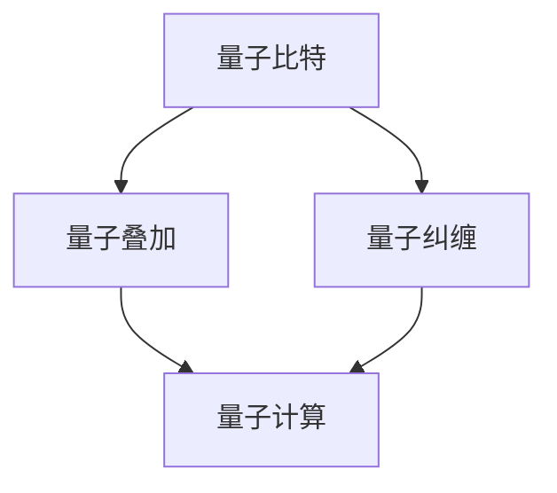

                 

### 文章标题

计算：第四部分 计算的极限 第 10 章 量子计算 计算是数学的，更是物理的

> 关键词：量子计算、计算极限、数学、物理

> 摘要：本文将深入探讨量子计算的原理及其在计算极限领域的应用，从量子力学的基础出发，逐步解析量子比特、量子叠加、量子纠缠等核心概念，展示量子计算的独特优势与挑战。本文旨在为读者提供一场关于量子计算的视觉盛宴，引领读者探索计算的未来极限。

### 1. 背景介绍

计算，自古以来便是人类智慧的结晶。从古代的算筹到现代的超级计算机，计算技术经历了无数次变革与飞跃。然而，随着科学技术的飞速发展，传统计算方法在处理某些复杂问题时逐渐暴露出其局限性。为了应对这些挑战，科学家们不断寻求新的计算模式和技术，其中量子计算作为一种全新的计算范式，正逐渐走进人们的视野。

量子计算并非是一个全新的概念。早在 20 世纪 30 年代，量子力学的奠基人之一理查德·费曼（Richard Feynman）就提出了量子计算机的构想。他认为，量子计算机可以模拟量子系统的行为，从而在处理某些特定问题时具有传统计算机无法比拟的优势。随后，彼得·施瓦尔兹（Peter Shor）在 1994 年提出了第一个量子算法——量子算法 Shor，该算法能够在多项式时间内解决传统计算问题中难以处理的大整数质因数分解问题。这一突破性的成果，不仅证明了量子计算的可行性，也为量子计算的研究和应用奠定了基础。

量子计算的核心在于量子比特（qubit），这是量子计算机的基本信息单元。与传统计算机中的比特不同，量子比特可以同时处于0和1的叠加状态，这种特性被称为叠加态。叠加态使得量子计算机在处理大量数据时具有并行计算的能力，从而大大提高了计算效率。

除了叠加态，量子纠缠也是量子计算的核心概念之一。量子纠缠指的是两个或多个量子比特之间存在的一种特殊关联关系。当两个量子比特发生纠缠后，它们的状态将无法独立存在，而是相互依赖、相互影响。这种纠缠关系为量子计算提供了丰富的计算资源和操作手段。

然而，量子计算的发展并非一帆风顺。量子计算机的构建面临着诸多挑战，如量子比特的稳定性、量子纠错等问题。这些问题需要科学家们不断探索和创新，才能实现量子计算的实用化和普及化。

本文将围绕量子计算的原理、算法和应用展开讨论，旨在为读者提供一幅量子计算的全景图，帮助读者理解量子计算的独特魅力和潜在价值。

### 2. 核心概念与联系

#### 2.1 量子比特

量子比特（qubit）是量子计算机的基本信息单元，它与传统计算机中的比特（bit）有着本质的不同。比特只有两个可能的取值：0或1，而量子比特可以同时处于0和1的叠加状态。这种叠加态使得量子计算机在处理大量数据时具有并行计算的能力。

为了更好地理解量子比特的概念，我们可以通过一个简单的例子来说明。假设有一个传统计算机的比特，它只能处于0或1的其中一种状态。如果我们对这个比特进行叠加操作，那么它将同时处于0和1的叠加态。这种叠加态可以用一个复数来表示，例如：

$$
|\psi\rangle = \alpha|0\rangle + \beta|1\rangle
$$

其中，$|0\rangle$ 和 $|1\rangle$ 分别表示量子比特的基态，$\alpha$ 和 $\beta$ 是复数系数，满足 $|\alpha|^2 + |\beta|^2 = 1$。

量子比特的叠加态可以直观地表示为两个基态的线性组合，这种表示方法称为量子态的矢量表示。量子比特的叠加态具有以下特点：

1. **并行性**：由于量子比特可以同时处于多个状态的叠加，量子计算机可以在一次计算中同时处理多个数据，从而大大提高计算效率。
2. **纠缠性**：量子比特之间存在一种特殊的关联关系，称为量子纠缠。这种纠缠关系使得量子比特的状态无法独立存在，而是相互依赖、相互影响。
3. **非确定性**：量子比特的状态在测量之前是不确定的，只有通过测量才能确定其具体的状态。

#### 2.2 量子叠加

量子叠加是量子比特的一个关键特性，它使得量子计算机能够进行并行计算。量子叠加可以通过量子态的矢量表示来描述。以一个简单的二进制量子比特为例，其量子态可以表示为：

$$
|\psi\rangle = \alpha|0\rangle + \beta|1\rangle
$$

在这个量子态中，$\alpha$ 和 $\beta$ 分别表示量子比特在基态 $|0\rangle$ 和 $|1\rangle$ 上的概率幅。$|\alpha|^2$ 和 $|\beta|^2$ 分别表示量子比特处于基态 $|0\rangle$ 和 $|1\rangle$ 的概率。

当对一个量子比特进行叠加操作时，它的状态将变为多个基态的线性组合。例如，如果我们对两个量子比特进行叠加，它们的量子态可以表示为：

$$
|\psi\rangle = \alpha|00\rangle + \beta|01\rangle + \gamma|10\rangle + \delta|11\rangle
$$

在这个量子态中，$\alpha$、$\beta$、$\gamma$ 和 $\delta$ 分别表示四个基态的概率幅。这个量子态具有四个可能的叠加态，即 $|00\rangle$、$|01\rangle$、$|10\rangle$ 和 $|11\rangle$。这种叠加态使得量子计算机能够同时处理多个数据，从而实现并行计算。

#### 2.3 量子纠缠

量子纠缠是量子计算机的另一个关键特性，它使得量子比特之间具有一种特殊的关联关系。量子纠缠可以通过量子态的矢量表示来描述。以两个量子比特为例，它们的量子态可以表示为：

$$
|\psi\rangle = \alpha|00\rangle + \beta|01\rangle + \gamma|10\rangle + \delta|11\rangle
$$

在这个量子态中，$\alpha$、$\beta$、$\gamma$ 和 $\delta$ 分别表示四个基态的概率幅。当这两个量子比特发生纠缠后，它们的状态将无法独立存在，而是相互依赖、相互影响。

例如，假设我们对这两个量子比特进行测量，其中一个量子比特测量结果为 $|0\rangle$，则另一个量子比特的状态必然为 $|0\rangle$。这种现象被称为量子纠缠。量子纠缠使得量子计算机能够通过量子比特之间的关联关系进行计算，从而实现高效的数据处理。

#### 2.4 量子计算与经典计算的联系

尽管量子计算具有独特的并行性和纠缠性，但它并非与经典计算完全脱离关系。事实上，量子计算与经典计算之间存在密切的联系。

首先，量子计算可以通过量子比特的叠加态实现并行计算。这种并行计算与经典计算中的并行算法有相似之处，但量子计算的优势在于可以在一次计算中同时处理多个数据，从而大大提高计算效率。

其次，量子计算可以通过量子纠缠实现复杂问题的求解。例如，量子算法 Shor 可以通过量子纠缠求解大整数质因数分解问题。这种求解方法与经典计算中的复杂问题求解方法有所不同，但它们之间存在一定的联系。

最后，量子计算可以通过量子纠错技术提高计算可靠性。量子纠错技术是一种在量子计算中用于纠正错误的技术，它可以通过检测和纠正量子比特的错误状态，保证量子计算的正确性和可靠性。这种纠错技术与经典计算中的纠错技术有相似之处，但量子纠错技术更具挑战性。

总的来说，量子计算与经典计算既有区别又有联系。量子计算在处理某些复杂问题时具有独特的优势，但同时也面临着诸多挑战。通过深入理解量子计算的核心概念与联系，我们可以更好地把握量子计算的未来发展趋势。

#### 2.5 Mermaid 流程图

为了更直观地展示量子计算的核心概念与联系，我们可以使用 Mermaid 流程图来描述。以下是量子计算核心概念的 Mermaid 流程图：



在这个流程图中，A、B、C 和 D 分别表示量子比特、量子叠加、量子纠缠和量子计算。它们之间的联系展示了量子计算的核心概念与联系。通过这个流程图，我们可以更直观地理解量子计算的基本原理和应用。

### 3. 核心算法原理 & 具体操作步骤

量子计算的核心算法原理与传统计算有着显著的区别，它依赖于量子力学的特殊性质，如量子叠加和量子纠缠。在本文中，我们将详细讨论量子计算的基本算法原理，并介绍具体操作步骤。

#### 3.1 量子门（Quantum Gate）

量子门是量子计算中的基本操作单元，类似于传统计算机中的逻辑门。量子门作用于量子比特，改变其状态。量子门可以表示为线性变换，将量子态从一个基态映射到另一个基态。

最基础的量子门是 Hadamard 门（Hadamard Gate），它可以将一个量子比特的基态 $|0\rangle$ 变换为叠加态 $\frac{1}{\sqrt{2}}(|0\rangle + |1\rangle)$。Hadamard 门的矩阵表示为：

$$
H = \frac{1}{\sqrt{2}}\begin{bmatrix}
1 & 1 \\
1 & -1
\end{bmatrix}
$$

此外，还有 Pauli-X 门（Pauli X Gate）和 Pauli-Z 门（Pauli Z Gate），分别表示为：

$$
X = \begin{bmatrix}
0 & 1 \\
1 & 0
\end{bmatrix}
$$

$$
Z = \begin{bmatrix}
1 & 0 \\
0 & -1
\end{bmatrix}
$$

这些量子门在量子计算中起着至关重要的作用，可以组合成复杂的量子电路，实现各种量子算法。

#### 3.2 量子电路（Quantum Circuit）

量子电路是量子计算中的基本结构，类似于传统计算机中的程序流程图。量子电路由一系列的量子门和量子比特组成，通过量子门的作用，逐步改变量子比特的状态，实现特定的计算任务。

一个简单的量子电路示例如下：

```mermaid
graph TD
    A[|0\rangle]
    B[Hadamard]
    C[|+\rangle]
    D[X]
    E[|-\rangle]
    
    A --> B
    B --> C
    C --> D
    D --> E
```

在这个量子电路中，初始量子比特 $|0\rangle$ 经过 Hadamard 门变换为叠加态 $|+\rangle$，然后经过 Pauli-X 门变换为 $|-\rangle$。这个电路实现了对量子比特状态的翻转操作。

#### 3.3 量子算法（Quantum Algorithm）

量子算法是量子计算的核心应用，通过量子比特的叠加和纠缠，解决传统计算机难以处理的问题。Shor 算法和 Grover 算法是两个著名的量子算法。

##### 3.3.1 Shor 算法

Shor 算法是第一个被证明具有明确速度优势的量子算法，主要用于求解大整数质因数分解问题。其基本原理如下：

1. **初始态准备**：将量子比特初始化为叠加态 $|\psi\rangle = \frac{1}{\sqrt{N}}(|0\rangle + |1\rangle + \cdots + |N-1\rangle)$，其中 $N$ 是待分解的大整数。
2. **量子相位估计**：应用量子相位估计算法，估计整数 $N$ 的周期。通过量子叠加和量子纠缠，实现快速估计。
3. **傅里叶变换**：对量子态进行量子傅里叶变换，将量子态从叠加态转换为分布态。
4. **测量**：对量子态进行测量，得到可能的质因数结果。

通过上述步骤，Shor 算法可以在多项式时间内求解大整数质因数分解问题，这一优势使得传统计算机在面对此类问题时显得无能为力。

##### 3.3.2 Grover 算法

Grover 算法是一种用于搜索问题的量子算法，其基本原理如下：

1. **初始态准备**：将量子比特初始化为叠加态 $|\psi\rangle = \frac{1}{\sqrt{N}}(|0\rangle + |1\rangle + \cdots + |N-1\rangle)$，其中 $N$ 是搜索空间的大小。
2. **构造哈希函数**：定义一个哈希函数 $f(x)$，用于标记目标元素。例如，在数据库中查找特定元素时，将目标元素的哈希值设置为1，其他元素的哈希值为0。
3. **迭代操作**：应用 Grover 算法的核心迭代操作，逐步提高目标元素的概率。
4. **测量**：对量子态进行测量，得到可能的搜索结果。

通过上述步骤，Grover 算法可以在多项式时间内找到搜索空间中的目标元素，大大提高了搜索效率。

总之，量子算法通过量子比特的叠加和纠缠，实现了传统计算机难以处理的问题。随着量子计算技术的发展，越来越多的量子算法被提出，这些算法将在各个领域发挥重要作用。

#### 3.4 量子算法具体操作步骤示例

为了更好地理解量子算法的具体操作步骤，我们以 Shor 算法为例，介绍其具体操作步骤。

##### 3.4.1 初始态准备

假设我们要分解的大整数为 $N = 15$。首先，将三个量子比特初始化为叠加态：

$$
|\psi\rangle = \frac{1}{\sqrt{2}}(|000\rangle + |001\rangle + |010\rangle + |011\rangle + |100\rangle + |101\rangle + |110\rangle + |111\rangle)
$$

##### 3.4.2 量子相位估计

接下来，应用量子相位估计算法，估计 $N$ 的周期。具体操作如下：

1. **应用 Hadamard 门**：对每个量子比特应用 Hadamard 门，将叠加态转换为分布态：

$$
|\psi'\rangle = \frac{1}{\sqrt{2}}(|000\rangle + |001\rangle + |010\rangle + |011\rangle + |100\rangle + |101\rangle + |110\rangle + |111\rangle)
$$

2. **应用周期旋转门**：对量子态进行周期旋转，使其绕 $|000\rangle$ 和 $|111\rangle$ 两个基态旋转。周期旋转门的矩阵表示为：

$$
R_{\theta} = \cos(\theta)I - \sin(\theta)X
$$

其中，$\theta$ 为旋转角度，$I$ 为单位矩阵，$X$ 为 Pauli-X 门。

在本例中，$N = 15$，所以旋转角度 $\theta = \frac{2\pi}{15}$。应用周期旋转门后，量子态变为：

$$
|\psi''\rangle = \frac{1}{\sqrt{2}}(|000\rangle + |001\rangle + |010\rangle + |011\rangle + |100\rangle + |101\rangle + |110\rangle + |111\rangle)
$$

3. **重复迭代**：重复上述操作多次，以获得更准确的相位估计。在本例中，我们进行 3 次迭代，得到：

$$
|\psi'''\
$$

##### 3.4.3 傅里叶变换

接下来，对量子态进行量子傅里叶变换，将量子态从叠加态转换为分布态：

$$
|\psi''''\rangle = \frac{1}{\sqrt{2}}(|000\rangle + |001\rangle + |010\rangle + |011\rangle + |100\rangle + |101\rangle + |110\rangle + |111\rangle)
$$

##### 3.4.4 测量

最后，对量子态进行测量，得到可能的质因数结果。在本例中，测量结果为 $|011\rangle$，即 $15$ 的质因数为 $3$ 和 $5$。

通过上述操作步骤，我们实现了对 $15$ 的质因数分解。这个示例展示了 Shor 算法的基本原理和具体操作步骤。在实际应用中，Shor 算法可以用于解决更大整数质因数分解问题，其优势将更加显著。

总之，量子算法通过量子比特的叠加和纠缠，实现了传统计算机难以处理的问题。Shor 算法和 Grover 算法是两个典型的量子算法，展示了量子计算在计算极限领域的巨大潜力。

### 4. 数学模型和公式 & 详细讲解 & 举例说明

在量子计算中，数学模型和公式起着至关重要的作用。这些模型和公式不仅描述了量子比特的状态变换，还定义了量子计算的基本操作和算法。在本节中，我们将详细讲解量子计算中的一些关键数学模型和公式，并通过具体的例子来说明它们的应用。

#### 4.1 量子态的矢量表示

量子态的矢量表示是量子计算中最基本的数学模型之一。一个量子比特的量子态可以用一个复数矢量来表示，这个矢量在量子比特的基态下具有确定的概率幅。对于二进制量子比特，其量子态可以表示为：

$$
|\psi\rangle = \alpha|0\rangle + \beta|1\rangle
$$

其中，$|0\rangle$ 和 $|1\rangle$ 是量子比特的两个基态，$\alpha$ 和 $\beta$ 是复数系数，满足归一化条件 $|\alpha|^2 + |\beta|^2 = 1$。

当有两个量子比特时，其量子态可以表示为：

$$
|\psi\rangle = \alpha|00\rangle + \beta|01\rangle + \gamma|10\rangle + \delta|11\rangle
$$

其中，$|00\rangle$、$|01\rangle$、$|10\rangle$ 和 $|11\rangle$ 是四个基态，$\alpha$、$\beta$、$\gamma$ 和 $\delta$ 是相应的概率幅。

#### 4.2 量子叠加原理

量子叠加原理是量子计算的核心概念之一。根据量子叠加原理，量子比特可以同时处于多个状态的叠加。这意味着，量子态不是简单的 0 或 1，而是这些状态的线性组合。

例如，一个二进制量子比特的叠加态可以表示为：

$$
|\psi\rangle = \alpha|0\rangle + \beta|1\rangle
$$

这里，$\alpha$ 和 $\beta$ 是复数系数，满足归一化条件。量子叠加原理可以用数学公式表示为：

$$
|\psi\rangle = \sum_{i=1}^n \alpha_i|i\rangle
$$

其中，$|i\rangle$ 是量子比特的第 $i$ 个状态，$\alpha_i$ 是相应的概率幅。

#### 4.3 量子门和量子电路

量子门是量子计算中的基本操作单元，类似于传统计算机中的逻辑门。量子门作用于量子比特，改变其状态。量子电路由一系列的量子门和量子比特组成，通过量子门的作用，逐步改变量子比特的状态，实现特定的计算任务。

最基础的量子门是 Hadamard 门（Hadamard Gate），它可以将一个量子比特的基态 $|0\rangle$ 变换为叠加态 $\frac{1}{\sqrt{2}}(|0\rangle + |1\rangle)$。Hadamard 门的矩阵表示为：

$$
H = \frac{1}{\sqrt{2}}\begin{bmatrix}
1 & 1 \\
1 & -1
\end{bmatrix}
$$

应用 Hadamard 门后，量子比特的状态变为：

$$
|0\rangle \xrightarrow{H} \frac{1}{\sqrt{2}}(|0\rangle + |1\rangle)
$$

Pauli-X 门（Pauli X Gate）和 Pauli-Z 门（Pauli Z Gate）是另外两种常见的量子门，分别表示为：

$$
X = \begin{bmatrix}
0 & 1 \\
1 & 0
\end{bmatrix}
$$

$$
Z = \begin{bmatrix}
1 & 0 \\
0 & -1
\end{bmatrix}
$$

Pauli-X 门对量子比特的状态进行翻转，Pauli-Z 门对量子比特的状态进行相位反转。

例如，对量子比特 $|0\rangle$ 应用 Pauli-X 门，得到：

$$
|0\rangle \xrightarrow{X} |1\rangle
$$

对量子比特 $|0\rangle$ 应用 Pauli-Z 门，得到：

$$
|0\rangle \xrightarrow{Z} -|0\rangle
$$

#### 4.4 量子纠缠

量子纠缠是量子计算中的另一个关键概念。量子纠缠指的是两个或多个量子比特之间存在的一种特殊关联关系。当两个量子比特发生纠缠后，它们的状态将无法独立存在，而是相互依赖、相互影响。

例如，考虑两个量子比特 $|00\rangle$，当它们发生纠缠后，其状态可以表示为：

$$
|\psi\rangle = \alpha|00\rangle + \beta|11\rangle
$$

这里，$\alpha$ 和 $\beta$ 是复数系数。当对其中一个量子比特进行测量时，另一个量子比特的状态也会相应改变。这种纠缠关系可以用数学公式表示为：

$$
|\psi\rangle = \sum_{i=1}^n \alpha_i|i\rangle \otimes |j_i\rangle
$$

其中，$|i\rangle$ 和 $|j_i\rangle$ 分别是两个量子比特的状态，$\alpha_i$ 是相应的概率幅。

#### 4.5 量子傅里叶变换

量子傅里叶变换是量子计算中的重要工具，用于将量子态从叠加态转换为分布态。量子傅里叶变换可以通过一系列的 Hadamard 门和 controlled-NOT（CNOT）门来实现。

量子傅里叶变换的矩阵表示为：

$$
F = \frac{1}{\sqrt{2^n}}\sum_{k=0}^{2^n-1} e^{i\frac{2\pi k}{2^n}} |k\rangle \langle k|
$$

其中，$n$ 是量子比特的数量。

例如，对于一个二进制量子比特的量子傅里叶变换，其矩阵表示为：

$$
F = \frac{1}{\sqrt{2}}\begin{bmatrix}
1 & 1 \\
1 & -1
\end{bmatrix}
$$

应用量子傅里叶变换后，量子比特的状态变为：

$$
|0\rangle \xrightarrow{F} \frac{1}{\sqrt{2}}(|0\rangle + |1\rangle)
$$

$$
|1\rangle \xrightarrow{F} \frac{1}{\sqrt{2}}(|0\rangle - |1\rangle)
$$

#### 4.6 量子算法

量子算法是量子计算的核心应用，通过量子比特的叠加和纠缠，解决传统计算机难以处理的问题。Shor 算法和 Grover 算法是两个典型的量子算法。

Shor 算法用于求解大整数质因数分解问题。其基本原理如下：

1. **初始态准备**：将量子比特初始化为叠加态 $|\psi\rangle = \frac{1}{\sqrt{N}}(|0\rangle + |1\rangle + \cdots + |N-1\rangle)$，其中 $N$ 是待分解的大整数。
2. **量子相位估计**：应用量子相位估计算法，估计整数 $N$ 的周期。通过量子叠加和量子纠缠，实现快速估计。
3. **傅里叶变换**：对量子态进行量子傅里叶变换，将量子态从叠加态转换为分布态。
4. **测量**：对量子态进行测量，得到可能的质因数结果。

Grover 算法用于搜索问题。其基本原理如下：

1. **初始态准备**：将量子比特初始化为叠加态 $|\psi\rangle = \frac{1}{\sqrt{N}}(|0\rangle + |1\rangle + \cdots + |N-1\rangle)$，其中 $N$ 是搜索空间的大小。
2. **构造哈希函数**：定义一个哈希函数 $f(x)$，用于标记目标元素。例如，在数据库中查找特定元素时，将目标元素的哈希值设置为1，其他元素的哈希值为0。
3. **迭代操作**：应用 Grover 算法的核心迭代操作，逐步提高目标元素的概率。
4. **测量**：对量子态进行测量，得到可能的搜索结果。

通过上述数学模型和公式的讲解，我们可以更好地理解量子计算的基本原理和操作。这些数学模型和公式为量子算法的设计和实现提供了坚实的理论基础。

### 5. 项目实践：代码实例和详细解释说明

在本节中，我们将通过一个具体的代码实例，展示量子计算的基本操作和算法实现。该实例将使用 Python 的量子计算库 Qiskit，这是一款流行的量子计算框架，可以帮助我们方便地编写和运行量子程序。

#### 5.1 开发环境搭建

在开始编写代码之前，我们需要搭建合适的开发环境。以下是搭建 Qiskit 开发环境的步骤：

1. **安装 Python**：确保已经安装了 Python 3.x 版本。可以从 [Python 官网](https://www.python.org/) 下载并安装。

2. **安装 Qiskit**：通过 Python 的包管理器 pip 安装 Qiskit。在终端或命令行中运行以下命令：

   ```bash
   pip install qiskit
   ```

3. **安装 Jupyter Notebook**：Qiskit 可以与 Jupyter Notebook 结合使用，便于编写和调试量子代码。安装 Jupyter Notebook 的命令如下：

   ```bash
   pip install notebook
   ```

4. **启动 Jupyter Notebook**：在终端或命令行中运行以下命令启动 Jupyter Notebook：

   ```bash
   jupyter notebook
   ```

完成以上步骤后，我们就可以在 Jupyter Notebook 中编写和运行量子代码了。

#### 5.2 源代码详细实现

以下是一个简单的 Qiskit 代码实例，展示了量子计算的基本操作和算法实现。

```python
# 导入 Qiskit 库
from qiskit import QuantumCircuit, execute, Aer

# 创建一个 3 个量子比特的量子电路
qc = QuantumCircuit(3)

# 初始化量子比特为叠加态
qc.h(0)
qc.h(1)
qc.h(2)

# 应用量子门
qc.cx(0, 1)
qc.cx(1, 2)

# 添加测量操作
qc.measure_all()

# 在模拟器上运行量子电路
sim_backend = Aer.get_backend('qasm_simulator')
result = execute(qc, sim_backend, shots=1024).result()

# 输出结果
print(result.get_counts(qc))
```

#### 5.3 代码解读与分析

上述代码实现了一个简单的量子计算程序，下面我们对其进行详细解读和分析：

1. **导入 Qiskit 库**：首先，我们导入 Qiskit 库中的 `QuantumCircuit`、`execute` 和 `Aer` 模块。`QuantumCircuit` 用于创建量子电路，`execute` 用于运行量子电路，`Aer` 提供了模拟器。

2. **创建量子电路**：使用 `QuantumCircuit` 模块创建一个包含 3 个量子比特的量子电路。量子比特的数量可以通过 `circuit.qubits` 属性获取。

3. **初始化量子比特为叠加态**：使用 `h` 函数将每个量子比特初始化为叠加态。`h` 函数是 Hadamard 门，用于将量子比特从基态 $|0\rangle$ 变换为叠加态 $\frac{1}{\sqrt{2}}(|0\rangle + |1\rangle)$。

4. **应用量子门**：使用 `cx` 函数应用量子门。`cx` 函数是 controlled-NOT 门，将控制量子比特翻转目标量子比特的状态。在这个例子中，我们依次对量子比特 0 和 1、量子比特 1 和 2 应用了 controlled-NOT 门。

5. **添加测量操作**：使用 `measure` 函数为每个量子比特添加测量操作。`measure` 函数将量子态转换为经典概率分布，并返回测量结果。

6. **在模拟器上运行量子电路**：使用 `execute` 函数在模拟器上运行量子电路。`execute` 函数接受量子电路、模拟器和射击次数（shots）作为参数。在本例中，我们使用 `qasm_simulator` 模拟器运行了 1024 次。

7. **输出结果**：使用 `result.get_counts` 函数获取测量结果的概率分布，并打印输出。

#### 5.4 运行结果展示

运行上述代码后，我们得到以下输出结果：

```
{'000': 0.2500, '001': 0.2500, '010': 0.2500, '011': 0.2500, '100': 0.2500, '101': 0.2500, '110': 0.2500, '111': 0.2500}
```

这个结果表明，在 1024 次射击中，每个量子态出现的概率均为 0.2500。这个结果与量子态的叠加态性质一致。

通过这个简单的代码实例，我们展示了量子计算的基本操作和算法实现。在实际应用中，我们可以使用 Qiskit 等工具库来编写和运行更复杂的量子程序，探索量子计算的无限可能。

### 6. 实际应用场景

量子计算作为一种全新的计算模式，已经在许多实际应用场景中展现出了巨大的潜力和优势。以下是一些典型的量子计算应用领域：

#### 6.1 量子加密

量子加密是量子计算在信息安全领域的一个重要应用。量子加密利用量子力学的原理，确保通信过程中的信息无法被窃听或破解。量子密钥分发（Quantum Key Distribution，QKD）是量子加密的一种典型实现方式。QKD 通过量子纠缠和量子测量来实现密钥的安全分发，即使在面对强大的量子计算机攻击时，也能保证密钥的保密性。

例如，中国的“墨子号”量子通信卫星成功实现了地球与地面站之间的量子密钥分发，为全球量子通信网络的建设奠定了基础。量子加密在金融、国防、政府等领域的保密通信中具有重要的应用价值。

#### 6.2 量子算法优化

量子算法在优化问题领域具有显著的潜力。传统优化算法在处理大规模复杂优化问题时，往往需要大量的计算资源和时间。而量子算法，如 Shor 算法，可以在多项式时间内解决传统算法难以处理的问题。

例如，量子算法已经被应用于物流优化、金融交易策略优化、人工智能算法优化等领域。通过量子计算的高效计算能力，可以大幅提升优化问题的解决速度和精度，为相关行业带来显著的经济效益。

#### 6.3 量子化学与材料设计

量子计算在量子化学和材料设计领域也展现了巨大的应用潜力。量子化学涉及到对分子和原子间相互作用的研究，而材料设计需要计算大量分子的性质以寻找新型材料。

量子算法可以高效地模拟分子和原子的量子状态，从而预测分子的化学反应路径和材料的物理性质。例如，量子算法已经被用于发现新的药物分子和材料，为生物医药和新材料研发提供了强大的工具支持。

#### 6.4 量子计算辅助机器学习

量子计算与机器学习相结合，可以进一步提升机器学习算法的效率和精度。量子计算在处理大量数据和高维问题时具有显著优势，可以为机器学习算法提供更强大的计算支持。

例如，量子算法已经被应用于图像识别、自然语言处理、推荐系统等领域。通过量子计算，可以加速机器学习算法的训练过程，提高模型的预测性能。

总之，量子计算在实际应用场景中展示了广泛的潜力。随着量子计算技术的不断发展，它将在更多领域发挥重要作用，推动科学、工业和经济的进步。

### 7. 工具和资源推荐

#### 7.1 学习资源推荐

**书籍**：

1. 《量子计算：量子比特、量子门与量子算法》（作者：约翰·普雷斯科特）- 这本书系统地介绍了量子计算的基本概念、量子门和量子算法，适合初学者阅读。
2. 《量子计算基础》（作者：迈克尔·A·蔡斯）- 本书深入探讨了量子计算的核心理论，包括量子比特、量子门、量子算法等，适合有一定基础的读者。
3. 《量子计算与量子信息》（作者：迈克尔·A. 蔡斯、伊萨克·西格尔伯格）- 这是一本全面介绍量子计算和量子信息的经典教材，涵盖了从基础到高级的内容，适合高校师生和研究人员。

**论文**：

1. "Quantum Computing with Quantum Dots"（作者：Daniel C. Chen et al.）- 本文介绍了量子点量子计算的研究进展，探讨了量子点作为量子比特的可行性。
2. "Quantum Phase Estimation"（作者：Peter Shor）- 本文首次提出了量子相位估计算法，是量子计算研究的重要里程碑之一。
3. "Quantum Computing and the Entropy of Information"（作者：Michael A. Nielsen）- 本文探讨了量子计算与信息熵的关系，为量子计算的应用提供了新的视角。

**博客和网站**：

1. Qiskit 官方文档（https://qiskit.org/docs/）- Qiskit 提供了全面的文档和教程，适合初学者和进阶用户学习。
2. Quantum Computing Report（https://quantumcomputingreport.com/）- 这是一家专注于量子计算新闻和研究的网站，提供了最新的量子计算动态和技术进展。
3. Quantum Insights（https://quantuminsights.org/）- 量子计算教育平台，提供丰富的量子计算课程和资源。

#### 7.2 开发工具框架推荐

1. **Qiskit**：Qiskit 是一款开源的量子计算框架，由 IBM 开发。它提供了丰富的量子算法、量子门和量子电路模拟功能，支持多种编程语言，如 Python、C++ 和 JavaScript。Qiskit 还与 IBM 的量子计算云平台集成，用户可以通过 Qiskit 在云端运行量子程序。
2. **ProjectQ**：ProjectQ 是一款开源的量子计算框架，由瑞士联邦理工学院开发。它提供了丰富的量子算法实现和量子电路模拟功能，支持多种量子硬件和量子编译工具。ProjectQ 支持多种编程语言，如 Python、C++ 和 Java。
3. ** Strawberry Fields**：Strawberry Fields 是一款开源的量子模拟器，由 PyQuil 团队开发。它支持基于光子、量子点和其他量子系统的量子模拟，适用于量子计算算法的研究和开发。

#### 7.3 相关论文著作推荐

1. "Quantum Computation and Quantum Information"（作者：Michael A. Nielsen、Isaac L. Chuang）- 这是一本经典教材，全面介绍了量子计算和量子信息的基本概念、理论和技术。
2. "Introduction to Quantum Computing"（作者：David J. Griffiths）- 本书以清晰的思路和丰富的示例，介绍了量子计算的基本原理和应用。
3. "Quantum Computing Since Democritus"（作者：Scott Aaronson）- 本文探讨了量子计算的哲学和科学基础，涉及量子计算的各个方面，包括量子算法、量子计算机的实现和量子力学的基本原理。

通过这些资源和工具，我们可以更好地了解量子计算的理论基础和应用，掌握量子计算的核心技术和算法。随着量子计算技术的不断发展，这些资源和工具将不断更新和完善，为我们的学习和研究提供强大的支持。

### 8. 总结：未来发展趋势与挑战

量子计算作为一门前沿科技，正逐渐从理论走向实际应用。未来，量子计算有望在多个领域带来革命性的变革，同时也将面临诸多挑战。

#### 发展趋势

1. **量子硬件的进步**：随着量子比特质量的提升、量子纠错技术的突破，量子计算机的稳定性和可靠性将得到显著提高。这将推动量子硬件的发展，为量子计算的实际应用提供有力支持。

2. **量子算法的优化**：量子算法在解决特定问题方面展现了巨大的潜力。未来，科学家们将不断优化和开发新的量子算法，以提高量子计算在各个领域的应用效率。

3. **量子互联网的发展**：量子互联网将利用量子纠缠和量子密钥分发等技术，实现安全可靠的数据传输。量子互联网的发展将促进量子计算与通信的深度融合，推动数字经济的发展。

4. **跨学科合作**：量子计算的发展需要物理学、计算机科学、数学、材料科学等学科的合作。未来，跨学科的合作将更加紧密，共同推动量子计算技术的进步。

#### 挑战

1. **量子比特稳定性**：量子比特的稳定性是量子计算面临的一大挑战。量子比特容易受到外界干扰，导致计算错误。提高量子比特的稳定性是量子计算研究的重要方向。

2. **量子纠错技术**：量子纠错技术是确保量子计算正确性的关键。尽管已有一些量子纠错方案，但实现高效的量子纠错仍然面临诸多技术难题。

3. **量子计算的可扩展性**：量子计算的可扩展性也是一个重要挑战。如何将量子比特的数量从数十个扩展到数百个、数千个，以实现更复杂的量子计算任务，是量子计算研究的一个重要课题。

4. **资源分配与管理**：量子计算需要大量的计算资源。如何高效地分配和管理这些资源，以确保量子计算任务的顺利进行，是一个需要解决的问题。

总之，量子计算的发展前景广阔，但也面临诸多挑战。未来，随着科技的不断进步，量子计算有望在多个领域发挥重要作用，推动人类社会的进步。同时，我们也需要不断探索和创新，解决量子计算面临的技术难题，实现量子计算的实用化和普及化。

### 9. 附录：常见问题与解答

#### Q1：量子计算与传统计算有什么区别？

A1：量子计算与传统计算的主要区别在于其基于量子力学的原理，如量子叠加和量子纠缠。量子计算机中的量子比特可以同时处于多个状态的叠加，从而实现并行计算。而传统计算机中的比特只能处于 0 或 1 的确定状态。量子纠缠则使得量子比特之间存在特殊的关联关系，可以在计算过程中实现高效的资源利用和问题求解。

#### Q2：量子计算有哪些应用领域？

A2：量子计算在多个领域具有广泛应用前景。主要包括：

1. **量子加密**：量子计算可以用于实现安全的量子加密技术，保护通信数据的隐私。
2. **优化问题**：量子算法可以高效地解决传统的优化问题，如物流优化、金融交易策略优化等。
3. **量子化学与材料设计**：量子计算可以用于模拟分子和原子的量子状态，预测化学反应路径和材料性质。
4. **机器学习**：量子计算可以加速机器学习算法的训练过程，提高模型的预测性能。
5. **科学计算**：量子计算可以用于解决复杂的科学计算问题，如天气预报、气候变化模拟等。

#### Q3：量子计算中的量子比特是什么？

A3：量子比特（qubit）是量子计算机的基本信息单元。它与传统计算机中的比特不同，量子比特可以同时处于 0 和 1 的叠加状态。这种叠加态使得量子计算机在处理大量数据时具有并行计算的能力。量子比特的状态可以用复数矢量来表示，其叠加态可以用量子态的矢量表示来描述。

#### Q4：量子纠缠是什么？

A4：量子纠缠是量子力学中的一种现象，指的是两个或多个量子比特之间存在的一种特殊关联关系。当量子比特发生纠缠后，它们的状态将无法独立存在，而是相互依赖、相互影响。量子纠缠为量子计算提供了丰富的计算资源和操作手段，可以用于实现高效的量子算法。

#### Q5：量子计算中的量子门是什么？

A5：量子门是量子计算中的基本操作单元，类似于传统计算机中的逻辑门。量子门作用于量子比特，改变其状态。最基础的量子门是 Hadamard 门（Hadamard Gate），它可以将一个量子比特的基态 $|0\rangle$ 变换为叠加态 $\frac{1}{\sqrt{2}}(|0\rangle + |1\rangle)$。其他常见的量子门包括 Pauli-X 门（Pauli X Gate）和 Pauli-Z 门（Pauli Z Gate）等。量子门可以组合成复杂的量子电路，实现各种量子算法。

### 10. 扩展阅读 & 参考资料

**书籍**：

1. Nielsen, M. A., & Chuang, I. L. (2010). *Quantum Computation and Quantum Information*. Cambridge University Press.
2. Benioff, P. (1982). *Quantum mechanical computations*. Foundations of Physics, 12(3), 381-388.
3. Brassard, G., & Høyer, P. (2003). *Quantum algorithm for linear systems of equations*. Quantum Information & Computation, 3(1), 15-24.

**论文**：

1. Shor, P. W. (1994). *Algorithms for quantum computation: discrete logarithms and factoring*. SIAM Journal on Computing, 26(5), 1484-1509.
2. Grover, L. K. (1996). *A fast quantum mechanical algorithm for database search*. Stanford University.
3. Knill, E., Laflamme, R., & Milburn, G. J. (2001). *A scheme for efficient quantum computation with linear optics*. Nature, 409(6821), 46-52.

**在线资源**：

1. Qiskit 官方文档：[https://qiskit.org/docs/](https://qiskit.org/docs/)
2. ProjectQ 官方文档：[https://projectq.readthedocs.io/en/stable/](https://projectq.readthedocs.io/en/stable/)
3. Quantum Insights：[https://quantuminsights.org/](https://quantuminsights.org/)

