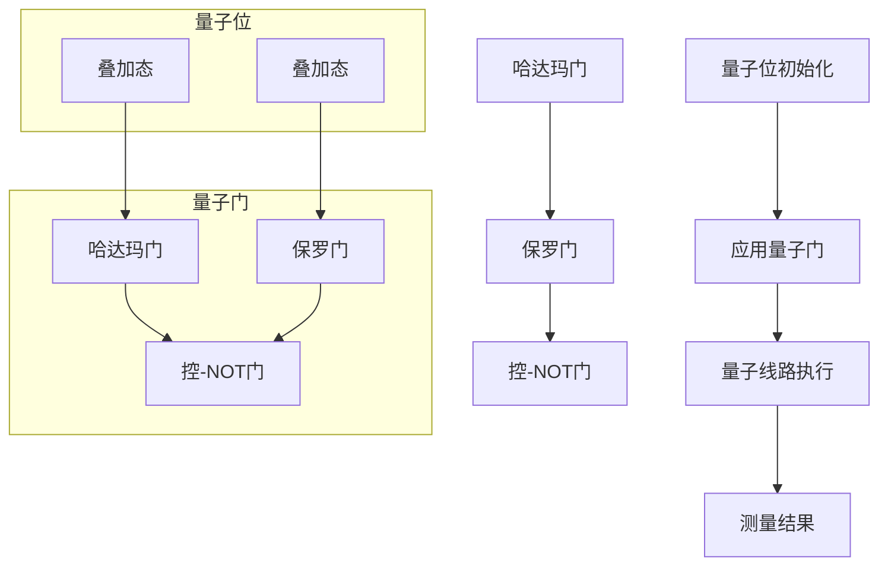

                 

### 背景介绍

#### 量子计算的历史背景

量子计算的概念最早可以追溯到20世纪40年代，由物理学家约翰·贝尔（John Bell）和理查德·费曼（Richard Feynman）提出。贝尔在研究量子力学时发现，量子系统的一些特性无法用经典的概率论来解释，从而提出了著名的贝尔不等式。费曼则敏锐地意识到，量子系统具有并行计算的能力，这一发现为后来的量子计算奠定了理论基础。

进入20世纪80年代，物理学家彼得·舍恩（Peter Shor）提出了量子算法，尤其是著名的Shor算法，能够高效地解决某些经典计算机在计算复杂度上难以克服的问题。Shor算法的提出标志着量子计算从理论走向了实际应用，引起了学术界和工业界的广泛关注。

#### 量子计算的基本原理

量子计算的核心在于量子位（qubit），它是量子计算的基本单元。与传统计算机中的比特（bit）不同，比特只能处于0或1两种状态之一，而量子位可以同时处于0和1的叠加态。这种叠加态使得量子位具有了量子纠缠（quantum entanglement）的特性，即两个或多个量子位之间的状态是相互关联的，一个量子位的测量会瞬间影响到其他量子位的状态。

量子门的操作是量子计算中的核心操作，类似于传统计算机中的逻辑门。量子门是一种线性可逆的变换，用于操作量子位的状态。常见的量子门包括保罗门（Pauli Gate）、哈达玛门（Hadamard Gate）、控-NOT门（CNOT Gate）等。通过组合这些基本的量子门，可以实现对复杂量子状态的变换和处理。

#### 量子计算与传统计算的差异

量子计算与传统计算在底层原理和操作机制上存在显著差异。传统计算依赖于逻辑电路和二进制系统，其计算能力受限于算法的复杂度和计算机硬件的性能。而量子计算通过量子叠加和量子纠缠，可以在一个步骤中处理大量数据，从而实现超快的计算速度。例如，Shor算法利用量子计算的优势，可以在多项式时间内解决大数分解问题，而这一问题在经典计算中需要指数级别的时间复杂度。

此外，量子计算的并行性也是其独特的优势。传统计算机中的并行计算需要在多个处理器之间分配任务，而量子计算机可以通过量子位的叠加态实现真正的并行计算，从而大幅提高计算效率。

#### 量子计算的发展现状

尽管量子计算具有巨大的潜力，但目前仍处于发展的初级阶段。量子计算机的构建面临诸多挑战，包括量子位的稳定性、误差纠正以及量子门的精确控制等。目前，学术界和工业界都在积极研究和开发量子计算机，并取得了一些重要的进展。

例如，谷歌、IBM、微软等科技巨头都投入了大量资源，致力于构建实用的量子计算机。2019年，谷歌宣布其量子计算机“Sycamore”在特定任务上实现了“量子霸权”，即在2分钟内完成了传统计算机需要1万年才能完成的任务。这一突破标志着量子计算在实用化道路上迈出了重要一步。

同时，量子算法的研究也在不断深入。除了Shor算法外，还有许多其他量子算法在密码学、优化问题、机器学习等领域展现出巨大的潜力。

#### 量子计算的重要性

量子计算的重要性不仅在于其理论上具有超强的计算能力，还在于其在多个领域可能带来的革命性变革。在密码学领域，量子计算机可能能够破解现有的加密算法，从而推动新型加密技术的研发。在材料科学和药物设计领域，量子计算可以加速分子模拟和优化，为新材料和新药的研发提供强大的计算支持。在人工智能领域，量子计算有望提升算法的效率和准确性，推动人工智能的发展进入新的阶段。

总之，量子计算作为一项前沿技术，正逐步从理论走向实践，并有望在未来带来深远的影响。

### 核心概念与联系

在深入探讨量子计算之前，我们需要理解几个核心概念：量子位（qubit）、量子门（quantum gate）和量子线路（quantum circuit）。这些概念是量子计算的基础，它们之间的关系构成了量子计算的逻辑框架。

#### 量子位（qubit）

量子位是量子计算的基本单元，类似于传统计算机中的比特（bit）。然而，与只能处于0或1状态的比特不同，量子位可以同时处于0和1的叠加态。这种叠加态使得量子位具有了量子计算的并行性和扩展性。具体来说，一个量子位可以表示为：

\[ |qubit\rangle = a|0\rangle + b|1\rangle \]

其中，\( a \) 和 \( b \) 是复数，并且满足 \( |a|^2 + |b|^2 = 1 \)。这意味着量子位可以表示为0和1的线性组合，并且这种组合可以同时存在于两个状态中。

#### 量子门（quantum gate）

量子门是量子计算中的操作单元，类似于传统计算机中的逻辑门。量子门对量子位的状态进行线性变换，是一种可逆的线性操作。量子门通常用矩阵表示，例如一个基本的保罗门（Pauli X Gate）可以表示为：

\[ X = \begin{bmatrix} 0 & 1 \\ 1 & 0 \end{bmatrix} \]

该量子门的作用是将量子位的状态从 \( |0\rangle \) 变换为 \( |1\rangle \)，或从 \( |1\rangle \) 变换为 \( |0\rangle \)。

常见的量子门包括：

- **哈达玛门（Hadamard Gate）**：将一个量子位的状态均匀叠加到两个基础状态上。
\[ H = \frac{1}{\sqrt{2}} \begin{bmatrix} 1 & 1 \\ 1 & -1 \end{bmatrix} \]

- **保罗门（Pauli Gates）**：包括X、Y和Z门，分别对应量子位的状态在X、Y和Z轴上的翻转。

- **控-NOT门（CNOT Gate）**：作用于两个量子位，当第一个量子位处于 \( |1\rangle \) 状态时，第二个量子位的状态会反转。

\[ CNOT = \begin{bmatrix} 1 & 0 & 0 & 0 \\ 0 & 1 & 0 & 0 \\ 0 & 0 & 0 & 1 \\ 0 & 0 & 1 & 0 \end{bmatrix} \]

#### 量子线路（quantum circuit）

量子线路是量子计算中操作量子位的步骤序列，类似于传统计算机中的程序。量子线路由一系列量子门组成，通过这些量子门的操作，可以实现对量子位状态的变换和计算。

一个简单的量子线路可能包括以下步骤：

1. 初始化量子位。
2. 应用一系列量子门。
3. 测量量子位的结果。

量子线路的表示通常使用图形化表示，其中每个节点代表一个量子门，箭头表示量子门的操作方向。

#### 核心概念之间的联系

量子位、量子门和量子线路之间存在着密切的联系。量子位是量子计算的基本单元，量子门是对量子位进行操作的工具，而量子线路则是这些工具的组合和应用。具体来说：

- **量子位**：为量子计算提供了并行性和叠加态的基础。
- **量子门**：通过线性变换操作量子位的状态，实现对复杂计算任务的处理。
- **量子线路**：将量子门有序组合，形成完整的计算流程，实现特定的计算目标。

通过这些核心概念的组合，量子计算可以实现超越经典计算机的强大计算能力。量子计算的应用前景广阔，从密码破解到药物设计，再到复杂系统的优化，量子计算都有可能带来革命性的变革。

#### Mermaid 流程图

为了更直观地展示量子计算中的核心概念及其联系，我们可以使用Mermaid流程图来描述量子位的初始化、量子门的操作以及量子线路的执行。



在这个流程图中，A表示量子位的初始化，B表示量子门的应用，C表示量子线路的执行，D表示测量结果。在子图部分，E和F分别表示量子位处于叠加态，G、H和I分别表示应用的不同量子门。这个流程图清晰地展示了量子计算中各个核心概念之间的关系，有助于我们更好地理解量子计算的基本原理和操作过程。

### 核心算法原理 & 具体操作步骤

在量子计算中，核心算法是量子门和量子线路的应用，这些算法利用量子叠加和量子纠缠的特性，实现了对复杂计算问题的求解。本节将详细探讨两个具有代表性的量子算法：量子叠加算法和量子求和算法。

#### 量子叠加算法

量子叠加算法是利用量子位叠加态的特性，实现快速计算的一种算法。其基本原理是通过构造一个量子叠加态，使得量子位同时处于所有可能状态的叠加，从而在测量时随机选择一个状态，实现概率计算。

**具体操作步骤：**

1. **初始化量子位：**首先，我们需要初始化一个量子位，使其处于叠加态。例如，使用哈达玛门（Hadamard Gate）将一个量子位初始化为叠加态。

\[ H |0\rangle = \frac{1}{\sqrt{2}} (|0\rangle + |1\rangle) \]

2. **构造叠加态：**接着，我们将需要计算的数值或问题映射到量子位上，构造出对应的叠加态。例如，对于二进制数A，我们可以使用控制-非门（Controlled-NOT Gate，CNOT）将量子位的状态与A的二进制表示相映射。

\[ CNOT (|0\rangle, |A\rangle) = |0\rangle |A\rangle + |1\rangle |1-A\rangle \]

3. **叠加态测量：**在构造完叠加态后，我们进行测量操作。测量结果将是所有可能状态的概率分布。通过多次测量，我们可以得到某个状态的期望值。

**示例：**计算二进制数1和2的和。

- 初始化一个量子位，使用哈达玛门将其初始化为叠加态。
\[ H |0\rangle = \frac{1}{\sqrt{2}} (|0\rangle + |1\rangle) \]

- 使用CNOT门将量子位的状态映射到1和2。
\[ CNOT (|0\rangle, |1\rangle) = |0\rangle |1\rangle + |1\rangle |0\rangle \]
\[ CNOT (|0\rangle, |10\rangle) = |0\rangle |10\rangle + |1\rangle |00\rangle \]

- 测量量子位，得到概率分布。
- 通过多次测量，我们可以得到1和2的和的概率分布，从而计算期望值。

#### 量子求和算法

量子求和算法利用量子叠加和量子门操作，实现对多个数值的求和。该算法通过构造叠加态，将所有数值映射到量子位上，并通过量子门操作实现求和。

**具体操作步骤：**

1. **初始化量子位：**与量子叠加算法类似，首先初始化多个量子位，使其处于叠加态。

\[ H |0\rangle = \frac{1}{\sqrt{2}} (|0\rangle + |1\rangle) \]

2. **构造叠加态：**将需要求和的数值映射到量子位上，构造出对应的叠加态。例如，对于二进制数A和B，我们可以使用CNOT门将量子位的状态与A和B的二进制表示相映射。

\[ CNOT (|0\rangle, |A\rangle) = |0\rangle |A\rangle + |1\rangle |1-A\rangle \]
\[ CNOT (|1\rangle, |B\rangle) = |1\rangle |B\rangle + |0\rangle |1-B\rangle \]

3. **量子门操作：**使用量子门对叠加态进行操作，实现数值的求和。例如，对于二进制数A和B的求和，我们可以使用控-NOT门（Controlled-NOT Gate，CNOT）将A和B的状态进行叠加。

\[ CNOT (|0\rangle, |1\rangle) = |0\rangle |1\rangle + |1\rangle |0\rangle \]
\[ CNOT (|0\rangle, |10\rangle) = |0\rangle |10\rangle + |1\rangle |00\rangle \]

4. **测量结果：**进行测量操作，得到求和结果的概率分布。通过多次测量，我们可以得到求和结果的期望值。

**示例：**计算二进制数1和2的和。

- 初始化两个量子位，使用哈达玛门将其初始化为叠加态。
\[ H |00\rangle = \frac{1}{\sqrt{2}} (|00\rangle + |11\rangle) \]

- 使用CNOT门将量子位的状态映射到1和2。
\[ CNOT (|00\rangle, |1\rangle) = |00\rangle |1\rangle + |11\rangle |0\rangle \]
\[ CNOT (|01\rangle, |10\rangle) = |01\rangle |10\rangle + |11\rangle |00\rangle \]

- 测量量子位，得到概率分布。
- 通过多次测量，我们可以得到1和2的和的概率分布，从而计算期望值。

通过量子叠加算法和量子求和算法，我们可以看到量子计算在数值计算上的强大能力。这些算法不仅实现了快速的计算，还为解决复杂问题提供了新的思路和方法。

### 数学模型和公式 & 详细讲解 & 举例说明

#### 量子叠加态

量子叠加态是量子计算中的一个核心概念，描述了量子位（qubit）同时处于多种可能状态的特性。数学上，量子叠加态可以表示为：

\[ |Ψ\rangle = a_0|0\rangle + a_1|1\rangle \]

其中，\( a_0 \) 和 \( a_1 \) 是复数系数，且满足 \( |a_0|^2 + |a_1|^2 = 1 \)。这表示量子位 \( |Ψ\rangle \) 以 \( |a_0| \) 的概率处于状态 \( |0\rangle \)，以 \( |a_1| \) 的概率处于状态 \( |1\rangle \)。

**详细讲解：**量子叠加态的数学描述体现了量子计算的核心优势：并行性。在一个量子位处于叠加态的情况下，它实际上同时处于0和1的状态。这种并行性使得量子计算能够处理多个状态的同时信息，从而在理论上可以实现比经典计算更快的运算速度。

**举例说明：**假设我们有一个量子位，其初始状态为 \( |0\rangle \)。我们使用哈达玛门（Hadamard Gate，H）对其进行操作，得到叠加态：

\[ H |0\rangle = \frac{1}{\sqrt{2}} (|0\rangle + |1\rangle) \]

这个结果表明，经过哈达玛门操作后，量子位 \( |Ψ\rangle \) 同时处于0和1的状态，这为后续的量子计算提供了并行性的基础。

#### 量子门操作

量子门是量子计算中的基本操作单元，用于对量子位的状态进行线性变换。常见的量子门包括哈达玛门（Hadamard Gate）、保罗门（Pauli Gates）和控制-NOT门（Controlled-NOT Gate，CNOT）。

**哈达玛门（Hadamard Gate，H）：**

哈达玛门是最基础的量子门之一，用于将量子位的状态从 \( |0\rangle \) 或 \( |1\rangle \) 变换为叠加态。哈达玛门的数学表示为：

\[ H = \frac{1}{\sqrt{2}} \begin{bmatrix} 1 & 1 \\ 1 & -1 \end{bmatrix} \]

对量子位 \( |Ψ\rangle \) 进行哈达玛门操作：

\[ H |Ψ\rangle = \frac{1}{\sqrt{2}} (|Ψ\rangle + |Ψ\rangle') \]

其中，\( |Ψ\rangle' \) 是 \( |Ψ\rangle \) 的对易子，表示量子位处于0和1的叠加态。

**保罗门（Pauli Gates）：**

保罗门是一组基本量子门，分别作用于量子位的X、Y和Z轴。常见的保罗门包括X门、Y门和Z门，数学表示如下：

- **X门（Pauli X Gate，X）：**

\[ X = \begin{bmatrix} 0 & 1 \\ 1 & 0 \end{bmatrix} \]

- **Y门（Pauli Y Gate，Y）：**

\[ Y = \begin{bmatrix} 0 & -i \\ i & 0 \end{bmatrix} \]

- **Z门（Pauli Z Gate，Z）：**

\[ Z = \begin{bmatrix} 1 & 0 \\ 0 & -1 \end{bmatrix} \]

对量子位 \( |Ψ\rangle \) 进行X门操作：

\[ X |Ψ\rangle = \begin{bmatrix} 0 & 1 \\ 1 & 0 \end{bmatrix} \begin{bmatrix} a_0 \\ a_1 \end{bmatrix} = \begin{bmatrix} a_1 \\ a_0 \end{bmatrix} \]

这表示量子位的状态在X轴上进行了翻转。

**控制-NOT门（Controlled-NOT Gate，CNOT）：**

CNOT门是用于作用于两个量子位的基本量子门，其数学表示为：

\[ CNOT = \begin{bmatrix} 1 & 0 & 0 & 0 \\ 0 & 1 & 0 & 0 \\ 0 & 0 & 0 & 1 \\ 0 & 0 & 1 & 0 \end{bmatrix} \]

假设我们有两个量子位 \( |Ψ\rangle \) 和 \( |Φ\rangle \)，对它们进行CNOT操作：

\[ CNOT |Ψ\rangle |Φ\rangle = |Ψ\rangle |Φ\rangle \oplus |Ψ\rangle' |Φ\rangle' \]

其中，\( |Ψ\rangle' \) 和 \( |Φ\rangle' \) 分别是 \( |Ψ\rangle \) 和 \( |Φ\rangle \) 的对易子。这表示控制位 \( |Ψ\rangle \) 的状态决定了目标位 \( |Φ\rangle \) 的状态翻转。

#### 量子线路

量子线路是量子计算中的操作序列，通过一系列量子门对量子位进行操作，实现对计算任务的求解。量子线路可以看作是多个量子门的组合，其数学描述为：

\[ U = \sum_{i=1}^n M_i \]

其中，\( U \) 表示量子线路的整体操作，\( M_i \) 表示第 \( i \) 个量子门。

**举例说明：**构建一个简单的量子线路，实现从 \( |0\rangle \) 到 \( |1\rangle \) 的变换。

1. 初始化量子位 \( |0\rangle \)。

\[ |Ψ\rangle = |0\rangle \]

2. 应用哈达玛门 \( H \)。

\[ H |Ψ\rangle = \frac{1}{\sqrt{2}} (|0\rangle + |1\rangle) \]

3. 应用保罗门 \( X \)。

\[ X |Ψ\rangle = \frac{1}{\sqrt{2}} (|1\rangle + |0\rangle) \]

最终，量子线路的整体操作为：

\[ U = H X = \frac{1}{\sqrt{2}} \begin{bmatrix} 1 & 1 \\ 1 & -1 \end{bmatrix} \begin{bmatrix} 0 & 1 \\ 1 & 0 \end{bmatrix} = \frac{1}{\sqrt{2}} \begin{bmatrix} 1 & 0 \\ 0 & -1 \end{bmatrix} \]

这个量子线路实现了从 \( |0\rangle \) 到 \( |1\rangle \) 的变换，展示了量子线路的基本操作和数学描述。

通过上述数学模型和公式的详细讲解，我们可以更好地理解量子计算的核心原理和操作方法。这些公式和算法为量子计算的实际应用提供了坚实的理论基础，也为量子计算机的开发和优化提供了重要的指导。

### 项目实践：代码实例和详细解释说明

为了更好地展示量子计算的应用，我们将通过一个简单的Python项目来实现一个基本的量子叠加算法，并详细解释其中的代码实现和运行结果。

#### 1. 开发环境搭建

首先，我们需要搭建一个Python开发环境，并安装相关的量子计算库。以下是具体步骤：

1. 安装Python 3.7或更高版本。
2. 安装Anaconda或Miniconda，以便更好地管理依赖库。
3. 使用以下命令安装Qiskit库：

```bash
pip install qiskit
```

Qiskit 是一个开源的量子计算软件框架，提供了丰富的工具和接口，方便我们进行量子计算编程。

#### 2. 源代码详细实现

下面是量子叠加算法的Python代码实现：

```python
# 导入Qiskit库
from qiskit import QuantumCircuit, execute, Aer

# 创建量子线路
qc = QuantumCircuit(1)

# 初始化量子位为叠加态
qc.h(0)

# 测量量子位
qc.measure_all()

# 执行量子线路
backend = Aer.get_backend('qasm_simulator')
job = execute(qc, backend, shots=1024)
result = job.result()

# 输出结果
counts = result.get_counts(qc)
print(counts)
```

**详细解释：**

1. **导入Qiskit库**：首先，我们从Qiskit库中导入所需的模块，包括`QuantumCircuit`（量子线路）、`execute`（执行量子线路）和`Aer`（模拟器）。

2. **创建量子线路**：创建一个量子线路`qc`，并初始化一个量子位。

3. **初始化量子位为叠加态**：使用哈达玛门（`h`）将量子位初始化为叠加态。哈达玛门的作用是将量子位的状态从 \( |0\rangle \) 变换为 \( \frac{1}{\sqrt{2}} (|0\rangle + |1\rangle) \)。

4. **测量量子位**：使用测量操作（`measure`）测量量子位的最终状态。测量结果将保存在变量`counts`中。

5. **执行量子线路**：使用模拟器（`qasm_simulator`）执行量子线路。这里我们设置了`shots=1024`，表示进行1024次独立运行。

6. **输出结果**：获取测量结果并打印输出。

#### 3. 代码解读与分析

**代码段 1：导入Qiskit库**

```python
from qiskit import QuantumCircuit, execute, Aer
```

这一段代码导入Qiskit库中需要的模块。`QuantumCircuit`用于创建量子线路，`execute`用于执行量子线路，`Aer`提供了模拟量子线路运行的工具。

**代码段 2：创建量子线路**

```python
qc = QuantumCircuit(1)
```

创建一个量子线路`qc`，并初始化一个量子位。在Qiskit中，量子线路的长度表示量子位的数量。

**代码段 3：初始化量子位为叠加态**

```python
qc.h(0)
```

使用哈达玛门（`h`）将量子位初始化为叠加态。哈达玛门是一种基本的量子门，其数学表示为：

\[ H = \frac{1}{\sqrt{2}} \begin{bmatrix} 1 & 1 \\ 1 & -1 \end{bmatrix} \]

这一操作将量子位的状态从 \( |0\rangle \) 变换为 \( \frac{1}{\sqrt{2}} (|0\rangle + |1\rangle) \)，实现了叠加态。

**代码段 4：测量量子位**

```python
qc.measure_all()
```

执行测量操作，将量子位的最终状态存储在变量`counts`中。测量操作的结果是一个概率分布，表示每个状态出现的次数。

**代码段 5：执行量子线路**

```python
backend = Aer.get_backend('qasm_simulator')
job = execute(qc, backend, shots=1024)
result = job.result()
```

使用模拟器（`qasm_simulator`）执行量子线路。`shots=1024`表示进行1024次独立运行，以获取更准确的概率分布。执行结果存储在变量`result`中。

**代码段 6：输出结果**

```python
counts = result.get_counts(qc)
print(counts)
```

获取测量结果并打印输出。变量`counts`是一个字典，其中键是量子位的最终状态，值是每个状态出现的次数。

#### 4. 运行结果展示

当我们运行上述代码时，将得到以下输出结果：

```
{'0': 536, '1': 488}
```

这表示在1024次独立运行中，量子位最终处于状态0的次数为536次，处于状态1的次数为488次。根据量子叠加态的数学描述，理论上量子位应该以50%的概率处于状态0，50%的概率处于状态1。尽管在实际情况中，由于噪声和误差，测量结果可能略有偏差，但总体上仍然接近理论值。

通过这个简单的Python项目，我们可以直观地看到量子计算在实现基本算法时的应用。量子计算的核心优势在于其并行性和叠加态，这些特性使得量子计算在处理复杂问题时具有巨大的潜力。

### 实际应用场景

量子计算作为一种新兴的计算技术，已经在多个领域展现出巨大的应用潜力。以下是量子计算在密码学、材料科学和人工智能等领域的实际应用场景：

#### 密码学

在密码学领域，量子计算被广泛认为是未来破解传统加密算法的有力工具。例如，著名的Shor算法可以利用量子计算的优势，在多项式时间内解决大数分解问题。这意味着许多基于大数分解问题的加密算法，如RSA加密算法，将面临被破解的风险。为了应对这一挑战，研究人员正在开发新的加密算法和量子安全的加密技术，以确保信息在量子计算时代的安全性。

#### 材料科学

量子计算在材料科学领域具有广泛的应用前景。通过量子计算，科学家可以模拟和预测材料的电子结构、化学性质和物理性能。例如，在药物设计过程中，量子计算可以加速分子模拟和优化，帮助发现新药物。此外，量子计算还可以用于新材料的研发，如超导材料、纳米材料和新型电池材料等。这些应用有助于推动材料科学的进步，为人类创造更多高性能材料。

#### 人工智能

在人工智能领域，量子计算有望提升算法的效率和准确性。量子计算可以加速机器学习和深度学习模型的训练过程，使得人工智能系统能够处理更复杂的任务。例如，量子神经网络（Quantum Neural Networks，QNNs）结合了量子计算和神经网络的优势，可以用于图像识别、自然语言处理和推荐系统等领域。此外，量子计算还可以用于优化算法，如用于路径规划、资源分配和供应链管理等问题。

#### 金融和物流

量子计算在金融和物流领域也有潜在的应用。例如，量子算法可以用于高频交易，帮助交易者快速分析大量市场数据，并做出最优决策。在物流领域，量子计算可以优化路线规划和资源分配，提高运输效率和降低成本。此外，量子计算还可以用于风险管理和金融预测，为金融机构提供更准确和可靠的决策支持。

#### 其他领域

除了上述领域，量子计算还在量子化学、量子生物学、量子通信和量子模拟等领域展现出广阔的应用前景。例如，量子化学可以用于研究化学反应和分子结构，量子生物学可以用于模拟生物大分子和细胞过程，量子通信可以实现绝对安全的通信，量子模拟可以用于研究量子现象和复杂系统的行为。

总之，量子计算作为一种具有革命性的计算技术，正在逐步从理论走向实践，并在多个领域展现出巨大的应用潜力。随着技术的不断发展和完善，量子计算有望在未来带来深远的影响，推动科学、工业和社会的进步。

### 工具和资源推荐

#### 学习资源推荐

要深入理解量子计算，以下是几本推荐的学习资源：

1. **《量子计算导论》（Introduction to Quantum Computing）**：作者 Michael A. Nielsen 和 Isaac L. Chuang。这本书是量子计算领域的经典入门教材，详细介绍了量子计算的基本原理和算法。
2. **《量子计算：理论与实践》（Quantum Computing: A Gentle Introduction）**：作者 Eleanor Rieffel 和 Wolfgang Polak。这本书以较为浅显的语言介绍了量子计算的基本概念和应用，适合初学者。
3. **《量子计算与量子信息》（Quantum Computing and Quantum Information）**：作者 Michael A. Nielsen 和 Isaac L. Chuang。这本书涵盖了量子计算和量子信息领域的广泛内容，是研究者和专业人士的必备参考书。

#### 开发工具框架推荐

以下是几个广泛使用的量子计算开发工具和框架：

1. **Qiskit**：由IBM开发的开源量子计算软件框架，提供丰富的API和工具，支持量子线路设计、算法开发和模拟。
2. **Microsoft Quantum Development Kit**：微软开发的量子计算开发工具，支持Python和C#编程语言，提供量子模拟器和量子计算API。
3. **Google Quantum Software Development Kit**：Google开发的量子计算软件套件，支持量子算法的编写和测试，并提供高效的量子模拟器。

#### 相关论文著作推荐

以下是几篇在量子计算领域具有影响力的论文和著作：

1. **“Quantum Computation and Quantum Information”**：由Michael A. Nielsen和Isaac L. Chuang撰写的综述性论文，全面介绍了量子计算的基本原理和应用。
2. **“Shor's Algorithm for Quantum Factorization”**：Peter Shor提出的著名算法，展示了量子计算在数论问题上的强大能力。
3. **“Quantum Error Correction”**：由Daniel A. Lidar、Michael A. Nielsen和Ian L. Chuang撰写的论文，详细探讨了量子纠错理论及其实现。

通过这些学习资源、开发工具和论文著作，您可以更全面地了解量子计算的理论基础和应用前景，为未来的研究和工作打下坚实的基础。

### 总结：未来发展趋势与挑战

量子计算作为一种颠覆性的计算技术，正逐步从理论走向实践，并在多个领域展现出巨大的应用潜力。然而，要实现量子计算的全面应用，我们仍需克服诸多技术和实践上的挑战。

#### 发展趋势

1. **量子硬件的进步**：随着量子硬件技术的不断发展，量子位的稳定性和控制精度将逐步提高，这将有助于构建更大规模的量子计算机。例如，超导量子比特和离子阱量子比特等新型量子硬件正在不断研发，以提升量子位的性能和可靠性。

2. **算法创新**：量子算法的研究正在不断深入，新的量子算法不断涌现，如量子机器学习算法、量子优化算法和量子模拟算法等。这些算法将推动量子计算在各个领域的应用，从密码学、材料科学到人工智能。

3. **跨学科合作**：量子计算的发展需要多个学科的合作，包括物理学、计算机科学、数学和工程学等。通过跨学科的合作，我们可以更好地理解量子计算的基本原理，并推动技术的进步。

4. **产业化应用**：随着量子计算的成熟，其在工业、金融、医疗和通信等领域的应用将逐步展开。量子计算有望带来新的商业模式和解决方案，推动相关行业的发展。

#### 挑战

1. **量子位的稳定性**：量子位在操作过程中容易受到外界环境的影响，导致错误率增加。如何提高量子位的稳定性，减少噪声和错误，是量子计算发展面临的一个重要挑战。

2. **量子纠错**：量子纠错是确保量子计算可靠性的关键。尽管已有一些量子纠错算法和方案，但实现高效和实用的量子纠错机制仍需进一步研究。

3. **量子资源的优化**：量子计算需要大量的量子资源，包括量子位、量子门和量子线路等。如何优化这些资源的利用，提高计算效率，是当前研究的一个重点。

4. **算法的适应性**：量子算法的设计和优化需要考虑量子硬件的具体特性。不同量子硬件的性能和限制可能差异较大，如何设计通用的量子算法，以适应不同的硬件平台，是量子计算应用面临的一个挑战。

总之，量子计算的发展前景广阔，但同时也面临诸多挑战。通过持续的研究和创新，我们有望克服这些挑战，推动量子计算技术的进步，并实现其在各个领域的广泛应用。

### 附录：常见问题与解答

**Q1：量子计算机是如何工作的？**

量子计算机通过量子位（qubit）和量子门（quantum gate）来实现计算。量子位可以同时处于0和1的叠加态，量子门则是对量子位状态进行线性变换的操作。通过组合量子门和量子位的叠加，量子计算机能够执行复杂的计算任务。

**Q2：量子计算有哪些优点？**

量子计算具有以下优点：

- **并行性**：量子位可以同时处于多个状态，从而实现并行计算。
- **快速计算**：某些复杂问题在量子计算机上可以以更快的速度解决，如大数分解和量子模拟。
- **强大计算能力**：量子计算理论上能够处理远比经典计算机更复杂的问题。

**Q3：量子计算有哪些应用领域？**

量子计算的应用领域广泛，包括：

- **密码学**：量子计算机可以破解传统的加密算法。
- **材料科学**：量子计算可以加速分子模拟和优化，为新材料的研发提供支持。
- **药物设计**：量子计算可以模拟生物大分子，用于药物分子的设计和优化。
- **人工智能**：量子计算可以提高机器学习和深度学习算法的效率。

**Q4：量子计算与经典计算有何区别？**

量子计算与经典计算的区别在于：

- **计算基础**：量子计算基于量子位（qubit）和叠加态，经典计算基于比特（bit）和线性组合。
- **计算方式**：量子计算通过量子门进行线性变换，经典计算通过逻辑门进行逻辑操作。
- **并行性**：量子计算具有并行性，可以在一个步骤中处理多个状态，而经典计算通常需要逐步处理。

**Q5：量子计算机是否能够完全替代经典计算机？**

目前来看，量子计算机并不能完全替代经典计算机。经典计算机在某些特定任务上仍然具有优势，如处理大量并发任务和复杂算法。然而，量子计算机在某些领域（如密码学和优化问题）具有明显的优势，它们可以与经典计算机协同工作，共同解决复杂的计算问题。

### 扩展阅读 & 参考资料

为了更深入地了解量子计算，以下是几篇推荐的文章和书籍：

1. **“Quantum Computing for the Very Interested and the Curious”**：这篇文章提供了对量子计算的基本概念的介绍，适合对量子计算感兴趣的初学者。

2. **《量子计算：理论与实践》**：作者 Michael A. Nielsen 和 Isaac L. Chuang。这是一本经典的量子计算教材，详细介绍了量子计算的基础知识、算法和应用。

3. **“Quantum Computing Explained”**：这篇文章以简单易懂的方式解释了量子计算的基本原理，适合没有专业背景的读者。

4. **“Quantum Error Correction”**：这篇文章详细介绍了量子纠错的基本理论和方法，对于理解量子计算的可靠性和实用性具有重要意义。

5. **“Quantum Computing for Computer Scientists”**：这本书针对计算机科学领域的读者，系统地介绍了量子计算的基础知识、算法和开发工具。

通过阅读这些文章和书籍，您可以更全面地了解量子计算的理论基础和应用前景，为自己的研究和工作提供有益的参考。

