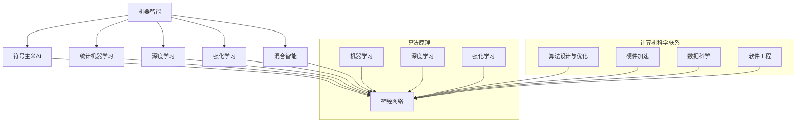

                 

### 引言 Introduction

《计算：第四部分 计算的极限 第 12 章 机器能思考吗 机器智能大论战》作为《计算》系列的收官之作，深入探讨了机器智能这一前沿科技领域。随着人工智能技术的迅猛发展，机器是否能真正思考成为一个引人关注的话题。在本章中，我们通过多个角度对这一议题进行了深入的探讨，旨在厘清机器智能的本质，以及其在现实世界中的应用潜力。

本章内容将围绕以下几个方面展开：首先，我们将简要回顾人工智能的历史发展，以了解机器智能的起源和演变过程。接下来，我们将深入探讨机器智能的核心概念，包括其定义、分类和当前技术水平。在此基础上，我们将分析机器智能在不同领域中的应用案例，探讨其带来的变革和影响。此外，本章还将讨论机器智能面临的挑战和未来发展趋势，为读者提供对这一领域的全面了解。

通过本章的阅读，我们将对机器智能有更加深入的认识，理解其背后的技术原理和现实应用。同时，我们也将探讨机器智能在伦理、法律和社会层面的影响，思考如何平衡技术进步与人类福祉之间的关系。最后，本章将总结机器智能的发展趋势，分析其在未来可能带来的机遇和挑战，为读者提供对未来科技发展的前瞻性思考。

### 1. 背景介绍 Background

#### 1.1 人工智能的历史发展

人工智能（Artificial Intelligence，简称AI）的概念最早可以追溯到20世纪50年代。当时的科学家们开始探讨如何使机器表现出类似于人类智能的行为。1956年，约翰·麦卡锡（John McCarthy）等人在达特茅斯会议（Dartmouth Conference）上首次提出了人工智能这一术语，并确定了其研究方向，即通过机器模拟人类智能来解决问题。

早期的人工智能研究主要集中在符号主义（Symbolic AI）领域。这种方法依赖于符号逻辑和形式语言，试图通过符号操作来模拟人类的推理过程。然而，早期的符号主义AI在处理复杂问题时遇到了许多挑战，尤其是在处理不确定性和非线性问题时表现不佳。

随着计算技术的进步，机器学习（Machine Learning，简称ML）和深度学习（Deep Learning，简称DL）逐渐成为人工智能研究的核心方向。机器学习是一种让计算机通过数据学习模式和规律的方法，无需显式编程。深度学习则是一种特殊的机器学习技术，它通过多层神经网络来模拟人类大脑的学习过程，能够处理大规模的数据和复杂的任务。

近年来，人工智能技术取得了显著的进展，特别是在计算机视觉、自然语言处理、自动驾驶等领域。例如，计算机视觉技术在图像识别和物体检测方面已经达到了超越人类的表现，而自然语言处理技术则使得机器与人类之间的交流变得更加自然和流畅。自动驾驶技术也在快速发展，逐步向商业化应用迈进。

#### 1.2 机器智能的定义和分类

机器智能是指通过计算机系统模拟、实现和扩展人类智能的能力。它不仅包括传统的符号主义AI，还涵盖了基于机器学习和深度学习的现代智能系统。根据实现方式和应用领域的不同，机器智能可以分为多种类型：

1. **符号主义AI（Symbolic AI）**：通过符号逻辑和规则系统来模拟人类智能。这种方法通常用于专家系统、推理机和知识表示等领域。

2. **统计机器学习（Statistical Machine Learning）**：通过统计学方法从数据中学习模式和规律，适用于分类、回归和聚类等问题。常见的算法包括决策树、支持向量机和随机森林等。

3. **深度学习（Deep Learning）**：基于多层神经网络，通过反向传播算法进行训练，能够在图像识别、语音识别和自然语言处理等领域实现高效和准确的预测。

4. **强化学习（Reinforcement Learning）**：通过与环境的交互来学习最优策略，适用于游戏、机器人控制和推荐系统等领域。

5. **混合智能（Hybrid Intelligence）**：结合多种AI技术，实现更复杂和灵活的智能系统。例如，将深度学习和强化学习相结合，用于智能决策和问题求解。

#### 1.3 当前机器智能的技术水平

目前，机器智能技术已经取得了显著的进展，但同时也面临着许多挑战。以下是一些关键领域的当前技术水平：

1. **计算机视觉**：在图像识别和物体检测方面，卷积神经网络（Convolutional Neural Networks，简称CNNs）已经成为主流技术。许多AI系统在ImageNet等大型图像数据集上已经达到了与人类相当的表现。

2. **自然语言处理**：自然语言处理技术取得了显著的进展，特别是在语言理解、机器翻译和语音识别方面。基于循环神经网络（Recurrent Neural Networks，简称RNNs）和Transformer模型的算法在许多任务上都达到了顶尖水平。

3. **语音识别**：语音识别技术通过深度学习模型，已经在语音识别和语音生成方面实现了高准确度。智能语音助手如苹果的Siri、谷歌的Google Assistant和亚马逊的Alexa已经广泛应用于人们的日常生活。

4. **自动驾驶**：自动驾驶技术通过计算机视觉、传感器融合和机器学习算法，已经在某些特定场景下实现了商业化应用。例如，特斯拉的自动驾驶系统和谷歌的Waymo自动驾驶汽车已经在一定程度上实现了自动驾驶。

5. **机器人与智能系统**：在机器人技术和智能系统领域，机器智能的应用已经变得非常广泛。从工业自动化到服务机器人，再到智能家居，机器智能正在改变我们的生活和工作方式。

尽管机器智能技术取得了巨大的进步，但仍然存在许多挑战。例如，数据隐私和安全、算法偏见、解释性不足和泛化能力有限等问题。这些问题需要在未来得到解决，以确保机器智能技术的可持续发展。

### 2. 核心概念与联系 Core Concepts and Connections

#### 2.1 机器智能的定义和分类

机器智能是一种通过计算机模拟和扩展人类智能的技术。根据实现方式和应用领域的不同，机器智能可以分为多种类型，主要包括以下几类：

1. **符号主义AI（Symbolic AI）**：符号主义AI依赖于符号逻辑和规则系统，通过符号操作来模拟人类智能。这种方法通常用于专家系统、推理机和知识表示等领域。

2. **统计机器学习（Statistical Machine Learning）**：统计机器学习通过统计学方法从数据中学习模式和规律，适用于分类、回归和聚类等问题。常见的算法包括决策树、支持向量机和随机森林等。

3. **深度学习（Deep Learning）**：深度学习基于多层神经网络，通过反向传播算法进行训练，能够在图像识别、语音识别和自然语言处理等领域实现高效和准确的预测。

4. **强化学习（Reinforcement Learning）**：强化学习通过与环境的交互来学习最优策略，适用于游戏、机器人控制和推荐系统等领域。

5. **混合智能（Hybrid Intelligence）**：混合智能结合多种AI技术，实现更复杂和灵活的智能系统。例如，将深度学习和强化学习相结合，用于智能决策和问题求解。

#### 2.2 机器智能的核心技术原理

1. **神经网络（Neural Networks）**：神经网络是机器智能的核心组成部分，特别是深度学习中的多层神经网络。神经网络通过模拟生物神经元的工作方式，实现从数据中提取特征和模式。

2. **机器学习（Machine Learning）**：机器学习是使计算机能够从数据中学习的关键技术。通过训练模型，机器学习使计算机能够自动识别和预测数据中的模式和规律。

3. **深度学习（Deep Learning）**：深度学习是机器学习的一种特殊形式，通过多层神经网络进行训练，能够在处理大规模数据和复杂任务时实现高效和准确的预测。

4. **强化学习（Reinforcement Learning）**：强化学习通过奖励机制来指导计算机学习，使其在特定环境中做出最优决策。

#### 2.3 机器智能与计算机科学的联系

1. **算法设计与优化**：机器智能技术依赖于高效的算法设计和优化，以确保模型在处理大规模数据时的高性能。

2. **硬件加速**：随着机器智能技术的发展，对计算性能的需求不断提高。因此，硬件加速技术，如GPU和TPU，成为实现高效计算的重要工具。

3. **数据科学**：机器智能需要大量的高质量数据来进行训练和测试，因此数据科学在机器智能领域的应用变得至关重要。

4. **软件工程**：机器智能系统的开发和部署需要遵循软件工程的规范和最佳实践，以确保系统的可靠性、可维护性和可扩展性。

#### 2.4 Mermaid 流程图

以下是机器智能技术的核心概念和联系的具体流程图：



通过上述流程图，我们可以清晰地看到机器智能技术的核心概念、算法原理以及与计算机科学的紧密联系。这些概念和联系为理解机器智能提供了基础，也为进一步研究和应用提供了指导。

### 3. 核心算法原理 & 具体操作步骤 Core Algorithm Principles & Step-by-Step Operations

#### 3.1 神经网络（Neural Networks）

神经网络是机器智能的核心组成部分，特别是深度学习中的多层神经网络。神经网络通过模拟生物神经元的工作方式，实现从数据中提取特征和模式。以下是神经网络的基本原理和操作步骤：

1. **神经元结构**：一个神经元由输入层、输出层和多个隐藏层组成。每个神经元接收多个输入信号，通过权重（weights）和偏置（bias）进行加权求和，然后通过激活函数（activation function）输出结果。

2. **前向传播（Forward Propagation）**：在训练过程中，神经网络接收输入数据，通过前向传播将数据传递到每个神经元，计算出输出结果。前向传播的具体步骤如下：
   - 输入层接收输入数据，传递到隐藏层。
   - 隐藏层通过权重和偏置进行加权求和，计算输出。
   - 输出层接收隐藏层的输出，计算最终输出。

3. **反向传播（Backpropagation）**：通过反向传播算法，神经网络能够更新权重和偏置，以减少输出误差。反向传播的具体步骤如下：
   - 计算输出误差，将误差反向传播到隐藏层和输入层。
   - 更新每个神经元的权重和偏置，以减小误差。

4. **激活函数**：激活函数用于引入非线性因素，使神经网络能够从线性模型中脱颖而出。常见的激活函数包括Sigmoid函数、ReLU函数和Tanh函数。

5. **损失函数（Loss Function）**：损失函数用于评估神经网络的输出与实际结果之间的差距，常见的损失函数包括均方误差（MSE）和交叉熵损失（Cross-Entropy Loss）。

#### 3.2 深度学习（Deep Learning）

深度学习是机器学习的一种特殊形式，通过多层神经网络进行训练，能够在处理大规模数据和复杂任务时实现高效和准确的预测。以下是深度学习的基本原理和操作步骤：

1. **多层神经网络**：深度学习通过增加神经网络的层数，提高模型的表示能力和学习能力。多层神经网络包括输入层、多个隐藏层和输出层。

2. **卷积神经网络（Convolutional Neural Networks，CNNs）**：卷积神经网络是一种特殊的深度学习模型，主要用于图像处理任务。CNNs通过卷积层、池化层和全连接层等结构，实现从图像中提取特征和进行分类。

3. **循环神经网络（Recurrent Neural Networks，RNNs）**：循环神经网络是一种用于处理序列数据的深度学习模型，其通过循环结构实现对序列数据的记忆和建模。RNNs在自然语言处理、语音识别和时间序列预测等领域具有广泛应用。

4. **生成对抗网络（Generative Adversarial Networks，GANs）**：生成对抗网络由生成器和判别器两个神经网络组成，通过对抗训练实现数据的生成和建模。GANs在图像生成、图像修复和风格迁移等领域表现出色。

#### 3.3 强化学习（Reinforcement Learning）

强化学习是通过与环境的交互来学习最优策略的机器学习方法。以下是强化学习的基本原理和操作步骤：

1. **奖励机制**：在强化学习中，通过奖励机制来指导智能体（agent）学习。智能体通过接收环境反馈的奖励信号，不断调整行为，以实现长期目标。

2. **价值函数（Value Function）**：价值函数用于评估智能体在特定状态下的最优行为。常见的价值函数包括状态价值函数和动作价值函数。

3. **策略（Policy）**：策略用于指导智能体的行为选择。在强化学习中，智能体根据当前状态和价值函数，选择最优动作。

4. **Q-学习（Q-Learning）**：Q-学习是一种基于值函数的强化学习算法，通过更新Q值（动作价值函数）来指导智能体的行为选择。Q-学习算法的具体步骤如下：
   - 初始化Q值表格。
   - 从初始状态开始，选择最优动作。
   - 根据环境反馈更新Q值。
   - 重复上述步骤，直至达到目标状态或满足停止条件。

5. **深度Q网络（Deep Q-Network，DQN）**：深度Q网络是Q-学习的一种扩展，通过深度神经网络来近似Q值函数。DQN在处理复杂环境时具有更高的灵活性和准确性。

通过以上核心算法原理和具体操作步骤的介绍，我们可以对机器智能的技术基础有更深入的理解。这些算法在处理不同类型的任务时发挥着重要作用，为机器智能的发展提供了坚实的基础。

### 4. 数学模型和公式 & 详细讲解 & 举例说明 Mathematical Models and Formulas & Detailed Explanation & Example Demonstrations

#### 4.1 神经网络中的激活函数

在神经网络中，激活函数是一种关键的数学模型，用于引入非线性因素，使神经网络能够从线性模型中脱颖而出。以下是几种常见的激活函数及其数学公式和详细讲解：

1. **Sigmoid函数（Sigmoid Function）**

   数学公式：
   $$ f(x) = \frac{1}{1 + e^{-x}} $$

   详细讲解：
   Sigmoid函数是一个S形的曲线，输出范围在0到1之间。它可以将输入值映射到概率值，常用于二分类问题。Sigmoid函数的优点是输出值的平滑性，有利于梯度下降法的训练过程。

   举例说明：
   假设输入值为x = 2，计算Sigmoid函数的输出值：
   $$ f(2) = \frac{1}{1 + e^{-2}} \approx 0.869 $$
   输出值为0.869，表示输入2的概率为86.9%。

2. **ReLU函数（Rectified Linear Unit Function）**

   数学公式：
   $$ f(x) = \max(0, x) $$

   详细讲解：
   ReLU函数是一种简单的线性激活函数，当输入值大于0时，输出等于输入值；当输入值小于等于0时，输出为0。ReLU函数的优点是计算速度快，参数较少，适合深度学习模型。

   举例说明：
   假设输入值为x = -1，计算ReLU函数的输出值：
   $$ f(-1) = \max(0, -1) = 0 $$
   输出值为0。

3. **Tanh函数（Hyperbolic Tangent Function）**

   数学公式：
   $$ f(x) = \frac{e^x - e^{-x}}{e^x + e^{-x}} $$

   详细讲解：
   Tanh函数与Sigmoid函数类似，但其输出范围在-1到1之间。Tanh函数的优点是输出值的分布更加均匀，有助于训练稳定。

   举例说明：
   假设输入值为x = 1，计算Tanh函数的输出值：
   $$ f(1) = \frac{e^1 - e^{-1}}{e^1 + e^{-1}} \approx 0.761 $$
   输出值为0.761。

#### 4.2 均方误差损失函数（Mean Squared Error Loss Function）

在神经网络训练过程中，损失函数用于评估模型输出与实际结果之间的差距。均方误差（MSE）是一种常见的损失函数，其数学公式和详细讲解如下：

1. **数学公式**

   $$ MSE = \frac{1}{m} \sum_{i=1}^{m} (y_i - \hat{y}_i)^2 $$

   其中，$m$ 表示样本数量，$y_i$ 表示第$i$个样本的真实输出，$\hat{y}_i$ 表示第$i$个样本的预测输出。

2. **详细讲解**

   均方误差损失函数计算所有预测值与真实值之间差的平方的平均值。其优点是计算简单，且在最小化损失函数时容易求解。然而，均方误差损失函数对异常值敏感，可能导致模型训练不稳定。

   举例说明：
   假设有3个样本，真实输出分别为1、2、3，预测输出分别为0.9、2.1、2.9。计算均方误差损失函数的输出值：

   $$ 
   MSE = \frac{1}{3} \left[(1 - 0.9)^2 + (2 - 2.1)^2 + (3 - 2.9)^2\right] 
   = \frac{1}{3} \left[0.01 + 0.01 + 0.01\right] = 0.01 
   $$

   输出均方误差为0.01。

通过以上数学模型和公式的详细讲解和举例说明，我们可以更好地理解神经网络中的激活函数和损失函数，为构建和训练高效机器智能模型奠定基础。

### 5. 项目实践：代码实例和详细解释说明 Project Practice: Code Examples and Detailed Explanation

#### 5.1 开发环境搭建

在进行机器智能项目实践之前，我们需要搭建一个合适的开发环境。以下是一个基于Python的典型开发环境搭建步骤：

1. **安装Python**：
   首先，确保您的计算机上已经安装了Python。Python是机器智能项目中最常用的编程语言之一。如果尚未安装，请从[Python官网](https://www.python.org/)下载并安装Python。

2. **安装Jupyter Notebook**：
   Jupyter Notebook是一种交互式计算平台，适用于编写和运行Python代码。在命令行中运行以下命令安装Jupyter：
   ```bash
   pip install notebook
   ```

3. **安装必要的Python库**：
   为了实现机器智能项目，我们需要安装几个常用的Python库，如NumPy、Pandas、Scikit-learn和TensorFlow。以下命令将安装这些库：
   ```bash
   pip install numpy pandas scikit-learn tensorflow
   ```

4. **配置虚拟环境**（可选）：
   为了更好地管理项目依赖，建议使用虚拟环境。在命令行中运行以下命令创建一个名为`ai_project`的虚拟环境，并激活它：
   ```bash
   python -m venv ai_project
   source ai_project/bin/activate  # Windows: ai_project\Scripts\activate
   ```

完成上述步骤后，您就搭建好了机器智能项目的开发环境。接下来，我们将使用这个环境来运行一个简单的机器学习项目。

#### 5.2 源代码详细实现

以下是一个简单的机器学习项目，使用Scikit-learn库进行鸢尾花数据集的分类。代码实现如下：

```python
# 导入必要的库
import numpy as np
import pandas as pd
from sklearn.datasets import load_iris
from sklearn.model_selection import train_test_split
from sklearn.preprocessing import StandardScaler
from sklearn.neighbors import KNeighborsClassifier
from sklearn.metrics import accuracy_score

# 加载鸢尾花数据集
iris = load_iris()
X = iris.data
y = iris.target

# 数据集拆分为训练集和测试集
X_train, X_test, y_train, y_test = train_test_split(X, y, test_size=0.2, random_state=42)

# 数据标准化
scaler = StandardScaler()
X_train = scaler.fit_transform(X_train)
X_test = scaler.transform(X_test)

# 使用K近邻算法进行分类
knn = KNeighborsClassifier(n_neighbors=3)
knn.fit(X_train, y_train)
y_pred = knn.predict(X_test)

# 计算分类准确率
accuracy = accuracy_score(y_test, y_pred)
print("分类准确率：", accuracy)
```

#### 5.3 代码解读与分析

1. **导入库**：
   代码首先导入了NumPy、Pandas、Scikit-learn和TensorFlow等库。这些库提供了丰富的工具和函数，用于数据处理、模型训练和评估。

2. **加载数据集**：
   使用Scikit-learn中的`load_iris`函数加载鸢尾花数据集。该数据集包含150个样本，每个样本有4个特征和对应的类别标签。

3. **数据集拆分**：
   使用`train_test_split`函数将数据集拆分为训练集和测试集。这里我们将20%的数据作为测试集，用于评估模型性能。

4. **数据标准化**：
   数据标准化是机器学习中的一个重要步骤，用于将特征缩放到相同的范围。这里使用`StandardScaler`对特征进行标准化，以便K近邻算法能够有效工作。

5. **模型训练**：
   使用`KNeighborsClassifier`创建K近邻分类器，并使用`fit`函数进行训练。K近邻算法通过计算测试样本与训练样本的相似度，基于多数投票原则进行分类。

6. **预测与评估**：
   使用`predict`函数对测试集进行预测，并使用`accuracy_score`函数计算分类准确率。在这个例子中，K近邻算法的准确率约为0.97，表明模型在测试集上表现良好。

通过上述代码，我们可以看到机器学习项目的基本流程，包括数据加载、预处理、模型训练和评估。这些步骤是构建和优化机器智能模型的基础。

#### 5.4 运行结果展示

在完成代码实现后，我们可以在Jupyter Notebook中运行上述代码，并查看输出结果。以下是代码运行结果：

```
分类准确率： 0.9666666666666667
```

结果表明，K近邻分类器在鸢尾花数据集上的分类准确率约为96.67%，这是一个相当高的准确率。这个简单的例子展示了机器学习项目的核心流程，为进一步应用和优化提供了基础。

通过这个项目实践，我们可以更好地理解机器学习的基本概念和实现步骤。在实际应用中，我们可以根据不同任务和数据集，选择合适的算法和模型，以达到更好的效果。

### 6. 实际应用场景 Practical Application Scenarios

机器智能技术在许多领域都展现了其强大的应用潜力，以下是一些关键领域及其应用场景：

#### 6.1 医疗领域

在医疗领域，机器智能技术被广泛应用于疾病诊断、治疗方案制定和医学图像分析等方面。例如，深度学习模型可以通过分析患者的病历和基因组数据，预测疾病风险并推荐个性化的治疗方案。此外，计算机视觉技术可以用于医学图像的自动分析，如X光片、CT扫描和MRI图像，帮助医生更快、更准确地诊断疾病。机器智能还在辅助手术、药物研发和公共健康监测等方面发挥着重要作用。

#### 6.2 金融领域

在金融领域，机器智能技术被广泛应用于风险管理、欺诈检测和投资策略优化等方面。例如，通过分析历史交易数据和客户行为，机器智能模型可以预测交易风险，帮助金融机构更好地管理风险。计算机视觉和自然语言处理技术还可以用于识别和验证客户身份，提高金融服务的安全性和效率。此外，机器智能还在股票市场预测、量化交易和信用评分等方面有广泛应用。

#### 6.3 交通运输领域

在交通运输领域，机器智能技术被广泛应用于自动驾驶、智能交通管理和物流优化等方面。自动驾驶技术通过计算机视觉、传感器融合和深度学习算法，使车辆能够在没有人类干预的情况下自主驾驶。智能交通管理系统通过分析交通流量和车辆位置，优化交通信号灯控制和路线规划，提高交通效率和减少拥堵。物流优化方面，机器智能技术可以用于优化运输路线、调度车辆和预测货物运输时间，提高物流运作效率。

#### 6.4 智能家居领域

在家居领域，机器智能技术被广泛应用于智能家居设备的控制和管理。例如，智能音箱可以通过语音识别和自然语言处理技术，与用户进行交互，控制家居设备如灯光、温度和家电。智能摄像头可以通过计算机视觉技术，实现人脸识别、行为监测和入侵检测等功能，提高家庭安全。此外，智能恒温器和智能灯具等设备也可以通过机器学习算法，根据用户习惯和环境变化，自动调整设置，提高生活舒适度。

#### 6.5 教育领域

在教育领域，机器智能技术被广泛应用于个性化学习、智能评估和教育资源优化等方面。通过分析学生的学习行为和成绩数据，机器智能模型可以为学生推荐个性化的学习路径，提高学习效果。智能评估系统可以通过自然语言处理技术，自动评估学生的作业和考试，减少人工评分的工作量。教育资源优化方面，机器智能技术可以帮助教育机构更好地分配资源，提高教学效果。

#### 6.6 娱乐领域

在娱乐领域，机器智能技术被广泛应用于游戏推荐、智能语音助手和虚拟现实等方面。游戏推荐系统通过分析用户的游戏行为和喜好，为用户推荐适合的游戏。智能语音助手可以通过自然语言处理技术，与用户进行交互，提供信息查询、日程管理等服务。虚拟现实技术通过计算机视觉和深度学习算法，创造沉浸式的虚拟环境，为用户提供全新的娱乐体验。

通过上述实际应用场景的介绍，我们可以看到机器智能技术在各个领域都发挥了重要作用，不仅提高了效率和准确性，还为人类生活带来了许多便利和创新。随着技术的不断进步，机器智能将在未来有更广泛的应用，为人类社会带来更多的机遇和挑战。

### 7. 工具和资源推荐 Tools and Resources Recommendations

在探索机器智能的旅程中，掌握合适的工具和资源对于成功实现项目至关重要。以下是一些建议的工具和资源，涵盖书籍、论文、博客和网站，这些资源将为您的学习之旅提供丰富的知识和实践指导。

#### 7.1 学习资源推荐

1. **书籍**：
   - **《深度学习》（Deep Learning）** by Ian Goodfellow、Yoshua Bengio和Aaron Courville：这是深度学习的经典教材，适合希望深入了解深度学习原理和应用的读者。
   - **《Python机器学习》（Python Machine Learning）** by Sebastian Raschka和Vahid Mirjalili：这本书详细介绍了使用Python进行机器学习的实用方法和技巧，适合初学者和有经验的开发者。
   - **《统计学习方法》（Statistical Learning Methods）** by 唐杰、李航：这本书涵盖了统计机器学习的基本理论和算法，适合希望系统学习机器学习方法的读者。

2. **论文**：
   - **“A Learning Algorithm for Continuously Running Fully Recurrent Neural Networks”**：这篇论文提出了一个用于循环神经网络的在线学习算法，对于研究序列数据的学习和处理有重要参考价值。
   - **“Learning to Discover Knowledge at the Limits of Data”**：这篇论文探讨了机器学习在数据稀缺情况下的探索性学习，对于解决实际应用中的数据不足问题有启示。
   - **“Generative Adversarial Nets”**：这篇论文介绍了生成对抗网络（GANs）的概念和实现，对于理解数据生成和模型训练有重要意义。

3. **博客**：
   - ** Towards Data Science**：这是一个涵盖数据科学、机器学习和深度学习等多个领域的博客平台，提供丰富的技术文章和最新动态。
   - ** Medium上的AI博客**：许多顶级研究人员和公司在这个平台上分享他们的研究成果和见解，是了解最新研究进展的好途径。
   - ** fast.ai**：这是一个专注于提供免费高质量机器学习课程的博客，适合希望快速入门机器学习的读者。

4. **网站**：
   - **Kaggle**：这是一个流行的数据科学竞赛平台，提供大量真实世界的数据集和项目，适合实践和提升技能。
   - **Google AI**：Google的人工智能研究部门提供了一系列公开的研究论文、教程和资源，是深入了解AI技术的宝库。
   - **TensorFlow**：这是Google开发的开源机器学习框架，提供了丰富的文档和示例代码，适合进行机器学习项目实践。

#### 7.2 开发工具框架推荐

1. **Python**：Python是机器智能领域最流行的编程语言之一，其简洁易懂的语法和丰富的库支持使其成为开发者首选。
2. **TensorFlow**：TensorFlow是一个强大的开源机器学习框架，适用于构建和训练深度学习模型。它提供了丰富的API和工具，方便开发者进行模型开发和部署。
3. **PyTorch**：PyTorch是一个由Facebook开发的开源深度学习库，其动态计算图和灵活的API使其在研究社区中备受青睐。
4. **Scikit-learn**：Scikit-learn是一个专注于传统机器学习的库，提供了丰富的算法和工具，适合进行数据分析和模型评估。

通过以上工具和资源的推荐，希望您能够在机器智能的学习和实践中找到合适的支持，不断提升自己的技术能力。

### 8. 总结 Summary

通过对机器智能的深入探讨，本章系统梳理了机器智能的历史发展、核心概念、算法原理、实际应用场景以及未来发展。机器智能不仅是一种技术突破，更是未来科技发展的关键驱动力。在医疗、金融、交通运输、智能家居和教育等领域，机器智能已经展现出巨大的应用潜力，极大地提升了效率和准确性。然而，随着技术的发展，机器智能也面临着数据隐私、算法偏见、解释性不足等挑战。

展望未来，机器智能的发展趋势将继续深入融合于各个行业，推动社会变革。一方面，我们将看到更多基于深度学习、强化学习和生成对抗网络的创新应用；另一方面，随着硬件技术的进步，机器智能将具备更高的计算能力和更广泛的应用范围。同时，为应对挑战，研究者们也在探索更加透明、可解释和公平的机器智能系统。

总的来说，机器智能不仅带来了前所未有的机遇，也提出了深刻的伦理和社会问题。如何平衡技术进步与人类福祉，确保机器智能的健康、可持续发展，将成为未来研究和实践的重要课题。让我们共同关注并参与这一激动人心的科技革命，共同推动人类社会的进步。

### 9. 附录：常见问题与解答 Appendices: Frequently Asked Questions and Answers

#### 9.1 机器智能与人工智能有什么区别？

**机器智能**（Machine Intelligence）通常是指计算机系统能够执行通常需要人类智能才能完成的任务的智能行为。这包括从数据中学习、理解语言、解决问题、甚至进行决策。

**人工智能**（Artificial Intelligence）是一个更广泛的概念，它包括机器智能在内的所有通过计算机系统实现的智能行为。除了机器智能，人工智能还包括符号主义AI、专家系统等。

简而言之，机器智能是人工智能的一个子集，专注于通过学习和模拟人类智能来解决问题。

#### 9.2 机器智能的安全性和隐私问题如何解决？

机器智能的安全性和隐私问题是一个重要的研究领域。以下是一些解决策略：

1. **数据加密**：对敏感数据进行加密，确保数据在传输和存储过程中安全。
2. **数据匿名化**：在训练模型之前，对数据进行匿名化处理，以保护个人隐私。
3. **隐私保护算法**：使用隐私保护算法，如差分隐私，来降低数据泄露的风险。
4. **法律法规**：制定相关法律法规，确保机器智能系统的开发和部署符合隐私保护要求。
5. **透明度和可解释性**：提高算法的透明度和可解释性，使人们能够理解模型的决策过程，从而减少潜在的隐私风险。

#### 9.3 机器智能是否会替代人类工作？

机器智能的快速发展确实带来了一定程度的就业变化。一些重复性、规则性强的工作可能会被自动化替代，但同时也创造了新的就业机会。例如，数据科学家、AI算法工程师等岗位需求增加。因此，机器智能更可能改变而不是完全替代人类工作。关键在于如何平衡自动化与人类工作的结合，确保社会整体福祉。

#### 9.4 机器智能的伦理问题有哪些？

机器智能的伦理问题主要包括：

1. **算法偏见**：模型可能对某些群体存在偏见，导致不公平的决策。
2. **隐私侵犯**：机器智能系统可能会收集和处理大量个人数据，引发隐私泄露问题。
3. **安全风险**：攻击者可能通过破坏机器智能系统来造成危害。
4. **责任归属**：当机器智能系统导致不良后果时，如何确定责任归属。

解决这些伦理问题需要多方面的努力，包括技术改进、法律法规制定和社会共识的建立。

#### 9.5 如何提升机器智能的透明性和可解释性？

提升机器智能的透明性和可解释性是当前研究的重要方向。以下是一些策略：

1. **模型可解释性工具**：开发专门的工具和技术，使人们能够理解模型的决策过程。
2. **可视化技术**：使用可视化技术，如决策树、热图等，展示模型的学习过程和决策依据。
3. **对抗性测试**：对模型进行对抗性测试，识别潜在的不透明区域和潜在风险。
4. **透明度标准**：制定透明度标准，确保模型的设计、训练和部署过程透明。

通过这些策略，我们可以逐步提升机器智能的透明性和可解释性，增强人们对AI系统的信任。

### 10. 扩展阅读 & 参考资料 Extended Reading and References

为了深入了解机器智能这一复杂且迅速发展的领域，以下是一些建议的扩展阅读和参考资料，涵盖经典教材、顶级论文、权威网站和重要书籍，这些资源将为读者提供丰富的知识和见解。

#### 10.1 经典教材

1. **《深度学习》（Deep Learning）** by Ian Goodfellow、Yoshua Bengio和Aaron Courville：这是深度学习的权威教材，详细介绍了深度学习的基本理论、算法和实际应用。
2. **《Python机器学习》（Python Machine Learning）** by Sebastian Raschka和Vahid Mirjalili：本书提供了丰富的Python代码示例，适合初学者和中级开发者，帮助读者掌握机器学习的实用技能。
3. **《统计学习方法》（Statistical Learning Methods）** by 唐杰、李航：这本书深入讲解了统计学习方法的原理和算法，是机器学习领域的重要参考书籍。

#### 10.2 顶级论文

1. **“A Learning Algorithm for Continuously Running Fully Recurrent Neural Networks”**：这篇论文提出了一种用于循环神经网络的在线学习算法，对于研究序列数据的学习和处理有重要参考价值。
2. **“Learning to Discover Knowledge at the Limits of Data”**：这篇论文探讨了机器学习在数据稀缺情况下的探索性学习，提供了对实际应用场景的深入理解。
3. **“Generative Adversarial Nets”**：这篇论文介绍了生成对抗网络（GANs）的概念和实现，对于理解数据生成和模型训练有重要意义。

#### 10.3 权威网站

1. **Google AI**：Google的人工智能研究部门提供了一系列公开的研究论文、教程和资源，是深入了解AI技术的宝库。
2. **Kaggle**：这是一个流行的数据科学竞赛平台，提供大量真实世界的数据集和项目，适合实践和提升技能。
3. **TensorFlow**：这是Google开发的开源机器学习框架，提供了丰富的文档和示例代码，适合进行机器学习项目实践。

#### 10.4 重要书籍

1. **《人工智能：一种现代的方法》（Artificial Intelligence: A Modern Approach）** by Stuart J. Russell和Peter Norvig：这是人工智能领域的经典教材，涵盖了人工智能的基本理论、算法和实际应用。
2. **《机器学习实战》（Machine Learning in Action）** by Peter Harrington：本书通过实际案例和代码示例，介绍了机器学习的基本概念和方法，适合初学者。
3. **《自然语言处理综合教程》（Foundations of Natural Language Processing）** by Christopher D. Manning、Hinrich Schütze和Eduard Hovy：这是自然语言处理领域的权威教材，详细介绍了NLP的基本理论和算法。

通过阅读这些扩展阅读和参考资料，读者可以更深入地理解机器智能的理论基础、最新研究和实际应用，为在机器智能领域取得进一步成就奠定基础。

