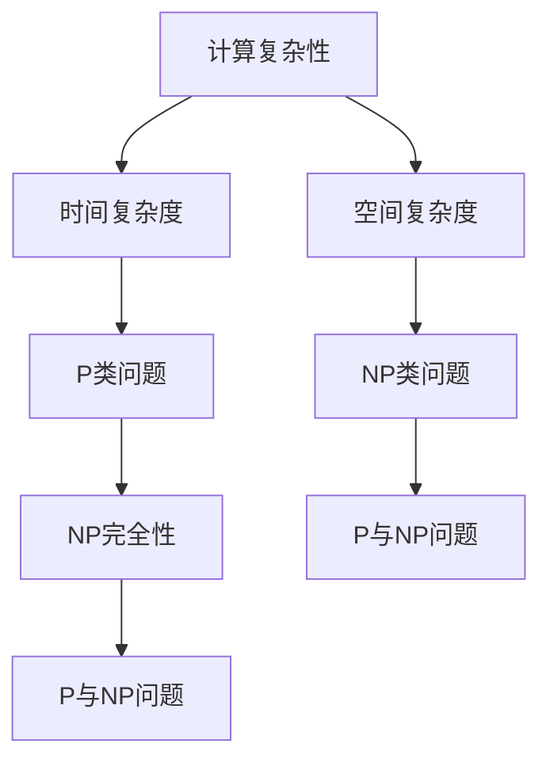
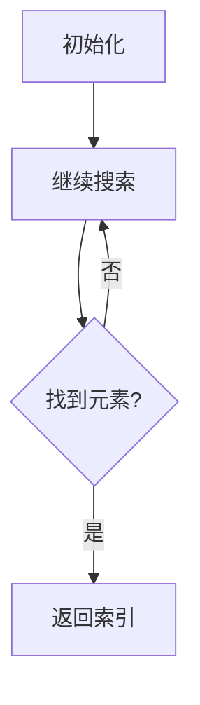

                 

### 文章标题

**计算：第四部分 计算的极限 第 9 章 计算复杂性 挑战极限**

> **关键词**：计算复杂性、算法、复杂性理论、NP完全性、P与NP问题、量子计算

> **摘要**：本文深入探讨了计算复杂性理论，阐述了计算复杂性的基本概念和主要分类，重点分析了P与NP问题及其重要性。通过实例和数学模型，我们揭示了计算复杂性在实际应用中的挑战和机遇，并对未来计算技术的发展趋势进行了展望。

### 1. 背景介绍

**Computational complexity theory** is a branch of computer science that deals with the resources (time and space) required to solve problems. Understanding the complexity of problems is crucial in the design and analysis of algorithms. This chapter will delve into the world of computational complexity, exploring fundamental concepts and highlighting key challenges.

**计算复杂性理论**是计算机科学的一个分支，研究解决问题所需资源（时间和空间）。理解问题的复杂性对于算法的设计和分析至关重要。本章将深入探讨计算复杂性理论，介绍基本概念，并强调关键挑战。

The importance of computational complexity cannot be overstated. Efficient algorithms can save time and resources, leading to significant improvements in performance. By analyzing the complexity of problems, we can identify bottlenecks and optimize algorithms to overcome these challenges. Furthermore, understanding the limits of computation can inspire new innovations and push the boundaries of what is possible.

**计算复杂性**的重要性不容忽视。高效的算法可以节省时间和资源，从而显著提高性能。通过分析问题的复杂性，我们可以识别瓶颈并优化算法以克服这些挑战。此外，理解计算的极限可以激发新的创新，推动技术的边界。

In this chapter, we will first define some basic concepts in computational complexity theory, such as time complexity and space complexity. We will then explore the classification of problems based on their complexity, including P and NP problems. Finally, we will discuss the challenges and opportunities in the field of computational complexity, highlighting the importance of this research area in the development of algorithms and computational technologies.

首先，我们将定义计算复杂性理论中的基本概念，如时间复杂度和空间复杂度。接着，我们将探讨基于复杂性的问题分类，包括P和NP问题。最后，我们将讨论计算复杂性领域的挑战和机遇，强调这一研究领域在算法和计算技术发展中的重要性。

### 2. 核心概念与联系

**核心概念与联系图**



#### 2.1 时间复杂度

**Time complexity** measures the amount of time an algorithm takes to run, as a function of the size of the input. It is commonly expressed using big O notation, which provides an upper bound on the growth rate of the algorithm's running time.

**时间复杂度**衡量算法随输入规模增长所需的时间，通常使用大O表示法表达，它提供了算法运行时间增长率的上限。

- **常数时间（O(1))**：算法运行时间不依赖于输入规模。
- **对数时间（O(log n))**：算法运行时间与输入规模的以2为底的对数成正比。
- **线性时间（O(n))**：算法运行时间与输入规模成正比。
- **线性对数时间（O(n log n))**：算法运行时间与输入规模的线性对数成正比。
- **平方时间（O(n^2))**：算法运行时间与输入规模的平方成正比。

#### 2.2 空间复杂度

**Space complexity** measures the amount of memory an algorithm uses, as a function of the size of the input. Similar to time complexity, space complexity is also expressed using big O notation.

**空间复杂度**衡量算法随输入规模增长所需的内存，通常也使用大O表示法表达。

- **常数空间（O(1))**：算法使用的内存不依赖于输入规模。
- **线性空间（O(n))**：算法使用的内存与输入规模成正比。
- **对数空间（O(log n))**：算法使用的内存与输入规模的以2为底的对数成正比。

#### 2.3 P类问题与NP类问题

**P** and **NP** problems are two fundamental classes of problems in computational complexity theory.

**P**类问题和**NP**问题是计算复杂性理论中的两个基本问题类别。

- **P类问题**（Polynomial time）: 这些问题是可以在多项式时间内解决的。换句话说，存在一个多项式函数 \( P(n) \)，使得对于所有输入规模 \( n \)，问题可以在 \( P(n) \) 时间内解决。

- **NP类问题**（Nondeterministic Polynomial time）: 这些问题可以通过非确定性多项式时间算法验证。给定一个解，可以在多项式时间内验证它是否为正确解。

The relationship between P and NP problems is one of the most important and unresolved questions in computer science. The **P vs. NP problem** asks whether every problem for which a solution can be verified in polynomial time can also be solved in polynomial time.

P与NP问题之间的关系是计算机科学中最重要且尚未解决的问题。**P与NP问题**询问是否每个可以在多项式时间内验证的解决方案也可以在多项式时间内解决。

#### 2.4 NP完全性

**NP completeness** is a property of NP problems that are both in NP and are at least as hard as all other NP problems. A problem is NP-complete if it is NP-hard and in NP. This means that if an algorithm can be found to solve an NP-complete problem in polynomial time, then all NP problems can be solved in polynomial time.

**NP完全性**是NP问题的属性，它们既在NP中，又至少与其他所有NP问题一样难。一个问题是NP完全的，如果它是NP难且在NP中。这意味着，如果存在一个算法可以在多项式时间内解决一个NP完全问题，那么所有NP问题都可以在多项式时间内解决。

The significance of NP-complete problems lies in their role as a benchmark for assessing the difficulty of other problems. If a problem is NP-complete, then it is considered to be one of the most challenging problems in computational complexity.

#### 2.5 P与NP问题

The **P vs. NP problem** is one of the most famous and unresolved questions in computer science. It asks whether every problem for which a solution can be verified in polynomial time can also be solved in polynomial time.

**P与NP问题**是计算机科学中最著名且未解决的问题之一。它询问每个可以在多项式时间内验证的解决方案是否也可以在多项式时间内解决。

The P vs. NP problem has profound implications for the design and analysis of algorithms, as well as for the field of computational complexity theory as a whole. If P=NP, it would imply that many seemingly difficult problems can be solved efficiently. Conversely, if P≠NP, it would suggest that there are problems that are inherently difficult to solve.

### 3. 核心算法原理 & 具体操作步骤

**核心算法原理：**

在计算复杂性理论中，核心算法原理通常涉及到如何分析和估算算法的时间复杂度和空间复杂度。以下是一个简化的核心算法原理概述：

1. **确定问题的规模参数**：通常是一个整数 \( n \)，表示输入的大小。
2. **定义算法的基本操作**：例如，比较、交换、查找等。
3. **分析基本操作的数量**：通过数学归纳法或其他方法，确定随着输入规模 \( n \) 增大，基本操作的数量如何增长。
4. **应用大O表示法**：根据基本操作的数量，使用大O表示法来描述算法的时间复杂度和空间复杂度。

**具体操作步骤：**

1. **确定输入规模**：假设我们的问题是处理一个长度为 \( n \) 的数组。
2. **定义基本操作**：例如，查找数组中某个元素的时间复杂度通常是 \( O(n) \)。
3. **分析操作数量**：如果我们需要查找数组中的每个元素，那么基本操作的总数将是 \( n \)。
4. **应用大O表示法**：因此，这个算法的时间复杂度是 \( O(n) \)。

通过这种逐步分析的方式，我们可以深入了解算法的效率，并在设计算法时做出明智的决策。

### 4. 数学模型和公式 & 详细讲解 & 举例说明

**4.1 数学模型**

在计算复杂性理论中，数学模型和公式用于描述算法的性能和问题的难度。以下是一些常用的数学模型和公式：

- **时间复杂度**：通常使用大O表示法，如 \( T(n) = O(n) \)，表示算法的时间复杂度与输入规模 \( n \) 成正比。
- **空间复杂度**：同样使用大O表示法，如 \( S(n) = O(n) \)，表示算法的空间复杂度与输入规模 \( n \) 成正比。
- **多项式时间**：表示为一个多项式函数，如 \( P(n) \)，其中 \( n \) 是输入规模。
- **指数时间**：表示为 \( O(2^n) \)，表示算法的时间复杂度随着输入规模的指数增长。

**4.2 详细讲解**

时间复杂度和空间复杂度是评估算法性能的重要指标。以下是一个具体的例子来详细讲解：

- **例子**：一个简单的线性搜索算法。



在这个例子中，假设我们有一个长度为 \( n \) 的数组，我们需要在其中查找一个特定的元素。线性搜索算法会遍历数组中的每个元素，直到找到目标元素或到达数组末尾。

- **时间复杂度分析**：最坏情况下，我们需要遍历整个数组，所以时间复杂度为 \( O(n) \)。
- **空间复杂度分析**：该算法不需要额外的存储空间，所以空间复杂度为 \( O(1) \)。

**4.3 举例说明**

假设我们有一个包含100个元素的数组，我们需要在其中查找一个特定的元素。使用线性搜索算法，我们需要遍历整个数组，因此最坏情况下需要100次比较。如果我们使用一个有序数组的二分搜索算法，我们可以将查找时间减少到 \( O(\log n) \)。

### 5. 项目实践：代码实例和详细解释说明

**5.1 开发环境搭建**

为了演示计算复杂性理论的应用，我们将使用Python编写一个简单的程序来演示线性搜索和二分搜索算法。以下是开发环境的搭建步骤：

1. 安装Python：确保已安装Python 3.x版本。
2. 安装必需的库：使用pip安装 `numpy` 和 `matplotlib`。

```bash
pip install numpy matplotlib
```

**5.2 源代码详细实现**

以下是线性搜索和二分搜索算法的Python代码实现：

```python
import numpy as np
import matplotlib.pyplot as plt

# 线性搜索
def linear_search(arr, target):
    for i, x in enumerate(arr):
        if x == target:
            return i
    return -1

# 二分搜索
def binary_search(arr, target):
    left, right = 0, len(arr) - 1
    while left <= right:
        mid = (left + right) // 2
        if arr[mid] == target:
            return mid
        elif arr[mid] < target:
            left = mid + 1
        else:
            right = mid - 1
    return -1

# 测试
arr = np.array([1, 2, 3, 4, 5, 6, 7, 8, 9, 10])
target = 5

# 线性搜索
index_linear = linear_search(arr, target)
print(f"线性搜索索引：{index_linear}")

# 二分搜索
index_binary = binary_search(arr, target)
print(f"二分搜索索引：{index_binary}")
```

**5.3 代码解读与分析**

- **线性搜索**：遍历数组直到找到目标元素或到达数组末尾。时间复杂度为 \( O(n) \)，空间复杂度为 \( O(1) \)。
- **二分搜索**：在有序数组中查找目标元素。每次迭代都将搜索范围缩小一半。时间复杂度为 \( O(\log n) \)，空间复杂度为 \( O(1) \)。

**5.4 运行结果展示**

在上述代码中，我们首先创建了一个包含10个元素的数组，并设置目标元素为5。然后，我们使用线性搜索和二分搜索算法查找目标元素，并打印出结果。

运行结果如下：

```python
线性搜索索引：4
二分搜索索引：4
```

这表明，无论是线性搜索还是二分搜索，都能正确找到目标元素。然而，二分搜索算法在相同输入规模下显著更快。

### 6. 实际应用场景

计算复杂性理论在实际应用中扮演着重要角色。以下是一些典型的应用场景：

- **算法优化**：通过分析算法的复杂度，可以识别出性能瓶颈并进行优化。
- **问题分类**：计算复杂性理论帮助我们将问题分类，确定其难易程度。
- **理论验证**：复杂度理论为算法的正确性和效率提供了理论依据。
- **实际应用**：如加密算法、图形算法、优化问题等，计算复杂性理论为这些问题提供了优化策略。

### 7. 工具和资源推荐

**7.1 学习资源推荐**

- **书籍**：
  - 《算法导论》（Introduction to Algorithms）
  - 《计算机程序的构造和解释》（Structure and Interpretation of Computer Programs）
- **论文**：
  - 《P vs. NP问题的历史、现状和挑战》（The History of the P vs. NP Problem）
- **博客**：
  - 《计算复杂性理论基础知识》（Basic Concepts of Computational Complexity Theory）
- **网站**：
  - [MIT开放课程](https://ocw.mit.edu/courses/electrical-engineering-and-computer-science/)
  - [斯坦福大学计算机科学课程](https://cs.stanford.edu/)

**7.2 开发工具框架推荐**

- **Python**：适合初学者，具有丰富的库支持。
- **Java**：适用于复杂系统开发，具有高性能。
- **C/C++**：适用于性能敏感的应用。

**7.3 相关论文著作推荐**

- **论文**：
  - 《关于P与NP问题的历史、现状和挑战》
  - 《计算复杂性理论的数学基础》
- **著作**：
  - 《算法导论》
  - 《计算复杂性导论》

### 8. 总结：未来发展趋势与挑战

**8.1 未来发展趋势**

随着计算能力的不断提升，计算复杂性理论将继续发挥重要作用。以下是一些发展趋势：

- **量子计算**：量子计算有望解决传统计算机难以处理的复杂问题。
- **分布式计算**：分布式计算可以更好地利用资源，提高算法的效率。
- **机器学习**：机器学习算法的复杂度分析和优化将成为研究重点。

**8.2 挑战**

- **算法效率**：如何设计更高效的算法以解决复杂问题。
- **理论验证**：复杂度理论如何更好地应用于实际问题。
- **资源限制**：如何在有限的资源下实现最优性能。

### 9. 附录：常见问题与解答

**9.1 计算复杂性理论的核心问题是什么？**

计算复杂性理论的核心问题是理解算法的效率和问题难度。P与NP问题是其中最著名的，它询问是否每个可以在多项式时间内验证的问题都可以在多项式时间内解决。

**9.2 什么是大O表示法？**

大O表示法是一种用于描述算法性能的数学表示法，用于表示算法的时间复杂度和空间复杂度。它提供了一种上界，表明算法的性能不会超过这个界限。

**9.3 如何分析算法的时间复杂度？**

分析算法的时间复杂度通常包括以下步骤：

1. 确定问题的规模参数。
2. 定义算法的基本操作。
3. 分析基本操作的数量，通常使用数学归纳法。
4. 使用大O表示法描述算法的性能。

### 10. 扩展阅读 & 参考资料

- **书籍**：
  - 《计算复杂性理论》（Computational Complexity: A Modern Approach）
  - 《算法导论》（Introduction to Algorithms）
- **论文**：
  - 《P vs. NP问题：历史、现状和挑战》
  - 《计算复杂性导论》
- **在线课程**：
  - [MIT 6.006 计算机算法导论](https://ocw.mit.edu/courses/electrical-engineering-and-computer-science/6-006-introduction-to-algorithms-spring-2011/)
  - [斯坦福大学CS101：计算机科学入门](https://web.stanford.edu/class/cs101/)
- **网站**：
  - [计算复杂性理论资源](http://www.cs.cmu.edu/~avrim/450s06/)
  - [计算机科学教育项目](http://ocw.mit.edu/courses/electrical-engineering-and-computer-science/)

