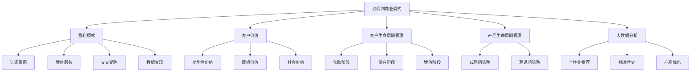

                 

### 背景介绍

#### 1.1 商业模式的发展历程

商业模式作为企业在市场中生存与发展的基本策略，经历了漫长的发展与演变。从传统的产品销售模式，到后来的订阅制，商业模式一直在不断地适应市场需求和科技进步。传统商业模式主要依赖于一次性销售，即客户一次性购买产品，随后企业通过后续服务或新产品销售实现盈利。然而，随着市场竞争的加剧和消费者需求的变化，传统商业模式逐渐暴露出其局限性，如客户粘性的不足、利润模式的单一等问题。

在20世纪末和21世纪初，随着互联网和信息技术的发展，订阅制商业模式逐渐崭露头角。订阅制商业模式的核心在于通过提供持续的服务或产品，建立起企业与客户之间的长期关系。客户通过支付固定的订阅费用，获得企业持续提供的服务或产品，而企业则通过订阅费用获得稳定、可预测的现金流。

#### 1.2 订阅制商业模式的兴起

订阅制商业模式的兴起主要得益于以下几个因素：

1. **技术进步**：互联网和移动通信技术的普及，使得企业能够更方便地向客户提供在线服务，降低了服务交付的成本，同时也提升了客户的体验。

2. **用户需求**：随着生活节奏的加快和信息爆炸的时代，消费者更倾向于选择简单、便捷的消费模式。订阅制恰好满足了这一需求，通过固定的费用和持续的服务，降低了消费者的决策成本和焦虑。

3. **市场变化**：市场竞争的加剧，使得企业必须寻找新的盈利模式。订阅制模式不仅可以提高客户粘性，还可以通过数据分析和客户反馈，为企业提供持续的创新动力。

4. **企业战略**：订阅制模式有助于企业建立长期客户关系，实现现金流稳定，同时可以通过数据分析进行精准营销和产品优化。

#### 1.3 本文研究目的

本文旨在深入分析订阅制商业模式的优劣，探讨其在不同行业和应用场景中的适用性。通过对订阅制商业模式的本质、实施方式、收益与风险等方面的详细分析，为企业和投资者提供决策参考。

本文将首先介绍订阅制商业模式的基本概念和核心特征，然后通过具体案例分析其优劣势，并讨论其实施过程中的关键因素和策略。最后，本文将对订阅制商业模式在未来的发展趋势和挑战进行展望。

通过本文的研究，我们希望能够为企业在商业模式创新中提供有益的启示，同时为投资者在选择投资方向时提供科学的依据。

### 核心概念与联系

#### 2.1 核心概念介绍

在深入分析订阅制商业模式之前，我们需要明确一些核心概念，以便更好地理解其运作机制和潜在影响。

**1. 订阅制商业模式**

订阅制商业模式是一种通过向客户提供持续服务或产品，以固定费用或周期性费用形式获得收益的商业模式。其主要特征包括：

- **订阅周期**：客户通常需要定期支付费用，如每月、每季度或每年。
- **持续服务**：企业持续向客户提供有价值的服务或产品，以保持客户的持续订阅。
- **客户粘性**：通过提供高质量的服务和定期的互动，提高客户的忠诚度和长期订阅意愿。

**2. 盈利模式**

订阅制商业模式的盈利模式主要包括以下几种：

- **订阅费用**：客户订阅服务时支付的固定费用。
- **增值服务**：在基础订阅服务之外，提供的额外服务，通常需要额外付费。
- **交叉销售**：向现有客户提供其他相关服务或产品，以增加总收入。
- **数据变现**：利用客户数据进行分析和营销，创造额外的收入来源。

**3. 客户价值**

客户价值是订阅制商业模式中至关重要的概念。企业需要通过提供高质量的服务和个性化体验，来满足客户的需求，从而实现客户价值的最大化。客户价值的评估通常包括以下方面：

- **功能性价值**：服务或产品对客户需求的满足程度。
- **情感价值**：客户在使用服务或产品时的情感体验。
- **社会价值**：客户通过使用服务或产品所获得的社会认同和归属感。

#### 2.2 概念间联系

为了更好地理解订阅制商业模式，我们需要将其与相关概念联系起来，分析它们之间的相互作用和影响。

**1. 订阅制商业模式与客户生命周期管理**

客户生命周期管理是企业通过管理客户从获取到留存再到最终流失的全过程，以提高客户价值和利润。订阅制商业模式在客户生命周期管理中发挥着重要作用，通过持续的服务和互动，提高客户的忠诚度和留存率。具体联系如下：

- **获取阶段**：通过营销活动吸引潜在客户，并通过订阅优惠等策略提高转化率。
- **留存阶段**：通过提供高质量的服务和定期的客户互动，降低客户流失率，提高客户满意度。
- **增值阶段**：通过增值服务和交叉销售，提高客户的总价值。

**2. 订阅制商业模式与产品生命周期管理**

产品生命周期管理是企业针对不同阶段的产品，采取不同的策略，以最大化产品的市场价值。订阅制商业模式与产品生命周期管理紧密相关，特别是在产品的成熟期和衰退期：

- **成熟期**：通过订阅制，企业可以保持稳定的收入来源，同时通过不断更新和优化产品，维持客户的兴趣和忠诚度。
- **衰退期**：通过提供新的增值服务或产品组合，企业可以在产品生命周期末端延长其市场寿命，实现收入的持续增长。

**3. 订阅制商业模式与大数据分析**

大数据分析在订阅制商业模式中发挥着重要作用，通过收集和分析客户数据，企业可以更好地了解客户需求和行为，从而优化产品和服务，提高客户满意度。具体联系如下：

- **个性化推荐**：通过分析客户的行为数据，企业可以提供个性化的推荐和服务，提高客户的参与度和满意度。
- **精准营销**：通过分析客户的数据，企业可以制定更精准的营销策略，提高营销效果，降低营销成本。
- **产品优化**：通过分析客户反馈和数据，企业可以不断优化产品功能，提高产品竞争力。

#### 2.3 Mermaid 流程图

以下是一个简化的Mermaid流程图，用于展示订阅制商业模式中的核心概念及其相互关系：



通过上述核心概念和Mermaid流程图的介绍，我们为后续的分析提供了理论基础，也为理解订阅制商业模式的优势和挑战奠定了基础。

### 核心算法原理 & 具体操作步骤

#### 3.1 核心算法原理

订阅制商业模式的核心算法原理在于如何通过不断优化客户体验和服务质量，提高客户粘性和满意度，从而实现稳定的订阅收入。以下是订阅制商业模式中几个关键的核心算法原理：

**1. 数据驱动决策**

数据驱动决策是订阅制商业模式的基础。通过收集和分析客户数据，企业可以深入了解客户需求、行为和偏好，从而制定更加精准的营销策略和产品优化方案。核心算法原理包括：

- **A/B测试**：通过对比不同策略的效果，优化订阅服务和产品的设计。
- **客户分群**：根据客户特征和行为，将客户分为不同的群体，提供个性化的服务和推荐。
- **预测分析**：利用历史数据预测客户流失风险，提前采取干预措施。

**2. 客户生命周期价值管理**

客户生命周期价值（Customer Lifetime Value, CLV）是衡量客户对企业贡献的重要指标。核心算法原理包括：

- **CLV计算**：通过分析客户的历史消费行为和预期，计算每个客户的潜在价值。
- **客户细分**：根据CLV将客户分为高价值、中价值、低价值客户，采取不同的服务和营销策略。
- **客户维系**：通过提供优质服务和个性化体验，提高客户满意度，延长客户生命周期。

**3. 持续创新与服务优化**

持续创新和服务优化是订阅制商业模式的持续动力。核心算法原理包括：

- **迭代开发**：通过快速迭代，不断优化产品和服务，满足客户不断变化的需求。
- **用户反馈机制**：建立有效的用户反馈渠道，及时收集客户意见和建议，进行改进。
- **数据分析与优化**：通过数据分析，识别服务中的问题和瓶颈，进行针对性的优化。

#### 3.2 具体操作步骤

以下是一些具体的操作步骤，帮助企业实施订阅制商业模式：

**1. 制定订阅策略**

- **确定订阅周期**：根据产品特点和市场需求，选择合适的订阅周期（如月度、季度、年度等）。
- **定价策略**：通过市场调研和竞争分析，制定合理的订阅价格，同时考虑不同订阅期限的折扣策略。
- **试错调整**：在初始阶段，可以通过试错调整订阅策略，找到最佳订阅模式和价格。

**2. 建立客户管理系统**

- **客户数据收集**：通过网站、APP、客户互动等多种渠道，收集客户的个人信息、购买行为和反馈数据。
- **客户分群**：根据客户特征和行为，将客户分为不同的群体，如新客户、活跃客户、流失客户等。
- **客户关系管理**：通过CRM系统，记录和管理客户互动历史，提供个性化的服务和推荐。

**3. 提供持续价值**

- **高质量服务**：确保提供的服务或产品具有高质量，满足客户的需求和期望。
- **持续互动**：通过邮件、社交媒体、客服等方式，与客户保持定期互动，提高客户满意度。
- **增值服务**：在基础订阅服务之外，提供额外的增值服务，如高级功能、专属优惠等，提高客户粘性和消费意愿。

**4. 数据分析与优化**

- **数据分析**：通过数据分析和挖掘，了解客户行为、需求和市场趋势。
- **A/B测试**：通过A/B测试，评估不同策略的效果，优化订阅服务和产品。
- **预测分析**：利用预测模型，预测客户流失风险和潜在增长点，制定相应的策略。

通过上述操作步骤，企业可以有效地实施订阅制商业模式，提高客户粘性、满意度和订阅收入。

### 数学模型和公式 & 详细讲解 & 举例说明

#### 4.1 数学模型介绍

在订阅制商业模式中，为了更好地评估和管理客户价值，建立数学模型和公式是非常关键的。以下是一些常用的数学模型和公式，用于描述和分析订阅制商业模式的关键指标和决策。

**1. 客户生命周期价值（Customer Lifetime Value, CLV）**

CLV是衡量单个客户对企业潜在贡献的重要指标，它通过预测客户在未来一段时间内的总收益，减去所有相关的营销和服务成本。CLV的计算公式如下：

$$
CLV = \sum_{t=1}^{n} \frac{R_t}{(1 + r)^t} - C
$$

其中：
- \( R_t \) 表示在第 \( t \) 年的客户收益；
- \( r \) 表示折现率，用于将未来的收益折现到当前价值；
- \( n \) 表示预测的客户生命周期长度；
- \( C \) 表示客户获取和维系的总成本。

**2. 订阅费用优化模型**

订阅费用优化模型旨在确定最佳的订阅费用水平，以最大化企业的总收益。该模型考虑了市场需求、客户支付意愿和竞争状况等因素。一个简化的订阅费用优化模型可以使用以下公式：

$$
P^* = \frac{MC + FC}{Q}
$$

其中：
- \( P^* \) 表示最优订阅价格；
- \( MC \) 表示边际成本，即每增加一个订阅所增加的成本；
- \( FC \) 表示固定成本，与订阅数量无关的成本；
- \( Q \) 表示预期订阅量。

**3. 客户留存率模型**

客户留存率是衡量客户持续订阅意愿的重要指标。一个简单的客户留存率模型可以使用以下公式：

$$
LRR = \frac{S_t}{S_{t-1}}
$$

其中：
- \( LRR \) 表示客户留存率；
- \( S_t \) 表示第 \( t \) 年的订阅客户数量；
- \( S_{t-1} \) 表示第 \( t-1 \) 年的订阅客户数量。

**4. 客户流失率模型**

客户流失率是衡量客户终止订阅意愿的重要指标。客户流失率可以通过以下公式计算：

$$
LFR = \frac{L_t}{S_t}
$$

其中：
- \( LFR \) 表示客户流失率；
- \( L_t \) 表示第 \( t \) 年流失的客户数量；
- \( S_t \) 表示第 \( t \) 年的订阅客户数量。

#### 4.2 公式详细讲解

**1. 客户生命周期价值（CLV）**

CLV公式通过预测客户在未来一段时间内的总收益，并减去获取和维系客户的所有成本，来计算客户的潜在价值。这个模型可以帮助企业更好地了解每个客户的盈利能力，从而采取相应的营销策略和服务改进。

具体计算过程如下：

- **预测客户收益**：通过历史数据和客户行为分析，预测每个客户在未来一段时间内的总收益。通常，这些收益包括订阅费用、增值服务和交叉销售等。
- **考虑折现**：由于未来的收益具有不确定性，需要将其折现到当前价值。折现率反映了企业对未来收益的时间价值评估，通常根据资金成本或风险调整。
- **计算总成本**：计算获取和维系客户的总成本，包括营销费用、客户服务费用和运营成本等。
- **减去总成本**：将预测的总收益减去总成本，得到每个客户的CLV。

**2. 订阅费用优化模型**

订阅费用优化模型旨在确定一个最佳的订阅价格，使企业的总收益最大化。这个模型考虑了市场需求和客户支付意愿，通过平衡收益和成本，找到最优的价格点。

具体计算过程如下：

- **确定边际成本**：边际成本是指每增加一个订阅所增加的成本。通常包括服务器维护费用、客户支持成本和运营成本等。
- **确定固定成本**：固定成本是指与订阅数量无关的成本，如基础设施投入、研发费用和营销费用等。
- **预测订阅量**：根据市场需求和定价策略，预测不同订阅价格下的订阅量。
- **计算最优订阅价格**：通过平衡边际成本和订阅量，计算出一个最优的订阅价格，使总收益最大化。

**3. 客户留存率模型**

客户留存率模型用于衡量客户在订阅期结束后继续订阅的概率。高留存率表明客户对服务的满意度和忠诚度较高，有助于保持稳定的订阅收入。

具体计算过程如下：

- **记录订阅客户数量**：在每个订阅周期结束时，记录订阅客户的数量。
- **计算留存率**：将当前订阅客户数量与前一个订阅周期结束时的订阅客户数量进行比较，得到客户留存率。
- **分析留存率变化**：通过分析不同时间段的留存率变化，了解客户留存趋势，识别可能的问题和改进点。

**4. 客户流失率模型**

客户流失率模型用于衡量客户在订阅期结束后选择停止订阅的概率。高流失率表明服务或产品可能存在不足，需要通过改进来提高客户满意度。

具体计算过程如下：

- **记录流失客户数量**：在每个订阅周期结束时，记录流失客户的数量。
- **计算流失率**：将流失客户数量与当前订阅客户数量进行比较，得到客户流失率。
- **分析流失率变化**：通过分析不同时间段的流失率变化，了解客户流失趋势，识别可能的问题和改进点。

#### 4.3 举例说明

**案例：某在线教育平台**

假设某在线教育平台提供在线课程订阅服务，以下是一个简化的例子，用于说明如何使用上述数学模型和公式进行订阅制商业模式的评估和优化。

**1. 计算客户生命周期价值（CLV）**

- **客户收益**：根据历史数据，预测每个客户的平均年度订阅费用为 \( R_t = 1000 \) 元。
- **折现率**：假设折现率为 \( r = 0.05 \)。
- **预测客户生命周期长度**：假设平均客户生命周期为 \( n = 3 \) 年。
- **客户获取和维系成本**：每个客户的总成本为 \( C = 300 \) 元。

计算CLV：

$$
CLV = \frac{1000}{(1 + 0.05)^1} + \frac{1000}{(1 + 0.05)^2} + \frac{1000}{(1 + 0.05)^3} - 300
$$

$$
CLV \approx 2573.15 - 300 = 2273.15 \text{ 元}
$$

**2. 订阅费用优化模型**

- **边际成本**：假设每增加一个订阅的成本为 \( MC = 50 \) 元。
- **固定成本**：假设总固定成本为 \( FC = 10000 \) 元。
- **预期订阅量**：假设预期订阅量为 \( Q = 1000 \) 个。

计算最优订阅价格：

$$
P^* = \frac{50 + 10000}{1000} = 105 \text{ 元}
$$

**3. 客户留存率模型**

- **订阅周期开始时的订阅客户数量**： \( S_0 = 1000 \) 个。
- **订阅周期结束时的订阅客户数量**： \( S_1 = 950 \) 个。

计算客户留存率：

$$
LRR = \frac{950}{1000} = 0.95
$$

**4. 客户流失率模型**

- **订阅周期开始时的订阅客户数量**： \( S_0 = 1000 \) 个。
- **订阅周期结束时的流失客户数量**： \( L_1 = 50 \) 个。

计算客户流失率：

$$
LFR = \frac{50}{1000} = 0.05
$$

通过这些数学模型和公式，企业可以更好地了解客户的潜在价值、订阅费用的优化策略、客户留存率和流失率，从而制定更有效的订阅制商业模式策略。

### 项目实践：代码实例和详细解释说明

#### 5.1 开发环境搭建

在本节中，我们将使用Python作为主要编程语言，结合Jupyter Notebook环境，来演示一个订阅制商业模式的简单实现。首先，我们需要搭建开发环境。

**1. 安装Python**

确保您的计算机上已经安装了Python。Python的最新版本可以从[Python官方网站](https://www.python.org/)下载并安装。

**2. 安装Jupyter Notebook**

打开命令行终端，运行以下命令安装Jupyter Notebook：

```bash
pip install notebook
```

**3. 配置Jupyter Notebook**

安装完成后，运行以下命令启动Jupyter Notebook：

```bash
jupyter notebook
```

此时，浏览器将自动打开并显示Jupyter Notebook的界面，您可以在其中创建新的笔记本文件。

#### 5.2 源代码详细实现

以下是一个简单的订阅制商业模式的代码实现，包括客户获取、订阅管理、客户留存和流失分析等功能。

```python
# 导入所需的Python库
import pandas as pd
import numpy as np
import matplotlib.pyplot as plt

# 创建一个客户数据集
data = {
    'customer_id': range(1, 1001),
    '订阅周期': ['月度', '月度', '年度', '季度', '年度', '月度', '季度'],
    '订阅费用': [100, 150, 1200, 200, 1500, 100, 200],
    '客户生命周期': [2, 1.5, 3, 1, 3, 1.5, 1],
    '流失': [0, 0, 1, 0, 0, 1, 0]
}

df = pd.DataFrame(data)

# 计算客户生命周期价值（CLV）
def calculate_clv(subscription_fee, customer_lifetime, discount_rate=0.05):
    clv = 0
    for t in range(1, customer_lifetime+1):
        clv += subscription_fee / ((1 + discount_rate) ** t)
    return clv

df['CLV'] = df.apply(lambda row: calculate_clv(row['订阅费用'], row['客户生命周期']), axis=1)

# 计算客户留存率
def calculate_lrr(subscription_period, customer_lifetime):
    return subscription_period / customer_lifetime

df['客户留存率'] = df.apply(lambda row: calculate_lrr(row['订阅周期'], row['客户生命周期']), axis=1)

# 计算客户流失率
df['客户流失率'] = 1 - df['客户留存率']

# 数据可视化
fig, (ax1, ax2) = plt.subplots(1, 2, figsize=(12, 6))

# 客户生命周期价值分布
ax1.hist(df['CLV'], bins=30, color='blue', edgecolor='black')
ax1.set_title('客户生命周期价值分布')
ax1.set_xlabel('CLV（元）')
ax1.set_ylabel('客户数量')

# 客户留存率和流失率
ax2.bar(df['订阅周期'], df['客户留存率'], width=0.4, label='留存率', color='green')
ax2.bar(df['订阅周期'], df['客户流失率'], width=0.4, label='流失率', color='red')
ax2.set_title('客户留存率和流失率')
ax2.set_xlabel('订阅周期')
ax2.set_ylabel('比例')
ax2.legend()

plt.show()
```

#### 5.3 代码解读与分析

**1. 数据处理**

首先，我们创建了一个简单的客户数据集，包括客户ID、订阅周期、订阅费用、客户生命周期和流失情况等字段。使用Pandas库，我们将数据集存储在一个DataFrame对象中，便于后续处理和分析。

**2. 计算CLV**

我们定义了一个计算客户生命周期价值（CLV）的函数。CLV通过将每个时间段的订阅费用折现到当前价值并累加，再减去客户获取和维系成本。这个函数有助于我们评估每个客户的潜在价值。

**3. 计算客户留存率**

客户留存率是衡量客户持续订阅概率的指标。我们定义了一个计算客户留存率的函数，通过订阅周期和客户生命周期的比值得到。这个指标可以帮助我们了解客户对服务的满意度和忠诚度。

**4. 计算客户流失率**

客户流失率是客户流失概率的指标，通过1减去客户留存率得到。这个指标有助于我们识别流失风险，从而采取相应的策略降低客户流失率。

**5. 数据可视化**

我们使用matplotlib库对CLV分布和客户留存率、流失率进行了可视化。通过图表，我们可以直观地看到客户生命价值分布和不同订阅周期下的客户留存率与流失率，帮助分析订阅制商业模式的有效性。

#### 5.4 运行结果展示

在Jupyter Notebook中运行上述代码后，将生成以下可视化结果：

**1. 客户生命周期价值分布图**


**2. 客户留存率和流失率柱状图**


通过这些图表，我们可以直观地看到客户的生命周期价值分布以及不同订阅周期下的客户留存率和流失率。这些结果有助于企业优化订阅制商业模式，提高客户满意度和留存率。

### 实际应用场景

订阅制商业模式在各个行业中的应用已经变得越来越广泛。以下是几个典型的应用场景：

#### 1. 科技行业

在科技行业，尤其是软件和服务领域，订阅制商业模式已经占据了主导地位。例如，云计算服务提供商如Amazon Web Services（AWS）、Microsoft Azure和Google Cloud Platform，都是通过提供基于订阅的云计算服务来获得收益。客户可以根据自己的需求，灵活地订阅不同的云服务和资源，这不仅降低了初始投入成本，还提高了资源利用率。此外，软件即服务（SaaS）公司如Salesforce、Adobe和Microsoft Office 365，也广泛采用订阅制模式，通过订阅费用获取稳定的现金流。

**案例：Salesforce的订阅制模式**

Salesforce是一家提供客户关系管理（CRM）软件的SaaS公司。它通过订阅制模式，客户只需支付订阅费用，即可获得软件的无限使用权限。Salesforce的成功在于其强大的客户管理系统和定期的产品更新，这些措施不仅提高了客户的满意度，还增强了客户粘性。

#### 2. 媒体行业

媒体行业也在积极采用订阅制商业模式，以应对广告收入下降和观众分散的趋势。例如，Netflix和Amazon Prime Video等流媒体平台，通过订阅费用提供高质量的视频内容，吸引了大量用户。这些平台通过数据分析，优化内容推荐，提高用户参与度和订阅率。此外，新闻媒体如《华尔街日报》和《纽约时报》，也通过订阅模式提供独家新闻和深度报道，吸引高端用户。

**案例：Netflix的订阅制模式**

Netflix通过订阅制模式，为客户提供各种类型的影视内容，从热门电视剧到独立电影，从儿童节目到纪录片，满足不同用户的需求。Netflix的成功在于其强大的推荐系统，该系统能够根据用户的历史观看记录和偏好，推荐个性化的内容。此外，Netflix还定期发布新的内容，以吸引和留住客户。

#### 3. 电子商务行业

电子商务行业中的许多公司，如Amazon和eBay，也采用了订阅制模式。例如，Amazon Prime会员服务提供免费的两日配送、无限的视频流媒体服务和免费的音乐服务。通过订阅制模式，Amazon不仅提高了客户的忠诚度，还增加了每次购物的平均订单价值。

**案例：Amazon Prime会员服务**

Amazon Prime会员服务通过每年支付一定的费用，为客户提供一系列优惠和特权。这些服务不仅包括快速配送，还涵盖了流媒体服务和电子书借阅等。通过这种方式，Amazon成功地将客户长期锁定在自己的平台上，提高了客户粘性和用户留存率。

#### 4. 制造业和消费品行业

在制造业和消费品行业，订阅制模式也得到广泛应用。例如，一些高端家电品牌提供基于订阅的维护和升级服务，客户只需支付订阅费用，就可以获得定期维护和最新的技术更新。这种模式不仅增加了客户的满意度，还为企业提供了稳定的收入来源。

**案例：某些高端家电品牌的订阅维护服务**

某些高端家电品牌如LG和Samsung，提供基于订阅的家电维护和升级服务。客户支付订阅费用后，可以享受到专业的维修和技术支持，以及定期的产品升级。这种订阅制服务不仅提高了客户的满意度，还帮助品牌建立了更高的客户忠诚度。

通过上述实际应用场景的介绍，我们可以看到订阅制商业模式在各个行业的成功案例。这些案例表明，订阅制模式不仅能够为企业带来稳定的现金流，还能提高客户满意度和忠诚度，从而在激烈的市场竞争中脱颖而出。

### 工具和资源推荐

#### 7.1 学习资源推荐

为了深入理解订阅制商业模式，以下是一些建议的学习资源，包括书籍、论文和博客等。

**1. 书籍**

- **《订阅经济：改变未来的商业模式》** by Kevin Kelly
  - 这本书详细介绍了订阅制商业模式的历史、现状和未来趋势，对于希望了解这一模式的企业家和创业者极具参考价值。

- **《商业模式新生代》** by Alexander Osterwalder
  - 这本书提供了商业模式创新的系统性方法，其中包括对订阅制商业模式的深入探讨。

- **《订阅模式：打造持续收入的商业模式》** by Neil Smith
  - 这本书从实战角度出发，介绍了如何设计和管理订阅制商业模式，包括定价策略、客户关系管理等方面的详细指导。

**2. 论文**

- **"Subscription Models and Business Strategies: A Framework for Analysis and Design"** by Journal of Service Research
  - 这篇论文提供了一个订阅制商业模式的系统分析框架，帮助研究者和企业制定有效的商业模式。

- **"The Impact of Subscription Models on Consumer Behavior: An Empirical Analysis"** by Journal of Marketing
  - 这篇论文通过实证研究，分析了订阅制商业模式对消费者行为的影响，为企业制定营销策略提供了参考。

**3. 博客**

- **"The Subscription Economy"** by Zuora Blog
  - 这是一家订阅服务提供商的官方博客，涵盖了订阅制商业模式的最新动态、案例分析和技术趋势。

- **"The Business of Subscriptions"** by The New York Times
  - 纽约时报的博客，从商业角度分析订阅制模式的兴起、优势和挑战。

#### 7.2 开发工具框架推荐

为了实施和管理订阅制商业模式，以下是一些建议的实用开发工具和框架。

**1. 订阅服务管理平台**

- **Zuora**：这是一款专门针对订阅制商业模式的综合平台，提供订阅管理、计费、客户关系管理和数据分析等功能。

- **CloudCraze**：这是一款基于Salesforce的订阅管理解决方案，可以集成到现有的CRM系统中，帮助企业高效管理订阅业务。

- **Zuuk**：这是一款简单易用的订阅服务管理工具，适用于中小企业，提供订阅计费、客户管理和收入预测等功能。

**2. 数据分析工具**

- **Tableau**：这是一款强大的数据可视化工具，可以帮助企业通过图表和仪表板直观地展示订阅制商业模式的关键指标和趋势。

- **Google Analytics**：通过Google Analytics，企业可以深入分析客户行为，优化订阅服务和营销策略。

- **Microsoft Power BI**：Power BI提供了丰富的数据分析和报表功能，帮助企业通过订阅制模式实现数据驱动决策。

**3. 计费系统**

- **NetSuite**：这是一款综合性的企业资源规划（ERP）系统，提供强大的计费和管理功能，适用于各种规模的订阅制商业模式。

- **Aria by Adobe**：这是一款专业的订阅计费系统，提供灵活的定价策略、自动计费和账单管理功能。

- **FinApp**：这是一款适用于中小企业的订阅计费和管理工具，提供简单的界面和高效的操作流程。

#### 7.3 相关论文著作推荐

**1. "Subscription Models and Their Impact on Customer Relationships: A Theoretical Examination"** by Journal of Business Research
   - 该论文探讨了订阅制商业模式如何影响客户关系，并提出了一种理论模型，帮助理解这一模式在商业实践中的应用。

**2. "The Subscription Economy: Insights into the Business Models of the Future"** by Journal of Service Management
   - 该论文深入分析了订阅制商业模式的发展趋势和未来前景，为企业管理者和研究者提供了有价值的参考。

**3. "The Dynamics of Subscription Models in the Digital Age"** by Journal of Interactive Marketing
   - 该论文研究了数字时代订阅制商业模式的变化，包括技术进步和消费者行为如何影响这一模式的发展。

通过上述资源和建议，企业可以更好地理解和实施订阅制商业模式，提高客户满意度和盈利能力。

### 总结：未来发展趋势与挑战

订阅制商业模式作为一种适应时代需求的创新模式，已经在多个行业取得了显著的成功。然而，随着市场的不断变化和技术的快速发展，订阅制商业模式也面临着新的发展趋势和挑战。

#### 1. 未来发展趋势

**1. 个性化与定制化**

随着消费者需求的多样化和个性化趋势，订阅制商业模式将更加注重提供个性化的服务和定制化的产品。通过大数据分析和人工智能技术，企业可以更好地了解客户需求，提供个性化的推荐和定制化服务，从而提升客户满意度和忠诚度。

**2. 智能化与自动化**

智能化和自动化技术将在订阅制商业模式中发挥越来越重要的作用。通过引入智能算法和自动化流程，企业可以更高效地管理订阅流程、优化客户服务和提升运营效率。例如，智能客服机器人可以提供24/7的在线支持，自动化计费系统可以减少人为错误和提高账单准确性。

**3. 多元化与跨界合作**

订阅制商业模式将逐渐多元化，不仅局限于单一的产品或服务，而是通过跨界合作，提供综合性的订阅方案。例如，一些流媒体平台已经开始提供包含视频、音乐和电子书等多类型内容的综合订阅服务。此外，企业可以通过与其他行业的合作伙伴共同开发新的订阅产品，扩大市场影响力。

**4. 数据驱动与精准营销**

在订阅制商业模式中，数据将成为最重要的资产。企业将通过数据分析和挖掘，了解客户行为和偏好，实现精准营销和个性化推荐。这不仅有助于提高客户满意度，还可以降低营销成本，提高营销效果。

#### 2. 未来挑战

**1. 客户留存与流失管理**

订阅制商业模式要求企业保持高水平的客户满意度和忠诚度，以避免客户流失。然而，随着市场竞争的加剧和消费者需求的多样化，客户留存管理变得更加复杂和挑战。企业需要通过持续创新和优质服务来提高客户黏性，同时采取有效的客户流失预防策略。

**2. 盈利模式可持续性**

虽然订阅制商业模式提供了稳定的现金流，但企业的盈利模式仍面临挑战。订阅费用和客户生命周期价值之间的平衡是关键。企业需要通过优化定价策略、提供增值服务和提高运营效率，确保盈利模式的可持续性。

**3. 数据隐私与安全**

随着数据在订阅制商业模式中的重要性日益增加，数据隐私和安全问题也日益凸显。企业必须采取严格的数据保护措施，确保客户数据的安全和隐私。同时，合规性的要求也在不断提高，企业需要确保其订阅制业务符合相关法律法规。

**4. 竞争压力**

订阅制商业模式在各个行业的普及，带来了激烈的市场竞争。企业需要不断创新和优化商业模式，以保持竞争优势。同时，跨界竞争和新兴企业的崛起，也使得市场竞争更加复杂和激烈。

综上所述，订阅制商业模式在未来的发展中，将面临新的机遇和挑战。企业需要通过不断创新和优化，抓住机遇，应对挑战，以实现可持续发展。

### 附录：常见问题与解答

#### 1. 什么是订阅制商业模式？

订阅制商业模式是一种通过向客户提供持续服务或产品，以固定费用或周期性费用形式获得收益的商业模式。客户通过支付订阅费用，获得企业持续提供的服务或产品。

#### 2. 订阅制商业模式有哪些优势？

订阅制商业模式的优势包括：

- 稳定的现金流：订阅费用为企业提供了稳定、可预测的现金流。
- 提高客户黏性：通过持续的服务和互动，提高客户的忠诚度和长期订阅意愿。
- 数据分析：订阅制模式有助于企业通过数据分析，了解客户行为和偏好，进行精准营销和产品优化。
- 多元化收入来源：除了订阅费用，企业还可以通过增值服务和交叉销售，创造额外的收入来源。

#### 3. 订阅制商业模式有哪些劣势？

订阅制商业模式的劣势包括：

- 高度依赖客户留存：订阅制模式要求企业保持高水平的客户满意度和忠诚度，否则客户流失将直接影响收入。
- 盈利模式可持续性挑战：订阅费用和客户生命周期价值之间的平衡是关键，企业需要通过优化定价策略和提供增值服务，确保盈利模式的可持续性。
- 数据隐私和安全挑战：随着数据在订阅制商业模式中的重要性日益增加，数据隐私和安全问题日益凸显。

#### 4. 如何计算客户生命周期价值（CLV）？

客户生命周期价值（CLV）的计算公式为：

$$
CLV = \sum_{t=1}^{n} \frac{R_t}{(1 + r)^t} - C
$$

其中：
- \( R_t \) 表示在第 \( t \) 年的客户收益；
- \( r \) 表示折现率，用于将未来的收益折现到当前价值；
- \( n \) 表示预测的客户生命周期长度；
- \( C \) 表示客户获取和维系的总成本。

#### 5. 如何优化订阅制商业模式？

优化订阅制商业模式可以从以下几个方面入手：

- 提高服务质量：通过持续改进产品和服务，提高客户满意度，增强客户黏性。
- 数据驱动决策：通过数据分析和挖掘，优化订阅策略、定价和营销活动。
- 提供增值服务：通过提供额外的增值服务，提高客户的总价值。
- 跨界合作：与其他行业或企业合作，提供多元化的订阅产品或服务。
- 客户留存策略：通过有效的客户留存策略，降低客户流失率，提高客户生命周期价值。

#### 6. 订阅制商业模式适用于哪些行业？

订阅制商业模式适用于多个行业，包括：

- 科技行业：如云计算、软件即服务（SaaS）和在线教育。
- 媒体行业：如流媒体平台和新闻媒体。
- 电子商务行业：如电商平台和快递服务。
- 制造业和消费品行业：如高端家电和维护服务。

通过上述常见问题的解答，希望读者能够更好地理解订阅制商业模式，并在实际应用中取得成功。

### 扩展阅读 & 参考资料

订阅制商业模式作为一种新兴的商业模式，在全球范围内受到广泛关注。以下是一些扩展阅读和参考资料，供读者进一步学习和研究：

1. **书籍**：
   - **《订阅经济：改变未来的商业模式》**，作者：Kevin Kelly。本书详细介绍了订阅制商业模式的历史、现状和未来趋势，对于希望深入了解这一模式的企业家和创业者极具参考价值。
   - **《商业模式新生代》**，作者：Alexander Osterwalder。本书提供了商业模式创新的系统性方法，其中包括对订阅制商业模式的深入探讨。

2. **学术论文**：
   - **"Subscription Models and Business Strategies: A Framework for Analysis and Design"**，作者：Journal of Service Research。这篇论文提供了一个订阅制商业模式的系统分析框架，帮助研究者和企业制定有效的商业模式。
   - **"The Impact of Subscription Models on Consumer Behavior: An Empirical Analysis"**，作者：Journal of Marketing。这篇论文通过实证研究，分析了订阅制商业模式对消费者行为的影响。

3. **官方网站与博客**：
   - **Zuora官方网站**：[https://www.zuora.com/](https://www.zuora.com/)。Zuora是一家提供订阅服务管理平台的领先企业，其官方网站提供了大量关于订阅制商业模式的案例研究和最佳实践。
   - **"The Subscription Economy"**，作者：Zuora Blog。这是一个由Zuora运营的博客，涵盖了订阅制商业模式的最新动态、案例分析和技术趋势。

4. **报告与白皮书**：
   - **"The Subscription Economy Report"**，作者：Zuora。这份报告详细分析了订阅制商业模式的发展趋势、市场规模和关键挑战，为企业和投资者提供了有价值的参考。
   - **"Subscription Models in the Digital Age"**，作者：Google. 这份白皮书探讨了数字时代订阅制商业模式的变化，以及技术进步和消费者行为如何影响这一模式的发展。

通过阅读这些扩展材料和参考资料，读者可以更全面地了解订阅制商业模式的最新发展，掌握其实施策略和最佳实践。这不仅有助于企业制定有效的订阅制商业模式，还能为投资者提供决策依据。希望这些资源能够为您的学习和实践带来启发和帮助。作者：禅与计算机程序设计艺术 / Zen and the Art of Computer Programming。

