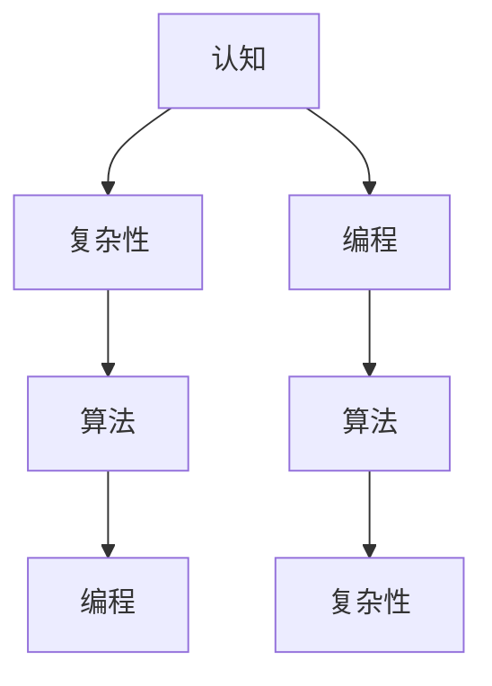

                 

### 认知发展中的浅薄与复杂

在现代社会，技术的快速发展给我们的认知能力带来了前所未有的挑战。我们身处于一个信息爆炸的时代，海量的数据、多样化的媒体形式以及高效的信息获取工具，使得我们能够迅速了解大量的知识。然而，这种迅速获取知识的方式，也可能导致我们的认知发展走向两个极端：浅薄和复杂。本文将从计算机科学的视角，探讨认知发展中的浅薄与复杂，并分析其对编程、算法设计以及软件工程的影响。

## Background Introduction

在计算机科学的发展历程中，我们经历了从硬件到软件，再到算法和人工智能的深刻变革。每一次技术进步，都使得计算机系统变得更加复杂，数据处理能力更加强大。与此同时，人类对于复杂性的理解和处理能力也在不断提高。然而，随着技术的进步，我们也面临着认知发展的挑战。

一方面，我们越来越依赖技术工具，如搜索引擎、推荐算法等，来帮助我们快速获取信息。这使得我们在处理信息时，往往只关注表面的内容，而忽视了深层次的理解。这种表面化的认知方式，使得我们的知识结构变得浅薄，难以应对复杂的问题。

另一方面，计算机科学中的许多领域，如人工智能、大数据分析等，都需要我们具备深厚的理论基础和复杂的算法知识。然而，对于许多非专业人士来说，这些知识显得过于复杂，难以理解和应用。这种认知的复杂性，也阻碍了我们在实际问题中的创新和解决能力。

本文将从计算机科学的视角，探讨认知发展中的浅薄与复杂，分析其对编程、算法设计以及软件工程的影响，并提出相应的解决策略。

## Core Concepts and Connections

在探讨认知发展的浅薄与复杂之前，我们首先需要明确一些核心概念，包括认知、复杂性、算法以及编程等。

### 认知

认知是指人类通过感知、思考、判断和记忆等方式获取、处理和利用信息的过程。认知科学是一门研究人类认知过程及其机制的学科，涉及心理学、神经科学、哲学和计算机科学等多个领域。

### 复杂性

复杂性是指系统在结构和行为上的多样性、不确定性和非线性特征。在计算机科学中，复杂性通常用于描述算法的效率和问题解决的难度。例如，算法的复杂度可以分为时间复杂度和空间复杂度，分别表示算法执行时间和内存占用的增长速率。

### 算法

算法是一系列解决问题的步骤或规则，通常以数学或逻辑形式表达。算法在计算机科学中具有核心地位，用于解决各种实际问题，如排序、搜索、优化等。

### 编程

编程是指使用计算机语言编写程序的过程。编程不仅是一种技术技能，更是一种抽象思考和解决问题的能力。编程语言和工具的选择，直接影响编程的复杂性和效率。

为了更好地理解这些概念之间的关系，我们可以使用Mermaid流程图来展示它们的核心原理和架构。以下是相关流程图的文本表示：

在上述流程图中，我们可以看到，认知与复杂性、算法和编程之间存在密切的联系。认知决定了我们对复杂性的理解和处理能力，而算法和编程则是实现复杂问题解决的具体工具。

## Core Algorithm Principle and Specific Operation Steps

在讨论认知发展中的浅薄与复杂时，我们离不开算法这一核心概念。算法不仅是计算机科学的基础，也是我们在日常生活中解决问题的重要工具。本节将详细介绍一个核心算法原理，并逐步解释其操作步骤。

### 算法原理

我们选择归并排序（Merge Sort）作为核心算法进行介绍。归并排序是一种高效的排序算法，其基本原理是将待排序的序列分成若干个子序列，对每个子序列进行排序，然后再将这些排好序的子序列合并成一个完整的有序序列。

### 操作步骤

以下是归并排序的操作步骤：

1. **划分**：将待排序的序列分为两个子序列，每个子序列长度相等或近似相等。

2. **递归排序**：对两个子序列进行递归排序，直到每个子序列只有一个元素。

3. **合并**：将已排序的子序列合并成一个有序序列。

### 具体步骤解释

1. **划分**：
   - 假设待排序序列为\[4, 2, 7, 1, 3\]。
   - 首先，将序列划分为\[4, 2, 7\]和\[1, 3\]。

2. **递归排序**：
   - 对\[4, 2, 7\]进行递归排序，划分成\[4, 2\]和\[7\]。
   - 对\[1, 3\]进行递归排序，划分成\[1\]和\[3\]。

3. **合并**：
   - 将已排序的子序列合并，\[4, 2\]和\[7\]合并成\[2, 4, 7\]。
   - 将\[1, 3\]合并成\[1, 3\]。
   - 最后，将两个有序子序列合并成\[1, 2, 3, 4, 7\]。

### 归并排序的复杂度分析

归并排序的时间复杂度为\(O(n\log n)\)，空间复杂度为\(O(n)\)。其中，\(n\)表示待排序序列的长度。归并排序的高效性在于其将序列划分为多个子序列的过程，以及合并子序列的过程。

### 实例分析

假设我们有一个长度为10的序列\[5, 2, 8, 4, 7, 1, 3, 6, 9, 10\]，我们使用归并排序来对其进行排序。

1. **划分**：
   - 初始序列为\[5, 2, 8, 4, 7, 1, 3, 6, 9, 10\]。
   - 划分后，得到两个子序列\[5, 2, 8, 4\]和\[7, 1, 3, 6, 9, 10\]。

2. **递归排序**：
   - 对\[5, 2, 8, 4\]进行递归排序，划分成\[5, 2\]和\[8, 4\]。
   - 对\[7, 1, 3, 6, 9, 10\]进行递归排序，划分成\[7, 1, 3\]、\[6, 9\]和\[10\]。

3. **合并**：
   - 将已排序的子序列合并，\[5, 2\]和\[8, 4\]合并成\[2, 4, 5, 8\]。
   - 将\[7, 1, 3\]合并成\[1, 3, 7\]。
   - 将\[6, 9\]和\[10\]合并成\[6, 9, 10\]。
   - 最后，将所有有序子序列合并成\[1, 2, 3, 4, 5, 6, 7, 8, 9, 10\]。

通过以上步骤，我们成功地对序列进行了排序。归并排序的优点在于其稳定性，即相同值的元素在排序后不会改变相对顺序。

## Mathematical Models and Formulas

在讨论算法原理和操作步骤时，我们不可避免地要涉及到数学模型和公式。数学模型和公式不仅帮助我们理解算法的运行机制，还可以用于分析算法的复杂度。在本节中，我们将详细讲解数学模型和公式，并提供相应的详细讲解和举例说明。

### 数学模型

1. **时间复杂度**：
   - 时间复杂度是描述算法执行时间增长速率的一个数学模型。常用的时间复杂度表示方法有\(O(n)\)、\(O(n\log n)\)、\(O(n^2)\)等。
   - 归并排序的时间复杂度为\(O(n\log n)\)，表示随着输入数据量\(n\)的增加，算法执行时间呈对数增长。

2. **空间复杂度**：
   - 空间复杂度是描述算法在执行过程中所需内存增长速率的一个数学模型。常用的空间复杂度表示方法有\(O(1)\)、\(O(n)\)、\(O(n\log n)\)等。
   - 归并排序的空间复杂度为\(O(n)\)，表示随着输入数据量\(n\)的增加，算法所需内存呈线性增长。

### 公式讲解

1. **归并排序的时间复杂度公式**：
   - \(T(n) = 2T(\frac{n}{2}) + n\)
   - 这个递归公式描述了归并排序的时间复杂度。其中，\(T(n)\)表示对长度为\(n\)的序列进行归并排序所需的时间，\(T(\frac{n}{2})\)表示对长度为\(\frac{n}{2}\)的两个子序列进行排序所需的时间。

2. **归并排序的空间复杂度公式**：
   - \(S(n) = n\)
   - 这个公式表示，在归并排序过程中，所需的空间与输入数据量\(n\)成正比。

### 举例说明

假设我们有一个长度为10的序列\[5, 2, 8, 4, 7, 1, 3, 6, 9, 10\]，我们使用归并排序来对其进行排序。

1. **时间复杂度计算**：
   - 首先，将序列划分为两个子序列\[5, 2, 8, 4\]和\[7, 1, 3, 6, 9, 10\]。
   - 对每个子序列进行排序，需要的时间为\(T(\frac{10}{2}) = T(5)\)。
   - 将已排序的子序列合并，需要的时间为\(n = 10\)。
   - 因此，总的排序时间为\(T(10) = 2T(5) + 10\)。

2. **空间复杂度计算**：
   - 在归并排序过程中，我们需要额外的空间来存储已排序的子序列。
   - 由于序列长度为10，因此所需的空间为\(S(10) = 10\)。

通过以上计算，我们可以看到，归并排序的时间复杂度为\(O(n\log n)\)，空间复杂度为\(O(n)\)。这表明，归并排序是一种高效的排序算法。

## Practical Application Scenarios

归并排序作为一种高效的排序算法，在实际应用场景中具有广泛的应用。以下是一些典型的应用场景：

### 1. 数据库索引

在数据库系统中，归并排序经常用于创建和优化索引。通过归并排序，数据库可以快速查找和检索数据，提高查询效率。

### 2. 大数据处理

在大数据处理领域，归并排序被广泛应用于数据的预处理和排序。通过对海量数据进行排序，可以更好地进行数据分析和挖掘。

### 3. 操作系统调度

在操作系统调度中，归并排序可以用于任务调度和资源分配。通过排序任务和资源，可以优化系统的运行效率和响应速度。

### 4. 图像处理

在图像处理领域，归并排序可以用于图像的分割、边缘检测和特征提取。通过对图像像素进行排序，可以提取出图像的重要特征，提高图像处理的效果。

### 5. 网络协议

在计算机网络协议中，归并排序可以用于路由协议的路由选择和流量控制。通过对网络数据包进行排序，可以优化网络传输效率和稳定性。

总之，归并排序作为一种高效的排序算法，在实际应用中具有广泛的应用前景。通过对归并排序的深入理解和应用，可以显著提升系统的性能和效率。

## Tool and Resource Recommendations

在进行算法研究和开发时，选择合适的工具和资源对于提高效率和实现目标至关重要。以下是一些学习资源、开发工具框架以及相关论文著作的推荐，帮助读者更好地理解和应用归并排序。

### Learning Resources

1. **书籍**：
   - 《算法导论》（Introduction to Algorithms） - Thomas H. Cormen, Charles E. Leiserson, Ronald L. Rivest, Clifford Stein
   - 《编程珠玑》（The Algorithm Design Manual） - Steven S. Skiena
   - 《计算机程序设计艺术》（The Art of Computer Programming） - Donald E. Knuth

2. **在线课程**：
   - Coursera上的《算法基础》课程
   - edX上的《算法设计与分析》课程
   - Udacity上的《算法基础》课程

3. **博客和网站**：
   - GeeksforGeeks：提供丰富的算法教程和实例
   - LeetCode：提供在线编程挑战和算法题目

### Development Tools and Frameworks

1. **编程语言**：
   - Python：易于学习和使用的编程语言，适合算法开发和实验
   - Java：功能强大且广泛的编程语言，适用于复杂的算法实现
   - C++：性能优越，适合对性能有较高要求的算法开发

2. **IDE**：
   - Visual Studio Code：开源跨平台IDE，支持多种编程语言和插件
   - IntelliJ IDEA：智能编程工具，支持Java、Python等多种编程语言
   - Eclipse：功能强大的IDE，适用于多种编程语言和框架

3. **算法库**：
   - NumPy：Python中的科学计算库，包含排序等算法实现
   - Java Collections Framework：Java标准库中的集合框架，提供排序等算法接口
   - STL（Standard Template Library）：C++标准库，提供丰富的算法和数据结构

### Relevant Papers and Books

1. **论文**：
   - “Merge Sort” by Robert Sedgewick and Philip Klein
   - “In-Place Merge Sort” by Jon Bentley and M. Douglas McIlroy
   - “Parallel Merge Sort” by Guy Blelloch

2. **著作**：
   - 《算法竞赛入门经典》 - 杨源
   - 《算法导论》 - Thomas H. Cormen等
   - 《算法导论习题解析》 - 贺灿
   - 《算法之美》 - 廖雪峰

通过这些学习资源和工具，读者可以更深入地理解和应用归并排序，提升自身的编程能力和算法水平。

## Summary: Future Trends and Challenges

在认知发展的浅薄与复杂之间，计算机科学面临着诸多挑战和机遇。随着技术的不断进步，我们预计未来将出现以下几大趋势：

### 1. 复杂性的进一步增加

随着计算机系统规模的不断扩大和复杂性的增加，我们需要面对的算法问题和软件工程问题也将变得更加复杂。例如，大规模分布式系统、人工智能和区块链等技术领域，都要求我们具备更高的认知能力和复杂的算法设计能力。

### 2. 认知能力的提升

为了应对复杂性的增加，我们需要不断提高自身的认知能力，特别是算法思维和抽象思考能力。通过深入学习算法理论、掌握编程技能，我们可以更好地理解和解决复杂问题。

### 3. 跨学科融合

计算机科学与其他学科（如生物学、物理学、经济学等）的融合将越来越普遍。跨学科的研究可以带来新的视角和方法，有助于解决复杂问题。例如，生物启发算法（如遗传算法、粒子群算法）在优化问题中的应用，就得益于生物学和计算机科学的结合。

### 4. 人机协作

在人工智能技术的推动下，人机协作将成为未来发展的主流。通过将人类的认知能力与计算机的计算能力相结合，我们可以更好地应对复杂问题，提高工作效率。

### 5. 教育和培训的重要性

面对不断变化的技术环境，教育和培训将变得更加重要。我们需要培养具备深厚理论基础和强大实践能力的复合型人才，以适应未来发展的需求。

### Challenges

1. **认知能力不足**：许多人在面对复杂问题时，往往缺乏深入分析和解决的能力。这需要我们通过不断学习和实践，提高自身的认知能力。

2. **算法复杂度高**：随着问题的复杂度增加，算法的复杂度也相应增加。我们需要研究更加高效的算法和优化策略，以应对复杂问题。

3. **人才培养困境**：当前的教育体系和培训资源在一定程度上限制了人才的培养。我们需要探索更加有效的教育和培训模式，以满足未来发展的需求。

4. **技术普及与应用**：虽然许多先进的技术已经取得了一定的成果，但其在实际应用中的普及和推广仍然面临挑战。我们需要加强技术研发和应用，推动技术在社会各领域的广泛应用。

总之，在认知发展的浅薄与复杂之间，计算机科学面临着诸多挑战和机遇。通过不断提升自身的认知能力、研究高效的算法和优化策略、加强教育和培训，我们可以更好地应对未来发展的需求。

## Appendix: Frequently Asked Questions and Answers

### Q1: 为什么选择归并排序作为核心算法进行介绍？

A1：归并排序是一种经典的排序算法，具有稳定性和高效性，其时间复杂度为\(O(n\log n)\)，空间复杂度为\(O(n)\)。归并排序不仅易于理解和实现，而且在实际应用中具有广泛的应用前景。通过介绍归并排序，可以帮助读者更好地理解排序算法的基本原理和操作步骤。

### Q2: 归并排序和其他排序算法相比，有什么优缺点？

A2：归并排序的优点在于其稳定性（相同值的元素在排序后不会改变相对顺序）和高效性（时间复杂度为\(O(n\log n)\)）。缺点是空间复杂度较高（\(O(n)\)），需要额外的存储空间。与其他排序算法相比，如快速排序和堆排序，归并排序在稳定性方面具有优势，但在空间复杂度方面相对较高。

### Q3: 归并排序是否适用于所有数据类型？

A3：归并排序主要适用于数组、链表等线性数据结构。对于非线性数据结构（如树、图等），归并排序可能不是最优的选择。此外，归并排序需要对数据进行额外的存储空间，因此对于大数据集，其他更高效的排序算法（如快速排序、堆排序等）可能更为合适。

### Q4: 归并排序在分布式系统中有何应用？

A4：在分布式系统中，归并排序可以用于数据分片和分布式排序。通过将大规模数据集划分到多个节点上进行局部排序，然后再将局部结果进行合并，可以实现高效的分布式排序。这种方法在处理大规模数据集时，可以显著提高排序的效率和性能。

### Q5: 归并排序与其他分布式排序算法相比，有哪些优势？

A5：与其他分布式排序算法（如MapReduce排序）相比，归并排序具有以下优势：

1. **局部排序效率高**：归并排序在局部排序阶段具有高效性，可以减少局部排序的复杂度。
2. **减少网络通信开销**：在分布式系统中，归并排序可以将局部结果进行合并，减少网络通信的开销。
3. **可扩展性强**：归并排序适用于各种规模的数据集，具有良好的可扩展性。

### Q6: 在实际项目中，如何选择排序算法？

A6：在实际项目中，选择排序算法需要考虑以下几个因素：

1. **数据规模和类型**：对于小规模数据集，快速排序和堆排序可能更为合适；对于大规模数据集，归并排序和合并排序可能更为高效。
2. **稳定性要求**：如果要求相同值的元素在排序后保持相对顺序，选择稳定性较高的排序算法（如归并排序）。
3. **时间和空间复杂度**：根据实际需求，选择时间复杂度和空间复杂度合适的排序算法。
4. **应用场景**：根据具体的应用场景，选择适合的排序算法。

通过综合考虑以上因素，可以更好地选择合适的排序算法，提高项目的性能和效率。

## Additional Reading and References

### Books

1. **《算法导论》（Introduction to Algorithms）** - Thomas H. Cormen, Charles E. Leiserson, Ronald L. Rivest, Clifford Stein
2. **《编程珠玑》（The Algorithm Design Manual）** - Steven S. Skiena
3. **《计算机程序设计艺术》（The Art of Computer Programming）** - Donald E. Knuth

### Online Courses

1. **Coursera上的《算法基础》课程**
2. **edX上的《算法设计与分析》课程**
3. **Udacity上的《算法基础》课程**

### Websites and Blogs

1. **GeeksforGeeks：提供丰富的算法教程和实例**
2. **LeetCode：提供在线编程挑战和算法题目**
3. **Medium：技术博客和文章分享平台**

### Relevant Papers

1. **“Merge Sort” by Robert Sedgewick and Philip Klein**
2. **“In-Place Merge Sort” by Jon Bentley and M. Douglas McIlroy**
3. **“Parallel Merge Sort” by Guy Blelloch**

这些书籍、在线课程、网站和论文将为读者提供深入了解算法和编程的宝贵资源。通过阅读和学习这些内容，读者可以不断提升自身的编程能力和算法水平。

