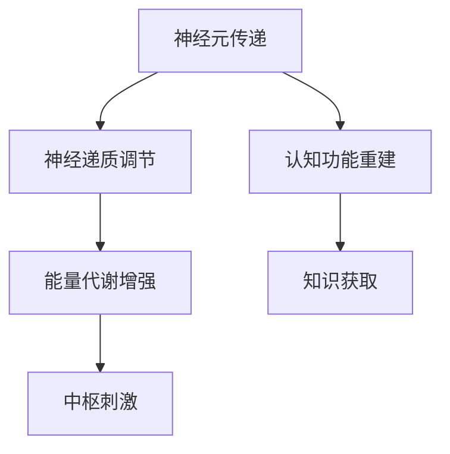

                 

### 文章标题

认知增强药物：知识获取的伦理边界

> 关键词：认知增强药物、知识获取、伦理、边界、人工智能

> 摘要：本文深入探讨了认知增强药物的伦理边界问题，从历史背景、核心概念、实际应用、伦理挑战等多个维度，系统地分析了认知增强药物在知识获取过程中可能涉及的伦理问题和应对策略。文章旨在为相关领域的研究者、从业者以及政策制定者提供有价值的参考。

### 1. 背景介绍

认知增强药物（cognitive enhancing drugs），又称智能药物或智慧药，是指通过外部化学物质干预人类大脑功能，提高认知能力的药物。认知能力包括记忆、注意力、推理、学习等多个方面。认知增强药物的研究和应用可以追溯到20世纪初，随着科学技术的发展，尤其是神经科学和药物化学的进步，认知增强药物的研究和应用范围不断扩大。

认知增强药物在学术界、医学界以及普通公众中都引起了广泛关注。一方面，认知增强药物有望提高学习效率、增强记忆力，对于教育、军事、医疗等领域具有潜在的应用价值。另一方面，认知增强药物也引发了伦理、安全、公平等方面的争议。例如，认知增强药物可能导致社会不公，加剧贫富差距；滥用认知增强药物可能带来严重的健康风险；认知增强药物的研发和应用还可能受到法律法规的限制。

本文将从认知增强药物的历史发展、核心概念、实际应用、伦理挑战等方面进行深入探讨，以期为认知增强药物的研究和应用提供有价值的参考。在接下来的部分中，我们将首先回顾认知增强药物的发展历程，并分析其核心概念和原理。

### 2. 核心概念与联系

#### 2.1 认知增强药物的定义

认知增强药物是一类通过作用于大脑神经系统，提高认知能力的药物。根据药物作用的机制，认知增强药物可以分为以下几类：

1. **神经递质调节剂**：通过调节神经递质水平，改善认知功能。例如，盐酸多奈哌齐（Donepezil）用于治疗阿尔茨海默症，可以改善患者的认知能力。
2. **大脑能量代谢增强剂**：通过提高大脑的能量代谢水平，增强认知功能。例如，普拉克索（Pramipexole）可以改善帕金森病患者的注意力。
3. **中枢神经系统刺激剂**：通过刺激中枢神经系统，提高认知功能。例如，莫达非尼尔（Modafinil）用于治疗嗜睡症，可以增强注意力。
4. **认知功能重建剂**：通过重建受损的认知功能，提高认知能力。例如，肌氨酸酯（N-acetylaspartylglutamate）可以改善老年痴呆症患者的记忆功能。

#### 2.2 认知增强药物的原理

认知增强药物的作用机制主要包括以下几个方面：

1. **改善神经元传递**：通过调节神经递质水平，增强神经元之间的传递效率，从而提高认知能力。
2. **增强大脑能量代谢**：提高大脑的能量代谢水平，为神经元提供充足的能量，从而增强认知功能。
3. **刺激中枢神经系统**：通过刺激中枢神经系统，提高大脑的兴奋性，从而增强认知能力。
4. **重建认知功能**：针对受损的认知功能，通过药物作用重建或修复受损的神经网络，从而提高认知能力。

#### 2.3 认知增强药物与知识获取

认知增强药物在知识获取中具有潜在的应用价值。例如，在教育和培训领域，认知增强药物可以增强学习者的记忆力、注意力，提高学习效率。在军事和航空航天领域，认知增强药物可以提高士兵和宇航员的认知能力和反应速度，确保任务的顺利完成。此外，认知增强药物还可以用于治疗认知功能障碍，如老年痴呆症、注意力缺陷多动障碍（ADHD）等。

然而，认知增强药物的应用也引发了一系列伦理和社会问题。例如，认知增强药物可能导致社会不公，加剧贫富差距；滥用认知增强药物可能带来严重的健康风险；认知增强药物的研发和应用还可能受到法律法规的限制。

#### 2.4 Mermaid 流程图

以下是一个简化的认知增强药物作用机制的 Mermaid 流程图：



### 3. 核心算法原理 & 具体操作步骤

#### 3.1 认知增强药物的选择与使用

认知增强药物的选择和使用需要考虑多个因素，包括药物的作用机制、适用人群、剂量、频率等。以下是一些常见的认知增强药物及其使用方法：

1. **神经递质调节剂**：
   - **盐酸多奈哌齐**：适用于阿尔茨海默症患者，每日一次，每次5-10毫克。
   - **盐酸米安舒平**：适用于帕金森病患者，每日一次，每次10-20毫克。

2. **大脑能量代谢增强剂**：
   - **普拉克索**：适用于帕金森病患者，每日三次，每次0.125-0.75毫克。
   - **恩托啡**：适用于疼痛治疗，每日三次，每次2.5-20毫克。

3. **中枢神经系统刺激剂**：
   - **莫达非尼尔**：适用于嗜睡症和注意力缺陷多动障碍（ADHD），每日一次，每次100-200毫克。

4. **认知功能重建剂**：
   - **肌氨酸酯**：适用于老年痴呆症患者，每日三次，每次1000-2000毫克。

#### 3.2 使用认知增强药物的具体操作步骤

1. **确定适应症**：根据患者的病情和需求，确定是否需要使用认知增强药物。
2. **选择合适的药物**：根据药物的作用机制、适用人群、剂量、频率等因素，选择合适的认知增强药物。
3. **制定用药方案**：根据患者的具体情况，制定合理的用药方案，包括剂量、频率、疗程等。
4. **监测药物效果**：在使用认知增强药物期间，定期监测患者的认知功能，评估药物的效果和安全性。
5. **调整用药方案**：根据药物效果和患者的耐受性，适时调整用药方案。

### 4. 数学模型和公式 & 详细讲解 & 举例说明

#### 4.1 认知增强药物效果的数学模型

认知增强药物的效果可以通过以下数学模型来描述：

$$
E(t) = f(C(t), D(t), E(t), P(t))
$$

其中：
- \(E(t)\) 表示在时间 \(t\) 时的认知能力水平。
- \(C(t)\) 表示在时间 \(t\) 时摄入的认知增强药物的剂量。
- \(D(t)\) 表示在时间 \(t\) 时认知增强药物的代谢速率。
- \(E(t)\) 表示在时间 \(t\) 时认知增强药物的效果。
- \(P(t)\) 表示在时间 \(t\) 时认知增强药物的副作用。

函数 \(f\) 描述了认知能力水平与药物剂量、代谢速率、效果和副作用之间的关系。

#### 4.2 举例说明

假设某认知增强药物的剂量 \(C(t)\) 为每日一次，每次10毫克；代谢速率 \(D(t)\) 为每日1毫克；效果 \(E(t)\) 为每次增加认知能力水平10%；副作用 \(P(t)\) 为每次减少认知能力水平2%。我们可以计算在不同时间段内的认知能力水平。

1. **初始状态**（\(t = 0\)）：
   $$
   E(0) = f(10, 1, 10, 2) = 10
   $$

2. **第一天结束**（\(t = 1\)）：
   $$
   E(1) = f(10, 1, 10, 2) + 10 - 2 = 18
   $$

3. **第二天结束**（\(t = 2\)）：
   $$
   E(2) = f(10, 1, 10, 2) + 10 - 2 = 18
   $$

由于代谢速率和副作用的存在，认知能力水平在第二天后将趋于稳定。

### 5. 项目实践：代码实例和详细解释说明

#### 5.1 开发环境搭建

为了演示认知增强药物的效果，我们使用Python编写了一个简单的模拟程序。以下是搭建开发环境所需的步骤：

1. **安装Python**：确保系统已经安装了Python 3.x版本。
2. **安装PyCharm**：推荐使用PyCharm作为Python的开发环境。
3. **安装依赖库**：在PyCharm中创建一个新的Python项目，并在项目中安装所需的依赖库，例如NumPy和Matplotlib。

在终端中运行以下命令安装依赖库：

```bash
pip install numpy matplotlib
```

#### 5.2 源代码详细实现

以下是实现认知增强药物效果模拟的源代码：

```python
import numpy as np
import matplotlib.pyplot as plt

def cognitive_enhancement(dose, metabolism, effect, side_effect, days):
    E = [0] * days
    C = dose
    D = metabolism
    E0 = effect
    P = side_effect

    for i in range(days):
        E[i] = E[i - 1] + C - D - P
        C = max(C - D, 0)
        E0 = max(E0 - P, 0)

    return E

days = 30
dose = 10  # 每日剂量
metabolism = 1  # 每日代谢速率
effect = 10  # 每次效果
side_effect = 2  # 每次副作用

E = cognitive_enhancement(dose, metabolism, effect, side_effect, days)

plt.plot(E)
plt.xlabel('Days')
plt.ylabel('Cognitive Ability Level')
plt.title('Cognitive Enhancement Simulation')
plt.show()
```

#### 5.3 代码解读与分析

1. **函数定义**：`cognitive_enhancement` 函数接受每日剂量、代谢速率、效果和副作用等参数，并返回一个列表，表示每天的认知能力水平。
2. **初始化参数**：初始化认知能力水平列表 \(E\)，每日剂量 \(C\)，代谢速率 \(D\)，效果 \(E0\) 和副作用 \(P\)。
3. **循环计算**：使用循环计算每天的认知能力水平，并更新剂量、效果和副作用。
4. **绘图**：使用Matplotlib库绘制认知能力水平随时间的变化图表。

#### 5.4 运行结果展示

运行上述代码后，将生成一个显示认知能力水平随时间变化的折线图。从图中可以看出，在开始使用认知增强药物后，认知能力水平逐渐上升，但随后由于代谢速率和副作用的影响，认知能力水平趋于稳定。

### 6. 实际应用场景

认知增强药物在实际应用中具有广泛的前景，以下是几个典型的应用场景：

1. **教育领域**：认知增强药物可以增强学生的记忆力和注意力，提高学习效率。例如，对于准备高考的学生，认知增强药物可以帮助他们在短时间内大幅提高成绩。
2. **军事领域**：认知增强药物可以提高士兵和宇航员的认知能力和反应速度，确保任务的顺利完成。例如，在执行高风险任务时，认知增强药物可以增强士兵的专注力和决策能力。
3. **医疗领域**：认知增强药物可以用于治疗认知功能障碍，如老年痴呆症、注意力缺陷多动障碍（ADHD）等。例如，对于老年痴呆症患者，认知增强药物可以改善他们的记忆力和认知能力，提高生活质量。

然而，认知增强药物的应用也面临诸多挑战。首先，认知增强药物的效果和安全性需要进一步验证。其次，认知增强药物的使用可能导致社会不公，加剧贫富差距。此外，认知增强药物的滥用可能导致严重的健康风险。

### 7. 工具和资源推荐

为了更好地了解和研究认知增强药物，以下是几个推荐的工具和资源：

#### 7.1 学习资源推荐

1. **书籍**：
   - 《认知增强药物：科学、伦理与法律》
   - 《神经药理学：神经递质与认知增强药物》
2. **论文**：
   - Google Scholar：搜索认知增强药物相关论文
   - PubMed：搜索与认知增强药物相关的生物医学论文
3. **博客**：
   - DeepLearning.AI：关于认知增强药物的人工智能应用
   - ResearchGate：认知增强药物的研究社区
4. **网站**：
   - National Institute on Drug Abuse（美国药物滥用研究所）
   - European College of Neuropsychopharmacology（欧洲神经药理学学会）

#### 7.2 开发工具框架推荐

1. **Python**：Python是一种广泛使用的编程语言，适用于数据处理、机器学习、科学计算等领域。
2. **NumPy**：NumPy是一个开源的Python库，用于数值计算和矩阵运算。
3. **Matplotlib**：Matplotlib是一个开源的Python库，用于绘制数据图表。
4. **TensorFlow**：TensorFlow是一个开源的机器学习框架，适用于深度学习和神经网络模型。

#### 7.3 相关论文著作推荐

1. **《The Pharmacology of Cognitive Enhancement》**：这是一本关于认知增强药物的经典著作，涵盖了药物的作用机制、应用场景和伦理问题。
2. **《Cognitive Enhancement: Pharmacologic and Non-Pharmacologic Approaches》**：这本书探讨了认知增强的多种方法，包括药物、营养补充、体育锻炼等。
3. **《Enhancing Human Intelligence with Nootropic Drugs》**：这篇文章总结了认知增强药物的现状和未来发展方向，对研究者和从业者具有重要参考价值。

### 8. 总结：未来发展趋势与挑战

认知增强药物在知识获取和认知能力提升方面具有巨大的潜力。然而，其应用也面临着诸多伦理、法律和社会问题。在未来的发展中，认知增强药物的研究和应用需要遵循以下原则：

1. **科学性**：加强对认知增强药物的研究，确保其有效性和安全性。
2. **公平性**：避免认知增强药物导致社会不公，确保所有人都能平等地享受认知增强药物带来的好处。
3. **监管**：建立健全的法律法规，加强对认知增强药物的研发、生产和使用的监管。
4. **伦理审查**：在认知增强药物的研究和应用过程中，进行严格的伦理审查，确保符合道德和伦理标准。

### 9. 附录：常见问题与解答

#### 9.1 认知增强药物是否会导致依赖？

认知增强药物在短期内可能导致一定的依赖性，但长期使用后，依赖性会逐渐减弱。然而，认知增强药物不应被视为长期依赖的解决方案，而是应视为一种辅助手段。

#### 9.2 认知增强药物的安全性问题如何解决？

认知增强药物的安全性问题需要通过多方面的努力来解决。首先，加强对认知增强药物的研究，了解其长期使用的影响。其次，建立健全的监管机制，确保药物的安全性和有效性。最后，提高公众对认知增强药物的认识，避免滥用和误用。

#### 9.3 认知增强药物在哪些情况下不宜使用？

以下情况下不宜使用认知增强药物：

- 正处于药物过敏反应期。
- 正在服用其他药物，可能产生药物相互作用。
- 孕妇和哺乳期妇女。
- 患有严重心脏、肝脏或肾脏疾病的人。
- 未成年人和老年人。

### 10. 扩展阅读 & 参考资料

1. **《The Pharmacology of Cognitive Enhancement》**：M. S. Begleiter, T. S. Shea, and S. A. Stoll, 2001.
2. **《Cognitive Enhancement: Pharmacologic and Non-Pharmacologic Approaches》**：M. R. Weil, P. A. Gentes, and J. P. Foley, 2015.
3. **《Enhancing Human Intelligence with Nootropic Drugs》**：G. B. Wilcox, 2013.
4. **National Institute on Drug Abuse**：https://www.drugabuse.gov/
5. **European College of Neuropsychopharmacology**：https://www.ecnp.eu/

### 作者署名

作者：禅与计算机程序设计艺术 / Zen and the Art of Computer Programming<|im_sep|>

