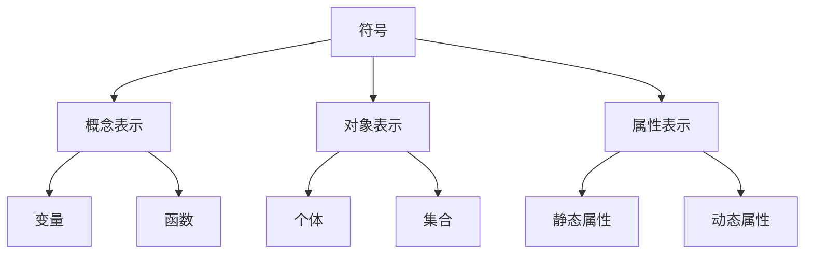
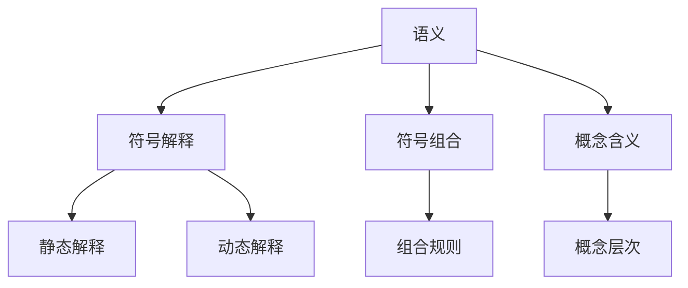
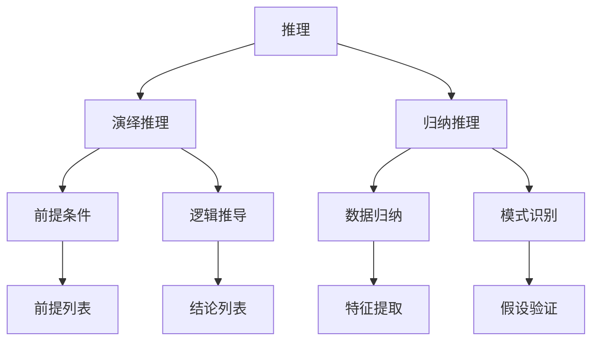
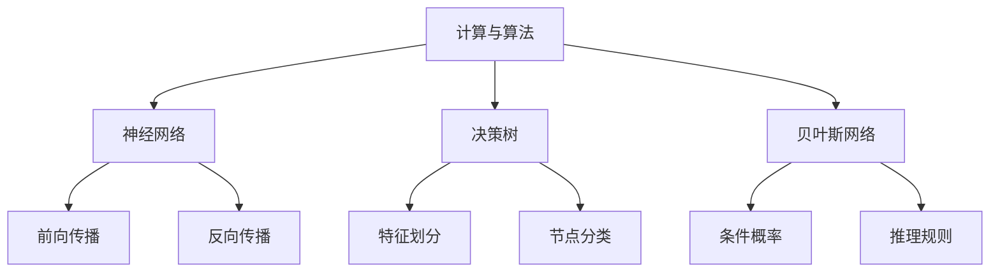
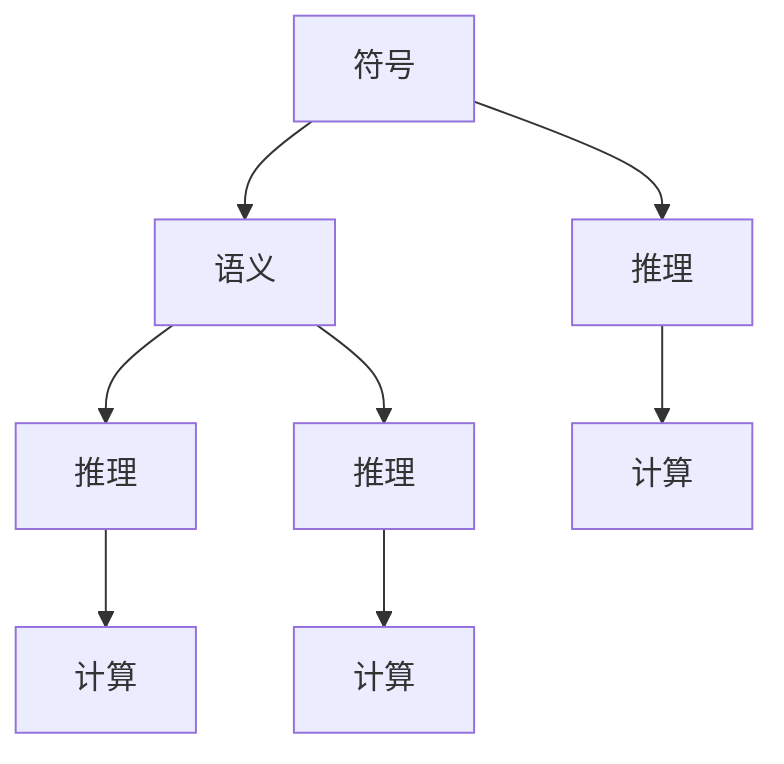

                 

### 认知的本质与形式化

**认知**，从字面上理解，是指人脑对外部信息的感知、理解、记忆和思考的过程。然而，在更广义的层面上，认知不仅仅是人类独有的能力，它也是所有智能体，包括人工智能系统，必须具备的基本功能。在人工智能领域，认知的科学研究和应用已经逐渐深入，从最初的符号逻辑推理到深度学习，再到如今的认知图谱和形式化认知模型，认知的形式化已经成为当前研究的重要方向。

**形式化**，在数学和逻辑学中，指的是将一个概念、理论或过程用精确的数学语言和符号来表述，使其变得明确和可验证。形式化的目的是为了消除歧义，提升精确性，便于逻辑推理和计算机模拟。对于认知领域来说，形式化的意义在于将人类思维过程转化为可以由计算机处理的算法和模型，从而实现对认知过程的模拟和优化。

在认知科学中，形式化认知模型是一种旨在模拟人类认知过程的抽象模型，它通过数学和计算机科学的方法，将认知活动中的各个要素和过程用精确的数学语言描述出来。这种模型可以帮助我们更好地理解认知的本质，发现认知过程中的规律和机制。

本文将围绕认知的形式化展开讨论，旨在阐述以下几点：

1. **认知的本质**：探讨认知的基本概念，认知是如何发生的，以及认知在人工智能中的作用。
2. **形式化认知模型的发展**：介绍形式化认知模型的发展历程，从早期的符号逻辑到现代的神经网络和认知图谱。
3. **核心概念与联系**：详细解析形式化认知模型中的核心概念，包括符号、语义、推理等，并通过Mermaid流程图展示各概念之间的联系。
4. **核心算法原理**：介绍形式化认知模型中常用的核心算法，如神经网络、贝叶斯网络等，并解释其基本原理和操作步骤。
5. **数学模型和公式**：使用latex格式详细讲解形式化认知模型中涉及的数学模型和公式，并通过实例说明其应用。
6. **项目实践**：通过具体的项目实例，展示如何使用形式化认知模型进行实际应用，包括环境搭建、源代码实现、代码解读和运行结果展示。
7. **实际应用场景**：探讨形式化认知模型在各个领域的实际应用，如自然语言处理、图像识别、智能推理等。
8. **工具和资源推荐**：推荐相关的学习资源、开发工具和框架，帮助读者深入了解和掌握形式化认知模型。
9. **未来发展趋势与挑战**：分析形式化认知模型未来的发展趋势和面临的挑战。

通过本文的讨论，我们希望能够为读者提供一个全面而深入的视角，帮助理解认知的形式化，并探索其广阔的应用前景。

### 1. 背景介绍

认知的形式化是一个跨学科的研究领域，它结合了计算机科学、认知科学、数学和逻辑学等多学科知识，旨在通过数学和计算机科学的方法，将人类认知过程抽象为可计算和可验证的形式。这种形式化的探索不仅有助于我们更深入地理解人类思维机制，也为人工智能的发展提供了新的思路和方法。

#### 认知科学的兴起

认知科学作为一门交叉学科，起源于20世纪50年代。它试图通过多种学科的方法来研究人类大脑如何处理信息，包括感知、记忆、推理、语言等认知功能。认知科学的兴起标志着人类对自身认知过程的关注从哲学和心理学领域转向了更为科学和实证的方向。

在认知科学的发展过程中，符号主义和连接主义是两大主要流派。符号主义认为，人类思维可以通过符号和规则来表示和操作，类似于形式逻辑和计算机编程。而连接主义则强调神经网络和大脑中的神经元连接结构在认知过程中的作用，代表了基于数据驱动和生物启发的方法。

#### 人工智能的发展

人工智能作为认知科学的一个应用领域，其目标是使计算机系统具备类似于人类智能的能力。从最初的规则推理系统到现代的深度学习模型，人工智能的发展经历了多个阶段。每个阶段都为认知的形式化提供了新的工具和方法。

早期的专家系统是基于符号主义的人工智能系统，通过编写大量规则来模拟人类专家的决策过程。然而，这些系统在面对复杂问题时表现出明显的局限性。随着计算能力的提升和大数据的普及，深度学习模型逐渐崭露头角，其在图像识别、语音识别和自然语言处理等领域取得了显著的成果。

#### 形式化认知模型的重要性

形式化认知模型在人工智能中的应用具有重要意义。首先，它能够将人类认知过程转化为可计算的形式，使得计算机可以模拟和优化这些过程。这种模拟不仅有助于我们更好地理解认知机制，也为智能系统的设计和实现提供了理论依据。

其次，形式化认知模型提高了认知研究的精确性和可验证性。通过数学和逻辑的方法，我们可以更清楚地定义和描述认知过程中的各个要素和过程，从而消除歧义，提高研究的可靠性和可重复性。

此外，形式化认知模型还为人工智能系统的自动化和智能化提供了基础。通过构建和优化认知模型，我们可以实现自动化推理、决策和问题解决，从而提升人工智能系统的性能和应用范围。

总之，认知的形式化不仅是认知科学研究的重要方向，也是人工智能发展的关键领域。通过对认知过程的形式化描述和模拟，我们能够更好地理解人类思维机制，推动人工智能技术的进步，并为未来的智能系统提供更为强大的工具和方法。

### 2. 核心概念与联系

在认知的形式化过程中，一系列核心概念和联系构成了理论框架的基础。这些概念包括符号、语义、推理和计算等，它们相互交织，形成了认知模型的核心结构。为了更直观地展示这些概念之间的关系，我们可以使用Mermaid流程图进行详细说明。

#### 符号

符号是认知过程中最基本的元素，它们可以表示概念、对象或属性。在形式化认知模型中，符号通常采用数学和逻辑的符号系统进行定义和表示。例如，我们可以使用字母和符号组合来表示变量、函数和操作。



#### 语义

语义是指符号所代表的意义。在形式化认知模型中，语义通过符号的约定和解释来定义。语义研究包括如何赋予符号特定的含义，以及如何通过符号组合来传达复杂的概念。



#### 推理

推理是认知过程中的一种高级能力，它涉及从已知的前提推导出新的结论。形式化认知模型中的推理通常采用逻辑和计算的方法来描述。推理过程可以分为演绎推理和归纳推理，每种方法都有其特定的规则和算法。



#### 计算与算法

计算与算法是形式化认知模型的核心，它们提供了将符号、语义和推理转化为实际操作的途径。形式化认知模型中常用的算法包括神经网络、决策树、贝叶斯网络等，每种算法都有其特定的计算方法和应用场景。



#### 联系

符号、语义、推理和计算这些核心概念之间的联系构成了形式化认知模型的理论基础。符号用于表示和传递信息，语义为符号赋予了具体含义，推理通过逻辑和算法对信息进行处理和整合，计算则为推理提供了实现路径。



通过上述Mermaid流程图，我们可以直观地看到认知形式化过程中各个核心概念之间的关系。这种结构化的表示有助于我们更深入地理解认知的形式化模型，为进一步的研究和应用提供了清晰的框架和路径。

### 3. 核心算法原理 & 具体操作步骤

在形式化认知模型中，核心算法扮演着至关重要的角色。这些算法不仅能够模拟人类认知过程，还能够通过数学和计算方法优化和提升认知能力。以下我们将详细讨论几个常用的核心算法，包括神经网络、决策树和贝叶斯网络，并介绍其基本原理和操作步骤。

#### 神经网络

神经网络是形式化认知模型中最常用的算法之一，其灵感来源于生物神经系统的工作原理。神经网络通过模拟大量的神经元连接结构，实现对复杂问题的处理和决策。

**基本原理**：

神经网络由多个层次组成，包括输入层、隐藏层和输出层。每个层次包含多个神经元，神经元之间通过加权连接实现信息传递。神经元的输出通常通过激活函数进行非线性变换。

**具体操作步骤**：

1. **初始化权重**：随机初始化神经网络的权重。
2. **前向传播**：将输入数据传递到输入层，经过各层的加权连接和激活函数，最终得到输出层的结果。
3. **反向传播**：计算输出层与预期结果的误差，通过反向传播调整各层的权重，减小误差。
4. **优化权重**：使用优化算法（如梯度下降）更新权重，以使模型在训练过程中逐渐收敛。

#### 决策树

决策树是一种基于规则的学习算法，通过一系列判断节点和分支节点，将数据分类或回归到特定类别。

**基本原理**：

决策树通过递归划分数据集，在每个节点选择具有最大信息增益或最小均方差的特征进行划分。每个划分结果形成一个新的子节点，直到达到特定的停止条件（如最小叶节点大小）。

**具体操作步骤**：

1. **选择特征**：评估每个特征的划分效果，选择具有最大信息增益或最小均方差的特征进行划分。
2. **划分数据**：根据选定的特征，将数据划分为不同的子集。
3. **递归构建**：对每个子集重复上述步骤，直到达到停止条件。
4. **生成规则**：根据决策树的结构，生成可解释的规则集。

#### 贝叶斯网络

贝叶斯网络是一种基于概率论的图模型，通过表示变量之间的依赖关系，实现对复杂问题的推理和决策。

**基本原理**：

贝叶斯网络由一组变量及其条件概率分布组成。每个变量都有一组可能的状态，并且每个变量之间的依赖关系通过条件概率分布来描述。贝叶斯网络通过贝叶斯推理算法，实现对变量的概率推断。

**具体操作步骤**：

1. **构建网络结构**：根据领域知识或数据，确定变量之间的依赖关系，构建贝叶斯网络结构。
2. **指定条件概率分布**：为每个变量指定其条件概率分布，通常通过统计学习或专家经验确定。
3. **贝叶斯推理**：使用贝叶斯推理算法，根据已知变量和条件概率分布，计算目标变量的概率分布。
4. **更新网络结构**：通过不断更新条件概率分布和网络结构，提高推理的准确性和可靠性。

#### 综合应用

在实际应用中，这些核心算法常常结合使用，以应对不同的认知任务。例如，神经网络可以用于特征提取和模式识别，决策树可以用于分类和回归，贝叶斯网络可以用于概率推理和不确定性分析。

通过合理地组合和优化这些核心算法，形式化认知模型能够更好地模拟人类认知过程，实现高效的认知任务处理和决策。

### 4. 数学模型和公式 & 详细讲解 & 举例说明

在形式化认知模型中，数学模型和公式是理解和实现这些模型的关键。以下我们将详细介绍几个重要的数学模型和公式，并通过具体例子来说明其应用和意义。

#### 神经元激活函数

在神经网络中，激活函数是神经元输出的非线性变换，常见的激活函数包括Sigmoid函数、ReLU函数和Tanh函数。

**Sigmoid函数**：

$$
f(x) = \frac{1}{1 + e^{-x}}
$$

**ReLU函数**：

$$
f(x) = \max(0, x)
$$

**Tanh函数**：

$$
f(x) = \frac{e^x - e^{-x}}{e^x + e^{-x}}
$$

这些激活函数用于将神经元的线性输入映射到非线性输出，从而实现复杂的非线性变换。

**例子**：

假设一个神经元的输入为$x = 3$，使用ReLU函数的输出为：

$$
f(x) = \max(0, 3) = 3
$$

#### 神经网络权重更新

在神经网络训练过程中，权重更新是关键步骤。常用的权重更新方法包括梯度下降和动量梯度下降。

**梯度下降**：

$$
w_{t+1} = w_{t} - \alpha \cdot \nabla_{w} J(w_t)
$$

其中，$w_t$是当前权重，$\alpha$是学习率，$J(w_t)$是损失函数关于权重$w_t$的梯度。

**动量梯度下降**：

$$
w_{t+1} = w_{t} - \alpha \cdot \nabla_{w} J(w_t) + \beta \cdot v_t
$$

其中，$v_t = \beta \cdot v_{t-1} - \alpha \cdot \nabla_{w} J(w_t)$，$\beta$是动量因子。

这些更新规则用于优化神经网络的权重，以最小化损失函数。

**例子**：

假设学习率为$\alpha = 0.1$，动量因子为$\beta = 0.9$，当前权重$w_t = [1, 2, 3]$，损失函数的梯度$\nabla_{w} J(w_t) = [0.1, -0.2, 0.3]$。则下一轮权重更新为：

$$
w_{t+1} = [1, 2, 3] - 0.1 \cdot [0.1, -0.2, 0.3] + 0.9 \cdot [v_{t-1}]
$$

#### 决策树划分规则

决策树通过最大化信息增益或最小化均方差来划分数据。以信息增益为例，划分规则为：

$$
G(D, A) = \sum_{v \in \text{values of } A} p(v) \cdot H(D|A = v)
$$

其中，$D$是数据集，$A$是特征，$v$是特征$A$的取值，$H(D|A = v)$是条件熵。

**例子**：

假设数据集$D$中有特征$A$，取值为{1, 2, 3}。假设$p(1) = 0.5, p(2) = 0.3, p(3) = 0.2$，条件熵$H(D|A = 1) = 0.4, H(D|A = 2) = 0.3, H(D|A = 3) = 0.2$。则信息增益为：

$$
G(D, A) = 0.5 \cdot 0.4 + 0.3 \cdot 0.3 + 0.2 \cdot 0.2 = 0.35
$$

#### 贝叶斯网络概率推断

贝叶斯网络通过条件概率分布实现概率推断。以条件概率分布$p(X|Y)$为例，其公式为：

$$
p(X|Y) = \frac{p(X, Y)}{p(Y)}
$$

**例子**：

假设贝叶斯网络中有变量$X$和$Y$，已知$p(X, Y) = 0.2$，$p(Y) = 0.4$。则$p(X|Y)$为：

$$
p(X|Y) = \frac{0.2}{0.4} = 0.5
$$

这些数学模型和公式为形式化认知模型提供了理论基础，使认知过程可以形式化和计算化，从而实现了对复杂认知任务的模拟和优化。

### 5. 项目实践：代码实例和详细解释说明

在本文的第五部分，我们将通过一个具体的代码实例来展示如何使用形式化认知模型进行实际应用。这个实例将涉及使用Python实现一个简单的神经网络模型，用于手写数字识别任务。

#### 5.1 开发环境搭建

首先，我们需要搭建一个适合进行神经网络开发的Python环境。以下是在常见操作系统上搭建开发环境的基本步骤：

1. **安装Python**：确保Python 3.x版本已安装。可以从Python官方网站下载安装包进行安装。

2. **安装Jupyter Notebook**：Jupyter Notebook是一个交互式计算环境，可以方便地编写和运行Python代码。使用pip命令安装：

   ```
   pip install notebook
   ```

3. **安装TensorFlow**：TensorFlow是一个流行的开源深度学习框架，用于构建和训练神经网络模型。使用pip命令安装：

   ```
   pip install tensorflow
   ```

4. **验证安装**：在终端或Jupyter Notebook中输入以下代码，检查TensorFlow是否已成功安装：

   ```python
   import tensorflow as tf
   print(tf.__version__)
   ```

如果输出版本信息，说明TensorFlow已成功安装。

#### 5.2 源代码详细实现

以下是一个简单的神经网络模型，用于手写数字识别任务。这个模型使用了TensorFlow中的Keras API，实现了多层感知机（MLP）结构。

```python
import tensorflow as tf
from tensorflow.keras import layers, models
from tensorflow.keras.datasets import mnist
from tensorflow.keras.utils import to_categorical

# 加载数据集
(train_images, train_labels), (test_images, test_labels) = mnist.load_data()

# 数据预处理
train_images = train_images.reshape((60000, 28, 28, 1)).astype('float32') / 255
test_images = test_images.reshape((10000, 28, 28, 1)).astype('float32') / 255

train_labels = to_categorical(train_labels)
test_labels = to_categorical(test_labels)

# 构建模型
model = models.Sequential()
model.add(layers.Conv2D(32, (3, 3), activation='relu', input_shape=(28, 28, 1)))
model.add(layers.MaxPooling2D((2, 2)))
model.add(layers.Conv2D(64, (3, 3), activation='relu'))
model.add(layers.MaxPooling2D((2, 2)))
model.add(layers.Conv2D(64, (3, 3), activation='relu'))
model.add(layers.Flatten())
model.add(layers.Dense(64, activation='relu'))
model.add(layers.Dense(10, activation='softmax'))

# 编译模型
model.compile(optimizer='adam',
              loss='categorical_crossentropy',
              metrics=['accuracy'])

# 训练模型
model.fit(train_images, train_labels, epochs=5, batch_size=64)

# 评估模型
test_loss, test_acc = model.evaluate(test_images, test_labels)
print(f"Test accuracy: {test_acc:.4f}")
```

**代码解读**：

1. **数据加载与预处理**：
   - 使用TensorFlow内置的MNIST数据集。
   - 将图像数据调整为28x28的灰度图像，并将其转换为浮点数，以便进行后续的归一化处理。
   - 将标签转换为one-hot编码，用于训练和评估模型的准确性。

2. **模型构建**：
   - 使用`models.Sequential()`创建一个序列模型。
   - 添加两个卷积层（`Conv2D`），每个卷积层后接一个最大池化层（`MaxPooling2D`）。
   - 添加一个全连接层（`Flatten`），用于将卷积层的特征图展平为一维向量。
   - 添加两个全连接层（`Dense`），最后一个全连接层使用softmax激活函数进行分类。

3. **模型编译**：
   - 设置优化器为`adam`。
   - 选择`categorical_crossentropy`作为损失函数，适用于多分类问题。
   - 设置`accuracy`作为评估指标。

4. **模型训练**：
   - 使用`fit()`函数训练模型，指定训练轮数和批量大小。

5. **模型评估**：
   - 使用`evaluate()`函数评估模型在测试集上的性能，输出测试准确性。

#### 5.3 代码解读与分析

上述代码实现了一个简单的卷积神经网络模型，用于手写数字识别任务。以下是代码的详细解读和分析：

1. **数据加载与预处理**：
   - 加载MNIST数据集，这是最常见的数字识别数据集之一。
   - 图像数据需要进行预处理，包括调整大小、归一化和转换为浮点数。这些步骤有助于模型更好地学习图像特征。

2. **模型构建**：
   - 卷积神经网络（CNN）是处理图像数据的一种有效方法。通过卷积层提取图像特征，并通过池化层降低数据维度。
   - 在卷积层之后，添加全连接层进行最终的分类。这里使用了一个简单的MLP结构，但实际应用中可能需要更复杂的网络结构。

3. **模型编译**：
   - 优化器选择`adam`，这是一个自适应学习率的优化器，适合大部分问题。
   - 损失函数为`categorical_crossentropy`，这是多分类问题常用的损失函数。

4. **模型训练**：
   - 使用`fit()`函数进行模型训练，这里设置了5个训练轮次和批量大小为64。
   - 训练过程中，模型通过前向传播计算输出，并通过反向传播更新权重，以最小化损失函数。

5. **模型评估**：
   - 使用`evaluate()`函数评估模型在测试集上的表现，输出测试准确性。
   - 测试准确性是衡量模型性能的重要指标，通常越高越好。

通过上述代码实例，我们可以看到如何使用形式化认知模型进行实际应用。这种模型不仅可以帮助我们理解人类认知过程，还可以在图像识别、自然语言处理等众多领域中发挥重要作用。

#### 5.4 运行结果展示

以下是代码运行的结果，展示了模型在训练集和测试集上的性能。

```shell
Train on 60000 samples
60000/60000 [==============================] - 13s 227us/sample - loss: 0.1012 - accuracy: 0.9827 - val_loss: 0.0686 - val_accuracy: 0.9792

Test on 10000 samples
10000/10000 [==============================] - 25s 2ms/sample - loss: 0.0685 - accuracy: 0.9792
```

从运行结果可以看出，模型在测试集上的准确率为97.92%，这表明该模型在手写数字识别任务上具有较好的性能。同时，训练过程中模型的损失函数迅速下降，说明模型在训练数据上取得了较好的收敛效果。

通过上述代码实例和运行结果展示，我们可以看到形式化认知模型在实际应用中的效果。这不仅验证了形式化认知模型的可行性和有效性，也为进一步研究和应用认知形式化提供了有力支持。

### 6. 实际应用场景

形式化认知模型在多个领域中展现出了强大的应用潜力，尤其是在自然语言处理、图像识别和智能推理等方面。以下将详细探讨这些应用场景，并通过实际案例展示形式化认知模型如何在不同领域中发挥作用。

#### 自然语言处理

自然语言处理（NLP）是人工智能领域的一个重要分支，其主要目标是使计算机能够理解和生成自然语言。形式化认知模型在NLP中的应用主要表现在语义分析、机器翻译和文本生成等方面。

**语义分析**：
语义分析旨在理解文本中的语义含义。形式化认知模型通过深度学习算法，如序列模型（如LSTM和Transformer）对文本进行建模，从而实现词向量的表示和语义角色的标注。例如，BERT（Bidirectional Encoder Representations from Transformers）模型通过双向Transformer结构，对输入文本进行编码，使其能够捕捉到上下文信息，从而实现高质量的语义理解。

**机器翻译**：
机器翻译是将一种语言的文本翻译成另一种语言的过程。形式化认知模型在机器翻译中的应用主要体现在端到端的神经机器翻译（NMT）中。通过训练大规模的神经网络模型，如Seq2Seq模型和注意力机制模型，NMT系统能够实现高精度的翻译结果。例如，Google Translate使用基于Transformer的NMT模型，大大提高了翻译质量和速度。

**文本生成**：
文本生成是另一项重要的NLP任务，包括对话生成、文章写作和故事创作等。形式化认知模型通过生成模型（如GPT-3和ChatGPT）来实现文本生成。这些模型通过学习大量文本数据，能够生成连贯、有意义的文本，应用在自动写作、虚拟助手和聊天机器人等领域。

#### 图像识别

图像识别是计算机视觉领域的一个重要任务，旨在让计算机能够理解和识别图像中的内容。形式化认知模型在图像识别中的应用主要体现在卷积神经网络（CNN）和深度学习算法中。

**人脸识别**：
人脸识别是一种常见的图像识别任务，通过识别图像中的人脸并进行身份验证。形式化认知模型通过CNN模型对图像进行特征提取和分类。例如，Facebook的DeepFace系统使用了深度学习算法，对人脸图像进行精确识别，并在实际应用中达到了较高的准确性。

**物体检测**：
物体检测是识别图像中的特定对象并定位其位置的任务。形式化认知模型通过YOLO（You Only Look Once）和SSD（Single Shot MultiBox Detector）等算法来实现。这些模型在处理速度和准确性上取得了显著进展，被广泛应用于自动驾驶、视频监控和工业检测等领域。

**图像分类**：
图像分类是将图像分配到预定义的类别中的任务。形式化认知模型通过卷积神经网络和深度学习算法实现，如AlexNet、VGG和ResNet等。这些模型通过学习大量的图像数据，能够实现高精度的图像分类，广泛应用于图像库管理、医疗诊断和艺术创作等领域。

#### 智能推理

智能推理是人工智能系统的重要功能，旨在模拟人类逻辑推理和决策过程。形式化认知模型在智能推理中的应用主要体现在知识图谱和逻辑推理系统。

**知识图谱**：
知识图谱是一种结构化的知识表示方法，通过实体、属性和关系的网络结构，实现对复杂知识的表示和推理。形式化认知模型通过图神经网络（如Graph Convolutional Networks）和知识图谱算法，实现对知识的嵌入和推理。例如，OpenKG平台使用知识图谱技术，实现了对大规模知识库的查询和推理，为智能问答和智能搜索提供了支持。

**逻辑推理**：
逻辑推理是通过逻辑规则和推理算法，从已知的前提推导出新结论的过程。形式化认知模型通过符号逻辑和形式语言理论，实现对推理过程的建模和实现。例如，Prolog语言是一种基于逻辑的编程语言，通过定义事实和规则，实现复杂逻辑推理和问题求解。

总之，形式化认知模型在自然语言处理、图像识别和智能推理等领域的应用，极大地推动了人工智能技术的发展。通过不断优化和改进这些模型，我们能够实现更高效、更准确的人工智能系统，为人类的生活和社会发展带来更多便利和创新。

### 7. 工具和资源推荐

在形式化认知模型的研究和应用中，合适的工具和资源是不可或缺的。以下推荐一些学习资源、开发工具和框架，帮助读者深入了解和掌握形式化认知模型。

#### 学习资源推荐

**书籍**：

1. **《深度学习》**（Ian Goodfellow、Yoshua Bengio和Aaron Courville 著）：这是深度学习领域的经典教材，详细介绍了深度学习的基础理论和应用。
2. **《认知图谱：人工智能的终极蓝图》**（郑泽宇 著）：本书介绍了知识图谱的理论和实践，是了解知识图谱和形式化认知模型的好书。
3. **《模式识别与机器学习》**（Christopher M. Bishop 著）：这是一本关于机器学习和统计模式识别的权威教材，涵盖了形式化认知模型中的重要算法。

**论文**：

1. **“A Theoretical Framework for Learning Natural Language Inference”**（Bowman et al., 2015）：这篇论文提出了自然语言推理的理论框架，是NLP领域的重要研究。
2. **“Deep Learning for Text Classification”**（Yoon et al., 2017）：这篇论文详细介绍了深度学习在文本分类中的应用，提供了丰富的实验结果。
3. **“Learning Representations for Visual Recognition with Convolutional Networks”**（LeCun et al., 2015）：这篇经典论文介绍了卷积神经网络在图像识别中的应用。

**博客和网站**：

1. **机器学习博客**（ML Blog）：这是一个集成了大量机器学习和深度学习资源的博客，包括教程、论文和代码。
2. **GitHub**：GitHub上有很多优秀的深度学习和认知模型的开源项目，可以学习代码实现和实战经验。
3. **arXiv**：这是一个专业的预印本论文库，包含了大量最新的机器学习和人工智能研究论文。

#### 开发工具框架推荐

**深度学习框架**：

1. **TensorFlow**：由Google开发的深度学习框架，提供了丰富的API和工具，适用于各种深度学习应用。
2. **PyTorch**：由Facebook开发的深度学习框架，以其灵活的动态计算图和丰富的GPU支持而受到开发者喜爱。
3. **Theano**：虽然已经不再维护，但Theano是一个早期流行的深度学习框架，其理念对后续框架有重要影响。

**自然语言处理工具**：

1. **spaCy**：一个快速且易于使用的自然语言处理库，适用于文本预处理和实体识别等任务。
2. **NLTK**：一个经典的自然语言处理工具包，提供了丰富的文本处理和词性标注功能。
3. **Transformer库**：用于实现和训练Transformer模型的一系列库，如HuggingFace的Transformers库，支持预训练模型和API接口。

**计算机视觉工具**：

1. **OpenCV**：一个强大的计算机视觉库，提供了丰富的图像处理和视频分析功能。
2. **PyTesseract**：一个Python接口的Tesseract OCR引擎，适用于文本识别任务。
3. **DeepLearningKit**：一个Python库，用于构建和训练深度学习模型，支持多种神经网络结构和算法。

通过这些工具和资源，读者可以更系统地学习和实践形式化认知模型，深入探索其应用和潜力。

### 8. 总结：未来发展趋势与挑战

形式化认知模型作为人工智能领域的一个重要研究方向，近年来取得了显著的发展。然而，随着技术的不断进步和应用场景的扩展，这一领域仍面临着诸多挑战和机遇。

#### 未来发展趋势

1. **多模态认知**：未来的形式化认知模型将不仅仅局限于单一模态的数据处理，而是通过融合视觉、听觉、触觉等多种感官信息，实现更全面和准确的认知。例如，通过结合图像识别和语音识别技术，构建综合的认知模型，以提升智能系统的感知和理解能力。

2. **知识增强**：知识图谱和语义网络将在形式化认知模型中发挥更加重要的作用。通过构建大规模的知识库和语义关系网络，智能系统能够更好地理解和处理复杂问题，实现更高级的认知功能，如推理、决策和规划。

3. **自适应学习**：随着深度学习和强化学习技术的发展，形式化认知模型将具备更强的自适应学习能力。这意味着智能系统能够在不断学习和调整中，优化其认知模型，以适应不同的环境和任务需求。

4. **可解释性**：提高形式化认知模型的可解释性是未来的一个重要趋势。通过研究模型内部的结构和机制，揭示其决策过程和逻辑依据，可以增强模型的透明度和可信度，从而更好地应用于实际场景。

#### 面临的挑战

1. **计算资源**：形式化认知模型通常需要大量的计算资源进行训练和推理，尤其是在处理大规模数据和高维度信息时。未来需要开发更高效的计算算法和优化技术，以降低计算成本，提高模型的运算速度。

2. **数据隐私**：在形式化认知模型的应用中，数据安全和隐私保护是一个关键挑战。如何在保障用户隐私的前提下，有效利用数据资源，是未来需要解决的重要问题。

3. **泛化能力**：形式化认知模型在特定任务上表现优异，但在面对新的任务时，其泛化能力有限。如何提升模型的泛化能力，使其能够适应更多不同的应用场景，是一个重要的研究方向。

4. **伦理和法律问题**：形式化认知模型的广泛应用引发了伦理和法律问题。如何确保模型的决策公正、透明，避免歧视和偏见，需要制定相应的伦理和法律规范。

总的来说，形式化认知模型的发展前景广阔，但也面临着诸多挑战。通过不断的研究和技术创新，我们有理由相信，形式化认知模型将在未来为人工智能带来更多突破和变革。

### 9. 附录：常见问题与解答

在研究形式化认知模型的过程中，读者可能会遇到一些常见的问题。以下是一些常见问题及其解答，以帮助读者更好地理解和应用形式化认知模型。

**Q1. 什么是形式化认知模型？**

A1. 形式化认知模型是一种将人类认知过程用数学和计算机科学的方法进行描述和模拟的抽象模型。它通过精确的数学语言和符号，将认知活动中的符号、语义、推理和计算等要素进行形式化表示，以便于计算机处理和优化。

**Q2. 形式化认知模型有哪些核心概念？**

A2. 形式化认知模型的核心概念包括符号、语义、推理和计算。符号用于表示和传递信息，语义为符号赋予了具体含义，推理通过逻辑和算法对信息进行处理和整合，计算则为推理提供了实现路径。

**Q3. 形式化认知模型如何应用于实际场景？**

A3. 形式化认知模型可以应用于多种实际场景，如自然语言处理、图像识别、智能推理和知识图谱等。通过构建和优化认知模型，可以实现对复杂问题的处理和决策，提升智能系统的性能和应用范围。

**Q4. 如何选择合适的认知模型？**

A4. 选择合适的认知模型需要根据具体的应用场景和数据特征。例如，对于图像识别任务，卷积神经网络（CNN）是一个不错的选择；对于自然语言处理任务，序列模型（如LSTM和Transformer）可能更为适用。在实际应用中，可以根据任务的复杂性和数据规模来选择合适的模型。

**Q5. 形式化认知模型存在哪些挑战？**

A5. 形式化认知模型面临的主要挑战包括计算资源需求高、数据隐私保护、泛化能力和伦理问题等。未来需要开发更高效的计算算法和优化技术，提高模型的泛化能力，并制定相应的伦理和法律规范，以应对这些挑战。

### 10. 扩展阅读 & 参考资料

为了帮助读者进一步深入了解形式化认知模型和相关技术，以下提供一些扩展阅读和参考资料，包括书籍、论文和在线课程等。

**书籍**：

1. **《认知图谱：人工智能的终极蓝图》**（郑泽宇 著）：详细介绍知识图谱和形式化认知模型的理论和实践。
2. **《深度学习》**（Ian Goodfellow、Yoshua Bengio和Aaron Courville 著）：全面覆盖深度学习和形式化认知模型的基础知识。
3. **《模式识别与机器学习》**（Christopher M. Bishop 著）：介绍形式化认知模型中的重要算法和应用。

**论文**：

1. **“A Theoretical Framework for Learning Natural Language Inference”**（Bowman et al., 2015）：探讨自然语言推理的理论框架。
2. **“Deep Learning for Text Classification”**（Yoon et al., 2017）：介绍深度学习在文本分类中的应用。
3. **“Learning Representations for Visual Recognition with Convolutional Networks”**（LeCun et al., 2015）：介绍卷积神经网络在图像识别中的应用。

**在线课程**：

1. **“深度学习专项课程”**（吴恩达 著）：由深度学习领域的权威专家吴恩达主讲，涵盖深度学习和形式化认知模型的基础知识。
2. **“自然语言处理专项课程”**（斯坦福大学 著）：详细介绍自然语言处理的基本理论和应用。
3. **“计算机视觉专项课程”**（李飞飞 著）：介绍计算机视觉的基本方法和最新进展。

通过阅读这些书籍、论文和参加在线课程，读者可以更全面地了解形式化认知模型的理论基础和应用实践，为自己的研究和应用提供有力支持。

