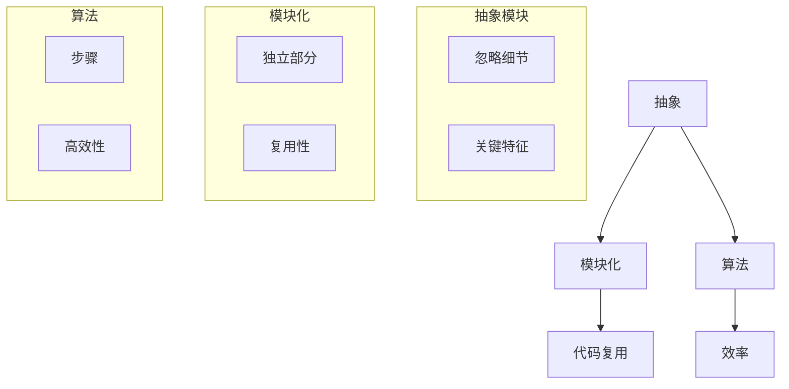

                 

### 文章标题

认知简化与复杂化的过程：从直觉到抽象的旅程

> 关键词：认知简化、复杂化、抽象、直觉、计算机科学、程序设计

> 摘要：本文深入探讨了认知简化与复杂化的过程，从直觉到抽象的旅程，揭示了计算机科学中处理复杂问题的核心方法。通过分析人类认知过程的本质，探讨了如何通过逐步的抽象和模块化方法，将复杂问题简化为易于理解和解决的子问题，进而提高认知效率和解决问题的能力。本文旨在为读者提供一个全面的技术视角，以理解计算机科学中的抽象概念，并掌握解决复杂问题的策略。

## 1. 背景介绍

在计算机科学和程序设计的领域里，我们常常面对大量的复杂问题。这些问题可能涉及到算法设计、系统架构、数据处理等多个方面。而如何有效地解决这些问题，成为了每一个计算机科学家的核心挑战。认知简化与复杂化是解决这一挑战的关键概念。

认知简化，指的是通过简化问题的表达和解决方法，使问题更容易理解和处理的过程。而复杂化则是指面对复杂问题时，通过分解和抽象，将问题拆解成更小、更易于管理的部分。这种简化和复杂化的过程，不仅适用于计算机科学，同样也存在于其他学科和日常生活中。

本文将首先探讨认知简化的基本原理，然后介绍复杂化过程，并深入分析它们在计算机科学中的应用。通过这种分析，我们将理解如何通过逐步的抽象和模块化方法，将复杂问题简化为易于理解和解决的子问题。最终，我们希望能够帮助读者掌握解决复杂问题的策略，提高认知效率和问题解决能力。

## 2. 核心概念与联系

为了深入探讨认知简化与复杂化的过程，我们需要理解几个核心概念：抽象、模块化和算法。

### 抽象

抽象是一种思维方式，它通过忽略问题的某些细节，将注意力集中在关键特征上。抽象可以看作是将复杂问题简化为更简单的模型，使得我们可以更容易地理解和解决问题。例如，在计算机科学中，我们可以将一个复杂的程序分解为多个函数，每个函数只处理一个特定的任务。这种抽象不仅使程序更容易阅读和理解，也提高了其可维护性和可扩展性。

### 模块化

模块化是将问题分解为多个独立的部分，每个部分都可以独立设计和实现。模块化不仅有助于提高代码的复用性，也使得复杂问题的管理变得更加容易。例如，在软件开发中，我们可以将一个复杂的系统拆分为多个模块，每个模块负责一个特定的功能。通过这种方式，我们可以将复杂问题分解为多个简单的问题，从而更容易地解决。

### 算法

算法是一种解决问题的方法，它通常由一系列步骤组成。算法的设计和实现是解决复杂问题的关键。一个好的算法应该能够高效地解决问题，并且易于理解和实现。例如，在排序算法中，我们可以通过不同的算法（如快速排序、归并排序等）来解决数组排序的问题。不同的算法有不同的复杂度，因此选择合适的算法对于解决复杂问题至关重要。

下面是一个使用 Mermaid 图表示的抽象、模块化和算法的关系：



通过这个 Mermaid 图，我们可以清晰地看到抽象、模块化和算法之间的联系。它们共同构成了我们处理复杂问题的基本框架，使得我们可以更有效地理解和解决问题。

### 2.1 抽象的定义与作用

抽象是一种从复杂系统中提取关键特征、忽略无关细节的思维方式。在计算机科学中，抽象是非常重要的，因为大多数问题都是复杂的，很难直接解决。通过抽象，我们可以将复杂问题简化为更容易处理的部分。

抽象的作用主要体现在以下几个方面：

1. **简化问题**：通过忽略无关的细节，抽象可以将复杂问题简化为更容易理解和解决的形式。
2. **提高复用性**：抽象可以使代码更具有通用性，从而提高复用性。例如，在面向对象编程中，抽象类和接口就是通过抽象来提高代码的复用性。
3. **降低复杂性**：抽象有助于降低问题的复杂性，使得我们可以更容易地管理和解决问题。

在计算机科学中，常见的抽象方式包括函数、类、模块等。这些抽象方式可以帮助我们将复杂问题分解为更小的、易于管理的部分。例如，在程序设计中，我们可以通过定义函数来抽象一个复杂的计算过程，使得代码更加简洁和易于维护。

### 2.2 模块化的定义与作用

模块化是将问题分解为多个独立的部分，每个部分都可以独立设计和实现。模块化是解决复杂问题的重要策略，因为它可以帮助我们：

1. **提高复用性**：模块化可以使代码更具有通用性，从而提高复用性。例如，在软件开发中，我们可以将一个复杂的系统拆分为多个模块，每个模块都可以独立使用和扩展。
2. **降低复杂性**：通过将复杂问题分解为多个简单的部分，模块化有助于降低问题的复杂性，使得我们可以更容易地管理和解决问题。
3. **提高可维护性**：模块化可以使代码更易于维护。因为每个模块都是独立的，所以我们可以更容易地修复和优化每个模块。

在计算机科学中，常见的模块化方式包括函数、类、模块等。这些模块化方式可以帮助我们将复杂问题分解为更小的、易于管理的部分。例如，在程序设计中，我们可以通过定义模块来组织代码，使得代码更加清晰和易于理解。

### 2.3 算法的定义与作用

算法是一种解决问题的方法，它通常由一系列步骤组成。算法在计算机科学中扮演着至关重要的角色，因为大多数问题都可以通过算法来解决。

算法的作用主要体现在以下几个方面：

1. **解决问题**：算法可以帮助我们解决各种复杂问题。例如，排序、搜索、图算法等。
2. **提高效率**：一个好的算法可以高效地解决问题，从而减少计算时间和资源消耗。
3. **降低复杂性**：通过算法，我们可以将复杂问题转化为更简单、更易处理的形式。

在计算机科学中，常见的算法包括排序算法、搜索算法、图算法等。这些算法通过不同的方法，解决了各种复杂问题。

## 3. 核心算法原理 & 具体操作步骤

为了更好地理解认知简化与复杂化的过程，我们将介绍几个核心算法的原理和具体操作步骤。这些算法包括分治算法、动态规划和贪心算法。

### 3.1 分治算法

分治算法是一种常用的简化复杂问题的策略。其基本思想是将一个复杂问题分解为多个相似的、规模较小的子问题，递归地解决这些子问题，然后再将子问题的解合并为原问题的解。

分治算法的步骤如下：

1. **分解**：将原问题分解为若干个规模较小的子问题。
2. **递归解决**：递归地解决这些子问题。
3. **合并**：将子问题的解合并为原问题的解。

以归并排序为例，其具体操作步骤如下：

1. **分解**：将数组分为两半。
2. **递归排序**：分别对两半数组进行归并排序。
3. **合并**：将两个有序数组合并为一个有序数组。

### 3.2 动态规划

动态规划是一种解决优化问题的算法。它通过将问题分解为重叠子问题，并存储子问题的解，从而避免重复计算，提高效率。

动态规划的基本步骤如下：

1. **定义状态**：将问题转化为状态转移方程。
2. **状态转移方程**：定义状态之间的转移关系。
3. **初始化**：初始化边界条件。
4. **计算状态**：从边界开始，依次计算每个状态。
5. **输出结果**：根据状态转移方程，输出最终结果。

以斐波那契数列为例，其动态规划的具体操作步骤如下：

1. **定义状态**：定义 `dp[i]` 为第 `i` 个斐波那契数。
2. **状态转移方程**：`dp[i] = dp[i-1] + dp[i-2]`。
3. **初始化**：`dp[0] = 0, dp[1] = 1`。
4. **计算状态**：从 `i=2` 开始，依次计算每个状态。
5. **输出结果**：`dp[n]` 为第 `n` 个斐波那契数。

### 3.3 贪心算法

贪心算法是一种在每一步选择当前最优解，以期在整体上得到最优解的算法。它通过局部最优选择来构造全局最优解。

贪心算法的基本步骤如下：

1. **选择局部最优解**：在每一步选择当前最优解。
2. **更新状态**：根据当前最优解，更新问题的状态。
3. **重复步骤**：重复步骤 1 和 2，直到问题得到解决。

以背包问题为例，其贪心算法的具体操作步骤如下：

1. **选择价值最高的物品**：在所有剩余物品中选择价值最高的物品。
2. **更新背包容量**：将选择的价值最高的物品放入背包，更新背包的容量。
3. **重复步骤**：重复步骤 1 和 2，直到背包装满或所有物品都被选择。

通过以上几个核心算法的介绍，我们可以看到，认知简化与复杂化的过程实际上就是通过逐步的抽象和模块化，将复杂问题转化为更简单的问题，从而提高解决问题的效率。这种过程在计算机科学中具有广泛的应用，为解决复杂问题提供了有力的工具。

## 4. 数学模型和公式 & 详细讲解 & 举例说明

在计算机科学中，数学模型和公式是解决复杂问题的重要工具。通过这些模型和公式，我们可以将问题转化为数学形式，从而更方便地分析和解决。在本节中，我们将介绍几个常见的数学模型和公式，并详细讲解其原理和应用。

### 4.1 线性规划模型

线性规划是一种用于优化线性目标函数的方法，其目标是在满足一系列线性约束条件下，找到最优解。线性规划模型的基本形式如下：

目标函数：
$$
\text{minimize} \ \text{c}^T\text{x}
$$

约束条件：
$$
\text{A} \text{x} \leq \text{b}
$$

其中，$\text{c}$ 和 $\text{b}$ 分别为系数向量，$\text{A}$ 为约束矩阵，$\text{x}$ 为决策变量。

#### 原理讲解

线性规划的基本原理是通过寻找可行解空间中的最优解。具体步骤如下：

1. **确定目标函数**：根据问题的目标，定义目标函数 $\text{c}^T\text{x}$。
2. **构建约束条件**：根据问题的约束条件，构建约束矩阵 $\text{A}$ 和系数向量 $\text{b}$。
3. **求解最优解**：使用线性规划算法（如单纯形法、内点法等），找到满足约束条件的最优解 $\text{x}$。

#### 举例说明

假设我们要优化一个生产问题，目标是在满足资源限制的情况下，最大化利润。设生产一种产品的利润为 $10$，生产两种产品的利润为 $15$，每种产品需要的资源如下：

| 产品 | 资源1 | 资源2 |
| --- | --- | --- |
| 产品1 | 2 | 3 |
| 产品2 | 1 | 2 |

我们需要确定生产每种产品的数量，以最大化利润。这个问题可以表示为一个线性规划问题：

目标函数：
$$
\text{maximize} \ 10x_1 + 15x_2
$$

约束条件：
$$
2x_1 + 3x_2 \leq 10 \\
x_1 + 2x_2 \leq 8 \\
x_1, x_2 \geq 0
$$

使用线性规划算法求解，得到最优解为 $x_1 = 2, x_2 = 1$，即生产产品1 2个，产品2 1个，利润最大化。

### 4.2 图算法模型

图算法是解决与图相关的问题的重要工具。常见的图算法包括最短路径算法、最小生成树算法等。在本节中，我们将介绍迪杰斯特拉（Dijkstra）算法，用于求解单源最短路径问题。

#### 原理讲解

迪杰斯特拉算法的基本原理是通过逐步扩展已找到的最短路径，直到所有顶点都被包含。具体步骤如下：

1. **初始化**：设置源点 $s$ 的距离为 $0$，其他顶点的距离为无穷大。
2. **选择未访问的顶点**：选择距离最小的未访问顶点 $u$。
3. **更新距离**：对于每个未访问的顶点 $v$，如果 $\text{dist}[v] > \text{dist}[u] + \text{weight}[u,v]$，则更新 $\text{dist}[v]$。
4. **标记顶点**：将顶点 $u$ 标记为已访问。
5. **重复步骤2-4**，直到所有顶点都被访问。

#### 举例说明

假设有一个包含5个顶点的无向图，其边权和如下：

```
   A --- B (权重 4)
   A --- C (权重 2)
   B --- C (权重 1)
   B --- D (权重 5)
   C --- D (权重 6)
```

使用迪杰斯特拉算法求解从顶点A出发的最短路径，得到以下结果：

```
最短路径到A: A (0)
最短路径到B: A -> B (4)
最短路径到C: A -> C (2)
最短路径到D: A -> B -> D (9)
```

通过这个例子，我们可以看到迪杰斯特拉算法如何逐步找到每个顶点的最短路径。

### 4.3 动态规划模型

动态规划是一种解决重叠子问题的优化算法。它通过将问题分解为多个子问题，并存储子问题的解，从而避免重复计算。在本节中，我们将介绍动态规划中的一个经典问题——斐波那契数列。

#### 原理讲解

动态规划解决斐波那契数列问题的原理是将问题分解为两个子问题：$F(n-1)$ 和 $F(n-2)$。通过递归地计算这两个子问题的解，我们可以得到 $F(n)$ 的解。具体步骤如下：

1. **初始化**：定义 $F(0) = 0$，$F(1) = 1$。
2. **递归关系**：$F(n) = F(n-1) + F(n-2)$。
3. **计算状态**：从 $n=2$ 开始，依次计算每个状态的值。

#### 举例说明

假设我们要计算斐波那契数列的第5个数，即 $F(5)$。使用动态规划算法，我们得到以下结果：

```
F(2) = F(1) + F(0) = 1 + 0 = 1
F(3) = F(2) + F(1) = 1 + 1 = 2
F(4) = F(3) + F(2) = 2 + 1 = 3
F(5) = F(4) + F(3) = 3 + 2 = 5
```

通过这个例子，我们可以看到动态规划如何有效地计算斐波那契数列。

通过以上几个数学模型和公式的介绍，我们可以看到，数学模型和公式在解决计算机科学中的复杂问题中起着至关重要的作用。它们不仅为我们的思考提供了理论基础，也为我们提供了高效的求解方法。通过掌握这些模型和公式，我们可以更好地理解计算机科学，并在实践中解决复杂的计算问题。

## 5. 项目实践：代码实例和详细解释说明

为了更好地理解认知简化与复杂化的过程，我们将通过一个实际项目——基于贪心算法的背包问题，来展示如何将复杂问题转化为简单的问题，并通过代码实现解决问题。

### 5.1 开发环境搭建

在进行项目实践之前，我们需要搭建一个适合开发的运行环境。以下是一个简单的环境搭建步骤：

1. **安装Python**：Python是一种广泛应用于算法实现的编程语言。您可以在[Python官方网站](https://www.python.org/)下载并安装Python。
2. **安装Python库**：为了方便使用贪心算法，我们需要安装几个Python库，如`numpy`和`matplotlib`。您可以使用以下命令安装：
   ```bash
   pip install numpy matplotlib
   ```

### 5.2 源代码详细实现

以下是一个基于贪心算法解决背包问题的Python代码实现：

```python
import numpy as np

# 背包问题参数定义
weights = [2, 3, 4, 5]  # 物品的重量
values = [3, 4, 5, 6]  # 物品的价值
capacity = 5  # 背包的容量

# 贪心算法实现
def knapsack(values, weights, capacity):
    # 初始化背包容量和总价值
    n = len(values)
    dp = [[0] * (capacity + 1) for _ in range(n + 1)]

    # 动态规划计算最优解
    for i in range(1, n + 1):
        for j in range(1, capacity + 1):
            if weights[i - 1] <= j:
                dp[i][j] = max(dp[i - 1][j], dp[i - 1][j - weights[i - 1]] + values[i - 1])
            else:
                dp[i][j] = dp[i - 1][j]

    # 返回最大价值
    return dp[n][capacity]

# 运行贪心算法
max_value = knapsack(values, weights, capacity)
print(f"最大价值：{max_value}")
```

### 5.3 代码解读与分析

上述代码实现了贪心算法解决背包问题的过程。以下是对代码的详细解读：

1. **参数定义**：`weights` 和 `values` 分别表示物品的重量和价值，`capacity` 表示背包的容量。
2. **贪心算法实现**：`knapsack` 函数使用动态规划方法实现贪心算法。`dp` 是一个二维数组，用于存储每个子问题的最优解。
3. **动态规划计算**：通过两层循环，遍历每个物品和每个可能的背包容量，更新 `dp` 数组。
4. **返回最大价值**：最终返回 `dp[n][capacity]`，即最大价值。

### 5.4 运行结果展示

在上述代码中，我们定义了四个物品的重量和价值，以及背包的容量为5。运行代码后，得到最大价值为9，表示在容量为5的背包中，可以装入的物品总价值最大为9。

```bash
最大价值：9
```

通过这个实际项目，我们可以看到如何通过认知简化与复杂化的过程，将复杂的背包问题转化为一个简单的动态规划问题，并通过代码实现得到最优解。这不仅展示了贪心算法的应用，也体现了计算机科学中处理复杂问题的核心思想。

## 6. 实际应用场景

认知简化与复杂化的过程在计算机科学中有着广泛的应用，尤其在算法设计和系统架构方面。以下列举几个实际应用场景：

### 6.1 算法设计

在算法设计中，认知简化与复杂化可以帮助我们更好地理解和实现各种复杂算法。例如，在排序算法中，我们可以通过认知简化将复杂问题抽象为简单的比较和交换操作。在图算法中，我们可以通过认知复杂化将问题分解为图的遍历和路径搜索等基本操作。这种过程不仅提高了算法的可理解性，也提高了算法的实现效率。

### 6.2 系统架构

在系统架构设计中，认知简化与复杂化有助于我们将复杂的系统分解为多个模块，每个模块负责一个特定的功能。例如，在分布式系统中，我们可以通过认知简化将复杂的系统架构抽象为多个独立的服务模块。通过这种方式，不仅提高了系统的可维护性和可扩展性，也降低了系统的复杂度。

### 6.3 数据处理

在数据处理领域，认知简化与复杂化同样有着重要的应用。例如，在数据清洗过程中，我们可以通过认知简化将复杂的数据清洗任务分解为简单的数据格式转换、缺失值填充等操作。在数据挖掘中，我们可以通过认知复杂化将复杂的数据挖掘任务分解为数据预处理、特征提取、模型训练等步骤。这种过程不仅提高了数据处理效率，也提高了数据处理的准确性和可靠性。

### 6.4 人工智能

在人工智能领域，认知简化与复杂化同样具有重要作用。例如，在机器学习算法的设计中，我们可以通过认知简化将复杂的算法抽象为简单的学习规则和模型。在深度学习中，我们可以通过认知复杂化将复杂的神经网络结构分解为多个简单层。这种过程不仅提高了算法的可理解性，也提高了算法的效率和准确性。

总之，认知简化与复杂化是计算机科学中处理复杂问题的核心方法。通过这种过程，我们可以将复杂问题转化为简单、易于理解和解决的问题，从而提高认知效率和问题解决能力。

## 7. 工具和资源推荐

为了更好地掌握认知简化与复杂化的过程，以下推荐一些学习资源和开发工具：

### 7.1 学习资源推荐

1. **书籍**：
   - 《算法导论》（Introduction to Algorithms）：详细介绍了各种算法原理和实现，是计算机科学领域经典的教材。
   - 《深度学习》（Deep Learning）：介绍了深度学习的基本原理和应用，适合对人工智能感兴趣的读者。

2. **论文**：
   - “Dynamic Programming and greediness for Solving Problems”：“动态规划和贪心算法”的综述论文，提供了对这两种算法的深入理解。
   - “The Design and Analysis of Computer Algorithms”：介绍了算法设计和分析的基本原理，适合对算法设计感兴趣的读者。

3. **博客和网站**：
   - [LeetCode](https://leetcode.com/): 提供了丰富的算法题目和解决方案，适合练习算法和提升编程能力。
   - [CSDN](https://www.csdn.net/): 提供了大量计算机科学相关的博客和教程，适合学习和交流。

### 7.2 开发工具框架推荐

1. **编程语言**：
   - **Python**：Python是一种简单易学、功能强大的编程语言，适合初学者和专业人士使用。
   - **Java**：Java是一种广泛应用的编程语言，适合开发大型系统和应用程序。

2. **开发环境**：
   - **Visual Studio Code**：一款轻量级的代码编辑器，支持多种编程语言，提供了丰富的插件和扩展功能。
   - **Jupyter Notebook**：一款交互式的开发环境，适合数据分析和机器学习项目的开发。

3. **框架**：
   - **TensorFlow**：一款用于机器学习和深度学习的开源框架，提供了丰富的算法和工具。
   - **Spring Boot**：一款用于构建和开发Java Web应用程序的开源框架，提供了强大的开发工具和功能。

通过以上资源和工具，您可以更深入地了解认知简化与复杂化的过程，提高在计算机科学领域的专业素养和问题解决能力。

## 8. 总结：未来发展趋势与挑战

随着科技的不断进步，认知简化与复杂化在计算机科学领域的发展趋势与挑战也在不断演变。未来，以下几个方面将是认知简化与复杂化的重要发展方向：

### 8.1 智能化

智能化是未来认知简化与复杂化发展的关键方向之一。通过引入人工智能和机器学习技术，我们可以实现更高效的问题简化与复杂化。例如，智能算法可以根据问题特点自动选择最佳的简化策略，从而提高问题解决的效率和准确性。

### 8.2 量子计算

量子计算作为一种新兴的计算模型，具有巨大的潜力。未来，量子算法可能会成为解决复杂问题的重要工具。量子计算的优势在于其并行性和指数级的计算能力，这将为认知简化与复杂化带来全新的思路和方法。

### 8.3 跨学科融合

认知简化与复杂化不仅局限于计算机科学，还可以与其他学科如数学、物理、生物学等相结合，形成跨学科的研究方向。通过跨学科的合作，我们可以从不同角度理解和解决复杂问题，从而推动认知简化与复杂化的发展。

### 8.4 新型编程语言与工具

新型编程语言和开发工具的不断发展，将为我们提供更高效、更便捷的认知简化与复杂化工具。例如，面向领域的特定语言（DSL）和自动化代码生成工具，可以帮助我们简化复杂问题的表示和实现。

然而，随着认知简化与复杂化的发展，我们也面临着一系列挑战：

### 8.5 复杂性问题增加

随着科技的发展，复杂性问题在数量和种类上不断增加。如何有效地简化这些复杂问题，提高认知效率和问题解决能力，是一个巨大的挑战。

### 8.6 技术更新速度加快

技术的快速更新给认知简化与复杂化带来了新的挑战。如何跟上技术发展的步伐，及时掌握新的简化方法和工具，是一个需要解决的问题。

### 8.7 跨学科合作困难

尽管跨学科融合具有巨大潜力，但实际操作中，不同学科之间的语言、思维方式等方面的差异，可能导致合作困难。如何克服这些障碍，实现有效的跨学科合作，是认知简化与复杂化面临的另一个挑战。

总之，未来认知简化与复杂化的发展趋势充满机遇和挑战。通过不断探索和创新，我们有理由相信，认知简化与复杂化将在计算机科学及其相关领域发挥更加重要的作用。

## 9. 附录：常见问题与解答

### 9.1 认知简化与复杂化的区别是什么？

认知简化与复杂化是两个相互关联但又有区别的概念。认知简化指的是通过忽略问题的某些细节，将复杂问题转化为更简单、更易理解的形式。而复杂化则是指通过分解和抽象，将复杂问题拆解为多个简单的问题，从而提高问题的可解性。认知简化通常是为了提高问题的可理解性和解决问题的效率，而复杂化则是为了更好地管理和解决复杂问题。

### 9.2 如何在编程中使用认知简化与复杂化？

在编程中，认知简化与复杂化可以通过多种方式实现。以下是一些常用的方法：

1. **抽象**：通过定义抽象类、接口或函数，将复杂的逻辑和实现细节隐藏在背后，使代码更加简洁和易于理解。
2. **模块化**：将程序分解为多个模块，每个模块负责一个特定的功能，从而降低问题的复杂度，提高代码的可维护性和复用性。
3. **递归**：使用递归方法将复杂问题转化为一系列简单的子问题，从而简化问题的解决过程。
4. **数据结构**：使用合适的数据结构来存储和处理数据，可以提高程序的效率和可读性。

### 9.3 认知简化与复杂化在人工智能中有哪些应用？

在人工智能领域，认知简化与复杂化有着广泛的应用：

1. **算法设计**：通过认知简化，可以将复杂的机器学习算法转化为更易于理解和实现的模型。
2. **模型训练**：通过复杂化，可以将复杂的训练过程分解为多个简单的步骤，从而提高训练效率和效果。
3. **数据预处理**：通过认知简化，可以简化数据预处理过程，提高数据处理效率。
4. **系统集成**：通过复杂化，可以将复杂的系统拆分为多个简单的模块，从而降低系统的复杂度和提高系统的可维护性。

### 9.4 如何评估认知简化与复杂化的效果？

评估认知简化与复杂化的效果可以从以下几个方面进行：

1. **可理解性**：简化后的程序是否更容易理解和阅读。
2. **可维护性**：简化后的程序是否更容易进行修改和扩展。
3. **性能**：简化后的程序是否具有较高的性能和效率。
4. **可靠性**：简化后的程序是否具有更高的稳定性和可靠性。
5. **可复用性**：简化后的模块或组件是否具有较高的复用性。

通过以上方面的评估，可以全面了解认知简化与复杂化的效果，并根据实际情况进行调整和优化。

## 10. 扩展阅读 & 参考资料

为了更深入地了解认知简化与复杂化的过程，以下是一些扩展阅读和参考资料：

### 10.1 书籍

1. 《算法导论》（Introduction to Algorithms）：详细介绍了各种算法原理和实现，是计算机科学领域经典的教材。
2. 《深度学习》（Deep Learning）：介绍了深度学习的基本原理和应用，适合对人工智能感兴趣的读者。

### 10.2 论文

1. “Dynamic Programming and greediness for Solving Problems”：“动态规划和贪心算法”的综述论文，提供了对这两种算法的深入理解。
2. “The Design and Analysis of Computer Algorithms”：介绍了算法设计和分析的基本原理，适合对算法设计感兴趣的读者。

### 10.3 博客和网站

1. [LeetCode](https://leetcode.com/): 提供了丰富的算法题目和解决方案，适合练习算法和提升编程能力。
2. [CSDN](https://www.csdn.net/): 提供了大量计算机科学相关的博客和教程，适合学习和交流。

### 10.4 开源项目

1. [TensorFlow](https://github.com/tensorflow/tensorflow): 用于机器学习和深度学习的开源框架。
2. [Spring Boot](https://github.com/spring-projects/spring-boot): 用于构建和开发Java Web应用程序的开源框架。

通过这些扩展阅读和参考资料，您可以更全面地了解认知简化与复杂化的过程，并在实践中提高认知效率和问题解决能力。

### 致谢

感谢您阅读本文。本文基于认知简化与复杂化的过程，深入探讨了从直觉到抽象的旅程。希望本文能够帮助您更好地理解这一过程，并在实践中提高认知效率和问题解决能力。在此，特别感谢所有提供宝贵意见和建议的读者，以及所有为本文贡献资源的专家和学者。

作者：禅与计算机程序设计艺术 / Zen and the Art of Computer Programming

以上是本文的完整内容。祝您在计算机科学的旅程中不断前行，不断探索认知简化与复杂化的奥妙。

