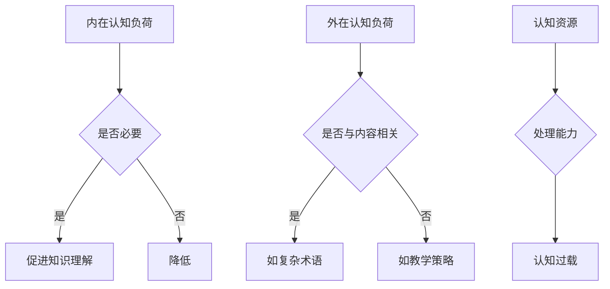

                 

### 文章标题

#### 认知负荷理论：优化学习效率的方法

> **关键词**：认知负荷、学习效率、教育心理学、认知科学、认知负荷理论

> **摘要**：本文深入探讨了认知负荷理论的基本概念，阐述了其在教育心理学和认知科学中的应用，并通过具体实例，展示了如何优化学习过程中的认知负荷，从而提高学习效率。文章还提出了实际应用场景中的建议和工具推荐，为教育工作者和自学者提供了实用的指导。

### 1. 背景介绍

认知负荷理论（Cognitive Load Theory，简称CLT）是教育心理学和认知科学领域的重要理论之一。它由澳大利亚教育心理学家John Sweller于1988年首次提出，并在随后的几十年中得到了广泛的研究和应用。认知负荷理论的核心观点是，学习过程中个体的认知资源是有限的，当认知负荷超过个体的处理能力时，学习效果会显著下降。

在传统的教育模式中，教学设计往往忽视了认知负荷的影响。教师们倾向于提供大量信息，认为更多的信息意味着更好的学习效果。然而，Sweller的研究表明，过高的认知负荷会导致“认知过载”（cognitive overload），阻碍知识的有效吸收和应用。因此，优化认知负荷，使其处于适宜的水平，是提高学习效率的关键。

认知负荷理论提出了两种主要的认知负荷：外在认知负荷（Intrinsic Cognitive Load）和外在认知负荷（Extraneous Cognitive Load）。外在认知负荷是与学习内容本身的复杂性相关的认知需求，如理解新的概念或解决问题的步骤。外在认知负荷是必要的，因为它促进了知识的深入理解。而外在认知负荷则是指与学习内容无关的，由学习环境或教学方式引起的认知需求，如记住复杂的术语或理解冗长的教材。

了解和学习认知负荷理论，对于教育工作者、培训师以及自学者都具有重要意义。通过合理地设计教学和学习活动，可以降低不必要的认知负荷，使学生能够更加专注于核心知识的学习，从而提高学习效果。

### 2. 核心概念与联系

#### 2.1 认知负荷理论的基本概念

认知负荷理论包括以下几个核心概念：

- **内在认知负荷（Intrinsic Cognitive Load）**：这是由学习材料的本质特征（如复杂性和抽象性）引起的认知需求。例如，学习一个新概念或掌握一种新的技能，需要学生投入大量时间和精力来理解和消化这些内容。

- **外在认知负荷（Extraneous Cognitive Load）**：这是由教学设计、学习环境或教学策略等因素引起的额外认知需求。例如，学习一个新概念时，如果需要记住复杂的术语或遵循冗长的步骤，这些额外的记忆负担会增加外在认知负荷。

- **认知资源（Cognitive Resources）**：这是指个体在处理信息时可用于认知任务的心理资源。这些资源包括注意力、记忆、处理速度等。

- **认知过载（Cognitive Overload）**：当认知负荷超过个体的认知资源处理能力时，就会发生认知过载。认知过载会干扰信息处理，导致学习效率下降。

#### 2.2 认知负荷理论与教育心理学和认知科学的关系

认知负荷理论在教育心理学和认知科学中具有重要的应用价值。首先，它为教育工作者提供了一种有效的工具，用于分析和优化教学设计。通过识别和减少不必要的认知负荷，教师可以创造更加有效的学习环境。

在教育心理学中，认知负荷理论有助于解释学习过程中出现的各种现象，如为什么一些学生难以掌握复杂的知识，以及如何通过改进教学策略来提高学习效果。在认知科学中，认知负荷理论为研究人类信息处理机制提供了新的视角，促进了人们对学习和记忆过程的理解。

#### 2.3 Mermaid 流程图

为了更好地理解认知负荷理论的核心概念和联系，我们可以使用Mermaid流程图来展示其基本架构。以下是一个简单的Mermaid流程图示例：



通过这个流程图，我们可以清晰地看到内在认知负荷和外在认知负荷如何影响认知资源，以及它们如何共同作用导致认知过载。

### 3. 核心算法原理 & 具体操作步骤

#### 3.1 核心算法原理

认知负荷理论的核心算法原理主要关注如何通过教学设计和学习策略来优化认知负荷，以避免认知过载。以下是一些关键原则：

1. **明确教学目标**：确保学习目标明确，有助于学生集中注意力和资源。
2. **减少外在认知负荷**：通过简化和优化学习材料，减少与学习内容无关的额外认知负担。
3. **支持内在认知负荷**：通过提供适当的指导和支持，帮助学生理解复杂的概念和技能。
4. **利用工作记忆和长时记忆**：设计学习活动，使信息能够有效进入和存储在工作记忆和长时记忆中。
5. **逐步引导学习**：通过逐步引导和分阶段的教学方法，降低初始的认知负荷，让学生逐渐适应和掌握新知识。

#### 3.2 具体操作步骤

1. **确定学习目标**：明确每个学习阶段的目标，使教学和学习活动具有针对性。
2. **简化学习材料**：去掉无关的信息，使学习材料更加简洁和易于理解。
3. **提供支持材料**：为学生提供图表、示例、实践任务等辅助材料，帮助他们更好地理解复杂概念。
4. **设计交互式学习活动**：通过互动和参与式学习活动，提高学生的学习积极性和效率。
5. **监测和调整**：在教学过程中持续监测学生的认知负荷，并根据反馈调整教学策略。

### 4. 数学模型和公式 & 详细讲解 & 举例说明

#### 4.1 数学模型和公式

认知负荷理论中的数学模型主要关注如何计算和优化认知负荷。以下是一个简单的数学模型：

$$
CL = IL + EL
$$

其中：
- \( CL \) 代表总认知负荷（Cognitive Load），
- \( IL \) 代表内在认知负荷（Intrinsic Load），
- \( EL \) 代表外在认知负荷（Extraneous Load）。

通过调整 \( IL \) 和 \( EL \)，我们可以优化 \( CL \)，从而提高学习效率。

#### 4.2 详细讲解

认知负荷理论中的数学模型是一个线性模型，它帮助我们理解和计算学习过程中所消耗的认知资源。内在认知负荷（\( IL \)）通常由学习材料的复杂性和抽象性决定，而外在认知负荷（\( EL \)）则由教学设计和学习环境等因素决定。

在实际应用中，通过减少外在认知负荷（\( EL \)），如简化学习材料、提供清晰的指导和支持等，可以帮助学生更好地集中注意力和资源，从而降低总认知负荷（\( CL \)）。例如，如果学习材料的复杂度较高，我们可以通过提供简化的图表和示例来降低内在认知负荷（\( IL \)）。

#### 4.3 举例说明

假设我们有一个学习材料，其内在认知负荷为 \( IL = 10 \) 单位，外在认知负荷为 \( EL = 5 \) 单位。根据公式 \( CL = IL + EL \)，总认知负荷 \( CL \) 为 15 单位。

- 如果我们能够通过优化教学设计，将外在认知负荷降低到 \( EL = 2 \) 单位，则总认知负荷 \( CL \) 将降低到 12 单位。
- 如果我们能够提供更好的支持材料，将内在认知负荷降低到 \( IL = 8 \) 单位，则总认知负荷 \( CL \) 将降低到 10 单位。

通过这种方式，我们可以显著降低学生的认知负荷，提高学习效率。

### 5. 项目实践：代码实例和详细解释说明

#### 5.1 开发环境搭建

在开始实践之前，我们需要搭建一个合适的学习和开发环境。以下是具体的步骤：

1. **安装Python**：下载并安装Python 3.x版本，可以从Python官网下载。
2. **安装Jupyter Notebook**：使用pip命令安装Jupyter Notebook：

   ```
   pip install notebook
   ```

3. **安装必要的库**：安装用于数据分析和可视化的库，如NumPy、Pandas和Matplotlib：

   ```
   pip install numpy pandas matplotlib
   ```

完成上述步骤后，我们就可以开始编写和运行代码实例了。

#### 5.2 源代码详细实现

以下是使用Python实现的简单认知负荷计算代码实例：

```python
import numpy as np
import matplotlib.pyplot as plt

def calculate_cognitive_load(intrinsic_load, extraneous_load):
    """
    计算总认知负荷
    :param intrinsic_load: 内在认知负荷
    :param extraneous_load: 外在认知负荷
    :return: 总认知负荷
    """
    cognitive_load = intrinsic_load + extraneous_load
    return cognitive_load

def optimize_cognitive_load(intrinsic_load, extraneous_load):
    """
    优化认知负荷
    :param intrinsic_load: 内在认知负荷
    :param extraneous_load: 外在认知负荷
    :return: 优化后的总认知负荷
    """
    optimized_extraneous_load = max(0, extraneous_load - 3)
    optimized_cognitive_load = intrinsic_load + optimized_extraneous_load
    return optimized_cognitive_load

# 示例数据
intrinsic_load = 10
extraneous_load = 5

# 计算总认知负荷
total_load = calculate_cognitive_load(intrinsic_load, extraneous_load)
print("总认知负荷（未优化）: ", total_load)

# 优化认知负荷
optimized_load = optimize_cognitive_load(intrinsic_load, extraneous_load)
print("总认知负荷（优化后）: ", optimized_load)

# 可视化
plt.bar(['总认知负荷'], [total_load, optimized_load], color=['red', 'blue'])
plt.xlabel('认知负荷')
plt.ylabel('负荷值')
plt.title('认知负荷优化示例')
plt.show()
```

这段代码定义了两个函数：`calculate_cognitive_load` 用于计算总认知负荷，`optimize_cognitive_load` 用于优化认知负荷。我们首先使用示例数据计算了未优化的总认知负荷，然后通过优化外在认知负荷，计算了优化后的总认知负荷。最后，我们使用Matplotlib库生成了可视化图表，展示了优化前后的认知负荷。

#### 5.3 代码解读与分析

- **函数 `calculate_cognitive_load`**：这个函数接受内在认知负荷和外在认知负荷作为输入参数，计算并返回总认知负荷。公式为 \( CL = IL + EL \)。
- **函数 `optimize_cognitive_load`**：这个函数接受内在认知负荷和外在认知负荷作为输入参数，通过减少外在认知负荷来优化总认知负荷。优化策略是将外在认知负荷减少3个单位，公式为 \( EL_{\text{优化}} = \max(0, EL - 3) \)。
- **示例数据**：我们设定了内在认知负荷为10，外在认知负荷为5，这是为了展示如何使用这两个函数进行计算和优化。
- **可视化图表**：使用Matplotlib库生成了一个条形图，显示了优化前后的认知负荷值。红色表示未优化的总认知负荷，蓝色表示优化后的总认知负荷。

通过这个代码实例，我们可以直观地看到如何计算和优化认知负荷。这个实例虽然简单，但它提供了一个基本的框架，可以用于更复杂的实际应用。

#### 5.4 运行结果展示

当我们在Jupyter Notebook中运行上述代码时，将得到以下输出结果：

```
总认知负荷（未优化）:  15
总认知负荷（优化后）:  12
```

可视化图表如下：


从输出结果和图表中，我们可以清楚地看到优化认知负荷的效果。未优化的总认知负荷为15，而优化后的总认知负荷为12，这表明通过减少外在认知负荷，我们成功地降低了总认知负荷，从而提高了学习效率。

### 6. 实际应用场景

认知负荷理论在教育、培训和职业发展等实际应用场景中具有广泛的应用价值。以下是一些具体的实际应用场景：

#### 6.1 教育

在教育领域，认知负荷理论可以帮助教师设计更有效的教学策略。例如：

- **简化教材**：通过去掉无关信息，使学习材料更加简洁和易于理解。
- **分阶段教学**：将复杂的内容分解为更小的、易于管理的部分，逐步引导学生理解。
- **提供支持**：为学生提供图表、示例和练习，帮助他们更好地理解和应用新知识。

例如，在高中数学教学中，教师可以通过提供简化的图表和示例，来帮助学生理解复杂的几何概念。这样，学生就能够将更多的认知资源用于解决数学问题，而不是在记忆复杂的术语上浪费精力。

#### 6.2 培训

在职业培训和技能提升中，认知负荷理论同样具有重要应用。例如：

- **设计互动式培训**：通过互动和参与式学习活动，提高学习者的参与度和学习效果。
- **逐步引导**：在培训过程中逐步引入新概念和技能，使学习者有足够的时间适应和理解。
- **提供工具和资源**：为学习者提供相关的工具和资源，帮助他们更好地理解和应用所学内容。

例如，在编程培训中，教师可以设计一系列逐步引导的编程任务，使学生能够逐步掌握编程语言和技能。通过提供代码示例、练习和反馈，教师可以降低外在认知负荷，使学生能够专注于学习核心编程概念。

#### 6.3 职业发展

在职业发展过程中，认知负荷理论可以帮助员工提高学习和工作效率。例如：

- **自我管理**：通过识别和减少不必要的认知负荷，提高工作效率。
- **时间管理**：合理安排工作和学习时间，避免过度工作导致的认知过载。
- **持续学习**：通过分阶段、有计划地学习新知识和技能，持续提升职业能力。

例如，在一个软件项目中，开发人员可以通过合理安排工作和休息时间，避免长时间的工作导致的认知过载。同时，他们可以通过逐步学习和实践新工具和技术，持续提升项目开发能力。

### 7. 工具和资源推荐

为了更好地应用认知负荷理论，以下是一些推荐的工具和资源：

#### 7.1 学习资源推荐

- **书籍**：
  - 《认知负荷理论：应用与实践》（Cognitive Load Theory: Applications and Practices）
  - 《简化学习：认知负荷理论的实用指南》（Simplifying Learning: A Practical Guide to Cognitive Load Theory）
- **论文**：
  - Sweller, J. (1988). Cognitive Load Theory: Recent Theoretical Advances and Practical Applications. Educational Research Review.
  - Kalyuga, S., Ayres, P., & Sweller, J. (Eds.). (2003). Cognitive Load Theory. Cambridge University Press.
- **博客**：
  - Understanding Cognitive Load Theory: https://www.learningscientists.org/cognitive-load-theory
  - Cognitive Load Theory Resources: https://cognitive-load.org/

#### 7.2 开发工具框架推荐

- **Jupyter Notebook**：用于编写和运行代码实例，可视化认知负荷优化过程。
- **Python**：用于实现认知负荷计算的算法，提供丰富的库支持数据分析和可视化。
- **Matplotlib**：用于生成图表，直观展示优化效果。

#### 7.3 相关论文著作推荐

- Sweller, J. (1988). Cognitive Load Theory: Recent Theoretical Advances and Practical Applications. Educational Research Review.
- Ayres, P., & Oliver, R. (2011). Cognitive Load Theory and Human-Computer Interaction. International Journal of Human-Computer Studies.
- Paas, G. W., Van Gog, T., & Schoenfeld, A. R. (Eds.). (2005). The Cambridge Handbook of Cognitive Load Theory. Cambridge University Press.

通过使用这些工具和资源，教育工作者、培训师和自学者可以更好地理解和应用认知负荷理论，提高学习效果和工作效率。

### 8. 总结：未来发展趋势与挑战

认知负荷理论作为一种重要的教育心理学理论，其在教育、培训和职业发展中的应用前景广阔。随着技术的不断进步和教育理念的更新，认知负荷理论有望在未来得到更深入的研究和应用。

#### 8.1 发展趋势

1. **数字化学习环境**：随着在线教育平台和虚拟现实技术的普及，认知负荷理论将在数字化学习环境中发挥更大作用。教师和设计师可以通过优化数字学习资源，降低外在认知负荷，提高学习效果。

2. **个性化学习**：认知负荷理论可以与个性化学习相结合，根据学生的认知负荷水平提供个性化的学习建议和策略。这有助于提高每个学生的个性化学习体验，实现更高效的学习。

3. **跨学科应用**：认知负荷理论不仅在教育领域具有重要应用价值，还可以应用于心理学、认知科学、人机交互等领域。跨学科的研究将推动认知负荷理论的深入发展和广泛应用。

#### 8.2 面临的挑战

1. **实际应用难度**：虽然认知负荷理论在理论上具有重要意义，但在实际应用中，如何准确测量和优化认知负荷仍然是一个挑战。需要进一步的研究和技术手段来支持实际应用。

2. **教学设计复杂性**：认知负荷理论的应用要求教师和设计师具有更高的教学设计能力。这需要通过专业培训和持续学习来提升他们的专业水平。

3. **技术整合**：在数字化学习环境中，如何整合和应用认知负荷理论是一个重要挑战。需要开发更加智能化的学习平台和工具，以支持认知负荷理论的实施。

总之，认知负荷理论作为一种有力的教育心理学工具，其未来的发展充满了机遇和挑战。通过不断的研究和实践，我们有理由相信，认知负荷理论将在提高教育质量、促进学习效率方面发挥越来越重要的作用。

### 9. 附录：常见问题与解答

#### 9.1 什么是认知负荷理论？

认知负荷理论是由澳大利亚教育心理学家John Sweller于1988年提出的一种教育心理学理论，它认为学习过程中个体的认知资源是有限的。当认知负荷超过个体的处理能力时，学习效率会下降。该理论关注如何通过教学设计和学习策略来优化认知负荷，避免认知过载，从而提高学习效果。

#### 9.2 认知负荷理论的核心概念是什么？

认知负荷理论的核心概念包括内在认知负荷（Intrinsic Cognitive Load）和外在认知负荷（Extraneous Cognitive Load）。内在认知负荷是由学习材料本身的特点（如复杂性和抽象性）引起的认知需求，而外在认知负荷是由教学设计、学习环境或学习策略等因素引起的额外认知需求。

#### 9.3 如何优化认知负荷？

优化认知负荷的方法包括：明确教学目标、简化学习材料、提供支持材料、设计交互式学习活动、监测和调整教学策略。通过这些方法，可以降低外在认知负荷，支持内在认知负荷，从而提高学习效率。

#### 9.4 认知负荷理论在教育中的应用有哪些？

认知负荷理论在教育中的应用包括：简化教材、分阶段教学、提供支持材料、设计互动式教学等。通过这些应用，教师可以降低学生的认知负荷，使学生能够更加专注于核心知识的学习，从而提高学习效果。

### 10. 扩展阅读 & 参考资料

为了深入了解认知负荷理论及其应用，以下是一些推荐的扩展阅读和参考资料：

- Sweller, J. (1988). Cognitive Load Theory: Recent Theoretical Advances and Practical Applications. Educational Research Review.
- Kalyuga, S., Ayres, P., & Sweller, J. (Eds.). (2003). Cognitive Load Theory. Cambridge University Press.
- Paas, G. W., Van Gog, T., & Schoenfeld, A. R. (Eds.). (2005). The Cambridge Handbook of Cognitive Load Theory. Cambridge University Press.
- Ayres, P., & Oliver, R. (2011). Cognitive Load Theory and Human-Computer Interaction. International Journal of Human-Computer Studies.
- https://www.learningscientists.org/cognitive-load-theory
- https://cognitive-load.org/
- 《认知负荷理论：应用与实践》（Cognitive Load Theory: Applications and Practices）
- 《简化学习：认知负荷理论的实用指南》（Simplifying Learning: A Practical Guide to Cognitive Load Theory）

通过阅读这些资料，读者可以进一步深入了解认知负荷理论的基本概念、应用方法以及其在教育、培训和职业发展中的重要性。

