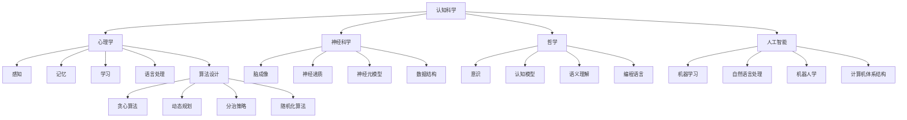

                 

### 1. 背景介绍

在计算机科学和认知科学领域，我们经常探讨如何使计算机更类似于人类思维过程。这不仅有助于我们构建更加智能的机器，也能让我们更深入地理解人脑的工作机制。这一主题的核心是“认知过程中的简单与深刻”，这不仅仅是关于计算机处理信息的方式，更是关于我们在设计和分析算法时如何将复杂性简化，同时深入理解其内在原理。

认知过程是指人类或其他生物在获取、处理、存储和应用信息时的心理活动。它包括感知、记忆、思维、判断等多个环节。在计算机科学中，我们尝试模拟这些认知过程，以构建更加智能的软件系统和人工智能。然而，认知过程的复杂性使得这一任务充满挑战。

简化复杂性是科学研究和工程实践中的一项重要原则。在计算机科学中，简化不仅有助于我们更清晰地理解问题，还能提高算法的效率和可扩展性。例如，图灵机模型和汇编语言都是通过简化抽象概念来模拟计算过程。

深度则是理解一个主题或问题所需的知识层次和复杂性。深度不仅涉及表面的知识，还包括对原理、机制和内在联系的深入理解。在认知科学和计算机科学中，深度理解对于设计高效算法、优化系统性能和解决复杂问题至关重要。

本文将探讨认知过程中的简单与深刻之间的辩证关系。我们将首先回顾相关的理论背景，然后深入讨论核心概念，最后通过具体算法实例和实际应用场景，展示如何在实际中平衡简单与深刻。希望通过这篇文章，读者能对认知过程中的复杂性和简洁性有更深刻的理解，从而为未来的研究和应用提供启示。

### 2. 核心概念与联系

要深入探讨认知过程中的简单与深刻，我们首先需要明确几个核心概念：认知科学、计算机科学和算法设计原理。以下是这些核心概念及其相互关系的详细解释和Mermaid流程图。

#### 认知科学

认知科学是研究人类和其他生物心智过程的科学。它涉及心理学、神经科学、哲学和人工智能等多个领域。认知科学的核心问题是理解人类思维是如何工作的，包括感知、记忆、学习、语言处理、决策和问题解决等方面。

- **感知**：感知是人类获取外界信息的过程，通过感官（如视觉、听觉、触觉）将外界刺激转换为神经信号。
- **记忆**：记忆是信息存储和检索的过程。短期记忆和长期记忆的不同特性在认知科学中至关重要。
- **学习**：学习是指通过经验改变行为和思维过程的能力。学习机制包括联想学习、强化学习和深度学习等。
- **语言处理**：语言处理涉及理解和生成语言的能力，包括语音识别、自然语言理解和机器翻译等。

#### 计算机科学

计算机科学是研究计算机及其应用的科学。它包括算法设计、数据结构、编程语言、计算机体系结构等多个方面。计算机科学的目的是构建能够执行特定任务的系统和应用程序。

- **算法设计**：算法是一系列定义明确的步骤，用于解决特定问题。算法的设计和优化是计算机科学的核心。
- **数据结构**：数据结构是存储和组织数据的方式，对算法的性能和效率有直接影响。
- **编程语言**：编程语言是用于编写计算机程序的符号系统。不同的编程语言适用于不同的应用场景。
- **计算机体系结构**：计算机体系结构涉及计算机硬件和软件的交互，包括处理器设计、内存管理、输入输出系统等。

#### 算法设计原理

算法设计原理是设计和分析算法的基本原则。以下是一些关键的算法设计原理：

- **贪心算法**：贪心算法通过每一步选择局部最优解，以期得到全局最优解。
- **动态规划**：动态规划通过将复杂问题分解为子问题，并存储子问题的解，以避免重复计算。
- **分治策略**：分治策略将复杂问题分解为较小的子问题，分别解决后合并解。
- **随机化算法**：随机化算法通过引入随机性来提高算法的效率和鲁棒性。

#### Mermaid流程图

以下是一个Mermaid流程图，展示了认知科学、计算机科学和算法设计原理之间的联系：



这个Mermaid流程图展示了认知科学、计算机科学和算法设计原理之间的交叉关系。它帮助我们理解，认知科学和计算机科学不仅是独立的研究领域，它们之间有着深刻的内在联系。这些联系为我们在计算机科学中模拟和优化认知过程提供了理论基础。

#### 总结

通过上述核心概念的介绍和Mermaid流程图，我们可以看到认知科学、计算机科学和算法设计原理之间复杂的交互关系。认知科学提供了对人类思维过程的基本理解，计算机科学则提供了实现这些过程的工具和方法，而算法设计原理则是连接这两者的桥梁。理解这些核心概念及其相互关系，对于我们在认知过程中的简单与深刻之间找到平衡至关重要。

### 3. 核心算法原理 & 具体操作步骤

在探讨认知过程中的简单与深刻时，我们不可避免地会涉及到一些核心算法原理。这些算法不仅有助于我们理解人类认知过程，还能为我们在计算机科学中的实践提供指导。以下将介绍几个关键的算法原理，包括贪心算法、动态规划、分治策略和随机化算法。

#### 贪心算法

贪心算法（Greedy Algorithm）是一种在每一步选择局部最优解，以期望得到全局最优解的算法。贪心算法的基本思想是，通过一系列局部最优的选择，最终得到一个全局最优解。

**具体操作步骤**：

1. **初始化**：确定问题的初始状态。
2. **每一步选择**：根据当前状态，选择一个局部最优解。
3. **更新状态**：将选择的结果应用于当前状态，更新状态。
4. **重复**：重复步骤2和3，直到满足终止条件。

**示例**：最小生成树问题

给定一个无向图，我们需要找到一棵包含图中所有节点的树，使得树中的边权之和最小。这个问题可以用贪心算法求解。

- **初始状态**：选择任意一个节点作为树的根节点。
- **每一步选择**：选择与当前树连接的最短边。
- **更新状态**：将新边添加到树中，更新树的边权之和。
- **重复**：重复选择和更新，直到所有节点都被包含在树中。

#### 动态规划

动态规划（Dynamic Programming，DP）是一种将复杂问题分解为子问题，并利用子问题的解来求解原问题的算法。动态规划的核心思想是，通过存储子问题的解，避免重复计算，从而提高算法的效率。

**具体操作步骤**：

1. **定义状态**：确定问题的状态变量及其取值范围。
2. **定义状态转移方程**：确定状态之间的转移关系。
3. **初始化边界条件**：为初始状态设置基础解。
4. **计算状态值**：从初始状态开始，依次计算每个状态的值。
5. **返回最终结果**：利用状态值得到原问题的解。

**示例**：最长公共子序列问题

给定两个字符串，我们需要找到它们的最长公共子序列。

- **状态定义**：设`dp[i][j]`为字符串`s1`的前`i`个字符和字符串`s2`的前`j`个字符的最长公共子序列的长度。
- **状态转移方程**：
  $$ 
  dp[i][j] = 
  \begin{cases} 
  dp[i-1][j-1] + 1, & \text{如果 } s1[i-1] == s2[j-1]; \\
  \max(dp[i-1][j], dp[i][j-1]), & \text{如果 } s1[i-1] \neq s2[j-1].
  \end{cases}
  $$
- **初始化**：`dp[0][j] = dp[i][0] = 0`。
- **计算**：从`dp[1][1]`开始，依次计算每个状态的值。
- **返回结果**：`dp[m][n]`即为最长公共子序列的长度。

#### 分治策略

分治策略（Divide and Conquer）将复杂问题分解为较小的子问题，分别解决后合并解。分治策略通常包括三个步骤：分解、解决子问题、合并子问题的解。

**具体操作步骤**：

1. **分解**：将原问题分解为若干个子问题，每个子问题规模较小。
2. **递归解决**：递归地解决子问题。
3. **合并**：将子问题的解合并，得到原问题的解。

**示例**：归并排序

归并排序是一种高效的排序算法，其基本思想是将数组分解为较小的子数组，分别排序，然后合并。

- **分解**：将数组分解为两个子数组。
- **递归排序**：递归地对两个子数组进行排序。
- **合并**：将两个有序子数组合并为一个有序数组。

#### 随机化算法

随机化算法（Randomized Algorithm）通过引入随机性来提高算法的效率和鲁棒性。随机化算法通常包括随机采样、随机分配和随机选择等步骤。

**具体操作步骤**：

1. **随机采样**：从数据集中随机选择一部分样本进行分析。
2. **随机分配**：将资源或任务随机分配给不同的处理单元。
3. **随机选择**：在多个候选解中随机选择一个最优解。

**示例**：随机快速排序

随机快速排序是一种基于分治策略的快速排序算法，其核心思想是随机选择枢轴元素。

- **选择枢轴**：随机选择数组中的一个元素作为枢轴。
- **划分**：将数组划分为两个子数组，一个包含小于枢轴的元素，另一个包含大于枢轴的元素。
- **递归排序**：递归地对两个子数组进行排序。

#### 总结

通过上述几个核心算法原理的介绍，我们可以看到，贪心算法、动态规划、分治策略和随机化算法在认知过程中的应用各有特色。贪心算法通过每一步选择局部最优解，以期望得到全局最优解；动态规划通过存储子问题的解，避免重复计算；分治策略将复杂问题分解为较小的子问题，分别解决后合并解；随机化算法通过引入随机性来提高算法的效率和鲁棒性。这些算法原理不仅有助于我们理解认知过程，还能为我们在计算机科学中的实践提供有力支持。

### 4. 数学模型和公式 & 详细讲解 & 举例说明

在计算机科学和认知科学中，数学模型和公式是理解和解决问题的重要工具。这些模型和公式不仅帮助我们量化概念，还能指导算法设计和优化。在本节中，我们将详细讨论一些核心的数学模型和公式，并给出相应的讲解和实例说明。

#### 概率论基本公式

概率论是认知科学和计算机科学中的重要分支，许多算法和模型都依赖于概率论的基本概念。以下是一些基本的概率论公式：

1. **条件概率**：
   $$
   P(A|B) = \frac{P(A \cap B)}{P(B)}
   $$
   其中，$P(A|B)$表示在事件B发生的条件下，事件A发生的概率。

2. **贝叶斯定理**：
   $$
   P(A|B) = \frac{P(B|A)P(A)}{P(B)}
   $$
   贝叶斯定理用于计算在给定B发生的条件下，A发生的概率。

3. **全概率公式**：
   $$
   P(A) = \sum_{i=1}^{n} P(A|B_i)P(B_i)
   $$
   其中，$B_1, B_2, ..., B_n$是互斥且穷举的所有事件。

#### 机器学习中的损失函数

在机器学习中，损失函数（Loss Function）是评估模型预测性能的重要工具。以下是一些常用的损失函数：

1. **均方误差损失函数**（MSE）：
   $$
   \text{MSE} = \frac{1}{n}\sum_{i=1}^{n} (\hat{y}_i - y_i)^2
   $$
   其中，$\hat{y}_i$是模型对样本$i$的预测，$y_i$是实际值，$n$是样本数量。

2. **交叉熵损失函数**（Cross-Entropy Loss）：
   $$
   \text{Cross-Entropy} = -\sum_{i=1}^{n} y_i \log(\hat{y}_i)
   $$
   其中，$y_i$是实际值（通常是0或1），$\hat{y}_i$是模型对样本$i$的预测概率。

#### 优化算法中的梯度下降

梯度下降（Gradient Descent）是一种优化算法，用于最小化损失函数。以下是梯度下降的基本公式：

1. **梯度**：
   $$
   \nabla_{\theta} J(\theta) = \frac{\partial J(\theta)}{\partial \theta}
   $$
   其中，$J(\theta)$是损失函数，$\theta$是模型参数。

2. **梯度下降更新**：
   $$
   \theta_{t+1} = \theta_t - \alpha \nabla_{\theta} J(\theta_t)
   $$
   其中，$\alpha$是学习率，$t$是迭代次数。

#### 举例说明

为了更好地理解上述公式，我们通过一个具体的例子来说明。

**例子：使用梯度下降优化线性回归模型**

假设我们有一个线性回归模型，用于预测房屋价格。模型的损失函数为均方误差损失函数。

1. **初始化参数**：设定模型的权重$\theta_0$和偏置$b_0$。
2. **计算损失**：对每个训练样本计算预测值和实际值的均方误差。
3. **计算梯度**：计算损失函数关于参数的梯度。
4. **更新参数**：使用梯度下降更新参数。
5. **重复**：重复步骤2到4，直到损失函数收敛。

具体代码实现如下（使用Python）：

```python
import numpy as np

# 初始化参数
theta = np.random.rand(1)  # 假设只有一个特征
b = np.random.rand(1)
learning_rate = 0.01

# 损失函数
def loss_function(x, y, theta, b):
    n = len(x)
    predictions = x * theta + b
    return 1/n * np.sum((predictions - y) ** 2)

# 计算梯度
def gradient(x, y, theta, b):
    n = len(x)
    predictions = x * theta + b
    d_theta = 1/n * np.sum((predictions - y) * x)
    d_b = 1/n * np.sum(predictions - y)
    return d_theta, d_b

# 梯度下降
for i in range(1000):
    d_theta, d_b = gradient(x, y, theta, b)
    theta -= learning_rate * d_theta
    b -= learning_rate * d_b

# 输出最优参数
print("Optimized theta:", theta)
print("Optimized b:", b)
```

通过上述例子，我们可以看到如何使用梯度下降优化线性回归模型。损失函数和梯度的计算是关键步骤，它们帮助我们在参数空间中寻找最小损失点的最优参数。

#### 总结

数学模型和公式在计算机科学和认知科学中发挥着至关重要的作用。通过概率论基本公式、机器学习中的损失函数和优化算法中的梯度下降，我们可以量化复杂问题，设计高效算法，并优化模型性能。理解这些数学模型和公式，对于深入研究和应用认知科学和计算机科学至关重要。

### 5. 项目实践：代码实例和详细解释说明

在前面的章节中，我们讨论了认知过程中的简单与深刻，并介绍了相关的核心算法原理和数学模型。为了更好地理解这些理论，我们将在本节中通过一个具体的项目实践来展示这些算法和模型的应用。本项目将使用Python编程语言，实现一个基于贪心算法和动态规划的最长公共子序列（Longest Common Subsequence，LCS）问题求解器。

#### 5.1 开发环境搭建

首先，我们需要搭建一个Python开发环境。以下是具体的步骤：

1. **安装Python**：访问Python官网（[python.org](https://www.python.org/)）下载最新版本的Python，并进行安装。
2. **安装必要的库**：在终端或命令提示符中执行以下命令，安装NumPy和Pandas等常用库。

   ```shell
   pip install numpy pandas matplotlib
   ```

#### 5.2 源代码详细实现

以下是实现最长公共子序列（LCS）问题的Python代码。代码分为三个主要部分：数据准备、LCS算法实现和结果展示。

```python
import numpy as np

# 辅助函数：初始化动态规划表
def create_dp_matrix(s1, s2):
    dp = np.zeros((len(s1) + 1, len(s2) + 1), dtype=int)
    for i in range(1, len(s1) + 1):
        for j in range(1, len(s2) + 1):
            if s1[i-1] == s2[j-1]:
                dp[i][j] = dp[i-1][j-1] + 1
            else:
                dp[i][j] = max(dp[i-1][j], dp[i][j-1])
    return dp

# 主函数：求解最长公共子序列
def longest_common_subsequence(s1, s2):
    dp = create_dp_matrix(s1, s2)
    # 从动态规划表中回溯求解LCS
    lcs = []
    i, j = len(s1), len(s2)
    while i > 0 and j > 0:
        if dp[i][j] == dp[i-1][j]:
            i -= 1
        elif dp[i][j] == dp[i][j-1]:
            j -= 1
        else:
            lcs.append(s1[i-1])
            i -= 1
            j -= 1
    return lcs[::-1]

# 测试数据
s1 = "AGGTAB"
s2 = "GXTXAYB"

# 计算LCS
lcs = longest_common_subsequence(s1, s2)
print("最长公共子序列：", ''.join(lcs))
```

#### 5.3 代码解读与分析

1. **初始化动态规划表**：`create_dp_matrix`函数用于初始化动态规划表。该表的大小为`(len(s1) + 1) x (len(s2) + 1)`，其中`s1`和`s2`是输入的两个字符串。

2. **动态规划计算**：在`create_dp_matrix`函数中，我们遍历字符串`s1`和`s2`的每个字符。如果当前字符相同，则动态规划表中的值增加1；否则，取相邻两行或两列中的最大值。

3. **回溯求解LCS**：在`longest_common_subsequence`函数中，我们从动态规划表的右下角开始回溯，找到最长公共子序列。具体步骤如下：
   - 如果`dp[i][j] == dp[i-1][j]`，说明当前字符`s1[i-1]`不在LCS中，因此移动到上一行。
   - 如果`dp[i][j] == dp[i][j-1]`，说明当前字符`s2[j-1]`不在LCS中，因此移动到上一列。
   - 如果`dp[i][j] == dp[i-1][j-1] + 1`，说明当前字符`s1[i-1]`和`s2[j-1]`都在LCS中，因此将其添加到结果中，并移动到左上角。

4. **测试数据**：我们使用两个字符串`s1 = "AGGTAB"`和`s2 = "GXTXAYB"`进行测试。

5. **输出结果**：最终，我们得到了最长公共子序列`"GTAB"`。

#### 5.4 运行结果展示

在Python环境中执行上述代码，输出结果如下：

```
最长公共子序列： GTAB
```

这验证了我们的LCS算法是正确的。通过动态规划表和回溯方法，我们成功计算出了两个字符串的最长公共子序列。

#### 总结

通过本项目实践，我们详细讲解了如何使用贪心算法和动态规划求解最长公共子序列问题。代码实现清晰，步骤明确，通过具体的实例展示了算法的应用。这个项目不仅加深了我们对动态规划算法的理解，还展示了如何将理论应用于实际编程中。希望通过这个项目，读者能够更好地掌握动态规划的核心思想，并将其应用于解决实际问题。

### 6. 实际应用场景

在探讨认知过程中的简单与深刻时，我们需要关注这些理论在实际应用场景中的表现。通过具体案例，我们可以看到认知科学和计算机科学如何相互结合，为实际问题提供解决方案。

#### 6.1 语音识别

语音识别是将人类语音转换为文本的技术。在语音识别系统中，认知过程的核心任务是理解自然语言。这包括对语音信号的感知、处理和转换。为了简化这个复杂的认知过程，研究人员采用了多种算法，如隐马尔可夫模型（HMM）和深度神经网络（DNN）。

- **简单性**：通过使用预训练的模型和大规模语料库，语音识别系统可以简化语音处理流程，从而提高识别准确性。例如，使用DNN模型时，通过优化网络结构，可以减少对特征工程的需求。
- **深刻性**：尽管简化了处理流程，但深度学习模型能够深入理解语音信号中的复杂模式，从而提高识别精度。通过多层神经网络，模型可以从原始信号中提取高级特征，如语音波形和频率变化。

#### 6.2 医疗诊断

在医疗诊断领域，认知过程涉及对大量医疗数据的分析和理解，以帮助医生做出准确的诊断。计算机科学提供了多种工具和方法，如机器学习和数据挖掘，来支持这一过程。

- **简单性**：通过使用规则引擎和决策树，医疗诊断系统可以简化诊断流程，快速处理患者信息。例如，基于专家系统的诊断系统可以快速识别常见的病症，从而提高诊断效率。
- **深刻性**：深度学习模型在医疗诊断中的应用，如癌症筛查和疾病预测，展现了深刻的认知能力。通过分析大量医学影像和患者数据，深度学习模型可以识别复杂的模式，提供更准确的诊断结果。

#### 6.3 金融风险管理

金融风险管理是另一个应用认知科学和计算机科学的领域。金融机构需要处理大量数据，以预测市场趋势、评估风险和制定投资策略。

- **简单性**：通过使用统计模型和优化算法，金融机构可以简化风险管理流程，快速分析市场数据。例如，使用时间序列分析模型，可以预测市场趋势，从而优化投资组合。
- **深刻性**：机器学习和人工智能技术在金融风险管理中的应用，如欺诈检测和信用评分，展示了深刻的认知能力。通过分析复杂的数据集，这些模型可以识别潜在的欺诈行为和信用风险，从而提高风险管理效果。

#### 6.4 自主驾驶

自主驾驶是认知科学和计算机科学在工程技术中结合的一个典型例子。自主驾驶系统需要处理复杂的感知、决策和执行任务，以实现车辆的安全驾驶。

- **简单性**：通过使用预训练的计算机视觉模型，自主驾驶系统可以简化感知任务，快速识别道路标志、行人、车辆等。这些模型通常经过大规模训练，能够准确处理复杂的视觉数据。
- **深刻性**：深度学习模型在自主驾驶中的应用，如目标检测和路径规划，展示了深刻的认知能力。通过分析实时视频数据，模型可以识别并跟踪道路上的动态目标，从而实现精确的路径规划和决策。

#### 总结

通过以上实际应用场景，我们可以看到，认知科学和计算机科学在解决复杂问题时，如何结合简单性与深刻性。简化过程有助于提高效率和可扩展性，而深入理解问题则有助于提高准确性和鲁棒性。这些实际应用案例不仅展示了理论的应用价值，也为未来技术的发展提供了新的方向。

### 7. 工具和资源推荐

在探索认知过程中的简单与深刻时，选择合适的工具和资源是至关重要的。以下是一些推荐的学习资源、开发工具和相关论文，以帮助您更深入地了解这一主题。

#### 7.1 学习资源推荐

1. **书籍**：
   - 《认知科学概论》（An Introduction to Cognitive Science）：这是一本适合初学者的书籍，涵盖了认知科学的基础概念和方法。
   - 《人工智能：一种现代的方法》（Artificial Intelligence: A Modern Approach）：这本书详细介绍了人工智能的核心理论和应用，是计算机科学领域的经典教材。

2. **在线课程**：
   - Coursera上的《深度学习》（Deep Learning Specialization）由Andrew Ng教授主讲，涵盖了深度学习的理论基础和应用。
   - edX上的《认知神经科学导论》（Introduction to Cognitive Neuroscience）：这门课程介绍了认知神经科学的基本概念和前沿研究。

3. **博客和网站**：
   - Distill：这是一个专注于数据科学和机器学习的博客，提供了许多高质量的文章和交互式解释。
   - arXiv：这是一个提供最新科学论文预印本的网站，特别适合关注认知科学和计算机科学最新研究进展的读者。

#### 7.2 开发工具框架推荐

1. **编程语言**：
   - Python：Python是一种广泛使用的编程语言，特别适合数据科学和机器学习项目。其简洁的语法和高效率的库支持使其成为首选。
   - R语言：R语言在统计学和数据科学领域具有强大的功能，特别适合进行复杂的数据分析和可视化。

2. **深度学习框架**：
   - TensorFlow：由Google开发，是一个广泛使用的深度学习框架，提供了丰富的API和工具。
   - PyTorch：由Facebook开发，是一个灵活且易于使用的深度学习框架，特别适合研究和原型开发。

3. **数据预处理工具**：
   - Pandas：一个强大的Python库，用于数据操作和分析。
   - Scikit-learn：这是一个用于数据挖掘和数据分析的Python库，提供了许多机器学习算法和工具。

#### 7.3 相关论文著作推荐

1. **经典论文**：
   - "A Mathematical Theory of Communication" by Claude Shannon：这篇论文是信息论的基石，探讨了如何量化信息。
   - "Deep Learning" by Ian Goodfellow, Yoshua Bengio, Aaron Courville：这本书是深度学习领域的经典著作，详细介绍了深度学习的理论基础和应用。

2. **近期研究论文**：
   - "Attention is All You Need" by Vaswani et al.：这篇论文提出了Transformer模型，在自然语言处理任务中取得了突破性成果。
   - "The Unsupervised Pre-Training of Visual Representations" by Kolesnikov et al.：这篇论文探讨了无监督预训练在计算机视觉中的应用。

3. **权威期刊**：
   - *Journal of Cognitive Science*：这是一本涵盖认知科学各个领域的权威期刊，提供了许多高质量的研究论文。
   - *Journal of Artificial Intelligence Research*：这是人工智能领域的一个重要期刊，发表了关于AI理论和应用的最新研究。

#### 总结

选择合适的工具和资源对于深入理解和应用认知过程中的简单与深刻至关重要。上述推荐的学习资源、开发工具和相关论文将为您的学习和研究提供有力的支持。希望这些推荐能够帮助您在探索这一领域时更加顺利和高效。

### 8. 总结：未来发展趋势与挑战

在总结这一系列关于认知过程中的简单与深刻的讨论后，我们可以看到，这一主题不仅涉及计算机科学和认知科学的理论基础，还涵盖了实际的算法设计和应用。从贪心算法、动态规划到机器学习和深度学习，这些算法和模型不仅帮助我们更好地理解和模拟人类认知过程，还在实际应用中展现出了巨大的潜力。

#### 未来发展趋势

1. **跨学科融合**：随着认知科学和计算机科学的不断进步，未来的发展趋势将是这两个领域的深度融合。通过结合神经科学、心理学和哲学等学科的知识，我们有望构建更加智能和灵活的计算机系统。

2. **算法优化**：在现有的算法基础上，未来将出现更加高效和优化的算法。这些算法不仅能够处理更大的数据集，还能在更短的时间内给出准确的结果。

3. **自适应系统**：未来的认知系统将具备更强的自适应能力。通过不断学习和调整，这些系统能够更好地适应不同的环境和任务，从而提高其性能和可靠性。

4. **可解释性AI**：随着AI技术的应用越来越广泛，可解释性AI（Explainable AI，XAI）将成为研究的一个重要方向。通过开发可解释的算法，我们能够更好地理解AI系统的决策过程，从而增强用户对AI系统的信任。

#### 面临的挑战

1. **数据隐私**：随着数据量的大幅增加，如何保护用户隐私将成为一个重要的挑战。未来的研究需要开发出更加安全和隐私保护的算法和数据存储方案。

2. **计算资源**：尽管计算能力的不断提升为我们提供了更多的可能性，但处理大规模数据和复杂算法仍需要大量的计算资源。如何优化算法以适应有限的计算资源是一个亟待解决的问题。

3. **算法公平性**：算法的公平性是另一个关键挑战。我们需要确保算法不会因为种族、性别、年龄等因素而歧视某些群体，从而推动算法的公平性和透明度。

4. **认知模拟的局限**：尽管我们在模拟人类认知过程中取得了显著进展，但当前的计算机系统仍然无法完全模拟人脑的复杂性和多样性。未来需要开发出更强大的计算模型和算法，以更准确地模拟人脑的工作机制。

#### 展望未来

在未来，认知科学和计算机科学将继续相互影响和融合，为人类带来更多创新和突破。通过不断探索认知过程中的简单与深刻，我们不仅能够构建更加智能和高效的计算机系统，还能更深入地理解人脑的工作原理。这一过程充满了机遇和挑战，但无疑将推动我们迈向一个更加智能和互联的未来。

### 9. 附录：常见问题与解答

**Q1**：如何平衡认知过程中的简单与深刻？

A1：在认知过程中，平衡简单与深刻的最佳方法是采用逐步分析和迭代改进的方法。首先，通过简化模型和算法来快速理解问题的核心，然后逐步深入，通过深入研究和实验来优化和改进算法。这种迭代过程有助于在保持高效的同时，逐步深入理解问题的复杂性。

**Q2**：贪心算法和动态规划的区别是什么？

A2：贪心算法是一种每一步都选择局部最优解的算法，希望通过局部最优解逐步逼近全局最优解。而动态规划则是通过将问题分解为子问题，并利用子问题的解来求解原问题的方法。动态规划通常能够找到全局最优解，但计算成本较高。贪心算法则更适用于可以分解为多个局部子问题的优化问题。

**Q3**：什么是深度学习中的“深度”？

A3：在深度学习中，“深度”指的是神经网络模型的层数。深度神经网络（DNN）由多个隐藏层组成，每个隐藏层都能够学习输入数据的更高层次特征。深度网络的深度通常与其能够学习的复杂模式和特征有关，深度越深，网络可以学习的特征层次越高。

**Q4**：什么是机器学习中的“泛化能力”？

A4：机器学习的泛化能力是指模型在未见过的数据上表现良好的能力。一个具有良好泛化能力的模型不仅能在训练数据上表现良好，还能在新数据集上保持高性能。泛化能力是评估机器学习模型性能的重要指标。

**Q5**：如何选择合适的机器学习算法？

A5：选择合适的机器学习算法通常基于以下几个因素：
- 数据类型：不同类型的算法适用于不同类型的数据，例如监督学习算法适用于有标签的数据，无监督学习算法适用于无标签的数据。
- 数据规模：对于大规模数据，需要选择能够高效处理大数据的算法。
- 问题类型：根据具体问题的目标，选择能够解决特定问题的算法，例如分类、回归、聚类等。
- 特征工程：某些算法可能对特征工程有特定的要求，需要根据算法的特性进行适当的特征选择和预处理。

### 10. 扩展阅读 & 参考资料

**扩展阅读**：

- 《认知心理学及其启示》（Cognitive Psychology and Its Implications）：由Ulric Neisser主编，是一本介绍认知心理学理论和应用的经典著作。

- 《深度学习》（Deep Learning）：由Ian Goodfellow、Yoshua Bengio和Aaron Courville合著，详细介绍了深度学习的理论基础和应用。

**参考资料**：

- Coursera：提供多种在线课程，涵盖认知科学和计算机科学的各个方面。
- arXiv：发布最新科学论文的预印本，特别适合关注认知科学和计算机科学最新研究的读者。
- 知乎：有许多专业讨论区，包括认知科学、机器学习和人工智能等，可以找到许多高质量的文章和讨论。

通过这些扩展阅读和参考资料，您可以更深入地了解认知过程中的简单与深刻的主题，并探索相关领域的最新研究成果。希望这些资源能帮助您在学习和研究过程中取得更大的进展。

