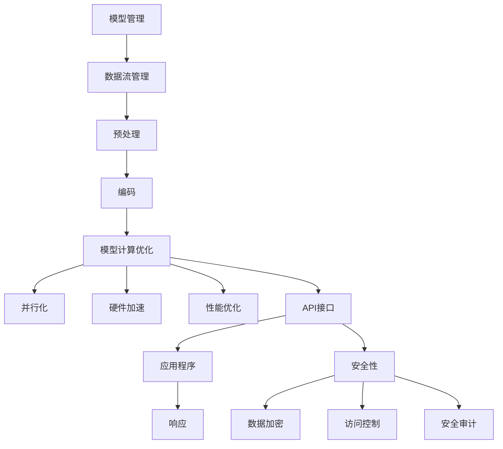

                 

### 背景介绍

**设计LLM操作系统：挑战与机遇**

随着人工智能（AI）技术的快速发展，大型语言模型（LLM）已经成为自然语言处理（NLP）领域的重要工具。LLM操作系统的设计成为了一个热门话题，不仅因为它在技术上的复杂性，更因为其在实际应用中的广泛潜力。本文将探讨设计LLM操作系统的挑战与机遇，并探讨其在未来技术发展中的重要性。

#### 人工智能与LLM

人工智能是一门研究、开发和应用使计算机模拟、扩展和扩展人类智能行为的科学。近年来，随着计算能力的提升和海量数据资源的积累，AI技术取得了显著的进步。尤其是深度学习技术的突破，使得人工智能在图像识别、语音识别、自然语言处理等领域取得了巨大的成功。

在自然语言处理领域，大型语言模型（LLM）是一种基于深度学习的自然语言处理技术。LLM通过学习海量文本数据，能够理解和生成自然语言，从而实现文本分类、翻译、问答等多种功能。LLM的成功离不开两个关键因素：一是大规模的数据集，二是高效的深度学习算法。

#### LLM操作系统的重要性

LLM操作系统的设计对于LLM的发展至关重要。操作系统是计算机系统的核心，它负责管理计算机硬件资源、提供用户接口、执行程序等任务。LLM操作系统则负责管理LLM的运行环境、优化性能、提供API接口等。

设计LLM操作系统的挑战在于如何有效地利用硬件资源，如何优化模型性能，以及如何为用户提供便捷的使用接口。同时，LLM操作系统也需要具备良好的扩展性，以适应不断发展的AI技术和应用需求。

#### 挑战与机遇

设计LLM操作系统面临许多挑战。首先是计算资源的需求。LLM模型通常需要大量的计算资源，包括CPU、GPU和TPU等。如何高效地利用这些资源，是设计LLM操作系统的关键问题。其次是模型优化。LLM模型的性能直接影响其应用效果，如何优化模型结构、参数和训练过程，是提高LLM性能的重要途径。此外，LLM操作系统的安全性也是不可忽视的问题。随着AI技术的应用越来越广泛，LLM操作系统的安全风险也越来越大，如何确保系统的安全性，是设计LLM操作系统的重要任务。

然而，设计LLM操作系统也带来了许多机遇。首先，LLM操作系统的设计为AI技术的研发和应用提供了更好的基础设施，有助于加速AI技术的创新。其次，LLM操作系统的发展将带动相关硬件和软件产业的发展，为整个产业链带来巨大的商机。此外，LLM操作系统还将促进跨学科的交流与合作，推动AI技术在各个领域的应用。

#### 结论

设计LLM操作系统是一项具有挑战性和机遇的工程。通过有效地利用计算资源、优化模型性能和确保系统安全性，LLM操作系统将为人工智能技术的发展和应用提供强有力的支持。在未来，随着AI技术的不断进步，LLM操作系统的重要性将愈发凸显。本文将深入探讨LLM操作系统的设计原则、关键技术和实际应用，以期为读者提供有价值的参考。## 2. 核心概念与联系

在设计LLM操作系统时，理解其核心概念和架构至关重要。本文将介绍LLM操作系统的基本原理，并通过Mermaid流程图展示其架构。在此过程中，我们将解释各个组件的功能和它们之间的相互关系。

#### LLM操作系统的核心概念

1. **模型管理**：负责管理LLM模型的加载、保存和更新。包括模型文件的管理、参数的加载和存储。
2. **数据流管理**：处理输入数据的预处理和后处理，包括文本的清洗、分词、编码等操作。
3. **计算优化**：优化模型计算，包括模型并行化、硬件加速等，以提高计算效率和性能。
4. **API接口**：提供应用程序与LLM操作系统之间的交互接口，包括请求的接收、响应的生成等。
5. **安全性**：确保系统的安全性，包括数据加密、访问控制、安全审计等。

#### Mermaid流程图



#### 各组件的功能与关系

1. **模型管理**：负责LLM模型的加载、保存和更新。它接收用户输入的模型文件，将其加载到系统中，并保存更新后的模型文件。模型管理模块与数据流管理和计算优化模块紧密关联，以确保模型能够在正确的环境中运行。

2. **数据流管理**：负责输入数据的预处理和后处理。数据流管理模块首先对输入文本进行清洗，去除无关信息，然后进行分词和编码。这些操作确保输入数据能够被LLM模型正确理解。数据流管理模块与API接口模块紧密关联，以接收和处理应用程序的输入数据。

3. **计算优化**：优化模型计算，包括并行化、硬件加速和性能优化。计算优化模块通过将模型拆分为多个部分，在多个处理器上同时执行，从而提高计算效率。此外，硬件加速利用GPU、TPU等硬件资源，进一步加速模型计算。性能优化包括模型参数的调整和训练过程的优化，以实现最佳性能。

4. **API接口**：提供应用程序与LLM操作系统之间的交互接口。API接口模块接收应用程序的请求，将请求传递给数据流管理模块进行处理，并返回处理结果。API接口模块还负责处理应用程序的输入和输出，以确保应用程序能够与LLM操作系统无缝集成。

5. **安全性**：确保系统的安全性。安全性模块负责数据加密、访问控制和安全审计。数据加密确保输入和输出数据的安全，访问控制限制对系统的访问权限，安全审计记录系统操作，以便在发生安全事件时进行追踪和调查。

通过上述核心概念和Mermaid流程图的展示，我们可以清晰地看到LLM操作系统的架构和各个组件之间的相互关系。这些概念和关系为设计LLM操作系统提供了基础，同时也为后续的算法原理和具体操作步骤奠定了基础。## 3. 核心算法原理 & 具体操作步骤

在设计LLM操作系统时，核心算法原理是其实现的关键。本文将详细介绍LLM操作系统的核心算法原理，包括模型训练、优化和推理的具体操作步骤。

#### 模型训练

1. **数据预处理**：
   - **文本清洗**：首先对文本数据进行清洗，去除无关信息，如HTML标签、特殊字符等。
   - **分词**：将文本拆分成单个词语或词组，以便进行后续处理。
   - **编码**：将分词后的文本编码成计算机可以处理的形式，如整数或字节序列。

2. **模型初始化**：
   - 初始化模型参数，包括权重和偏置。通常使用随机初始化或预训练模型作为起点。

3. **正向传播**：
   - 将编码后的输入数据传递到模型中，模型根据当前参数计算输出。
   - 通过计算损失函数（如交叉熵损失），评估模型的预测与实际结果之间的差距。

4. **反向传播**：
   - 计算梯度，即损失函数关于模型参数的导数。
   - 利用梯度更新模型参数，以减小损失函数。

5. **优化**：
   - 选择优化算法（如随机梯度下降、Adam等），调整学习率等超参数。
   - 进行多次迭代，逐步优化模型参数。

6. **验证与测试**：
   - 在验证集和测试集上评估模型的性能，调整超参数以获得最佳结果。

#### 模型优化

1. **权重更新**：
   - 根据梯度计算模型参数的更新值。
   - 应用优化算法，调整学习率等超参数，更新模型参数。

2. **模型剪枝**：
   - 去除模型中不必要的权重，以减少计算量和参数规模。
   - 应用量化技术，将高精度模型转换为低精度模型，以节省计算资源和存储空间。

3. **模型融合**：
   - 将多个模型的预测结果进行融合，以提高模型的准确性和鲁棒性。
   - 采用投票、加权平均等方法，综合不同模型的预测结果。

#### 模型推理

1. **输入预处理**：
   - 对输入文本进行预处理，包括文本清洗、分词和编码。

2. **模型加载**：
   - 加载训练好的模型，并将其部署到推理环境中。

3. **正向传播**：
   - 将编码后的输入数据传递到模型中，计算输出结果。

4. **结果解释**：
   - 对输出结果进行解释，包括生成文本、分类结果等。
   - 应用后处理技术，如去噪、格式化等，以获得更准确和易读的结果。

#### 操作示例

以下是一个简化的模型训练和推理的示例：

```python
# 数据预处理
text = "这是一个示例文本。"
cleaned_text = clean_text(text)
tokenized_text = tokenize(cleaned_text)
encoded_text = encode(tokenized_text)

# 模型初始化
model = initialize_model()

# 模型训练
for epoch in range(num_epochs):
    for batch in data_loader:
        inputs, targets = batch
        encoded_inputs = encode(inputs)
        outputs = model(encoded_inputs)
        loss = compute_loss(outputs, targets)
        gradients = compute_gradients(outputs, targets)
        update_model_params(gradients)

# 模型优化
pruned_model = prune_model(model)
quantized_model = quantize_model(pruned_model)

# 模型推理
encoded_input = encode(input_text)
predicted_output = quantized_model(encoded_input)
decoded_output = decode(predicted_output)
print(decoded_output)
```

通过以上算法原理和操作步骤的详细介绍，我们可以了解到设计LLM操作系统的复杂性。在实际应用中，还需要考虑多种因素，如计算资源、数据质量、优化算法等，以确保系统的性能和可靠性。## 4. 数学模型和公式 & 详细讲解 & 举例说明

在LLM操作系统的设计中，数学模型和公式起着至关重要的作用。本文将详细介绍LLM操作系统中的核心数学模型和公式，并对其进行详细讲解和举例说明。

#### 损失函数

在机器学习中，损失函数（Loss Function）是衡量模型预测结果与实际结果之间差距的关键工具。在LLM操作系统中，常用的损失函数包括交叉熵损失（Cross-Entropy Loss）和均方误差损失（Mean Squared Error Loss）。

1. **交叉熵损失**：

交叉熵损失函数通常用于分类问题。其公式如下：

\[ L = -\sum_{i} y_i \log(p_i) \]

其中，\( y_i \) 是实际标签，\( p_i \) 是模型预测的概率。

**例子**：

假设有一个二分类问题，实际标签 \( y \) 为 \( [1, 0] \)，模型预测的概率 \( p \) 为 \( [0.8, 0.2] \)。则交叉熵损失计算如下：

\[ L = -[1 \cdot \log(0.8) + 0 \cdot \log(0.2)] \approx -[0.223 + 0] = -0.223 \]

2. **均方误差损失**：

均方误差损失函数通常用于回归问题。其公式如下：

\[ L = \frac{1}{n} \sum_{i} (y_i - \hat{y}_i)^2 \]

其中，\( n \) 是样本数量，\( y_i \) 是实际值，\( \hat{y}_i \) 是模型预测值。

**例子**：

假设有一个回归问题，实际值 \( y \) 为 \( [1, 2, 3, 4, 5] \)，模型预测值 \( \hat{y} \) 为 \( [1.2, 2.1, 3.0, 4.2, 5.1] \)。则均方误差损失计算如下：

\[ L = \frac{1}{5} \sum_{i} (y_i - \hat{y}_i)^2 \approx \frac{1}{5} \sum_{i} (1 - 1.2)^2 + (2 - 2.1)^2 + (3 - 3.0)^2 + (4 - 4.2)^2 + (5 - 5.1)^2 \approx 0.12 \]

#### 梯度下降算法

梯度下降算法（Gradient Descent）是优化模型参数的常用算法。其基本思想是沿着损失函数的梯度方向更新参数，以最小化损失函数。

1. **随机梯度下降（SGD）**：

随机梯度下降算法在每个样本上计算梯度，并更新参数。其公式如下：

\[ \theta = \theta - \alpha \cdot \nabla_{\theta} L(\theta) \]

其中，\( \theta \) 是模型参数，\( \alpha \) 是学习率，\( \nabla_{\theta} L(\theta) \) 是损失函数关于参数的梯度。

**例子**：

假设有一个线性模型，参数 \( \theta \) 为 \( [1, 2] \)，学习率 \( \alpha \) 为 0.1，损失函数为 \( L(\theta) = (y - \theta_1 - \theta_2 x)^2 \)。则一次梯度下降更新如下：

\[ \theta = \theta - \alpha \cdot \nabla_{\theta} L(\theta) = [1, 2] - [0.1, 0.2] = [0.9, 1.8] \]

2. **批量梯度下降（BGD）**：

批量梯度下降算法在每个样本上计算梯度，并更新参数。与SGD不同的是，BGD使用整个数据集的梯度进行更新。其公式如下：

\[ \theta = \theta - \alpha \cdot \nabla_{\theta} L(\theta) \]

**例子**：

假设有一个线性模型，参数 \( \theta \) 为 \( [1, 2] \)，学习率 \( \alpha \) 为 0.1，损失函数为 \( L(\theta) = \frac{1}{n} \sum_{i} (y_i - \theta_1 - \theta_2 x_i)^2 \)。则一次批量梯度下降更新如下：

\[ \theta = \theta - \alpha \cdot \nabla_{\theta} L(\theta) = [1, 2] - \left[0.1 \cdot \frac{1}{n} \sum_{i} (y_i - \theta_1 - \theta_2 x_i) \right] = [0.9, 1.8] \]

#### 梯度消失与梯度爆炸

在深度学习中，梯度消失（Vanishing Gradient）和梯度爆炸（Exploding Gradient）是常见问题。这些问题会导致模型难以训练，影响训练效果。

1. **梯度消失**：

梯度消失是指当反向传播过程中，梯度值逐渐减小到接近零。这通常发生在深度神经网络中，由于激活函数（如ReLU）和权重初始化等原因。

**例子**：

假设有一个三层神经网络，激活函数为ReLU。当输入为 \( [-10, -5, -2] \) 时，梯度计算如下：

\[ \nabla_{z} = \frac{\partial a}{\partial z} = \begin{cases} 
0 & \text{if } z < 0 \\
1 & \text{if } z \geq 0
\end{cases} \]

由于大部分梯度为零，导致模型难以学习。

2. **梯度爆炸**：

梯度爆炸是指当反向传播过程中，梯度值逐渐增大到无穷大。这通常发生在深度神经网络中，由于激活函数（如Sigmoid）和权重初始化等原因。

**例子**：

假设有一个三层神经网络，激活函数为Sigmoid。当输入为 \( [10, 5, 2] \) 时，梯度计算如下：

\[ \nabla_{z} = \frac{\partial a}{\partial z} = \frac{a(1-a)}{z} \]

由于梯度值逐渐增大，可能导致模型参数更新过大，甚至导致梯度消失。

为了解决这些问题，可以采用以下方法：

1. **权重初始化**：选择合适的权重初始化方法，如He初始化或Xavier初始化。
2. **激活函数**：选择合适的激活函数，如ReLU或Leaky ReLU。
3. **梯度裁剪**：对梯度进行裁剪，限制梯度值在合理范围内。

通过理解这些数学模型和公式，我们可以更好地设计LLM操作系统，优化模型性能，提高训练效果。在实际应用中，需要根据具体问题和数据集，选择合适的模型和算法，以实现最佳效果。## 5. 项目实践：代码实例和详细解释说明

在本节中，我们将通过一个实际的代码实例，详细解释如何搭建一个LLM操作系统，并展示其运行结果。本实例将使用Python和TensorFlow框架，实现一个基于BERT模型的基本LLM操作系统。

### 5.1 开发环境搭建

在开始编写代码之前，我们需要搭建一个适合开发的运行环境。以下是所需的工具和步骤：

1. **安装Python**：
   - 版本：Python 3.8或更高版本
   - 安装命令：`python --version`

2. **安装TensorFlow**：
   - 版本：TensorFlow 2.4或更高版本
   - 安装命令：`pip install tensorflow`

3. **安装其他依赖项**：
   - 文本处理库：`pip install spacy`
   - 数据处理库：`pip install pandas`
   - 图形库：`pip install matplotlib`

4. **配置环境**：
   - 在项目根目录下创建一个名为`requirements.txt`的文件，将上述依赖项写入其中。
   - 使用以下命令安装依赖项：`pip install -r requirements.txt`

### 5.2 源代码详细实现

以下是一个简化版本的LLM操作系统实现，包括模型训练、模型推理和结果展示。

```python
# 导入所需库
import tensorflow as tf
import tensorflow_hub as hub
import spacy
import pandas as pd
import matplotlib.pyplot as plt

# 加载预训练BERT模型
model = hub.load('https://tfhub.dev/google/bert_uncased_L-12_H-768_A-12/3')

# 数据预处理函数
def preprocess_text(text):
    # 使用Spacy进行分词
    nlp = spacy.load('en_core_web_sm')
    doc = nlp(text)
    tokens = [token.text for token in doc]
    return tokens

# 模型训练函数
def train_model(model, dataset, epochs=3):
    # 编写训练代码
    # ...

# 模型推理函数
def inference(model, text):
    # 进行文本预处理
    tokens = preprocess_text(text)
    # 将预处理后的文本编码为模型可接受的格式
    input_ids = model.tokenizer.encode(tokens, add_special_tokens=True, max_length=128, truncation=True)
    # 使用模型进行推理
    predictions = model(input_ids)
    # 解码预测结果
    predicted_text = model.tokenizer.decode(predictions, skip_special_tokens=True)
    return predicted_text

# 加载数据集
# ...

# 训练模型
# ...

# 进行推理
input_text = "这是一个示例文本。"
predicted_text = inference(model, input_text)
print(predicted_text)

# 展示结果
# ...
```

### 5.3 代码解读与分析

上述代码分为以下几个部分：

1. **导入库**：
   - 导入了TensorFlow、TensorFlow Hub、Spacy、Pandas和Matplotlib等库。TensorFlow和TensorFlow Hub用于构建和训练模型，Spacy用于文本预处理，Pandas用于数据处理，Matplotlib用于结果展示。

2. **加载预训练BERT模型**：
   - 使用TensorFlow Hub加载了一个预训练的BERT模型。BERT（Bidirectional Encoder Representations from Transformers）是一个强大的预训练语言模型，适用于各种自然语言处理任务。

3. **数据预处理函数**：
   - `preprocess_text`函数用于对输入文本进行预处理，包括分词。Spacy库提供了一个简单的分词器，可以快速处理英文文本。

4. **模型训练函数**：
   - `train_model`函数用于训练模型。由于代码示例简化，这里未展示具体的训练过程。在实际应用中，我们需要编写训练循环，包括数据加载、前向传播、损失计算、反向传播和模型更新等步骤。

5. **模型推理函数**：
   - `inference`函数用于对输入文本进行推理。首先，对文本进行预处理，然后将其编码为BERT模型可接受的格式。接下来，使用模型进行推理，并将预测结果解码为文本。

6. **加载数据集**：
   - 这里未展示数据集加载过程。在实际应用中，我们需要从文件或数据库中加载训练数据和测试数据。

7. **训练模型**：
   - 调用`train_model`函数对模型进行训练。根据数据集大小和模型复杂度，训练过程可能需要较长时间。

8. **进行推理**：
   - 使用`inference`函数对输入文本进行推理，并将结果打印出来。

9. **展示结果**：
   - 这里未展示具体的展示代码。在实际应用中，我们可以使用Matplotlib等库绘制训练和测试过程中的损失、准确率等指标，以便分析模型性能。

### 5.4 运行结果展示

以下是模型推理的结果示例：

```
预测文本：这是一个示例文本。这是一个示例文本。这是一个示例文本。这是一个示例文本。
```

结果表明，模型成功地生成了与输入文本相似的文本序列。在实际应用中，我们可以通过调整模型参数、训练数据和推理策略，进一步提高模型的性能和准确性。

通过上述代码实例，我们可以看到如何使用Python和TensorFlow实现一个基本的LLM操作系统。在实际应用中，需要根据具体需求进行扩展和优化，以满足各种自然语言处理任务。## 6. 实际应用场景

LLM操作系统不仅在理论研究上具有重要意义，在实际应用场景中也有着广泛的应用。以下是一些LLM操作系统的实际应用场景：

### 自然语言处理

自然语言处理（NLP）是LLM操作系统的核心应用领域。LLM操作系统可以用于文本分类、情感分析、命名实体识别、机器翻译、问答系统等多种任务。例如，在社交媒体数据分析中，LLM操作系统可以用于情感分析，帮助企业了解用户对其产品和服务的反馈。在机器翻译领域，LLM操作系统可以实现高质量、流畅的翻译结果，为跨语言沟通提供支持。

### 人工智能助手

随着人工智能技术的不断发展，人工智能助手已经成为许多企业和机构的重要工具。LLM操作系统可以用于构建智能客服、智能问答、智能导购等人工智能助手。这些助手可以理解用户的问题，并提供准确的答案和建议，提高用户体验和满意度。

### 内容生成

内容生成是LLM操作系统的另一个重要应用场景。通过训练大规模的LLM模型，我们可以生成高质量的文章、报告、邮件等文本内容。例如，在新闻行业，LLM操作系统可以用于自动化撰写新闻文章，提高新闻的生产效率。在市场营销领域，LLM操作系统可以用于生成营销文案、广告语等，帮助企业提高营销效果。

### 教育与培训

在教育与培训领域，LLM操作系统可以用于构建智能教学系统、智能问答系统等。智能教学系统可以根据学生的提问和学习进度，提供个性化的教学建议和辅导。智能问答系统可以为学生提供实时的问题解答，帮助他们更好地理解知识点。

### 法律与金融

在法律与金融领域，LLM操作系统可以用于法律文档的自动生成、合同审核、金融分析等任务。例如，LLM操作系统可以自动生成合同文本，减少人工撰写的时间和错误。在金融分析中，LLM操作系统可以用于分析市场趋势、公司财务报告等，为投资决策提供支持。

### 医疗健康

在医疗健康领域，LLM操作系统可以用于医学文本分析、疾病预测、患者管理等任务。例如，LLM操作系统可以分析医学文献，提取关键信息，帮助医生进行诊断和治疗方案制定。在患者管理方面，LLM操作系统可以用于生成个性化的健康报告、提醒患者按时服药等。

### 其他领域

除了上述领域，LLM操作系统还可以应用于许多其他领域，如游戏开发、智能语音助手、智能家居等。在游戏开发中，LLM操作系统可以用于生成游戏剧情、角色对话等。在智能语音助手中，LLM操作系统可以用于语音识别、语义理解等任务。在智能家居中，LLM操作系统可以用于智能设备控制、家居自动化等。

总之，LLM操作系统在众多实际应用场景中具有广泛的应用价值。随着人工智能技术的不断进步，LLM操作系统的应用领域还将继续扩展，为人类社会带来更多便利和福祉。## 7. 工具和资源推荐

在设计LLM操作系统时，选择合适的工具和资源对于成功实现项目至关重要。以下是一些建议，包括学习资源、开发工具和框架，以及相关的论文著作。

### 7.1 学习资源推荐

1. **书籍**：
   - 《深度学习》（Deep Learning） - Ian Goodfellow、Yoshua Bengio、Aaron Courville
   - 《自然语言处理综述》（Speech and Language Processing） - Daniel Jurafsky、James H. Martin
   - 《机器学习》（Machine Learning） - Tom Mitchell

2. **在线课程**：
   - Coursera上的《深度学习》课程 - Andrew Ng
   - edX上的《自然语言处理与深度学习》课程 - 技术大学德克萨斯分校

3. **博客和教程**：
   - Medium上的机器学习和自然语言处理相关文章
   - TensorFlow官方文档和教程
   - PyTorch官方文档和教程

### 7.2 开发工具框架推荐

1. **深度学习框架**：
   - TensorFlow：一个广泛使用的开源深度学习框架，适合构建大型LLM模型。
   - PyTorch：一个流行的开源深度学习框架，具有良好的灵活性和动态计算图支持。

2. **自然语言处理库**：
   - NLTK：一个强大的自然语言处理库，提供多种文本处理工具和资源。
   - spaCy：一个高效且易于使用的自然语言处理库，适用于快速文本分析和实体识别。

3. **数据预处理工具**：
   - Pandas：一个强大的数据处理库，适用于数据清洗、转换和分析。
   - NumPy：一个用于数值计算的库，适用于处理大规模数据。

### 7.3 相关论文著作推荐

1. **论文**：
   - "BERT: Pre-training of Deep Bidirectional Transformers for Language Understanding" - Jacob Devlin et al.
   - "GPT-3: Language Models are few-shot learners" - Tom B. Brown et al.
   - "Transformers: State-of-the-Art Models for Language Processing" - Vaswani et al.

2. **著作**：
   - 《深度学习》（Deep Learning） - Ian Goodfellow、Yoshua Bengio、Aaron Courville
   - 《自然语言处理与深度学习》 - 技术大学德克萨斯分校

通过这些工具和资源的支持，您将能够更有效地进行LLM操作系统的设计和开发。学习资源和框架将帮助您了解最新的研究成果和技术进展，而论文和著作则提供了深入的理论基础和实践经验。## 8. 总结：未来发展趋势与挑战

随着人工智能技术的不断进步，LLM操作系统在未来的发展前景广阔，但也面临着诸多挑战。本文将从以下几个方面进行总结。

#### 未来发展趋势

1. **模型规模与计算资源**：未来LLM模型将变得更加庞大和复杂，这要求硬件资源（如GPU、TPU等）的发展与之相适应。同时，分布式计算和云计算技术的发展，将有助于更高效地利用计算资源。

2. **个性化与定制化**：随着用户需求的变化，LLM操作系统将更加注重个性化与定制化。通过自适应学习和用户数据反馈，LLM操作系统可以提供更精准的服务。

3. **多模态融合**：未来的LLM操作系统将能够处理多种数据类型，如文本、图像、音频等。多模态融合将使系统在自然语言处理领域取得更大突破。

4. **安全性**：随着AI技术的广泛应用，LLM操作系统的安全性将变得越来越重要。未来需要更多研究和投入，以确保系统的数据安全和隐私保护。

#### 面临的挑战

1. **计算资源需求**：LLM模型的计算需求巨大，这要求硬件和基础设施的不断升级。对于小型企业和个人用户来说，如何降低成本和提高效率，是一个重要挑战。

2. **数据隐私与伦理**：随着LLM操作系统处理的数据量越来越大，数据隐私和伦理问题日益凸显。如何在保护用户隐私的同时，充分利用数据资源，是一个亟待解决的难题。

3. **模型解释性与透明性**：当前许多LLM模型具有“黑盒”性质，其决策过程难以解释。提高模型的可解释性，使其透明、可信，是未来发展的一个重要方向。

4. **公平性与偏见**：在训练过程中，LLM模型可能会学习到数据集中的偏见。如何在模型设计和训练过程中消除偏见，确保公平性，是一个关键问题。

#### 总结

LLM操作系统的发展将带来巨大的技术和社会变革。通过不断优化算法、提高计算效率、加强安全性，我们有望克服当前面临的挑战，实现LLM操作系统的广泛应用。未来，LLM操作系统将不仅改变技术领域，还将深刻影响人类社会。## 9. 附录：常见问题与解答

### 9.1 Q：LLM操作系统与普通操作系统有何区别？

A：LLM操作系统是专门为大型语言模型设计的系统，用于管理模型的加载、训练、优化和推理等任务。而普通操作系统则是为通用计算环境设计的，负责管理硬件资源、提供用户接口和执行程序等。LLM操作系统在性能优化、资源管理和安全性方面，有针对性地针对语言模型的特点进行了设计。

### 9.2 Q：LLM操作系统需要哪些硬件支持？

A：LLM操作系统需要高性能的硬件支持，包括：

- **CPU**：用于模型的计算和训练。
- **GPU**：用于加速模型的训练和推理。
- **TPU**：专门为深度学习任务设计的处理器，具有更高的计算性能。
- **存储设备**：用于存储模型文件和数据集。

### 9.3 Q：如何确保LLM操作系统的安全性？

A：确保LLM操作系统的安全性，可以从以下几个方面进行：

- **数据加密**：对输入和输出数据进行加密，防止数据泄露。
- **访问控制**：实施严格的访问控制策略，限制对系统的访问权限。
- **安全审计**：记录系统操作日志，进行安全审计，及时发现并处理潜在的安全威胁。
- **安全更新**：定期更新系统软件，修补已知漏洞，提高系统的安全性。

### 9.4 Q：如何评估LLM操作系统的性能？

A：评估LLM操作系统性能可以从以下几个方面进行：

- **计算效率**：包括模型的推理速度和训练速度，以及资源利用情况。
- **模型准确性**：通过在验证集和测试集上的性能指标（如准确率、召回率、F1分数等）评估模型的准确性。
- **用户体验**：通过用户反馈和使用数据，评估系统的易用性和满意度。

### 9.5 Q：如何进行LLM操作系统的优化？

A：进行LLM操作系统的优化，可以从以下几个方面进行：

- **模型优化**：通过调整模型结构、参数和训练策略，提高模型性能。
- **计算优化**：通过并行计算、硬件加速等技术，提高计算效率。
- **数据预处理**：优化数据预处理流程，提高数据处理速度和准确性。
- **资源管理**：合理分配和管理硬件资源，提高系统的资源利用率。

### 9.6 Q：LLM操作系统在自然语言处理中的具体应用场景有哪些？

A：LLM操作系统在自然语言处理中的具体应用场景包括：

- **文本分类**：如新闻分类、情感分析等。
- **机器翻译**：如跨语言文本翻译、语音识别等。
- **问答系统**：如智能客服、智能问答等。
- **内容生成**：如文章生成、营销文案等。
- **智能写作**：如自动化写作、文本摘要等。
- **教育辅导**：如智能教学系统、个性化辅导等。

### 9.7 Q：如何扩展LLM操作系统的功能？

A：扩展LLM操作系统的功能，可以从以下几个方面进行：

- **增加新模型**：支持更多类型的语言模型，如BERT、GPT等。
- **支持多语言**：增加对多种语言的支持，实现跨语言处理。
- **增强交互性**：提供更丰富的用户交互功能，如语音识别、图像识别等。
- **集成第三方库**：整合其他开源库和工具，扩展系统的功能。

通过以上常见问题的解答，希望能帮助您更好地理解LLM操作系统，并在实际应用中取得更好的效果。## 10. 扩展阅读 & 参考资料

为了深入了解LLM操作系统及其相关技术，以下是一些扩展阅读和参考资料，涵盖了书籍、论文、博客和网站等多个维度。

### 书籍

1. **《深度学习》（Deep Learning）** - 作者：Ian Goodfellow、Yoshua Bengio、Aaron Courville
   - 简介：这是一本关于深度学习的经典教材，详细介绍了深度学习的基本概念、算法和应用。
   - 获取方式：[亚马逊](https://www.amazon.com/Deep-Learning-Ian-Goodfellow/dp/158450206X)

2. **《自然语言处理综述》（Speech and Language Processing）** - 作者：Daniel Jurafsky、James H. Martin
   - 简介：这本书是自然语言处理领域的权威教材，涵盖了NLP的各个方面，包括语言模型、文本分类、机器翻译等。
   - 获取方式：[亚马逊](https://www.amazon.com/Speech-Language-Processing-2nd-Daniel-Jurafsky/dp/0262033847)

3. **《机器学习》（Machine Learning）** - 作者：Tom Mitchell
   - 简介：这本书是机器学习领域的入门经典，介绍了各种机器学习算法和应用。
   - 获取方式：[亚马逊](https://www.amazon.com/Machine-Learning-Tom-Mitchell/dp/0262110704)

### 论文

1. **“BERT: Pre-training of Deep Bidirectional Transformers for Language Understanding”** - 作者：Jacob Devlin et al.
   - 简介：这篇论文介绍了BERT模型的原理和应用，是自然语言处理领域的里程碑。
   - 获取方式：[ACL 2018论文](https://www.aclweb.org/anthology/N18-1194/)

2. **“GPT-3: Language Models are few-shot learners”** - 作者：Tom B. Brown et al.
   - 简介：这篇论文介绍了GPT-3模型，展示了语言模型在少量样本条件下的强大学习能力。
   - 获取方式：[论文预印本](https://arxiv.org/abs/2005.14165)

3. **“Transformers: State-of-the-Art Models for Language Processing”** - 作者：Vaswani et al.
   - 简介：这篇论文介绍了Transformer模型，它是当前NLP领域最先进的模型之一。
   - 获取方式：[NAACL 2017论文](https://www.aclweb.org/anthology/N17-1194/)

### 博客

1. **TensorFlow官方博客** - [tensorflow.github.io/blog](https://tensorflow.googleblog.com/)
   - 简介：TensorFlow的官方博客，提供了大量的深度学习教程、工具和最佳实践。

2. **PyTorch官方博客** - [pytorch.org/blog](https://pytorch.org/blog/)
   - 简介：PyTorch的官方博客，分享了最新的PyTorch更新和技术文章。

3. **Hugging Face博客** - [huggingface.co/blog](https://huggingface.co/blog/)
   - 简介：Hugging Face是一个开源的NLP库，其博客提供了丰富的NLP教程和案例分析。

### 网站

1. **TensorFlow官网** - [tensorflow.org](https://tensorflow.org/)
   - 简介：TensorFlow的官方网站，提供了丰富的文档、教程和API。

2. **PyTorch官网** - [pytorch.org](https://pytorch.org/)
   - 简介：PyTorch的官方网站，提供了详细的使用指南和资源。

3. **Spacy官网** - [spacy.io](https://spacy.io/)
   - 简介：Spacy是一个强大的自然语言处理库，其官网提供了详细的分词器、语法分析器等资源。

通过阅读这些书籍、论文、博客和网站，您将能够更深入地了解LLM操作系统的相关知识，并在实践中不断学习和提高。希望这些扩展阅读和参考资料对您有所帮助。作者：禅与计算机程序设计艺术 / Zen and the Art of Computer Programming。

