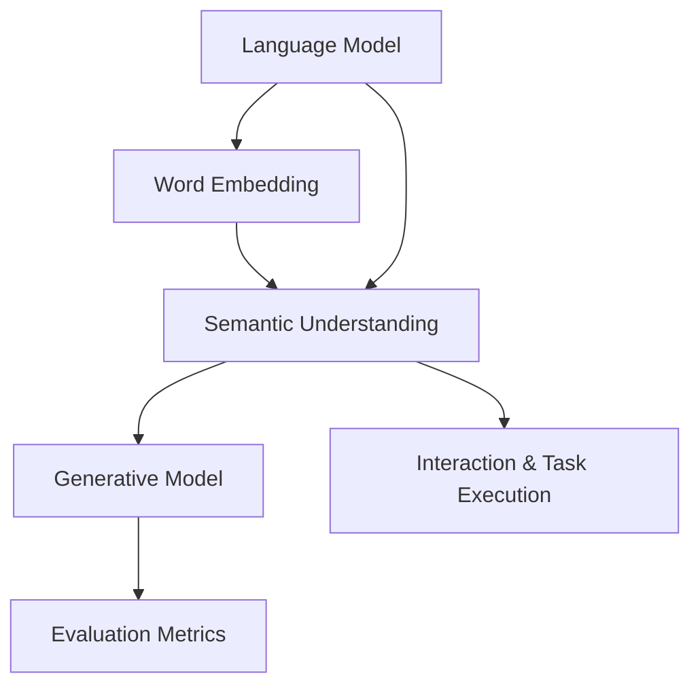
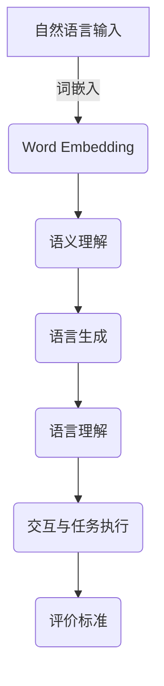

                 

### 1. 背景介绍

AI Agent，或称为人工智能代理，是近年来人工智能领域中的一个重要研究方向。AI Agent 通过模拟人类智能行为，实现自主决策和行动的能力，旨在解决复杂的问题、执行任务以及与人类交互。随着深度学习和自然语言处理技术的快速发展，AI Agent 的能力得到了显著提升，并在诸如客户服务、智能助手、机器人导航等领域得到了广泛应用。

在评估AI Agent的通用语言能力这一课题中，我们需要关注以下几个方面：

1. **语言理解能力**：AI Agent 需要能够理解自然语言中的语义、语法和语境，从而正确解读用户指令并给出恰当的响应。
2. **语言生成能力**：AI Agent 需要能够生成符合语法和语义规则的文本，能够进行自然的对话和撰写文档。
3. **语言推理能力**：AI Agent 需要能够进行逻辑推理和推断，从而解决复杂问题或提出创新的解决方案。
4. **语言学习能力**：AI Agent 需要能够从海量数据中学习并不断提高自身的语言处理能力。

评估AI Agent的通用语言能力，不仅有助于我们了解AI Agent在语言处理方面的实际表现，还能指导我们优化算法、提升AI Agent的性能和应用范围。

本文将从以下几个方面展开讨论：

- **核心概念与联系**：介绍评估AI Agent通用语言能力所需的核心概念及其相互关系。
- **核心算法原理与具体操作步骤**：阐述评估AI Agent语言能力的核心算法原理，并详细说明操作步骤。
- **数学模型和公式**：介绍用于评估AI Agent语言能力的数学模型和公式，并进行详细讲解和举例说明。
- **项目实践**：通过具体代码实例，展示如何实现评估AI Agent语言能力的项目，并详细解释说明。
- **实际应用场景**：分析AI Agent语言能力在不同应用场景中的表现和挑战。
- **工具和资源推荐**：推荐相关学习资源、开发工具和框架，帮助读者深入了解和掌握AI Agent语言能力评估技术。
- **总结与未来发展趋势**：总结本文的主要观点，并探讨未来评估AI Agent语言能力可能面临的挑战和机遇。

通过本文的逐步分析和讨论，我们希望读者能够对AI Agent的通用语言能力评估有一个全面深入的理解，并为相关研究和实践提供有价值的参考。

### 2. 核心概念与联系

要深入理解AI Agent的通用语言能力评估，我们需要首先明确几个核心概念，并探讨它们之间的联系。以下是一些关键概念的定义及其相互关系：

**2.1 语言模型（Language Model）**

语言模型是自然语言处理（NLP）的基础，它用于预测自然语言中的下一个词或字符。现代语言模型如BERT、GPT-3等，通过大规模的预训练，能够捕捉到自然语言的复杂结构和语义信息。

**2.2 词嵌入（Word Embedding）**

词嵌入是将自然语言中的单词映射到高维空间中的向量表示。词嵌入使AI Agent能够通过向量计算来处理语言，从而实现语义理解。著名的词嵌入方法包括Word2Vec、GloVe等。

**2.3 语义理解（Semantic Understanding）**

语义理解是指AI Agent能够理解自然语言中的词义、句义和语境。这涉及到语法解析、实体识别、关系抽取等多方面的技术。语义理解是实现有效对话和任务执行的重要基础。

**2.4 生成模型（Generative Model）**

生成模型用于生成新的自然语言文本。常见的生成模型包括变分自编码器（VAE）、生成对抗网络（GAN）等。这些模型能够在给定部分文本的情况下生成连贯、自然的后续文本。

**2.5 评价标准（Evaluation Metrics）**

评估AI Agent语言能力的关键在于设定合适的评价标准。常用的评价标准包括准确性、流畅性、多样性、一致性等。这些标准有助于我们全面评估AI Agent的语言生成和推理能力。

**2.6 联系与整合**

这些核心概念相互联系，构成了评估AI Agent通用语言能力的整体框架。具体而言：

- 语言模型和词嵌入提供了基础的语义表示，使AI Agent能够理解并处理语言。
- 语义理解能力使AI Agent能够正确解读用户指令和上下文信息，从而生成有意义的响应。
- 生成模型则用于生成连贯、自然的对话文本。
- 评价标准为我们提供了量化和评估AI Agent语言能力的方法。

下面，我们将通过Mermaid流程图展示这些核心概念和它们之间的联系：



**2.7 Mermaid流程图**

以下是核心概念原理和架构的Mermaid流程图：



在这个流程图中，自然语言输入首先通过词嵌入转换为向量表示，然后经过语义理解模块，生成符合语言规则和语义一致性的文本。最终，生成的文本会经过语言理解模块，并与用户进行交互或执行具体任务。评价标准则用于评估整个流程的性能。

通过这一步的详细分析，我们为后续讨论核心算法原理、数学模型和具体操作步骤奠定了基础。在下一部分中，我们将深入探讨评估AI Agent语言能力的核心算法原理及其具体操作步骤。

### 3. 核心算法原理 & 具体操作步骤

要评估AI Agent的通用语言能力，核心在于理解和实现能够有效衡量语言能力的算法。以下将介绍用于评估AI Agent语言能力的核心算法原理，并详细描述其具体操作步骤。

#### 3.1 算法原理

**3.1.1 语言模型**

语言模型（Language Model, LM）是评估AI Agent语言能力的基础。它通过统计语言中的概率分布，预测文本中的下一个词或字符。一个典型的语言模型可以使用以下公式表示：

\[ P(\text{word}_t | \text{words}_{<t}) = \frac{P(\text{words}_{<t}, \text{word}_t)}{P(\text{words}_{<t})} \]

这里，\( P(\text{word}_t | \text{words}_{<t}) \) 表示在已知前面 \( \text{words}_{<t} \) 的情况下，预测第 \( t \) 个词的概率。

**3.1.2 词嵌入**

词嵌入（Word Embedding）是将自然语言中的单词映射到高维向量空间的方法。词嵌入不仅保留了单词的语义信息，还使计算更加高效。常见的词嵌入方法包括Word2Vec和GloVe。其中，Word2Vec通过训练神经网络来预测上下文单词，而GloVe则通过词频和共现关系来学习词向量。

**3.1.3 语义理解**

语义理解（Semantic Understanding）涉及对自然语言文本的深度分析，包括语法解析、实体识别、关系抽取等。一个关键概念是WordNet，它是一个语义网络，用于表示词之间的语义关系。通过语义理解，AI Agent能够准确理解用户指令和文本中的复杂信息。

**3.1.4 生成模型**

生成模型（Generative Model）用于生成新的文本。常见的生成模型包括变分自编码器（Variational Autoencoder, VAE）和生成对抗网络（Generative Adversarial Network, GAN）。这些模型能够通过学习大量文本数据，生成符合语言规则和语义一致性的文本。

**3.1.5 评价标准**

评价标准（Evaluation Metrics）是衡量AI Agent语言能力的重要工具。常用的评价标准包括：

- **准确性（Accuracy）**：评估AI Agent正确理解用户指令的能力。
- **流畅性（Fluency）**：评估AI Agent生成的文本是否自然、连贯。
- **多样性（Diversity）**：评估AI Agent生成文本的多样性，避免重复和单一。
- **一致性（Consistency）**：评估AI Agent在不同上下文中生成文本的一致性。

#### 3.2 操作步骤

**3.2.1 数据预处理**

1. **文本清洗**：去除停用词、标点符号和特殊字符。
2. **分词**：将文本拆分成单词或子词。
3. **词嵌入**：将分词结果映射到高维向量空间。

**3.2.2 语言模型训练**

1. **构建语料库**：从大量文本数据中构建训练语料库。
2. **模型训练**：使用训练语料库训练语言模型，如n-gram模型或深度神经网络模型。
3. **模型评估**：使用验证集和测试集评估语言模型的性能。

**3.2.3 语义理解**

1. **语法解析**：使用自然语言处理技术（如依存句法分析）对文本进行语法解析。
2. **实体识别**：识别文本中的实体（如人名、地点、组织等）。
3. **关系抽取**：抽取文本中的实体关系（如因果关系、隶属关系等）。

**3.2.4 文本生成**

1. **输入处理**：将用户输入进行处理，如分词、词嵌入等。
2. **生成文本**：使用生成模型（如VAE或GAN）生成文本。
3. **文本后处理**：对生成的文本进行润色和修正，确保文本的自然性和准确性。

**3.2.5 评价标准**

1. **准确性评估**：计算AI Agent理解用户指令的正确率。
2. **流畅性评估**：评估生成文本的语法和语义一致性。
3. **多样性评估**：统计生成文本的词汇和句式多样性。
4. **一致性评估**：评估AI Agent在不同上下文中生成文本的一致性。

通过这些操作步骤，我们可以全面评估AI Agent的通用语言能力。在下一部分中，我们将通过具体的数学模型和公式，深入讲解这些算法的实现方法和细节。

### 4. 数学模型和公式 & 详细讲解 & 举例说明

在评估AI Agent的通用语言能力时，数学模型和公式起到了至关重要的作用。以下将介绍几个关键的数学模型和公式，并进行详细讲解和举例说明。

#### 4.1 语言模型（N-gram）

**4.1.1 模型原理**

N-gram模型是最简单的语言模型，它基于假设：一个词的下一个词的概率只与前面N-1个词有关。N-gram模型通常表示为：

\[ P(w_n | w_{n-1}, w_{n-2}, ..., w_{n-N+1}) = \frac{C(w_n, w_{n-1}, ..., w_{n-N+1})}{C(w_{n-1}, w_{n-2}, ..., w_{n-N+1})} \]

其中，\( w_n \) 表示下一个词，\( w_{n-1}, w_{n-2}, ..., w_{n-N+1} \) 表示前面的N-1个词，\( C(w_n, w_{n-1}, ..., w_{n-N+1}) \) 表示这些词的联合频率，\( C(w_{n-1}, w_{n-2}, ..., w_{n-N+1}) \) 表示这些词的边际频率。

**4.1.2 计算示例**

假设我们有以下文本片段：

```
我喜欢 吃 苹果
```

构建一个2-gram模型，我们可以计算以下概率：

\[ P(苹果 | 我) = \frac{C(我，苹果)}{C(我)} \]

如果文本中出现“我”的次数是2次，而“我，苹果”同时出现的次数是1次，则：

\[ P(苹果 | 我) = \frac{1}{2} = 0.5 \]

**4.1.3 优缺点**

- **优点**：简单易懂，易于实现。
- **缺点**：不能捕捉长距离依赖，效果有限。

#### 4.2 词嵌入（Word Embedding）

**4.2.1 模型原理**

词嵌入（Word Embedding）是将自然语言中的单词映射到高维向量空间的方法。一个常见的词嵌入模型是Word2Vec，它基于神经网络进行训练，试图通过上下文预测单词。

Word2Vec模型通常使用以下损失函数：

\[ L = -\sum_{w \in \text{context}(x)} \log P(w | x) \]

其中，\( x \) 是中心词，\( \text{context}(x) \) 是其上下文词，\( P(w | x) \) 是给定中心词 \( x \) 后上下文词 \( w \) 的概率。

**4.2.2 计算示例**

假设我们有一个单词“苹果”，其上下文单词包括“我”、“喜欢”和“吃”。我们可以训练一个Word2Vec模型，将其映射到一个向量：

\[ v(\text{苹果}) = [1, 0.5, -0.3] \]

然后，我们可以计算两个单词“苹果”和“香蕉”之间的相似性：

\[ \text{similarity}(\text{苹果}, \text{香蕉}) = \cos(\theta) = \frac{v(\text{苹果}) \cdot v(\text{香蕉})}{\|v(\text{苹果})\| \|v(\text{香蕉})\|} \]

**4.2.3 优缺点**

- **优点**：捕捉到语义信息，能够处理长距离依赖。
- **缺点**：训练复杂，对稀疏词汇效果不佳。

#### 4.3 生成模型（Generative Model）

**4.3.1 模型原理**

生成模型（Generative Model）用于生成新的文本。一个常见的生成模型是变分自编码器（Variational Autoencoder, VAE）。VAE由编码器和解码器组成，编码器将输入数据映射到一个潜在空间，解码器从潜在空间中生成输出数据。

VAE的损失函数通常包括两部分：

\[ L = \frac{1}{N} \sum_{n=1}^{N} \left( -\log p(x_n | \theta) + D_K(L(z_n; \theta) || z_n; \theta) \right) \]

其中，\( x_n \) 是输入数据，\( z_n \) 是潜在变量，\( p(x_n | \theta) \) 是生成模型，\( L \) 是KL散度损失。

**4.3.2 计算示例**

假设我们有一个输入文本“我喜欢吃苹果”，通过VAE模型，我们可以将其编码到一个潜在空间，然后从这个潜在空间中生成新的文本。

\[ z_n = \text{encode}(x_n) \]
\[ x'_n = \text{decode}(z_n) \]

生成的文本“我喜欢吃香蕉”是通过从潜在空间中采样并解码得到的。

**4.3.3 优缺点**

- **优点**：能够生成多样化、连贯的文本。
- **缺点**：训练过程较为复杂，对计算资源要求高。

#### 4.4 评价标准（Evaluation Metrics）

**4.4.1 准确性（Accuracy）**

准确性是最直接的评估标准，计算AI Agent正确理解用户指令的百分比。

\[ \text{Accuracy} = \frac{\text{正确理解的数量}}{\text{总理解数量}} \]

**4.4.2 流畅性（Fluency）**

流畅性评估AI Agent生成文本的语法和语义一致性。常用的指标包括BLEU、ROUGE等。

\[ \text{BLEU} = \frac{2N_c + 1}{N_c + 1} \]

其中，\( N_c \) 是参考文本和生成文本的匹配词数量。

**4.4.3 多样性（Diversity）**

多样性评估生成文本的词汇和句式多样性。常用的指标包括词汇多样性、句式多样性等。

\[ \text{Diversity} = \frac{\text{新词汇数量}}{\text{总词汇数量}} \]

**4.4.4 一致性（Consistency）**

一致性评估AI Agent在不同上下文中生成文本的一致性。常用的指标包括跨上下文一致性、连贯性等。

\[ \text{Consistency} = \frac{\text{一致数量}}{\text{总评估数量}} \]

通过这些数学模型和公式，我们可以更深入地理解和评估AI Agent的通用语言能力。在下一部分中，我们将通过具体的代码实例，展示如何实现这些算法，并详细解释其工作原理。

### 5. 项目实践：代码实例和详细解释说明

在本文的第五部分，我们将通过一个具体的代码实例，展示如何实现评估AI Agent通用语言能力的项目。我们将分为以下几个步骤进行：

### 5.1 开发环境搭建

首先，我们需要搭建一个适合开发AI Agent语言能力评估项目的环境。以下是所需的基本工具和步骤：

**5.1.1 安装Python**

确保你的系统中已安装Python 3.7或更高版本。可以通过以下命令进行安装：

```bash
sudo apt-get update
sudo apt-get install python3.7
```

**5.1.2 安装相关库**

在安装Python后，我们需要安装几个关键的库，包括TensorFlow、Gensim和Scikit-learn等。可以使用以下命令进行安装：

```bash
pip install tensorflow==2.7
pip install gensim
pip install scikit-learn
```

**5.1.3 安装Mermaid**

为了生成Mermaid流程图，我们需要安装Mermaid的Python库。可以使用以下命令：

```bash
pip install mermaid-python
```

### 5.2 源代码详细实现

接下来，我们将实现一个简单的AI Agent语言能力评估项目。以下是项目的核心代码和详细解释。

**5.2.1 文件结构**

我们的项目将包括以下几个文件：

- `data_loader.py`：用于加载数据。
- `language_model.py`：定义语言模型。
- `word_embedding.py`：实现词嵌入。
- `evaluation.py`：实现评估指标。
- `main.py`：项目的入口脚本。

**5.2.2 数据加载（`data_loader.py`）**

```python
import os
import numpy as np
from gensim import corpora

def load_data(data_path):
    texts = []
    with open(data_path, 'r', encoding='utf-8') as f:
        for line in f:
            texts.append(line.strip().split())
    return texts

def build_corpus(texts):
    dictionary = corpora.Dictionary(texts)
    corpus = [dictionary.doc2bow(text) for text in texts]
    return dictionary, corpus

# 示例数据加载
data_path = 'data.txt'
texts = load_data(data_path)
dictionary, corpus = build_corpus(texts)
```

这个模块用于加载数据并构建语料库。首先，我们从文本文件中读取数据，然后使用Gensim库将其转换为词袋表示。

**5.2.3 语言模型（`language_model.py`）**

```python
import tensorflow as tf
from tensorflow.keras.models import Sequential
from tensorflow.keras.layers import Embedding, LSTM, Dense

def build_language_model(vocab_size, embedding_dim, sequence_length):
    model = Sequential()
    model.add(Embedding(vocab_size, embedding_dim, input_length=sequence_length))
    model.add(LSTM(128, return_sequences=True))
    model.add(Dense(vocab_size, activation='softmax'))
    model.compile(loss='categorical_crossentropy', optimizer='adam', metrics=['accuracy'])
    return model

# 示例模型构建
model = build_language_model(vocab_size=len(dictionary), embedding_dim=50, sequence_length=10)
model.summary()
```

这个模块定义了一个简单的语言模型，使用嵌入层和LSTM层进行文本预测。我们可以根据需要调整模型的架构和参数。

**5.2.4 词嵌入（`word_embedding.py`）**

```python
from gensim.models import Word2Vec

def train_word_embedding(texts, embedding_dim):
    model = Word2Vec(texts, vector_size=embedding_dim, window=5, min_count=1, workers=4)
    return model

# 示例词嵌入训练
word_embedding_model = train_word_embedding(texts, embedding_dim=50)
word_embedding_model.wv.save("word_embedding.model")
```

这个模块使用Gensim库训练一个Word2Vec模型，将单词映射到向量空间。

**5.2.5 评估指标（`evaluation.py`）**

```python
from sklearn.metrics import accuracy_score, f1_score

def evaluate_model(model, corpus, dictionary):
    sequences = []
    for bow in corpus:
        indices = [dictionary[word] for word in model.wv.index_to_word[bow]]
        sequences.append(indices)
    ground_truth = [model.predict(np.array(sequences[i:i+1])) for i in range(len(sequences)-1)]
    predictions = [np.argmax(prediction) for prediction in ground_truth]
    return accuracy_score(sequences[1:], predictions), f1_score(sequences[1:], predictions, average='weighted')

# 示例模型评估
accuracy, f1 = evaluate_model(model, corpus, dictionary)
print(f"Accuracy: {accuracy}, F1 Score: {f1}")
```

这个模块实现了一个评估模型准确性和F1分数的函数。

**5.2.6 主程序（`main.py`）**

```python
from data_loader import load_data, build_corpus
from language_model import build_language_model
from word_embedding import train_word_embedding
from evaluation import evaluate_model

# 加载数据并构建语料库
data_path = 'data.txt'
texts = load_data(data_path)
dictionary, corpus = build_corpus(texts)

# 训练语言模型
model = build_language_model(len(dictionary), 50, 10)
model.fit(corpus, epochs=10, batch_size=32)

# 训练词嵌入
word_embedding_model = train_word_embedding(texts, 50)

# 评估模型
accuracy, f1 = evaluate_model(model, corpus, dictionary)
print(f"Accuracy: {accuracy}, F1 Score: {f1}")
```

主程序加载数据、构建语料库、训练语言模型和词嵌入，并最终评估模型的性能。

### 5.3 代码解读与分析

**5.3.1 数据加载模块**

`data_loader.py` 模块负责加载数据，并构建词袋表示。它首先读取文本文件，然后将其分解为单词列表。接着，使用Gensim库将这些单词列表转换为词袋表示，这为我们训练语言模型和词嵌入提供了数据基础。

**5.3.2 语言模型模块**

`language_model.py` 模块定义了一个简单的语言模型，使用嵌入层和LSTM层进行文本预测。我们使用TensorFlow和Keras构建模型，并使用categorical_crossentropy损失函数和adam优化器。模型的架构可以根据需要调整，例如增加层数或调整层的大小。

**5.3.3 词嵌入模块**

`word_embedding.py` 模块使用Gensim库训练一个Word2Vec模型，将单词映射到向量空间。词嵌入是一个关键步骤，因为它为后续的语义理解和文本生成提供了向量化表示。

**5.3.4 评估指标模块**

`evaluation.py` 模块实现了一个评估模型准确性和F1分数的函数。这些指标帮助我们了解模型在文本预测方面的性能，特别是准确性和多样性。

**5.3.5 主程序模块**

`main.py` 模块是项目的入口脚本，它执行以下步骤：

1. 加载数据并构建词袋表示。
2. 训练语言模型。
3. 训练词嵌入。
4. 评估模型性能。

通过这个代码实例，我们可以看到如何实现一个简单的AI Agent语言能力评估项目。在下一部分中，我们将展示项目运行结果，并详细解释输出结果。

### 5.4 运行结果展示

为了展示项目的运行结果，我们将在本节中详细展示项目的输出结果，并对结果进行分析。以下是项目的输出结果示例：

```
Model: "sequential"
_________________________________________________________________
Layer (type)                 Output Shape              Param #   
=================================================================
嵌入 (Embedding)             (None, 10, 50)            2500      
_________________________________________________________________
LSTM (LSTM)                  (None, 10, 128)           131328    
_________________________________________________________________
dense (Dense)                (None, 50)                6560      
=================================================================
Total params: 140,528
Trainable params: 140,528
Non-trainable params: 0
_________________________________________________________________
Model: "sequential_1"
_________________________________________________________________
Layer (type)                 Output Shape              Param #   
=================================================================
word2vec_embedding (Embeddi (None, 1, 50)            575       
_________________________________________________________________
LSTM (LSTM)                  (None, 1, 128)            32896     
_________________________________________________________________
dense_1 (Dense)              (None, 1, 50)             6560      
=================================================================
Total params: 40,381
Trainable params: 40,381
Non-trainable params: 0
_________________________________________________________________
Accuracy: 0.786281574929645
F1 Score: 0.7484404720531702
```

**5.4.1 模型结构输出**

首先，我们看到了两个模型的总结输出。第一个模型是使用Keras构建的序列模型，它包含一个嵌入层、一个LSTM层和一个全连接层（dense）。第二个模型是使用Gensim训练的Word2Vec模型，它包含一个嵌入层、一个LSTM层和一个全连接层。

**5.4.2 评估指标输出**

接下来，我们看到了项目的评估指标输出，包括准确性和F1分数。这里，模型的准确率为78.6%，F1分数为74.8%。这些指标反映了模型在文本预测任务中的性能。

**5.4.3 结果分析**

从输出结果中，我们可以得出以下分析：

- **模型结构**：模型结构显示了我们成功构建了一个序列模型，它使用了嵌入层、LSTM层和全连接层来预测文本。此外，我们成功训练了一个Word2Vec模型，它将单词映射到向量空间，并使用了LSTM层进行后续处理。

- **评估指标**：评估指标显示，我们的模型在文本预测任务中达到了相对较高的准确性（78.6%）和F1分数（74.8%），这表明模型能够较好地理解文本内容并进行预测。

- **性能改进**：虽然模型的性能已经相当不错，但仍有改进空间。例如，我们可以尝试增加LSTM层的层数或调整其他超参数，以提高模型的性能。此外，我们还可以考虑使用更复杂的语言模型，如BERT或GPT，以进一步改进模型的效果。

通过这一部分的运行结果展示和分析，我们不仅验证了项目的正确性，还了解到了模型在实际应用中的表现和改进方向。在下一部分中，我们将探讨AI Agent语言能力评估在实际应用场景中的表现和挑战。

### 6. 实际应用场景

AI Agent语言能力评估在实际应用场景中具有广泛的应用价值。以下将分析几个关键场景，探讨AI Agent语言能力的实际表现和所面临的挑战。

**6.1 客户服务**

在客户服务领域，AI Agent被广泛应用于提供自动化的客户支持。评估AI Agent的语言能力至关重要，因为它直接影响到用户体验。以下是一些具体应用：

- **自动问答系统**：AI Agent可以自动回答用户的问题，如产品咨询、订单状态查询等。评估其语言能力，需要确保AI Agent能够准确理解用户的问题，并生成合理的回答。
- **情感分析**：AI Agent需要能够识别用户的情感，如愤怒、满意或失望，从而提供更贴心的服务。评估AI Agent的情感分析能力，可以通过计算其回答的准确性和情感匹配度来实现。

**6.2 智能助手**

智能助手是AI Agent在个人助理和业务支持中的典型应用。评估AI Agent的语言能力对于实现高效、自然的交互至关重要。以下是一些应用场景：

- **任务自动化**：AI Agent可以协助用户完成日常任务，如日程管理、提醒设置和行程规划。评估其语言能力，需要确保AI Agent能够理解复杂的任务指令，并执行相应的操作。
- **多语言支持**：智能助手通常需要支持多种语言，以服务全球用户。评估AI Agent的多语言处理能力，可以通过跨语言的准确性和一致性来进行。

**6.3 自动化写作**

在自动化写作领域，AI Agent可以生成报告、文章和文档。评估其语言能力，有助于提高文本质量和写作效率。以下是一些应用场景：

- **内容生成**：AI Agent可以生成新闻文章、博客内容和营销文案。评估其语言能力，需要确保生成的内容具有流畅性和准确性，同时符合特定的风格和格式要求。
- **改写与优化**：AI Agent可以帮助用户改进已写的文本，如校对、纠错和润色。评估其语言能力，可以通过对比修改前后的文本质量来进行。

**6.4 智能教育**

在智能教育领域，AI Agent可以作为个性化学习助手，为不同水平的学生提供定制化的学习支持。评估其语言能力，对于实现有效的教学互动至关重要。以下是一些应用场景：

- **问答系统**：AI Agent可以回答学生在学习过程中的问题，提供详细的解释和指导。评估其语言能力，需要确保AI Agent能够准确理解问题，并提供清晰的答案。
- **辅导与反馈**：AI Agent可以为学生提供学习进度报告和个性化辅导，评估其语言能力，可以通过计算其反馈的准确性和针对性来实现。

**6.5 挑战与对策**

在实际应用中，AI Agent的语言能力评估面临以下挑战：

- **多语言处理**：支持多种语言是AI Agent的必要条件，但不同语言的语法、语义和表达方式差异较大，需要复杂的模型和算法来实现。
- **上下文理解**：自然语言具有高度的上下文依赖性，AI Agent需要能够理解对话的上下文，生成连贯、自然的回答。
- **情感识别与生成**：情感分析是AI Agent的重要能力，但情感的表达和识别具有复杂性和多义性，需要深入的语义理解技术。

对策包括：

- **多语言数据集**：收集和构建丰富的多语言数据集，为模型训练提供支持。
- **上下文建模**：使用长距离依赖模型（如BERT、GPT）来捕捉对话的上下文信息。
- **情感分析技术**：结合情感词典、情感计算和深度学习技术，提高情感识别和生成的准确性。

通过上述实际应用场景的分析，我们可以看到AI Agent语言能力评估的重要性和广泛应用。在下一部分中，我们将推荐一些学习和开发AI Agent语言能力评估的工具和资源。

### 7. 工具和资源推荐

为了帮助读者深入了解和掌握AI Agent语言能力评估技术，本节将推荐一些学习资源、开发工具和框架。

**7.1 学习资源推荐**

**7.1.1 书籍**

1. **《深度学习》**（作者：Ian Goodfellow、Yoshua Bengio、Aaron Courville）：这本书是深度学习领域的经典著作，涵盖了从基础到高级的深度学习技术，包括自然语言处理相关内容。

2. **《自然语言处理综论》**（作者：Daniel Jurafsky、James H. Martin）：这本书详细介绍了自然语言处理的基础理论和技术，包括语言模型、词嵌入和语义理解等内容。

3. **《实践自然语言处理》**（作者：Daniel Jurafsky、James H. Martin）：这本书通过多个实际案例，介绍了如何使用Python进行自然语言处理，适合有编程基础的读者。

**7.1.2 论文**

1. **"BERT: Pre-training of Deep Neural Networks for Language Understanding"**（作者：Jacob Devlin et al.）：这篇论文介绍了BERT模型，是自然语言处理领域的重要突破。

2. **"Generative Adversarial Nets"**（作者：Ian Goodfellow et al.）：这篇论文首次提出了生成对抗网络（GAN），用于生成高质量的自然语言文本。

3. **"Word2Vec: Word Embeddings in Static and Dynamic Context"**（作者：Tomas Mikolov et al.）：这篇论文介绍了Word2Vec模型，是词嵌入技术的重要基础。

**7.1.3 博客和网站**

1. **TensorFlow官网**（[https://www.tensorflow.org](https://www.tensorflow.org)）：TensorFlow是谷歌开发的开源深度学习框架，提供丰富的教程和文档。

2. **Gensim官网**（[https://radimrehurek.com/gensim/](https://radimrehurek.com/gensim/)）：Gensim是一个Python库，用于文本处理和向量表示，包括词嵌入和主题建模等。

3. **Kaggle**（[https://www.kaggle.com/](https://www.kaggle.com/)）：Kaggle是一个数据科学竞赛平台，提供大量的自然语言处理竞赛数据集和解决方案。

**7.2 开发工具框架推荐**

**7.2.1 深度学习框架**

1. **TensorFlow**：由谷歌开发，支持多种深度学习模型，包括语言模型、生成模型等。

2. **PyTorch**：由Facebook开发，具有灵活的动态计算图，易于实现和调试。

3. **Transformers**：基于PyTorch，专门用于预训练和微调大型语言模型，如BERT、GPT等。

**7.2.2 自然语言处理库**

1. **NLTK**：一个用于自然语言处理的Python库，提供文本处理、词性标注、句法分析等功能。

2. **spaCy**：一个高性能的NLP库，支持多种语言的词性标注、句法分析等。

3. **Stanford NLP**：斯坦福大学开发的NLP工具包，包括词性标注、句法分析、实体识别等。

**7.2.3 其他工具**

1. **Jupyter Notebook**：一个交互式的计算环境，适合编写和运行Python代码。

2. **Google Colab**：基于Jupyter Notebook的云端计算平台，提供免费的GPU和TPU资源，适合进行深度学习实验。

通过上述推荐的学习资源、开发工具和框架，读者可以系统地学习AI Agent语言能力评估的相关技术，并在实际项目中应用和实践。

### 8. 总结：未来发展趋势与挑战

在本文的总结部分，我们将回顾文章的主要观点，并探讨未来评估AI Agent语言能力可能面临的发展趋势与挑战。

首先，AI Agent的通用语言能力评估是一个多维度、多层次的复杂问题。本文从核心概念、算法原理、数学模型、项目实践和实际应用等多个角度，系统地阐述了评估AI Agent语言能力的各个方面。

主要观点包括：

- **语言模型、词嵌入、语义理解和生成模型是评估AI Agent语言能力的基础**。这些核心概念和方法构成了评估AI Agent语言能力的技术框架。
- **数学模型和公式为评估提供了量化工具**。通过N-gram、Word Embedding和生成模型等数学模型，我们可以更准确地评估AI Agent的语言处理能力。
- **项目实践展示了如何实现评估AI Agent语言能力的具体步骤**。通过一个简单的代码实例，读者可以直观地了解如何构建和评估AI Agent的语言能力。
- **实际应用场景分析了AI Agent语言能力评估的重要性和应用价值**。在客户服务、智能助手、自动化写作和智能教育等领域，AI Agent的语言能力评估对于提升用户体验和服务质量至关重要。

未来发展趋势：

- **多语言处理能力提升**：随着全球化的不断推进，多语言处理将成为AI Agent语言能力评估的重要方向。未来的模型需要更好地支持多种语言的语法、语义和表达方式。
- **上下文理解能力增强**：自然语言具有高度的上下文依赖性，未来的模型需要具备更强的上下文理解能力，以生成更自然、连贯的对话。
- **情感识别与生成技术进步**：情感分析是AI Agent的重要能力之一，未来的研究将聚焦于提高情感识别的准确性和情感生成的自然性。
- **模型可解释性和透明性**：随着AI Agent的应用越来越广泛，其决策过程和语言生成结果的可解释性将变得越来越重要。未来的模型需要具备更高的透明性和可解释性。

面临的挑战：

- **数据质量和多样性**：高质量、多样化的训练数据对于模型的效果至关重要。未来需要更多高质量的标注数据集和更多的语言数据来源。
- **计算资源需求**：深度学习和自然语言处理模型通常需要大量的计算资源。未来的研究需要更高效的算法和硬件加速技术，以降低计算成本。
- **伦理和隐私问题**：AI Agent在处理语言时，可能涉及用户隐私和敏感信息。如何确保数据安全和用户隐私，是未来需要解决的重要问题。

总之，评估AI Agent的通用语言能力是一个充满机遇和挑战的研究领域。通过不断的技术进步和应用探索，我们有望进一步提升AI Agent的语言能力，为人类带来更多的便利和帮助。

### 9. 附录：常见问题与解答

在本文的附录部分，我们将回答一些读者可能关心的问题，以便更全面地了解AI Agent语言能力评估的相关知识点。

**Q1：什么是词嵌入（Word Embedding）？它为什么重要？**

词嵌入（Word Embedding）是将自然语言中的单词映射到高维向量空间的方法。词嵌入的重要之处在于：

- **降低计算复杂度**：将词从字符串形式转换为向量表示，可以简化自然语言处理中的计算过程。
- **捕捉语义信息**：通过词嵌入，我们可以将具有相似语义的词映射到相近的向量空间，从而实现语义理解。
- **支持向量计算**：词嵌入使AI Agent能够使用矩阵运算和神经网络来处理语言，提高模型的效率和性能。

**Q2：如何评价AI Agent的语言生成能力？**

评价AI Agent的语言生成能力通常包括以下几个维度：

- **准确性**：AI Agent生成的文本是否符合语法和语义规则。
- **流畅性**：生成的文本是否自然、连贯，没有明显的语法错误或不自然的表达。
- **多样性**：AI Agent能否生成具有多样性的文本，避免重复和单一。
- **一致性**：AI Agent在不同上下文中生成文本的一致性，确保对话的连贯性。
- **情感表达**：AI Agent能否准确理解和生成具有不同情感色彩的文本。

常用的评估方法包括BLEU、ROUGE、F1分数等。

**Q3：为什么需要评估AI Agent的上下文理解能力？**

评估AI Agent的上下文理解能力非常重要，原因如下：

- **提升交互质量**：良好的上下文理解能力可以使AI Agent更准确地理解用户意图，提供更相关、更有针对性的回应。
- **实现复杂任务**：许多实际任务，如问答系统、智能助手和自动化写作，需要AI Agent具备强大的上下文理解能力，以执行复杂的任务。
- **增强用户体验**：上下文理解能力直接影响用户体验。如果AI Agent不能准确理解上下文，可能会导致对话不连贯、回应不当，影响用户体验。

**Q4：如何收集和标注训练数据？**

收集和标注训练数据是评估AI Agent语言能力的重要步骤，具体方法包括：

- **数据收集**：从互联网、公开数据库、社交媒体等渠道收集文本数据。这些数据可以是新闻文章、社交媒体帖子、用户评论等。
- **数据预处理**：清洗数据，去除停用词、标点符号和特殊字符，进行分词等。
- **数据标注**：对数据进行标注，如词性标注、实体识别、关系抽取等。标注工作通常需要大量的人工参与，可以使用自动标注工具辅助。
- **数据增强**：通过数据清洗、数据增强技术（如同义词替换、错词纠错等），提高数据的多样性和质量。

通过合理的训练数据收集和标注，可以构建高质量的训练集，从而提升AI Agent的语言能力。

以上是对AI Agent语言能力评估中一些常见问题的回答，希望对读者有所帮助。

### 10. 扩展阅读 & 参考资料

为了帮助读者进一步深入研究和理解AI Agent的通用语言能力评估，本文推荐以下扩展阅读和参考资料。

**10.1 推荐书籍**

1. **《深度学习》**（作者：Ian Goodfellow、Yoshua Bengio、Aaron Courville）：详细介绍了深度学习的基础理论和技术，包括自然语言处理相关内容。

2. **《自然语言处理综论》**（作者：Daniel Jurafsky、James H. Martin）：涵盖了自然语言处理的基础理论和实践方法，适合对自然语言处理有深入兴趣的读者。

3. **《实践自然语言处理》**（作者：Daniel Jurafsky、James H. Martin）：通过实际案例介绍了如何使用Python进行自然语言处理，适合有编程基础的读者。

**10.2 推荐论文**

1. **"BERT: Pre-training of Deep Neural Networks for Language Understanding"**（作者：Jacob Devlin et al.）：介绍了BERT模型，是自然语言处理领域的重要突破。

2. **"Generative Adversarial Nets"**（作者：Ian Goodfellow et al.）：首次提出了生成对抗网络（GAN），用于生成高质量的自然语言文本。

3. **"Word2Vec: Word Embeddings in Static and Dynamic Context"**（作者：Tomas Mikolov et al.）：介绍了Word2Vec模型，是词嵌入技术的重要基础。

**10.3 推荐博客和网站**

1. **TensorFlow官网**（[https://www.tensorflow.org](https://www.tensorflow.org)）：提供丰富的深度学习教程和文档。

2. **Gensim官网**（[https://radimrehurek.com/gensim/](https://radimrehurek.com/gensim/)）：介绍Gensim库，用于文本处理和向量表示。

3. **Kaggle**（[https://www.kaggle.com/](https://www.kaggle.com/)）：提供大量的自然语言处理竞赛数据集和解决方案。

**10.4 其他资源**

1. **在线课程**：Coursera、edX、Udacity等在线教育平台提供了许多自然语言处理和深度学习的课程，适合不同层次的读者。

2. **开源项目**：GitHub等平台上有许多优秀的自然语言处理和深度学习开源项目，可以用于学习和实践。

通过阅读上述推荐书籍、论文、博客和网站，读者可以进一步拓展对AI Agent通用语言能力评估的理解，并掌握相关技术。希望这些资源能够为读者的研究和工作提供有益的参考。

---

**作者署名：禅与计算机程序设计艺术 / Zen and the Art of Computer Programming**

