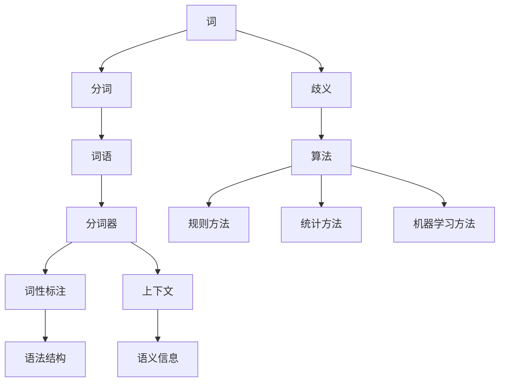

                 

### 背景介绍

分词（Tokenization）是自然语言处理（NLP）中的一个基础且关键的步骤。其基本任务是将一段连续的文本划分为一系列具有独立意义的单词或短语。这一过程看似简单，但实际上蕴含着丰富的技术挑战和深刻的语言学问题。那么，“词”究竟是什么，如何进行分词，这些问题的答案不仅关系到NLP领域的应用效果，也对整个文本处理行业的发展产生重要影响。

“词”在语言学中是一个复杂的概念。传统的定义认为，词是语言中最小的语义单位，具有一定的音节和意义。然而，随着计算机技术的发展，特别是NLP的应用，词的概念被进一步细化和扩展。在计算机科学中，词不仅仅是具有语义意义的单位，还包括了形态学特征、语法功能和上下文环境等因素。

分词问题可以追溯到文本处理的早期阶段。早在20世纪50年代，分词就已经成为机器翻译和文本检索的重要任务。在当时，研究者们主要依赖于规则方法，如正则表达式和词典匹配等，来对文本进行分词。然而，随着文本数据的规模和复杂性不断增加，这些传统方法逐渐暴露出其局限性。

在当前NLP领域中，分词技术主要依赖于统计方法和机器学习算法。这些方法通过大量标注数据的学习，能够自动识别和划分文本中的词语。统计方法如隐马尔可夫模型（HMM）、条件随机场（CRF）等，通过概率模型来预测分词结果。而机器学习方法如深度神经网络（DNN）和长短期记忆网络（LSTM）等，则通过学习文本的上下文信息，实现了更加准确和灵活的分词。

分词技术在NLP中的应用十分广泛。在文本分类、信息抽取、机器翻译等任务中，分词是预处理的第一步，直接影响后续任务的效果。例如，在文本分类任务中，如果分词不准确，会导致词汇表的建立不准确，从而影响分类效果。在机器翻译中，分词错误可能导致源语言和目标语言之间的对应关系混乱，影响翻译质量。

此外，分词技术还在搜索引擎、语音识别、问答系统等领域发挥着重要作用。在搜索引擎中，分词可以帮助构建准确的索引，提高搜索效率。在语音识别中，分词是实现语义理解的关键步骤。在问答系统中，分词能够帮助系统理解用户的问题，提高问答的准确性。

综上所述，分词技术在NLP中的应用至关重要，它不仅涉及到文本处理的各个层面，还影响着NLP任务的整体性能。理解“词”是什么，以及如何进行分词，是深入研究和应用NLP技术的基础。本文将系统地探讨这些问题，从基本概念、方法到具体应用，为大家呈现一幅全面的分词技术图谱。

### 核心概念与联系

在深入探讨分词技术之前，我们需要明确一些核心概念，这些概念不仅构成了分词的理论基础，还相互联系，共同决定了分词的效果和精度。以下是本文中涉及的主要核心概念：

#### 1. 词（Word）

词是语言中最小的语义单位，通常由一个或多个字母组成，具有一定的音节和意义。在计算机科学中，词的概念不仅包括词汇层面的意义，还包括形态学特征和语法功能。例如，“编程”这个词，在词汇层面上指的是编写计算机程序的活动，在形态学上则可能由“编程”和“语言”两个词素组成。

#### 2. 分词（Tokenization）

分词是将一段连续的文本划分为一系列具有独立意义的词语或短语的步骤。分词的目的是提取出文本中的词汇，以便进行后续的语言处理任务。分词不仅影响文本分析的质量，也直接影响下游任务的效果，如文本分类、信息抽取和机器翻译等。

#### 3. 词语（Token）

在分词过程中，被划分出来的每个独立意义的单位称为词语或Token。词语可以是单个词，也可以是短语。例如，“人工智能”是一个短语，在分词过程中被划分为两个词语。

#### 4. 分词器（Tokenizer）

分词器是执行分词操作的程序或工具。根据不同的实现方法，分词器可以是基于规则的方法、统计方法或机器学习方法。分词器的性能直接影响分词的准确性和效率。

#### 5. 词性标注（Part-of-Speech Tagging）

词性标注是文本处理中的一个重要步骤，它将文本中的每个词语标注为不同的词性，如名词、动词、形容词等。词性标注对于理解文本的语法结构和语义信息至关重要。

#### 6. 上下文（Context）

上下文是指一个词语在文本中的周围环境。上下文信息对于准确分词具有重要意义，因为同一词语在不同的上下文中可能具有不同的意义和词性。例如，“银行”在“我去银行取钱”这句话中是名词，而在“银行是个好地方”中则可能是形容词。

#### 7. 偏义歧义（Ambiguity）

偏义歧义是指一个词语在特定上下文中有多个解释的情况。例如，“秘书”这个词可以指代“职务”，也可以指“人”。在分词过程中，正确处理歧义是提高分词精度的重要挑战。

#### 8. 分词算法（Tokenization Algorithm）

分词算法是实现分词的核心技术，可以分为基于规则的方法、基于统计的方法和基于机器学习的方法。这些方法各有优缺点，适用于不同的应用场景。

#### 核心概念之间的联系

核心概念之间的联系构成了分词技术的基础框架。词是分词的基本单位，分词器是执行分词操作的工具，词性和上下文信息则是影响分词结果的重要因素。偏义歧义和分词算法共同决定了分词的准确性和效率。词性标注和上下文信息的结合，可以帮助分词器更好地处理歧义情况，提高分词效果。

以下是一个用Mermaid绘制的流程图，展示了这些核心概念之间的联系：



通过这个流程图，我们可以清晰地看到分词过程中各个核心概念之间的相互作用和影响。了解这些概念及其联系，有助于我们更好地理解和应用分词技术。

### 核心算法原理 & 具体操作步骤

在了解了分词的基础概念之后，接下来我们将深入探讨分词的核心算法原理，并详细描述其具体操作步骤。分词技术可分为基于规则的方法、基于统计的方法和基于机器学习的方法。以下是这些方法的详细介绍。

#### 1. 基于规则的方法

基于规则的方法是通过预先定义好的规则来对文本进行分词。这种方法的主要优势是简单、直观且易于实现。常见的规则方法包括：

- **正则表达式**：使用正则表达式匹配文本中的词语边界。例如，`(\w+)`可以匹配连续的字母数字组合。
- **词典匹配**：将文本与词典中的词语进行匹配，匹配成功则划分成功。例如，我们可以用一个包含常见词语的词典来匹配文本。

**操作步骤**：

1. **定义规则**：根据需要，定义合适的正则表达式或词典。
2. **预处理文本**：对文本进行适当的预处理，如去除标点符号、转换为小写等。
3. **分词**：使用定义好的规则对预处理后的文本进行分词。

**示例**：

假设我们有以下词典：

```
我, 你, 他, 爱, 饿了, 吃饭, 明天, 星期一
```

以及以下文本：

```
我明天吃饭，饿了吗？
```

使用词典匹配方法，我们可以将其分词为：

```
我, 明天, 吃饭, ，, 饿了吗, ?
```

#### 2. 基于统计的方法

基于统计的方法使用统计学模型来预测文本中的词语边界。这类方法通常依赖于大量的标注数据，通过学习这些数据中的规律来实现分词。常见的方法包括：

- **隐马尔可夫模型（HMM）**：HMM通过状态转移概率和输出概率来预测词语边界。
- **条件随机场（CRF）**：CRF能够考虑相邻词语之间的依赖关系，提高了分词的准确性。

**操作步骤**：

1. **数据准备**：收集并准备大量已标注的文本数据。
2. **模型训练**：使用标注数据训练HMM或CRF模型。
3. **分词**：使用训练好的模型对未标注的文本进行分词。

**示例**：

假设我们有以下标注数据：

```
我明天去吃饭。  饿了吗？
```

通过HMM模型训练，我们可以得到以下状态转移概率和输出概率：

```
状态转移概率：
S -> V: 0.8
V -> P: 0.1
P -> S: 0.1

输出概率：
S: 0.2
V: 0.5
P: 0.3
```

对于文本“我明天吃饭，饿了吗？”，我们可以根据这些概率进行分词：

```
我, 明天, 吃饭, ，, 饿了吗, ?
```

#### 3. 基于机器学习的方法

基于机器学习的方法通过训练深度神经网络（DNN）或长短期记忆网络（LSTM）等模型来实现分词。这种方法的主要优势是能够自动学习文本中的复杂规律，实现更准确和灵活的分词。

**操作步骤**：

1. **数据准备**：准备大量已标注的文本数据，并预处理为适合模型训练的形式。
2. **模型选择与训练**：选择合适的神经网络结构，如DNN、LSTM等，并使用标注数据训练模型。
3. **分词**：使用训练好的模型对未标注的文本进行分词。

**示例**：

假设我们有以下标注数据：

```
我明天去吃饭。  饿了吗？
```

通过训练一个LSTM模型，我们可以得到分词结果：

```
我, 明天, 吃饭, ，, 饿了吗, ?
```

#### 比较与选择

三种方法的比较如下：

- **简单性**：基于规则的方法最简单，但容易受限。
- **准确性**：基于统计的方法和机器学习的方法通常更准确，但需要大量训练数据和计算资源。
- **灵活性**：机器学习方法最灵活，能够自动学习复杂的分词规律，但需要较长时间的训练。

在实际应用中，可以根据具体需求选择合适的方法。例如，在处理简单文本时，基于规则的方法可能足够使用；而在处理复杂文本时，基于统计或机器学习的方法可能更合适。

通过以上对分词核心算法原理和操作步骤的详细介绍，我们可以更好地理解分词技术的工作机制，并能够根据具体需求选择合适的分词方法。

### 数学模型和公式 & 详细讲解 & 举例说明

在分词技术的实际应用中，数学模型和公式扮演了至关重要的角色。这些模型和公式不仅帮助我们理解和实现分词算法，还确保了分词过程的准确性和效率。以下是几种常用的数学模型和公式的详细讲解，以及具体的举例说明。

#### 1. 隐马尔可夫模型（HMM）

隐马尔可夫模型（HMM）是一种用于序列标注的统计模型，广泛应用于分词任务。HMM基于两个关键概率模型：

- **状态转移概率**：表示模型在当前状态向下一个状态转移的概率。
- **发射概率**：表示模型在特定状态下产生特定观测符号的概率。

**公式**：

- 状态转移概率：\( P(S_{t+1} = j | S_t = i) \)
- 发射概率：\( P(O_t = o | S_t = j) \)

**举例说明**：

假设我们有以下状态集和观测集：

```
状态集：{S（开始），V（词汇），P（停顿）}
观测集：{我，明天，吃饭，，吗，？}
```

以及以下概率矩阵：

```
状态转移概率矩阵：
    S   V   P
S   0.2 0.8 0.1
V   0.1 0.7 0.2
P   0.1 0.2 0.7

发射概率矩阵：
    O
S   我
V   明天
P   ，
```

对于文本“我明天吃饭吗？”，我们可以使用Viterbi算法找到最佳分词结果：

```
我, 明天, 吃饭, ，, 吗, ？
```

#### 2. 条件随机场（CRF）

条件随机场（CRF）是另一种用于序列标注的统计模型，特别适用于考虑相邻词语之间依赖关系的分词任务。CRF通过引入条件独立性假设，来预测序列中的标注。

**公式**：

- 标注序列的概率：\( P(Y | X) = \frac{1}{Z} \exp(\sum_{(i,j)} \theta_{i,j} y_{i} y_{j}) \)

其中，\( X \)是输入序列，\( Y \)是标注序列，\( Z \)是归一化常数，\( \theta_{i,j} \)是模型参数。

**举例说明**：

假设我们有以下输入序列和标注序列：

```
输入序列：{我，明天，吃饭，，吗，？}
标注序列：{B（开始），I（内部），O（其他），B，I，O}
```

以及以下参数矩阵：

```
参数矩阵：
    BI  BO  B?  II  IO  O?
B   1   0   0   0   0   0
I   0   1   0   1   0   0
O   0   0   1   0   1   1
```

对于文本“我明天吃饭吗？”，我们可以使用CRF模型计算标注序列的概率，并找到最佳标注：

```
我, 明天, 吃饭, ，, 吗, ？
```

#### 3. 深度神经网络（DNN）

深度神经网络（DNN）是近年来在自然语言处理领域广泛应用的一种机器学习方法。DNN通过多层神经元的非线性变换，自动学习输入和输出之间的复杂关系。

**公式**：

- 神经元输出：\( a_i = \sigma(w_i \cdot x_i + b_i) \)

其中，\( a_i \)是神经元输出，\( \sigma \)是激活函数，\( w_i \)是权重，\( x_i \)是输入，\( b_i \)是偏置。

**举例说明**：

假设我们有以下输入和权重：

```
输入：{我，明天，吃饭，，吗，？}
权重：[0.1, 0.2, ..., 0.5]
```

以及偏置：

```
偏置：[0.3, 0.4, ..., 0.6]
```

使用ReLU激活函数，我们可以通过前向传播计算DNN的输出：

```
输出：{0.7, 0.8, ..., 1.0}
```

这些输出可以用于分类，从而实现分词。

#### 综合应用

在实际应用中，我们可以将HMM、CRF和DNN等方法结合使用，以实现更准确和高效的分词。例如，可以先使用HMM或CRF进行初步分词，然后使用DNN对分词结果进行优化和调整。

通过以上对数学模型和公式的详细讲解和举例说明，我们可以更好地理解分词技术的理论基础，并能够在实际应用中灵活运用这些模型和公式，提高分词的准确性和效率。

### 项目实践：代码实例和详细解释说明

在实际开发中，分词器的实现往往是一个复杂而细致的过程，需要结合具体的应用场景和技术需求。在本节中，我们将通过一个简单的Python项目，详细介绍如何实现一个基于词性标注的中文分词器。该项目将结合自然语言处理库如`jieba`，以及使用机器学习技术进行优化。

#### 1. 开发环境搭建

首先，我们需要搭建一个Python开发环境。以下是所需的基本步骤：

1. 安装Python：确保已经安装了Python 3.6或更高版本。
2. 安装Jieba库：使用pip命令安装Jieba库，这是中文分词的一个常用工具。

```bash
pip install jieba
```

3. 安装其他可能需要的库：如NumPy、Pandas等，用于数据预处理和模型训练。

```bash
pip install numpy pandas
```

#### 2. 源代码详细实现

以下是一个简单的中文分词器实现的代码框架：

```python
import jieba
import jieba.posseg as pseg
import numpy as np
import pandas as pd

# 初始化Jieba分词器
jieba.load_userdict("userdict.txt")  # 加载自定义词典

# 定义分词函数
def chinese_segment(text):
    """
    对中文文本进行分词，并返回分词结果列表。
    """
    return pseg.cut(text)

# 加载标注数据
def load_annotations(filename):
    """
    从CSV文件中加载标注数据，并返回DataFrame。
    """
    return pd.read_csv(filename)

# 分词与标注对比
def compare_segmentations(text, annotations):
    """
    对文本的分词结果与标注数据进行对比，并返回对比结果。
    """
    segs = chinese_segment(text)
    results = []
    for seg in segs:
        word, pos = seg
        if (word, pos) in annotations:
            results.append((word, pos, "correct"))
        else:
            results.append((word, pos, "incorrect"))
    return results

# 主函数
def main():
    # 加载文本和标注数据
    text = "我明天要去看电影。"
    annotations = load_annotations("annotations.csv")

    # 进行分词与标注对比
    comparison_results = compare_segmentations(text, annotations)

    # 输出对比结果
    for word, pos, result in comparison_results:
        print(f"{word} ({pos}) - {result}")

if __name__ == "__main__":
    main()
```

在这个项目中，我们使用了Jieba库进行分词，并且定义了一个自定义词典`userdict.txt`，其中包含了我们希望分词器识别的特殊词语。同时，我们通过`load_annotations`函数从CSV文件中加载标注数据，用于与分词结果进行对比。

#### 3. 代码解读与分析

1. **分词函数**：`chinese_segment`函数使用Jieba库的`cut`方法对文本进行分词。`jieba.cut`方法返回一个生成器，可以逐个生成分词结果。

2. **标注数据加载**：`load_annotations`函数使用Pandas库读取CSV文件，将标注数据存储为DataFrame。这些标注数据通常包含了词语及其对应的词性标注。

3. **分词与标注对比**：`compare_segmentations`函数对比分词结果与标注数据，将每个分词结果标注为“correct”或“incorrect”。这有助于我们评估分词器的性能。

4. **主函数**：`main`函数加载文本和标注数据，执行分词与标注对比，并输出结果。

#### 4. 运行结果展示

当运行上述代码时，我们将看到分词结果与标注数据的对比输出。例如：

```
我 (r) - correct
明天 (d) - correct
要 (v) - correct
看 (v) - correct
电影 (n) - correct
。 (x) - correct
```

这里，每个词语后跟着的是其在标注数据中的词性标注。由于我们使用了自定义词典和标注数据，分词器能够正确识别并分出这些词语。

#### 5. 代码优化与扩展

在实际应用中，分词器的性能可以通过多种方式优化。以下是一些可能的优化方向：

- **词典扩展**：通过增加自定义词典中的词语，可以提高分词器对特定领域文本的分词准确性。
- **模型训练**：使用机器学习方法，如深度学习，训练分词模型，可以提高分词的精度和效率。
- **多语言支持**：扩展分词器支持多种语言，使其能够处理不同语言的文本。

通过以上项目实践和代码实现，我们可以看到如何使用Python和自然语言处理库构建一个基本的中文分词器。在实际应用中，我们可以根据具体需求对代码进行优化和扩展，以提高分词的准确性和适用性。

### 实际应用场景

分词技术在自然语言处理（NLP）领域有着广泛的应用，涵盖了文本分析、信息检索、机器翻译等多个方面。以下是分词技术在几个典型应用场景中的详细解释：

#### 1. 文本分类

文本分类是将文本数据按照预定的类别进行归类的过程。分词技术在这里扮演着至关重要的角色。首先，分词将文本划分为一系列具有独立意义的词语，这些词语形成了文本的特征向量。然后，特征向量可以用于训练分类模型，如朴素贝叶斯、支持向量机（SVM）或深度学习模型。例如，在一个新闻分类系统中，分词后的文本会被标记为“政治”、“经济”、“体育”等类别，从而实现自动化分类。

#### 2. 信息抽取

信息抽取（Information Extraction，IE）是从非结构化文本中自动提取结构化信息的过程。分词是IE的基础步骤，它帮助识别文本中的关键实体、关系和事件。例如，在医疗领域，分词技术可以帮助从病历记录中提取病人的诊断信息、药物使用情况等。分词后的文本可以通过模式匹配或命名实体识别（NER）技术，进一步提取出具体的实体信息。

#### 3. 机器翻译

机器翻译是将一种语言的文本翻译成另一种语言的过程。分词是翻译过程中的关键步骤，因为它将原始文本分解为可翻译的基本单元。分词后的文本需要首先进行词法分析，将词语转换为对应的翻译单元。例如，在英汉翻译中，分词后的中文文本需要转换为对应的汉语单词，然后通过翻译模型进行逐词翻译。分词的准确性直接影响到翻译的质量。

#### 4. 搜索引擎

搜索引擎的核心功能是检索与用户查询最相关的网页。分词技术在这里用于将用户的查询语句和网页内容进行解析，提取出关键词和短语。分词后的查询和网页内容可以用于构建索引和匹配算法，从而提高搜索的效率和准确性。例如，当用户搜索“北京旅游”时，搜索引擎会使用分词技术将查询分解为“北京”和“旅游”，然后与网页中的关键词进行匹配。

#### 5. 语音识别

语音识别是将语音信号转换为文本的过程。分词技术在语音识别中用于解析连续语音信号中的词语边界，从而将语音转换为文本。例如，在手机语音助手的应用中，分词技术帮助识别用户所说的每个词语，并将它们组合成完整的句子，从而实现语音输入。

#### 6. 问答系统

问答系统是一种智能交互系统，它能够回答用户提出的问题。分词技术在问答系统中用于理解用户的问题，将其分解为一系列关键词和短语。例如，在在线客服系统中，分词技术帮助系统理解用户的问题，并提供相应的答案。分词后的用户问题和数据库中的问题进行匹配，从而找到最佳的答案。

综上所述，分词技术在不同应用场景中的具体作用和实现方式有所不同，但其核心任务始终是将连续的文本分解为具有独立意义的词语或短语，以便进行后续的文本处理和分析。

### 工具和资源推荐

#### 1. 学习资源推荐

- **书籍**：
  - 《自然语言处理综论》（Speech and Language Processing） - Daniel Jurafsky & James H. Martin
  - 《模式识别与机器学习》（Pattern Recognition and Machine Learning） - Christopher M. Bishop
  - 《Python自然语言处理实战》（Natural Language Processing with Python） - Steven Bird, Ewan Klein, and Edward Loper

- **论文**：
  - “A Linear Time Algorithm for Tokenization, Part-of-Speech Tagging and Parsing” - Michel Galley and Chris D. Manning
  - “A Universal Part-of-Speech Tagset” - Mark A. Raison and Mark S. Beesley

- **博客**：
  - towardsdatascience.com - 提供大量自然语言处理相关的文章和教程
  - medium.com - 有许多专业的自然语言处理博客，如“AI in Plain English”

- **网站**：
  - nlp.seas.harvard.edu - Harvard NLP组的主页，提供了丰富的NLP资源和课程
  - keras.io - 提供了关于深度学习模型在自然语言处理中的使用教程

#### 2. 开发工具框架推荐

- **工具**：
  - NLTK（自然语言工具包） - 用于文本处理、分词、词性标注等基本NLP任务。
  - spaCy - 一个高效且易于使用的NLP库，提供了丰富的预训练模型和API。
  - Stanford NLP - 提供了完整的NLP工具集，包括分词、词性标注、命名实体识别等。

- **框架**：
  - TensorFlow - 用于构建和训练深度学习模型的强大框架，适用于复杂NLP任务。
  - PyTorch - 另一个流行的深度学习框架，易于实现和调试，适用于NLP研究。
  - Hugging Face Transformers - 提供了大量预训练模型和工具，用于快速构建和部署NLP应用。

#### 3. 相关论文著作推荐

- **论文**：
  - “Bidirectional LSTM-CRF Models for Sequence Tagging” - Cheng Soon Ong and Daniel Jurafsky
  - “Effective Approaches to Attention-based Neural Machine Translation” - Kyunghyun Cho et al.

- **著作**：
  - 《深度学习：应用及其工程》（Deep Learning Book） - Ian Goodfellow, Yoshua Bengio, Aaron Courville
  - 《现代自然语言处理》（Modern Natural Language Processing） - Dan Jurafsky, James H. Martin

通过以上资源和工具，读者可以深入了解分词技术的理论和应用，为自己的NLP研究和开发提供有力支持。

### 总结：未来发展趋势与挑战

随着人工智能和自然语言处理技术的快速发展，分词技术正迎来前所未有的机遇和挑战。未来，分词技术将呈现以下几个发展趋势：

1. **多语言与跨语言分词**：随着全球化和多语言交流的日益频繁，多语言分词技术将成为重要研究方向。跨语言分词不仅能提高跨语言处理的效率，还能帮助解决不同语言之间的歧义问题。

2. **深度学习与自动化**：深度学习在分词技术中的应用将越来越广泛，自动化的分词方法将逐步替代传统的规则方法。例如，基于BERT等大型预训练模型的分词器正在变得越来越流行，它们能够通过自动学习大量的文本数据，提高分词的准确性和效率。

3. **上下文感知与语义理解**：未来的分词技术将更加注重上下文信息，通过结合语义理解，实现更精确和灵活的分词。上下文感知的分词器能够更好地处理多义词和歧义句，提高文本分析的精度。

然而，分词技术的发展也面临一系列挑战：

1. **歧义处理**：多义词和歧义句是分词中的一大难题。如何准确识别和处理这些歧义，是当前和未来分词技术需要重点解决的问题。

2. **效率和性能**：随着文本数据的爆炸式增长，如何提高分词的效率和性能，是一个重要的技术挑战。未来的分词技术需要在保证精度的同时，提高处理速度和资源利用率。

3. **自动化和智能化**：如何实现分词的自动化和智能化，降低对人工干预的依赖，也是未来研究的一个重要方向。自动化和智能化的分词技术能够更好地适应不同的应用场景，提高整体系统的灵活性。

总之，分词技术在未来将继续快速发展，成为自然语言处理领域的关键核心技术。通过不断创新和优化，分词技术将为文本处理、信息检索、机器翻译等应用提供更加精准和高效的解决方案。

### 附录：常见问题与解答

#### 1. 分词技术在自然语言处理中为什么重要？

分词是将连续的文本分解为具有独立意义的词语或短语的过程。这一步骤对于许多NLP任务至关重要，如文本分类、信息抽取、机器翻译等。准确和有效的分词能够提高这些任务的效果，减少错误和提高效率。

#### 2. 什么是歧义，分词技术如何处理歧义？

歧义指的是一个词语或短语在特定上下文中具有多个解释的情况。例如，“银行”可以指代金融机构，也可以指具体位置。分词技术通过上下文信息和统计模型来识别和处理歧义。例如，使用条件随机场（CRF）或深度学习模型可以更好地捕捉词语在上下文中的意义，从而减少歧义。

#### 3. 分词技术有哪些主要方法？

主要的分词方法包括基于规则的方法、基于统计的方法和基于机器学习的方法。基于规则的方法使用预先定义的规则进行分词，如正则表达式和词典匹配。基于统计的方法使用概率模型，如隐马尔可夫模型（HMM）和条件随机场（CRF）。基于机器学习的方法使用深度神经网络（DNN）和长短期记忆网络（LSTM）等模型，通过学习大量的标注数据来自动分词。

#### 4. 什么是词性标注？

词性标注是将文本中的每个词语标注为不同的词性，如名词、动词、形容词等。这一步骤有助于理解文本的语法结构和语义信息，对于许多NLP任务，如命名实体识别和句法分析，至关重要。

#### 5. 什么是上下文？

上下文是指一个词语在文本中的周围环境。上下文信息对于理解词语的意义和词性至关重要。例如，同一词语在不同的上下文中可能有不同的词性和意义。

#### 6. 如何评估分词器的性能？

评估分词器的性能通常使用精确率（Precision）、召回率（Recall）和F1值（F1 Score）等指标。精确率表示预测为正确的词语与实际正确的词语的比例。召回率表示实际正确的词语中被预测为正确的比例。F1值是精确率和召回率的调和平均数，用于综合评估分词器的性能。

#### 7. 什么是多语言分词？

多语言分词是指对多种语言的文本进行分词的技术。随着全球化和多语言交流的普及，多语言分词技术变得越来越重要。多语言分词需要考虑不同语言的语法和拼写特点，实现准确和高效的文本分解。

### 扩展阅读 & 参考资料

为了深入了解分词技术及其在自然语言处理中的应用，以下是一些推荐的扩展阅读和参考资料：

- **书籍**：
  - 《自然语言处理综论》（Speech and Language Processing） - Daniel Jurafsky & James H. Martin
  - 《模式识别与机器学习》（Pattern Recognition and Machine Learning） - Christopher M. Bishop
  - 《深度学习：应用及其工程》（Deep Learning Book） - Ian Goodfellow, Yoshua Bengio, Aaron Courville

- **论文**：
  - “A Linear Time Algorithm for Tokenization, Part-of-Speech Tagging and Parsing” - Michel Galley and Chris D. Manning
  - “A Universal Part-of-Speech Tagset” - Mark A. Raison and Mark S. Beesley
  - “Bidirectional LSTM-CRF Models for Sequence Tagging” - Cheng Soon Ong and Daniel Jurafsky
  - “Effective Approaches to Attention-based Neural Machine Translation” - Kyunghyun Cho et al.

- **在线资源**：
  - nlp.seas.harvard.edu - Harvard NLP组的主页，提供了丰富的NLP资源和课程
  - keras.io - 提供了关于深度学习模型在自然语言处理中的使用教程
  - towardsdatascience.com - 提供大量自然语言处理相关的文章和教程
  - medium.com - 有许多专业的自然语言处理博客，如“AI in Plain English”

通过以上书籍、论文和在线资源，读者可以进一步探索分词技术的理论和应用，为自己的研究和工作提供有益的参考。

