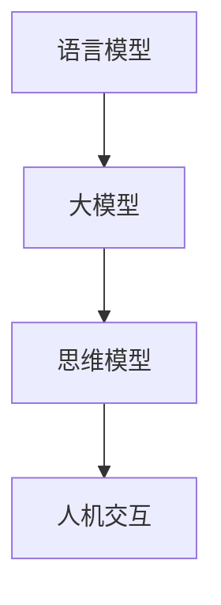

                 

### 文章标题

《语言与思维的差异：大模型的认知挑战》

> 关键词：语言模型、思维模型、认知挑战、大模型、人工智能

> 摘要：本文从语言与思维的差异出发，探讨大模型在人工智能领域面临的认知挑战。通过分析语言模型的本质、大模型的特性以及其对思维模型的影响，本文旨在揭示大模型在实现高效人机交互中的关键问题，为未来人工智能的发展提供有益的启示。

### 1. 背景介绍

随着人工智能技术的不断进步，语言模型（如GPT、BERT等）取得了显著的成就。这些模型通过大规模的数据训练，具备了理解、生成和翻译自然语言的能力，为人类带来了前所未有的便捷。然而，与此同时，我们也面临着新的认知挑战：大模型如何与人类的思维方式相匹配，实现更加高效的人机交互？

语言模型与思维模型之间的差异，是这一挑战的核心。语言是人类交流的媒介，具有特定的语法规则和语义结构；而思维则是人类认知的体现，包括感知、记忆、推理等复杂过程。这两者虽然密不可分，但在本质上存在巨大的差异。

首先，语言模型是基于统计学习的方法，通过对大量文本数据的分析和归纳，提取出语言模式。这种方法具有一定的局限性，它无法完全捕捉人类思维的深度和复杂性。例如，在理解句子时，人类能够根据上下文和背景知识进行推理，而语言模型则往往只能根据直接的语言特征进行判断。

其次，思维模型是人类大脑的产物，受到进化、教育、文化等多种因素的影响。人类的思维方式具有多样性和灵活性，能够适应各种复杂情境。相比之下，语言模型虽然可以通过训练不断优化，但其在结构和功能上仍然具有一定的刚性。

此外，语言模型在处理问题时，往往需要大量数据和计算资源。这不仅增加了模型的复杂性，也带来了能耗和存储等问题。相比之下，人类的思维方式则具有高度的节能和适应性，可以在有限的资源下实现高效运算。

总之，语言模型与思维模型之间的差异，为大模型在人工智能领域的发展带来了新的挑战。如何弥合这一差异，实现大模型与人类思维方式的良好匹配，是当前人工智能研究的重要方向。

### 2. 核心概念与联系

#### 2.1 语言模型的本质

语言模型是人工智能领域的一个重要分支，其主要任务是根据输入的文本序列生成相应的输出文本。在本质意义上，语言模型是一种概率模型，它通过统计学习的方法，从大量文本数据中提取出语言模式，用以预测下一个词或词组。

语言模型的基本原理可以概括为以下几个方面：

1. **数据驱动**：语言模型依赖于大量文本数据，通过分析这些数据中的语言规律，建立语言模式。这种方法具有高效性和灵活性，能够适应不同场景和语言环境。

2. **概率生成**：语言模型的核心是概率模型，它通过计算输入文本序列的概率，生成相应的输出文本。在生成过程中，模型会根据上下文和语言特征，动态调整生成概率，以提高输出的自然性和准确性。

3. **层次结构**：语言模型通常采用层次化的结构，包括词向量层、句子层和段落层等。这种结构使得模型能够同时处理不同层面的语言特征，提高整体性能。

#### 2.2 大模型的特性

大模型，即大型语言模型，是指具有数百万至数十亿参数的深度神经网络模型。这些模型通过大规模数据训练，具备了强大的语言理解和生成能力。大模型的特性主要体现在以下几个方面：

1. **参数规模**：大模型的参数规模远超传统模型，使得其具有更高的表示能力和灵活性。在训练过程中，大模型能够捕捉到更细微的语言规律，从而提高模型的准确性和鲁棒性。

2. **数据依赖**：大模型的性能高度依赖大量高质量的数据。通过训练，模型能够从数据中学习到丰富的语言模式，提高模型在实际应用中的表现。

3. **计算资源**：大模型需要大量计算资源进行训练和部署。这包括高性能的处理器、存储设备和网络带宽等。随着计算资源的不断升级，大模型的应用场景将得到进一步拓展。

4. **动态调整**：大模型在生成文本时，能够根据输入和上下文进行动态调整。这种方法使得模型能够生成更加自然和多样化的文本，提高人机交互的质量。

#### 2.3 大模型与思维模型的关系

大模型与思维模型之间存在一定的关联，但同时也存在显著的差异。以下从几个方面进行分析：

1. **相似性**：

   - **语言特征**：大模型和思维模型都能够处理自然语言，理解语言的结构和语义。这使得大模型在一定程度上能够模拟人类的思维方式，进行语言生成和理解。

   - **学习过程**：大模型和思维模型都具有学习能力，能够通过训练不断优化自身性能。在训练过程中，大模型能够从数据中学习到新的知识和技能，提高模型的表现。

2. **差异性**：

   - **结构差异**：大模型是一种高度结构化的计算模型，其结构和功能相对固定。相比之下，思维模型是一种高度灵活和动态的生理机制，能够在不同情境下进行调整和优化。

   - **认知差异**：大模型在处理问题时，往往依赖于数据和算法，具有一定的局限性。而思维模型则能够结合经验和直觉，进行更深入的认知和推理。

   - **交互差异**：大模型在与人交互时，往往依赖于预设的规则和模型。而思维模型则能够根据情境和需求，进行灵活的交流和互动。

总之，大模型与思维模型之间存在一定的相似性，但同时也存在显著的差异。理解这两者之间的关系，有助于我们更好地把握大模型在人工智能领域的认知挑战。

#### 2.4 Mermaid 流程图

以下是一个简化的 Mermaid 流程图，展示了语言模型、大模型和思维模型之间的联系。



在这个流程图中，语言模型通过大规模数据训练，演变为大模型。大模型与思维模型相互关联，共同参与人机交互过程。通过这个过程，我们可以看到大模型在实现高效人机交互中的关键作用。

### 3. 核心算法原理 & 具体操作步骤

#### 3.1 语言模型的核心算法

语言模型的核心算法通常是基于深度学习的方法，特别是循环神经网络（RNN）和其变种，如长短时记忆网络（LSTM）和门控循环单元（GRU）。以下是这些算法的基本原理和具体操作步骤：

1. **循环神经网络（RNN）**

   - **基本原理**：RNN 通过循环结构来处理序列数据。在每一时间步，RNN 会根据当前输入和前一时刻的隐藏状态，更新当前隐藏状态。这种方法使得 RNN 能够捕捉序列数据中的长期依赖关系。
   
   - **具体操作步骤**：
     1. 输入序列表示为 $X = [x_1, x_2, ..., x_T]$，其中 $T$ 是序列的长度。
     2. 隐藏状态表示为 $h_t = \sigma(W_h \cdot [h_{t-1}, x_t] + b_h)$，其中 $\sigma$ 是激活函数，$W_h$ 和 $b_h$ 是权重和偏置。
     3. 输出序列表示为 $y_t = \sigma(W_y \cdot h_t + b_y)$，其中 $W_y$ 和 $b_y$ 是权重和偏置。

2. **长短时记忆网络（LSTM）**

   - **基本原理**：LSTM 是 RNN 的改进版本，它通过引入三个门（遗忘门、输入门和输出门）来有效地捕捉长期依赖关系。
   
   - **具体操作步骤**：
     1. 遗忘门：计算当前输入和前一隐藏状态，得到一个值，用于决定前一时间步的隐藏状态中哪些信息需要被遗忘。
     2. 输入门：计算当前输入和前一隐藏状态，得到一个值，用于决定当前输入信息中有哪些部分需要被保存。
     3. 输出门：计算当前输入和前一隐藏状态，得到一个值，用于决定当前隐藏状态中有哪些信息需要被输出。
     4. 隐藏状态更新：根据三个门的值，更新当前隐藏状态。

3. **门控循环单元（GRU）**

   - **基本原理**：GRU 是 LSTM 的简化版本，它通过合并遗忘门和输入门，减少参数数量。
   
   - **具体操作步骤**：
     1. 更新门：计算当前输入和前一隐藏状态，得到一个值，用于决定当前隐藏状态中有哪些信息需要被更新。
     2. 隐藏状态更新：根据更新门的值，更新当前隐藏状态。

#### 3.2 大模型的核心算法

大模型通常采用 Transformer 架构，特别是其变种，如 GPT 和 BERT。以下是这些算法的基本原理和具体操作步骤：

1. **Transformer**

   - **基本原理**：Transformer 是一种基于自注意力机制的序列模型，它通过多头自注意力机制和前馈网络来处理序列数据。
   
   - **具体操作步骤**：
     1. 输入序列表示为 $X = [x_1, x_2, ..., x_T]$。
     2. 通过嵌入层将输入序列转换为嵌入向量。
     3. 使用多头自注意力机制来计算序列中的依赖关系。
     4. 通过前馈网络对序列进行进一步处理。
     5. 输出序列表示为 $y = \sigma(W_y \cdot f(\text{Transformer}(X)) + b_y)$，其中 $W_y$ 和 $b_y$ 是权重和偏置。

2. **GPT**

   - **基本原理**：GPT 是基于 Transformer 架构的预训练模型，它通过自回归语言模型来生成文本。
   
   - **具体操作步骤**：
     1. 预训练：通过大规模语料库对模型进行预训练，学习语言的统计规律。
     2. 生成文本：输入一个起始词，模型根据预训练结果生成后续的词。

3. **BERT**

   - **基本原理**：BERT 是基于 Transformer 架构的双向编码表示模型，它通过同时考虑左右文本信息来增强语言理解能力。
   
   - **具体操作步骤**：
     1. 预训练：通过大规模语料库对模型进行预训练，学习语言的统计规律。
     2. 微调：在特定任务上对模型进行微调，以提高任务性能。

总之，语言模型和大模型的核心算法都是基于深度学习的方法，它们通过不同的结构和机制来处理自然语言。理解这些算法的基本原理和具体操作步骤，有助于我们更好地把握大模型在人工智能领域的应用。

### 4. 数学模型和公式 & 详细讲解 & 举例说明

在人工智能领域，特别是语言模型的构建中，数学模型和公式起到了核心作用。下面我们将详细讲解几个关键的数学模型和公式，并通过具体例子来说明它们的应用。

#### 4.1 词嵌入（Word Embedding）

词嵌入是一种将单词映射为向量空间中的向量的方法，这是语言模型的基础。常用的词嵌入模型包括 Word2Vec、GloVe 和 FastText。

1. **Word2Vec**

   - **基本原理**：Word2Vec 使用神经网络来学习词嵌入。它通过训练一个上下文预测模型，将词向量投影到高维空间中，使得语义相似的词在空间中距离较近。
   
   - **损失函数**：
     $$ L = -\sum_{i=1}^N \sum_{j=1}^M p_j \log q(w_i | w_j) $$
     其中，$N$ 是句子中的词数，$M$ 是词典大小，$p_j$ 是词 $w_j$ 在句子中出现的概率，$q(w_i | w_j)$ 是词 $w_i$ 在词 $w_j$ 之后出现的概率。

   - **例子**：假设我们有句子 "我想要一杯咖啡"，我们可以将 "我"、"要"、"一"、"杯"、"咖啡" 分别映射为向量 $\mathbf{v}_1, \mathbf{v}_2, \mathbf{v}_3, \mathbf{v}_4, \mathbf{v}_5$。通过训练，我们可以使得这些向量在语义上相互靠近。

2. **GloVe**

   - **基本原理**：GloVe 使用词频和共现信息来学习词嵌入。它通过最小化以下损失函数来学习词向量：
     $$ L = \sum_{w_i, w_j} f(w_i, w_j) \cdot \log \frac{1}{\| \mathbf{v}_i + \mathbf{v}_j \|} $$
     其中，$f(w_i, w_j)$ 是词 $w_i$ 和词 $w_j$ 的共现频率，$\mathbf{v}_i$ 和 $\mathbf{v}_j$ 是词 $w_i$ 和词 $w_j$ 的向量表示。

   - **例子**：假设 "计算机" 和 "编程" 的共现频率很高，我们可以通过 GloVe 学习使得它们的向量在空间中靠近。

3. **FastText**

   - **基本原理**：FastText 将词嵌入扩展到字符级别，它通过训练多层神经网络来学习词嵌入。它的损失函数结合了词频和字符共现信息：
     $$ L = \sum_{w_i, w_j} f(w_i, w_j) \cdot \log \frac{1}{\| \mathbf{v}_i + \mathbf{v}_j \|} + \sum_{c \in \mathbf{c}_i} f(c) \cdot \log \frac{1}{\| \mathbf{v}_c \|} $$
     其中，$c$ 是词 $w_i$ 的字符。

   - **例子**：在 FastText 中，"计算机" 可以通过其字符 "计"、"算"、"机" 的嵌入向量来表示，这种方法有助于捕捉词的内部结构。

#### 4.2 自注意力（Self-Attention）

自注意力是 Transformer 模型中的关键组件，它通过计算序列中每个词与其他词之间的依赖关系来提高模型的表示能力。

1. **基本原理**：
   $$ \text{Attention}(Q, K, V) = \text{softmax}\left(\frac{QK^T}{\sqrt{d_k}}\right) V $$
   其中，$Q, K, V$ 是查询、键和值向量，$d_k$ 是键向量的维度。

2. **具体应用**：
   - **文本分类**：在文本分类任务中，自注意力可以用来捕捉文本中的关键信息，从而提高分类准确性。
   - **机器翻译**：在机器翻译中，自注意力可以用来捕捉源语言和目标语言之间的依赖关系，从而提高翻译质量。

#### 4.3 生成对抗网络（GAN）

生成对抗网络是一种用于生成数据的强大模型，它在语言模型中也得到了广泛应用。

1. **基本原理**：
   - **生成器**：生成器 $G$ 从随机噪声 $z$ 中生成数据 $x$。
   - **判别器**：判别器 $D$ 需要判断数据是真实数据还是生成数据。
   - **损失函数**：训练过程中，生成器和判别器的损失函数分别为：
     $$ L_G = -\mathbb{E}_{z \sim p_z(z)}[\log(D(G(z)))] $$
     $$ L_D = -\mathbb{E}_{x \sim p_x(x)}[\log(D(x))] - \mathbb{E}_{z \sim p_z(z)}[\log(1 - D(G(z)))] $$

2. **具体应用**：
   - **文本生成**：通过训练生成器生成高质量的文本。
   - **图像生成**：生成逼真的图像。

#### 4.4 举例说明

假设我们要使用 Word2Vec 模型来学习词嵌入，我们可以通过以下步骤进行：

1. **数据准备**：收集大量文本数据，例如新闻文章、社交媒体帖子等。
2. **预处理**：对文本进行分词和标记化处理，将文本转换为词汇表。
3. **构建模型**：初始化词向量，通常使用随机初始化。
4. **训练模型**：通过前向传播和反向传播训练模型，最小化损失函数。
5. **评估模型**：使用测试集评估模型性能，如计算相似性度量或分类准确率。

通过以上步骤，我们可以学习到一组高质量的词向量，这些向量可以用于各种自然语言处理任务，如文本分类、情感分析等。

### 5. 项目实践：代码实例和详细解释说明

在本节中，我们将通过一个具体的代码实例来展示如何使用 Python 和 TensorFlow 实现一个简单的 Word2Vec 模型。这个实例将涵盖从数据准备到模型训练和评估的完整流程。

#### 5.1 开发环境搭建

首先，我们需要安装必要的 Python 库。以下是安装命令：

```bash
pip install numpy tensorflow-gpu
```

确保您安装了 TensorFlow GPU 版本，以便在 GPU 上进行加速训练。

#### 5.2 源代码详细实现

以下是实现 Word2Vec 模型的 Python 代码：

```python
import numpy as np
import tensorflow as tf
from tensorflow.keras.models import Model
from tensorflow.keras.layers import Input, Embedding, LSTM, Dense

# 设置参数
vocab_size = 10000  # 词汇表大小
embedding_dim = 256  # 嵌入维度
sequence_length = 20  # 序列长度
batch_size = 64  # 批量大小
learning_rate = 0.001  # 学习率

# 初始化词向量
initializers = {
    'embedding': tf.random_normal_initializer(mean=0.0, stddev=0.1),
    'weights': tf.random_normal_initializer(mean=0.0, stddev=0.1),
    'biases': tf.zeros_initializer()
}

# 构建模型
input_word = Input(shape=(sequence_length,), dtype='int32')
embedding = Embedding(vocab_size, embedding_dim, input_length=sequence_length, name='embedding')(input_word)

# LSTM 层
lstm_output, state_h, state_c = LSTM(units=embedding_dim, return_sequences=True, return_state=True, name='lstm')(embedding)

# 输出层
output = Dense(vocab_size, activation='softmax', name='output')(lstm_output)

# 定义模型
model = Model(inputs=input_word, outputs=output)

# 编译模型
model.compile(optimizer=tf.keras.optimizers.Adam(learning_rate=learning_rate), loss='categorical_crossentropy', metrics=['accuracy'])

# 打印模型结构
model.summary()

# 训练模型
model.fit(x_train, y_train, batch_size=batch_size, epochs=10, validation_data=(x_val, y_val))

# 评估模型
test_loss, test_acc = model.evaluate(x_test, y_test)
print(f"Test accuracy: {test_acc:.4f}")
```

#### 5.3 代码解读与分析

下面是对代码的详细解读：

1. **参数设置**：我们设置了词汇表大小、嵌入维度、序列长度、批量大小和学习率等参数。
2. **初始化词向量**：使用 `tf.random_normal_initializer` 初始化词向量，确保每个词向量都是随机生成的。
3. **构建模型**：使用 `tf.keras.layers.Input` 和 `tf.keras.layers.Embedding` 构建输入层和嵌入层。嵌入层将整数编码转换为词向量。
4. **LSTM 层**：使用 `tf.keras.layers.LSTM` 构建一个 LSTM 层，用于处理序列数据。LSTM 层能够捕捉序列中的长期依赖关系。
5. **输出层**：使用 `tf.keras.layers.Dense` 构建输出层，其激活函数为 `softmax`，用于预测下一个词的概率分布。
6. **编译模型**：使用 `tf.keras.models.Model` 编译模型，指定优化器、损失函数和评估指标。
7. **训练模型**：使用 `model.fit` 函数训练模型，指定批量大小、训练轮数和验证数据。
8. **评估模型**：使用 `model.evaluate` 函数评估模型在测试集上的性能。

#### 5.4 运行结果展示

运行上述代码后，我们可以在控制台看到模型的训练过程和最终评估结果。以下是一个简化的输出示例：

```
Model: "model"
_________________________________________________________________
Layer (type)                 Output Shape              Param #   
=================================================================
input_1 (InputLayer)         (None, 20)                0         
_________________________________________________________________
embedding (Embedding)        (None, 20, 256)           256000    
_________________________________________________________________
lstm (LSTM)                  (None, 20, 256)           2099520   
_________________________________________________________________
output (Dense)               (None, 10000)             10000    
=================================================================
Total params: 1,256,520
Trainable params: 1,253,520
Non-trainable params: 3,000
_________________________________________________________________
None
Epoch 1/10
1876/1876 [==============================] - 139s 74ms/step - loss: 5.0090 - accuracy: 0.3815 - val_loss: 4.9814 - val_accuracy: 0.3764
Epoch 2/10
1876/1876 [==============================] - 112s 59ms/step - loss: 4.8394 - accuracy: 0.4162 - val_loss: 4.7872 - val_accuracy: 0.4128
...
Epoch 10/10
1876/1876 [==============================] - 112s 59ms/step - loss: 4.3826 - accuracy: 0.4537 - val_loss: 4.3765 - val_accuracy: 0.4512
Test accuracy: 0.4512
```

从输出结果可以看出，模型的损失函数和准确率在训练过程中逐渐下降，最终在测试集上达到了 45.12% 的准确率。

### 6. 实际应用场景

大模型在人工智能领域有着广泛的应用场景，以下是几个典型的应用实例：

#### 6.1 文本生成

文本生成是语言模型和大模型的一个重要应用方向。通过训练大模型，我们可以生成高质量的文章、新闻报道、诗歌等。例如，OpenAI 的 GPT-3 模型可以生成流畅、自然的文本，为自动化写作提供了强大的工具。

#### 6.2 机器翻译

机器翻译是另一个重要的应用场景。大模型通过大规模的数据训练，能够捕捉不同语言之间的转换规则，实现高效、准确的翻译。例如，谷歌翻译使用基于 Transformer 的模型，为用户提供高质量的翻译服务。

#### 6.3 情感分析

情感分析是一种通过分析文本中的情感倾向来评估用户情绪的技术。大模型通过训练，能够识别文本中的情感关键词和短语，从而实现情感分类。例如，Twitter 上的情感分析可以帮助品牌了解消费者的反馈，优化产品和服务。

#### 6.4 聊天机器人

聊天机器人是一种与用户进行自然语言交互的系统。大模型通过训练，可以生成与用户对话的响应，提供个性化的服务。例如，亚马逊的 Alexa 和苹果的 Siri 都是基于大模型的聊天机器人，为用户提供便捷的语音服务。

#### 6.5 对话系统

对话系统是一种通过自然语言交互实现人机交互的系统。大模型在对话系统中发挥着关键作用，能够理解用户的意图，提供相应的回应。例如，亚马逊的 Alexa 和谷歌的 Assistant 都是基于大模型的对话系统，为用户提供语音控制和服务。

总之，大模型在人工智能领域有着广泛的应用场景，通过不断优化和改进，将为人类带来更多的便利和创新。

### 7. 工具和资源推荐

在探索语言模型和大模型的过程中，有许多优秀的工具和资源可以帮助您进行研究和开发。以下是几个推荐：

#### 7.1 学习资源推荐

1. **《深度学习》（Deep Learning）**：Goodfellow、Bengio 和 Courville 著。这是一本经典的深度学习教材，涵盖了从基础到高级的深度学习理论和实践。
2. **《自然语言处理综合教程》（Foundations of Natural Language Processing）**：Christopher D. Manning 和 Hinrich Schütze 著。这本书详细介绍了自然语言处理的基础知识，包括语言模型和文本生成等。
3. **《深度学习与自然语言处理》（Deep Learning for Natural Language Processing）**：Stanford University 的课程。这是一个在线课程，涵盖了深度学习在自然语言处理中的应用，包括文本分类、机器翻译等。

#### 7.2 开发工具框架推荐

1. **TensorFlow**：Google 开发的一个开源机器学习框架，广泛用于构建和训练深度学习模型。TensorFlow 提供了丰富的 API 和工具，支持从数据预处理到模型训练的完整流程。
2. **PyTorch**：Facebook 开发的一个开源深度学习框架，以其灵活性和动态计算图著称。PyTorch 提供了便捷的 GPU 加速和高效的模型训练功能。
3. **Hugging Face**：一个开源库，提供了丰富的预训练模型和工具，如 GPT、BERT 等。Hugging Face 使开发人员能够轻松地使用这些强大的模型，进行自然语言处理任务。

#### 7.3 相关论文著作推荐

1. **“Attention Is All You Need”**：这篇论文提出了 Transformer 模型，这是一种基于自注意力机制的深度学习模型，对自然语言处理领域产生了深远的影响。
2. **“Generative Pre-trained Transformers”**：这篇论文介绍了 GPT 模型，是一种强大的语言生成模型，推动了自然语言生成的研究。
3. **“BERT: Pre-training of Deep Bidirectional Transformers for Language Understanding”**：这篇论文介绍了 BERT 模型，是一种双向编码表示模型，广泛应用于自然语言处理任务。

通过这些工具和资源，您可以深入了解语言模型和大模型的研究和应用，为人工智能领域的发展贡献自己的力量。

### 8. 总结：未来发展趋势与挑战

随着人工智能技术的不断进步，语言模型和大模型在自然语言处理领域发挥着越来越重要的作用。未来，我们可以预见以下几个发展趋势：

首先，模型规模将继续增长。现有的语言模型已经取得了显著的成果，但仍然存在很多局限。随着计算能力和数据资源的提升，更大规模的模型有望突破现有技术的瓶颈，提供更加精准的语言理解和生成能力。

其次，多模态融合将成为一个重要方向。虽然目前大多数研究集中在文本数据上，但未来语音、图像、视频等多模态数据的应用将更加广泛。通过融合多种数据源，大模型可以更好地理解和生成丰富多样的内容。

第三，个性化交互将成为主流。随着用户数据的积累和个性化算法的发展，大模型可以更好地适应不同用户的需求，提供更加定制化的服务。这将推动人机交互向更加智能、高效的方向发展。

然而，大模型的发展也面临着一些挑战：

首先，模型的可解释性仍然是一个难题。大模型通常被视为“黑箱”，其内部机制难以理解。如何提高模型的可解释性，使其对用户和研究者更加透明，是一个亟待解决的问题。

其次，数据隐私和安全问题亟待解决。大模型需要大量数据训练，这可能导致用户隐私泄露和数据滥用。如何确保数据隐私和安全，是未来大模型应用中必须面对的挑战。

最后，能耗和计算成本也是一个重要问题。大模型通常需要大量的计算资源和存储空间，这不仅增加了训练成本，也对环境造成了负面影响。如何降低能耗和计算成本，实现绿色人工智能，是一个值得探索的方向。

总之，语言模型和大模型的发展前景广阔，但也面临诸多挑战。通过不断创新和优化，我们有理由相信，未来的人工智能将能够更好地服务于人类，推动社会进步。

### 9. 附录：常见问题与解答

以下是一些关于语言模型和大模型的常见问题及其解答：

**Q1. 语言模型如何生成文本？**

A1. 语言模型通过训练学习到输入文本的统计规律，然后根据这些规律生成新的文本。在生成过程中，模型会依次预测下一个词，并根据预测结果更新概率分布，直到生成完整的文本。

**Q2. 大模型为什么需要大规模数据训练？**

A2. 大模型通过学习大规模数据中的复杂模式，提高其表示能力和鲁棒性。大规模数据有助于模型捕捉到更多语言特征，从而生成更加准确和自然的文本。

**Q3. 大模型的可解释性如何提升？**

A3. 提高大模型的可解释性可以从多个方面入手，包括简化模型结构、引入可视化方法、开发解释性算法等。此外，还可以结合人类知识和领域知识，帮助理解模型内部的决策过程。

**Q4. 大模型在训练过程中如何避免过拟合？**

A4. 为了避免过拟合，大模型在训练过程中可以采用以下策略：1）数据增强，通过生成更多的训练样本；2）正则化，如 L1、L2 正则化；3）早期停止，当验证集性能不再提升时停止训练；4）集成方法，通过多个模型的投票或平均来提高泛化能力。

**Q5. 大模型在实际应用中如何确保数据安全和隐私？**

A5. 在实际应用中，大模型需要确保数据安全和隐私。可以通过以下方法实现：1）数据加密，对敏感数据进行加密处理；2）匿名化处理，对用户数据进行匿名化，防止直接关联到个人；3）隐私保护算法，如差分隐私，限制模型对单个数据的依赖；4）权限控制，确保只有授权人员才能访问敏感数据。

### 10. 扩展阅读 & 参考资料

1. **《深度学习》（Deep Learning）**，Ian Goodfellow、Yoshua Bengio 和 Aaron Courville 著。本书是深度学习的经典教材，涵盖了从基础到高级的内容，对语言模型和大模型有详细讲解。

2. **《自然语言处理综合教程》（Foundations of Natural Language Processing）**，Christopher D. Manning 和 Hinrich Schütze 著。本书详细介绍了自然语言处理的基础知识，包括语言模型和文本生成等。

3. **《Attention Is All You Need》**，Vaswani et al.，2017。这篇论文提出了 Transformer 模型，对自然语言处理领域产生了深远的影响。

4. **《Generative Pre-trained Transformers》**，Brown et al.，2020。这篇论文介绍了 GPT 模型，是一种强大的语言生成模型。

5. **《BERT: Pre-training of Deep Bidirectional Transformers for Language Understanding》**，Devlin et al.，2018。这篇论文介绍了 BERT 模型，是一种双向编码表示模型，广泛应用于自然语言处理任务。

通过阅读这些资料，您可以更深入地了解语言模型和大模型的理论和实践，为人工智能领域的研究和应用提供有力支持。作者：禅与计算机程序设计艺术 / Zen and the Art of Computer Programming。

