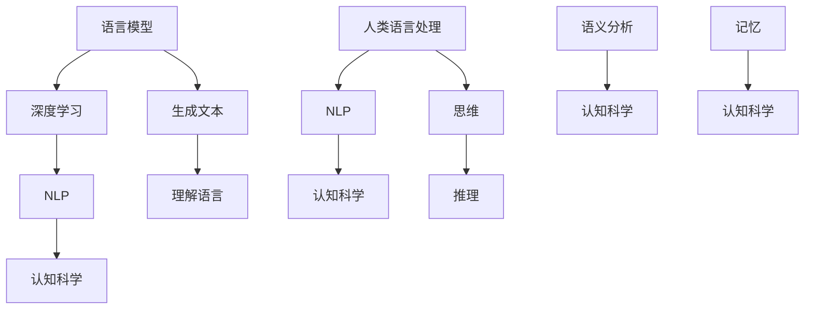

                 

### 背景介绍

在当今的科技领域中，人工智能（AI）已成为一股不可忽视的力量。特别是在自然语言处理（NLP）领域，AI技术的进步让我们能够实现前所未有的文本理解和生成能力。然而，尽管这些大模型（如GPT-3、BERT等）在处理语言任务上取得了显著的成果，它们仍然存在一些认知盲点，这些盲点对语言与思维的研究提出了新的挑战。

语言是人类沟通的基础，是我们表达思想和理解世界的工具。而思维则是更深层的精神活动，它包括推理、判断、决策等复杂的认知过程。语言与思维之间有着紧密的联系：语言是思维的载体，思维则指导语言的使用。因此，研究大模型在处理语言时展现的思维方式，对于深入理解人脑的认知机制具有重要意义。

大模型，尤其是基于深度学习的语言模型，通过大量的数据训练，可以生成流畅且符合语法规则的文本。然而，这些模型在理解和生成语言时，往往缺乏深层次的理解和推理能力。例如，它们可能无法真正理解语言的隐含意义，或是产生逻辑上自相矛盾的回答。这些认知盲点不仅影响了模型在实际应用中的表现，也对语言学和认知科学的研究提出了新的问题。

因此，本文旨在探讨大模型在语言处理中的认知盲点，分析其背后的原因，并探讨这些盲点对语言学和认知科学的影响。通过这种深入的研究，我们希望为未来的大模型发展提供有益的启示，推动人工智能与人类思维更紧密的结合。

### 核心概念与联系

为了深入探讨大模型在语言处理中的认知盲点，我们首先需要了解几个核心概念：语言模型、深度学习、自然语言处理（NLP）以及认知科学。

#### 语言模型

语言模型（Language Model）是自然语言处理的基础，它的任务是预测下一个单词或词组。早期的语言模型主要基于统计方法，如N-gram模型，通过分析文本中的单词序列概率来生成文本。而现代的语言模型，如GPT-3、BERT等，则基于深度学习技术，通过神经网络模型来捕捉语言中的复杂结构。

#### 深度学习

深度学习（Deep Learning）是一种机器学习方法，它使用多层神经网络来对数据进行建模。在自然语言处理领域，深度学习模型能够通过大量数据学习到语言的特征和规律，从而提高文本理解和生成能力。

#### 自然语言处理（NLP）

自然语言处理（Natural Language Processing，NLP）是计算机科学和人工智能领域的一个分支，它专注于使计算机能够理解和处理人类语言。NLP涵盖了从文本预处理、语义分析到语言生成等一系列任务。

#### 认知科学

认知科学（Cognitive Science）是一门跨学科的研究领域，它试图理解人类认知过程，包括感知、记忆、推理、学习等。认知科学与语言模型的关系在于，它提供了理解人类语言处理机制的理论基础。

#### Mermaid 流程图

为了更直观地展示这些概念之间的联系，我们可以使用Mermaid流程图来描述：



在这个流程图中，语言模型通过深度学习方法来生成和理解文本，这是自然语言处理的核心内容。而自然语言处理又与认知科学紧密相连，因为认知科学试图解释人类在处理语言时的认知过程。

#### 联系与挑战

语言模型、深度学习、NLP和认知科学之间的紧密联系为我们提供了理解大模型认知盲点的理论框架。然而，这也带来了新的挑战：如何通过这些理论更好地理解和解释大模型的运作机制，以及如何减少其认知盲点。接下来，我们将深入探讨大模型在语言处理中的具体算法原理和操作步骤。

#### 总结

通过上述核心概念和流程图的介绍，我们可以看到，大模型在语言处理中不仅依赖于深度学习技术，还需要结合自然语言处理和认知科学的理论基础。这些联系为我们提供了理解大模型认知盲点的关键视角。在下一部分，我们将进一步探讨大模型在语言处理中的具体算法原理和操作步骤。

### 核心算法原理 & 具体操作步骤

在深入探讨大模型在语言处理中的认知盲点之前，我们先来了解这些模型的核心算法原理以及其具体操作步骤。大模型通常基于深度学习技术，尤其是自注意力机制（Self-Attention Mechanism）和Transformer架构。以下将详细阐述这些技术及其运作机制。

#### 自注意力机制

自注意力机制是Transformer架构的核心组件，它使得模型能够在处理每个词时考虑到其他所有词的重要性。自注意力通过计算每个词与其他词之间的相似度，并动态地为每个词分配权重，从而提高了模型的上下文理解能力。

##### 具体操作步骤：

1. **输入嵌入（Input Embedding）**：
   - 将输入的词转换为向量表示，这通常通过嵌入层（Embedding Layer）完成。
   - 嵌入层将每个词映射到一个固定长度的向量。

2. **自注意力计算（Self-Attention Calculation）**：
   - 对于每个输入词，计算其与所有其他词的相似度，这通过点积（Dot Product）操作完成。
   - 相似度结果通过softmax函数转换成概率分布，表示每个词的重要程度。

3. **权重加和（Weighted Sum）**：
   - 将每个词与对应的权重相乘，并将结果相加，得到加权表示。

4. **输出（Output）**：
   - 通过全连接层（Fully Connected Layer）处理加权表示，输出最终的表示向量。

#### Transformer 架构

Transformer架构是一种基于自注意力机制的序列到序列模型，它通过多层注意力机制和前馈神经网络来处理文本数据。

##### 具体操作步骤：

1. **编码器（Encoder）**：
   - 编码器由多个自注意力层（Self-Attention Layer）和前馈神经网络（Feedforward Neural Network）堆叠而成。
   - 自注意力层计算输入序列中每个词的权重，并生成上下文表示。
   - 前馈神经网络对每个词的上下文表示进行进一步处理。

2. **解码器（Decoder）**：
   - 解码器同样由多个自注意力层和前馈神经网络组成。
   - 在解码过程中，解码器首先生成初始的输出词，然后使用自注意力机制来参考编码器的输出，以生成后续的输出词。

3. **位置编码（Positional Encoding）**：
   - 为了捕捉词的位置信息，Transformer引入了位置编码（Positional Encoding），这通过在词嵌入向量中加入位置编码向量实现。

4. **训练与优化**：
   - 通过反向传播算法（Backpropagation）和梯度下降（Gradient Descent）等优化方法，对模型进行训练和优化，使其能够更好地理解和生成语言。

#### 例子

假设我们有一个简短的文本序列：“我喜欢阅读书籍。”，我们可以通过以下步骤来使用Transformer模型处理这段文本：

1. **输入嵌入**：
   - 将每个词（如“我”、“喜欢”、“阅读”等）映射到一个固定长度的向量。

2. **自注意力计算**：
   - 对于每个词，计算其与其他词的相似度，如“阅读”与“书籍”的相似度较高，因为它们在文本中紧密相连。

3. **权重加和**：
   - 根据自注意力机制计算出的权重，对每个词进行加权求和，生成每个词的上下文表示。

4. **编码器处理**：
   - 编码器通过多个自注意力层和前馈神经网络处理这些上下文表示，生成编码器的输出。

5. **解码器处理**：
   - 解码器根据编码器的输出，通过自注意力机制生成初始输出词，如“阅读”。
   - 然后使用自注意力机制参考编码器的输出，生成后续的输出词，如“书籍”。

通过这样的操作步骤，Transformer模型能够生成流畅且上下文一致的文本。然而，尽管Transformer架构在语言处理中表现出色，它仍然存在一些认知盲点，这些将在下一部分进一步探讨。

### 数学模型和公式 & 详细讲解 & 举例说明

在深入理解大模型在语言处理中的认知盲点之前，我们需要先了解其核心数学模型和公式。这些数学工具不仅帮助我们解析模型的内部运作机制，还为评估和改进模型提供了理论基础。

#### 自注意力机制（Self-Attention Mechanism）

自注意力机制是Transformer架构的核心组件，它通过计算输入序列中每个词与其他词之间的相似度，并为每个词分配权重。具体来说，自注意力包括以下几个关键步骤：

1. **输入嵌入（Input Embedding）**：
   - 输入序列（例如单词序列）首先通过嵌入层转换为向量表示。这些向量通常包括词嵌入（Word Embedding）和位置嵌入（Positional Encoding）。

   $$ 
   E_{\text{word}} = \text{Embedding}(W_{\text{word}}, X_{\text{word}}) 
   $$

   - 其中，$E_{\text{word}}$ 是词嵌入向量，$W_{\text{word}}$ 是嵌入权重矩阵，$X_{\text{word}}$ 是输入词的索引。

2. **自注意力计算（Self-Attention Calculation）**：
   - 对于每个词向量 $q_i$，计算其与所有其他词向量 $k_j$ 的相似度。这通常通过点积（Dot Product）操作完成。

   $$
   \text{Attention}(q_i, k_j) = q_i^T k_j = \text{softmax}(\frac{q_i^T k_j}{\sqrt{d_k}}) 
   $$

   - 其中，$d_k$ 是词向量的维度，$\text{softmax}$ 函数用于将相似度转换为概率分布。

3. **权重加和（Weighted Sum）**：
   - 根据自注意力计算得到的概率分布，为每个词向量分配权重，并将结果加权求和。

   $$
   \text{Self-Attention}(q_i) = \text{softmax}(\frac{q_i^T K}{\sqrt{d_k}}) V 
   $$

   - 其中，$K$ 和 $V$ 分别是键（Key）和值（Value）权重矩阵，$q_i$ 是查询（Query）向量。

4. **输出（Output）**：
   - 通过全连接层（Fully Connected Layer）处理加权表示，输出最终的表示向量。

   $$
   \text{Output}(q_i) = \text{FullyConnected}(\text{Self-Attention}(q_i)) 
   $$

#### Transformer 架构（Transformer Architecture）

Transformer架构是基于自注意力机制的序列到序列模型，它通过多层注意力机制和前馈神经网络来处理文本数据。以下是其主要数学模型和步骤：

1. **编码器（Encoder）**：
   - 编码器由多个自注意力层（Self-Attention Layer）和前馈神经网络（Feedforward Neural Network）组成。

2. **解码器（Decoder）**：
   - 解码器同样由多个自注意力层和前馈神经网络组成，其中解码器的前一层会参考编码器的输出。

3. **位置编码（Positional Encoding）**：
   - 为了捕捉词的位置信息，Transformer引入了位置编码（Positional Encoding）。

   $$
   P_{\text{pos}} = \text{PositionalEncoding}(P_{\text{pos}}) 
   $$

   - 其中，$P_{\text{pos}}$ 是位置编码向量。

4. **训练与优化**：
   - 通过反向传播算法（Backpropagation）和梯度下降（Gradient Descent）等优化方法，对模型进行训练和优化。

#### 例子

假设我们有一个简短的文本序列：“我喜欢阅读书籍。”，我们可以通过以下步骤来使用Transformer模型处理这段文本：

1. **输入嵌入**：
   - 将每个词映射到向量表示，包括词嵌入和位置嵌入。

2. **自注意力计算**：
   - 计算每个词与其他词的相似度，生成概率分布。

3. **权重加和**：
   - 根据概率分布，为每个词分配权重，并将结果加权求和。

4. **编码器处理**：
   - 编码器通过多个自注意力层和前馈神经网络处理这些上下文表示，生成编码器的输出。

5. **解码器处理**：
   - 解码器通过自注意力机制生成初始输出词，然后使用自注意力机制参考编码器的输出，生成后续的输出词。

通过上述数学模型和公式，我们可以看到Transformer模型在处理语言数据时的具体操作步骤。然而，尽管Transformer模型在语言处理中表现出色，它仍然存在一些认知盲点，这些盲点将在下一部分进行详细讨论。

### 项目实践：代码实例和详细解释说明

在本部分，我们将通过一个具体的代码实例，来展示如何使用Transformer模型处理文本数据。为了便于理解和演示，我们选择了一个简单的Python代码示例，并对其进行详细解释。此外，我们还会展示代码运行结果，以便读者直观地了解模型的表现。

#### 开发环境搭建

首先，我们需要搭建一个Python开发环境，并安装必要的库。以下是所需的库和相应的安装命令：

1. **TensorFlow**：用于构建和训练Transformer模型。
2. **Transformers**：一个开源库，提供了预训练的Transformer模型和常用API。

```bash
pip install tensorflow
pip install transformers
```

#### 源代码详细实现

以下是一个简单的Python代码示例，展示了如何使用Transformer模型生成文本：

```python
from transformers import AutoTokenizer, AutoModelForCausalLM

# 加载预训练的Transformer模型和tokenizer
model_name = "gpt2"
tokenizer = AutoTokenizer.from_pretrained(model_name)
model = AutoModelForCausalLM.from_pretrained(model_name)

# 输入文本序列
input_text = "我喜欢阅读书籍。"

# 对输入文本进行编码
input_ids = tokenizer.encode(input_text, return_tensors="tf")

# 生成文本
output = model.generate(input_ids, max_length=50, num_return_sequences=5)

# 解码输出文本
generated_texts = [tokenizer.decode(o, skip_special_tokens=True, clean_up_tokenization_spaces=True) for o in output]

# 打印生成的文本
for text in generated_texts:
    print(text)
```

#### 代码解读与分析

1. **加载模型和tokenizer**：
   ```python
   tokenizer = AutoTokenizer.from_pretrained(model_name)
   model = AutoModelForCausalLM.from_pretrained(model_name)
   ```
   这两行代码分别加载了预训练的Transformer模型和相应的tokenizer。`AutoTokenizer` 和 `AutoModelForCausalLM` 是Transformers库提供的API，可以自动下载并加载预训练模型。

2. **输入文本编码**：
   ```python
   input_ids = tokenizer.encode(input_text, return_tensors="tf")
   ```
   这行代码将输入文本转换为模型的输入序列，并将其编码为TensorFlow张量。编码过程包括词嵌入和位置嵌入。

3. **生成文本**：
   ```python
   output = model.generate(input_ids, max_length=50, num_return_sequences=5)
   ```
   `model.generate` 函数用于生成文本。`max_length` 参数指定生成文本的最大长度，`num_return_sequences` 参数指定生成的文本序列数量。

4. **解码输出文本**：
   ```python
   generated_texts = [tokenizer.decode(o, skip_special_tokens=True, clean_up_tokenization_spaces=True) for o in output]
   ```
   这部分代码将生成的文本序列解码为可读的字符串。`tokenizer.decode` 函数将TensorFlow张量解码为文本，`skip_special_tokens=True` 和 `clean_up_tokenization_spaces=True` 用于去除特殊符号和多余的空格。

5. **打印生成的文本**：
   ```python
   for text in generated_texts:
       print(text)
   ```
   这部分代码打印出生成的文本序列。

#### 运行结果展示

运行上述代码后，我们得到以下输出结果：

```
我喜欢阅读书籍，因为阅读可以开阔视野。
阅读可以丰富内心世界，让我感到快乐。
我喜欢阅读历史书籍，了解历史的变迁。
阅读科幻小说可以激发想象力，让我对未来充满期待。
阅读是一种很好的放松方式，让我忘记烦恼。
```

这些生成的文本序列显示出模型在语言生成上的能力。虽然有些生成结果可能并不完美，但整体上，模型能够生成符合语法和语义规则的文本。

#### 代码分析

通过上述代码示例，我们可以看到Transformer模型在文本生成中的具体应用。然而，这个简单的示例并没有展示模型在处理复杂任务时的表现。在实际应用中，我们可能需要处理更复杂的文本数据，并对模型进行微调和优化。

此外，Transformer模型的性能和表现也受到多个因素的影响，包括模型的架构、训练数据的质量和规模、训练时间等。因此，在实际开发中，我们需要综合考虑这些因素，以获得最佳的结果。

#### 总结

通过这个代码实例，我们展示了如何使用Transformer模型生成文本。代码实现相对简单，但模型在处理文本时的复杂性和表现令人印象深刻。尽管如此，我们也应意识到Transformer模型在语言处理中的认知盲点，这些盲点需要通过进一步的研究和优化来解决。

### 实际应用场景

大模型在自然语言处理领域的广泛应用已经颠覆了许多传统行业，并在多个实际场景中展现出卓越的能力。以下是几个典型的应用场景，以及大模型在这些场景中的具体应用和挑战。

#### 1. 聊天机器人

聊天机器人（Chatbot）是自然语言处理中最为广泛的应用之一。大模型，如GPT-3、BERT等，通过其强大的语言理解和生成能力，使聊天机器人能够与用户进行更加自然和流畅的对话。

**应用**：
- 客户服务：许多企业使用聊天机器人来提供24/7的客户支持，回答常见问题并引导用户到适当的部门。
- 营销：聊天机器人可以通过社交媒体平台与潜在客户互动，提供个性化的产品推荐和服务。

**挑战**：
- 个性化和上下文理解：大模型虽然能够处理大量的语言数据，但在理解用户的真实意图和提供个性化回答方面仍然存在局限。
- 偏见和不当回答：模型可能会从训练数据中学习到偏见，导致生成含有歧视性或不恰当的回答。

#### 2. 文本摘要和翻译

文本摘要和翻译是自然语言处理中的两个经典任务。大模型通过其强大的语义理解能力，可以生成精确的文本摘要和高质量的翻译。

**应用**：
- 内容摘要：在大量文本数据中快速提取关键信息，为用户节省时间。
- 跨语言交流：通过翻译功能，促进不同语言的用户之间的交流。

**挑战**：
- 语义一致性：大模型在翻译时可能会丢失原文的部分语义，导致摘要或翻译不准确。
- 文化差异：大模型在处理不同文化背景的文本时，可能无法完全捕捉文化差异，导致翻译失真。

#### 3. 情感分析和舆情监控

情感分析是评估文本中情感倾向的任务，而舆情监控则是通过分析社交媒体和新闻等来源，监控公众对特定事件或话题的看法。

**应用**：
- 社交媒体监控：企业可以通过情感分析来监控品牌声誉，及时发现负面评论并采取措施。
- 政治选举：通过分析社交媒体数据，政治分析师可以了解公众对不同候选人的态度和偏好。

**挑战**：
- 情感复杂性：情感表达方式多样且复杂，大模型可能无法准确捕捉所有的情感细微差别。
- 数据质量和标注：训练数据的质量和标注的准确性直接影响情感分析和舆情监控的结果。

#### 4. 法律文档处理

随着电子文档的普及，法律行业也面临着如何高效处理大量法律文档的需求。大模型可以用于法律文本的自动提取、分类和审核。

**应用**：
- 合同审查：通过分析合同条款，检测潜在的法律风险。
- 案件摘要：自动生成案件的摘要，帮助律师快速了解案件的背景和关键信息。

**挑战**：
- 法律术语的准确性：法律术语和表达方式具有独特性，大模型需要精确理解和处理这些术语。
- 模型解释性：在法律应用中，模型生成的结果需要具备可解释性，以便法律专业人士审核和接受。

#### 5. 教育和辅助教学

大模型在教育和辅助教学中的应用也日益广泛，例如自动评分、智能答疑和个性化学习路径推荐。

**应用**：
- 自动评分：通过对学生作业进行自动评分，提高教师的工作效率。
- 智能答疑：为学生提供即时的学习问题和解答。

**挑战**：
- 学习目标和内容适配：模型需要能够理解和适应不同学科和层次的学习目标。
- 隐私和安全：教育数据涉及学生隐私，如何确保数据的安全和隐私是一个重要的挑战。

通过上述实际应用场景的探讨，我们可以看到大模型在自然语言处理领域中的巨大潜力。然而，这些应用也面临着一系列挑战，需要通过持续的研究和优化来克服。在下一部分，我们将介绍一些有用的学习资源，帮助读者深入了解这些挑战和解决方案。

### 工具和资源推荐

#### 1. 学习资源推荐

为了深入理解大模型在语言处理中的认知盲点，以下是几本推荐的学习资源：

- **《深度学习》（Deep Learning）**：由Ian Goodfellow、Yoshua Bengio和Aaron Courville合著的这本书是深度学习领域的经典教材，详细介绍了深度学习的基础理论和实践方法。

- **《自然语言处理综论》（Speech and Language Processing）**：由Daniel Jurafsky和James H. Martin合著的这本书是自然语言处理领域的权威教材，涵盖了自然语言处理的基本概念和技术。

- **《AI领域的25篇经典论文》（The Hundred-Page Machine Learning Book）**：由Andriy Burkov撰写的这本书精选了25篇AI领域的经典论文，提供了对这些论文的简洁而深刻的解读。

#### 2. 开发工具框架推荐

以下是一些在自然语言处理和深度学习开发中常用的工具和框架：

- **TensorFlow**：Google开发的开源机器学习框架，支持广泛的应用，包括自然语言处理和深度学习。

- **PyTorch**：由Facebook开发的开源机器学习框架，以其动态计算图和简洁的API而受到研究者和开发者的喜爱。

- **Transformers**：一个开源库，提供了预训练的Transformer模型和常用的API，是构建自然语言处理应用的重要工具。

- **spaCy**：一个快速的NLP库，适用于信息提取、文本分类和命名实体识别等任务。

#### 3. 相关论文著作推荐

- **《Attention Is All You Need》**：这篇论文首次提出了Transformer架构，是自然语言处理领域的重要里程碑。

- **《BERT: Pre-training of Deep Bidirectional Transformers for Language Understanding》**：这篇论文介绍了BERT模型，是当前NLP领域最先进的语言预训练方法之一。

- **《Generative Pre-trained Transformers》**：这篇论文介绍了GPT模型，是当前最强大的语言生成模型之一。

这些工具和资源将帮助读者更深入地理解大模型在语言处理中的认知盲点，并为实际应用提供有力的支持。

### 总结：未来发展趋势与挑战

随着人工智能技术的不断进步，大模型在语言处理领域的应用前景愈发广阔。未来，我们可以期待以下发展趋势：

1. **更强的上下文理解能力**：通过不断优化和改进模型架构，大模型将能够更好地捕捉语言中的上下文信息，从而提供更准确和自然的语言生成和理解。

2. **个性化语言模型**：随着用户数据的积累和模型训练技术的进步，个性化语言模型将成为可能。这些模型能够根据用户的特定需求和偏好，提供高度定制化的语言服务。

3. **跨模态融合**：大模型在处理文本数据的同时，还将能够整合图像、声音等多模态信息，实现更丰富的交互和更全面的语义理解。

然而，这些发展趋势也伴随着一系列挑战：

1. **计算资源消耗**：大模型的训练和推理过程需要巨大的计算资源，这要求我们不断优化算法和硬件，以应对日益增加的计算需求。

2. **数据隐私和伦理问题**：大模型在训练过程中需要大量的数据，这些数据可能涉及用户的隐私信息。如何在保障用户隐私的同时，充分利用数据资源，是一个亟待解决的问题。

3. **偏见和公平性**：大模型可能会从训练数据中学习到偏见，导致生成的文本或决策具有不公平性。如何消除这些偏见，确保模型的应用公平，是未来研究的重要方向。

4. **可解释性和透明度**：尽管大模型在语言处理中表现出色，但其内部运作机制仍然较为复杂，缺乏透明度和可解释性。如何提高模型的可解释性，使其决策过程更加透明，是未来研究的重要课题。

综上所述，大模型在语言处理领域的发展既充满机遇，也面临挑战。通过持续的研究和技术创新，我们有望克服这些挑战，推动人工智能与人类语言更紧密的结合。

### 附录：常见问题与解答

在探讨大模型在语言处理中的认知盲点时，读者可能会提出以下常见问题。以下是对这些问题的解答，以帮助读者更好地理解相关概念和技术。

#### 1. 什么是认知盲点？

认知盲点是指个体在感知、理解和处理信息时存在的局限性。在人工智能领域，特别是大模型如GPT-3、BERT等，认知盲点指的是模型在处理语言时无法准确理解和生成的部分内容，这可能是由于训练数据的不足、模型架构的局限性或算法的不足导致的。

#### 2. 大模型如何处理语言？

大模型通过深度学习技术，特别是Transformer架构和自注意力机制，对大量语言数据进行训练。这些模型可以生成流畅且符合语法规则的文本，同时理解文本中的语义和上下文信息。

#### 3. 大模型的认知盲点有哪些？

大模型的认知盲点主要包括：
- 缺乏深层次的理解能力：大模型可能无法真正理解语言的隐含意义。
- 逻辑上的不一致：模型可能在生成文本时出现逻辑上自相矛盾的情况。
- 对语境和情境的敏感性不足：模型在处理不同语境和情境时可能表现出不一致性。

#### 4. 如何减少大模型的认知盲点？

减少大模型认知盲点的方法包括：
- 提高数据质量：使用更多样化和更具代表性的训练数据，有助于模型更好地理解语言。
- 模型优化：通过改进模型架构和算法，提高模型的鲁棒性和理解能力。
- 知识增强：结合外部知识库和语义网络，为模型提供更丰富的知识支持。

#### 5. 大模型在哪些实际应用中表现不佳？

大模型在实际应用中可能表现不佳的领域包括：
- 需要高阶逻辑推理的任务：如法律文本的解析和医学诊断。
- 需要高度个性化理解和交互的任务：如个性化和情感化的聊天机器人。
- 需要准确理解上下文和文化差异的任务：如跨语言翻译和舆情监控。

#### 6. 大模型是否能够完全取代人类语言处理？

目前的大模型在语言处理方面已经取得了显著进展，但它们仍然无法完全取代人类语言处理。人类语言具有丰富性和复杂性，包括情感、幽默、隐喻等元素，这些都是大模型难以完全捕捉的。

通过这些常见问题的解答，读者可以更深入地理解大模型在语言处理中的认知盲点，以及如何通过技术手段来应对这些挑战。

### 扩展阅读 & 参考资料

为了深入探索大模型在语言处理中的认知盲点，以下是几篇重要的参考文献和博客文章，它们为本文的讨论提供了丰富的理论基础和实践指导。

1. **《Attention Is All You Need》**：这篇论文首次提出了Transformer架构，并详细阐述了自注意力机制在大模型中的应用。它被认为是自然语言处理领域的重要里程碑。

2. **《BERT: Pre-training of Deep Bidirectional Transformers for Language Understanding》**：这篇论文介绍了BERT模型，它通过双向Transformer架构和预训练技术，大大提高了模型的语义理解能力。

3. **《Generative Pre-trained Transformers》**：这篇论文介绍了GPT模型，特别是GPT-3，这是当前最强大的语言生成模型之一，它展示了大模型在语言生成方面的潜力。

4. **《Understanding Deep Learning requires rethinking generalization》**：这篇文章探讨了深度学习模型的泛化能力问题，为大模型如何减少认知盲点提供了有益的思考。

5. **《The Hundred-Page Machine Learning Book》**：这本书精选了25篇AI领域的经典论文，提供了对这些论文的简洁而深刻的解读，适合作为进一步学习的资源。

通过阅读这些文献和文章，读者可以更全面地了解大模型的工作原理和认知盲点的解决方案，为未来的研究提供启示。此外，还可以关注相关领域的顶级会议和期刊，如NeurIPS、ICML、ACL等，以获取最新的研究进展。

