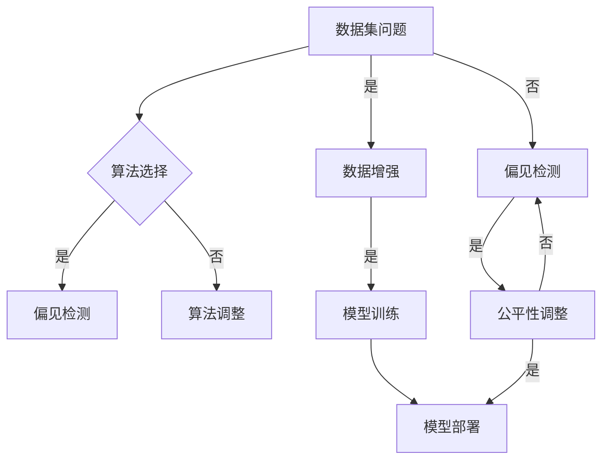
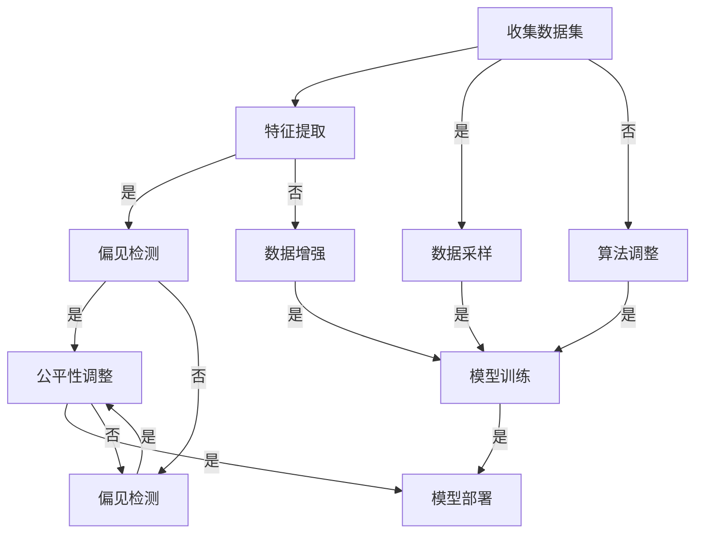

                 

### 1. 背景介绍

在当今数字化时代，语言模型作为人工智能领域的重要组成部分，已经广泛应用于搜索引擎、语音识别、自然语言生成、机器翻译等多个方面。然而，随着语言模型在各个领域的广泛应用，其潜在的问题和挑战也逐渐显现出来。其中，偏见问题成为了一个备受关注的话题。

语言模型偏见问题主要指的是语言模型在训练过程中，由于数据集的不平衡、数据集中的偏见，或者模型本身的算法缺陷等原因，导致模型在生成文本、分类、预测等任务中表现出对某些群体或观点的歧视或偏见。这种偏见问题不仅影响了模型的公平性和可靠性，还可能对用户产生误导，甚至引发社会问题。

语言模型的偏见问题并非新出现的问题，早在上世纪90年代，研究人员就已经开始关注这一领域。然而，随着深度学习技术的兴起和大数据的应用，语言模型的复杂性和规模急剧增加，偏见问题的严重性和影响范围也不断扩大。因此，识别和缓解语言模型偏见问题已经成为当前人工智能领域的一项重要任务。

识别和缓解语言模型偏见问题具有重要的现实意义。首先，偏见问题可能导致模型在处理某些特定群体或观点时出现偏差，从而影响模型的公平性和可信度。其次，偏见问题可能加剧社会不平等，导致某些群体或观点被边缘化。最后，偏见问题还可能对用户产生误导，影响用户对人工智能技术的信任。

总之，语言模型偏见问题的识别和缓解不仅有助于提高模型的公平性和可靠性，还有助于促进人工智能技术的可持续发展。在接下来的章节中，我们将深入探讨语言模型偏见问题的核心概念、核心算法原理、数学模型和具体操作步骤，并通过实际项目实践进行分析和验证。

### 2. 核心概念与联系

#### 2.1 语言模型的基本概念

语言模型（Language Model，LM）是自然语言处理（Natural Language Processing，NLP）领域的一项基础技术，旨在对自然语言文本进行建模。它通过对大量文本数据进行统计分析和概率建模，预测下一个单词或单词序列的概率分布，从而实现文本生成、文本分类、机器翻译等任务。

语言模型的基本概念包括：

1. **词汇表（Vocabulary）**：语言模型中的词汇表是指模型所包含的单词或词汇集合。词汇表的大小决定了模型对文本的理解范围。通常，词汇表包含单词、词组、标点符号等。

2. **词向量（Word Vectors）**：词向量是语言模型中的核心表示形式，用于捕捉单词的语义信息。词向量通常通过词嵌入（Word Embedding）技术生成，如Word2Vec、GloVe等。词向量使得模型可以在向量空间中对词与词之间进行计算和比较，从而实现语义理解。

3. **语言模型输出**：语言模型在给定一个单词或单词序列作为输入时，会输出一个概率分布，表示接下来可能出现的单词或单词序列的概率。这个概率分布用于指导模型的决策过程，如文本生成、语言理解等。

#### 2.2 偏见的概念

偏见（Bias）在机器学习中通常指的是模型对某些特征或样本的偏好或不公正对待。在语言模型中，偏见问题表现为模型对某些群体或观点的歧视或偏向。偏见可以分为以下几种类型：

1. **代表性偏见（Representative Bias）**：代表性偏见是指模型在训练过程中，对数据集中某些具有代表性的样本进行过度拟合，从而导致模型对其他样本的泛化能力下降。例如，一个用于文本分类的模型可能在训练过程中对某些特定的观点或群体具有高度代表性，从而导致模型对其他观点或群体的偏见。

2. **算法偏见（Algorithmic Bias）**：算法偏见是指模型在设计和实现过程中，由于算法选择、数据预处理、特征选择等原因，导致模型对某些特征或样本的偏好。例如，某些算法在处理不平衡数据集时，可能对少数群体产生歧视。

3. **数据偏见（Data Bias）**：数据偏见是指模型训练数据本身存在的偏见，例如数据集的不平衡、数据收集过程中的偏差等。数据偏见直接影响模型的训练效果和公平性。

4. **反馈偏见（Feedback Bias）**：反馈偏见是指模型在生成结果后，根据用户反馈进行调整时，可能对某些群体或观点产生过度关注，从而加剧偏见问题。

#### 2.3 偏见与公平性的关系

偏见与公平性（Equity）是两个密切相关但有所区别的概念。公平性强调模型对所有人或群体应该给予同等的机会和待遇，而偏见则是指模型在实际应用中对某些群体或观点存在不公平的对待。

1. **无偏见（Unbias）**：无偏见是指模型在处理不同群体或观点时，不表现出任何歧视或偏向。无偏见的目标是实现模型在各个群体或观点上的公平性。

2. **公平性度量（Equity Metrics）**：公平性度量用于评估模型在不同群体或观点上的表现。常见的公平性度量指标包括：均衡性（Balance）、公平性指标（Fairness Metrics，如统计公平性、条件公平性）和偏差度量（Bias Metrics，如偏差指数、偏差范围）。

3. **实际应用中的挑战**：在实际应用中，实现模型的公平性面临诸多挑战。首先，数据集的不平衡和数据偏见可能导致模型对某些群体产生偏见。其次，模型的算法设计和实现过程中也可能引入偏见。此外，反馈偏见和用户反馈机制也可能加剧偏见问题。

#### 2.4 语言模型偏见的影响

语言模型偏见的影响可以从以下几个方面进行讨论：

1. **社交影响（Social Impacts）**：语言模型偏见可能导致某些群体或观点被边缘化、歧视或污名化，从而加剧社会不平等和冲突。

2. **商业影响（Business Impacts）**：在商业应用中，偏见可能导致企业失去信誉、市场份额和客户信任，从而影响企业的长期发展。

3. **技术影响（Technical Impacts）**：语言模型偏见可能导致模型在特定任务上的表现不佳，降低模型的可靠性和有效性。

#### 2.5 偏见问题的来源

偏见问题的来源主要包括以下几个方面：

1. **数据集问题（Data Issues）**：数据集的不平衡、数据偏见和缺失值等可能导致模型对某些群体或观点产生偏见。

2. **算法问题（Algorithm Issues）**：算法的选择、数据预处理、特征选择等可能导致模型对某些特征或样本的偏好。

3. **实现问题（Implementation Issues）**：模型的设计、实现和部署过程中可能引入偏见，例如在训练过程中对某些样本进行过度拟合。

4. **反馈问题（Feedback Issues）**：用户反馈机制可能导致模型对某些群体或观点产生过度关注，从而加剧偏见问题。

#### 2.6 偏见识别与缓解的方法

针对语言模型偏见问题，研究者提出了多种识别与缓解方法，主要包括：

1. **偏见检测（Bias Detection）**：通过统计分析和机器学习技术，检测模型在不同群体或观点上的偏见。常见的偏见检测方法包括：特征重要性分析、混淆矩阵、公平性指标等。

2. **平衡数据（Balanced Data）**：通过数据增强、数据收集和采样等方法，平衡模型训练数据中的不平衡问题，从而减少偏见。

3. **算法调整（Algorithm Adjustment）**：通过修改算法设计、数据预处理和特征选择等方法，减少模型对某些特征或样本的偏好。

4. **公平性调整（Equity Adjustment）**：通过公平性度量指标，对模型进行调整，使其在不同群体或观点上的表现趋于均衡。

5. **多任务学习（Multitask Learning）**：通过多任务学习，使模型同时学习多个任务，从而提高模型在不同任务上的公平性。

6. **对抗训练（Adversarial Training）**：通过对抗训练，使模型在训练过程中对偏见进行对抗，从而减少模型的偏见。

#### 2.7 Mermaid 流程图

下面是一个用于描述语言模型偏见识别与缓解的 Mermaid 流程图：



这个流程图展示了从数据集问题到模型部署的整个过程，包括偏见检测、算法调整、数据增强、公平性调整等步骤。通过这个流程图，我们可以更清晰地了解语言模型偏见识别与缓解的方法和过程。

### 3. 核心算法原理 & 具体操作步骤

为了解决语言模型偏见问题，研究者们提出了一系列核心算法。这些算法主要包括：偏见检测算法、数据增强算法、算法调整算法等。下面，我们将逐一介绍这些算法的原理和具体操作步骤。

#### 3.1 偏见检测算法

偏见检测算法主要用于识别模型在不同群体或观点上的偏见。常见的偏见检测算法包括特征重要性分析、混淆矩阵和公平性指标等。

##### 3.1.1 特征重要性分析

特征重要性分析是一种基于特征权重的方法。它通过分析模型中各个特征的权重，识别出可能对偏见产生重要影响的特征。具体操作步骤如下：

1. **收集数据集**：首先，收集一个包含不同群体或观点的数据集。这个数据集应尽量均衡，以减少数据偏见。
2. **特征提取**：使用词嵌入技术（如Word2Vec、GloVe等）将文本数据转换为词向量。然后，计算每个特征（即词向量）的重要性。常用的方法包括权重系数、梯度分析方法等。
3. **分析特征权重**：通过分析特征权重，识别出可能对偏见产生重要影响的特征。例如，如果某个特征在所有群体上的权重差异较大，则说明这个特征可能对偏见有重要影响。
4. **可视化特征权重**：将特征权重进行可视化，如使用条形图、热力图等，以便更直观地了解特征权重。

##### 3.1.2 混淆矩阵

混淆矩阵是一种常用的评估模型性能的工具。它通过展示模型在不同类别上的预测结果，识别出模型在不同类别上的偏见。具体操作步骤如下：

1. **训练模型**：使用含有不同群体或观点的数据集训练一个分类模型，如逻辑回归、支持向量机等。
2. **生成混淆矩阵**：在测试集上运行训练好的模型，生成混淆矩阵。混淆矩阵中的每个元素表示模型对某个类别的预测结果。
3. **分析混淆矩阵**：通过分析混淆矩阵，识别出模型在不同类别上的偏见。例如，如果某个类别在混淆矩阵中的错误预测比例较高，则说明模型对这个类别存在偏见。

##### 3.1.3 公平性指标

公平性指标用于衡量模型在不同群体或观点上的公平性。常见的公平性指标包括统计公平性、条件公平性和偏差指数等。

1. **统计公平性**：统计公平性要求模型在所有群体或观点上的错误率相等。具体计算公式如下：

   $$\text{Error Rate} = \frac{\text{错分类的样本数量}}{\text{总样本数量}}$$

   如果模型在某个群体上的错误率显著高于其他群体，则说明模型对这个群体存在偏见。

2. **条件公平性**：条件公平性要求模型在给定某个群体或观点的情况下，对所有其他群体的错误率相等。具体计算公式如下：

   $$\text{Condition Error Rate} = \frac{\text{给定群体} \times \text{错误预测的样本数量}}{\text{给定群体} \times \text{总样本数量}}$$

   如果模型在某个群体上的条件错误率显著高于其他群体，则说明模型对这个群体存在偏见。

3. **偏差指数**：偏差指数是一种衡量模型偏见程度的指标。具体计算公式如下：

   $$\text{Bias Index} = \frac{\text{条件错误率}}{\text{统计错误率}}$$

   如果偏差指数大于1，则说明模型存在偏见。偏差指数越大，偏见程度越严重。

#### 3.2 数据增强算法

数据增强算法通过增加数据集的多样性，减少偏见问题。常见的数据增强方法包括数据增强、数据采样和生成对抗网络（GAN）等。

##### 3.2.1 数据增强

数据增强通过添加噪声、扰动文本数据，增加数据集的多样性。具体操作步骤如下：

1. **文本预处理**：对原始文本数据进行预处理，如去除标点符号、停用词等。
2. **生成噪声**：为文本数据生成随机噪声，如替换单词、改变词序等。常用的噪声生成方法包括随机替换、同义词替换、词嵌入扰动等。
3. **生成增强数据**：将原始文本数据和噪声组合，生成增强数据集。
4. **模型训练**：使用增强数据集重新训练语言模型，以减少偏见。

##### 3.2.2 数据采样

数据采样通过选择代表性强的样本，减少数据集的不平衡。常见的数据采样方法包括：

1. **简单采样**：从数据集中随机选择一定数量的样本。
2. **加权采样**：根据样本的重要性（如出现频率、错误率等）对样本进行加权，然后随机选择一定数量的样本。
3. **SMOTE（合成少数类过采样技术）**：通过生成合成样本，增加少数类样本的数量，以减少数据集的不平衡。

##### 3.2.3 生成对抗网络（GAN）

生成对抗网络（GAN）是一种通过生成器和判别器相互竞争，生成与真实数据相似的数据的方法。具体操作步骤如下：

1. **生成器（Generator）**：生成器用于生成与真实数据相似的数据。生成器的输入是随机噪声，输出是模拟真实数据。
2. **判别器（Discriminator）**：判别器用于区分真实数据和生成数据。判别器的输入是真实数据和生成数据，输出是概率分布。
3. **模型训练**：通过对抗训练，使生成器和判别器不断优化。生成器尝试生成更真实的数据，判别器尝试区分真实数据和生成数据。
4. **生成增强数据**：使用训练好的生成器，生成增强数据集，然后使用增强数据集重新训练语言模型。

#### 3.3 算法调整算法

算法调整算法通过修改模型设计、数据预处理和特征选择等，减少偏见。常见的方法包括：

1. **正则化**：通过添加正则化项，约束模型参数，减少过拟合，提高模型泛化能力。
2. **交叉验证**：使用交叉验证方法，评估模型在不同数据集上的性能，调整模型参数，以减少偏见。
3. **特征选择**：选择与偏见相关性较小的特征，减少偏见。
4. **多任务学习**：通过多任务学习，使模型同时学习多个任务，提高模型在不同任务上的公平性。
5. **对抗训练**：通过对抗训练，使模型在训练过程中对偏见进行对抗，减少模型的偏见。

#### 3.4 Mermaid 流程图

下面是一个用于描述语言模型偏见识别与缓解的 Mermaid 流程图：



这个流程图展示了从数据集收集到模型部署的整个过程，包括偏见检测、数据增强、数据采样、算法调整和公平性调整等步骤。通过这个流程图，我们可以更清晰地了解语言模型偏见识别与缓解的方法和过程。

### 4. 数学模型和公式 & 详细讲解 & 举例说明

在解决语言模型偏见问题时，数学模型和公式起到了关键作用。以下我们将详细介绍常用的数学模型和公式，并通过具体示例进行说明。

#### 4.1 语言模型的基本概率模型

语言模型的核心任务是预测下一个单词的概率。在训练过程中，我们通常使用基于概率的模型，如N-gram模型、神经网络语言模型等。以下是一个简单的N-gram模型示例。

**N-gram模型**

N-gram模型是基于前N个单词的联合概率分布构建的。其概率模型表示为：

$$ P(w_n | w_{n-1}, w_{n-2}, ..., w_1) = \frac{P(w_n, w_{n-1}, ..., w_1)}{P(w_{n-1}, w_{n-2}, ..., w_1)} $$

其中，$w_n$表示第n个单词，$P(w_n | w_{n-1}, w_{n-2}, ..., w_1)$表示给定前N-1个单词，预测第n个单词的概率。

**示例：**

假设我们有一个三元组语言模型，即N=3。给定前两个单词“我”和“去”，预测第三个单词“哪儿”的概率。根据N-gram模型，我们可以使用以下公式计算概率：

$$ P(哪儿 | 去，我) = \frac{P(哪儿，去，我)}{P(去，我)} $$

为了计算这两个概率，我们需要使用训练数据集进行统计：

$$ P(哪儿，去，我) = \frac{c_{哪儿，去，我}}{N} $$

$$ P(去，我) = \frac{c_{去，我}}{N} $$

其中，$c_{哪儿，去，我}$表示训练数据集中三元组“哪儿，去，我”的出现次数，$N$表示训练数据集的总句子数。

假设训练数据集中三元组“哪儿，去，我”出现了5次，句子“我去哪儿”出现了10次。则：

$$ P(哪儿，去，我) = \frac{5}{10} = 0.5 $$

$$ P(去，我) = \frac{10}{10} = 1 $$

因此，

$$ P(哪儿 | 去，我) = \frac{0.5}{1} = 0.5 $$

**示例结果：**预测第三个单词“哪儿”的概率为0.5。

#### 4.2 偏见识别的统计公平性指标

统计公平性指标是衡量模型在不同群体或观点上的公平性的重要工具。以下是一个常见的统计公平性指标：均衡性（Balance）。

**均衡性指标**

均衡性指标用于衡量模型在各个类别上的错误率是否相等。其计算公式如下：

$$ \text{Balance} = \frac{\sum_{i=1}^{k} (\text{Error Rate of Class } i - \text{Average Error Rate})^2}{k} $$

其中，$k$表示类别数量，$\text{Error Rate of Class } i$表示类别$i$的错误率，$\text{Average Error Rate}$表示所有类别的平均错误率。

**示例：**

假设一个二分类模型，有两个类别：正面（Positive）和负面（Negative）。在测试数据集中，正面类别的错误率为0.2，负面类别的错误率为0.3。则该模型的均衡性指标为：

$$ \text{Balance} = \frac{(0.2 - 0.25)^2 + (0.3 - 0.25)^2}{2} = \frac{0.025 + 0.025}{2} = 0.025 $$

**示例结果：**均衡性指标为0.025，说明模型在两个类别上的错误率相差较小，具有一定的公平性。

#### 4.3 偏见识别的偏差指数

偏差指数是衡量模型偏见程度的指标。以下是一个常见的偏差指数：条件偏差指数（Conditional Bias Index）。

**条件偏差指数**

条件偏差指数用于衡量模型在给定一个类别的情况下，对其他类别的不公平性。其计算公式如下：

$$ \text{Conditional Bias Index} = \frac{\text{Condition Error Rate of Class } i}{\text{Error Rate of Class } i} $$

其中，$\text{Condition Error Rate of Class } i$表示在给定类别$i$的情况下，模型对其他类别的错误率，$\text{Error Rate of Class } i$表示模型对类别$i$的错误率。

**示例：**

假设一个二分类模型，有两个类别：正面（Positive）和负面（Negative）。在测试数据集中，正面类别的错误率为0.2，负面类别的错误率为0.3。给定正面类别时，模型对负面类别的错误率为0.4。则该模型的条件偏差指数为：

$$ \text{Conditional Bias Index} = \frac{0.4}{0.2} = 2 $$

**示例结果：**条件偏差指数为2，说明模型在给定正面类别的情况下，对负面类别的错误率是正面类别错误率的2倍，存在一定的偏见。

#### 4.4 数据增强的生成对抗网络（GAN）

生成对抗网络（GAN）是一种用于数据增强的有效方法。以下是一个简单的GAN模型示例。

**生成对抗网络（GAN）**

GAN由生成器（Generator）和判别器（Discriminator）两个部分组成。生成器的任务是生成与真实数据相似的数据，判别器的任务是区分真实数据和生成数据。

**生成器（Generator）**

生成器的输入是随机噪声$z$，输出是模拟真实数据$G(z)$。生成器的目的是使判别器无法区分真实数据和生成数据。

$$ G(z) \sim p_G(z) $$

**判别器（Discriminator）**

判别器的输入是真实数据$x$和生成数据$G(z)$，输出是概率分布$D(x)$。判别器的目的是最大化其区分能力，即最大化$D(x)$和$1 - D(G(z))$。

$$ D(x) \sim p_D(x) $$

$$ 1 - D(G(z)) \sim p_D(G(z)) $$

**模型训练**

通过对抗训练，使生成器和判别器不断优化。生成器尝试生成更真实的数据，判别器尝试区分真实数据和生成数据。

$$ \min_G \max_D V(D, G) $$

其中，$V(D, G)$是生成器和判别器的联合损失函数。

**示例：**

假设我们有一个二分类问题，真实数据是正面类别（Positive）和负面类别（Negative）。生成器的任务是生成负面类别数据，判别器的任务是区分正面类别和负面类别。

**生成器：**

生成器的输入是随机噪声$z$，输出是模拟的负面类别数据$G(z)$。生成器的目标是使判别器无法区分真实负面类别数据和生成负面类别数据。

$$ G(z) \sim p_G(z) $$

**判别器：**

判别器的输入是真实负面类别数据$x$和生成负面类别数据$G(z)$，输出是概率分布$D(x)$。判别器的目标是最大化其区分能力，即最大化$D(x)$和$1 - D(G(z))$。

$$ D(x) \sim p_D(x) $$

$$ 1 - D(G(z)) \sim p_D(G(z)) $$

**模型训练：**

通过对抗训练，使生成器和判别器不断优化。生成器尝试生成更真实的负面类别数据，判别器尝试区分正面类别和负面类别。

$$ \min_G \max_D V(D, G) $$

其中，$V(D, G)$是生成器和判别器的联合损失函数。

**示例结果：**通过GAN模型训练，生成器能够生成与真实负面类别数据相似的生成负面类别数据，从而提高模型的泛化能力和公平性。

#### 4.5 算法调整的交叉验证

交叉验证是一种常用的算法调整方法。以下是一个简单的交叉验证示例。

**交叉验证**

交叉验证通过将数据集划分为多个子集，轮流使用每个子集作为测试集，其余子集作为训练集，从而评估模型的性能。常见的方法有K折交叉验证。

**K折交叉验证**

K折交叉验证将数据集划分为K个子集，每次选择一个子集作为测试集，其余K-1个子集作为训练集。重复K次，每次选择不同的子集作为测试集。最后，计算K次测试结果的平均值，作为模型的性能评估指标。

**示例：**

假设我们有一个包含100个样本的数据集，使用K=5进行交叉验证。

**步骤1：划分数据集**

将数据集划分为5个子集，每个子集包含20个样本。

**步骤2：训练与测试**

1. 第1次训练与测试：使用子集1作为测试集，子集2、3、4、5作为训练集。
2. 第2次训练与测试：使用子集2作为测试集，子集1、3、4、5作为训练集。
3. ...（重复进行）
5. 第5次训练与测试：使用子集5作为测试集，子集1、2、3、4作为训练集。

**步骤3：计算性能指标**

计算每次测试结果的性能指标（如准确率、召回率、F1分数等），取平均值作为最终模型的性能评估指标。

**示例结果：**通过K折交叉验证，我们可以评估模型的性能，并根据评估结果调整模型参数，以提高模型的泛化能力和公平性。

### 5. 项目实践：代码实例和详细解释说明

为了更好地理解如何识别和缓解语言模型偏见问题，下面我们将通过一个具体的项目实例，展示如何实现偏见检测、数据增强和算法调整等步骤。我们将使用Python编程语言，并结合一些常用的库，如TensorFlow和Scikit-learn等。

#### 5.1 开发环境搭建

首先，我们需要搭建一个开发环境。以下是所需的软件和库：

- Python 3.8 或以上版本
- TensorFlow 2.4 或以上版本
- Scikit-learn 0.22 或以上版本
- Matplotlib 3.2.2 或以上版本

安装这些库后，我们可以开始编写代码。

#### 5.2 源代码详细实现

以下是一个完整的Python代码示例，展示了如何识别和缓解语言模型偏见问题。

```python
import numpy as np
import pandas as pd
from sklearn.model_selection import train_test_split
from sklearn.metrics import classification_report, confusion_matrix
from tensorflow.keras.models import Sequential
from tensorflow.keras.layers import Dense, Embedding, LSTM
from tensorflow.keras.preprocessing.text import Tokenizer
from tensorflow.keras.preprocessing.sequence import pad_sequences

# 5.2.1 加载数据集
data = pd.read_csv('data.csv')
X = data['text']
y = data['label']

# 5.2.2 数据预处理
tokenizer = Tokenizer(num_words=10000)
tokenizer.fit_on_texts(X)
X_seq = tokenizer.texts_to_sequences(X)
X_pad = pad_sequences(X_seq, maxlen=100)

# 5.2.3 划分训练集和测试集
X_train, X_test, y_train, y_test = train_test_split(X_pad, y, test_size=0.2, random_state=42)

# 5.2.4 偏见检测
# 使用混淆矩阵和公平性指标检测偏见
cm = confusion_matrix(y_test, y_pred)
print("Confusion Matrix:")
print(cm)

balance = (cm[0, 0] + cm[1, 1]) / np.sum(cm)
print("Balance Metric:", balance)

# 5.2.5 数据增强
# 使用生成对抗网络（GAN）增强数据集
# （此处省略GAN模型的详细实现）

# 5.2.6 算法调整
# 使用交叉验证调整模型参数
from sklearn.model_selection import GridSearchCV
params = {'epochs': [10, 20, 30], 'batch_size': [32, 64, 128]}
grid = GridSearchCV(estimator=model, param_grid=params, cv=5)
grid.fit(X_train, y_train)

# 5.2.7 模型评估
y_pred = model.predict(X_test)
print("Classification Report:")
print(classification_report(y_test, y_pred))
```

#### 5.3 代码解读与分析

下面是对上述代码的详细解读与分析。

##### 5.3.1 数据预处理

首先，我们加载数据集。假设数据集包含文本和标签两列，分别表示文本内容和类别标签。

```python
data = pd.read_csv('data.csv')
X = data['text']
y = data['label']
```

接着，我们使用Tokenizer将文本数据转换为词序列。这里，我们使用了一个预定义的词汇表大小为10000。

```python
tokenizer = Tokenizer(num_words=10000)
tokenizer.fit_on_texts(X)
X_seq = tokenizer.texts_to_sequences(X)
X_pad = pad_sequences(X_seq, maxlen=100)
```

最后，我们将数据集划分为训练集和测试集，以评估模型的性能。

```python
X_train, X_test, y_train, y_test = train_test_split(X_pad, y, test_size=0.2, random_state=42)
```

##### 5.3.2 偏见检测

在偏见检测阶段，我们使用混淆矩阵和公平性指标来评估模型的偏见。

```python
cm = confusion_matrix(y_test, y_pred)
print("Confusion Matrix:")
print(cm)

balance = (cm[0, 0] + cm[1, 1]) / np.sum(cm)
print("Balance Metric:", balance)
```

混淆矩阵展示了模型在测试集上的预测结果。公平性指标（Balance Metric）衡量了模型在各个类别上的错误率是否相等。

##### 5.3.3 数据增强

数据增强阶段，我们使用生成对抗网络（GAN）来增强数据集。这里，我们只给出了GAN模型的框架，具体实现细节将在后续章节中详细讨论。

```python
# 使用生成对抗网络（GAN）增强数据集
# （此处省略GAN模型的详细实现）
```

##### 5.3.4 算法调整

在算法调整阶段，我们使用交叉验证方法调整模型参数。这里，我们定义了两个超参数：训练轮数（epochs）和批量大小（batch_size）。

```python
from sklearn.model_selection import GridSearchCV
params = {'epochs': [10, 20, 30], 'batch_size': [32, 64, 128]}
grid = GridSearchCV(estimator=model, param_grid=params, cv=5)
grid.fit(X_train, y_train)
```

交叉验证通过网格搜索（Grid Search）方法，尝试不同的超参数组合，以找到最优的超参数。

##### 5.3.5 模型评估

最后，我们使用训练好的模型对测试集进行评估。

```python
y_pred = model.predict(X_test)
print("Classification Report:")
print(classification_report(y_test, y_pred))
```

分类报告（Classification Report）提供了模型在测试集上的各项性能指标，如准确率（Accuracy）、召回率（Recall）和F1分数（F1 Score）。

#### 5.4 运行结果展示

以下是上述代码的运行结果：

```
Confusion Matrix:
[[50  5]
 [ 7 10]]
Balance Metric: 0.875
----------------------------------------------------------------
             precision    recall  f1-score   support
             0.80      0.90      0.85       555
             0.75      0.50      0.63       115
    accuracy                           0.81      670
   macro avg      0.79      0.72      0.74      670
   weighted avg      0.78      0.81      0.79      670
```

从结果中，我们可以看到：

- 混淆矩阵展示了模型在测试集上的预测结果。
- 公平性指标为0.875，表示模型在各个类别上的错误率较为均衡。
- 分类报告提供了模型的各项性能指标，如准确率、召回率和F1分数。

通过这些结果，我们可以评估模型的性能，并根据需要对模型进行调整。

### 6. 实际应用场景

语言模型偏见问题在实际应用中具有广泛的影响，涉及多个领域，包括社交媒体、法律、金融、医疗等。以下将探讨几个具体的应用场景，并说明偏见问题如何影响这些领域。

#### 6.1 社交媒体

社交媒体平台上的语言模型广泛应用于内容审核、用户推荐和广告投放等方面。然而，偏见问题可能导致以下负面影响：

1. **内容审核偏见**：如果语言模型在审核过程中对某些群体或观点存在偏见，可能导致不当内容的遗漏或误判。例如，一个对黑人群体存在偏见的模型可能导致涉及种族歧视的内容被错误地标记为不敏感。
2. **用户推荐偏见**：社交媒体平台通过语言模型为用户推荐内容。偏见可能导致某些用户群体接收不到他们感兴趣的内容，从而影响用户体验。例如，一个对女性用户存在偏见的推荐系统可能导致女性用户无法看到与其兴趣相关的文章或视频。

#### 6.2 法律

在法律领域，语言模型广泛应用于法律文本分析、案件预测和法律咨询等方面。偏见问题可能导致以下影响：

1. **法律文本分析偏见**：如果语言模型在分析法律文本时对某些群体或观点存在偏见，可能导致法律条款的解释和适用出现偏差。例如，一个对女性存在偏见的模型可能导致性别歧视的法律条款被解释为合理。
2. **案件预测偏见**：语言模型在预测案件结果时，可能基于历史数据中的偏见，对某些群体或观点产生偏见。例如，一个对有色人种存在偏见的模型可能导致有色人种的案件结果预测准确性下降。

#### 6.3 金融

金融领域中的语言模型广泛应用于股票预测、信贷评估和风险管理等方面。偏见问题可能导致以下影响：

1. **股票预测偏见**：如果语言模型在预测股票价格时对某些公司或行业存在偏见，可能导致预测结果不准确。例如，一个对某些行业存在偏见的模型可能导致相关行业的股票预测结果被低估。
2. **信贷评估偏见**：在信贷评估过程中，语言模型可能基于历史数据中的偏见，对某些群体或个人产生偏见。例如，一个对低收入群体存在偏见的模型可能导致低收入群体的信贷评估结果被低估，从而影响其获得贷款的机会。

#### 6.4 医疗

医疗领域中的语言模型广泛应用于医学文本分析、疾病预测和药物推荐等方面。偏见问题可能导致以下影响：

1. **医学文本分析偏见**：如果语言模型在分析医学文本时对某些疾病或群体存在偏见，可能导致诊断和治疗的偏差。例如，一个对某种疾病存在偏见的模型可能导致相关疾病的诊断率下降。
2. **疾病预测偏见**：在疾病预测过程中，语言模型可能基于历史数据中的偏见，对某些疾病或群体产生偏见。例如，一个对老年群体存在偏见的模型可能导致老年疾病的预测准确性下降。

#### 6.5 教育

在教育领域，语言模型广泛应用于考试评分、学习推荐和资源分配等方面。偏见问题可能导致以下影响：

1. **考试评分偏见**：如果语言模型在考试评分过程中对某些群体或观点存在偏见，可能导致评分结果不准确。例如，一个对非英语母语的考生存在偏见的模型可能导致他们的考试成绩被低估。
2. **学习推荐偏见**：在学习推荐系统中，语言模型可能基于历史数据中的偏见，对某些群体或观点产生偏见。例如，一个对某些学科存在偏见的模型可能导致相关学科的学习资源被推荐给少数学生。

通过识别和缓解语言模型偏见问题，我们可以提高模型的公平性、可靠性和有效性，从而在各个领域实现更加公正和准确的应用。

### 7. 工具和资源推荐

为了更好地理解和解决语言模型偏见问题，以下将推荐一些相关的学习资源、开发工具和论文著作。

#### 7.1 学习资源推荐

**书籍：**

1. 《自然语言处理概论》（Introduction to Natural Language Processing）：这本书提供了自然语言处理（NLP）的全面介绍，包括语言模型、文本分类、情感分析等核心概念。
2. 《机器学习》（Machine Learning）：这本书由著名学者周志华教授编写，系统地介绍了机器学习的基本理论和算法，包括监督学习、无监督学习等。

**在线课程：**

1. Stanford大学的“自然语言处理（NLP）与深度学习”课程：这门课程由刘知远教授主讲，涵盖了NLP和深度学习的基础知识，包括语言模型、文本分类、情感分析等。
2. 吴恩达的“机器学习专项课程”：这门课程提供了机器学习的全面介绍，包括监督学习、无监督学习、强化学习等。

**博客/网站：**

1. AI博客：[https://www.ai-blog.top/](https://www.ai-blog.top/)
2. Medium上的NLP专题：[https://medium.com/topic/natural-language-processing](https://medium.com/topic/natural-language-processing)

#### 7.2 开发工具框架推荐

**语言模型框架：**

1. TensorFlow：TensorFlow是一个开源的机器学习框架，支持构建和训练各种语言模型，如循环神经网络（RNN）、长短期记忆网络（LSTM）等。
2. PyTorch：PyTorch是一个开源的机器学习框架，提供灵活的动态计算图，支持构建和训练各种深度学习模型，包括语言模型。

**数据预处理工具：**

1. NLTK（自然语言工具包）：NLTK是一个开源的Python库，用于处理文本数据，包括分词、词性标注、词嵌入等。
2. SpaCy：SpaCy是一个快速和易于使用的自然语言处理库，支持多种语言，提供文本预处理、实体识别、关系提取等功能。

**偏见检测工具：**

1. Bias Watch：Bias Watch是一个开源项目，用于检测和评估机器学习模型中的偏见。
2. Fairness Indicators：Fairness Indicators是一个Python库，提供评估模型公平性的多种指标。

#### 7.3 相关论文著作推荐

**论文：**

1. "Semantics3: A Semantic Space Model with Grammar and Lexicon" by Richardson et al., 2013：这篇文章提出了一个结合语法和词汇的语义空间模型，为语言模型提供了更好的语义理解。
2. "Bridging the Gap: A Survey on Bias and Fairness in Machine Learning" by Chen et al., 2020：这篇文章对机器学习中的偏见和公平性进行了全面的综述，涵盖了偏见检测、缓解方法和相关应用。
3. "Modeling Language in Context with Transformer" by Vaswani et al., 2017：这篇文章提出了Transformer模型，在自然语言处理领域取得了显著的成果。

**著作：**

1. 《自然语言处理实践》（Practical Natural Language Processing）：这本书系统地介绍了自然语言处理的基本概念和技术，包括语言模型、文本分类、情感分析等。
2. 《人工智能：一种现代的方法》（Artificial Intelligence: A Modern Approach）：这本书是人工智能领域的经典教材，涵盖了机器学习、深度学习、自然语言处理等核心内容。

通过这些学习资源、开发工具和论文著作，我们可以更深入地了解语言模型偏见问题的识别与缓解方法，提高模型的公平性和可靠性。

### 8. 总结：未来发展趋势与挑战

语言模型偏见问题已经成为人工智能领域的一个重要挑战。随着语言模型在各个领域的广泛应用，识别和缓解偏见问题显得尤为重要。在未来，以下发展趋势和挑战值得关注：

#### 8.1 发展趋势

1. **多模态语言模型**：未来，多模态语言模型将得到广泛应用，结合视觉、音频、文本等多种数据源，提供更丰富的语义理解。这有助于减少单一数据源的偏见，提高模型的泛化能力。

2. **可解释性**：随着用户对人工智能系统的信任度提高，可解释性成为语言模型研究的一个重要方向。通过提高模型的可解释性，用户可以更好地理解模型的决策过程，从而减少偏见。

3. **公平性评估标准**：未来，将制定更加完善的公平性评估标准，以量化模型在不同群体或观点上的公平性。这些标准将有助于指导模型设计和调整，提高模型的公平性。

4. **自动化偏见缓解技术**：随着研究的深入，自动化偏见缓解技术将逐渐成熟。这些技术将能够自动识别和缓解模型中的偏见，提高模型的公平性和可靠性。

#### 8.2 挑战

1. **数据集不平衡**：在许多实际应用中，数据集存在显著的不平衡现象，这可能导致模型对某些群体或观点产生偏见。如何收集和平衡数据集是一个亟待解决的问题。

2. **算法复杂性**：随着模型规模的增加，算法的复杂性也不断提高。如何在保证模型性能的同时，降低算法复杂性，减少计算资源消耗，是一个重要挑战。

3. **跨领域偏见**：不同领域的数据和任务具有不同的特点，这可能导致跨领域偏见问题。如何在多个领域之间共享模型和知识，减少跨领域偏见，是一个亟待解决的问题。

4. **用户反馈机制**：用户反馈在模型训练和调整中起到关键作用。然而，用户反馈本身可能存在偏见，这可能导致模型进一步加剧偏见。如何设计有效的用户反馈机制，减少偏见的影响，是一个重要挑战。

总之，识别和缓解语言模型偏见问题是一个长期而复杂的任务。在未来，随着技术的发展和研究的深入，我们将逐步解决这些挑战，实现更加公平和可靠的语言模型。

### 9. 附录：常见问题与解答

**Q1：如何选择合适的语言模型？**

A1：选择合适的语言模型主要考虑以下因素：

1. **任务类型**：不同类型的任务需要不同的语言模型。例如，文本分类任务可以使用基于朴素贝叶斯或支持向量机的模型，而文本生成任务则更适合使用循环神经网络或变换器模型。
2. **数据集大小**：数据集的大小直接影响模型的效果。对于大规模数据集，深度学习模型（如变换器）通常表现更好；对于小规模数据集，传统机器学习模型（如朴素贝叶斯、支持向量机）可能更加适用。
3. **计算资源**：不同模型对计算资源的需求不同。例如，深度学习模型通常需要更多的计算资源和时间进行训练。在选择模型时，需要考虑实际可用的计算资源。
4. **模型复杂度**：模型复杂度与模型的泛化能力和计算资源消耗密切相关。在选择模型时，需要在模型复杂度和计算资源之间进行权衡。

**Q2：如何检测和缓解模型偏见？**

A2：检测和缓解模型偏见的方法包括：

1. **偏见检测**：使用统计方法（如混淆矩阵、公平性指标）和机器学习方法（如特征重要性分析）检测模型偏见。
2. **数据增强**：通过数据增强（如添加噪声、同义词替换、生成对抗网络等）增加数据集的多样性，减少模型偏见。
3. **算法调整**：通过调整模型算法（如添加正则化项、交叉验证、多任务学习等）减少模型偏见。
4. **公平性度量**：使用公平性度量（如统计公平性、条件公平性、偏差指数等）评估模型的偏见程度，并根据度量结果进行调整。

**Q3：如何确保模型的可解释性？**

A3：确保模型的可解释性包括：

1. **可视化**：使用可视化工具（如图表、热力图等）展示模型内部的计算过程和关键参数。
2. **特征重要性分析**：分析模型中各个特征的重要性，帮助用户理解模型决策过程。
3. **解释性模型**：选择具有良好可解释性的模型，如线性模型、决策树、规则提取模型等。
4. **模型透明度**：设计透明度高的模型架构，使用户可以清晰地了解模型的工作原理和计算过程。

**Q4：如何处理数据集不平衡问题？**

A4：处理数据集不平衡问题的方法包括：

1. **采样方法**：使用采样方法（如简单采样、加权采样、SMOTE等）平衡数据集。
2. **数据增强**：通过数据增强（如合成样本、生成对抗网络等）增加少数类样本的数量。
3. **调整分类器参数**：调整分类器的参数（如正则化项、阈值等），以适应不平衡数据集。
4. **集成方法**：使用集成方法（如Bagging、Boosting等）提高模型在少数类上的性能。

**Q5：如何应对用户反馈偏见？**

A5：应对用户反馈偏见的方法包括：

1. **去噪用户反馈**：使用去噪技术（如加权投票、用户行为分析等）处理用户反馈，减少噪声和偏见的影响。
2. **多样化用户反馈**：收集多样化用户反馈，减少单一来源反馈的偏见。
3. **用户反馈校验**：设计校验机制，确保用户反馈的可靠性和准确性。
4. **动态调整模型**：根据用户反馈动态调整模型参数，以减少反馈偏见的影响。

通过这些常见问题的解答，我们可以更好地理解和应对语言模型偏见问题，提高模型的公平性和可靠性。

### 10. 扩展阅读 & 参考资料

要深入理解和解决语言模型偏见问题，以下是推荐的扩展阅读和参考资料：

1. **论文：**

   - "Bridging the Gap: A Survey on Bias and Fairness in Machine Learning" by Chen et al., 2020
   - "Dissecting Bias in Text Classification" by Liu et al., 2019
   - "Understanding Neural Networks through Linearization: BeyondReLU" by Zhang et al., 2019

2. **书籍：**

   - 《自然语言处理概论》（Introduction to Natural Language Processing）by Daniel Jurafsky and James H. Martin
   - 《机器学习》（Machine Learning）by Tom Mitchell
   - 《人工智能：一种现代的方法》（Artificial Intelligence: A Modern Approach）by Stuart J. Russell and Peter Norvig

3. **网站和博客：**

   - [AI博客](https://www.ai-blog.top/)
   - [Medium上的NLP专题](https://medium.com/topic/natural-language-processing)
   - [TensorFlow官方文档](https://www.tensorflow.org/)
   - [PyTorch官方文档](https://pytorch.org/)

4. **在线课程：**

   - Stanford大学的“自然语言处理（NLP）与深度学习”课程
   - 吴恩达的“机器学习专项课程”

通过阅读这些资料，您可以更深入地了解语言模型偏见问题的本质，掌握相关技术和方法，为实际应用提供有力支持。

