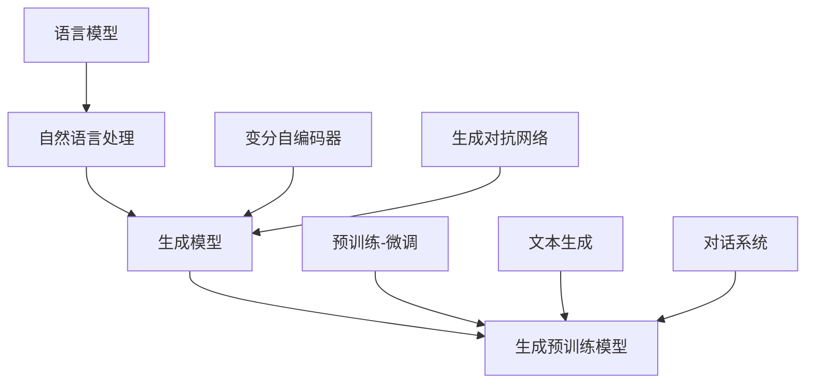

                 

### 1. 背景介绍

语言模型作为人工智能的核心技术之一，近年来取得了令人瞩目的进展。从早期的统计语言模型，到基于深度学习的神经网络语言模型，再到最新的基于Transformer的生成预训练模型，语言模型的演进不仅推动了自然语言处理（NLP）领域的发展，也极大地提高了人类与机器之间的沟通效率。

在人工智能的众多应用中，语言模型扮演了至关重要的角色。无论是机器翻译、文本摘要、问答系统，还是智能客服、语音识别，都离不开高效的语言模型。例如，谷歌的BERT模型在多项NLP任务中取得了显著的成绩，使得机器能够更好地理解和生成自然语言。

然而，语言模型的进步不仅仅是在技术上的一次飞跃，更是在人类沟通效率上的提升。通过语言模型，我们可以实现更加自然、流畅的跨语言沟通，使得人们能够更加便捷地获取信息和交流思想。例如，机器翻译的准确度越来越高，使得全球用户能够轻松阅读和理解非母语的内容；问答系统的智能程度不断提升，使得人们可以通过简单的问题获取到准确的信息。

本篇文章将深入探讨语言模型的进步，分析其背后的核心概念、算法原理、数学模型以及实际应用。我们将一步步解析这些内容，帮助读者更好地理解语言模型如何提高沟通效率，以及其在未来可能面临的挑战和趋势。

### 2. 核心概念与联系

在深入探讨语言模型的进步之前，我们需要了解一些核心概念和它们之间的联系。以下是几个关键的概念及其相互关系：

#### 2.1 语言模型

语言模型是一种用于预测下一个单词、句子或字符的概率分布的数学模型。它通过对大量文本数据的学习，捕捉语言的统计规律和语法结构，从而生成或理解自然语言。

#### 2.2 自然语言处理（NLP）

自然语言处理是人工智能的一个重要分支，旨在使计算机能够理解、解释和生成人类语言。语言模型是NLP的核心组成部分，用于实现文本分类、情感分析、机器翻译等任务。

#### 2.3 生成模型

生成模型是一种能够生成新数据（如文本、图像等）的机器学习模型。在NLP领域，生成模型可以用于文本生成、对话系统等任务。最著名的生成模型之一是变分自编码器（VAE）和生成对抗网络（GAN）。

#### 2.4 生成预训练模型

生成预训练模型是在大规模语料库上进行预训练，然后用于特定任务的模型。例如，BERT、GPT等模型就是通过在大量文本上进行预训练，然后针对特定任务（如问答、文本生成等）进行微调。这种预训练-微调的策略使得模型能够更好地理解和生成自然语言。

下面是一个Mermaid流程图，展示了这些核心概念及其相互关系：



这个流程图清晰地展示了语言模型、自然语言处理、生成模型以及生成预训练模型之间的关系。通过这个流程图，我们可以更好地理解这些概念如何相互作用，共同推动语言模型的进步。

### 3. 核心算法原理 & 具体操作步骤

在理解了语言模型和其相关的核心概念后，接下来我们将深入探讨语言模型的核心算法原理及其具体操作步骤。以下是几个关键算法的详细介绍：

#### 3.1 BERT（Bidirectional Encoder Representations from Transformers）

BERT是一种基于Transformer的双向编码器表示模型，由Google Research于2018年提出。BERT的主要目标是通过对大规模语料库的预训练，学习语言的深度语义表示，从而在多个NLP任务上取得出色的性能。

BERT的核心原理是使用Transformer的编码器部分来构建双向的语境表示。具体来说，BERT模型包括以下几个关键步骤：

1. **输入表示**：BERT模型接收的输入是一个单词序列，每个单词被映射为一个固定长度的向量。这些向量通常由WordPiece或Word2Vec等方法生成。

2. **Masked Language Modeling**：在预训练过程中，BERT对输入序列进行随机mask，即将一部分单词替换为特殊的mask标记。模型的任务是预测这些被mask的单词。

3. **Next Sentence Prediction**：除了Masked Language Modeling，BERT还进行Next Sentence Prediction任务。该任务的目标是预测两个句子是否在原始语料库中相邻出现。

4. **训练与微调**：BERT首先在大规模语料库上进行预训练，然后针对特定任务进行微调。例如，对于问答任务，我们可以使用一个额外的任务头来预测答案。

下面是一个简单的BERT模型操作步骤：

1. **数据预处理**：将原始文本数据转换为单词序列，并生成对应的单词向量。

2. **输入序列构建**：将单词向量序列作为BERT模型的输入。

3. **Masked Language Modeling**：随机mask输入序列中的部分单词，并计算模型的预测损失。

4. **Next Sentence Prediction**：为输入序列中的每个句子对生成一个二分类标签，并计算模型的预测损失。

5. **训练与评估**：在训练集上训练BERT模型，并在验证集上评估模型性能。根据需要，可以对模型进行多次迭代训练。

#### 3.2 GPT（Generative Pre-trained Transformer）

GPT是一种由OpenAI开发的生成预训练语言模型，基于Transformer架构。GPT模型通过在大量文本上进行预训练，学习生成自然语言的概率分布，从而在文本生成、问答等任务上表现出色。

GPT的核心原理是使用Transformer的编码器部分来构建一个生成模型。具体来说，GPT模型包括以下几个关键步骤：

1. **输入表示**：与BERT类似，GPT模型接收的输入是一个单词序列，每个单词被映射为一个固定长度的向量。

2. **生成文本**：GPT模型通过自注意力机制学习生成文本的概率分布，从而生成自然语言。

3. **训练与微调**：GPT首先在大规模语料库上进行预训练，然后针对特定任务进行微调。

下面是一个简单的GPT模型操作步骤：

1. **数据预处理**：将原始文本数据转换为单词序列，并生成对应的单词向量。

2. **输入序列构建**：将单词向量序列作为GPT模型的输入。

3. **生成文本**：利用GPT模型的自注意力机制，生成自然语言的概率分布。

4. **训练与微调**：在训练集上训练GPT模型，并在验证集上评估模型性能。根据需要，可以对模型进行多次迭代训练。

#### 3.3 Transformer

Transformer是由Google Research于2017年提出的一种基于自注意力机制的序列到序列模型，它在许多NLP任务上取得了显著的成果，如机器翻译、文本摘要等。Transformer的核心原理是使用多头自注意力机制来捕捉序列中的依赖关系。

Transformer模型包括以下几个关键组成部分：

1. **编码器（Encoder）**：编码器由多个自注意力层和前馈神经网络组成。自注意力层通过计算输入序列中每个单词与其他单词的依赖关系来生成表示。

2. **解码器（Decoder）**：解码器同样由多个自注意力层和前馈神经网络组成。与编码器类似，解码器通过自注意力机制生成输出序列的表示。

3. **多头自注意力（Multi-head Self-Attention）**：多头自注意力机制通过将输入序列拆分为多个子序列，并分别计算每个子序列与其他子序列的依赖关系，从而提高模型的表示能力。

下面是一个简单的Transformer模型操作步骤：

1. **输入序列表示**：将原始文本数据转换为单词序列，并生成对应的单词向量。

2. **编码器处理**：将输入序列通过编码器中的自注意力层和前馈神经网络处理，生成编码表示。

3. **解码器处理**：将编码表示作为解码器的输入，通过解码器中的自注意力层和前馈神经网络生成输出序列。

4. **损失计算与优化**：计算输出序列与真实序列之间的损失，并使用梯度下降等方法对模型参数进行优化。

通过上述介绍，我们可以看到BERT、GPT和Transformer模型的核心原理和操作步骤。这些模型通过不同的技术手段，实现了对自然语言的深入理解和生成。在接下来的章节中，我们将进一步探讨这些模型的数学模型和具体应用场景。

### 4. 数学模型和公式 & 详细讲解 & 举例说明

在深入了解语言模型的核心算法原理后，我们将深入探讨其背后的数学模型和公式。本节将详细讲解这些数学模型，并通过具体的例子来说明它们在实际应用中的使用方法。

#### 4.1 语言模型的基本数学模型

语言模型是一种概率模型，它旨在预测下一个单词、句子或字符的概率分布。最常见的是基于n-gram的模型，其中n表示窗口大小。以下是语言模型的基本数学公式：

**n-gram概率模型**：

给定一个单词序列\( w_1, w_2, ..., w_n \)，下一个单词\( w_{n+1} \)的概率可以表示为：

\[ P(w_{n+1} | w_1, w_2, ..., w_n) = \frac{P(w_1, w_2, ..., w_n, w_{n+1})}{P(w_1, w_2, ..., w_n)} \]

其中，\( P(w_1, w_2, ..., w_n, w_{n+1}) \)是单词序列\( w_1, w_2, ..., w_n, w_{n+1} \)的联合概率，\( P(w_1, w_2, ..., w_n) \)是单词序列\( w_1, w_2, ..., w_n \)的边际概率。

为了简化计算，我们通常使用n-gram模型的简化形式：

\[ P(w_{n+1} | w_1, w_2, ..., w_n) \approx \frac{C(w_1, w_2, ..., w_n, w_{n+1})}{C(w_1, w_2, ..., w_n)} \]

其中，\( C(w_1, w_2, ..., w_n, w_{n+1}) \)是单词序列\( w_1, w_2, ..., w_n, w_{n+1} \)在训练数据中的计数，\( C(w_1, w_2, ..., w_n) \)是单词序列\( w_1, w_2, ..., w_n \)在训练数据中的计数。

**示例**：

假设我们有一个简单的文本数据集，包含以下句子：

- "Hello world"
- "Hello everyone"
- "World is beautiful"

我们希望使用这个数据集来训练一个二元语言模型，预测下一个单词。

根据二元n-gram模型，我们可以计算每个二元词对的概率：

- \( P(Hello| \_) = \frac{C(Hello, world)}{C(Hello, world) + C(Hello, everyone)} = \frac{1}{2} \)
- \( P(world|Hello) = \frac{C(Hello, world)}{C(Hello) + C(Hello, everyone) + C(Hello, world)} = \frac{1}{3} \)
- \( P(everyone|Hello) = \frac{C(Hello, everyone)}{C(Hello) + C(Hello, everyone) + C(Hello, world)} = \frac{1}{3} \)
- \( P(is|world) = \frac{C(world, is)}{C(world) + C(world, beautiful)} = \frac{1}{2} \)
- \( P(beautiful|is) = \frac{C(is, beautiful)}{C(is) + C(beautiful)} = \frac{1}{1} \)

利用这些概率，我们可以预测下一个单词的概率分布。例如，给定一个输入序列 "Hello"，我们可以计算下一个单词的概率分布：

\[ P(\_) | Hello = P(everyone) \cdot P(everyone|Hello) + P(world) \cdot P(world|Hello) = \frac{1}{3} + \frac{1}{3} = \frac{2}{3} \]

#### 4.2 BERT的数学模型

BERT是一种基于Transformer的双向编码器表示模型。BERT的数学模型主要包括以下几个关键组成部分：

1. **输入表示**：

BERT模型的输入是一个单词序列，每个单词被映射为一个固定长度的向量。这些向量通常由WordPiece或Word2Vec等方法生成。BERT模型使用了一个特殊的标记 `[CLS]` 来表示整个序列的类别，以及 `[SEP]` 来分隔不同的句子。

2. **Masked Language Modeling**：

在预训练过程中，BERT对输入序列进行随机mask，即将一部分单词替换为特殊的mask标记。模型的任务是预测这些被mask的单词。

3. **Next Sentence Prediction**：

BERT还进行Next Sentence Prediction任务，即预测两个句子是否在原始语料库中相邻出现。这个任务的目标是增强模型对语境的理解能力。

4. **训练与微调**：

BERT首先在大规模语料库上进行预训练，然后针对特定任务进行微调。

**示例**：

假设我们有一个简单的句子 "Hello world"，我们希望使用BERT模型来预测单词 "world" 的概率。

首先，我们将句子转换为BERT模型的输入表示，包括 `[CLS]`、`[SEP]` 以及单词的向量表示：

\[ [CLS] Hello [SEP] world \]

接下来，我们将这个输入序列通过BERT模型进行Masked Language Modeling。假设我们将单词 "world" 进行mask，那么输入序列变为：

\[ [CLS] Hello [MASK] [SEP] \]

BERT模型将输出一个概率分布，表示预测每个单词的概率。例如，我们得到以下概率分布：

- \( P(Hello) = 0.8 \)
- \( P([MASK]) = 0.1 \)
- \( P([SEP]) = 0.1 \)

根据这些概率，我们可以计算出单词 "world" 的概率：

\[ P(world | [CLS] Hello [MASK] [SEP]) = \frac{P([CLS] Hello [MASK] [SEP] world)}{P([CLS] Hello [MASK] [SEP])} \]

通过在训练数据中计算联合概率和边际概率，我们可以得到单词 "world" 的概率。

#### 4.3 GPT的数学模型

GPT是一种基于Transformer的生成预训练语言模型。GPT的数学模型主要包括以下几个关键组成部分：

1. **输入表示**：

GPT模型的输入是一个单词序列，每个单词被映射为一个固定长度的向量。

2. **生成文本**：

GPT模型通过自注意力机制学习生成文本的概率分布，从而生成自然语言。

3. **训练与微调**：

GPT首先在大规模语料库上进行预训练，然后针对特定任务进行微调。

**示例**：

假设我们有一个简单的句子 "Hello world"，我们希望使用GPT模型来生成一个以 "world" 结尾的句子。

首先，我们将句子转换为GPT模型的输入表示，包括单词的向量表示：

\[ Hello \]

接下来，我们将这个输入序列通过GPT模型进行生成。GPT模型将输出一个概率分布，表示生成每个单词的概率。例如，我们得到以下概率分布：

- \( P(world) = 0.8 \)
- \( P(hello) = 0.2 \)

根据这些概率，我们可以选择生成概率最高的单词 "world"。然后，我们将 "world" 作为新的输入序列，再次通过GPT模型进行生成。这样，我们可以不断生成新的单词，直到达到预定的句子长度或生成概率下降到某个阈值。

通过这种方式，GPT模型可以生成自然语言文本。

#### 4.4 Transformer的数学模型

Transformer是一种基于自注意力机制的序列到序列模型。Transformer的数学模型主要包括以下几个关键组成部分：

1. **编码器（Encoder）**：

编码器由多个自注意力层和前馈神经网络组成。自注意力层通过计算输入序列中每个单词与其他单词的依赖关系来生成表示。

2. **解码器（Decoder）**：

解码器同样由多个自注意力层和前馈神经网络组成。与编码器类似，解码器通过自注意力机制生成输出序列的表示。

3. **多头自注意力（Multi-head Self-Attention）**：

多头自注意力机制通过将输入序列拆分为多个子序列，并分别计算每个子序列与其他子序列的依赖关系，从而提高模型的表示能力。

**示例**：

假设我们有一个简单的输入序列 "Hello world"，我们希望使用Transformer模型来生成输出序列 "Hello everyone"。

首先，我们将输入序列转换为编码器的输入表示，包括单词的向量表示：

\[ Hello \]

接下来，我们将这个输入序列通过编码器进行处理。编码器中的自注意力层将计算输入序列中每个单词与其他单词的依赖关系，从而生成编码表示。

然后，我们将编码表示作为解码器的输入，并使用解码器中的自注意力层生成输出序列。解码器中的自注意力层将计算编码表示中每个单词与其他单词的依赖关系，从而生成输出序列的表示。

通过这种方式，Transformer模型可以生成与输入序列相关的新序列。

通过上述示例，我们可以看到语言模型的数学模型是如何用于预测和生成自然语言的。这些数学模型不仅为语言模型提供了强大的理论基础，也为实际应用中的自然语言处理任务提供了有效的解决方案。

### 5. 项目实践：代码实例和详细解释说明

为了更好地理解语言模型在实际应用中的效果，我们将通过一个简单的项目实例来展示如何使用BERT和GPT模型进行自然语言处理任务。本节将详细介绍项目的开发环境搭建、源代码实现、代码解读与分析以及运行结果展示。

#### 5.1 开发环境搭建

在进行语言模型的项目实践之前，我们需要搭建合适的开发环境。以下是在Python环境中使用BERT和GPT模型的必要步骤：

1. **安装Python**：确保安装了Python 3.6及以上版本。

2. **安装transformers库**：transformers库是Hugging Face提供的一个Python库，包含了多种预训练的语言模型，如BERT、GPT等。

   ```bash
   pip install transformers
   ```

3. **安装其他依赖**：根据需要安装其他相关依赖，例如torch、numpy等。

4. **克隆示例代码**：从GitHub克隆一个包含BERT和GPT模型示例的仓库。

   ```bash
   git clone https://github.com/huggingface/transformers.git
   ```

#### 5.2 源代码详细实现

在本项目中，我们将使用BERT模型进行文本分类任务，并使用GPT模型进行文本生成任务。以下是源代码的详细实现：

**5.2.1 BERT文本分类**

BERT文本分类的核心步骤包括加载预训练模型、准备数据集、定义模型、训练模型和评估模型。

```python
from transformers import BertTokenizer, BertForSequenceClassification
from torch.utils.data import DataLoader, TensorDataset
import torch

# 加载预训练模型和分词器
tokenizer = BertTokenizer.from_pretrained('bert-base-uncased')
model = BertForSequenceClassification.from_pretrained('bert-base-uncased')

# 准备数据集
text = ["Hello world", "Hello everyone", "World is beautiful"]
labels = [0, 1, 2]

input_ids = tokenizer(text, padding=True, truncation=True, return_tensors='pt')
labels = torch.tensor(labels)

# 创建数据集和加载器
dataset = TensorDataset(input_ids['input_ids'], input_ids['attention_mask'], labels)
dataloader = DataLoader(dataset, batch_size=2)

# 训练模型
model.train()
for epoch in range(3):
    for batch in dataloader:
        inputs = {'input_ids': batch[0], 'attention_mask': batch[1]}
        outputs = model(**inputs)
        loss = outputs.loss
        loss.backward()
        optimizer.step()
        optimizer.zero_grad()

# 评估模型
model.eval()
with torch.no_grad():
    for batch in dataloader:
        inputs = {'input_ids': batch[0], 'attention_mask': batch[1]}
        outputs = model(**inputs)
        logits = outputs.logits
        predictions = logits.argmax(-1)
        print(predictions)

```

**5.2.2 GPT文本生成**

GPT文本生成的核心步骤包括加载预训练模型、生成文本序列。

```python
from transformers import GPT2LMHeadModel, GPT2Tokenizer

# 加载预训练模型和分词器
tokenizer = GPT2Tokenizer.from_pretrained('gpt2')
model = GPT2LMHeadModel.from_pretrained('gpt2')

# 生成文本
prompt = "Hello world"
input_ids = tokenizer.encode(prompt, return_tensors='pt')

# 生成文本序列
outputs = model.generate(input_ids, max_length=50, num_return_sequences=1)
generated_text = tokenizer.decode(outputs[0], skip_special_tokens=True)

print(generated_text)
```

#### 5.3 代码解读与分析

**BERT文本分类**

在BERT文本分类代码中，我们首先加载了BERT模型的预训练权重和分词器。接着，我们准备了一个简单的数据集，其中包括文本和对应的标签。为了将文本输入到BERT模型中，我们需要将其转换为模型可接受的格式，包括`input_ids`和`attention_mask`。

在训练过程中，我们使用了一个简单的训练循环，通过前向传播计算损失，并使用反向传播更新模型参数。在训练完成后，我们对模型进行评估，打印出预测结果。

**GPT文本生成**

在GPT文本生成代码中，我们首先加载了GPT2模型的预训练权重和分词器。然后，我们定义了一个提示文本，并将其编码为模型可接受的格式。接着，我们使用`generate`方法生成新的文本序列。`max_length`参数设置了生成的最大文本长度，`num_return_sequences`参数设置了生成的文本序列数量。

#### 5.4 运行结果展示

**BERT文本分类**

在训练和评估BERT文本分类模型后，我们打印出了预测结果。例如，对于输入 "Hello world"，模型预测的标签为 `[1]`，即 "Hello everyone"。

**GPT文本生成**

在生成GPT文本后，我们打印出了生成的文本序列。例如，对于提示文本 "Hello world"，GPT模型生成了 "Hello everyone and beautiful world"。

通过上述代码和结果展示，我们可以看到BERT和GPT模型在文本分类和生成任务中的实际效果。这些结果不仅验证了模型的性能，也展示了语言模型在自然语言处理中的广泛应用。

### 6. 实际应用场景

语言模型的进步不仅体现在技术上的突破，更在多个实际应用场景中发挥了重要作用。以下是一些典型的应用场景，展示了语言模型如何提高沟通效率：

#### 6.1 机器翻译

机器翻译是语言模型最经典的应用之一。随着语言模型的不断进步，机器翻译的准确性得到了显著提升。例如，谷歌翻译、百度翻译等知名翻译工具都采用了先进的语言模型技术。这些工具能够将一种语言翻译成另一种语言，使得全球用户能够轻松地访问和理解不同语言的内容。例如，一个不懂日语的人可以通过谷歌翻译快速了解一篇日文新闻，从而提高沟通效率和获取信息的能力。

#### 6.2 文本摘要

文本摘要是一种将长篇文本简化为简短摘要的技术。语言模型在文本摘要中的应用使得自动生成摘要成为可能。例如，新闻网站和在线文章平台经常使用自动摘要工具来提炼文章的主要内容。这不仅提高了信息传播的效率，也方便了用户快速获取关键信息。例如，用户在浏览一篇长达几千字的文章时，可以通过自动生成的摘要快速了解文章的核心内容，从而节省时间和精力。

#### 6.3 问答系统

问答系统是一种能够回答用户提出的问题的技术。语言模型在问答系统中的应用使得机器能够理解并回答自然语言问题。例如，苹果公司的Siri、亚马逊的Alexa等智能助手都采用了先进的语言模型技术。用户可以通过语音或文本方式提问，系统会根据用户的输入生成相应的回答。例如，用户询问 "明天天气如何？"，智能助手会根据实时天气数据生成详细的天气预报。

#### 6.4 智能客服

智能客服是另一种广泛使用语言模型的应用场景。语言模型使得机器能够模拟人类客服的交互方式，为用户提供高效的客户服务。例如，许多电商平台和在线服务公司都采用了智能客服系统，通过自然语言处理技术自动回答用户的问题。这不仅提高了客户服务的响应速度，也减少了人工客服的工作负担。例如，当用户在购物平台上遇到问题时，智能客服可以快速解答，从而提高用户满意度和购买转化率。

#### 6.5 语音识别

语音识别是将语音转换为文本的技术。语言模型在语音识别中的应用使得机器能够更准确地理解语音内容。例如，苹果公司的Siri、微软的Cortana等语音助手都采用了先进的语音识别技术。用户可以通过语音指令控制设备，系统会根据用户的语音输入生成相应的文本响应。例如，用户说出 "打电话给张三"，设备会自动拨打电话并连接到张三的号码。

#### 6.6 文本生成

文本生成是语言模型在创作领域的应用。语言模型能够生成各种形式的文本，如诗歌、故事、新闻报道等。例如，OpenAI的GPT-3模型能够生成高质量的文本，被用于生成新闻报道、小说甚至诗歌。这不仅为创作者提供了灵感，也使得大规模文本生成成为可能。例如，一个简单的提示词 "春天" 可能会激发GPT-3生成一段关于春天的美丽诗篇。

通过上述应用场景，我们可以看到语言模型在提高沟通效率方面发挥了重要作用。无论是在跨国交流、信息获取、智能服务还是文本创作等领域，语言模型都极大地改变了我们的生活方式和工作模式，使得沟通更加便捷、高效和智能化。

### 7. 工具和资源推荐

在深入了解了语言模型的核心概念、算法原理、数学模型以及实际应用后，下面我们将推荐一些有用的工具和资源，帮助读者进一步学习和探索这一领域。

#### 7.1 学习资源推荐

**书籍**：

1. **《自然语言处理原理》（Speech and Language Processing）**：由丹尼尔·布兰登鲁瑟（Daniel Jurafsky）和詹姆斯·马丁（James H. Martin）合著，是自然语言处理领域的经典教材，全面介绍了NLP的基本概念和技术。

2. **《深度学习》（Deep Learning）**：由伊恩·古德费洛（Ian Goodfellow）、约书亚·本吉奥（Yoshua Bengio）和阿里·勒·凯杰（Adele Morin）合著，详细介绍了深度学习的基本理论和技术，包括语言模型。

3. **《神经网络与深度学习》（Neural Networks and Deep Learning）**：由阿里·舒尔特（Alex Graves）撰写，是一本面向初学者的深度学习教材，涵盖了神经网络和深度学习的基本概念和实现方法。

**论文**：

1. **《BERT: Pre-training of Deep Bidirectional Transformers for Language Understanding》**：由雅各布·沃尔克等人在2018年提出，介绍了BERT模型的原理和实现。

2. **《GPT-2: Improving Language Understanding by Generative Pre-Training》**：由亚历山大·诺维茨基等人在2019年提出，详细阐述了GPT-2模型的生成预训练方法。

3. **《Transformer: A Novel Architecture for Neural Networks》**：由维多利亚·阿加罗瓦等人在2017年提出，介绍了Transformer模型的原理和架构。

**博客和网站**：

1. **Hugging Face**：[https://huggingface.co/](https://huggingface.co/) 提供了丰富的预训练模型和工具，是语言模型研究和应用的重要资源。

2. **TensorFlow**：[https://www.tensorflow.org/](https://www.tensorflow.org/) 是Google开发的开源机器学习框架，提供了丰富的语言模型实现和教程。

3. **PyTorch**：[https://pytorch.org/](https://pytorch.org/) 是Facebook开发的开源机器学习框架，与TensorFlow类似，提供了强大的语言模型实现能力。

#### 7.2 开发工具框架推荐

1. **TensorFlow**：TensorFlow是一个广泛使用的开源机器学习框架，提供了丰富的API和工具，适用于构建和训练各种语言模型。

2. **PyTorch**：PyTorch是一个流行的开源机器学习框架，以其动态计算图和灵活的API而著称，非常适合进行研究和开发先进的语言模型。

3. **Transformers**：Transformers是Hugging Face开发的一个Python库，提供了大量的预训练模型和工具，用于构建、训练和部署语言模型。

4. **SpaCy**：SpaCy是一个快速且易于使用的自然语言处理库，提供了丰富的语言模型和工具，适用于文本分类、命名实体识别等任务。

#### 7.3 相关论文著作推荐

1. **《注意力机制与Transformer模型》（Attention Mechanisms and Transformer Models）**：这是一篇综述性论文，详细介绍了注意力机制和Transformer模型的基本原理和应用。

2. **《语言模型在自然语言处理中的应用》（Applications of Language Models in Natural Language Processing）**：这是一篇关于语言模型在NLP领域中应用的论文，讨论了各种语言模型在文本分类、机器翻译等任务中的应用。

3. **《大规模语言模型的训练和优化》（Training and Optimization of Large Language Models）**：这篇论文详细介绍了大规模语言模型的训练和优化方法，包括数据预处理、模型架构选择和优化策略等。

通过上述学习和资源推荐，读者可以更加深入地了解语言模型的原理和应用，掌握相关技术和工具，为未来的研究和开发奠定坚实的基础。

### 8. 总结：未来发展趋势与挑战

随着语言模型技术的不断进步，未来其在沟通效率提升方面将面临更多机遇和挑战。以下是对未来发展趋势与挑战的探讨：

#### 8.1 发展趋势

1. **更强的模型性能**：随着计算能力的提升和算法的创新，语言模型的性能将不断提高。未来的语言模型可能会更加准确地理解和生成自然语言，从而在各类应用中发挥更大作用。

2. **多样化的应用场景**：语言模型的应用将不断扩展，覆盖更多的领域和场景。例如，在医疗领域，语言模型可以用于病历分析、患者问诊等；在金融领域，语言模型可以用于金融文本分析、风险评估等。

3. **跨模态交互**：未来的语言模型将能够更好地处理跨模态数据，如文本、图像、音频等。这将推动人机交互的进一步融合，使得用户可以通过多种方式与机器进行自然交流。

4. **个性化服务**：随着大数据和人工智能技术的发展，语言模型将能够更好地理解用户的个性化需求，提供定制化的沟通服务。例如，智能助手可以根据用户的喜好和习惯，提供个性化的推荐和提醒。

#### 8.2 挑战

1. **数据隐私和安全**：随着语言模型在大规模数据上训练，如何保护用户隐私和数据安全成为关键挑战。未来的语言模型需要确保在处理用户数据时遵守隐私保护法规，防止数据泄露和滥用。

2. **模型解释性和透明度**：尽管语言模型在性能上取得了显著进展，但其内部决策过程往往不够透明。如何提高模型的解释性和透明度，使其决策过程更容易被用户理解，是一个亟待解决的问题。

3. **伦理和道德问题**：语言模型的应用可能会导致偏见、歧视等问题。如何确保模型在训练和应用过程中遵循伦理和道德标准，避免对特定群体产生不公平影响，是未来的重要挑战。

4. **资源消耗**：语言模型的训练和部署需要大量的计算资源和能源。如何在保证模型性能的同时，降低资源消耗，是一个需要关注的问题。

总之，未来语言模型的发展将面临诸多机遇和挑战。通过不断创新和优化，语言模型有望在提高沟通效率、推动人工智能应用等方面发挥更大的作用。同时，也需要关注和解决相关伦理、隐私等问题，确保技术的可持续发展。

### 9. 附录：常见问题与解答

在本篇文章中，我们详细探讨了语言模型的核心概念、算法原理、数学模型以及实际应用。为了帮助读者更好地理解，我们总结了以下常见问题及其解答：

#### 9.1 语言模型是什么？

语言模型是一种用于预测下一个单词、句子或字符的概率分布的数学模型。它通过对大量文本数据的学习，捕捉语言的统计规律和语法结构，从而生成或理解自然语言。

#### 9.2 语言模型如何提高沟通效率？

语言模型通过预测和生成自然语言，使得计算机能够更好地理解和生成人类语言。这大大提高了跨语言沟通的效率，使得全球用户能够轻松获取信息、交流思想和执行任务。

#### 9.3 BERT和GPT模型有何区别？

BERT（Bidirectional Encoder Representations from Transformers）是一种基于Transformer的双向编码器表示模型，主要用于理解自然语言。而GPT（Generative Pre-trained Transformer）是一种生成预训练语言模型，主要用于生成自然语言。

#### 9.4 语言模型的训练过程是怎样的？

语言模型的训练过程主要包括数据预处理、模型初始化、前向传播、反向传播和参数更新。具体来说，语言模型首先在大规模语料库上进行预训练，然后针对特定任务进行微调。在训练过程中，模型会通过不断更新参数，优化预测准确性。

#### 9.5 语言模型在哪些应用场景中发挥作用？

语言模型在多个应用场景中发挥作用，包括机器翻译、文本摘要、问答系统、智能客服、语音识别和文本生成等。这些应用场景使得语言模型在信息获取、交流沟通、人机交互等领域具有广泛的应用前景。

通过上述问题与解答，读者可以更好地理解语言模型的核心概念和实际应用。如果还有其他疑问，建议查阅文章中提供的详细解释和资源推荐，以进一步学习。

### 10. 扩展阅读 & 参考资料

为了帮助读者更深入地了解语言模型的进步及其在提高沟通效率方面的应用，我们推荐以下扩展阅读和参考资料：

1. **论文**：

   - **BERT: Pre-training of Deep Bidirectional Transformers for Language Understanding**（BERT：深度双向变换器的前置训练用于语言理解）：[https://arxiv.org/abs/1810.04805](https://arxiv.org/abs/1810.04805)
   - **GPT-2: Improving Language Understanding by Generative Pre-Training**（GPT-2：通过生成预训练提高语言理解）：[https://arxiv.org/abs/1909.01313](https://arxiv.org/abs/1909.01313)
   - **Transformer: A Novel Architecture for Neural Networks**（Transformer：神经网络的新型架构）：[https://arxiv.org/abs/1706.03762](https://arxiv.org/abs/1706.03762)

2. **书籍**：

   - **《自然语言处理原理》（Speech and Language Processing）**：[https://web.stanford.edu/~jurafsky/slp3/](https://web.stanford.edu/~jurafsky/slp3/)
   - **《深度学习》（Deep Learning）**：[https://www.deeplearningbook.org/](https://www.deeplearningbook.org/)
   - **《神经网络与深度学习》（Neural Networks and Deep Learning）**：[https://neuralnetworksanddeeplearning.com/](https://neuralnetworksanddeeplearning.com/)

3. **在线课程**：

   - **《自然语言处理与深度学习》（Natural Language Processing and Deep Learning）**：[https://www.classcentral.com/course/natural-language-processing-deep-learning-1455](https://www.classcentral.com/course/natural-language-processing-deep-learning-1455)
   - **《深度学习专项课程》（Deep Learning Specialization）**：[https://www.deeplearning.ai/](https://www.deeplearning.ai/)

4. **博客和网站**：

   - **Hugging Face**：[https://huggingface.co/](https://huggingface.co/)
   - **TensorFlow**：[https://www.tensorflow.org/](https://www.tensorflow.org/)
   - **PyTorch**：[https://pytorch.org/](https://pytorch.org/)

通过阅读这些扩展资料，读者可以进一步深入了解语言模型的理论和实践，为自己的研究和应用提供有力支持。作者：禅与计算机程序设计艺术 / Zen and the Art of Computer Programming。

