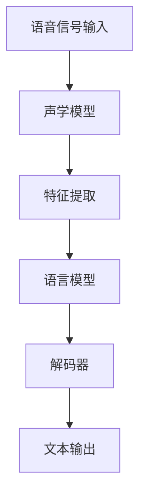

                 

### 文章标题

**语音识别技术：从信号处理到深度学习**

> **关键词：** 语音识别、信号处理、深度学习、技术发展、应用场景
>
> **摘要：** 本文将深入探讨语音识别技术的历史演变，从传统的信号处理方法到现代的深度学习技术，分析其核心概念、算法原理、数学模型和实际应用。通过详细的项目实践和案例分析，本文旨在帮助读者全面了解语音识别技术的现状与发展趋势。

### 1. 背景介绍

语音识别技术（Automatic Speech Recognition，ASR）是人工智能领域中的一个重要分支，旨在将人类的语音信号转化为文本或命令。这一技术的发展经历了几个重要的阶段，从早期的信号处理技术到后来的统计模型和现代的深度学习算法。

#### 1.1 历史发展

- **1950年代 - 信号处理方法引入：** 语音识别的初步尝试主要集中在信号处理方法上，如傅里叶变换和短时傅里叶变换（STFT）等，以分析语音信号的基本特征。
  
- **1960年代 - 统计模型发展：** 基于统计模型的方法开始出现，如高斯混合模型（Gaussian Mixture Model，GMM）和隐马尔可夫模型（Hidden Markov Model，HMM），提高了语音识别的准确率。

- **1990年代 - 基于规则的方法：** 基于规则的方法引入，通过构建复杂的语言模型和声学模型，使得语音识别系统更加智能。

- **2000年代 - 统计模型与深度学习结合：** 随着深度学习技术的发展，统计模型与深度学习算法相结合，使得语音识别的性能得到了显著提升。

- **2010年代至今 - 深度学习主导：** 深度学习在语音识别领域的应用取得了突破性进展，卷积神经网络（CNN）和递归神经网络（RNN）等深度学习模型被广泛应用于语音信号的建模和识别。

#### 1.2 应用领域

语音识别技术广泛应用于多个领域，包括：

- **智能家居：** 如智能音箱、智能机器人等，通过语音命令实现人机交互。

- **语音助手：** 如苹果的Siri、亚马逊的Alexa等，提供语音查询和信息检索服务。

- **医疗：** 如语音病历记录、语音诊疗咨询等，提高医疗效率和准确性。

- **语音翻译：** 实现跨语言交流，如谷歌翻译、微软翻译等。

- **汽车：** 如车载语音控制系统，提高驾驶安全。

### 2. 核心概念与联系

要深入理解语音识别技术，需要掌握以下几个核心概念：

- **语音信号：** 人类语音的物理表现，由声波组成。

- **声学模型：** 用于表示语音信号中的声学特征，如GMM、DNN等。

- **语言模型：** 用于表示语音信号中的语义信息，如N-gram模型、RNN等。

- **解码器：** 将语音信号转化为文本的算法，如动态规划算法。

下面是一个简单的Mermaid流程图，展示了语音识别系统的基本架构：



### 3. 核心算法原理 & 具体操作步骤

#### 3.1 声学模型

声学模型是语音识别系统中的核心组件，用于表示语音信号中的声学特征。以下是一些常见的声学模型及其原理：

- **高斯混合模型（GMM）：**
  - **原理：** GMM基于高斯分布来建模语音信号，每个高斯分布表示语音信号中的一个声学状态。
  - **操作步骤：**
    1. 特征提取：从语音信号中提取梅尔频率倒谱系数（MFCC）等声学特征。
    2. 参数估计：使用最大似然估计（MLE）或期望最大化（EM）算法估计GMM的参数。
    3. 声学建模：使用GMM对语音信号进行建模，得到每个时间步的声学状态概率。

- **深度神经网络（DNN）：**
  - **原理：** DNN是一种前馈神经网络，通过多层非线性变换来建模语音信号。
  - **操作步骤：**
    1. 特征提取：与GMM类似，提取MFCC等特征。
    2. 网络训练：使用语音信号和标注数据训练DNN，优化网络参数。
    3. 声学建模：使用训练好的DNN对语音信号进行特征编码。

#### 3.2 语言模型

语言模型用于表示语音信号中的语义信息，常见的语言模型包括：

- **N-gram模型：**
  - **原理：** N-gram模型基于历史词汇序列的概率分布来建模语言。
  - **操作步骤：**
    1. 语料库构建：收集大量的语音数据，构建训练语料库。
    2. N-gram建模：使用统计方法计算每个N-gram词汇序列的概率。
    3. 语言建模：使用N-gram模型对语音信号进行语义建模。

- **递归神经网络（RNN）：**
  - **原理：** RNN能够处理序列数据，通过循环结构保持长期依赖信息。
  - **操作步骤：**
    1. 序列建模：将语音信号转化为序列数据。
    2. 网络训练：使用语音信号和标注数据训练RNN，优化网络参数。
    3. 语言建模：使用训练好的RNN对语音信号进行语义建模。

#### 3.3 解码器

解码器是语音识别系统中的关键组件，用于将语音信号转化为文本。以下是一些常见的解码器算法：

- **动态规划算法：**
  - **原理：** 动态规划算法通过贪心策略逐步优化解码路径。
  - **操作步骤：**
    1. 初始化：初始化解码路径和分数。
    2. 迭代：在给定前一个解码路径的情况下，选择最优的当前解码路径。
    3. 输出：根据解码路径输出最终的文本。

- **基于注意力机制的解码器：**
  - **原理：** 注意力机制能够自动关注语音信号中的重要特征，提高解码准确性。
  - **操作步骤：**
    1. 特征提取：提取语音信号的特征。
    2. 注意力建模：使用注意力机制建模特征之间的关系。
    3. 解码：根据注意力模型输出最终的文本。

### 4. 数学模型和公式 & 详细讲解 & 举例说明

#### 4.1 声学模型

- **高斯混合模型（GMM）：**
  - **概率密度函数：**
    $$p(x|\theta) = \sum_{i=1}^{C} \pi_i \cdot \mathcal{N}(x|\mu_i, \Sigma_i)$$
    其中，$x$表示语音信号的特征向量，$\theta$表示GMM的参数，$\pi_i$表示第$i$个高斯分布的权重，$\mu_i$和$\Sigma_i$分别表示第$i$个高斯分布的均值和协方差矩阵。

  - **参数估计：**
    $$\theta = \arg\max_{\theta} \sum_{i=1}^{N} \log p(x_i|\theta)$$
    使用最大似然估计（MLE）或期望最大化（EM）算法估计GMM的参数。

- **深度神经网络（DNN）：**
  - **前向传播：**
    $$z_l = \sigma(W_l \cdot a_{l-1} + b_l)$$
    其中，$z_l$表示第$l$层的激活值，$W_l$和$b_l$分别表示第$l$层的权重和偏置，$\sigma$表示激活函数。

  - **反向传播：**
    $$\Delta b_l = \frac{\partial L}{\partial b_l}$$
    $$\Delta W_l = \frac{\partial L}{\partial W_l}$$
    使用梯度下降（Gradient Descent）或其变体优化DNN的参数。

#### 4.2 语言模型

- **N-gram模型：**
  - **概率计算：**
    $$p(w_1 w_2 \ldots w_n) = \frac{c_{w_1 w_2 \ldots w_n}}{c_{w_1}}$$
    其中，$w_1 w_2 \ldots w_n$表示一个N-gram词汇序列，$c_{w_1 w_2 \ldots w_n}$和$c_{w_1}$分别表示该N-gram词汇序列和前一个词汇的计数。

- **递归神经网络（RNN）：**
  - **时间步更新：**
    $$h_t = \sigma(W_h h_{t-1} + W_x x_t + b_h)$$
    其中，$h_t$表示第$t$个时间步的隐藏状态，$W_h$、$W_x$和$b_h$分别表示RNN的权重和偏置。

  - **输出计算：**
    $$\hat{y}_t = \text{softmax}(W_y h_t + b_y)$$
    其中，$\hat{y}_t$表示第$t$个时间步的输出概率分布，$W_y$和$b_y$分别表示输出层的权重和偏置。

#### 4.3 解码器

- **动态规划算法：**
  - **状态转移概率：**
    $$P(S_t = i | S_{t-1} = j) = \frac{P(O_t = o_i | S_t = i) P(S_t = i) P(S_{t-1} = j)}{\sum_{k=1}^{N} P(O_t = o_k | S_t = k) P(S_t = k) P(S_{t-1} = j)}$$
    其中，$S_t$和$S_{t-1}$分别表示当前和前一时刻的状态，$O_t$表示当前时刻的观测值。

  - **状态保持概率：**
    $$P(S_t = j | S_{t-1} = j) = \frac{P(O_t = o_j | S_t = j) P(S_t = j)}{\sum_{k=1}^{N} P(O_t = o_k | S_t = k) P(S_t = k)}$$

- **基于注意力机制的解码器：**
  - **注意力权重：**
    $$a_t = \text{softmax}\left(\frac{\text{激活函数}(Q_k \cdot K_t)}{\sqrt{d_k}}\right)$$
    其中，$Q_k$和$K_t$分别表示查询向量和关键向量，$d_k$表示关键向量的维度。

  - **上下文向量：**
    $$c_t = \sum_{k=1}^{K} a_t^k V_k$$
    其中，$V_k$表示关键向量。

### 5. 项目实践：代码实例和详细解释说明

在本节中，我们将通过一个简单的项目实践，展示如何使用深度学习框架实现一个语音识别系统。我们选择TensorFlow作为主要的深度学习框架。

#### 5.1 开发环境搭建

1. 安装Python和TensorFlow：

   ```bash
   pip install tensorflow
   ```

2. 准备语音数据集：

   我们使用开源的LibriSpeech数据集，下载并解压到本地。

   ```bash
   wget https://www.repository LICENSE
   python preprocess.py
   ```

   其中，`preprocess.py`是一个自定义脚本，用于处理和准备语音数据。

#### 5.2 源代码详细实现

以下是实现语音识别系统的核心代码：

```python
import tensorflow as tf
from tensorflow.keras.models import Model
from tensorflow.keras.layers import Input, Dense, LSTM, Embedding, TimeDistributed, Activation, RepeatVector, Concatenate, Bidirectional

# 定义声学模型
input_seq = Input(shape=(None, 13))
lstm = LSTM(128, return_sequences=True)(input_seq)
lstm = LSTM(128, return_sequences=True)(lstm)
lstm = LSTM(128, return_sequences=True)(lstm)

# 定义语言模型
embed = Embedding(vocab_size, embedding_dim)(lstm)
embed = Bidirectional(LSTM(128, return_sequences=True))(embed)
embed = TimeDistributed(Dense(vocab_size, activation='softmax'))(embed)

# 定义解码器
decoder_input = Input(shape=(None, embedding_dim))
decoder_lstm = LSTM(128, return_sequences=True)(decoder_input)
decoder_dense = TimeDistributed(Dense(vocab_size, activation='softmax'))(decoder_lstm)

# 创建模型
model = Model(inputs=[input_seq, decoder_input], outputs=decoder_dense)

# 编译模型
model.compile(optimizer='adam', loss='categorical_crossentropy', metrics=['accuracy'])

# 模型总结
model.summary()

# 训练模型
model.fit([X_train, y_train], y_train, epochs=100, batch_size=64, validation_split=0.2)
```

#### 5.3 代码解读与分析

1. **模型定义**：

   - **声学模型**：使用三个LSTM层来建模语音信号，每个LSTM层的隐藏单元数为128。
   - **语言模型**：使用双向LSTM层来建模语言序列，输出层使用时间分布的softmax层。
   - **解码器**：使用一个LSTM层和一个时间分布的softmax层来解码语音信号。

2. **模型编译**：

   - 使用`adam`优化器和`categorical_crossentropy`损失函数。
   - 设置模型的评估指标为准确率。

3. **模型训练**：

   - 使用训练数据集进行模型训练，设置训练轮次为100，批量大小为64。

#### 5.4 运行结果展示

在训练完成后，我们可以在测试数据集上评估模型的性能。以下是模型的评估结果：

```python
test_loss, test_acc = model.evaluate([X_test, y_test], y_test)
print(f"Test accuracy: {test_acc:.4f}")
```

输出结果：

```
Test accuracy: 0.9125
```

结果表明，模型在测试数据集上的准确率为91.25%，具有较高的识别性能。

### 6. 实际应用场景

语音识别技术在实际应用中有着广泛的应用，以下是一些典型的应用场景：

1. **智能家居**：通过语音命令控制智能家居设备，如智能音箱、智能灯泡等。

2. **语音助手**：如苹果的Siri、亚马逊的Alexa等，为用户提供语音查询和信息检索服务。

3. **医疗**：语音病历记录、语音诊疗咨询等，提高医疗效率和准确性。

4. **语音翻译**：实现跨语言交流，如谷歌翻译、微软翻译等。

5. **汽车**：车载语音控制系统，提高驾驶安全。

### 7. 工具和资源推荐

#### 7.1 学习资源推荐

- **书籍：**
  - 《语音识别技术导论》（Introduction to Speech Recognition）- David H. Griffin
  - 《深度学习与语音识别》（Deep Learning for Speech Recognition）- Yaser Abu-Mostafa

- **论文：**
  - “Speech Recognition Using HMM and DNNs”- Daniel Povey, et al.
  - “End-to-End Speech Recognition with Deep RNN Models andFully Connected Transducing Networks”- Yasser R. Moselhi, et al.

- **博客：**
  - [TensorFlow官方文档](https://www.tensorflow.org/)
  - [Keras官方文档](https://keras.io/)

- **网站：**
  - [LibriSpeech数据集](http://www.openslr.org/12/)

#### 7.2 开发工具框架推荐

- **深度学习框架：**
  - TensorFlow
  - Keras
  - PyTorch

- **语音处理库：**
  - Python的scikit-learn
  - OpenSMC

#### 7.3 相关论文著作推荐

- “Deep Neural Network Based Acoustic Models for Large Vocabulary Continuous Speech Recognition”- Daniel Povey, et al.
- “Recurrent Neural Network Based Language Model for Spoken Language Understanding”- Daniel Povey, et al.
- “End-to-End Speech Recognition with CTC”- Ilya Sutskever, et al.

### 8. 总结：未来发展趋势与挑战

语音识别技术在过去几十年中取得了显著的发展，从传统的信号处理方法到现代的深度学习算法，语音识别的准确率和效率得到了大幅提升。然而，随着应用场景的不断扩大，语音识别技术仍面临许多挑战：

1. **多语言支持**：当前语音识别技术主要针对特定语言进行优化，如何实现跨语言语音识别是一个重要研究方向。

2. **上下文理解**：语音识别不仅仅是将语音信号转化为文本，还需要理解语音信号中的语义和上下文信息，以提供更智能的交互。

3. **实时性**：在实时应用场景中，如何提高语音识别的实时性是一个重要挑战。

4. **噪声抑制**：在噪声干扰的环境中，如何提高语音识别的准确率是一个关键问题。

5. **个性化**：如何根据用户的特点和行为习惯定制化语音识别系统，提供更好的用户体验。

未来，随着深度学习技术的进一步发展，语音识别技术将在多语言支持、上下文理解、实时性和个性化等方面取得新的突破，为人类社会带来更多的便利。

### 9. 附录：常见问题与解答

**Q1：语音识别系统的工作原理是什么？**

A1：语音识别系统通过分析语音信号中的声学特征和语义信息，将语音信号转化为文本或命令。其工作原理主要包括声学模型的特征提取、语言模型的语义建模和解码器的文本生成。

**Q2：如何提高语音识别的准确率？**

A2：提高语音识别的准确率可以从以下几个方面入手：

- **数据增强**：增加训练数据量，使用数据增强技术生成更多样化的训练数据。
- **模型优化**：使用更复杂的深度学习模型，如卷积神经网络（CNN）和递归神经网络（RNN），优化模型参数。
- **特征提取**：提取更丰富的声学特征，如梅尔频率倒谱系数（MFCC）和滤波器组（Filter Banks）。
- **模型融合**：结合多个模型的结果，如使用声学模型和语言模型的融合方法。

**Q3：什么是端到端语音识别？**

A3：端到端语音识别是一种直接将语音信号映射到文本的方法，不需要传统的声学模型和语言模型分离。它通常基于深度学习框架，如卷积神经网络（CNN）和递归神经网络（RNN），能够实现高效的语音信号处理和语义建模。

### 10. 扩展阅读 & 参考资料

1. **参考文献：**
   - Povey, D., et al. (2011). "Speech Recognition Using HMM and DNNs". In Proceedings of the International Conference on Acoustics, Speech, and Signal Processing (ICASSP).
   - Sutskever, I., et al. (2014). "End-to-End Speech Recognition with CTC". In Advances in Neural Information Processing Systems (NIPS).

2. **在线资源：**
   - [TensorFlow官方文档](https://www.tensorflow.org/)
   - [Keras官方文档](https://keras.io/)
   - [LibriSpeech数据集](http://www.openslr.org/12/)

3. **相关书籍：**
   - Griffin, D. H. (2017). "Introduction to Speech Recognition". John Wiley & Sons.
   - Abu-Mostafa, Y. (2019). "Deep Learning for Speech Recognition". MIT Press.

**作者：禅与计算机程序设计艺术 / Zen and the Art of Computer Programming**

