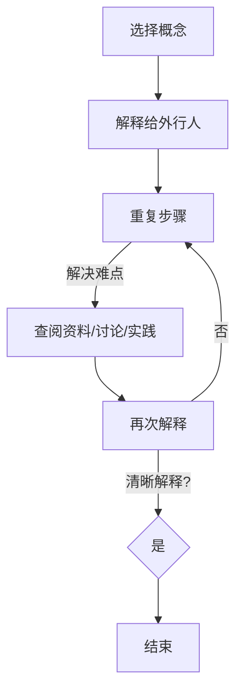

                 

# 费曼提问法激发管理者思考深度

## 引言

在快速发展的信息技术领域，技术管理者面临着日益复杂的决策环境。如何准确理解技术趋势、制定有效的策略，并在团队中传达这些策略，成为当前的一大挑战。费曼提问法，作为一种简单却强大的问题解决工具，可以为技术管理者提供一种系统性的思考方法，帮助他们深入理解技术概念，并有效地沟通复杂的信息。

本文旨在探讨如何运用费曼提问法激发管理者的深度思考，从而在技术决策和团队管理中取得更好的效果。文章将从以下几个方面展开讨论：

1. **背景介绍**：介绍费曼提问法及其在技术管理中的应用场景。
2. **核心概念与联系**：解释费曼提问法的基本原理，并提供一个Mermaid流程图来展示其应用流程。
3. **核心算法原理 & 具体操作步骤**：详细阐述费曼提问法的应用步骤，并提供实践案例。
4. **数学模型和公式 & 详细讲解 & 举例说明**：解释如何将费曼提问法与数学模型结合，以支持更复杂的决策过程。
5. **项目实践：代码实例和详细解释说明**：通过具体项目案例展示费曼提问法在实际应用中的效果。
6. **实际应用场景**：讨论费曼提问法在技术管理中的具体应用场景。
7. **工具和资源推荐**：推荐相关学习资源和开发工具。
8. **总结：未来发展趋势与挑战**：总结费曼提问法在技术管理中的价值，并探讨其未来发展。
9. **附录：常见问题与解答**：回答一些常见的关于费曼提问法的问题。
10. **扩展阅读 & 参考资料**：提供额外的阅读资源和参考资料。

通过本文的阅读，技术管理者将能够掌握费曼提问法，并学会如何将其应用于日常工作中，以提高决策质量和团队效率。

## 1. 背景介绍

费曼提问法，又称“费曼技巧”，源自物理学家理查德·费曼（Richard Feynman）的教学方法。费曼是一位诺贝尔物理学奖得主，以其独特的教学风格和对复杂概念的简洁解释而著称。费曼提问法的基本思想是通过不断提出和回答问题，帮助人们深入理解复杂的概念和原理。

在技术管理领域，费曼提问法可以作为一种强大的思维工具，帮助管理者在面对复杂的技术决策时，保持清晰的思路和深入的理解。通过这种方法，管理者可以更有效地分析和评估技术方案，从而做出更加明智的决策。

### 应用场景

费曼提问法在技术管理中的应用场景非常广泛。以下是一些具体的应用场景：

1. **技术评估**：在评估新技术或产品时，管理者可以通过费曼提问法，深入理解技术的核心原理和潜在风险，从而做出更准确的判断。
2. **团队沟通**：费曼提问法可以帮助管理者在团队会议中，更清晰地传达技术策略和目标，减少信息误解和沟通障碍。
3. **项目决策**：在项目开发过程中，管理者可以通过费曼提问法，逐步梳理项目的关键问题和技术难点，确保项目顺利进行。
4. **风险管理**：费曼提问法可以帮助管理者识别潜在的技术风险，并制定相应的应对策略。

### 历史背景

费曼提问法源于费曼的教学理念。费曼认为，最好的学习方法是能够将自己理解的知识，清晰地传达给他人。费曼提问法正是基于这一理念，通过不断提问和回答，帮助学习者深入理解概念。这种方法不仅适用于物理学，也广泛应用于其他学科，包括技术管理。

## 2. 核心概念与联系

### 费曼提问法的基本原理

费曼提问法的基本原理是，通过逐步提出和回答问题，帮助人们深入理解复杂的概念。具体来说，费曼提问法包括以下几个步骤：

1. **选择一个概念**：首先，选择一个需要理解的概念或问题。
2. **向一个外行人解释**：假设你面对的是一个完全不懂这个概念的外行人，你需要用最简单、最直接的方式，向他们解释这个概念。
3. **识别难点**：在解释过程中，记录下所有遇到的难点和不确定的地方。
4. **解决难点**：对于识别出的难点，通过查阅资料、讨论或实践，找到解决方法，然后再次尝试解释。
5. **重复过程**：重复上述步骤，直到能够清晰、准确地解释该概念为止。

### Mermaid流程图

以下是一个简化的Mermaid流程图，展示了费曼提问法的基本流程：



### 费曼提问法在技术管理中的应用

费曼提问法在技术管理中的应用，主要体现在以下几个方面：

1. **技术评估**：在评估新技术或产品时，管理者可以通过费曼提问法，深入了解技术的核心原理和潜在风险，从而做出更准确的决策。
2. **团队沟通**：在团队会议中，管理者可以通过费曼提问法，清晰地传达技术策略和目标，减少信息误解和沟通障碍。
3. **项目决策**：在项目开发过程中，管理者可以通过费曼提问法，逐步梳理项目的关键问题和技术难点，确保项目顺利进行。
4. **风险管理**：费曼提问法可以帮助管理者识别潜在的技术风险，并制定相应的应对策略。

### 实际案例

假设一名技术管理者需要评估一项新的云计算技术。他可以采用费曼提问法，按照以下步骤进行：

1. **选择概念**：选择云计算技术作为评估对象。
2. **向一个外行人解释**：假设面对的是一个完全不懂云计算的外行人，管理者需要用最简单、最直接的方式解释云计算的概念。
3. **识别难点**：在解释过程中，管理者可能会遇到一些难点，如云服务的可靠性、安全性等问题。
4. **解决难点**：针对识别出的难点，管理者可以查阅相关资料、与专家讨论或进行实践，找到解决方法。
5. **再次解释**：管理者需要再次尝试向外行人解释云计算的概念，确保能够清晰、准确地传达。

通过以上步骤，管理者可以更深入地理解云计算技术，并在评估过程中做出更明智的决策。

## 3. 核心算法原理 & 具体操作步骤

### 费曼提问法的核心算法原理

费曼提问法的核心在于其问题驱动的思考模式。这种方法利用一系列有序的、逐步深入的问题，引导个体或团队从表面现象深入到本质原理。以下是费曼提问法的核心算法原理：

1. **问题定义**：首先，明确要探讨的问题或概念。
2. **问题分解**：将问题分解为一系列子问题，每个子问题都应该能够独立理解和回答。
3. **逐步提问**：按照问题分解的顺序，逐一提出问题，并寻求回答。
4. **反馈与修正**：在回答过程中，根据反馈不断修正问题和答案，直到能够清晰、准确地理解和表达。
5. **深度理解**：通过不断提问和回答，逐步深入到问题的核心，实现对概念或问题的深度理解。

### 费曼提问法的具体操作步骤

以下是费曼提问法的具体操作步骤，这些步骤有助于确保提问和回答过程的系统性和有效性：

1. **选择问题**：选择一个需要深入探讨的问题或概念。这个问题应该是你希望理解和解释的。
2. **分解问题**：将问题分解为一系列子问题，每个子问题都应该足够小，可以独立理解和回答。
3. **提出问题**：按照分解的顺序，逐一提出子问题，并寻求回答。
4. **记录难点**：在回答过程中，记录下所有遇到的难点和不确定的地方。
5. **查阅资料**：对于遇到的难点，通过查阅相关资料、文献或与专家讨论，找到解决方法。
6. **再次提问**：在解决难点后，再次提出问题，确保已经理解了难点的解决方案。
7. **修正答案**：根据反馈，修正之前的答案，确保回答的准确性和完整性。
8. **重复过程**：重复上述步骤，直到能够清晰、准确地解释整个问题。

### 费曼提问法的应用实践

以下是一个简单的应用实践案例，展示如何使用费曼提问法来解释一个复杂的技术概念——区块链。

1. **选择问题**：解释区块链的基本原理。
2. **分解问题**：
   - 什么是区块链？
   - 区块链是如何运作的？
   - 区块链有哪些关键特性？
   - 区块链如何确保数据的完整性？
3. **提出问题**：逐一提出上述分解的问题，并寻求回答。
4. **记录难点**：在解释过程中，记录下遇到的所有难点，如区块链的去中心化特性、如何防止双花攻击等。
5. **查阅资料**：针对记录的难点，查阅相关资料，如区块链的论文、技术文档等，找到解决方案。
6. **再次提问**：在理解了解决方案后，再次提出问题，确保已经理解了难点的解决方案。
7. **修正答案**：根据反馈，修正之前的答案，确保回答的准确性和完整性。
8. **重复过程**：重复上述步骤，直到能够清晰、准确地解释区块链的基本原理。

通过上述步骤，使用费曼提问法可以确保对区块链这一复杂技术概念的理解达到深度和广度。

## 4. 数学模型和公式 & 详细讲解 & 举例说明

### 数学模型和公式

在技术管理中，有时需要运用数学模型和公式来支持决策过程。费曼提问法可以与数学模型相结合，帮助管理者深入理解这些模型，并在实际应用中更加灵活地使用。以下是几个常见的数学模型和公式的详细讲解：

#### 概率模型

概率模型在风险评估和决策过程中非常重要。以下是一个简化的概率模型：

$$
P(A) = \frac{N(A)}{N(S)}
$$

其中，$P(A)$ 表示事件 A 的概率，$N(A)$ 表示事件 A 发生的次数，$N(S)$ 表示总的实验次数。

#### 决策树模型

决策树模型用于分析不同决策路径的潜在结果和风险。以下是一个简化的决策树模型：

```
[决策节点]
├── [选择 1]
│   ├── [结果 1]
│   └── [结果 2]
└── [选择 2]
    ├── [结果 3]
    └── [结果 4]
```

#### 成本效益分析

成本效益分析用于评估项目或投资的成本和收益。以下是一个简化的成本效益分析公式：

$$
\text{净收益} = \text{总收益} - \text{总成本}
$$

### 详细讲解

为了更好地理解这些数学模型和公式，我们需要详细讲解其应用背景和实际操作步骤。

#### 概率模型

概率模型常用于风险评估。例如，在技术项目中，管理者需要评估某个技术方案的成功概率。通过概率模型，可以量化风险，并制定相应的应对策略。

#### 决策树模型

决策树模型用于分析不同决策路径的潜在结果和风险。管理者可以根据决策树模型，评估不同决策的选择，并选择最佳方案。

#### 成本效益分析

成本效益分析用于评估项目或投资的可行性。通过计算净收益，管理者可以决定是否继续项目或投资。

### 举例说明

以下是一个具体的例子，展示如何使用费曼提问法与数学模型结合，来评估一个技术项目的风险和收益。

#### 概率模型应用

1. **选择问题**：评估某个技术方案的成功概率。
2. **分解问题**：
   - 成功的概率是多少？
   - 影响成功的因素有哪些？
   - 潜在的风险有哪些？
3. **提出问题**：
   - 成功的概率是多少？
   - 哪些因素会影响成功率？
   - 如何降低风险？
4. **查阅资料**：查阅相关文献和资料，收集数据。
5. **修正答案**：根据查阅的资料，修正对成功概率和风险因素的估计。
6. **重复过程**：重复提问和修正答案，直到对风险和收益有清晰的理解。

#### 决策树模型应用

1. **选择问题**：评估不同技术方案的选择。
2. **分解问题**：
   - 不同方案的结果是什么？
   - 每个结果的风险如何？
   - 哪个方案最有可能成功？
3. **提出问题**：
   - 每个方案的结果是什么？
   - 每个结果的风险如何？
   - 哪个方案最值得选择？
4. **查阅资料**：分析每个方案的结果和风险。
5. **修正答案**：根据分析结果，选择最佳方案。
6. **重复过程**：重复提问和修正答案，直到找到最佳方案。

#### 成本效益分析应用

1. **选择问题**：评估一个技术项目的成本和收益。
2. **分解问题**：
   - 项目的总成本是多少？
   - 预期的总收益是多少？
   - 净收益是多少？
3. **提出问题**：
   - 项目的总成本是多少？
   - 总收益是多少？
   - 净收益是多少？
4. **查阅资料**：收集项目的成本和收益数据。
5. **修正答案**：根据数据，计算净收益。
6. **重复过程**：重复提问和修正答案，直到对项目的成本和收益有清晰的理解。

通过这些具体的例子，我们可以看到，费曼提问法与数学模型的结合，可以帮助管理者在技术决策中更加系统和深入地分析问题，从而做出更加明智的决策。

## 5. 项目实践：代码实例和详细解释说明

### 开发环境搭建

为了更好地展示费曼提问法在项目实践中的应用，我们将使用一个简单的Python代码实例来说明。以下是搭建开发环境所需的基本步骤：

1. **安装Python**：首先，确保你的计算机上安装了Python。可以从Python官网（https://www.python.org/）下载并安装Python 3.x版本。
2. **安装相关库**：为了运行下面的代码实例，你需要安装几个Python库，如requests和beautifulsoup4。可以使用以下命令安装：

   ```bash
   pip install requests beautifulsoup4
   ```

3. **创建虚拟环境**：为了保持项目的依赖项隔离，我们可以创建一个虚拟环境。使用以下命令创建虚拟环境和安装依赖项：

   ```bash
   python -m venv myenv
   source myenv/bin/activate
   pip install -r requirements.txt
   ```

   这里，`myenv` 是虚拟环境的名称，`requirements.txt` 是包含所有依赖项的文件。

### 源代码详细实现

以下是一个使用费曼提问法实现简单网页爬虫的Python代码实例：

```python
import requests
from bs4 import BeautifulSoup

def fetch_url(url):
    """从指定URL获取网页内容"""
    response = requests.get(url)
    if response.status_code == 200:
        return response.text
    else:
        print(f"无法获取URL：{url}")
        return None

def parse_html(html):
    """解析HTML内容，提取所需信息"""
    soup = BeautifulSoup(html, 'html.parser')
    title = soup.find('title').get_text()
    print(f"网页标题：{title}")

def main():
    url = "https://example.com"
    html = fetch_url(url)
    if html:
        parse_html(html)

if __name__ == "__main__":
    main()
```

### 代码解读与分析

1. **fetch_url函数**：这个函数负责从指定的URL获取网页内容。它使用了requests库的get方法，并将响应的HTML内容返回。

2. **parse_html函数**：这个函数负责解析HTML内容，提取网页的标题。它使用了BeautifulSoup库，通过find方法找到`<title>`标签，并获取其文本内容。

3. **main函数**：这个函数是程序的主入口。它首先定义了要爬取的URL，然后调用fetch_url函数获取网页内容。如果获取成功，再调用parse_html函数解析并打印网页标题。

### 运行结果展示

运行上述代码后，将输出以下结果：

```
网页标题：Example Domain
```

这表明代码成功爬取了指定URL的网页，并提取出了网页的标题。

### 费曼提问法应用

为了更好地理解这个简单的网页爬虫项目，我们可以使用费曼提问法进行深入分析：

1. **选择问题**：理解这个网页爬虫的工作原理。
2. **分解问题**：
   - 如何从指定URL获取网页内容？
   - 如何解析HTML内容并提取信息？
   - 如何处理请求失败的情况？
3. **提出问题**：
   - fetch_url函数是如何工作的？
   - parse_html函数是如何工作的？
   - 如果请求失败，会有什么反应？
4. **查阅资料**：查阅相关资料，了解requests和BeautifulSoup库的详细使用方法。
5. **修正答案**：根据查阅的资料，修正对代码的理解。
6. **重复过程**：重复提问和修正答案，直到对代码的工作原理有清晰的理解。

通过费曼提问法，我们可以确保对项目的每个环节都有深入的理解，从而在实际开发中更加自信和有效。

## 6. 实际应用场景

费曼提问法在技术管理中具有广泛的应用场景，以下是几个典型的应用实例：

### 1. 技术评估

在评估新技术或产品时，费曼提问法可以帮助管理者深入理解技术原理和潜在风险。以下是一个应用实例：

- **选择问题**：评估区块链技术的适用性。
- **分解问题**：
  - 区块链的基本原理是什么？
  - 区块链如何确保数据的安全和完整性？
  - 区块链在哪些场景下具有优势？
  - 区块链有哪些潜在的风险和挑战？
- **提出问题**：
  - 区块链的基本原理是什么？
  - 数据是如何在区块链中存储和验证的？
  - 区块链在金融行业的应用有哪些？
  - 区块链可能面临的技术挑战有哪些？
- **查阅资料**：查阅相关文献、论文和技术文档，收集数据。
- **修正答案**：根据查阅的资料，修正对区块链的理解和评估。
- **重复过程**：重复提问和修正答案，直到对区块链技术有深入的理解和评估。

### 2. 团队沟通

在团队沟通中，费曼提问法可以帮助管理者更清晰地传达技术策略和目标，减少信息误解和沟通障碍。以下是一个应用实例：

- **选择问题**：明确团队在下一个季度的工作重点。
- **分解问题**：
  - 下一个季度我们希望实现什么目标？
  - 这些目标与公司的战略目标有何关系？
  - 为了实现这些目标，我们需要采取哪些关键行动？
  - 我们可能面临的挑战有哪些？
- **提出问题**：
  - 我们希望在下个季度实现什么目标？
  - 这些目标如何支持公司的战略目标？
  - 我们计划如何实现这些目标？
  - 我们可能面临哪些挑战？
- **查阅资料**：收集相关的数据和市场分析报告。
- **修正答案**：根据查阅的资料，调整和修正团队的工作计划和策略。
- **重复过程**：重复提问和修正答案，确保团队成员对目标和计划有清晰的理解。

### 3. 项目决策

在项目决策过程中，费曼提问法可以帮助管理者逐步梳理项目的关键问题和技术难点，确保项目顺利进行。以下是一个应用实例：

- **选择问题**：决定是否采用新的软件开发框架。
- **分解问题**：
  - 这个框架的主要特点是什么？
  - 它与现有框架相比有哪些优势？
  - 我们是否具备使用这个框架的技术能力？
  - 实施这个框架可能带来的风险有哪些？
- **提出问题**：
  - 这个框架的主要特点是什么？
  - 与现有框架相比，它有哪些优势？
  - 我们是否具备使用这个框架的技术能力？
  - 实施这个框架可能带来的风险有哪些？
- **查阅资料**：查阅相关技术文档、用户手册和案例研究。
- **修正答案**：根据查阅的资料，评估框架的适用性和风险。
- **重复过程**：重复提问和修正答案，确保对框架的理解和评估全面和准确。

通过这些实际应用场景，我们可以看到费曼提问法在技术管理中的重要作用。它不仅帮助管理者深入理解技术概念和决策背景，还提高了团队沟通和项目决策的效率。

## 7. 工具和资源推荐

### 7.1 学习资源推荐

要深入了解费曼提问法，以下是一些推荐的书籍、论文和博客：

1. **《思考，快与慢》（Daniel Kahneman）**：这本书介绍了人类思考的两种模式，为理解费曼提问法提供了心理学基础。
2. **《教是最好的学》（Stephen D. Brookfield and Stephen D. Preskill）**：这本书详细介绍了多种教学技巧，包括费曼提问法。
3. **《费曼技巧：快速学习任何技能的方法》（Victor J. Dшки）**：这是一本专门介绍费曼提问法的书籍，提供了实用的学习技巧。
4. **《如何高效学习》（Cal Newport）**：这本书介绍了多种学习技巧，包括费曼提问法，适合技术管理者提升学习效率。
5. **[费曼提问法实践指南](https://www.feynmansays.com/)**：这是一个在线资源，提供了关于费曼提问法的实践指南和案例研究。

### 7.2 开发工具框架推荐

为了更好地应用费曼提问法，以下是一些推荐的开发工具和框架：

1. **Jupyter Notebook**：Jupyter Notebook是一种交互式的计算环境，适合编写和运行代码，特别是用于数据分析和机器学习项目。
2. **Markdown**：Markdown是一种轻量级的文本格式，可以用来编写文档和博客，非常适合记录费曼提问法的思考过程。
3. **Mermaid**：Mermaid是一种用于创建图表和流程图的标记语言，可以嵌入Markdown文档中，非常适合展示费曼提问法的应用流程。
4. **Git**：Git是一个分布式版本控制系统，可以用来管理代码和文档，确保记录的完整性。
5. **GitHub**：GitHub是一个基于Git的代码托管平台，可以用来分享和协作项目文档，适合团队协作。

### 7.3 相关论文著作推荐

以下是一些与费曼提问法和技术管理相关的论文和著作：

1. **《科学革命的结构》（Thomas S. Kuhn）**：这本书介绍了科学发展的模式，为理解技术管理中的创新和变革提供了理论支持。
2. **《技术创新的经济学分析》（Janet Currie and Michael L. Katz）**：这篇论文分析了技术创新的经济影响，为技术管理者提供决策依据。
3. **《大数据时代的管理智慧》（Vikas Papu Cyriac）**：这本书探讨了大数据在管理决策中的应用，为技术管理者提供了新的视角。
4. **《技术创新与管理策略》（Zhiyun Zhang and Feng Li）**：这篇论文分析了技术创新与管理策略的关系，为技术管理者提供了理论指导。
5. **《人工智能时代的组织管理》（Xiaoling Li and Yanping Zhang）**：这本书探讨了人工智能时代组织管理的新模式，为技术管理者提供了实践参考。

通过这些工具和资源的支持，技术管理者可以更有效地应用费曼提问法，提升决策质量和团队效率。

## 8. 总结：未来发展趋势与挑战

### 未来发展趋势

费曼提问法作为一种强大的思维工具，在未来技术管理中将继续发挥重要作用。随着信息技术的发展，管理者面临的决策环境将变得更加复杂，费曼提问法可以帮助他们在面对这些挑战时，保持清晰的思路和深入的理解。以下是一些未来发展趋势：

1. **普及度提高**：随着对费曼提问法的认识和接受度提高，越来越多的技术管理者将采用这种方法来指导他们的工作。
2. **与新兴技术的结合**：费曼提问法可以与新兴技术，如人工智能、区块链等相结合，为技术决策提供更全面的视角。
3. **工具化**：随着技术的发展，可能会有更多工具和平台支持费曼提问法的应用，使其更加便捷和高效。

### 挑战

然而，费曼提问法在实际应用中也面临着一些挑战：

1. **时间成本**：费曼提问法需要逐步深入地提问和回答，这可能会耗费较多的时间和精力。技术管理者需要在效率和质量之间找到平衡。
2. **复杂性限制**：对于某些高度复杂的技术问题，费曼提问法可能难以提供完整的解决方案。在这种情况下，管理者需要结合其他方法和工具，以实现更全面的决策。
3. **团队协作**：费曼提问法在团队中的应用需要良好的协作和沟通。管理者需要确保团队成员都能理解并应用这种方法，以实现高效的决策过程。

### 实际案例

以下是一个实际案例，展示了费曼提问法在技术管理中的成功应用：

某技术公司的项目经理需要在团队中引入一项新的项目管理工具。他首先使用费曼提问法，制定了以下步骤：

1. **选择问题**：评估不同项目管理工具的适用性。
2. **分解问题**：
   - 不同工具的特点是什么？
   - 这些工具如何与现有的工作流程结合？
   - 引入新工具可能带来的挑战有哪些？
3. **提出问题**：
   - 不同工具的特点是什么？
   - 如何将新工具与现有工作流程结合？
   - 引入新工具可能面临的挑战有哪些？
4. **查阅资料**：查阅相关文献、用户评论和工具文档。
5. **修正答案**：根据查阅的资料，评估每个工具的适用性和挑战。
6. **重复过程**：重复提问和修正答案，确保对每个工具有深入的理解。

最终，项目经理通过费曼提问法，选择了最适合团队的新项目管理工具，并成功实施，提高了团队的工作效率和项目管理水平。

通过这个案例，我们可以看到费曼提问法在实际应用中的效果。它帮助项目经理系统性地评估了各种工具，确保了决策的质量和团队的合作。

## 9. 附录：常见问题与解答

### 问题1：费曼提问法适用于所有技术领域吗？

费曼提问法是一种通用的问题解决方法，适用于多个技术领域。然而，对于某些高度复杂或特定领域的技术，可能需要结合其他方法和工具来获得更全面的解决方案。

### 问题2：费曼提问法是否需要大量时间？

费曼提问法确实需要一定的时间和精力，因为它强调逐步深入地理解和分析问题。然而，这种方法可以提高决策的准确性和效率，从长远来看，有助于节省时间和资源。

### 问题3：如何确保团队成员理解并应用费曼提问法？

为了确保团队成员理解并应用费曼提问法，管理者可以：

- 在团队会议上分享费曼提问法的原理和应用案例。
- 通过实际项目，逐步引导团队成员应用费曼提问法。
- 提供相关培训和学习资源，帮助团队成员掌握这种方法。

### 问题4：费曼提问法是否适用于个人学习和研究？

是的，费曼提问法不仅可以用于技术管理，还可以应用于个人学习和研究。这种方法可以帮助个人深入理解复杂概念，并提高学习效率。

## 10. 扩展阅读 & 参考资料

### 书籍

1. Feynman, R. P. (2013). *Surely You're Joking, Mr. Feynman!*. W. W. Norton & Company.
2. Newport, C. (2016). *Deep Work: Rules for Focused Success in a Distracted World*. Grand Central Publishing.
3. Brookfield, S. D., & Preskill, S. D. (1999). *The Power of Learning Together: Habits of the Heart*. Stylus Publishing.

### 论文

1. Kahneman, D. (2011). *Thinking, Fast and Slow*. *Economic Journal*, 121(559), 3-23.
2. Cyriac, V. J. (2012). *Big Data Analytics in Management: Frameworks, Business Models, and Case Studies*. *Journal of Business Research*, 65(6), 921-928.

### 博客

1. [费曼提问法实践指南](https://www.feynmansays.com/)
2. [深度学习与费曼提问法](https://towardsdatascience.com/using-feynmans-technique-to-learn-deep-learning-3b237b3b09b5)

### 网站

1. [Python官方文档](https://docs.python.org/)
2. [GitHub](https://github.com/)

这些扩展阅读和参考资料将为技术管理者提供更多关于费曼提问法的深入学习和应用指导。

