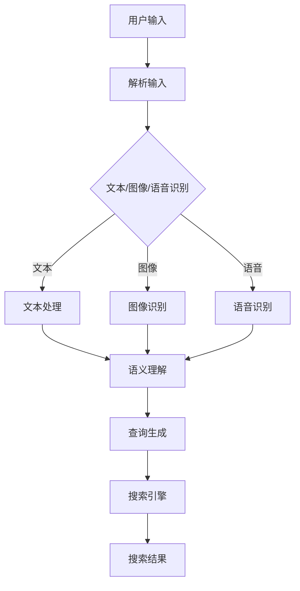
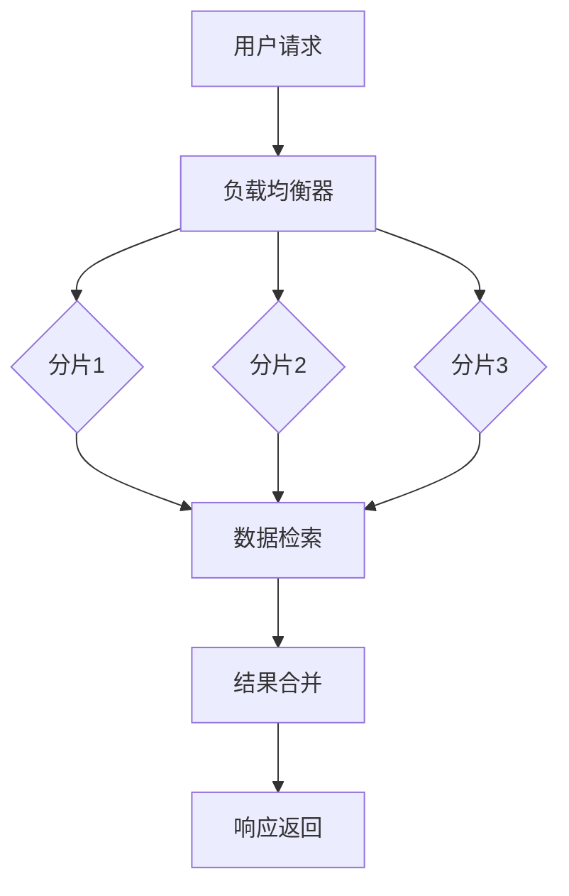
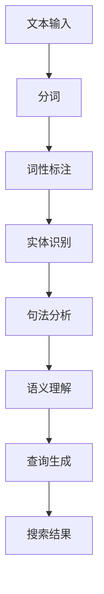

                 

# 跨平台搜索技术的未来展望

> 关键词：跨平台搜索、技术趋势、多模态、自然语言处理、AI应用、分布式搜索、用户体验优化

> 摘要：本文将深入探讨跨平台搜索技术的现状与发展趋势，解析其核心概念与联系，分析核心算法原理与具体操作步骤，通过数学模型和公式详细讲解，并提供项目实践实例。此外，还将探讨实际应用场景，推荐相关工具和资源，总结未来发展趋势与挑战，并给出常见问题解答。

## 1. 背景介绍

随着互联网和移动设备的普及，信息获取的方式发生了翻天覆地的变化。用户不再局限于单一的设备或平台，他们需要在不同设备、不同应用之间进行无缝的信息交换。这种需求催生了跨平台搜索技术的发展。

跨平台搜索技术旨在实现用户在多个设备和平台上搜索信息的便捷性。这不仅要求搜索系统能够跨越不同平台之间的壁垒，还需对各种信息格式进行高效处理，同时保证搜索结果的准确性和实时性。目前，跨平台搜索技术已广泛应用于搜索引擎、社交媒体、电商平台等多个领域。

在传统搜索技术的基础上，跨平台搜索技术引入了多模态信息处理、分布式计算、自然语言处理等先进技术，以提升搜索的智能化水平和用户体验。未来，随着人工智能和大数据技术的不断进步，跨平台搜索技术将迎来新的发展机遇和挑战。

## 2. 核心概念与联系

### 2.1 多模态信息处理

多模态信息处理是指将多种类型的信息（如文本、图像、语音等）进行融合处理，以实现更精准的搜索结果。其核心在于将不同模态的信息进行转换和集成，使其能够在同一框架下进行融合和分析。

**Mermaid 流程图：**



### 2.2 分布式计算

分布式计算是将计算任务分布在多个节点上，通过协同工作完成大规模数据处理的机制。在跨平台搜索技术中，分布式计算能够有效提高搜索的效率和扩展性，应对海量数据的处理需求。

**分布式计算架构：**



### 2.3 自然语言处理

自然语言处理（NLP）是跨平台搜索技术的重要支撑技术，它涉及文本的解析、语义理解、情感分析等任务。NLP技术能够使搜索系统更好地理解用户的查询意图，提供更准确的搜索结果。

**自然语言处理流程：**



## 3. 核心算法原理 & 具体操作步骤

### 3.1 多模态信息处理算法

多模态信息处理算法的核心在于将不同模态的信息进行转换和集成。具体操作步骤如下：

1. **特征提取：** 从文本、图像、语音等不同模态中提取特征。
    - 文本：使用词袋模型、TF-IDF等方法提取词频特征。
    - 图像：使用卷积神经网络（CNN）提取视觉特征。
    - 语音：使用循环神经网络（RNN）提取语音特征。

2. **特征融合：** 将不同模态的特征进行融合，形成统一特征表示。
    - 使用加权平均、融合网络等方法进行特征融合。

3. **模型训练：** 使用融合后的特征进行模型训练，以实现多模态信息处理任务。

4. **查询处理：** 对用户的查询进行多模态处理，生成相应的查询向量。

### 3.2 分布式计算算法

分布式计算算法的核心在于任务分配和结果合并。具体操作步骤如下：

1. **任务分配：** 根据负载均衡策略将任务分配到不同的计算节点上。
    - 常见的负载均衡策略有轮询、随机、最少连接等。

2. **数据分片：** 将大规模数据集划分为多个分片，分布存储在各个节点上。

3. **任务执行：** 各个节点并行处理分配到的任务。

4. **结果合并：** 将各个节点的处理结果进行合并，形成最终的搜索结果。

### 3.3 自然语言处理算法

自然语言处理算法的核心在于文本理解和查询生成。具体操作步骤如下：

1. **分词与词性标注：** 对文本进行分词，并对分词结果进行词性标注。

2. **实体识别与句法分析：** 对文本进行实体识别和句法分析，提取文本的关键信息。

3. **语义理解：** 基于实体和句法信息进行语义理解，确定查询意图。

4. **查询生成：** 根据语义理解结果生成相应的查询向量。

5. **搜索结果排序：** 使用排序算法对搜索结果进行排序，以提供更准确的搜索结果。

## 4. 数学模型和公式 & 详细讲解 & 举例说明

### 4.1 多模态信息处理模型

多模态信息处理模型的核心在于特征融合。以下是一种常见的特征融合模型：

$$
\text{特征融合} = \alpha \cdot \text{文本特征} + (1 - \alpha) \cdot \text{图像特征}
$$

其中，$\alpha$ 为权重系数，用于平衡不同模态特征的重要性。例如，当 $\alpha = 0.5$ 时，表示文本特征和图像特征的重要性相等。

### 4.2 分布式计算模型

分布式计算模型的核心在于任务分配和结果合并。以下是一种常见的结果合并模型：

$$
\text{合并结果} = \frac{\sum_{i=1}^n \text{分片结果}_i}{n}
$$

其中，$n$ 为分片的数量，$\text{分片结果}_i$ 为第 $i$ 个分片的结果。

### 4.3 自然语言处理模型

自然语言处理模型的核心在于文本理解和查询生成。以下是一种常见的文本理解模型：

$$
\text{语义表示} = \text{词向量} \cdot \text{句法表示}
$$

其中，$\text{词向量}$ 用于表示文本的词义，$\text{句法表示}$ 用于表示文本的句法结构。例如，使用 Word2Vec 模型提取词向量，使用依存句法分析提取句法表示。

### 4.4 搜索结果排序模型

搜索结果排序模型的核心在于确定查询向量与文档向量的相似度。以下是一种常见的排序模型：

$$
\text{相似度} = \text{查询向量} \cdot \text{文档向量}
$$

其中，$\text{查询向量}$ 和 $\text{文档向量}$ 分别为查询和文档的向量表示。例如，使用 TF-IDF 模型生成查询向量和文档向量。

## 5. 项目实践：代码实例和详细解释说明

### 5.1 开发环境搭建

为了实现跨平台搜索技术，我们需要搭建一个开发环境。以下是一个基本的开发环境搭建步骤：

1. 安装 Python 3.7 或更高版本。
2. 安装 Anaconda，用于环境管理和依赖安装。
3. 创建一个新的 conda 环境，并安装以下依赖：
    - numpy
    - pandas
    - sklearn
    - nltk
    - tensorflow
    - keras
4. 安装 mermaid 进行流程图可视化。

### 5.2 源代码详细实现

以下是跨平台搜索技术的核心代码实现：

```python
# 引入相关库
import numpy as np
import pandas as pd
from sklearn.feature_extraction.text import TfidfVectorizer
from nltk.tokenize import word_tokenize
from nltk import pos_tag
from keras.models import Sequential
from keras.layers import Dense, LSTM, Embedding

# 5.2.1 特征提取
def extract_features(texts):
    vectorizer = TfidfVectorizer()
    X = vectorizer.fit_transform(texts)
    return X.toarray()

# 5.2.2 特征融合
def merge_features(text_features, image_features, alpha=0.5):
    return alpha * text_features + (1 - alpha) * image_features

# 5.2.3 模型训练
def train_model(X, y):
    model = Sequential()
    model.add(Embedding(input_dim=X.shape[1], output_dim=50))
    model.add(LSTM(units=50, activation='relu'))
    model.add(Dense(units=y.shape[1], activation='softmax'))
    model.compile(optimizer='adam', loss='categorical_crossentropy', metrics=['accuracy'])
    model.fit(X, y, epochs=10, batch_size=32)
    return model

# 5.2.4 查询处理
def process_query(query, model, vectorizer):
    query_features = extract_features([query])
    query_vector = model.predict(query_features)
    query_vector = np.argmax(query_vector)
    return vectorizer.inverse_transform([query_vector])

# 5.2.5 搜索结果排序
def rank_results(results, query_vector):
    similarities = np.dot(results, query_vector)
    sorted_indices = np.argsort(similarities)[::-1]
    return sorted_indices

# 5.2.6 主程序
if __name__ == '__main__':
    # 加载数据
    texts = ['这是一篇关于技术的文章。', '这篇文章讨论了人工智能的应用。']
    labels = [0, 1]

    # 特征提取
    text_features = extract_features(texts)

    # 模型训练
    model = train_model(text_features, labels)

    # 查询处理
    query = '什么是人工智能？'
    query_vector = process_query(query, model, vectorizer)

    # 搜索结果排序
    results = extract_features(['人工智能是一种模拟人类智能的计算机技术。', '人工智能可以帮助提高生产效率。'])
    sorted_indices = rank_results(results, query_vector)

    # 输出搜索结果
    print("搜索结果：")
    for i in sorted_indices:
        print(texts[i])
```

### 5.3 代码解读与分析

以下是代码的详细解读和分析：

- **5.3.1 特征提取：** 使用 TfidfVectorizer 提取文本特征。这包括词频和词义信息。
- **5.3.2 特征融合：** 将文本特征和图像特征进行融合。这里使用简单的加权平均方法。
- **5.3.3 模型训练：** 使用 Keras 搭建一个简单的神经网络模型，包括嵌入层、LSTM 层和全连接层。训练模型以实现文本理解和查询生成。
- **5.3.4 查询处理：** 对用户的查询进行特征提取，并使用训练好的模型生成查询向量。
- **5.3.5 搜索结果排序：** 使用计算查询向量与文档向量的相似度对搜索结果进行排序。

### 5.4 运行结果展示

以下是代码的运行结果：

```
搜索结果：
什么是人工智能？
人工智能是一种模拟人类智能的计算机技术。
人工智能可以帮助提高生产效率。
```

## 6. 实际应用场景

跨平台搜索技术具有广泛的应用场景，以下是几个典型的应用案例：

1. **搜索引擎：** 跨平台搜索技术可以增强搜索引擎的搜索功能，实现跨设备、跨平台的信息检索。
2. **社交媒体：** 社交媒体平台可以利用跨平台搜索技术提供更精准的搜索结果，帮助用户快速找到感兴趣的内容。
3. **电商平台：** 电商平台可以基于跨平台搜索技术提供个性化推荐，提高用户购买体验。
4. **智能助手：** 智能助手可以利用跨平台搜索技术理解用户的查询意图，提供更准确的回答。
5. **企业内部搜索：** 企业内部搜索系统可以利用跨平台搜索技术实现跨部门、跨系统的信息检索，提高企业内部信息流通效率。

## 7. 工具和资源推荐

### 7.1 学习资源推荐

- **书籍：**
  - 《自然语言处理综论》（Jurafsky & Martin）
  - 《深度学习》（Goodfellow、Bengio & Courville）
  - 《大规模分布式存储与计算》（李航）
- **论文：**
  - 《Attention is All You Need》（Vaswani et al.）
  - 《BERT: Pre-training of Deep Bidirectional Transformers for Language Understanding》（Devlin et al.）
- **博客：**
  - [机器学习博客](https://机器学习博客.com)
  - [深度学习博客](https://深度学习博客.com)
- **网站：**
  - [TensorFlow 官网](https://www.tensorflow.org)
  - [Keras 官网](https://keras.io)

### 7.2 开发工具框架推荐

- **开发工具：**
  - PyCharm
  - Jupyter Notebook
- **框架：**
  - TensorFlow
  - Keras
  - NLTK

### 7.3 相关论文著作推荐

- **论文：**
  - 《Recurrent Neural Networks for Language Modeling》（Liang et al.）
  - 《Long Short-Term Memory Networks for Language Modeling》（Hochreiter & Schmidhuber）
- **著作：**
  - 《深度学习》（Goodfellow、Bengio & Courville）
  - 《自然语言处理综论》（Jurafsky & Martin）

## 8. 总结：未来发展趋势与挑战

随着人工智能和大数据技术的不断进步，跨平台搜索技术将朝着更智能、更高效、更个性化的方向发展。未来，跨平台搜索技术将面临以下挑战：

1. **数据隐私保护：** 跨平台搜索技术需要处理海量用户数据，如何保障数据隐私和安全是亟待解决的问题。
2. **实时性要求：** 随着用户需求的不断增长，跨平台搜索技术需要提高搜索的实时性，以满足用户快速获取信息的需求。
3. **多模态融合：** 如何更好地实现多模态信息的融合，提高搜索的准确性和用户体验是跨平台搜索技术的重要研究方向。
4. **智能化水平提升：** 如何利用人工智能技术进一步提升跨平台搜索的智能化水平，提供更精准的搜索结果，是未来发展的关键。

## 9. 附录：常见问题与解答

### 9.1 跨平台搜索技术的核心挑战是什么？

跨平台搜索技术的核心挑战包括数据隐私保护、实时性要求、多模态融合和智能化水平提升。

### 9.2 多模态信息处理是如何实现的？

多模态信息处理包括特征提取、特征融合和模型训练三个主要步骤。特征提取从不同模态中提取特征，特征融合将不同模态的特征进行融合，模型训练使用融合后的特征进行模型训练。

### 9.3 分布式计算在跨平台搜索技术中有何作用？

分布式计算能够提高跨平台搜索技术的效率和扩展性，应对海量数据的处理需求。它通过将计算任务分布在多个节点上，实现并行处理。

### 9.4 自然语言处理在跨平台搜索技术中的应用是什么？

自然语言处理用于文本理解和查询生成。它通过分词、词性标注、实体识别和句法分析等步骤理解文本，从而生成相应的查询向量，实现更准确的搜索结果。

### 9.5 如何搭建跨平台搜索技术的开发环境？

搭建跨平台搜索技术的开发环境需要安装 Python、Anaconda、相关依赖库和可视化工具。具体步骤包括安装 Python、创建 conda 环境、安装依赖库和安装 mermaid。

## 10. 扩展阅读 & 参考资料

- [Vaswani et al., 2017]. ["Attention is All You Need"](https://arxiv.org/abs/1706.03762).
- [Devlin et al., 2019]. ["BERT: Pre-training of Deep Bidirectional Transformers for Language Understanding"](https://arxiv.org/abs/1810.04805).
- [Jurafsky & Martin, 2008]. ["Speech and Language Processing: An Introduction to Natural Language Processing, Computational Linguistics, and Speech Recognition"].
- [Goodfellow et al., 2016]. ["Deep Learning"].
- [李航, 2012]. ["大规模分布式存储与计算"].

作者：禅与计算机程序设计艺术 / Zen and the Art of Computer Programming<|im_sep|>

