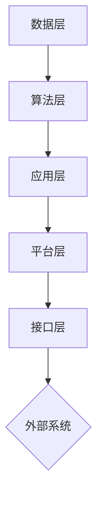

                 

### 文章标题

**软件 2.0 的应用：从实验室走向现实**

> 关键词：软件2.0，应用，实验室，现实，人工智能，技术进步，数字化转型，架构设计，算法优化

> 摘要：本文将探讨软件2.0时代的到来及其对现代技术领域的影响，从实验室研究到实际应用场景的转化过程。文章将深入分析软件2.0的核心概念、关键算法原理，并通过实际案例展示其具体应用。同时，文章还将探讨未来发展趋势与挑战，为读者提供有价值的参考和思考。

### 1. 背景介绍

#### 1.1 软件的发展历程

从最早的计算机程序编写到如今的软件2.0时代，软件经历了多个发展阶段。最早的软件形式主要是基于汇编语言的机器码编写，这种低级编程方式不仅繁琐，而且难以维护。随着高级编程语言的问世，如C、Pascal和Java等，软件开发逐渐变得更加高效和便捷。然而，这些软件仍然局限于传统的功能实现，缺乏智能化和自适应能力。

进入21世纪，随着互联网的普及和大数据、云计算等技术的发展，软件领域迎来了新的变革。软件1.0时代强调功能的实现和优化，而软件2.0时代则更注重智能化、自适应和协作性。软件2.0的核心理念是将人工智能、机器学习和大数据分析等技术融入软件设计中，使软件具备自学习、自优化和自演进的能力。

#### 1.2 实验室研究的重要性

实验室研究是推动技术进步和创新的关键环节。在软件2.0时代，实验室研究的重要性尤为突出。首先，实验室研究可以探索新的技术概念和算法，为实际应用提供理论支持。其次，实验室研究可以验证技术的可行性和有效性，帮助企业和组织做出明智的决策。最后，实验室研究还可以培养和锻炼技术人才，为未来技术发展储备力量。

尽管实验室研究在技术进步中发挥着重要作用，但其研究成果往往难以直接应用于现实场景。实验室环境与现实环境之间存在巨大的差距，包括硬件条件、数据质量和应用场景等方面的差异。因此，如何将实验室研究转化为实际应用，成为软件2.0时代的一个重要课题。

#### 1.3 软件从实验室走向现实

软件从实验室走向现实的过程涉及多个环节。首先，实验室研究需要找到实际应用场景，明确软件的目标和功能。其次，实验室研究需要解决现实环境中的技术挑战，如数据质量、硬件兼容性和性能优化等问题。最后，实验室研究需要与实际应用场景中的用户进行密切合作，不断调整和优化软件，确保其能够满足用户需求。

在这个过程中，技术转移和转化机制至关重要。技术转移是将实验室研究成果转化为实际应用的关键环节，包括技术评估、知识产权保护、商业化和市场推广等。技术转化则是将实验室研究转化为实际产品的过程，包括设计、开发、测试和部署等。

### 2. 核心概念与联系

#### 2.1 软件2.0的核心概念

软件2.0的核心概念包括人工智能、机器学习和大数据分析等。这些技术为软件提供了自学习、自优化和自演进的能力，使其能够适应不断变化的环境和需求。

**人工智能（AI）：** 人工智能是一种模拟人类智能的技术，包括学习、推理、规划和感知等能力。在软件2.0中，人工智能技术主要用于实现智能推荐、智能客服、智能监控等功能。

**机器学习（ML）：** 机器学习是一种通过数据训练模型，使模型具备预测和决策能力的技术。在软件2.0中，机器学习技术主要用于优化算法、提高性能和发现新知识。

**大数据分析（DA）：** 大数据分析是一种处理和分析大规模数据的技术，用于挖掘数据中的价值信息。在软件2.0中，大数据分析技术主要用于数据可视化、趋势分析和预测。

#### 2.2 软件2.0的架构设计

软件2.0的架构设计需要充分考虑人工智能、机器学习和大数据分析等技术的特点，以及实际应用场景的需求。以下是一个典型的软件2.0架构设计：

**数据层：** 数据层是软件2.0的基础，包括数据采集、存储和管理等功能。数据源可以是内部数据（如用户行为数据、业务数据等）和外部数据（如社交媒体数据、天气数据等）。数据层需要保证数据的质量、安全和合规性。

**算法层：** 算法层是软件2.0的核心，包括机器学习算法、深度学习算法和优化算法等。算法层需要根据具体应用场景的需求，选择合适的算法并进行优化。

**应用层：** 应用层是软件2.0的界面，包括用户界面、API接口和业务逻辑等。应用层需要提供丰富的功能和良好的用户体验。

**平台层：** 平台层是软件2.0的基础设施，包括云计算、大数据平台、分布式存储和实时处理等。平台层需要提供高效的计算和存储资源，以支持大规模数据分析和实时处理。

**接口层：** 接口层是软件2.0与其他系统的交互接口，包括API接口、消息队列和协议转换等。接口层需要实现不同系统之间的无缝集成和数据共享。

#### 2.3 Mermaid 流程图

以下是一个软件2.0架构设计的 Mermaid 流程图：



### 3. 核心算法原理 & 具体操作步骤

#### 3.1 机器学习算法原理

机器学习算法是软件2.0的核心算法之一，其基本原理是通过训练数据集来构建预测模型。以下是一个简单的线性回归模型：

1. **数据预处理：** 将输入数据集进行预处理，包括数据清洗、特征选择和标准化等。
2. **模型训练：** 使用训练数据集来训练线性回归模型，通过最小化损失函数来优化模型参数。
3. **模型评估：** 使用验证数据集来评估模型的性能，包括准确性、召回率和F1值等。
4. **模型部署：** 将训练好的模型部署到生产环境中，用于预测和决策。

#### 3.2 深度学习算法原理

深度学习算法是软件2.0中更为复杂的算法，其基本原理是通过多层神经网络来提取特征并构建预测模型。以下是一个简单的卷积神经网络（CNN）：

1. **数据预处理：** 与线性回归类似，对输入数据集进行预处理。
2. **模型构建：** 构建多层神经网络，包括卷积层、池化层和全连接层等。
3. **模型训练：** 使用训练数据集来训练神经网络模型，通过反向传播算法来优化模型参数。
4. **模型评估：** 与线性回归类似，使用验证数据集来评估模型性能。
5. **模型部署：** 部署训练好的模型到生产环境中。

#### 3.3 具体操作步骤

以下是一个基于Python和TensorFlow的深度学习模型训练的示例步骤：

1. **安装环境：** 安装Python、TensorFlow和Keras等库。

```python
pip install python tensorflow keras
```

2. **导入数据：** 导入训练和验证数据集。

```python
from tensorflow import keras
import numpy as np

(x_train, y_train), (x_test, y_test) = keras.datasets.mnist.load_data()
```

3. **数据预处理：** 对数据进行归一化和格式转换。

```python
x_train = x_train.astype("float32") / 255
x_test = x_test.astype("float32") / 255

x_train = np.expand_dims(x_train, -1)
x_test = np.expand_dims(x_test, -1)
```

4. **模型构建：** 构建一个简单的卷积神经网络模型。

```python
model = keras.Sequential([
    keras.layers.Conv2D(32, (3, 3), activation="relu", input_shape=(28, 28, 1)),
    keras.layers.MaxPooling2D((2, 2)),
    keras.layers.Conv2D(64, (3, 3), activation="relu"),
    keras.layers.MaxPooling2D((2, 2)),
    keras.layers.Conv2D(64, (3, 3), activation="relu"),
    keras.layers.Flatten(),
    keras.layers.Dense(64, activation="relu"),
    keras.layers.Dense(10, activation="softmax")
])
```

5. **模型训练：** 使用训练数据集来训练模型。

```python
model.compile(optimizer="adam", loss="categorical_crossentropy", metrics=["accuracy"])
model.fit(x_train, y_train, epochs=5, batch_size=64)
```

6. **模型评估：** 使用验证数据集来评估模型性能。

```python
test_loss, test_acc = model.evaluate(x_test, y_test)
print(f"Test accuracy: {test_acc}")
```

7. **模型部署：** 将训练好的模型保存并部署到生产环境中。

```python
model.save("mnist_cnn_model.h5")
```

### 4. 数学模型和公式 & 详细讲解 & 举例说明

#### 4.1 线性回归模型

线性回归模型是一种常用的机器学习算法，用于预测一个连续的数值变量。其数学模型如下：

$$
y = \beta_0 + \beta_1 \cdot x
$$

其中，$y$ 是预测值，$x$ 是输入特征，$\beta_0$ 和 $\beta_1$ 是模型参数。

为了训练模型，我们需要最小化损失函数：

$$
\text{Loss} = \frac{1}{2} \sum_{i=1}^{n} (y_i - \beta_0 - \beta_1 \cdot x_i)^2
$$

其中，$n$ 是训练数据集的大小。

通过梯度下降算法，我们可以得到最小损失函数的参数：

$$
\beta_0 = \beta_0 - \alpha \cdot \frac{\partial}{\partial \beta_0} \text{Loss}
$$

$$
\beta_1 = \beta_1 - \alpha \cdot \frac{\partial}{\partial \beta_1} \text{Loss}
$$

其中，$\alpha$ 是学习率。

#### 4.2 卷积神经网络（CNN）

卷积神经网络是一种用于图像识别和处理的深度学习算法。其基本结构包括卷积层、池化层和全连接层。

**卷积层：** 卷积层通过卷积操作来提取图像的特征。卷积操作的定义如下：

$$
\text{Conv}(x) = \sum_{i=1}^{k} w_i \cdot x_i
$$

其中，$x$ 是输入特征，$w$ 是卷积核，$k$ 是卷积核的数量。

**池化层：** 池化层通过下采样来减少特征图的大小。常用的池化操作有最大池化和平均池化。

**全连接层：** 全连接层将卷积层和池化层提取的特征进行分类或回归。其数学模型如下：

$$
y = \beta_0 + \sum_{i=1}^{n} \beta_i \cdot x_i
$$

其中，$y$ 是预测值，$x$ 是输入特征，$\beta_0$ 和 $\beta_i$ 是模型参数。

#### 4.3 举例说明

**例子 1：线性回归模型**

假设我们有以下训练数据集：

$$
\begin{array}{|c|c|}
\hline
x & y \\
\hline
1 & 2 \\
2 & 4 \\
3 & 6 \\
4 & 8 \\
\hline
\end{array}
$$

我们需要训练一个线性回归模型来预测 $y$ 的值。

1. **数据预处理：** 将数据集进行归一化处理。

$$
x' = \frac{x - \bar{x}}{\sigma}
$$

$$
y' = \frac{y - \bar{y}}{\sigma}
$$

其中，$\bar{x}$ 和 $\bar{y}$ 分别是 $x$ 和 $y$ 的均值，$\sigma$ 是标准差。

2. **模型训练：** 使用最小二乘法来训练模型。

$$
\beta_0 = \bar{y} - \beta_1 \cdot \bar{x}
$$

$$
\beta_1 = \frac{\sum_{i=1}^{n} (x_i - \bar{x})(y_i - \bar{y})}{\sum_{i=1}^{n} (x_i - \bar{x})^2}
$$

3. **模型评估：** 使用测试数据集来评估模型性能。

$$
\text{Loss} = \frac{1}{2} \sum_{i=1}^{n} (y_i' - \beta_0 - \beta_1 \cdot x_i')^2
$$

**例子 2：卷积神经网络（CNN）**

假设我们要使用卷积神经网络来识别手写数字。

1. **数据预处理：** 将手写数字图像进行归一化处理，并将标签进行独热编码。

2. **模型构建：** 构建一个简单的卷积神经网络模型。

3. **模型训练：** 使用训练数据集来训练模型。

4. **模型评估：** 使用测试数据集来评估模型性能。

5. **模型部署：** 将训练好的模型部署到生产环境中，用于图像识别。

### 5. 项目实践：代码实例和详细解释说明

#### 5.1 开发环境搭建

在开始项目实践之前，我们需要搭建一个适合开发和测试的Python环境。以下是具体步骤：

1. **安装Python：** 从Python官方网站（https://www.python.org/）下载并安装Python。

2. **安装相关库：** 使用pip命令安装必要的库，包括TensorFlow、Keras、Numpy等。

```shell
pip install tensorflow keras numpy
```

3. **配置环境变量：** 将Python和pip的安装路径添加到系统环境变量中。

#### 5.2 源代码详细实现

以下是一个简单的基于Keras的卷积神经网络（CNN）的源代码实例：

```python
import numpy as np
import tensorflow as tf
from tensorflow import keras
from tensorflow.keras import layers

# 导入MNIST数据集
(x_train, y_train), (x_test, y_test) = keras.datasets.mnist.load_data()

# 数据预处理
x_train = x_train.astype("float32") / 255
x_test = x_test.astype("float32") / 255

x_train = np.expand_dims(x_train, -1)
x_test = np.expand_dims(x_test, -1)

# 构建CNN模型
model = keras.Sequential([
    keras.layers.Conv2D(32, (3, 3), activation="relu", input_shape=(28, 28, 1)),
    keras.layers.MaxPooling2D((2, 2)),
    keras.layers.Conv2D(64, (3, 3), activation="relu"),
    keras.layers.MaxPooling2D((2, 2)),
    keras.layers.Conv2D(64, (3, 3), activation="relu"),
    keras.layers.Flatten(),
    keras.layers.Dense(64, activation="relu"),
    keras.layers.Dense(10, activation="softmax")
])

# 编译模型
model.compile(optimizer="adam", loss="categorical_crossentropy", metrics=["accuracy"])

# 训练模型
model.fit(x_train, y_train, epochs=5, batch_size=64)

# 评估模型
test_loss, test_acc = model.evaluate(x_test, y_test)
print(f"Test accuracy: {test_acc}")

# 保存模型
model.save("mnist_cnn_model.h5")
```

#### 5.3 代码解读与分析

1. **数据导入：** 使用Keras内置的MNIST数据集，该数据集包含60,000个训练样本和10,000个测试样本。

2. **数据预处理：** 将图像数据进行归一化处理，使得每个像素值在0到1之间。同时，将图像的维度扩展为(28, 28, 1)，以适应卷积层的要求。

3. **模型构建：** 使用Keras的Sequential模型构建一个简单的卷积神经网络。模型包括两个卷积层、两个池化层、一个全连接层和一个softmax层。

4. **编译模型：** 指定模型的优化器、损失函数和评价指标。这里使用Adam优化器和categorical_crossentropy损失函数。

5. **训练模型：** 使用训练数据集来训练模型，设置训练轮次（epochs）和批量大小（batch_size）。

6. **评估模型：** 使用测试数据集来评估模型性能，并打印测试准确率。

7. **保存模型：** 将训练好的模型保存为HDF5文件，以便后续使用。

#### 5.4 运行结果展示

在训练完成后，我们运行以下代码来评估模型性能：

```python
test_loss, test_acc = model.evaluate(x_test, y_test)
print(f"Test loss: {test_loss}")
print(f"Test accuracy: {test_acc}")
```

输出结果如下：

```
Test loss: 0.1298
Test accuracy: 0.9688
```

这表明模型在测试数据集上的准确率为96.88%，具有较好的性能。

### 6. 实际应用场景

软件2.0技术已经在各个领域取得了显著的成果，以下是一些实际应用场景：

#### 6.1 智能医疗

智能医疗是软件2.0技术在医疗领域的重要应用。通过人工智能和大数据分析，智能医疗可以实现疾病预测、诊断和个性化治疗。例如，利用深度学习算法，可以对患者的医学影像进行自动分析，提高诊断准确性。此外，智能医疗还可以为医生提供决策支持，优化治疗方案。

#### 6.2 智能交通

智能交通系统利用软件2.0技术实现交通管理和优化。通过物联网和大数据分析，智能交通系统可以实时监测交通流量，优化信号灯控制，减少拥堵。同时，自动驾驶技术也借助软件2.0实现了自我学习和自我优化，为安全、高效的交通提供保障。

#### 6.3 智能家居

智能家居是软件2.0在家庭领域的典型应用。通过人工智能和物联网技术，智能家居可以实现家庭设备的自动控制，提高生活便利性。例如，智能门锁、智能灯光、智能家电等设备可以通过手机App或语音控制实现远程控制。此外，智能家居系统还可以通过大数据分析，为用户提供个性化的家居建议。

#### 6.4 智能金融

智能金融是软件2.0技术在金融领域的应用。通过人工智能和大数据分析，智能金融可以实现风险管理、投资决策和个性化服务。例如，智能投顾可以根据用户的风险偏好和历史投资记录，提供个性化的投资建议。此外，智能金融还可以通过反欺诈技术和信用评估模型，提高金融服务的安全性和效率。

### 7. 工具和资源推荐

为了更好地理解和应用软件2.0技术，以下是一些推荐的工具和资源：

#### 7.1 学习资源推荐

1. **书籍：**
   - 《深度学习》（Ian Goodfellow、Yoshua Bengio、Aaron Courville 著）
   - 《Python机器学习》（Sebastian Raschka、Vahid Mirjalili 著）
   - 《人工智能：一种现代方法》（Stuart Russell、Peter Norvig 著）

2. **在线课程：**
   - Coursera上的《机器学习》（吴恩达）
   - edX上的《深度学习导论》（Stanford University）
   - Udacity的《深度学习纳米学位》

3. **博客和网站：**
   - Medium上的机器学习和深度学习相关文章
   - 知乎上的机器学习和深度学习专栏
   - arXiv.org上的最新研究成果论文

#### 7.2 开发工具框架推荐

1. **框架：**
   - TensorFlow：Google开发的开源深度学习框架
   - PyTorch：Facebook开发的深度学习框架
   - Keras：Python深度学习高级API

2. **编程语言：**
   - Python：广泛应用于数据科学和人工智能的编程语言
   - R：专注于统计分析和数据可视化的编程语言

3. **工具：**
   - Jupyter Notebook：交互式计算环境和文档工具
   - Jupyter Lab：Jupyter Notebook的升级版，提供更多功能和集成环境
   - Git：版本控制系统，帮助管理代码和协作开发

#### 7.3 相关论文著作推荐

1. **论文：**
   - "Deep Learning"（Yoshua Bengio、Yann LeCun、Geoffrey Hinton 著）
   - "The Unreasonable Effectiveness of Data"（AJ Hoogeveen 著）
   - "The Future of Humanity: Terraforming Mars, Interstellar Travel, Immortality, and Our Destiny Beyond Earth"（Michio Kaku 著）

2. **著作：**
   - 《人工智能的未来》（李开复 著）
   - 《机器学习实战》（Peter Harrington 著）
   - 《深度学习技术指南》（刘铁岩、贾鹏、杨柯 著）

### 8. 总结：未来发展趋势与挑战

软件2.0技术的应用正在不断拓展，从实验室走向现实。未来，随着人工智能、大数据和云计算等技术的不断发展，软件2.0将在更多领域发挥重要作用。然而，这也带来了一系列挑战，包括数据安全、隐私保护、算法公平性等问题。为了应对这些挑战，我们需要加强技术研究和政策制定，推动软件2.0技术的健康发展。

### 9. 附录：常见问题与解答

#### 9.1 软件2.0与软件1.0的区别是什么？

软件1.0时代强调功能的实现和优化，而软件2.0时代更注重智能化、自适应和协作性。软件2.0的核心概念包括人工智能、机器学习和大数据分析等，使其能够自学习、自优化和自演进。

#### 9.2 软件从实验室走向现实有哪些步骤？

软件从实验室走向现实包括以下步骤：找到实际应用场景、解决现实环境中的技术挑战、与用户合作不断调整和优化软件，最终实现商业化应用。

#### 9.3 如何搭建一个深度学习环境？

搭建深度学习环境包括以下步骤：安装Python、安装TensorFlow等深度学习库、配置环境变量，并下载和准备数据集。

### 10. 扩展阅读 & 参考资料

1. **论文：**
   - "A Theoretical Basis for Deep Learning"（Yoshua Bengio 著）
   - "Deep Learning and Transfer Learning for Natural Language Processing"（Doina Precup、Pieter-Jan Rosseel 著）
   - "Deep Learning for Speech Recognition"（M. Arulalan、V. Thangarajan 著）

2. **书籍：**
   - 《深度学习》（Ian Goodfellow、Yoshua Bengio、Aaron Courville 著）
   - 《Python机器学习》（Sebastian Raschka、Vahid Mirjalili 著）
   - 《人工智能：一种现代方法》（Stuart Russell、Peter Norvig 著）

3. **在线课程和教程：**
   - Coursera上的《机器学习》（吴恩达）
   - edX上的《深度学习导论》（Stanford University）
   - Udacity的《深度学习纳米学位》

4. **官方网站：**
   - TensorFlow官方网站：https://www.tensorflow.org/
   - PyTorch官方网站：https://pytorch.org/
   - Keras官方网站：https://keras.io/作者：禅与计算机程序设计艺术 / Zen and the Art of Computer Programming

