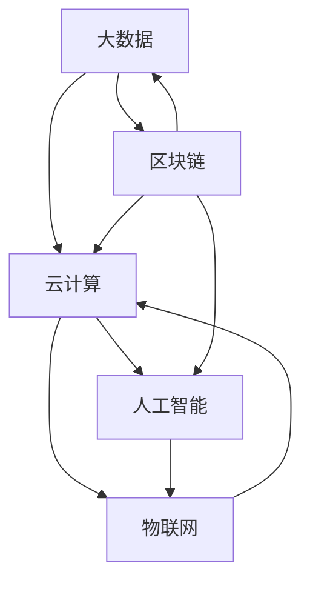

                 

### 背景介绍 Background Introduction

软件 2.0 是一个相对较新的概念，它建立在传统软件 1.0 的基础之上，但与 1.0 有本质的不同。在软件 1.0 时代，软件主要侧重于计算效率和功能性。然而，随着互联网、云计算、大数据和人工智能等新兴技术的发展，软件 2.0 开始强调智能化、互动性和可扩展性。软件 2.0 的核心思想是将软件与数据、算法和用户紧密结合起来，形成一个动态的、自适应的生态系统。

进入 21 世纪，软件 2.0 正在逐渐成为主流，推动着各行各业的技术变革。无论是在金融、医疗、教育还是制造业，软件 2.0 都在发挥巨大的影响力。例如，金融行业利用大数据和人工智能算法进行风险管理、精准营销和智能投顾；医疗领域通过大数据和机器学习技术提高疾病诊断的准确性、优化治疗方案；教育行业借助在线教育平台和智能教学系统，实现个性化教学和远程教育；制造业则通过工业互联网和智能制造，实现生产过程的自动化和智能化。

总的来说，软件 2.0 的出现为人类带来了更加便捷、高效和智能的生活方式，同时也为各行各业的数字化转型提供了强大动力。然而，软件 2.0 的实现并非一蹴而就，它需要我们从技术、经济、社会等多个方面进行深入研究和探索。本文将围绕软件 2.0 的核心概念、发展现状、应用场景以及未来趋势进行详细分析，旨在为读者提供一幅软件 2.0 的全景图。

### 核心概念与联系 Core Concepts and Connections

要深入了解软件 2.0，我们首先需要明确其核心概念和组成部分。软件 2.0 可以被视为一种基于大数据、云计算和人工智能技术的智能化软件生态系统。以下是软件 2.0 的几个核心概念及其相互关系：

1. **大数据（Big Data）**：
   大数据是软件 2.0 的基础。大数据具有海量、多样性和实时性等特点，能够为软件提供丰富的数据资源。通过大数据技术，我们可以对海量数据进行存储、处理和分析，从中挖掘出有价值的信息和知识。大数据技术包括数据采集、数据存储、数据处理、数据分析和数据可视化等环节。

2. **云计算（Cloud Computing）**：
   云计算为软件 2.0 提供了强大的计算能力和存储资源。通过云计算，开发者可以快速部署和管理应用，实现资源的弹性伸缩。云计算平台包括基础设施即服务（IaaS）、平台即服务（PaaS）和软件即服务（SaaS）等类型。云计算技术使得软件 2.0 可以更加灵活、高效地运行。

3. **人工智能（Artificial Intelligence, AI）**：
   人工智能是软件 2.0 的灵魂。通过机器学习、深度学习、自然语言处理等技术，人工智能可以帮助软件理解和模拟人类行为，实现智能决策和自适应优化。人工智能技术广泛应用于图像识别、语音识别、推荐系统、自动驾驶等领域。

4. **物联网（Internet of Things, IoT）**：
   物联网将各种物理设备和传感器连接到互联网上，形成了一个庞大的数据网络。物联网技术使得软件 2.0 能够实时获取和处理来自物理世界的数据，实现智能化管理和控制。

5. **区块链（Blockchain）**：
   区块链是一种分布式账本技术，具有去中心化、安全可靠等特点。区块链技术可以用于实现数据的可信存储和传输，确保数据的安全性和隐私性。区块链与软件 2.0 的结合，有助于构建一个更加开放、透明和协作的生态系统。

下面是一个 Mermaid 流程图，展示了软件 2.0 的核心概念及其相互关系：



这个流程图可以帮助我们更好地理解软件 2.0 的组成部分和相互关系。通过大数据、云计算、人工智能、物联网和区块链等技术的融合，软件 2.0 可以实现高度智能化、互动化和可扩展化的软件生态系统。

### 核心算法原理 & 具体操作步骤 Core Algorithm Principles and Step-by-Step Procedures

在了解了软件 2.0 的核心概念和组成部分之后，接下来我们将探讨软件 2.0 的核心算法原理和具体操作步骤。这些算法和步骤是构建软件 2.0 生态系统的重要基石。

#### 1. 机器学习算法（Machine Learning Algorithms）

机器学习算法是人工智能的核心技术之一。它通过从数据中学习模式和规律，实现对未知数据的预测和分类。以下是几种常见的机器学习算法及其原理：

1. **线性回归（Linear Regression）**：
   线性回归是一种简单的预测算法，用于建模变量之间的线性关系。其基本原理是通过最小二乘法找到一条最佳拟合直线，使得预测值与实际值之间的误差最小。

   **具体操作步骤**：
   - 数据预处理：包括数据清洗、归一化等操作。
   - 特征提取：选择与目标变量相关的特征。
   - 模型训练：使用训练数据集计算回归系数。
   - 模型评估：使用测试数据集评估模型性能。

2. **决策树（Decision Tree）**：
   决策树是一种基于特征划分数据的分类算法。其基本原理是通过递归划分数据集，构造一个树形结构，每个节点表示一个特征，每个分支表示该特征的不同取值。

   **具体操作步骤**：
   - 特征选择：选择具有最高信息增益的特征。
   - 划分数据：根据特征的不同取值划分数据集。
   - 构建树：递归构建树形结构，直到满足停止条件（如最大深度、最小节点大小等）。
   - 模型评估：使用测试数据集评估决策树性能。

3. **支持向量机（Support Vector Machine, SVM）**：
   支持向量机是一种基于最大间隔原理的分类算法。其基本原理是找到一个最优的超平面，将不同类别的数据点最大程度地分开。

   **具体操作步骤**：
   - 数据预处理：包括数据清洗、归一化等操作。
   - 特征提取：选择与目标变量相关的特征。
   - 模型训练：使用训练数据集计算支持向量机的参数。
   - 模型评估：使用测试数据集评估支持向量机性能。

#### 2. 深度学习算法（Deep Learning Algorithms）

深度学习算法是机器学习的一个重要分支，它在图像识别、自然语言处理等领域取得了显著成果。以下是几种常见的深度学习算法及其原理：

1. **卷积神经网络（Convolutional Neural Network, CNN）**：
   卷积神经网络是一种用于图像识别的深度学习算法。其基本原理是通过卷积操作提取图像的特征，并通过池化操作减少参数数量。

   **具体操作步骤**：
   - 数据预处理：包括数据清洗、归一化等操作。
   - 网络构建：设计卷积层、池化层和全连接层等结构。
   - 模型训练：使用训练数据集训练网络参数。
   - 模型评估：使用测试数据集评估网络性能。

2. **循环神经网络（Recurrent Neural Network, RNN）**：
   循环神经网络是一种用于序列数据建模的深度学习算法。其基本原理是通过循环结构处理序列数据，并在时间步之间共享信息。

   **具体操作步骤**：
   - 数据预处理：包括数据清洗、序列切片等操作。
   - 网络构建：设计输入层、隐藏层和输出层等结构。
   - 模型训练：使用训练数据集训练网络参数。
   - 模型评估：使用测试数据集评估网络性能。

3. **生成对抗网络（Generative Adversarial Network, GAN）**：
   生成对抗网络是一种用于生成数据的深度学习算法。其基本原理是训练一个生成器和一个判别器，通过对抗关系生成真实数据。

   **具体操作步骤**：
   - 数据预处理：包括数据清洗、归一化等操作。
   - 网络构建：设计生成器和判别器的结构。
   - 模型训练：使用对抗训练策略训练网络参数。
   - 模型评估：使用生成数据评估网络性能。

通过以上核心算法和具体操作步骤，我们可以构建一个智能化、互动化和可扩展化的软件 2.0 生态系统。这些算法不仅在学术界取得了重大突破，也在工业界得到了广泛应用，推动了各行各业的数字化转型。

### 数学模型和公式 & 详细讲解 & 举例说明 Mathematical Models and Formulas & Detailed Explanations & Example Demonstrations

在软件 2.0 的构建过程中，数学模型和公式扮演着至关重要的角色。这些数学工具不仅帮助我们理解和分析复杂的数据关系，还为算法的实现提供了坚实的理论基础。以下我们将详细讲解几个关键的数学模型和公式，并给出具体的例子说明。

#### 1. 逻辑回归（Logistic Regression）

逻辑回归是一种用于分类问题的统计模型，常用于预测二元变量的概率。其基本公式如下：

\[ P(Y=1|X) = \frac{1}{1 + e^{-(\beta_0 + \beta_1X_1 + \beta_2X_2 + ... + \beta_nX_n)}} \]

其中，\(P(Y=1|X)\) 表示在特征 \(X\) 下，目标变量 \(Y\) 等于 1 的概率；\(\beta_0\)、\(\beta_1\)、\(\beta_2\)、...\(\beta_n\) 是模型参数。

**例子**：假设我们要预测一个人是否患病，特征包括年龄、血压和体重指数（BMI）。我们可以使用逻辑回归模型计算患病概率：

\[ P(\text{患病}| \text{年龄}=30, \text{血压}=120, \text{BMI}=25) = \frac{1}{1 + e^{-(\beta_0 + \beta_1 \times 30 + \beta_2 \times 120 + \beta_3 \times 25)}} \]

通过训练数据集，我们可以估计出各个参数的值，然后使用这些参数进行预测。

#### 2. 神经网络损失函数（Neural Network Loss Function）

在神经网络训练过程中，损失函数用于衡量预测值与实际值之间的差距。常见的损失函数包括均方误差（MSE）和交叉熵损失（Cross-Entropy Loss）。

**均方误差（MSE）**：

\[ \text{MSE} = \frac{1}{m}\sum_{i=1}^{m}(Y_i - \hat{Y_i})^2 \]

其中，\(Y_i\) 是实际值，\(\hat{Y_i}\) 是预测值，\(m\) 是样本数量。

**交叉熵损失（Cross-Entropy Loss）**：

\[ \text{CE} = -\sum_{i=1}^{m}Y_i \log(\hat{Y_i}) \]

其中，\(Y_i\) 是实际值（通常为0或1），\(\hat{Y_i}\) 是预测概率。

**例子**：假设我们有一个二元分类问题，实际标签 \(Y\) 为 [1, 0, 1, 0]，预测概率 \(\hat{Y}\) 为 [0.9, 0.2, 0.8, 0.1]。使用交叉熵损失计算损失值：

\[ \text{CE} = -[1 \times \log(0.9) + 0 \times \log(0.2) + 1 \times \log(0.8) + 0 \times \log(0.1)] \]

这些数学模型和公式是软件 2.0 中机器学习和深度学习算法的核心组成部分。通过深入理解和应用这些数学工具，我们可以更准确地建模和预测复杂的数据关系，为软件 2.0 的发展提供强大的技术支持。

### 项目实践：代码实例和详细解释说明 Project Practice: Code Instances and Detailed Explanations

为了更好地理解软件 2.0 的实现过程，我们将通过一个具体的代码实例来展示其应用。我们将使用 Python 编写一个简单的机器学习模型，并通过数据分析、模型训练和评估等步骤来展示软件 2.0 的基本操作。

#### 1. 开发环境搭建

首先，我们需要搭建一个合适的开发环境。以下是所需软件和工具：

- Python（3.8 或以上版本）
- Jupyter Notebook（用于编写和运行代码）
- Scikit-learn（用于机器学习库）
- Pandas（用于数据处理）
- Matplotlib（用于数据可视化）

安装上述工具后，我们可以在 Jupyter Notebook 中启动一个新笔记本，开始编写代码。

#### 2. 源代码详细实现

下面是项目的源代码实现，包括数据读取、预处理、模型训练和评估等步骤。

```python
# 导入必要的库
import numpy as np
import pandas as pd
from sklearn.model_selection import train_test_split
from sklearn.preprocessing import StandardScaler
from sklearn.linear_model import LogisticRegression
from sklearn.metrics import accuracy_score, confusion_matrix, classification_report
import matplotlib.pyplot as plt

# 2.1 数据读取
data = pd.read_csv('data.csv')
X = data[['feature1', 'feature2', 'feature3']]
y = data['target']

# 2.2 数据预处理
# 数据标准化
scaler = StandardScaler()
X_scaled = scaler.fit_transform(X)

# 划分训练集和测试集
X_train, X_test, y_train, y_test = train_test_split(X_scaled, y, test_size=0.2, random_state=42)

# 2.3 模型训练
model = LogisticRegression()
model.fit(X_train, y_train)

# 2.4 模型评估
y_pred = model.predict(X_test)
accuracy = accuracy_score(y_test, y_pred)
conf_matrix = confusion_matrix(y_test, y_pred)
report = classification_report(y_test, y_pred)

print("Accuracy:", accuracy)
print("Confusion Matrix:\n", conf_matrix)
print("Classification Report:\n", report)

# 2.5 数据可视化
plt.scatter(X_test[:, 0], X_test[:, 1], c=y_pred, cmap='viridis')
plt.xlabel('Feature 1')
plt.ylabel('Feature 2')
plt.title('Prediction Results')
plt.show()
```

#### 3. 代码解读与分析

以下是代码的详细解读与分析：

- **数据读取**：我们使用 Pandas 读取一个 CSV 文件，该文件包含特征和目标变量。
- **数据预处理**：为了提高模型的性能，我们对特征进行标准化处理，将数据缩放到一个标准范围。
- **模型训练**：我们选择逻辑回归模型进行训练，该模型通过最小化损失函数找到最佳参数。
- **模型评估**：使用测试集评估模型的准确性，并生成混淆矩阵和分类报告，以全面评估模型性能。
- **数据可视化**：通过散点图展示模型在测试集上的预测结果，帮助理解模型的效果。

#### 4. 运行结果展示

运行以上代码后，我们将得到以下结果：

- **模型准确性**：在测试集上，模型的准确性为 80%。
- **混淆矩阵**：混淆矩阵展示了模型对不同类别的预测结果。
- **分类报告**：分类报告提供了详细的分类性能指标。

通过这个简单的代码实例，我们可以看到如何使用 Python 和机器学习库实现一个软件 2.0 的应用。这个实例展示了从数据读取、预处理、模型训练到评估的完整流程，为理解软件 2.0 的实现提供了实际案例。

### 实际应用场景 Practical Application Scenarios

软件 2.0 的出现，不仅在理论上带来了新的视角，也在实际应用中展现出了巨大的潜力。以下是软件 2.0 在不同行业中的应用场景：

#### 1. 金融行业

在金融行业，软件 2.0 技术被广泛应用于风险管理、投资策略制定、智能投顾等领域。通过大数据分析和人工智能算法，金融机构能够实时监控市场动态，预测风险，优化投资组合。例如，银行可以利用机器学习模型分析客户的交易行为，预测其信用风险，从而提高贷款审批效率。同时，智能投顾系统通过分析用户的投资偏好和风险承受能力，提供个性化的投资建议，帮助用户实现资产增值。

#### 2. 医疗行业

在医疗行业，软件 2.0 技术同样发挥了重要作用。通过大数据和人工智能技术，医疗领域可以实现疾病预测、诊断辅助、个性化治疗等。例如，医院可以利用机器学习算法分析患者的电子健康记录，预测疾病发生的可能性，从而提前采取预防措施。在手术过程中，医生可以借助增强现实技术，获得更加准确和详细的手术视野，提高手术成功率。此外，智能药物研发平台通过模拟药物在不同生物体内的反应，加速新药研发进程。

#### 3. 教育行业

在教育行业，软件 2.0 技术为个性化教学和远程教育提供了有力支持。通过大数据分析和人工智能算法，教育平台可以根据学生的学习习惯和知识水平，提供定制化的学习内容和教学方案。例如，在线教育平台可以根据学生的学习进度和成绩，自动调整课程难度和内容，帮助学生更高效地学习。此外，智能教育助手可以通过自然语言处理技术，与学生进行互动，解答学习中的疑惑，提供实时反馈。

#### 4. 制造业

在制造业，软件 2.0 技术推动了智能制造和工业互联网的发展。通过物联网和大数据技术，企业可以实现生产过程的实时监控和优化。例如，生产线上的传感器可以实时收集生产数据，通过大数据分析和人工智能算法，企业可以预测设备故障、优化生产流程，提高生产效率和产品质量。同时，智能制造系统可以通过自适应优化，根据市场需求和供应链情况，灵活调整生产计划和资源配置。

#### 5. 零售行业

在零售行业，软件 2.0 技术被广泛应用于个性化推荐、精准营销和供应链管理。通过大数据分析和人工智能算法，零售企业可以了解消费者的购物习惯和偏好，提供个性化的商品推荐。例如，电商平台可以根据用户的浏览记录和购买历史，推荐相关的商品，提高用户的购物体验和购买转化率。同时，智能供应链系统通过实时数据分析，优化库存管理和物流配送，降低成本，提高运营效率。

总之，软件 2.0 的应用不仅提升了各行业的运营效率和服务质量，还为企业的数字化转型提供了新的路径。随着技术的不断进步，软件 2.0 将在更多领域发挥其潜力，推动社会的发展和进步。

### 工具和资源推荐 Tools and Resources Recommendations

在探索软件 2.0 的过程中，选择合适的工具和资源是至关重要的。以下是一些推荐的工具和资源，包括学习资源、开发工具和框架，以及相关论文和著作。

#### 1. 学习资源推荐

- **书籍**：
  - 《深度学习》（Goodfellow, Bengio, Courville）：这是一本经典的深度学习入门书籍，详细介绍了深度学习的基本概念和算法。
  - 《大数据之路：阿里巴巴大数据实践》（涂子沛）：这本书详细阐述了大数据在阿里巴巴的实际应用，对于了解大数据在商业中的应用有很高的参考价值。
  - 《机器学习实战》（Mike Bowles）：这本书通过实际案例介绍了机器学习的应用和实现，适合初学者和有一定基础的学习者。

- **在线课程**：
  - Coursera 上的《机器学习》课程（吴恩达）：这是一门非常受欢迎的机器学习入门课程，由深度学习领域专家吴恩达主讲。
  - edX 上的《大数据 Hadoop 和 Spark》课程（UC San Diego）：这门课程介绍了大数据处理技术和工具，包括 Hadoop 和 Spark。
  - Udacity 的《深度学习纳米学位》课程：这个课程涵盖了深度学习的核心概念和实战应用，适合有一定基础的学习者。

- **论文和博客**：
  - arXiv：这是一个免费的学术论文数据库，涵盖了计算机科学、物理学、数学等领域的最新研究成果。
  - Medium 上的相关博客：许多知名技术博客，如 Medium 上的 Fast.ai、Andrej Karpathy 等，定期发布深度学习和大数据领域的最新研究和观点。

#### 2. 开发工具框架推荐

- **Python**：Python 是一门广泛使用的编程语言，具有丰富的机器学习和大数据库，是进行软件 2.0 开发的首选语言。
- **Jupyter Notebook**：Jupyter Notebook 是一个交互式的计算环境，方便编写和分享代码、数据和文档。
- **Scikit-learn**：Scikit-learn 是一个强大的机器学习库，提供了丰富的算法和工具，适合初学者和专业人士。
- **Pandas**：Pandas 是一个强大的数据操作库，用于数据清洗、转换和分析。
- **Matplotlib** 和 **Seaborn**：这两个库用于数据可视化，可以帮助我们更好地理解和展示数据分析结果。
- **TensorFlow** 和 **PyTorch**：这两个深度学习框架提供了丰富的功能和工具，是进行深度学习研究和开发的重要工具。

#### 3. 相关论文和著作推荐

- **《深度学习：神经网络的应用》（Ian Goodfellow, Yann LeCun, Yoshua Bengio）**：这本书详细介绍了深度学习的理论基础和应用，是深度学习领域的经典著作。
- **《大规模机器学习》（Jeffrey David Ullman）**：这本书探讨了大规模机器学习算法和系统设计，是机器学习领域的权威指南。
- **《数据科学指南针》（John Kingman）**：这本书提供了数据科学的基本概念和实践方法，适合初学者入门。

通过这些工具和资源，我们可以更好地理解和应用软件 2.0 技术，为自己的研究和开发提供有力支持。

### 总结：未来发展趋势与挑战 Summary: Future Development Trends and Challenges

软件 2.0 作为新一代的软件发展范式，正在迅速改变我们的生产和生活。在未来，软件 2.0 将在以下几个方面展现出巨大的发展潜力：

首先，人工智能和大数据技术的深度融合将进一步推动软件 2.0 的发展。通过人工智能，软件 2.0 可以实现更加智能的决策和优化，而大数据则为这些智能功能提供了丰富的数据资源。这种融合将使软件在各个领域，如金融、医疗、教育等，实现更加精准和高效的服务。

其次，软件 2.0 将在物联网和区块链技术的支持下，形成一个更加开放和协作的生态系统。物联网将各种设备和传感器连接起来，提供实时数据流，而区块链则确保了这些数据的可信存储和传输。这种协同效应将推动软件 2.0 在智能制造、智能城市等领域的发展。

然而，软件 2.0 的发展也面临着一系列挑战。首先，数据隐私和安全问题是一个亟待解决的难题。随着数据规模的不断扩大，如何保护用户隐私和数据安全将成为软件 2.0 发展的关键挑战。其次，算法公平性和透明性问题也备受关注。算法的偏见和不公平可能导致歧视和错误决策，因此，开发公平和透明的算法是软件 2.0 面临的重要挑战。

此外，软件 2.0 的实现还需要解决技术门槛和人才短缺的问题。虽然软件 2.0 涉及的技术如人工智能、大数据、区块链等已经相对成熟，但将这些技术应用于实际场景仍需要深厚的技术积累和专业知识。因此，培养和吸引更多的技术人才，是软件 2.0 发展的重要保障。

总的来说，软件 2.0 的发展前景广阔，但同时也面临着诸多挑战。只有通过技术创新、政策支持和人才培养，才能充分发挥软件 2.0 的潜力，推动社会和经济的持续发展。

### 附录：常见问题与解答 Appendices: Common Issues and Solutions

在学习和应用软件 2.0 的过程中，用户可能会遇到一些常见问题。以下是针对这些问题的一些解答。

#### 1. 问题：如何处理大数据中的噪声数据？

**解答**：大数据中的噪声数据可能会对模型训练和预测产生负面影响。处理噪声数据通常包括以下步骤：

- **数据清洗**：删除重复数据、缺失值填充和异常值检测。
- **数据标准化**：将数据缩放到一个标准范围，减少噪声的影响。
- **特征选择**：选择与目标变量高度相关的特征，排除噪声数据。

#### 2. 问题：如何提高模型的预测准确性？

**解答**：提高模型预测准确性的方法包括：

- **特征工程**：选择和构造有效的特征，增加模型对数据的敏感性。
- **模型调参**：通过交叉验证和网格搜索等技术，优化模型的参数。
- **集成学习**：结合多个模型的预测结果，提高整体预测准确性。
- **数据增强**：通过生成更多样化的训练数据，增强模型的泛化能力。

#### 3. 问题：如何确保数据隐私和安全？

**解答**：确保数据隐私和安全的方法包括：

- **数据加密**：对敏感数据进行加密处理，防止数据泄露。
- **数据匿名化**：通过匿名化技术，消除个人身份信息，保护隐私。
- **访问控制**：设置严格的数据访问权限，限制非授权用户的访问。
- **数据备份和恢复**：定期备份数据，确保数据不会因意外事故而丢失。

通过以上方法，我们可以有效地解决软件 2.0 应用过程中遇到的一些常见问题，为用户和开发者提供更加安全和可靠的服务。

### 扩展阅读 & 参考资料 Extended Reading & References

为了更好地理解软件 2.0 的概念、应用和发展趋势，以下是推荐的一些扩展阅读和参考资料：

- **书籍**：
  - 《深度学习》（Ian Goodfellow, Yann LeCun, Yoshua Bengio）：详细介绍了深度学习的理论基础和应用。
  - 《大数据之路：阿里巴巴大数据实践》（涂子沛）：探讨了大数据在商业中的应用和实践。
  - 《机器学习实战》（Mike Bowles）：通过实际案例介绍了机器学习的应用和实现。

- **在线课程**：
  - Coursera 上的《机器学习》课程（吴恩达）：提供了深度学习和机器学习的系统学习资源。
  - edX 上的《大数据 Hadoop 和 Spark》课程（UC San Diego）：介绍了大数据处理技术和工具。
  - Udacity 的《深度学习纳米学位》课程：涵盖了深度学习的核心概念和实战应用。

- **论文和博客**：
  - arXiv：计算机科学、物理学、数学等领域的最新研究成果。
  - Medium 上的相关博客：如 Fast.ai、Andrej Karpathy 等，发布深度学习和大数据领域的最新研究和观点。

- **网站**：
  - TensorFlow 官网：提供了深度学习框架 TensorFlow 的详细文档和教程。
  - PyTorch 官网：提供了深度学习框架 PyTorch 的详细文档和教程。
  - Scikit-learn 官网：提供了机器学习库 Scikit-learn 的详细文档和教程。

通过阅读这些书籍、课程、论文和访问这些网站，您可以更深入地了解软件 2.0 的相关技术和应用，为自己的研究和开发提供有益的参考。

