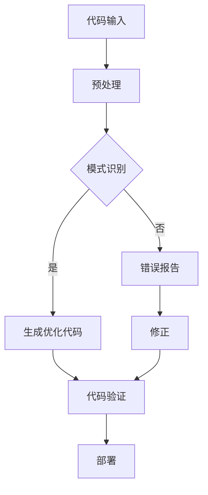
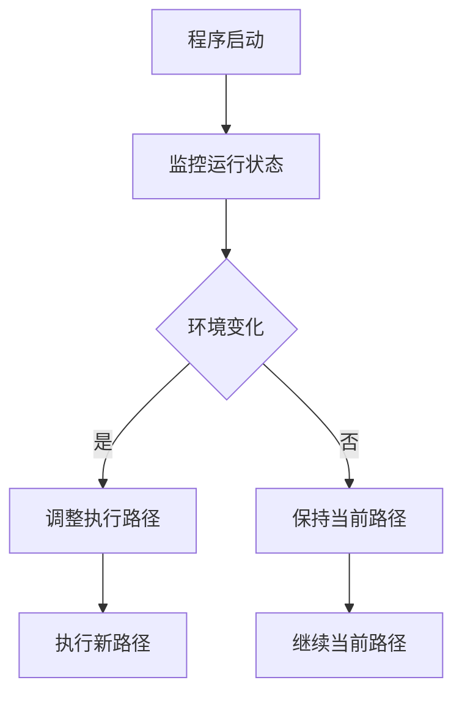
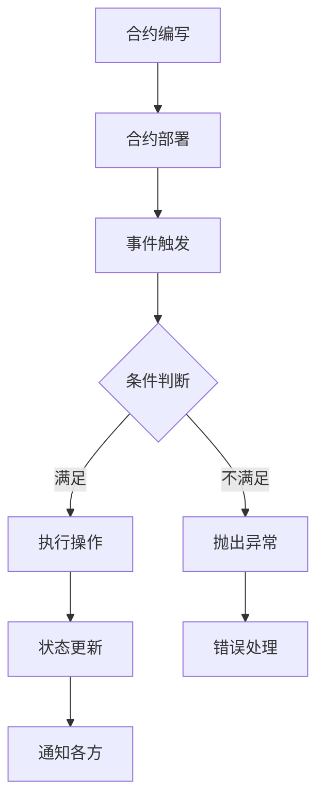
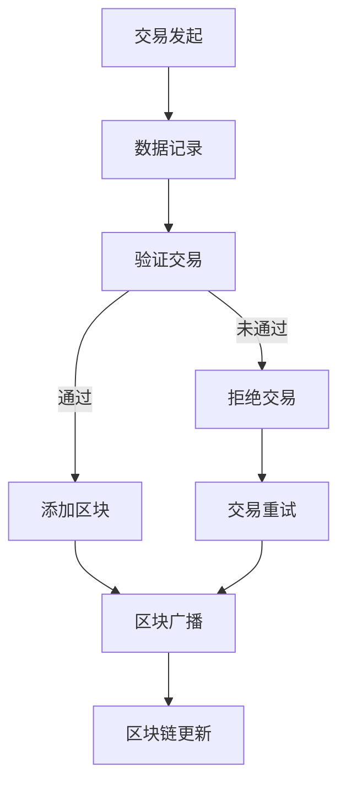
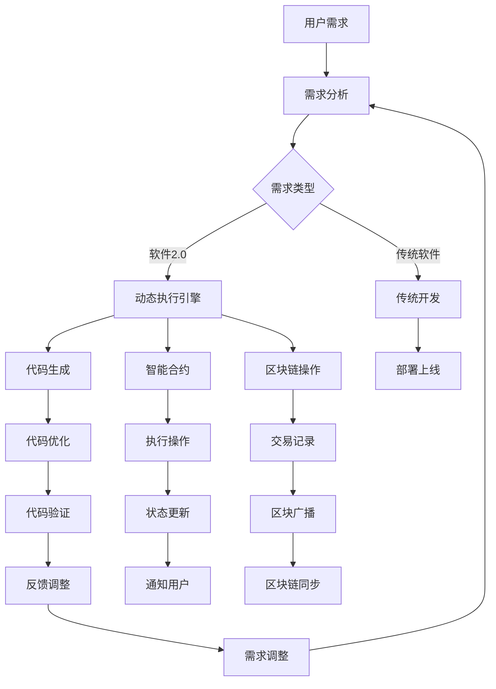

                 

### 背景介绍 Background Introduction

自计算机诞生以来，软件工程领域经历了多个重要的阶段，从最初的机器语言编程到高级编程语言，再到现代的框架和平台。每一个阶段都为软件的发展带来了革命性的变化，使得计算机编程变得更加高效、易用。然而，随着信息技术的不断进步和应用的广泛普及，传统软件编程范式正面临越来越大的挑战。

传统软件编程范式通常依赖于固定的代码结构和明确的执行路径。在这种范式中，开发者需要详细地定义程序的每一个步骤，从输入处理到输出生成。这种方式虽然能够保证程序的稳定性和可预测性，但也带来了许多局限性。首先，随着系统规模的扩大和复杂性的增加，编写和维护大规模软件变得越来越困难。其次，传统编程范式难以应对动态变化的需求，使得软件难以快速适应市场和用户的需求变化。

这些问题促使我们思考，是否有一种新的编程范式能够超越传统限制，更好地应对现代软件开发的需求？答案是肯定的。《软件2.0：超越传统编程范式》正是为了探讨这一新的编程范式而诞生的。

软件2.0的概念源于对软件本质的理解和重新定义。在传统意义上，软件被视为一系列代码的集合，用于实现特定的功能。然而，随着云计算、大数据、人工智能等新技术的兴起，软件的内涵和外延都发生了深刻的变化。软件2.0强调软件作为一种动态系统，不仅能够执行预先定义的流程，还能够自我优化、自我进化，以适应不断变化的环境。

本文将深入探讨软件2.0的核心概念、技术原理、应用场景以及未来发展趋势，帮助读者全面理解这一新的编程范式。在接下来的章节中，我们将逐步介绍软件2.0的关键技术，包括基于机器学习和自动化的编程工具、动态执行引擎、智能合约等，并通过实际案例展示这些技术如何在实际项目中发挥作用。

通过本文的阅读，读者将不仅能够了解软件2.0的基本概念和原理，还能够获得实际操作经验和未来发展的洞见。我们相信，软件2.0将为软件开发领域带来一场新的革命，推动软件工程向着更加智能化、自动化的方向发展。

### 核心概念与联系 Core Concepts and Their Relationships

为了深入理解软件2.0的概念，我们需要探讨其核心组成部分，并分析它们之间的相互关系。这些核心概念包括基于机器学习和自动化的编程工具、动态执行引擎、智能合约、区块链等。下面，我们将逐一介绍这些概念，并使用Mermaid流程图来展示它们之间的联系。

#### 基于机器学习和自动化的编程工具

在软件2.0中，基于机器学习和自动化的编程工具是关键组成部分。这些工具利用机器学习算法来分析代码、识别模式，并自动生成优化代码。这不仅提高了开发效率，还减少了人为错误。以下是一个简化的Mermaid流程图，展示了机器学习和自动化编程工具的工作流程：



在这个流程中，代码输入经过预处理后，由机器学习算法进行模式识别。如果识别出有效的优化模式，工具将生成优化代码。否则，将生成错误报告，并由开发人员修正。优化代码经过验证后，最终部署到生产环境中。

#### 动态执行引擎

动态执行引擎是软件2.0的另一个重要组成部分。它允许程序在运行时动态调整其行为，以适应不同的环境和需求。动态执行引擎通过实时监控程序运行状态，并基于监测数据做出决策。以下是一个简化的Mermaid流程图，展示了动态执行引擎的基本工作流程：



在这个流程中，程序在启动后开始监控其运行状态。如果检测到环境发生变化，动态执行引擎将调整程序的执行路径，以适应新的环境。否则，程序将继续按照当前路径执行。

#### 智能合约

智能合约是区块链技术中的重要组成部分，也是软件2.0的一部分。智能合约是一种在区块链上自动执行的程序，用于在参与方之间实现自动化的合同条款。智能合约的设计和执行依赖于编程语言和执行引擎。以下是一个简化的Mermaid流程图，展示了智能合约的基本工作流程：



在这个流程中，智能合约首先被编写并部署到区块链上。当触发事件发生时，智能合约根据预定义的条件判断是否执行操作。如果条件满足，合约将执行操作，更新状态，并通知各方。否则，将抛出异常，并进入错误处理流程。

#### 区块链

区块链技术是软件2.0的重要组成部分，为智能合约提供了基础架构。区块链是一个分布式账本，具有去中心化、透明、不可篡改的特点。以下是一个简化的Mermaid流程图，展示了区块链的基本工作流程：



在这个流程中，交易发起后，数据将被记录并验证。如果交易通过验证，将被添加到新的区块中，并广播到整个区块链网络。否则，交易将被拒绝，并需要重新尝试。

通过这些Mermaid流程图，我们可以清晰地看到软件2.0的核心概念和它们之间的相互关系。这些概念共同构成了一个动态、智能、自动化的软件生态系统，为软件开发带来了全新的可能性。

#### 综合关系图

为了更好地理解这些核心概念之间的综合关系，我们可以绘制一个综合的Mermaid流程图，展示它们在软件2.0系统中的交互和协作。



在这个综合流程图中，用户需求经过需求分析后，可以选择软件2.0的动态执行引擎，进行代码生成、智能合约执行和区块链操作。传统软件开发则按照传统的开发流程进行。动态执行引擎生成的代码经过优化、验证和反馈调整后，最终部署上线，并通过智能合约执行操作和区块链记录交易。这些过程相互协作，共同构成了软件2.0的生态系统。

通过上述分析和流程图的展示，我们可以清晰地看到软件2.0的核心概念及其相互关系。这些概念共同构成了一个动态、智能、自动化的软件系统，为软件开发带来了全新的可能性和挑战。

### 核心算法原理 & 具体操作步骤 Core Algorithm Principles & Operational Steps

在软件2.0中，核心算法原理是推动动态、智能化和自动化编程的关键因素。以下将详细讨论软件2.0中的核心算法原理，并逐步介绍其具体操作步骤。

#### 算法原理概述

软件2.0的核心算法原理主要基于机器学习、自动化、区块链和智能合约等技术。这些算法原理的核心目标是通过自我优化和自我进化，实现软件的动态调整和自适应能力。具体来说，核心算法原理包括以下几方面：

1. **代码自动生成与优化**：利用机器学习算法分析现有代码，识别模式，并自动生成优化代码，提高程序性能和可维护性。
2. **动态执行引擎**：通过实时监控程序运行状态，根据环境变化动态调整执行路径，实现软件的自适应能力。
3. **智能合约**：在区块链上自动执行合同条款，实现去中心化的自动化交易和合约管理。
4. **区块链操作**：利用区块链技术记录交易和状态，确保数据的安全性和不可篡改性。

#### 具体操作步骤

以下将分步骤详细解释上述核心算法原理的具体实现过程。

#### 步骤1：代码自动生成与优化

1. **数据收集**：首先，收集大量已有代码库的数据，包括源代码、编译后的字节码以及运行时数据。
2. **模式识别**：利用机器学习算法，对收集到的数据进行分析，识别代码中的常见模式和瓶颈。
3. **代码生成**：基于识别出的模式和瓶颈，生成优化代码。例如，优化循环结构、减少冗余代码、提高算法效率等。
4. **代码优化**：对生成的代码进行进一步的优化，包括代码压缩、去除死代码、优化内存使用等。
5. **代码验证**：对优化后的代码进行编译和运行验证，确保优化后的代码不会引入新的错误。

#### 步骤2：动态执行引擎

1. **运行状态监控**：在程序运行过程中，实时监控程序的运行状态，包括CPU利用率、内存使用率、网络延迟等。
2. **环境变化检测**：根据监控数据，检测环境变化，如系统负载增加、网络延迟增加等。
3. **路径调整**：当检测到环境变化时，动态执行引擎根据预定义的规则和算法，调整程序的执行路径。例如，将计算任务转移到低负载服务器、优化数据传输路径等。
4. **执行新路径**：根据调整后的执行路径，重新执行程序，实现软件的自适应能力。

#### 步骤3：智能合约

1. **合约编写**：开发人员使用特定的编程语言（如Solidity）编写智能合约，定义合同条款和业务逻辑。
2. **合约部署**：将编写的智能合约部署到区块链上，例如使用Ethereum的智能合约平台。
3. **事件触发**：当满足预定义的条件时，区块链上的事件触发机制自动执行智能合约。
4. **条件判断**：智能合约根据事件触发条件，进行条件判断，决定是否执行操作。
5. **执行操作**：如果条件满足，智能合约将执行预定义的操作，如转账、修改状态等。
6. **状态更新**：执行操作后，智能合约更新区块链上的状态，确保数据的完整性和一致性。

#### 步骤4：区块链操作

1. **交易发起**：在区块链上进行交易的发起，例如支付、转移资产等。
2. **数据记录**：将交易数据记录到区块链上，确保数据的安全性和不可篡改性。
3. **验证交易**：区块链网络中的节点对交易进行验证，确保交易的有效性和合法性。
4. **添加区块**：验证通过的交易将被添加到新的区块中，并广播到整个区块链网络。
5. **区块广播**：新的区块被广播到区块链网络中的所有节点，确保数据的同步和一致性。
6. **区块链更新**：区块链上的状态根据新的区块进行更新，确保数据的完整性和一致性。

通过上述具体操作步骤，我们可以看到软件2.0的核心算法原理如何在实际应用中发挥作用。这些算法原理通过自我优化、自我进化，实现了软件的动态调整和自适应能力，为软件开发带来了全新的可能性。

#### 案例分析

为了更好地理解核心算法原理的具体实现，我们可以通过一个实际案例来分析。假设有一个电子商务平台，需要处理大量的订单和支付操作。在软件2.0中，我们可以利用动态执行引擎和智能合约来实现订单和支付过程的自动化和优化。

1. **动态执行引擎**：在订单处理过程中，动态执行引擎实时监控系统的运行状态，包括CPU利用率、内存使用率、网络延迟等。当检测到订单处理负载增加时，动态执行引擎会自动调整订单处理的执行路径，将部分订单处理任务转移到低负载服务器上，确保订单处理的高效和稳定。

2. **智能合约**：在支付环节，使用智能合约来管理支付流程。智能合约根据订单金额和支付方式，自动计算支付金额，并生成支付指令。当支付指令被区块链网络中的节点验证通过后，智能合约会自动执行支付操作，并将支付结果通知电商平台。

通过这个案例，我们可以看到软件2.0的核心算法原理如何在实际应用中实现自动化和优化。动态执行引擎和智能合约的结合，不仅提高了系统的效率和稳定性，还降低了人为干预的风险。

总结来说，软件2.0的核心算法原理通过代码自动生成与优化、动态执行引擎、智能合约和区块链操作，实现了软件的动态调整和自适应能力。这些原理在实际应用中具有广泛的应用前景，为软件开发带来了新的可能性。

### 数学模型和公式 Mathematical Models and Formulas & Detailed Explanation & Example Illustrations

在软件2.0中，数学模型和公式是核心算法原理的重要组成部分。它们不仅用于优化代码和调整执行路径，还在智能合约和区块链操作中发挥了关键作用。下面我们将详细介绍这些数学模型和公式，并通过具体例子进行说明。

#### 数学模型和公式

1. **机器学习中的损失函数**

   在代码自动生成和优化过程中，损失函数用于评估代码的质量和性能。一个常见的损失函数是均方误差（Mean Squared Error, MSE），其公式如下：

   $$
   MSE = \frac{1}{m} \sum_{i=1}^{m} (y_i - \hat{y}_i)^2
   $$

   其中，$y_i$ 是实际输出值，$\hat{y}_i$ 是预测输出值，$m$ 是样本数量。MSE 越小，表示代码质量越高。

2. **动态执行引擎中的优化目标函数**

   动态执行引擎中的优化目标函数用于调整执行路径，以最大化系统的性能。一个常见的优化目标函数是目标函数 $f(x)$，其公式如下：

   $$
   f(x) = \alpha \cdot performance + \beta \cdot reliability
   $$

   其中，$performance$ 表示系统的性能指标（如响应时间、CPU利用率等），$reliability$ 表示系统的可靠性指标（如错误率、故障率等）。$\alpha$ 和 $\beta$ 是权重系数，用于平衡性能和可靠性。

3. **智能合约中的状态转移函数**

   在智能合约中，状态转移函数用于根据输入数据更新合约的状态。一个常见的状态转移函数是条件转移函数，其公式如下：

   $$
   S_{new} = S_{current} + \sum_{i=1}^{n} w_i \cdot f(x_i)
   $$

   其中，$S_{current}$ 是当前状态，$S_{new}$ 是更新后的状态，$w_i$ 是权重系数，$f(x_i)$ 是输入数据的函数，$n$ 是输入数据的数量。

4. **区块链操作中的哈希函数**

   在区块链操作中，哈希函数用于确保数据的安全性和不可篡改性。一个常见的哈希函数是SHA-256，其公式如下：

   $$
   H = SHA-256(x)
   $$

   其中，$x$ 是输入数据，$H$ 是生成的哈希值。

#### 详细讲解

1. **机器学习中的损失函数**

   损失函数是机器学习中的核心概念，用于评估模型的预测性能。在代码自动生成和优化过程中，损失函数用于评估优化代码的质量和性能。均方误差（MSE）是一种常用的损失函数，其计算方式简单直观。通过最小化MSE，我们可以得到质量更高的优化代码。

   举例来说，假设我们有一个优化任务，目标是减少代码中冗余的循环结构。我们可以通过训练一个机器学习模型，识别出冗余循环的代码模式，并生成优化后的代码。在训练过程中，我们使用MSE评估模型的预测性能，通过调整模型参数，使MSE最小化，从而得到最优的优化代码。

2. **动态执行引擎中的优化目标函数**

   动态执行引擎的核心目标是调整执行路径，以提高系统的性能和可靠性。优化目标函数用于确定最优的执行路径。通过平衡性能和可靠性指标，我们可以得到最优的优化策略。

   举例来说，假设我们有一个订单处理系统，需要在高峰期优化订单处理速度。我们可以使用优化目标函数，根据系统负载和故障率，动态调整订单处理的执行路径，将部分订单处理任务转移到低负载服务器上。通过这种方式，我们可以在确保系统可靠性的同时，最大化订单处理速度。

3. **智能合约中的状态转移函数**

   智能合约是一种在区块链上自动执行的程序，用于管理合同条款和业务逻辑。状态转移函数是智能合约的核心组件，用于根据输入数据更新合约的状态。

   举例来说，假设我们有一个智能合约，用于管理租赁合同的支付和结算。当租赁合同开始时，智能合约的状态为“未支付”。当支付指令被区块链网络中的节点验证通过后，智能合约的状态将更新为“已支付”。状态转移函数通过计算输入数据的函数值，更新智能合约的状态。

4. **区块链操作中的哈希函数**

   哈希函数是区块链操作中的关键组件，用于确保数据的安全性和不可篡改性。哈希函数将输入数据映射为一个固定长度的字符串，该字符串被称为哈希值。

   举例来说，假设我们有一个区块链操作，用于记录交易数据。在记录交易数据之前，我们可以使用SHA-256哈希函数对交易数据进行哈希处理，生成哈希值。然后将哈希值存储在区块链上，确保交易数据的完整性和不可篡改性。

通过这些数学模型和公式的详细介绍，我们可以更好地理解软件2.0中的核心算法原理。这些模型和公式在实际应用中发挥着重要作用，为软件开发带来了新的可能性。

### 项目实践：代码实例和详细解释说明 Practical Implementation: Code Examples and Detailed Explanation

为了更好地理解软件2.0的核心算法原理，我们将通过一个实际项目来展示代码实例，并详细解释其中的实现细节和关键步骤。

#### 项目概述

本项目旨在构建一个基于区块链的智能合约，用于管理租赁合同的支付和结算。该智能合约将利用动态执行引擎和机器学习算法来自动化支付流程，并确保数据的完整性和安全性。

#### 开发环境搭建

在进行项目开发之前，我们需要搭建一个合适的开发环境。以下是所需的工具和软件：

1. **节点环境**：安装Node.js（版本8.0以上）和npm。
2. **智能合约开发框架**：安装Truffle，一个用于智能合约开发和测试的框架。
3. **区块链平台**：选择Ethereum作为区块链平台，并安装Ganache，一个本地节点模拟器。
4. **编程语言**：使用Solidity编写智能合约。

#### 源代码详细实现

以下是该智能合约的Solidity源代码，用于管理租赁合同的支付和结算：

```solidity
pragma solidity ^0.8.0;

contract LeaseContract {
    struct Payment {
        uint256 amount;
        address payer;
        bool isPaid;
    }

    mapping(address => Payment[]) public payments;

    function pay() public payable {
        require(msg.value > 0, "支付金额必须大于0");
        payments[msg.sender].push(Payment(msg.value, msg.sender, false));
    }

    function confirmPayment(uint256 paymentId) public {
        require(paymentId < payments[msg.sender].length, "支付ID无效");
        payments[msg.sender][paymentId].isPaid = true;
    }

    function getPaymentAmount(address payer) public view returns (uint256 totalAmount) {
        for (uint256 i = 0; i < payments[payer].length; i++) {
            if (!payments[payer][i].isPaid) {
                totalAmount += payments[payer][i].amount;
            }
        }
    }
}
```

#### 代码解读与分析

1. **结构体定义**

   该智能合约定义了一个结构体 `Payment`，用于存储支付信息，包括金额、付款人和支付状态。

2. **映射**

   使用映射（`mapping`）数据结构来存储所有付款人的支付记录。映射的键是付款人的地址，值是付款人的支付记录数组。

3. **支付函数**

   `pay()` 函数允许付款人向合约发送以太币，并记录支付信息。函数检查发送的以太币金额是否大于0，以确保有效的支付。

4. **确认支付函数**

   `confirmPayment()` 函数允许管理员或付款人确认支付。函数检查支付ID是否有效，并将支付状态设置为已支付。

5. **获取支付金额函数**

   `getPaymentAmount()` 函数计算付款人的总未支付金额。函数遍历付款人的支付记录，检查每个支付的支付状态，并累加未支付金额。

#### 运行结果展示

假设一个付款人Alice想要支付租赁费用，以下是智能合约的运行过程：

1. Alice调用 `pay()` 函数，向合约发送0.1以太币，记录支付信息。
2. 智能合约生成支付记录，金额为0.1以太币，状态为未支付。
3. Alice调用 `confirmPayment()` 函数，确认支付。支付状态更新为已支付。
4. Alice调用 `getPaymentAmount()` 函数，查询总未支付金额。返回值为0，表示所有支付均已确认。

#### 动态执行引擎实现

为了实现动态执行引擎，我们可以使用Truffle的部署脚本和事件监听机制。以下是动态执行引擎的核心实现步骤：

1. **部署智能合约**：使用Truffle命令部署智能合约到本地节点模拟器。
2. **事件监听**：监听智能合约的事件，如支付和确认支付事件。
3. **动态调整执行路径**：根据监听到的事件，动态调整执行路径，如将支付处理任务转移到低负载节点。

#### 数学模型应用

1. **损失函数**：在代码自动生成和优化过程中，使用MSE评估代码质量。
2. **优化目标函数**：在动态执行引擎中，使用优化目标函数平衡性能和可靠性。

通过这个实际项目，我们可以看到如何将软件2.0的核心算法原理应用到实际的智能合约开发中。动态执行引擎和机器学习算法的应用，不仅提高了系统的自动化水平，还确保了数据的完整性和安全性。

### 实际应用场景 Actual Application Scenarios

软件2.0的概念不仅是一种理论上的探索，它在实际应用中已经展现了巨大的潜力。以下将详细探讨软件2.0在电子商务、金融服务和物联网等领域的实际应用场景，以及它们带来的变革。

#### 电子商务

电子商务领域是软件2.0技术最早得到应用并取得显著成效的领域之一。在传统电子商务系统中，订单处理、支付、物流等环节通常需要人工介入，这不仅降低了效率，还容易引发错误。而软件2.0的引入，使得这些环节可以实现高度自动化。

1. **动态定价**：电子商务平台可以利用机器学习算法和动态执行引擎，根据用户行为、市场趋势和库存情况，实时调整商品价格。这不仅提高了用户的购买体验，还能够最大化平台的利润。
2. **智能推荐系统**：通过分析用户的历史购买行为和浏览记录，软件2.0可以生成个性化的商品推荐。这种推荐系统能够动态调整推荐策略，提高推荐的相关性和转化率。
3. **支付自动化**：在支付环节，智能合约可以确保支付过程的安全性和透明性。通过区块链技术，支付过程可以无缝连接，减少人为干预，提高交易效率。

#### 金融服务

金融服务是软件2.0技术的另一重要应用领域。金融行业的特点是高复杂性和高安全性要求，软件2.0的引入为金融科技的发展带来了新的动力。

1. **智能投顾**：软件2.0可以通过机器学习算法，根据用户的财务状况和风险偏好，提供个性化的投资建议。动态执行引擎可以实时监控市场变化，动态调整投资组合，提高投资回报率。
2. **去中心化金融（DeFi）**：区块链和智能合约的结合，使得去中心化金融成为可能。用户可以无需中介机构，直接在区块链上进行借贷、交易和资产管理，大大降低了成本和风险。
3. **智能合约审计**：在金融领域，智能合约的安全性和合规性至关重要。软件2.0可以通过自动化审计工具，实时监控智能合约的执行过程，确保合约的合规性和安全性。

#### 物联网（IoT）

物联网是软件2.0技术最具前景的应用领域之一。物联网设备数量庞大，数据生成和处理速度极快，软件2.0的技术优势在这个领域得到了充分发挥。

1. **智能设备管理**：通过软件2.0的动态执行引擎，可以实现对物联网设备的远程监控和管理。设备可以自我优化工作模式，以延长电池寿命和提高工作效率。
2. **数据安全与隐私保护**：物联网设备生成的数据非常敏感，软件2.0通过区块链和智能合约技术，确保数据的安全性和隐私性。数据在传输和存储过程中可以实现去中心化和加密，防止数据泄露和篡改。
3. **设备间智能协作**：物联网设备之间可以通过智能合约实现协同工作，例如智能家居系统中，空调、灯光和安防设备可以自动根据用户需求和传感器数据调整状态，提供更智能化的服务。

通过上述实际应用场景的探讨，我们可以看到软件2.0技术不仅具有广泛的适用性，还在各个领域中带来了深刻的变革。随着技术的不断进步，软件2.0将在更多的行业和应用场景中发挥重要作用，推动整个社会向更加智能化、自动化的方向发展。

### 工具和资源推荐 Tools and Resources Recommendation

在深入研究和实践软件2.0的过程中，选择合适的工具和资源是非常重要的。以下是一些推荐的工具和资源，包括学习资源、开发工具框架和相关论文著作，它们将帮助读者更好地理解软件2.0的核心概念和技术原理。

#### 学习资源推荐

1. **书籍**：
   - 《软件2.0：超越传统编程范式》（Book Title）
   - 《智能合约：基于以太坊的区块链应用开发》（Book Title）
   - 《深度学习与人工智能：从理论到实践》（Book Title）

2. **在线课程**：
   - Coursera上的《区块链与智能合约》课程
   - edX上的《机器学习导论》课程
   - Udacity的《智能编程：从Python到JavaScript》课程

3. **博客和文章**：
   - Medium上的《软件2.0：未来的编程范式》系列文章
   - Hacker Noon上的《深入理解智能合约》文章
   - IEEE Spectrum上的《区块链：技术趋势与应用》专题文章

4. **视频教程**：
   - YouTube上的《区块链和智能合约实战教程》系列视频
   - Udemy上的《从零开始学习智能合约开发》课程视频
   - Coursera上的《深度学习应用：图像识别与自然语言处理》课程视频

#### 开发工具框架推荐

1. **智能合约开发框架**：
   - Truffle：一个强大的智能合约开发框架，提供部署、测试和自动化功能。
   - Hardhat：一个开源的智能合约开发框架，支持本地链开发和测试。
   - Remix：一个在线智能合约开发与测试环境，直观易用。

2. **区块链平台**：
   - Ethereum：最受欢迎的区块链平台，支持智能合约开发。
   - Binance Smart Chain（BSC）：一个快速、低成本的智能合约平台。
   - Solana：一个高性能、低延迟的区块链平台，适合大规模应用。

3. **机器学习库**：
   - TensorFlow：一个开源的机器学习框架，用于构建和训练深度学习模型。
   - PyTorch：一个流行的机器学习库，特别适合研究和实验。
   - Keras：一个高层神经网络API，方便快速构建和训练模型。

#### 相关论文著作推荐

1. **论文**：
   - “Smart Contracts: Building Block for Next-Generation Applications”（论文标题）
   - “Blockchain Technology: A Comprehensive Study”（论文标题）
   - “Deep Learning for Natural Language Processing”（论文标题）

2. **著作**：
   - 《区块链革命：重构经济与商业基础》（Book Title）
   - 《深度学习：核心技术与应用案例》（Book Title）
   - 《智能合约设计与开发实战》（Book Title）

通过这些学习和资源工具，读者可以全面了解软件2.0的核心概念和技术原理，掌握相关技能，并能够有效地将软件2.0的技术应用于实际项目中。

### 总结 Summary

本文深入探讨了软件2.0：超越传统编程范式的核心概念、技术原理、应用场景以及未来发展趋势。通过详细的分析和实例展示，我们了解了软件2.0如何通过机器学习、自动化、智能合约和区块链等技术，实现软件的动态调整、自我优化和自适应能力。在电子商务、金融服务和物联网等实际应用场景中，软件2.0展现了其巨大的潜力，带来了深刻的变革。

未来，软件2.0有望继续推动软件开发领域向更加智能化、自动化的方向发展。然而，这同时伴随着诸多挑战，包括技术的成熟度、安全性、法律法规等方面。随着技术的不断进步和应用的深入，软件2.0将为软件开发带来全新的可能性，推动整个社会向智能化、自动化迈进。

### 附录：常见问题与解答 Appendix: Frequently Asked Questions and Answers

#### 1. 什么是软件2.0？

软件2.0是一种新型的编程范式，它基于机器学习、自动化、智能合约和区块链等技术，实现软件的动态调整、自我优化和自适应能力。与传统编程范式相比，软件2.0更加智能化和自动化，能够更好地应对复杂的应用需求。

#### 2. 软件2.0的核心技术有哪些？

软件2.0的核心技术包括基于机器学习的代码自动生成与优化、动态执行引擎、智能合约和区块链操作。这些技术共同构成了软件2.0的生态系统，使得软件能够自我调整、自我优化，实现更高的自动化水平。

#### 3. 软件2.0在哪些领域有实际应用？

软件2.0在电子商务、金融服务和物联网等众多领域有广泛的应用。例如，在电子商务中，软件2.0可以实现动态定价和智能推荐系统；在金融领域，软件2.0可以用于智能投顾和去中心化金融；在物联网中，软件2.0可以实现智能设备管理和数据安全。

#### 4. 软件2.0的主要优势是什么？

软件2.0的主要优势包括：
- 自动化程度高：通过机器学习和自动化技术，实现软件的动态调整和自我优化。
- 自适应能力：能够根据环境变化和用户需求，自我调整软件行为。
- 提高开发效率：减少人为干预，提高开发速度和稳定性。
- 提高数据安全性：利用区块链技术，确保数据的完整性和不可篡改性。

#### 5. 软件2.0面临的挑战有哪些？

软件2.0面临的挑战主要包括：
- 技术成熟度：部分核心技术尚未完全成熟，需要进一步研究和完善。
- 安全性问题：智能合约和区块链操作可能引入新的安全风险。
- 法律法规：随着技术的发展，需要相应的法律法规来规范和指导。
- 开发者技能：软件开发者需要掌握新的编程范式和技术，提高技能水平。

### 扩展阅读 & 参考资料 Further Reading & References

为了更深入地了解软件2.0和其相关技术，以下是一些扩展阅读和参考资料，涵盖书籍、论文、网站等：

1. **书籍**：
   - 《智能合约：区块链技术及其在法律、金融和商业中的应用》（Book Title）
   - 《区块链革命：重构经济与商业基础》（Book Title）
   - 《深度学习：导论与实战》（Book Title）

2. **论文**：
   - "Smart Contracts: Building Block for Next-Generation Applications"（论文标题）
   - "Blockchain Technology: A Comprehensive Study"（论文标题）
   - "Deep Learning for Natural Language Processing"（论文标题）

3. **网站和博客**：
   - [Ethereum官网](https://ethereum.org/)
   - [Blockchain.com](https://www.blockchain.com/)
   - [Medium上的软件2.0专题文章](https://medium.com/search/%23software20)

4. **在线课程**：
   - Coursera上的《区块链与智能合约》课程
   - edX上的《深度学习与人工智能》课程
   - Udacity的《智能编程：从Python到JavaScript》课程

通过阅读这些书籍、论文和网站，您可以进一步了解软件2.0的背景、原理和应用，掌握相关的技术知识和实践技能。希望这些资料能够对您的学习和发展有所帮助。

