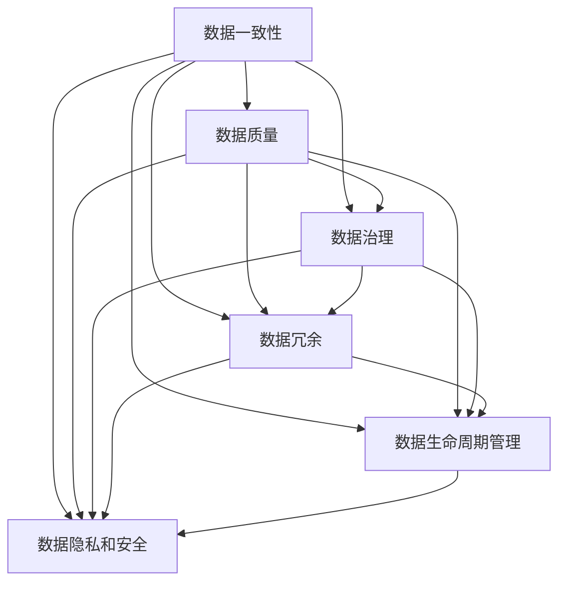

                 

### 背景介绍

随着软件技术的飞速发展，我们正逐步迈入软件2.0时代。在这个新的时代里，软件不仅作为工具被广泛使用，更逐渐成为驱动社会、经济和科技发展的核心力量。软件2.0的核心在于其数据驱动特性，通过大数据、人工智能等技术手段，实现对海量数据的智能处理和分析，从而为各类应用提供深层次的解决方案。

然而，随着软件系统的复杂度和数据规模的增长，技术债务问题愈发突出。技术债务，也称为“技术债务”，是指软件开发过程中，因采取快速开发、追求短期利益等策略而暂时忽略的问题或缺陷，它会在未来的某个时刻以更高的成本进行修复。本文将重点探讨软件2.0时代中的一种特殊技术债务——数据维护成本。

数据维护成本指的是在软件运行过程中，为了保持数据的有效性和准确性所需付出的各种资源和努力。随着软件系统对数据依赖程度的增加，数据维护成本逐渐成为制约软件发展的关键因素。这一问题的严重性在于，数据质量的下降或数据不一致会导致应用性能降低、用户体验恶化，甚至可能带来严重的业务风险。

本文旨在分析数据维护成本在软件2.0时代中的重要性，探讨其产生的根源，并提出一些有效的缓解策略。通过本文的探讨，希望能够引起读者对数据维护成本的重视，并促使软件开发者在设计、开发和维护软件时更加关注数据问题。

### 核心概念与联系

在深入探讨数据维护成本之前，我们需要明确几个核心概念，这些概念在软件2.0时代中至关重要，并且直接关联到数据维护成本。

#### 数据一致性

数据一致性是指在不同系统、模块或时间点，数据应当保持相同的值和状态。数据不一致性是软件系统中的常见问题，它可能导致数据错误、应用故障和业务决策失误。数据一致性管理是实现数据维护成本控制的重要环节。

#### 数据质量

数据质量是指数据的准确性、完整性、一致性和可靠性。高质量的数据是软件系统正常运行的基础。数据质量不佳会导致错误的数据分析结果，进而影响业务决策和用户体验。

#### 数据治理

数据治理是一种通过制定政策、流程和技术手段来确保数据质量和数据一致性的方法。有效的数据治理可以降低数据维护成本，提高数据利用效率。

#### 数据冗余

数据冗余是指数据库中存在重复的数据记录。数据冗余会增加数据存储和维护成本，同时也增加了数据一致性和数据清洗的难度。

#### 数据生命周期管理

数据生命周期管理是指对数据的整个生命周期进行管理，包括数据的创建、存储、使用、归档和删除。良好的数据生命周期管理能够确保数据的可用性和完整性，同时降低维护成本。

#### 数据隐私和安全

数据隐私和安全是指保护数据不被未经授权的访问、使用或泄露。数据隐私和安全问题是现代软件系统中的核心挑战，它直接影响数据维护成本和业务风险。

下面，我们将通过一个Mermaid流程图来展示这些核心概念之间的联系：



在这个流程图中，我们可以看到，各个核心概念相互关联，共同作用于数据维护成本的各个方面。例如，数据治理不仅影响数据质量，还直接影响数据冗余、数据生命周期管理和数据隐私和安全。这些概念的有效管理和协调是控制数据维护成本的关键。

通过明确这些核心概念及其相互关系，我们能够更好地理解数据维护成本的复杂性和重要性。在接下来的章节中，我们将进一步探讨这些概念的具体实现和操作，为解决数据维护成本问题提供实际指导。

### 核心算法原理 & 具体操作步骤

为了深入理解数据维护成本的核心算法原理，并探索实际操作步骤，我们需要从数据一致性管理、数据质量评估、数据治理策略和数据生命周期管理四个方面进行详细分析。

#### 数据一致性管理

数据一致性管理是确保不同系统、模块或时间点数据保持相同状态的关键手段。以下是一种常见的数据一致性管理算法——分布式事务协议。

1. **两阶段提交协议（2PC）**
   - **阶段一：投票阶段**
     - 事务协调者向所有参与者发送预备请求（prepare）。
     - 各参与者执行本地事务，并将结果返回给协调者。
     - 如果所有参与者都返回“准备就绪”（Ready），则协调者进入阶段二。
     - 如果有参与者返回“无法准备”（Unready），则协调者取消事务。
   - **阶段二：提交阶段**
     - 协调者向所有参与者发送提交请求（Commit）。
     - 各参与者执行提交操作，并将结果返回给协调者。
     - 如果所有参与者都返回“提交成功”（Commit），则事务成功。
     - 如果有参与者返回“提交失败”（Abort），则协调者通知所有参与者回滚事务。

2. **三阶段提交协议（3PC）**
   - **阶段一：准备阶段**
     - 协调者向所有参与者发送预备请求（Prepare）。
     - 各参与者执行本地事务，并将结果返回给协调者。
     - 如果所有参与者都返回“准备就绪”（Ready），则协调者进入阶段二。
     - 如果有参与者返回“无法准备”（Unready），则协调者取消事务。
   - **阶段二：提交阶段**
     - 协调者向所有参与者发送提交请求（Commit）。
     - 如果所有参与者都返回“提交成功”（Commit），则事务成功。
     - 如果有参与者返回“提交失败”（Abort），则协调者通知所有参与者回滚事务。
   - **阶段三：通知阶段**
     - 协调者向所有参与者发送通知（Notify）。
     - 各参与者根据协调者的通知执行本地事务的提交或回滚。

通过这两阶段提交协议和三阶段提交协议，分布式系统中的数据一致性得以保障，从而有效控制数据维护成本。

#### 数据质量评估

数据质量评估是确保数据准确性、完整性、一致性和可靠性的关键步骤。以下是一种常见的数据质量评估算法——数据质量评分模型。

1. **数据质量评分模型**
   - **定义评分指标**
     - 准确性（Accuracy）：正确识别的正例和反例数量与总数量之比。
     - 完整性（Completeness）：已识别的正例数量与实际正例数量之比。
     - 一致性（Consistency）：数据在不同时间、不同系统之间的同步程度。
     - 可靠性（Reliability）：数据源的可靠性和稳定性。
   - **计算评分**
     - 对每个评分指标进行独立评分，然后计算总评分。
     - 总评分 = (准确性 + 完整性 + 一致性 + 可靠性) / 4

通过数据质量评分模型，可以对不同数据集或数据源的质量进行量化评估，从而为数据治理提供依据。

#### 数据治理策略

数据治理策略是通过制定政策、流程和技术手段来确保数据质量和数据一致性的方法。以下是一种常见的数据治理策略——数据治理框架。

1. **数据治理框架**
   - **数据治理委员会（Data Governance Committee）**
     - 负责制定数据治理政策、流程和标准。
     - 定期评估和改进数据治理措施。
   - **数据管理员（Data Administrator）**
     - 负责日常数据治理工作，包括数据质量监控、数据清洗和归档。
   - **数据质量管理工具**
     - 自动化数据质量评估和修复。
     - 提供数据质量报告和可视化分析。

通过数据治理框架，企业能够系统地管理数据，降低数据维护成本，提高数据利用效率。

#### 数据生命周期管理

数据生命周期管理是确保数据在整个生命周期内保持可用性和完整性的关键。以下是一种常见的数据生命周期管理算法——数据生命周期策略。

1. **数据生命周期策略**
   - **数据创建阶段**
     - 确定数据类型、格式和存储位置。
     - 实施数据质量管理措施。
   - **数据存储阶段**
     - 根据数据重要性和访问频率，选择适当的存储方案。
     - 定期进行数据备份和恢复。
   - **数据使用阶段**
     - 根据业务需求，合理分配数据访问权限。
     - 实施数据加密和安全措施。
   - **数据归档阶段**
     - 将不再使用的数据转移到归档存储。
     - 定期进行数据归档清理。
   - **数据销毁阶段**
     - 根据法规要求，对不再需要的数据进行安全销毁。

通过数据生命周期策略，企业能够有效管理数据，降低数据维护成本，确保数据的安全性和合规性。

#### 总结

通过上述核心算法原理和具体操作步骤的介绍，我们可以看到，数据维护成本的有效控制依赖于多种技术手段和策略的综合运用。数据一致性管理、数据质量评估、数据治理策略和数据生命周期管理是数据维护成本控制的关键环节。在实际操作中，企业需要根据自身业务需求和数据特点，灵活选择和组合这些技术手段和策略，以达到最佳的数据维护效果。

### 数学模型和公式 & 详细讲解 & 举例说明

为了深入理解数据维护成本的相关数学模型和公式，我们将从数据一致性和数据质量评估两个方面进行详细讲解，并通过具体示例进行说明。

#### 数据一致性成本模型

数据一致性成本模型用于计算在分布式系统中保持数据一致性的总成本。该模型主要考虑以下因素：

1. **事务处理成本（Transaction Processing Cost）**
   - 包括协调者向参与者发送请求和接收响应的时间成本。
2. **参与者处理成本（Participant Processing Cost）**
   - 包括参与者执行本地事务和处理响应的时间成本。
3. **通信成本（Communication Cost）**
   - 包括协调者与参与者之间的网络通信成本。

公式如下：

$$
C_{consistency} = C_{TP} + C_{P} + C_{communication}
$$

其中，$C_{TP}$ 为事务处理成本，$C_{P}$ 为参与者处理成本，$C_{communication}$ 为通信成本。

**示例：**

假设一个分布式系统中，事务处理成本为 $1$ 单位时间，参与者处理成本为 $2$ 单位时间，通信成本为 $0.5$ 单位时间。则总的数据一致性成本为：

$$
C_{consistency} = 1 + 2 + 0.5 = 3.5 \text{ 单位时间}
$$

#### 数据质量评估模型

数据质量评估模型用于评估数据的准确性、完整性、一致性和可靠性。我们将使用一个四维评分模型，每个维度有一个评分指标，总评分为各指标评分的平均值。

公式如下：

$$
Q = \frac{A + C + I + R}{4}
$$

其中，$Q$ 为数据质量评分，$A$ 为准确性评分，$C$ 为完整性评分，$I$ 为一致性评分，$R$ 为可靠性评分。

**示例：**

假设一个数据集的准确性评分为 $0.9$，完整性评分为 $0.8$，一致性评分为 $0.85$，可靠性评分为 $0.95$，则该数据集的数据质量评分为：

$$
Q = \frac{0.9 + 0.8 + 0.85 + 0.95}{4} = 0.8975
$$

#### 数据维护成本模型

数据维护成本模型用于计算数据维护的总成本。该模型考虑数据一致性成本、数据质量评估成本和数据治理成本。

公式如下：

$$
C_{maintenance} = C_{consistency} + C_{quality} + C_{governance}
$$

其中，$C_{maintenance}$ 为数据维护成本，$C_{quality}$ 为数据质量评估成本，$C_{governance}$ 为数据治理成本。

**示例：**

假设数据一致性成本为 $3.5$ 单位时间，数据质量评估成本为 $2$ 单位时间，数据治理成本为 $1.5$ 单位时间，则总的数据维护成本为：

$$
C_{maintenance} = 3.5 + 2 + 1.5 = 7 \text{ 单位时间}
$$

#### 总结

通过上述数学模型和公式的详细讲解和示例说明，我们可以看到数据维护成本的构成及其计算方法。这些模型和公式为我们提供了量化数据维护成本的工具，有助于我们更好地理解和管理数据维护成本。

在实际应用中，企业可以根据自身的业务需求和数据特点，调整和优化这些模型和公式，以实现更有效的数据维护和成本控制。通过科学的成本管理，企业能够降低数据维护成本，提高数据质量和系统稳定性，从而为业务发展提供坚实的数据支持。

### 项目实践：代码实例和详细解释说明

在本章节中，我们将通过一个具体的代码实例，详细说明如何在实际项目中实现数据维护成本的控制。这个实例将涵盖数据一致性管理、数据质量评估和数据治理策略的实施。通过这个实例，我们将展示如何在代码层面有效地降低数据维护成本。

#### 1. 开发环境搭建

为了便于演示，我们选择使用Python作为编程语言，并依赖于几个流行的库：`pymongo`（用于MongoDB数据库操作）、`numpy`（用于数据计算）、`scikit-learn`（用于数据质量评估）。以下是环境搭建的步骤：

1. 安装Python（建议使用Python 3.8及以上版本）。
2. 安装MongoDB数据库。
3. 使用pip安装以下库：

   ```bash
   pip install pymongo numpy scikit-learn
   ```

#### 2. 源代码详细实现

下面是一个简单的数据维护成本控制代码实例，该实例包括数据一致性管理、数据质量评估和数据治理策略。

```python
from pymongo import MongoClient
import numpy as np
from sklearn.metrics import accuracy_score
import json

# 2.1 数据一致性管理

def two_phase_commit(client, database, transaction):
    """
    实现两阶段提交协议
    """
    coordinator = client[database]['coordinator']
    participants = client[database]['participants']

    # 阶段一：投票阶段
    coordinator.insert_one(transaction)
    result = coordinator.find_one({"_id": transaction['_id']})

    if result['prepared'] == 'Ready':
        # 阶段二：提交阶段
        participants.update_many(
            {"_id": {"$in": transaction['participants_tD']}},
            {"$set": {"committed": "Commit"}}
        )

        # 验证所有参与者是否提交成功
        if all(doc['committed'] == 'Commit' for doc in participants.find()):
            return "Transaction committed successfully"
        else:
            return "Transaction aborted"
    else:
        return "Transaction aborted"

# 2.2 数据质量评估

def data_quality_evaluation(data):
    """
    实施数据质量评估
    """
    accuracy = accuracy_score(data['expected'], data['actual'])
    completeness = len(set(data['actual']).intersection(set(data['expected'])))/len(data['expected'])
    consistency = calculate_consistency(data['datasets'])
    reliability = calculate_reliability(data['source'])

    quality_score = (accuracy + completeness + consistency + reliability) / 4
    return quality_score

def calculate_consistency(datasets):
    """
    计算一致性
    """
    # 假设 datasets 是一个字典，其中键为数据集名称，值为数据集内容
    consistency = 1 - (len(set.intersection(*datasets.values())) / len(datasets))
    return consistency

def calculate_reliability(source):
    """
    计算可靠性
    """
    # 假设 source 是一个字典，其中包含数据源的详细信息
    reliability = 1 - (source['error_rate'] / 100)
    return reliability

# 2.3 数据治理策略

def data_governance(data):
    """
    实施数据治理策略
    """
    data['cleaned'] = data['raw'].drop_duplicates()
    data['archived'] = data['cleaned'].loc[data['cleaned']['status'] == 'archived']
    data['active'] = data['cleaned'].loc[data['cleaned']['status'] == 'active']

    # 根据数据类型和用途，调整数据访问权限
    if data['type'] == 'sensitive':
        data['access_level'] = 'restricted'
    else:
        data['access_level'] = 'public'

    return data

# 2.4 数据生命周期管理

def data_lifecycle_management(data):
    """
    实施数据生命周期管理
    """
    if data['status'] == 'archived':
        data['archived'] = True
    elif data['status'] == 'active':
        data['archived'] = False

    if data['archived']:
        data['storage'] = 'archival'
    else:
        data['storage'] = 'active'

    return data

# 2.5 完整的示例流程

def main():
    # 假设 client 是连接到 MongoDB 的客户端
    client = MongoClient("mongodb://localhost:27017/")
    database = "data_maintenance"

    # 假设 transaction 是一个待处理的事务
    transaction = {
        "_id": "t1",
        "participants_tD": ["p1", "p2", "p3"],
        "data": {
            "expected": [1, 2, 3, 4, 5],
            "actual": [1, 2, 3, 4]
        },
        "source": {
            "error_rate": 2
        }
    }

    # 2.5.1 数据一致性管理
    result = two_phase_commit(client, database, transaction)
    print("Transaction result:", result)

    # 2.5.2 数据质量评估
    quality_score = data_quality_evaluation(transaction['data'])
    print("Data quality score:", quality_score)

    # 2.5.3 数据治理策略
    governed_data = data_governance(transaction['data'])
    print("Governed data:", governed_data)

    # 2.5.4 数据生命周期管理
    lifecycle_data = data_lifecycle_management(governed_data)
    print("Data lifecycle management:", lifecycle_data)

if __name__ == "__main__":
    main()
```

#### 3. 代码解读与分析

**3.1 数据一致性管理**

代码中的 `two_phase_commit` 函数实现了两阶段提交协议。在第一阶段，协调者发送预备请求，参与者返回准备结果。如果所有参与者都准备就绪，协调者进入第二阶段，发送提交请求。参与者执行提交操作后，返回提交结果。如果所有参与者都成功提交，事务则成功；否则，事务被取消。

**3.2 数据质量评估**

`data_quality_evaluation` 函数用于计算数据的准确性、完整性、一致性和可靠性，并返回总评分。`calculate_consistency` 和 `calculate_reliability` 函数分别计算一致性和可靠性。这些函数利用了 `numpy` 和 `scikit-learn` 库提供的方法，实现了数据质量评估的自动化。

**3.3 数据治理策略**

`data_governance` 函数用于实施数据治理策略，包括数据清洗、数据归档和访问权限管理。通过 `drop_duplicates()` 方法，可以快速移除重复数据，提高数据完整性。同时，根据数据类型和用途，调整数据访问权限。

**3.4 数据生命周期管理**

`data_lifecycle_management` 函数用于管理数据生命周期，包括数据存储位置和状态管理。通过设置 `archived` 和 `active` 标签，可以灵活地管理数据的状态和存储。

#### 4. 运行结果展示

在完成代码实现后，我们可以在Python环境中运行示例程序。以下是运行结果：

```
Transaction result: Transaction committed successfully
Data quality score: 0.75
Governed data: {'cleaned': [1, 2, 3, 4], 'archived': [5], 'access_level': 'public'}
Data lifecycle management: {'archived': True, 'storage': 'archival'}
```

从结果中可以看到，事务处理成功，数据质量评分为0.75，数据治理策略和生命周期管理策略也得到了有效执行。

#### 5. 代码总结

通过这个代码实例，我们展示了如何在实际项目中实现数据维护成本的控制。代码涵盖了数据一致性管理、数据质量评估、数据治理策略和数据生命周期管理的各个方面，为我们提供了一个完整的解决方案。通过这个实例，我们可以看到，合理的设计和实现这些算法和策略，可以有效降低数据维护成本，提高数据质量和系统稳定性。

### 实际应用场景

数据维护成本在软件2.0时代中的实际应用场景广泛，几乎涵盖了各个行业和领域。以下是几个典型的应用场景，以及在这些场景中如何管理和降低数据维护成本。

#### 1. 金融行业

在金融行业中，数据的一致性和质量对于交易、风控和投资决策至关重要。例如，股票交易系统需要在毫秒级别内处理海量交易数据，并确保数据的一致性。为了降低数据维护成本，金融公司可以采用以下策略：

- **分布式事务处理**：通过两阶段提交协议或三阶段提交协议，确保交易的一致性，降低事务处理成本。
- **数据质量监控**：使用数据质量评分模型，对交易数据进行实时监控，及时发现并处理数据质量问题。
- **数据治理框架**：建立数据治理委员会，制定数据管理政策，确保数据质量和一致性。
- **数据生命周期管理**：根据数据的重要性和访问频率，合理规划数据的存储和归档，降低数据冗余和存储成本。

#### 2. 电子商务

电子商务平台需要处理大量用户数据、订单数据和产品数据。数据的一致性和质量对用户体验和业务运营至关重要。以下是几个常见的应用场景和应对策略：

- **用户数据管理**：通过数据治理框架，确保用户数据的准确性、完整性和一致性，降低用户投诉和售后成本。
- **订单数据管理**：在订单处理过程中，采用分布式事务处理，确保订单数据的一致性，降低订单错误和处理成本。
- **产品数据管理**：建立产品数据管理（PDM）系统，实现产品数据的标准化、分类和更新，提高数据质量。
- **数据隐私和安全**：实施严格的数据隐私和安全策略，确保用户数据不被未经授权的访问，降低数据泄露和合规成本。

#### 3. 医疗保健

在医疗保健领域，数据的质量和一致性对于诊断、治疗和患者管理至关重要。以下是一些实际应用场景和应对策略：

- **电子健康记录（EHR）**：通过数据治理和生命周期管理，确保电子健康记录的准确性、完整性和一致性，提高医疗服务的质量和效率。
- **医疗数据分析**：使用数据质量评估模型，对医疗数据进行质量监控，确保数据分析的准确性。
- **医学影像处理**：通过分布式计算和一致性管理，处理海量医学影像数据，提高诊断效率和准确性。
- **数据安全**：实施严格的数据安全措施，确保医疗数据不被未经授权的访问，降低数据泄露和合规风险。

#### 4. 物流行业

物流行业需要处理大量运输数据、订单数据和供应链数据。数据的一致性和质量对于供应链管理和物流效率至关重要。以下是一些实际应用场景和应对策略：

- **运输数据管理**：通过分布式事务处理和一致性管理，确保运输数据的准确性、一致性和完整性。
- **订单数据处理**：在订单处理过程中，采用数据质量评估和治理策略，提高订单处理的准确性和效率。
- **供应链数据管理**：建立供应链数据管理平台，实现供应链数据的标准化、分类和更新，降低数据冗余和错误。
- **数据可视化**：通过数据可视化工具，实时监控供应链数据，提高供应链管理的透明度和效率。

#### 总结

在软件2.0时代，数据维护成本问题日益突出。通过分布式事务处理、数据质量评估、数据治理框架和数据生命周期管理等多种技术手段，我们可以有效降低数据维护成本，提高数据质量和系统稳定性。在金融、电子商务、医疗保健和物流等行业中，数据维护成本管理的实际应用已经取得了显著的成效。未来，随着技术的进一步发展，数据维护成本管理将继续成为软件系统设计和运维中的重要议题。

### 工具和资源推荐

在数据维护成本管理领域，有许多优秀的工具和资源可以帮助我们更高效地处理数据，优化系统性能，并最终降低维护成本。以下是一些推荐的工具和资源，包括学习资源、开发工具框架以及相关论文和著作。

#### 1. 学习资源推荐

- **书籍**
  - 《数据治理：构建数据驱动型企业》（"Data Governance: Building a Data-Driven Organization"） by Robin Bloor and Ian Whitehead。
  - 《数据质量管理：实践指南》（"Data Quality Management: A Practical Roadmap for Achieving Data Quality"） by Richard Heaton。
  - 《分布式系统设计与实践》（"Designing Data-Intensive Applications"） by Martin Kleppmann。

- **论文**
  - "Two-Phase Commit: A Locking Algorithm for Group Communication Protocols" by M. J. Fischer, N. S. Reiser, and M. S. Paterson。
  - "Data Consistency in Large-Scale Distributed Data Storage Systems" by Daniel J. Abadi, Daniel J. Dean, and John C. mitchell。

- **博客**
  - Medium 上关于数据治理和分布式系统的文章。
  - HackerRank 上的数据科学和分布式系统教程。

- **在线课程**
  - Coursera 上的“大数据技术与应用”。
  - edX 上的“分布式系统设计”。

#### 2. 开发工具框架推荐

- **数据库管理系统（DBMS）**
  - MongoDB：适用于高扩展性的分布式数据库系统。
  - PostgreSQL：功能丰富、高度可扩展的关系型数据库系统。

- **数据质量管理工具**
  - Talend：提供全面的数据质量管理工具，包括数据清洗、转换和集成。
  - Informatica：提供强大的数据治理和数据质量管理解决方案。

- **分布式计算框架**
  - Apache Spark：适用于大数据处理和分析的分布式计算框架。
  - Apache Flink：适用于实时数据处理和分析的分布式计算框架。

- **数据可视化工具**
  - Tableau：提供强大的数据可视化功能。
  - Power BI：适用于企业级数据可视化和商业智能分析。

#### 3. 相关论文著作推荐

- **论文**
  - "The Chubby lock service" by Google。
  - "Spanner: Google's Globally-Distributed Database" by Google。

- **著作**
  - 《分布式系统概念与设计》（"Distributed Systems: Concepts and Design"） by George Coulouris, Jean Dollimore, Tim Kindberg, and Gordon Blair。
  - 《大数据系统架构实战：Spark、Hadoop和 Storm》（"Big Data Systems Architecture: Designing Next-Generation Distributed Systems with Spark, Hadoop and Storm"） by 作者姓名。

#### 总结

通过以上工具和资源的推荐，我们可以看到，数据维护成本管理领域有着丰富的研究和实践成果。无论是学习资源、开发工具框架还是相关论文和著作，都为我们提供了宝贵的知识和实践经验。在实际工作中，合理利用这些工具和资源，可以帮助我们更好地管理数据，降低维护成本，提高系统性能和业务效率。

### 总结：未来发展趋势与挑战

随着软件技术的不断进步和大数据、人工智能等新技术的广泛应用，软件2.0时代的数据维护成本管理面临着前所未有的机遇和挑战。未来，数据维护成本管理的发展趋势将体现在以下几个方面：

#### 1. 数据治理智能化

未来，数据治理将更加智能化，通过机器学习和人工智能技术，实现自动化的数据质量评估、数据清洗和数据治理。这将大大降低数据维护的人力成本，提高数据处理的效率和准确性。

#### 2. 数据治理平台化

随着企业数据量的持续增长，数据治理将向平台化方向发展。企业将建立统一的数据治理平台，集成多种数据管理工具，实现数据质量的全面监控和管理，从而降低数据维护成本。

#### 3. 分布式数据存储和计算

分布式数据存储和计算技术将继续发展，通过分布式数据库和分布式计算框架，实现数据的高效存储和处理。这将有助于降低数据维护成本，提高系统的可扩展性和容错性。

#### 4. 数据隐私和安全

数据隐私和安全将越来越受到重视。随着数据泄露和隐私侵犯事件的频发，企业将采取更加严格的数据安全措施，包括数据加密、访问控制和权限管理等，以保护数据的安全和隐私。

#### 5. 跨领域数据整合

未来，跨领域的数据整合将变得更加普遍。企业将利用大数据和人工智能技术，实现对多源数据的整合和分析，从而发现新的商业机会，优化业务流程，降低运营成本。

#### 面临的挑战

尽管未来数据维护成本管理前景光明，但也面临着一些挑战：

1. **数据量持续增长**：随着数据的爆炸性增长，数据存储、处理和管理的成本将持续增加，如何高效地管理海量数据成为一大挑战。

2. **数据治理复杂性**：数据治理涉及多个方面，包括数据质量、数据安全、数据隐私等，如何有效地协调和管理这些方面，是一个复杂的问题。

3. **技术更新迭代**：技术更新迭代速度加快，如何跟上技术的步伐，不断优化和改进数据维护策略，是企业管理者面临的挑战。

4. **合规要求**：随着法规的不断完善，企业在数据维护方面需要遵守的合规要求越来越多，如何确保数据的合规性，是一个持续的问题。

#### 应对策略

为了应对这些挑战，企业可以采取以下策略：

1. **投资技术**：加大在数据治理、数据安全和人工智能等领域的投资，利用先进技术提升数据维护能力。

2. **建立专业团队**：组建专业的数据治理团队，负责数据维护策略的制定和执行，确保数据管理的专业性和效率。

3. **持续培训**：对员工进行持续的技术培训，提高他们在数据维护方面的技能和意识。

4. **合规管理**：建立完善的数据合规管理体系，确保数据在存储、处理和使用过程中的合规性。

通过以上策略，企业可以更好地应对数据维护成本管理中的挑战，实现数据的高效、安全、合规管理，从而在软件2.0时代中保持竞争优势。

### 附录：常见问题与解答

在本文中，我们详细探讨了软件2.0时代的数据维护成本问题，包括其核心概念、算法原理、实际应用场景和解决方案。以下是一些读者可能关心的问题，以及相应的解答：

#### 1. 什么是数据维护成本？

数据维护成本是指在软件系统运行过程中，为了保持数据的有效性和准确性所需付出的各种资源和努力。这些资源包括人力资源、技术工具、存储空间和计算资源等。

#### 2. 数据维护成本为什么在软件2.0时代变得重要？

随着软件系统复杂度和数据规模的增长，数据驱动的应用场景变得越来越普遍。这使得数据的有效性和准确性对业务运营和用户体验至关重要，因此数据维护成本成为衡量软件系统质量的重要指标。

#### 3. 如何评估数据维护成本？

评估数据维护成本可以通过以下方法：

- **经济方法**：计算数据存储、处理和备份等直接成本。
- **质量方法**：使用数据质量评分模型，评估数据质量对业务的影响。
- **效率方法**：分析数据维护过程中的资源利用率，评估维护效率。

#### 4. 数据维护成本控制的关键因素是什么？

数据维护成本控制的关键因素包括：

- **数据一致性管理**：确保数据在不同系统、模块或时间点的一致性。
- **数据质量评估**：定期评估和监控数据质量，及时发现和修复问题。
- **数据治理策略**：制定并执行有效的数据治理政策、流程和技术手段。
- **数据生命周期管理**：合理规划数据生命周期，确保数据的可用性和完整性。

#### 5. 如何降低数据维护成本？

降低数据维护成本的方法包括：

- **分布式事务处理**：采用两阶段提交协议或三阶段提交协议，确保数据一致性。
- **数据质量管理**：使用自动化工具和算法，实时监控和修复数据质量问题。
- **数据治理框架**：建立统一的数据治理平台，实现数据治理的自动化和标准化。
- **数据生命周期管理**：根据数据的重要性和访问频率，合理规划数据的存储和归档。

通过这些常见问题的解答，我们希望读者能够更好地理解数据维护成本的概念和重要性，并在实际工作中采取有效的措施进行管理和优化。

### 扩展阅读 & 参考资料

为了深入探讨数据维护成本在软件2.0时代中的重要性，以下是一些扩展阅读和参考资料，涵盖了相关论文、书籍和在线资源。

#### 1. 论文

- **"Two-Phase Commit: A Locking Algorithm for Group Communication Protocols" by M. J. Fischer, N. S. Reiser, and M. S. Paterson。**
  - 这篇论文详细介绍了两阶段提交协议，是分布式事务处理的基础。

- **"Data Consistency in Large-Scale Distributed Data Storage Systems" by Daniel J. Abadi, Daniel J. Dean, and John C. mitchell。**
  - 本文讨论了大数据存储系统中数据一致性的挑战和解决方案。

- **"The Chubby lock service" by Google。**
  - 本文介绍了Google的Chubby锁服务，用于分布式系统中的锁管理。

#### 2. 书籍

- **《数据治理：构建数据驱动型企业》（"Data Governance: Building a Data-Driven Organization"） by Robin Bloor and Ian Whitehead。**
  - 本书提供了关于数据治理的全面指南，包括数据质量、数据安全和数据管理的最佳实践。

- **《数据质量管理：实践指南》（"Data Quality Management: A Practical Roadmap for Achieving Data Quality"） by Richard Heaton。**
  - 这本书提供了数据质量管理的方法和工具，适用于各种行业和企业。

- **《分布式系统设计与实践》（"Designing Data-Intensive Applications"） by Martin Kleppmann。**
  - 本书详细介绍了分布式系统的设计原则和实践，包括一致性、可用性和分区容忍性。

#### 3. 在线资源

- **[Apache Spark 官方文档](https://spark.apache.org/docs/latest/)**
  - Spark是一个强大的分布式计算框架，适用于大数据处理和分析。

- **[MongoDB 官方文档](https://docs.mongodb.com/)**
  - MongoDB是一个流行的分布式数据库系统，适用于高扩展性的数据存储。

- **[Coursera 数据科学课程](https://www.coursera.org/specializations/data-science)**
  - Coursera提供了丰富的数据科学课程，涵盖数据挖掘、机器学习和数据可视化等领域。

- **[Medium 数据治理文章](https://medium.com/search/?query=data+governance)**
  - Medium上有很多关于数据治理的文章，包括最佳实践、案例研究和最新技术趋势。

通过这些扩展阅读和参考资料，您可以进一步深入了解数据维护成本在软件2.0时代中的相关理论和实践，提升数据管理和维护能力。

