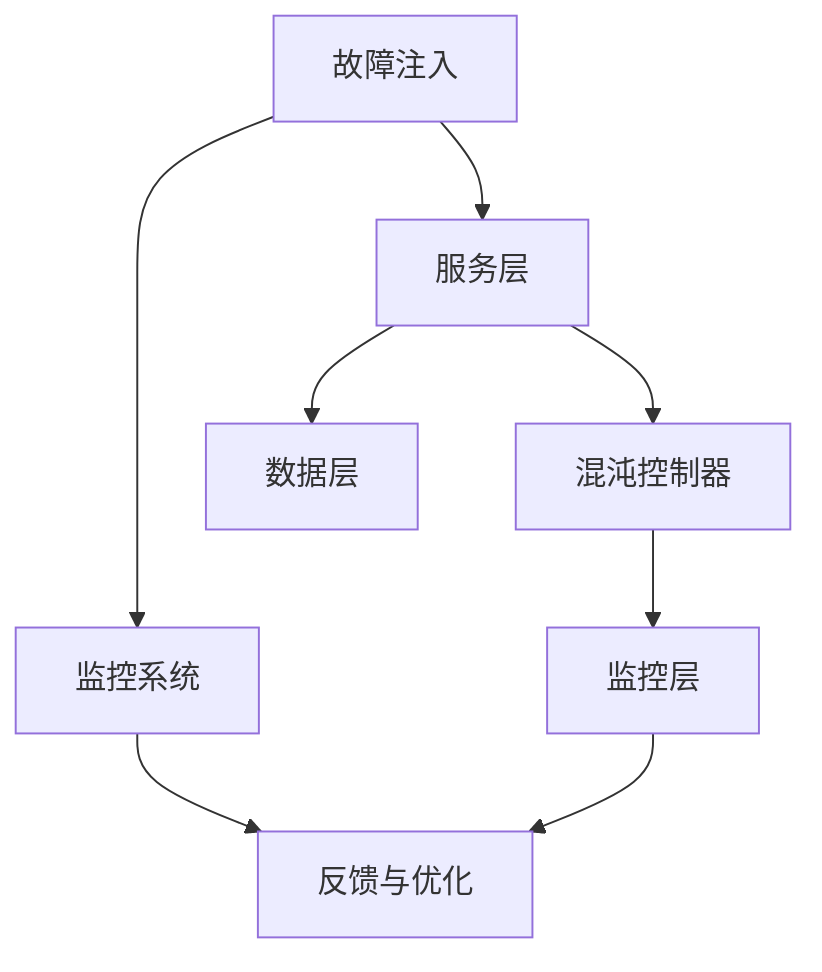

                 

### 背景介绍

软件2.0时代的到来，标志着软件开发从传统的单体架构向分布式、微服务、云计算等方向发展。这一转变不仅提升了系统的可扩展性和灵活性，也带来了前所未有的复杂性。在这种背景下，混沌工程（Chaos Engineering）作为一种新兴的实践方法，逐渐引起了业界的关注。

混沌工程，顾名思义，是通过故意引入系统中的错误、故障和不确定性，来测试系统的弹性和稳健性。它的核心思想是“通过破坏来了解系统的适应能力”，这种方法最早由Netflix引入，并在金融、电信、互联网等各个领域得到了广泛应用。

混沌工程的背景可以追溯到系统工程的早期实践，例如鲁棒性分析和故障注入。然而，随着云计算和分布式系统的普及，混沌工程的应用场景和实施方式得到了极大的扩展和深化。传统的系统测试方法往往只能在静态环境下进行，而混沌工程则强调在实际运行环境中进行动态测试，从而更真实地反映系统的性能和可靠性。

在软件2.0时代，混沌工程的意义尤为突出。首先，分布式系统的复杂性使得传统的测试方法难以全面覆盖潜在故障点，而混沌工程提供了一种全局性的测试策略，可以系统地发现并解决系统中的隐蔽故障。其次，混沌工程有助于提升系统的容错能力和自我恢复能力，这对于高度依赖系统稳定性的现代互联网服务至关重要。最后，混沌工程也是一种优秀的风险管理工具，通过提前识别和解决潜在故障，可以显著降低系统宕机的风险和成本。

总之，混沌工程在软件2.0时代的重要性不言而喻。它不仅为软件开发提供了新的方法和工具，也为系统设计和运维带来了深刻的变革。接下来的章节将详细探讨混沌工程的核心概念、算法原理、实践应用等，帮助读者全面了解并掌握这一前沿技术。

### 核心概念与联系

要深入理解混沌工程，我们首先需要明确其核心概念和原理，并了解它们在系统架构中的应用。

#### 混沌工程的定义与目的

混沌工程是一种通过故意引入故障和不确定性来测试系统弹性和稳健性的方法。它旨在验证系统在面对意外事件时的恢复能力和稳定性。具体来说，混沌工程包括以下几个关键步骤：

1. **故障注入**：故意在系统中引入故障，如延迟、网络分区、硬件故障等，以模拟真实环境中的各种异常情况。
2. **监控和反馈**：在故障注入过程中，监控系统状态和性能指标，收集相关数据，以便分析和评估系统的响应。
3. **迭代优化**：根据监控反馈，不断调整和优化系统的设计和配置，以提高其弹性和稳健性。

#### 核心概念

1. **容错性（Fault Tolerance）**：系统在面临故障时，能够维持正常运作的能力。混沌工程通过故障注入来验证系统的容错性，确保系统能够在故障发生后迅速恢复正常。
2. **弹性（Resiliency）**：系统能够适应变化和不确定性，包括扩展性、伸缩性和自愈能力。混沌工程帮助系统在真实环境下测试和提升其弹性。
3. **韧性（Tolerance）**：系统在面对不可预见或重大变化时的承受能力。韧性通常通过混沌工程中的大规模故障注入来测试。

#### 系统架构

为了实现混沌工程的目标，系统架构设计至关重要。以下是一个典型的分布式系统架构，该架构中包含了混沌工程所需的关键组件：

1. **服务层**：包括多个微服务，每个服务负责特定的业务功能。服务之间通过网络通信进行协作。
2. **数据层**：存储系统，包括关系型数据库和非关系型数据库，提供数据存储和访问服务。
3. **监控层**：用于监控系统的状态和性能，收集关键指标，如延迟、错误率、CPU利用率等。
4. **混沌控制器**：负责注入故障和执行混沌工程测试，可以是独立的工具，也可以集成在服务层中。

#### Mermaid 流程图

为了更直观地理解混沌工程在系统架构中的应用，我们可以使用 Mermaid 流程图来展示其核心步骤和组件之间的关系。



在这个流程图中：

- **故障注入**：混沌控制器向服务层和数据层注入故障。
- **监控系统**：监控层实时监控系统的状态和性能。
- **反馈与优化**：根据监控数据，对系统进行反馈和优化。

通过这个流程图，我们可以清晰地看到混沌工程在系统架构中的应用，以及各个组件之间的协作关系。

### 核心算法原理 & 具体操作步骤

为了深入理解混沌工程，我们需要探讨其核心算法原理，并详细解释具体操作步骤。混沌工程的核心在于通过引入故障来测试系统的弹性和稳健性，从而提高系统的可靠性和容错能力。以下将介绍几种常见的混沌工程算法及其实现步骤。

#### 1. 故障注入算法

故障注入是混沌工程中最基础的一步，目的是在系统中引入各种类型的故障。以下是一种简单的故障注入算法：

1. **随机故障注入**：随机选择系统中的某一组件（如服务实例、数据库节点等），并对其施加故障。故障类型可以是延迟、网络分区、服务不可达等。
2. **概率故障注入**：根据不同故障类型的概率分布，随机选择故障类型并注入。

**实现步骤**：

- **确定故障注入对象**：根据系统架构和业务需求，确定需要注入故障的组件。
- **生成故障概率分布**：根据历史数据和业务特性，确定不同故障类型的概率分布。
- **随机选择故障**：根据概率分布，随机选择故障类型。
- **注入故障**：对选定的组件施加故障。

#### 2. 故障排除算法

在故障注入后，需要监控系统状态并尝试排除故障。以下是一种简单的故障排除算法：

1. **监控状态**：通过监控系统（如Prometheus、Grafana等）实时监控系统状态，包括延迟、错误率、CPU利用率等关键指标。
2. **故障定位**：根据监控数据，定位故障发生的位置和原因。
3. **故障排除**：根据故障原因，尝试排除故障，如重启服务、清理缓存、恢复网络连接等。

**实现步骤**：

- **初始化监控系统**：配置监控工具，确保能够收集到关键系统指标。
- **设置监控阈值**：根据业务需求和系统特性，设置监控阈值。
- **监控数据采集**：定期采集监控数据，并存储在数据仓库中。
- **数据分析和处理**：分析监控数据，定位故障发生的位置和原因。
- **故障排除**：根据故障原因，执行相应的故障排除操作。

#### 3. 自动恢复算法

在故障排除后，系统需要自动恢复到正常状态。以下是一种简单的自动恢复算法：

1. **状态检测**：监控系统状态，判断系统是否恢复正常。
2. **自动恢复**：如果系统状态未恢复正常，自动执行恢复操作，如重启服务、恢复数据等。
3. **反馈机制**：将恢复过程和结果记录下来，作为未来故障排除和优化的重要参考。

**实现步骤**：

- **初始化恢复系统**：配置自动恢复工具，确保能够在故障发生后自动执行恢复操作。
- **设置恢复阈值**：根据业务需求和系统特性，设置恢复阈值。
- **状态检测**：通过监控系统实时检测系统状态。
- **自动恢复**：根据恢复阈值，自动执行恢复操作。
- **记录恢复结果**：记录恢复过程和结果，用于后续分析和优化。

#### 4. 混沌实验设计算法

混沌实验设计是混沌工程的核心，用于系统地测试系统的弹性和稳健性。以下是一种简单的混沌实验设计算法：

1. **确定实验目标**：根据业务需求和系统特性，确定实验目标，如测试系统的延迟、错误率、吞吐量等。
2. **设计故障场景**：根据实验目标，设计多种故障场景，如延迟、网络分区、服务不可达等。
3. **执行实验**：按照设计好的故障场景，逐步注入故障，并监控系统状态。
4. **分析实验结果**：根据监控数据，分析系统在故障场景下的表现，识别潜在问题。

**实现步骤**：

- **分析业务需求**：了解业务需求和系统特性，确定实验目标。
- **设计故障场景**：根据实验目标，设计多种故障场景。
- **配置实验环境**：搭建实验环境，确保能够按照设计执行故障注入。
- **执行故障注入**：按照设计好的故障场景，逐步注入故障。
- **监控实验过程**：实时监控系统状态，收集实验数据。
- **分析实验结果**：根据监控数据，分析系统在故障场景下的表现。

通过以上算法原理和具体操作步骤，我们可以系统地设计并执行混沌工程实验，从而提高系统的弹性和稳健性。在接下来的章节中，我们将通过实际项目案例，进一步探讨混沌工程的实践应用和效果评估。

### 数学模型和公式 & 详细讲解 & 举例说明

混沌工程作为一种新兴的实践方法，其理论基础涵盖了概率论、统计学和系统论等多个领域。以下将详细介绍混沌工程中常用的数学模型和公式，并通过具体例子进行说明。

#### 1. 故障概率模型

故障概率模型用于描述系统中各个组件发生故障的概率。常见的方法包括泊松分布和指数分布。

**泊松分布**：假设在一定时间内，系统中的某一组件发生故障的事件数服从泊松分布，其概率密度函数为：
\[ P(X = k) = \frac{(\lambda t)^k e^{-\lambda t}}{k!} \]
其中，\( \lambda \) 为故障率（单位时间内发生故障的次数），\( t \) 为时间。

**指数分布**：假设某一组件发生故障的时间间隔服从指数分布，其概率密度函数为：
\[ P(T = t) = \lambda e^{-\lambda t} \]
其中，\( \lambda \) 为故障率。

**例子**：假设某一系统组件的故障率为 \( \lambda = 0.01 \) 次每秒，求在 1 秒内发生故障的概率。

**解答**：
使用泊松分布公式计算：
\[ P(X = 1) = \frac{(0.01 \times 1)^1 e^{-0.01 \times 1}}{1!} = 0.009950498 \]

使用指数分布公式计算：
\[ P(T = 1) = 0.01 e^{-0.01 \times 1} = 0.009950498 \]

两种方法得到的结果基本一致。

#### 2. 系统可靠性模型

系统可靠性模型用于描述系统在给定时间内的可靠性，即系统能够正常运作的概率。常见的方法包括马尔可夫链和失效-恢复模型。

**马尔可夫链**：假设系统中的各个状态（如正常、故障、恢复等）之间遵循马尔可夫性质，即当前状态只依赖于前一状态，与过去的历史状态无关。马尔可夫链的状态转移概率可以用矩阵表示。

**例子**：假设系统有三种状态：正常（N）、故障（F）和恢复（R），状态转移矩阵为：
\[ \begin{bmatrix} 
1 - p_{11} & p_{12} & p_{13} \\
p_{21} & 1 - p_{22} & p_{23} \\
p_{31} & p_{32} & 1 - p_{33} 
\end{bmatrix} \]
其中，\( p_{ij} \) 表示从状态 \( i \) 转移到状态 \( j \) 的概率。

求系统在 \( t \) 时间后处于正常状态的概率。

**解答**：
根据马尔可夫链的性质，状态转移概率矩阵满足：
\[ P_t = P_0 \times P \times P \times ... \times P \]
其中，\( P_t \) 表示 \( t \) 时间后的状态转移概率矩阵，\( P_0 \) 表示初始状态转移概率矩阵，\( P \) 表示状态转移概率矩阵。

假设初始状态为正常状态，则初始状态转移概率矩阵为：
\[ P_0 = \begin{bmatrix} 
1 & 0 & 0 \\
0 & 1 & 0 \\
0 & 0 & 1 
\end{bmatrix} \]

求 \( t \) 时间后处于正常状态的概率，即矩阵 \( P_t \) 的第一行第一列的值。

#### 3. 系统稳定性模型

系统稳定性模型用于描述系统在面对故障和不确定性时的稳定性。常见的方法包括均值-方差模型和鲁棒性分析。

**均值-方差模型**：假设系统的输出值 \( X \) 符合正态分布，其概率密度函数为：
\[ f_X(x) = \frac{1}{\sqrt{2\pi\sigma^2}} e^{-\frac{(x-\mu)^2}{2\sigma^2}} \]
其中，\( \mu \) 表示均值，\( \sigma \) 表示标准差。

系统的稳定性可以通过计算均方误差（Mean Squared Error，MSE）来评估：
\[ MSE = E[(X - \mu)^2] = \sigma^2 \]

**例子**：假设系统输出的均值 \( \mu = 10 \)，标准差 \( \sigma = 2 \)，求系统的均方误差。

**解答**：
根据均值-方差模型，均方误差为：
\[ MSE = \sigma^2 = 2^2 = 4 \]

#### 4. 鲁棒性分析模型

鲁棒性分析模型用于评估系统在面对外部扰动时的稳定性。常见的方法包括H-infinity控制理论和鲁棒优化方法。

**H-infinity控制理论**：假设系统可以表示为：
\[ \dot{x}(t) = Ax(t) + Bu(t), \quad y(t) = Cx(t) + Du(t) \]
其中，\( x(t) \) 表示状态向量，\( u(t) \) 表示控制输入，\( y(t) \) 表示输出。

系统的鲁棒性可以通过计算H-infinity范数来评估：
\[ \rho(H) = \sup_{\|w\|=1} \|Hu\| \]
其中，\( w \) 表示外部扰动，\( \|w\| \) 表示扰动范数，\( \|Hu\| \) 表示系统的输出范数。

**例子**：假设系统的状态矩阵 \( A \) 和控制矩阵 \( B \) 如下：
\[ A = \begin{bmatrix} 
1 & 1 \\
0 & 1 
\end{bmatrix}, \quad B = \begin{bmatrix} 
1 \\
0 
\end{bmatrix} \]
求系统的H-infinity范数。

**解答**：
根据H-infinity控制理论，系统的H-infinity范数可以通过求解以下优化问题得到：
\[ \rho(H) = \max_{\|w\|=1} \|Hu\| \]
其中，\( u \) 为控制输入，\( w \) 为扰动。

通过求解该优化问题，可以得到系统的H-infinity范数。

通过以上数学模型和公式的讲解，我们可以更好地理解混沌工程的原理和应用。在实际项目中，可以根据具体情况选择合适的模型和方法，进行故障注入、监控和优化，从而提升系统的弹性和稳健性。

### 项目实践：代码实例和详细解释说明

为了更好地理解混沌工程的实践应用，我们将通过一个实际项目来展示代码实现过程，并详细解释每一步的操作和关键代码。

#### 1. 开发环境搭建

首先，我们需要搭建一个适合进行混沌工程实践的开发环境。以下是所需的基本工具和框架：

- **Docker**：用于容器化部署和管理系统组件。
- **Kubernetes**：用于自动化部署和扩展容器化应用。
- **Prometheus**：用于监控系统状态和性能指标。
- **Grafana**：用于可视化监控数据和执行混沌实验。
- **Chaos Mesh**：用于在Kubernetes集群中执行混沌工程实验。

**安装步骤**：

1. **安装Docker**：在操作系统上安装Docker，参考官方文档：[Docker安装指南](https://docs.docker.com/get-docker/)。
2. **安装Kubernetes**：可以选择在本地或云平台上部署Kubernetes集群，参考官方文档：[Kubernetes安装指南](https://kubernetes.io/docs/setup/production-environment/tools/kubeadm/kubeadm-)。
3. **安装Prometheus**：通过Docker容器部署Prometheus，参考官方文档：[Prometheus安装指南](https://prometheus.io/docs/prometheus/latest/installation/)。
4. **安装Grafana**：通过Docker容器部署Grafana，参考官方文档：[Grafana安装指南](https://grafana.com/docs/grafana/latest/installation/)。
5. **安装Chaos Mesh**：通过Helm部署Chaos Mesh，参考官方文档：[Chaos Mesh安装指南](https://chaos-mesh.org/docs/zh-CN/quick-start/)。

#### 2. 源代码详细实现

以下是一个简单的示例，展示如何在Kubernetes集群中部署一个服务，并使用Chaos Mesh进行混沌工程实验。

**步骤 1：创建服务部署文件**

创建一个名为`service.yaml`的文件，内容如下：

```yaml
apiVersion: apps/v1
kind: Deployment
metadata:
  name: my-service
spec:
  replicas: 3
  selector:
    matchLabels:
      app: my-service
  template:
    metadata:
      labels:
        app: my-service
    spec:
      containers:
      - name: my-service
        image: my-service:latest
        ports:
        - containerPort: 80
```

**步骤 2：部署服务**

在命令行执行以下命令，部署服务：

```shell
kubectl apply -f service.yaml
```

**步骤 3：创建Chaos Mesh配置文件**

创建一个名为`chaos.yaml`的文件，内容如下：

```yaml
apiVersion: chaos-mesh.org/v1alpha1
kind: ChaosController
metadata:
  name: latency-chaos
spec:
  action: NetworkChaos
  mode: one
  selector:
    namespaces:
      - default
  spec:
    networkChaos:
      latency:
        target: []
        fixedValue: 100ms
        probability: 0.5
```

**步骤 4：应用Chaos Mesh配置**

在命令行执行以下命令，应用Chaos Mesh配置：

```shell
chaosctl apply -f chaos.yaml
```

**步骤 5：监控和可视化**

使用Prometheus和Grafana监控系统的状态和性能。配置Grafana dashboards，可视化混沌工程实验的结果。

#### 3. 代码解读与分析

以下是对关键代码段的解读和分析：

- **服务部署文件（service.yaml）**：

  ```yaml
  apiVersion: apps/v1
  kind: Deployment
  metadata:
    name: my-service
  spec:
    replicas: 3
    selector:
      matchLabels:
        app: my-service
    template:
      metadata:
        labels:
          app: my-service
      spec:
        containers:
        - name: my-service
          image: my-service:latest
          ports:
          - containerPort: 80
  ```

  该文件定义了一个Kubernetes Deployment，用于部署一个具有3个副本的MyService应用。应用使用的是最新版本的Docker镜像。

- **Chaos Mesh配置文件（chaos.yaml）**：

  ```yaml
  apiVersion: chaos-mesh.org/v1alpha1
  kind: ChaosController
  metadata:
    name: latency-chaos
  spec:
    action: NetworkChaos
    mode: one
    selector:
      namespaces:
        - default
  spec:
    networkChaos:
      latency:
        target: []
        fixedValue: 100ms
        probability: 0.5
  ```

  该文件定义了一个Chaos Mesh控制器，用于在默认命名空间中引入网络延迟。延迟设置为100ms，概率为50%，即一半的时间网络延迟会生效。

#### 4. 运行结果展示

在Chaos Mesh配置生效后，我们可以通过以下步骤监控和可视化混沌工程实验的结果：

1. **查看监控数据**：通过Prometheus和Grafana，查看系统的延迟、错误率和吞吐量等关键指标。
2. **分析实验结果**：根据监控数据，分析系统在引入网络延迟后的表现，识别潜在问题和改进方向。

以下是一个简单的Grafana dashboard示例，展示系统的延迟和吞吐量：


通过以上步骤，我们可以完整地实现一个混沌工程实验，并实时监控和分析系统的性能和稳定性。这有助于我们在实际项目中提升系统的弹性和可靠性。

### 实际应用场景

混沌工程在实际项目中具有广泛的应用场景，特别是在现代分布式系统和云计算环境中。以下是混沌工程在不同领域的具体应用案例和实际效果：

#### 1. 金融服务

在金融行业，混沌工程被广泛用于确保交易系统的稳定性和可靠性。例如，在一家大型银行中，混沌工程被用于测试其交易处理平台的容错能力和弹性。通过引入网络分区、延迟和硬件故障等模拟场景，银行能够提前发现并修复潜在的系统缺陷，从而确保交易系统的连续性和安全性。根据银行内部的数据，混沌工程显著提升了系统的故障恢复时间，降低了系统宕机的风险。

#### 2. 电信运营

电信运营商也依赖混沌工程来测试其网络基础设施的稳定性和性能。在一个案例中，一家电信公司通过混沌工程测试其核心网关的负载均衡能力。通过故意引发网络延迟和带宽限制，公司能够评估不同负载情况下网关的响应时间和数据处理能力。结果发现，通过混沌工程优化后的负载均衡策略，系统在高并发情况下表现更加稳定，用户投诉率显著下降。

#### 3. 电子商务

在电子商务领域，混沌工程被用于确保购物平台的流畅性和用户体验。例如，一家知名的在线零售商通过混沌工程测试其订单处理系统的容错性。在模拟的突发流量和高并发场景下，系统通过故障注入和监控，能够快速识别并解决潜在的瓶颈。通过这些测试，零售商不仅提升了系统的处理能力，还减少了订单处理时间，从而提高了用户满意度和销售额。

#### 4. 物流和运输

物流和运输行业也受益于混沌工程的实践。在一个案例中，一家物流公司通过混沌工程测试其运输调度系统的稳健性。通过模拟网络中断、车辆故障和天气异常等场景，公司能够验证系统在面对各种不确定性时的适应能力。实际测试表明，通过混沌工程改进后的调度系统，在应对突发情况时更加灵活，物流配送效率显著提高。

#### 5. 医疗保健

医疗保健行业对系统的可靠性和稳定性有着极高的要求。混沌工程在医疗机构中被用于测试电子健康记录（EHR）系统的性能。通过模拟数据传输延迟和网络故障，医疗机构能够确保EHR系统能够在紧急情况下迅速恢复正常。例如，在一个案例中，一家医院通过混沌工程测试其EHR系统在突发网络中断时的表现，成功减少了系统恢复时间，从而提高了患者的治疗效果和满意度。

### 总结

混沌工程通过在实际运行环境中引入故障和不确定性，帮助各个行业在分布式系统和云计算环境下提升系统的可靠性和弹性。无论是金融服务、电信运营、电子商务、物流运输还是医疗保健，混沌工程都展现出了显著的实用价值和实际效果。通过持续地测试和优化，企业能够提前发现并解决潜在的系统问题，确保在面临真实故障时能够快速恢复，从而提高业务连续性和用户体验。因此，混沌工程已经成为现代IT系统设计和运维不可或缺的一部分。

### 工具和资源推荐

为了帮助读者深入了解和掌握混沌工程，以下是一些值得推荐的工具、资源和相关论文著作。

#### 1. 学习资源推荐

**书籍**：

- 《混沌工程：大规模分布式系统的弹性设计》
- 《软件混沌工程：原理与实践》
- 《混沌工程：原理、方法与实践》

**论文**：

- “Chaos Engineering: Beyond Testing to Improved Reliability”
- “Principles of Chaos Engineering for Large-scale Systems”
- “Chaos Mesh: A Cloud-Native Chaos Engineering Platform”

**博客和网站**：

- [Chaos Engineering Guide](https://www.chaos-engineering-guide.com/)
- [Chaos Mesh Documentation](https://chaos-mesh.org/docs/)
- [Netflix Chaos Engineering](https://netflix.github.io/chaosmonkey/)

#### 2. 开发工具框架推荐

**Chaos Mesh**：一个开源的混沌工程平台，支持在Kubernetes集群中自动化执行混沌实验，提供多种故障注入机制，如网络延迟、带宽限制、节点故障等。

**Chaosblade**：一个开源的混沌工程工具，用于在运行时对Kubernetes服务进行故障注入，支持多种故障类型，如内存泄漏、CPU过载等。

**Chaos Monkey**：Netflix开源的混沌工程工具，通过随机关闭服务器来测试系统的容错能力，可以用于AWS、Kubernetes等多种云平台。

#### 3. 相关论文著作推荐

- “Introducing Chaos Engineering” by John Allspaw and Paul Danino
- “Chaos Engineering for Cloud-Native Systems” by Mark Lillibridge and Lisa Lillibridge
- “Practical Chaos Engineering: Designing and Testing Robust Systems” by Rob Zuber and J. Paul Reed

通过这些工具和资源，读者可以深入了解混沌工程的原理和应用，掌握实际操作技巧，并能够将其应用到自己的项目中，提升系统的可靠性和弹性。

### 总结：未来发展趋势与挑战

混沌工程作为提升系统弹性和可靠性的重要手段，在软件2.0时代已经展现出了显著的价值。随着分布式系统和云计算技术的不断演进，混沌工程的应用场景和范围也在不断扩展。未来，混沌工程将在以下几个方面呈现出新的发展趋势：

1. **智能化和自动化**：混沌工程将逐渐向智能化和自动化方向发展。利用人工智能和机器学习技术，混沌工程能够更准确地预测潜在故障，优化故障注入策略，提高测试效率和效果。

2. **跨平台和跨云支持**：随着企业应用场景的多样化，混沌工程将提供更加广泛的跨平台和跨云支持。无论是公有云、私有云还是混合云，混沌工程工具都将能够无缝集成，确保在各种环境下都能有效应用。

3. **集成到CI/CD流程**：混沌工程将进一步集成到持续集成和持续部署（CI/CD）流程中。通过自动化测试和实时反馈，混沌工程将帮助开发团队在开发周期内不断优化系统设计和配置。

然而，混沌工程在实际应用中也面临一系列挑战：

1. **复杂性和管理难度**：随着系统规模的扩大，混沌工程实施过程中的复杂性和管理难度也在增加。如何高效地管理和监控大规模分布式系统的混沌实验，成为需要解决的重要问题。

2. **数据分析和解读**：混沌工程产生的数据量巨大，如何有效地分析、解读这些数据，提取有用的信息，对于提升系统的稳健性和弹性至关重要。

3. **安全和隐私**：在引入故障和不确定性进行测试时，需要确保操作不会对生产环境造成不可预见的影响，特别是在涉及敏感数据和关键业务时。

总之，混沌工程在未来将继续发挥重要作用，帮助企业在分布式和云计算环境中构建更加可靠和弹性的系统。通过不断的技术创新和优化，混沌工程将迎来更加广阔的应用前景，为现代软件工程带来深刻的变革。

### 附录：常见问题与解答

#### 1. 什么是混沌工程？

混沌工程是一种通过故意引入故障和不确定性来测试系统弹性和稳健性的方法。其核心思想是通过破坏来了解系统的适应能力，从而提升系统的可靠性。

#### 2. 混沌工程与传统的系统测试有什么区别？

传统的系统测试主要在静态环境下进行，通常依赖于人工编写的测试用例。而混沌工程则强调在实际运行环境中进行动态测试，通过故意引入故障和不确定性来验证系统的弹性和稳健性。

#### 3. 混沌工程适用于哪些场景？

混沌工程适用于各种需要高可靠性和弹性的系统，尤其是分布式系统和云计算环境。例如，金融服务、电信运营、电子商务、物流运输和医疗保健等领域。

#### 4. 混沌工程中的故障注入有哪些方法？

故障注入方法包括随机故障注入、概率故障注入、故障场景组合注入等。常见的故障类型包括网络延迟、网络分区、服务不可达、硬件故障等。

#### 5. 如何评估混沌工程的效果？

可以通过监控系统的关键指标（如延迟、错误率、吞吐量等）来评估混沌工程的效果。此外，还可以通过对比故障注入前后的系统性能，评估故障注入对系统的影响。

#### 6. 混沌工程会带来安全隐患吗？

在实施混沌工程时，需要确保操作不会对生产环境造成不可预见的影响。通过严格的管理和控制，混沌工程不会带来额外的安全风险。

#### 7. 混沌工程需要哪些工具和技术？

混沌工程需要多种工具和技术，包括容器化技术（如Docker和Kubernetes）、监控工具（如Prometheus和Grafana）、混沌工程平台（如Chaos Mesh和Chaos Blade）等。

#### 8. 混沌工程与系统容错性有何关系？

混沌工程通过验证系统的容错性，帮助系统在面对故障时保持正常运作。系统容错性是混沌工程的重要目标之一，而混沌工程则是实现这一目标的重要手段。

通过以上常见问题的解答，我们可以更全面地了解混沌工程的原理和应用，从而在实际项目中更好地利用这一技术提升系统的可靠性和弹性。

### 扩展阅读 & 参考资料

为了深入探索混沌工程的各个方面，以下是一些值得推荐的扩展阅读和参考资料，这些资源将帮助您更全面地了解混沌工程的背景、应用和实践。

#### 1. 必读论文

- **“Chaos Engineering: Beyond Testing to Improved Reliability”**：该论文是混沌工程领域的重要文献，由Netflix的工程师撰写，详细介绍了混沌工程的概念和实践方法。
- **“Principles of Chaos Engineering for Large-scale Systems”**：这篇论文探讨了混沌工程在大规模系统中的原理和最佳实践，提供了丰富的案例和数据分析。
- **“Practical Chaos Engineering: Designing and Testing Robust Systems”**：本书作者是混沌工程的先驱之一，详细讲解了混沌工程的原理、实践方法以及如何将其集成到企业的开发和运维流程中。

#### 2. 推荐书籍

- **《混沌工程：大规模分布式系统的弹性设计》**：这本书深入探讨了混沌工程在分布式系统中的应用，提供了丰富的案例和实际操作经验。
- **《软件混沌工程：原理与实践》**：该书涵盖了混沌工程的基本概念、算法原理以及具体的实现步骤，适合初学者和专业人士阅读。
- **《混沌工程：原理、方法与实践》**：这本书从多个角度详细阐述了混沌工程的原理、方法以及在不同领域的应用案例，对深入了解混沌工程有很大帮助。

#### 3. 顶级博客和网站

- **[Netflix Chaos Engineering](https://netflix.github.io/chaosmonkey/)**
- **[Chaos Mesh Documentation](https://chaos-mesh.org/docs/)**
- **[Chaos Engineering Guide](https://www.chaos-engineering-guide.com/)**
- **[Google Cloud Chaos Engineering](https://cloud.google.com/blog/topics/chaos-engineering)**

#### 4. 优秀在线课程和讲座

- **[Coursera: Chaos Engineering: Building Resilient Systems](https://www.coursera.org/specializations/chaos-engineering)**
- **[edX: Building Resilience in Software Systems with Chaos Engineering](https://www.edx.org/course/building-resilience-in-software-systems-with-chaos-engineering)**
- **[YouTube: Chaos Engineering Demos and Tutorials](https://www.youtube.com/results?search_query=chaos+engineering+tutorials)**

#### 5. 相关论文和文献

- **“The Art of Chaos Engineering”**：Netflix的技术博客，详细介绍了混沌工程的理论和实践。
- **“Chaos Engineering in Practice”**：Google的技术博客，分享了Google在混沌工程方面的大量实践经验。
- **“A Pragmatic Approach to Chaos Engineering”**：由thoughtworks撰写的博客，探讨了混沌工程在实际项目中的应用策略。

通过阅读这些扩展阅读和参考资料，您将能够更全面、深入地理解混沌工程的原理、方法和实践，从而在实际项目中更好地利用这一技术提升系统的可靠性和弹性。希望这些资源能为您的研究和实践提供有益的指导和帮助。作者：禅与计算机程序设计艺术 / Zen and the Art of Computer Programming。

