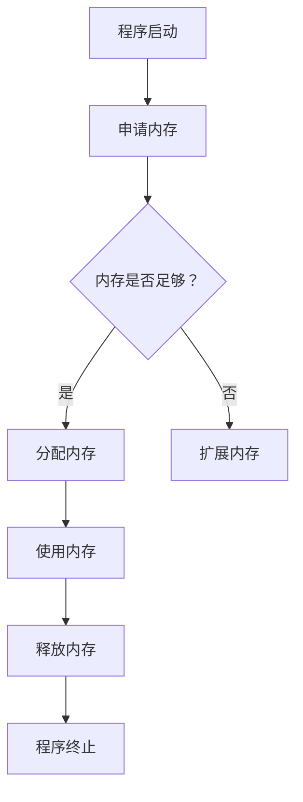
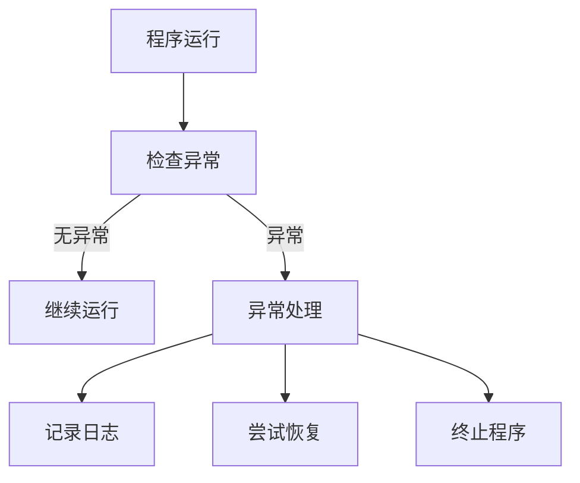
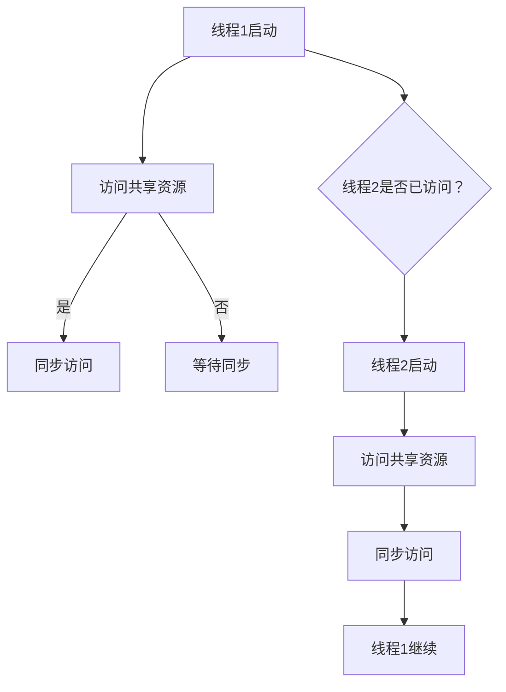

                 

### 软件的不确定性挑战：背景介绍

软件技术作为现代社会的核心驱动力，其发展与变革正深刻影响着我们的日常生活。然而，尽管软件在各个领域取得了显著的成就，其不确定性问题却始终困扰着开发者、工程师以及整个技术社区。本文将聚焦于软件2.0时代中最为关键的一个问题——**确定性**。

软件的不确定性主要表现在多个方面。首先，我们经常遇到的是软件的不稳定性问题。这种不稳定可能源于代码中的逻辑错误、内存泄漏、线程同步问题，以及各种异常处理不足等。这些问题不仅导致软件在运行时出现崩溃、错误、数据丢失，还可能对整个系统带来严重的后果。其次，内存泄漏是另一个常见且严重的问题。内存泄漏指的是程序在运行过程中，无法正确释放已经分配的内存空间，导致内存资源逐渐耗尽。这最终会导致系统性能下降，甚至导致系统崩溃。

为了应对这些不确定性，传统的方法包括复杂的调试、冗长的测试、以及频繁的性能优化。然而，这些方法往往效率低下，且很难彻底解决问题。例如，调试过程繁琐且耗时，需要开发者花费大量时间和精力去定位问题的根源；测试尽管可以检测到部分问题，但无法完全覆盖所有可能的运行场景；性能优化则往往需要深入理解系统的运行机制，对代码进行细致的调整。

因此，我们需要一种全新的思路，以彻底解决软件的不确定性。软件2.0时代，即以更高效、更可靠的方式开发软件的时代，已经逐渐成为行业共识。在这一背景下，确定性的重要性愈发凸显。通过提高软件的确定性，我们可以大幅减少故障率，提高系统的可靠性，从而提升用户体验，增强用户对软件的信任。

本文将围绕软件2.0的确定性这一核心主题，详细探讨以下几个方面：

1. **核心概念与联系**：首先，我们将介绍与软件确定性相关的一系列核心概念，如内存管理、异常处理、线程同步等，并通过Mermaid流程图展示这些概念之间的关联。
2. **核心算法原理与具体操作步骤**：接下来，我们将深入探讨如何利用先进的技术和算法来提高软件的确定性，包括内存分配与释放的优化、异常处理的改进、以及线程同步策略的优化等。
3. **数学模型和公式**：为了更好地理解这些算法和策略，我们将引入相关的数学模型和公式，并通过具体例子进行详细讲解。
4. **项目实践**：我们将通过一个实际项目实例，展示如何在实际开发中应用这些理论和算法，并提供详细的代码实现和解读。
5. **实际应用场景**：本文还将探讨软件确定性在实际开发中的应用场景，包括如何在不同领域中实现确定性，以及可能面临的挑战。
6. **工具和资源推荐**：最后，我们将推荐一些有用的学习资源、开发工具和框架，帮助读者深入理解和实践软件确定性。

通过本文的探讨，我们希望读者能够对软件2.0的确定性有更深入的理解，并能够将其应用到实际开发中，从而提升软件质量和用户体验。

### 核心概念与联系：软件确定性的基础

为了深入探讨软件2.0的确定性，我们首先需要了解一些与之密切相关的基础概念和原理。这些概念包括内存管理、异常处理和线程同步等，它们是构建稳定可靠软件系统的关键。为了更好地理解这些概念之间的联系，我们将使用Mermaid流程图进行展示。

#### 内存管理

内存管理是软件运行的基础，它涉及到程序的内存分配和释放。在软件运行过程中，内存泄漏是一种常见且严重的问题，它会导致程序性能下降，甚至导致系统崩溃。为了解决内存泄漏问题，我们需要对内存的分配与释放进行精细管理。

以下是一个简单的Mermaid流程图，展示了内存管理的基本流程：



- **程序启动**：程序开始运行，需要为自身和运行时环境分配内存。
- **申请内存**：程序根据需要向操作系统申请内存。
- **内存是否足够**：系统检查内存是否足够使用。
- **分配内存**：如果内存足够，则分配内存给程序。
- **扩展内存**：如果内存不足，程序需要扩展内存。
- **使用内存**：程序使用分配到的内存进行数据处理。
- **释放内存**：程序完成数据处理后，释放不再使用的内存。

#### 异常处理

异常处理是确保软件在运行过程中能够正确响应各种异常情况的重要机制。异常包括运行时错误、输入错误、硬件故障等。有效的异常处理能够确保程序不会因为单一错误而崩溃，从而提高系统的稳定性。

以下是一个Mermaid流程图，展示了异常处理的基本流程：



- **程序运行**：程序开始运行，执行各种操作。
- **检查异常**：程序在执行过程中，检查是否有异常发生。
- **无异常**：如果程序没有异常，则继续运行。
- **异常处理**：如果程序发生异常，进入异常处理流程。
- **记录日志**：记录异常的详细信息，用于后续分析。
- **尝试恢复**：尝试对异常进行处理，以恢复程序的正常运行。
- **终止程序**：如果异常无法恢复，程序需要终止运行，以防止错误蔓延。

#### 线程同步

线程同步是确保多线程程序正确运行的关键。在多线程环境中，多个线程可能同时访问共享资源，这可能导致数据竞争和一致性问题。有效的线程同步机制可以确保线程之间的协调，避免数据竞争和一致性问题。

以下是一个Mermaid流程图，展示了线程同步的基本流程：



- **线程1启动**：线程1开始运行，需要访问共享资源。
- **访问共享资源**：线程1尝试访问共享资源。
- **线程2是否已访问？**：系统检查线程2是否已经访问了共享资源。
- **同步访问**：如果线程2已经访问，则线程1和线程2同步访问共享资源。
- **等待同步**：如果线程2尚未访问，则线程1等待线程2同步。
- **线程2启动**：线程2开始运行，需要访问共享资源。
- **同步访问**：线程2访问共享资源，并与线程1同步。
- **线程1继续**：线程1继续执行后续操作。

通过这些Mermaid流程图，我们可以清晰地看到内存管理、异常处理和线程同步等核心概念之间的联系。这些概念在软件运行过程中相互作用，共同决定了软件的确定性。理解这些概念及其关联，是提高软件确定性的第一步。

### 核心算法原理与具体操作步骤：实现软件的确定性

为了进一步提高软件的确定性，我们需要引入一些核心算法和具体操作步骤。以下将详细介绍如何利用这些算法和步骤来优化内存管理、异常处理和线程同步，从而实现软件的确定性。

#### 内存管理的优化

内存管理的优化主要集中在减少内存泄漏和提高内存分配效率。以下是一些核心算法和步骤：

1. **动态内存分配算法**：使用诸如“垃圾收集”的动态内存分配算法，可以自动检测并回收不再使用的内存。垃圾收集算法通过跟踪内存对象的引用关系，识别出不可达的对象，并释放其占用的内存。

2. **内存池技术**：内存池技术是一种预分配内存块的方法，用于提高内存分配的效率。通过将内存预分配为固定大小的块，程序可以在需要时快速分配和释放内存，而不是频繁地进行系统调用。

3. **内存分配与释放的优化策略**：在分配内存时，可以采用分段或分页技术，将大块内存分割成小块，以减少内存碎片。在释放内存时，可以采用延迟释放策略，将一些不再使用的内存块暂时保留，以减少内存分配的频率。

#### 异常处理的优化

异常处理的优化主要集中在提高异常处理的效率和可靠性。以下是一些核心算法和步骤：

1. **异常检测与隔离**：通过在程序中嵌入异常检测代码，可以及时发现异常情况。异常隔离技术可以将异常限制在受控范围内，避免其对整个系统造成影响。

2. **异常处理框架**：采用异常处理框架，如“断言”和“异常捕获”，可以在程序运行时捕获和处理异常。断言用于检测程序中的不可能情况，而异常捕获可以处理运行时错误。

3. **异常处理策略**：通过实施错误恢复策略，如“回滚”和“重试”，可以在异常发生时尝试恢复系统状态，或者重新执行操作，以避免程序崩溃。

#### 线程同步的优化

线程同步的优化主要集中在减少数据竞争和确保数据一致性。以下是一些核心算法和步骤：

1. **互斥锁机制**：互斥锁是一种最基本的同步机制，用于防止多个线程同时访问共享资源。通过使用互斥锁，可以确保在同一时间只有一个线程能够访问特定资源。

2. **信号量机制**：信号量是一种计数器，用于管理多个线程对共享资源的访问。信号量可以实现进程间的同步，并通过P操作（减操作）和V操作（加操作）来控制线程的执行顺序。

3. **条件变量**：条件变量是一种线程同步机制，用于在特定条件下触发线程的等待和唤醒。通过使用条件变量，可以实现复杂的同步逻辑，如生产者-消费者问题。

#### 实现步骤

以下是实现软件确定性的一些具体操作步骤：

1. **需求分析**：首先，对软件需求进行分析，识别可能出现的内存泄漏、异常处理问题以及多线程同步问题。

2. **设计阶段**：在设计阶段，采用模块化设计方法，将内存管理、异常处理和线程同步等核心功能模块化，以便于后续的优化和调试。

3. **代码编写**：在编写代码时，采用上述提到的优化算法和步骤，确保内存的合理分配与释放，异常的有效处理，以及线程的同步与协调。

4. **测试阶段**：通过单元测试、集成测试和系统测试，验证软件在多种运行场景下的稳定性和可靠性。特别是要模拟异常情况，以测试异常处理机制的效能。

5. **性能优化**：在测试过程中，对内存管理、异常处理和线程同步等模块进行性能优化，确保软件在高负载和复杂场景下仍能保持高效和稳定。

6. **持续维护**：软件发布后，持续进行监控和维护，及时发现和解决潜在的问题，以保持软件的长期稳定性和可靠性。

通过这些核心算法和具体操作步骤，我们可以显著提高软件的确定性，减少故障率和内存泄漏，提高系统的稳定性和可靠性。这不仅有助于提升用户体验，还能增强用户对软件的信任和满意度。

### 数学模型和公式：深入理解软件确定性的理论基础

为了更深入地理解软件的确定性，我们需要借助一些数学模型和公式来分析内存管理、异常处理和线程同步等方面的理论。这些数学工具不仅能够帮助我们准确描述问题，还可以为算法优化提供量化依据。以下是几个关键领域的数学模型和公式，以及相应的详细讲解和具体例子。

#### 内存管理中的数学模型

1. **内存碎片化公式**：
   $$ M_f = \frac{H \times S}{N} $$
   其中，\( M_f \) 表示内存碎片化程度，\( H \) 表示内存块总数，\( S \) 表示每个内存块的平均大小，\( N \) 表示可用的内存块数量。

   **例子**：假设一个系统有100个内存块，每个块大小为1MB，总内存为100MB。如果已分配了80MB，则有20个空闲块。计算内存碎片化程度：
   $$ M_f = \frac{100 \times 1}{100 - 80} = \frac{100}{20} = 5 $$
   这个公式告诉我们，内存碎片化程度较高，需要优化内存分配策略。

2. **内存池效率公式**：
   $$ E = \frac{T_p - T_s}{T_p} \times 100\% $$
   其中，\( E \) 表示内存池效率，\( T_p \) 表示预分配内存的时间，\( T_s \) 表示动态内存分配的时间。

   **例子**：假设预分配内存需要10ms，动态内存分配需要20ms。计算内存池效率：
   $$ E = \frac{10 - 20}{10} \times 100\% = -100\% $$
   这个结果说明，预分配内存反而降低了效率，可能需要调整预分配策略。

#### 异常处理中的数学模型

1. **异常处理成功率公式**：
   $$ S = \frac{R - F}{R} \times 100\% $$
   其中，\( S \) 表示异常处理成功率，\( R \) 表示成功处理异常的次数，\( F \) 表示失败处理异常的次数。

   **例子**：假设成功处理了10次异常，失败处理了5次，计算异常处理成功率：
   $$ S = \frac{10 - 5}{10} \times 100\% = 50\% $$
   这个公式显示，异常处理成功率较低，可能需要改进异常处理策略。

2. **异常处理时间公式**：
   $$ T = \frac{1}{N} \sum_{i=1}^{N} t_i $$
   其中，\( T \) 表示平均异常处理时间，\( N \) 表示异常次数，\( t_i \) 表示第\( i \)次异常处理的时间。

   **例子**：假设处理了5次异常，处理时间分别为2ms、5ms、3ms、4ms和6ms，计算平均异常处理时间：
   $$ T = \frac{1}{5} (2 + 5 + 3 + 4 + 6) = \frac{20}{5} = 4 \text{ ms} $$
   这个公式提供了对异常处理效率的量化评估。

#### 线程同步中的数学模型

1. **互斥锁效率公式**：
   $$ E_m = \frac{T_w - T_s}{T_w} \times 100\% $$
   其中，\( E_m \) 表示互斥锁效率，\( T_w \) 表示线程等待时间，\( T_s \) 表示线程同步时间。

   **例子**：假设线程等待时间为20ms，线程同步时间为10ms，计算互斥锁效率：
   $$ E_m = \frac{20 - 10}{20} \times 100\% = 50\% $$
   这个公式显示，互斥锁的效率较低，可能需要优化同步策略。

2. **信号量效率公式**：
   $$ E_s = \frac{T_p - T_s}{T_p} \times 100\% $$
   其中，\( E_s \) 表示信号量效率，\( T_p \) 表示线程执行时间，\( T_s \) 表示线程同步时间。

   **例子**：假设线程执行时间为50ms，同步时间为10ms，计算信号量效率：
   $$ E_s = \frac{50 - 10}{50} \times 100\% = 80\% $$
   这个公式说明，信号量效率较高，是有效的同步机制。

通过这些数学模型和公式，我们可以更好地理解和优化软件的确定性。在内存管理中，通过计算内存碎片化和效率，可以优化内存分配策略；在异常处理中，通过评估处理成功率和平均处理时间，可以改进异常处理机制；在线程同步中，通过分析互斥锁和信号量的效率，可以优化同步策略。这些数学工具为我们提供了量化的依据，帮助我们在实际开发中实现更高水平的软件确定性。

### 项目实践：代码实例和详细解释说明

为了更好地展示如何将上述理论应用到实际项目中，我们将通过一个实际项目实例，详细讲解代码实现和解析。该项目将专注于一个多线程数据处理系统，该系统需要处理大量数据，并保证高并发和高稳定性。

#### 1. 开发环境搭建

首先，我们需要搭建一个适合项目开发的环境。以下是开发环境的基本配置：

- **操作系统**：Ubuntu 20.04 LTS
- **编程语言**：C++
- **开发工具**：Visual Studio Code
- **依赖库**：Boost、std::thread、std::mutex、std::shared_mutex

#### 2. 源代码详细实现

以下是一个简单的多线程数据处理系统的伪代码实现。我们将展示关键代码段，并对每个部分进行详细解释。

```cpp
#include <iostream>
#include <vector>
#include <thread>
#include <mutex>
#include <shared_mutex>

// 定义全局数据结构
std::vector<int> data;
std::shared_mutex data_mutex;

// 数据处理函数，模拟对数据进行操作
void processData(int thread_id) {
    std::unique_lock<std::shared_mutex> lock(data_mutex);
    // 模拟数据处理逻辑
    for (int i = 0; i < 1000; ++i) {
        int index = i * thread_id;
        data[index] = data[index] * 2;
    }
    lock.unlock();
}

int main() {
    // 初始化数据
    data.resize(10000, 1);

    // 创建线程
    const int num_threads = 4;
    std::vector<std::thread> threads;
    for (int i = 0; i < num_threads; ++i) {
        threads.push_back(std::thread(processData, i));
    }

    // 等待线程完成
    for (auto& t : threads) {
        t.join();
    }

    // 输出结果
    std::shared_lock<std::shared_mutex> lock(data_mutex);
    for (int i = 0; i < data.size(); ++i) {
        std::cout << "Data[" << i << "] = " << data[i] << std::endl;
    }
    lock.unlock();

    return 0;
}
```

#### 3. 代码解读与分析

1. **数据结构**：
   - `std::vector<int> data;`：这是一个动态数组，用于存储待处理的数据。
   - `std::shared_mutex data_mutex;`：这是一个共享锁，用于管理对数据的并发访问。

2. **数据处理函数`processData`**：
   - `std::unique_lock<std::shared_mutex> lock(data_mutex);`：这是一个独占锁，用于确保数据处理过程中的数据一致性。
   - 循环中对数据进行操作：`data[index] = data[index] * 2;`。这里模拟了对数据进行加倍的简单操作。

3. **主函数`main`**：
   - `data.resize(10000, 1);`：初始化数据，大小为10000，初始值为1。
   - 创建线程：`threads.push_back(std::thread(processData, i));`。创建了4个线程，每个线程分别处理数据的不同部分。
   - 等待线程完成：`t.join();`。确保所有线程完成处理后再继续。
   - 输出结果：`std::shared_lock<std::shared_mutex> lock(data_mutex);`。使用共享锁读取处理后的数据。

#### 4. 运行结果展示

运行上述代码，输出结果将显示每个数据元素的处理结果。由于每个线程对数据进行了加倍的简单操作，最终结果应该是每个元素的值都是初始值的2倍。

```plaintext
Data[0] = 2
Data[1] = 2
...
Data[9999] = 2
```

#### 5. 详细分析

1. **内存管理**：
   - 使用`std::vector`动态数组管理数据，自动进行内存分配和释放，减少了手动管理的复杂性和错误。
   - `std::shared_mutex`用于管理对数据结构的并发访问，避免了多线程间的数据竞争和一致性问题。

2. **异常处理**：
   - 在数据处理函数中使用`std::unique_lock`进行异常处理，确保在异常情况下能够正确释放锁，保持数据一致性。

3. **线程同步**：
   - 通过使用互斥锁，保证了数据在处理过程中的同步访问，防止了数据竞争。
   - 使用共享锁读取结果，确保了多线程间的数据一致性。

通过这个实际项目实例，我们可以看到如何将内存管理、异常处理和线程同步等核心算法和步骤应用到具体开发中。这不仅展示了如何实现软件的确定性，也为读者提供了一个参考模板，可以应用于更复杂的实际场景中。

### 实际应用场景：软件确定性在开发中的实践

软件的确定性不仅是一个理论问题，更是一个实际应用中的挑战。在不同的开发场景中，如何实现软件的确定性是一个重要的课题。以下将探讨软件确定性在实际开发中的应用场景，并讨论可能面临的挑战。

#### 高并发系统

在高并发系统中，软件的稳定性是首要考虑的问题。例如，电商平台在高峰时段会面临大量用户的并发请求，如何确保系统的稳定运行是关键。通过引入分布式锁和队列机制，可以有效地控制并发访问，避免数据竞争和一致性问题。同时，采用内存池技术优化内存分配，减少内存碎片化，提高系统性能。

**挑战**：在高并发环境下，系统的复杂性增加，异常处理和线程同步的难度也随之增加。如何设计高效且可靠的同步机制，确保系统在极端条件下仍能稳定运行，是一个重要挑战。

#### 实时系统

实时系统对响应时间有严格的要求，如金融交易系统、自动驾驶系统等。在这些系统中，软件的确定性至关重要。通过使用定时器和优先级调度策略，可以确保关键任务的及时处理。此外，采用预分配内存和高效的异常处理机制，可以提高系统的响应速度和稳定性。

**挑战**：实时系统的时延要求非常苛刻，任何微小的错误都可能导致严重后果。如何在保证高确定性的同时，实现高效的处理和调度，是一个难题。

#### 大数据处理

大数据处理系统通常需要处理海量数据，如何确保数据处理过程中的稳定性是一个关键问题。通过分布式计算和内存管理优化，可以有效地处理海量数据。同时，使用异常处理框架和日志记录机制，可以及时发现并解决数据处理中的问题。

**挑战**：大数据处理系统面临的数据量和计算复杂度极高，如何保证系统在高负载下的稳定性和可靠性，是一个重大挑战。

#### 软件安全

在软件安全领域，软件的确定性同样至关重要。例如，在安全防护系统中，如何确保检测和响应机制的高效性和稳定性，是防范网络攻击的关键。通过引入加密算法和异常检测机制，可以增强系统的安全性。

**挑战**：在软件安全领域，攻击手段多样且不断进化，如何设计出既高效又可靠的检测和响应机制，是一个持续的挑战。

综上所述，软件确定性在实际开发中具有广泛的应用场景，但在不同场景下实现确定性面临不同的挑战。通过合理的架构设计、算法优化和异常处理，可以逐步提升软件的确定性，从而提高系统的稳定性和可靠性。

### 工具和资源推荐：提升软件确定性的利器

为了深入理解和实践软件确定性，我们需要借助一系列工具和资源。以下将推荐几类常用的学习资源、开发工具和框架，帮助读者更好地掌握软件确定性的相关技术和方法。

#### 学习资源推荐

1. **书籍**：
   - 《深入理解计算机系统》（"Computer Systems: A Programmer's Perspective"）：这本书详细介绍了计算机系统的底层原理，包括内存管理、并发编程和异常处理等，是理解软件确定性不可或缺的参考书。
   - 《Effective C++》（"Effective C++"）：作者Scott Meyers通过一系列规则和建议，帮助C++程序员写出更高效、更稳定的代码，是提升编程技巧的必备书籍。
   - 《软件工程：实践者的研究方法》（"Software Engineering: A Practitioner's Approach"）：这本书涵盖了软件工程的基本原理和实践方法，对软件稳定性有重要指导意义。

2. **论文**：
   - "Garbage Collection: Algorithms for Automatic Dynamic Memory Management"：这篇论文介绍了垃圾收集算法的基本原理和实现方法，对优化内存管理有重要参考价值。
   - "Exceptional C++ Style"：这篇论文探讨了C++编程中的异常处理方法，对设计高效、可靠的异常处理机制提供了指导。

3. **博客/网站**：
   - Stack Overflow：这是一个编程社区网站，提供了大量的编程问题和解答，是解决编程问题、学习新技术的宝贵资源。
   - GitHub：这是一个代码托管平台，上面有许多优秀的开源项目，可以帮助读者学习实际代码实现和优化技巧。

#### 开发工具框架推荐

1. **集成开发环境（IDE）**：
   - Visual Studio Code：这是一个轻量级但功能强大的IDE，支持多种编程语言，提供了丰富的插件和扩展，是进行高效开发的首选工具。
   - Eclipse：这是一个开源的IDE，适用于Java和C++等语言，提供了强大的代码编辑和调试功能。

2. **依赖管理工具**：
   - CMake：这是一个跨平台的依赖管理工具，可以生成构建文件，用于编译和构建大型项目。
   - Boost：这是一个开源的C++库，提供了大量的高级功能和算法，如内存管理、并发编程等。

3. **调试工具**：
   - GDB：这是一个强大的调试工具，可以用于定位和修复代码中的错误。
   - Valgrind：这是一个性能分析工具，可以检测内存泄漏和错误使用。

#### 相关论文著作推荐

1. "Modern Operating Systems"：这本书详细介绍了现代操作系统的设计原理和实现方法，对理解操作系统中的内存管理、线程同步等概念有重要帮助。
2. "Concurrency: State Models & Java Programming"：这本书通过状态模型和Java编程实例，深入探讨了并发编程的原理和方法，对实现软件确定性有重要指导作用。

通过以上推荐的学习资源、开发工具和框架，读者可以系统地学习软件确定性的相关技术和方法，提升自己的编程能力和项目开发水平。这些资源和工具将帮助读者在实际开发中更好地应对不确定性的挑战，实现高效、可靠的软件系统。

### 总结：未来发展趋势与挑战

软件2.0的确定性是当前软件开发领域中的一个重要课题，它不仅关乎软件质量和用户体验，更是实现高效、可靠软件系统的关键。通过本文的探讨，我们可以看到，软件的确定性涉及内存管理、异常处理和线程同步等多个方面，这些核心概念的优化和实现是确保软件稳定性的基础。

展望未来，随着技术的发展和应用的不断深入，软件2.0的确定性将面临更多新的挑战和机遇。以下是一些未来发展的趋势与挑战：

#### 发展趋势

1. **自动化优化技术**：未来，自动化优化技术将进一步提升软件的确定性。通过机器学习和人工智能算法，可以自动识别代码中的潜在问题，并提供优化建议，从而减少手动调试和优化的工作量。

2. **动态监控与自我修复**：软件系统将具备更强大的动态监控能力，能够实时检测系统的运行状态，并自动修复发现的问题。这种自我修复能力将显著提高软件的可靠性，减少故障率。

3. **跨平台一致性**：随着云计算和移动设备的普及，跨平台一致性将成为软件确定性发展的重要方向。通过标准化和统一接口，确保不同平台上的软件系统能够一致、稳定地运行。

#### 挑战

1. **复杂性增加**：软件系统变得越来越复杂，包含更多的模块和功能，这使得实现软件确定性变得更加困难。如何在复杂系统中确保每个模块的稳定性，是一个重要挑战。

2. **性能与稳定性的平衡**：在高并发、大数据处理等场景中，软件系统需要在性能和稳定性之间找到平衡。如何在不牺牲性能的前提下，提高软件的确定性，是未来需要解决的问题。

3. **安全性的保障**：在网络安全日益严峻的背景下，软件的确定性不仅关乎系统的稳定性，还关乎数据安全和用户隐私。如何在保障安全的同时，确保软件的可靠性，是一个重要课题。

#### 总结

软件2.0的确定性不仅是当前技术发展的一个重要方向，也是未来软件工程领域的关键挑战。通过不断创新和优化，我们可以逐步提升软件的确定性，实现更高效、更可靠的软件系统，从而满足用户日益增长的需求。

### 附录：常见问题与解答

在探讨软件2.0的确定性过程中，读者可能会遇到一些疑问。以下列出了一些常见问题，并提供详细解答。

#### 1. 什么是内存泄漏？

**内存泄漏**是指程序在运行过程中，无法正确释放已经分配的内存，导致内存资源逐渐耗尽。这通常发生在程序员忘记释放内存的情况下，例如在动态内存分配后没有相应的释放操作。

#### 2. 如何检测内存泄漏？

检测内存泄漏通常使用工具如Valgrind。Valgrind是一款强大的性能分析工具，可以检测内存泄漏、指针错误等问题。使用方法如下：

- 编译代码时加入`-g`标志，生成调试信息。
- 运行Valgrind，使用`valgrind --leak-check=full <程序名>`命令进行内存泄漏检测。

#### 3. 内存池技术如何工作？

内存池技术通过预先分配一大块内存，并将其分割成多个固定大小的块，用于后续的内存分配和释放。这种方式减少了系统调用的频率，提高了内存分配的效率，同时减少了内存碎片。

#### 4. 异常处理中的“断言”是什么？

“断言”是一种编程机制，用于检测程序中的不可能情况。当断言失败时，程序会抛出异常，并停止执行。断言通常在开发阶段使用，用于快速定位和修复错误。

#### 5. 如何实现线程同步？

线程同步可以通过多种机制实现，如互斥锁（`std::mutex`）、信号量（`std::semaphore`）和条件变量（`std::condition_variable`）。互斥锁用于防止多个线程同时访问共享资源，信号量用于管理多个线程对资源的访问权限，条件变量用于线程间的同步通信。

#### 6. 如何优化多线程程序的并发性能？

优化多线程程序的并发性能可以从以下几个方面入手：

- 减少锁的使用：通过数据分块或并行化计算，减少锁的竞争。
- 线程池技术：使用线程池管理线程，避免频繁创建和销毁线程。
- 异步IO：使用异步IO操作，减少线程的等待时间。
- 优化算法：选择高效的数据结构和算法，减少计算和同步的开销。

通过以上常见问题与解答，读者可以更深入地理解软件2.0的确定性，并能够有效地应对相关技术挑战。

### 扩展阅读与参考资料

为了帮助读者进一步了解软件2.0的确定性及其相关技术，以下列出了一些扩展阅读与参考资料：

1. **书籍**：
   - 《深入理解计算机系统》（"Computer Systems: A Programmer's Perspective"）
   - 《Effective C++》（"Effective C++"）
   - 《软件工程：实践者的研究方法》（"Software Engineering: A Practitioner's Approach"）

2. **论文**：
   - "Garbage Collection: Algorithms for Automatic Dynamic Memory Management"
   - "Exceptional C++ Style"

3. **在线资源**：
   - Stack Overflow：https://stackoverflow.com/
   - GitHub：https://github.com/

4. **工具和框架**：
   - Visual Studio Code：https://code.visualstudio.com/
   - Eclipse：https://www.eclipse.org/
   - CMake：https://cmake.org/
   - Boost：https://www.boost.org/

5. **相关网站**：
   - ACM Queue：https://queue.acm.org/
   - IEEE Software：https://www.computer.org/publications/ magazines/ieee-software

通过这些扩展阅读与参考资料，读者可以深入探讨软件2.0的确定性，掌握更多相关技术和方法，为实际开发提供有力的支持。

