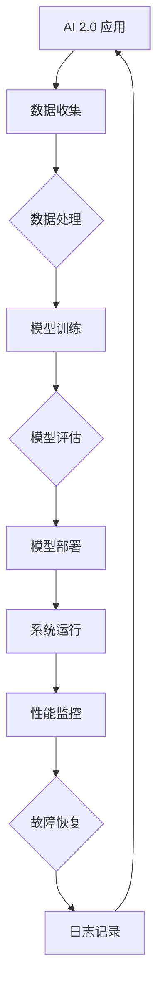

                 

### 文章标题

软件框架：支持 AI 2.0 应用的开发、部署和运维

> 关键词：软件框架、AI 2.0、开发、部署、运维

> 摘要：本文深入探讨了软件框架在 AI 2.0 应用的开发、部署和运维中的重要性。首先介绍了软件框架的基本概念，然后详细阐述了如何利用软件框架支持 AI 2.0 的开发，接下来分析了 AI 2.0 应用部署和运维中的关键技术和挑战，最后提出了未来发展的趋势和面临的挑战。

## 1. 背景介绍

在过去的几十年里，人工智能（AI）经历了从简单的规则系统到复杂的学习算法的演变。特别是在深度学习、神经网络和大数据分析等技术的推动下，AI 技术取得了显著的进展。AI 2.0 作为新一代人工智能的代表，其核心特点在于自适应、自组织和自进化。与传统 AI 相比，AI 2.0 更加强调数据驱动的智能学习和智能决策。

随着 AI 2.0 的快速发展，其应用场景也日益丰富。从自动驾驶、智能医疗到智能家居，AI 2.0 正在深刻改变我们的生活方式。然而，AI 2.0 应用的开发、部署和运维面临着一系列挑战。首先，AI 2.0 应用通常涉及海量的数据和高并发访问，这对系统的性能和稳定性提出了高要求。其次，AI 2.0 应用的开发和运维涉及到多个学科和领域，需要高效协同和统一管理。此外，AI 2.0 应用的部署和运维还需要考虑可扩展性、可维护性和可复用性。

为了应对这些挑战，软件框架成为了一个重要的解决方案。软件框架提供了一种结构化的开发、部署和运维模式，可以帮助开发人员高效地构建和运营 AI 2.0 应用。通过使用软件框架，开发人员可以专注于业务逻辑的实现，而无需过多关注底层系统的细节。同时，软件框架还提供了一系列的工具和服务，如自动化部署、监控和故障恢复等，从而简化了 AI 2.0 应用的运维过程。

本文旨在探讨软件框架在 AI 2.0 应用中的重要性，详细阐述如何利用软件框架支持 AI 2.0 的开发、部署和运维，并提供一些建议和资源，以帮助读者更好地理解和应用软件框架。

## 2. 核心概念与联系

### 2.1 软件框架的基本概念

软件框架（Software Framework）是一种用于构建软件的半成品结构，它定义了软件的总体结构和运行时环境，并提供了一系列的组件和接口，使得开发者可以更加高效地实现软件功能。软件框架通常包含以下核心组成部分：

- **基础结构**：提供底层系统服务，如内存管理、线程管理、网络通信等。
- **核心库**：提供常用的函数库和工具类，如日志记录、数据解析、加密解密等。
- **组件接口**：定义系统中的组件如何交互，以及组件与用户界面、数据存储等外部系统的接口。
- **配置管理**：管理系统的配置文件，如运行参数、环境变量等。

### 2.2 AI 2.0 的基本概念

AI 2.0 是指新一代人工智能，其核心特点是自适应、自组织和自进化。与传统 AI 相比，AI 2.0 具有更强的自我学习和智能决策能力，能够在不断变化的环境中自主调整和优化自身行为。AI 2.0 的主要特征包括：

- **数据驱动**：通过大量数据的学习和分析，实现智能决策和智能行为。
- **自适应**：系统能够根据环境变化和用户反馈，自动调整参数和行为。
- **自组织**：系统能够在没有外部干预的情况下，自我组织、自我学习和自我进化。
- **高并发处理**：能够同时处理海量数据和高并发访问。

### 2.3 软件框架与 AI 2.0 的关系

软件框架与 AI 2.0 的关系主要体现在以下几个方面：

- **开发效率**：软件框架提供了一套标准化的开发模式，使得开发者可以快速构建和部署 AI 2.0 应用，从而提高开发效率。
- **协同工作**：软件框架提供了统一的接口和组件，使得不同领域的开发人员可以更加高效地协同工作，共同推进 AI 2.0 应用的开发。
- **系统维护**：软件框架提供了自动化部署、监控和故障恢复等功能，简化了 AI 2.0 应用的运维过程，降低了系统维护的难度。

### 2.4 Mermaid 流程图

为了更好地展示软件框架与 AI 2.0 之间的关系，我们可以使用 Mermaid 流程图来描述。以下是软件框架支持 AI 2.0 应用的基本流程：



在这个流程图中，A 表示 AI 2.0 应用，B 表示数据收集，C 表示数据处理，D 表示模型训练，E 表示模型评估，F 表示模型部署，G 表示系统运行，H 表示性能监控，I 表示故障恢复，J 表示日志记录。通过这个流程图，我们可以清晰地看到软件框架在 AI 2.0 应用开发、部署和运维中的关键作用。

## 3. 核心算法原理 & 具体操作步骤

### 3.1 核心算法原理

在 AI 2.0 应用中，核心算法通常包括数据预处理、特征提取、模型训练、模型评估和模型部署等环节。以下是这些核心算法的基本原理：

- **数据预处理**：通过清洗、去重、归一化等操作，将原始数据转化为适合模型训练的格式。
- **特征提取**：从数据中提取出对模型训练有帮助的特征，以提高模型的准确性和效率。
- **模型训练**：使用训练数据对模型进行训练，通过优化算法调整模型的参数，使其能够更好地拟合训练数据。
- **模型评估**：使用测试数据对训练好的模型进行评估，以验证模型的泛化能力和性能。
- **模型部署**：将训练好的模型部署到实际应用环境中，进行实时预测和决策。

### 3.2 具体操作步骤

以下是一个基于软件框架的 AI 2.0 应用开发的基本操作步骤：

1. **需求分析**：明确 AI 2.0 应用的业务需求和技术需求，确定数据来源、数据格式、模型类型等关键参数。
2. **数据收集**：通过数据接口从各个数据源收集原始数据，并进行数据预处理。
3. **特征提取**：根据业务需求，从原始数据中提取出对模型训练有帮助的特征。
4. **模型训练**：使用训练数据对模型进行训练，通过优化算法调整模型的参数。
5. **模型评估**：使用测试数据对训练好的模型进行评估，以验证模型的泛化能力和性能。
6. **模型部署**：将训练好的模型部署到实际应用环境中，进行实时预测和决策。
7. **性能监控**：监控系统运行状态，实时收集性能指标，以便进行故障恢复和优化调整。
8. **故障恢复**：在系统出现故障时，自动执行故障恢复流程，确保系统的正常运行。

### 3.3 实际案例

以下是一个基于 TensorFlow 和 Flask 的 AI 2.0 应用开发案例：

**1. 需求分析**：开发一个基于图像识别的 AI 2.0 应用，用于识别和分类用户上传的图片。

**2. 数据收集**：从公开的数据集（如 ImageNet）中收集图像数据，并进行数据预处理。

**3. 特征提取**：使用卷积神经网络（CNN）对图像进行特征提取。

**4. 模型训练**：使用 TensorFlow 对 CNN 模型进行训练，调整模型参数，提高模型的准确率。

**5. 模型评估**：使用测试数据对训练好的模型进行评估，验证模型的泛化能力和性能。

**6. 模型部署**：使用 Flask 搭建 Web 应用程序，将训练好的模型部署到线上环境，供用户使用。

**7. 性能监控**：使用 Flask 提供的日志功能，实时监控系统的运行状态和性能指标。

**8. 故障恢复**：在系统出现故障时，自动重启 Flask Web 应用程序，确保系统的正常运行。

通过这个案例，我们可以看到软件框架在 AI 2.0 应用开发中的重要作用，以及如何利用软件框架实现高效开发和运维。

## 4. 数学模型和公式 & 详细讲解 & 举例说明

### 4.1 数学模型和公式

在 AI 2.0 应用中，数学模型和公式是核心组成部分。以下是一些常见的数学模型和公式：

- **卷积神经网络（CNN）**：CNN 是一种用于图像识别和处理的深度学习模型，其基本公式如下：

  $$ f(x) = \text{ReLU}(W \cdot x + b) $$

  其中，\( f(x) \) 表示输出特征，\( W \) 表示权重矩阵，\( x \) 表示输入特征，\( b \) 表示偏置项，\(\text{ReLU}\) 表示ReLU激活函数。

- **循环神经网络（RNN）**：RNN 是一种用于序列数据处理的深度学习模型，其基本公式如下：

  $$ h_t = \text{ReLU}(W_h \cdot h_{t-1} + W_x \cdot x_t + b) $$

  其中，\( h_t \) 表示第 \( t \) 个时间步的隐藏状态，\( W_h \) 表示隐藏状态权重矩阵，\( W_x \) 表示输入状态权重矩阵，\( x_t \) 表示第 \( t \) 个时间步的输入，\( b \) 表示偏置项。

- **生成对抗网络（GAN）**：GAN 是一种用于生成数据的深度学习模型，其基本公式如下：

  $$ D(x) = \sigma(W_D \cdot [x; z] + b) $$
  $$ G(z) = \sigma(W_G \cdot z + b) $$

  其中，\( D(x) \) 表示判别器，\( G(z) \) 表示生成器，\( x \) 表示真实数据，\( z \) 表示随机噪声，\( W_D \) 和 \( W_G \) 分别表示判别器和生成器的权重矩阵，\( b \) 表示偏置项，\( \sigma \) 表示sigmoid激活函数。

### 4.2 详细讲解

以下是对上述数学模型和公式的详细讲解：

- **卷积神经网络（CNN）**：CNN 通过卷积操作提取图像的特征，具有局部连接和共享权重等特性。ReLU激活函数用于增加网络的非线性能力，偏置项用于引入偏置项，从而调整网络输出。

- **循环神经网络（RNN）**：RNN 通过递归结构处理序列数据，能够捕捉时间序列中的长期依赖关系。ReLU激活函数用于增加网络的非线性能力，偏置项用于引入偏置项，从而调整网络输出。

- **生成对抗网络（GAN）**：GAN 由判别器和生成器组成，判别器用于区分真实数据和生成数据，生成器用于生成与真实数据相似的数据。sigmoid激活函数用于将输出映射到 \([0, 1]\) 范围内，从而实现二分类。

### 4.3 举例说明

以下是一个基于卷积神经网络（CNN）的图像识别案例：

假设我们有一个 32x32 的图像数据集，使用 CNN 对图像进行分类。以下是一个简单的 CNN 模型：

```python
import tensorflow as tf

# 定义输入层
inputs = tf.keras.layers.Input(shape=(32, 32, 3))

# 定义卷积层
conv1 = tf.keras.layers.Conv2D(filters=32, kernel_size=(3, 3), activation='relu')(inputs)
conv2 = tf.keras.layers.Conv2D(filters=64, kernel_size=(3, 3), activation='relu')(conv1)
pool1 = tf.keras.layers.MaxPooling2D(pool_size=(2, 2))(conv2)

# 定义全连接层
dense1 = tf.keras.layers.Dense(units=128, activation='relu')(pool1)
outputs = tf.keras.layers.Dense(units=10, activation='softmax')(dense1)

# 构建和编译模型
model = tf.keras.Model(inputs=inputs, outputs=outputs)
model.compile(optimizer='adam', loss='categorical_crossentropy', metrics=['accuracy'])

# 加载图像数据集
(x_train, y_train), (x_test, y_test) = tf.keras.datasets.cifar10.load_data()

# 预处理图像数据集
x_train = x_train / 255.0
x_test = x_test / 255.0

# 转换标签为 one-hot 编码
y_train = tf.keras.utils.to_categorical(y_train, num_classes=10)
y_test = tf.keras.utils.to_categorical(y_test, num_classes=10)

# 训练模型
model.fit(x_train, y_train, epochs=10, batch_size=64, validation_data=(x_test, y_test))

# 评估模型
test_loss, test_acc = model.evaluate(x_test, y_test)
print('Test accuracy:', test_acc)
```

在这个案例中，我们使用 TensorFlow 和 Keras 构建了一个简单的 CNN 模型，用于分类 32x32 的图像数据集。通过训练和评估，我们可以得到模型的准确率。

## 5. 项目实践：代码实例和详细解释说明

### 5.1 开发环境搭建

在进行 AI 2.0 应用的开发之前，我们需要搭建一个合适的技术栈和开发环境。以下是一个基本的开发环境搭建步骤：

1. 安装 Python 3.8 或更高版本。
2. 安装 TensorFlow 2.6 或更高版本。
3. 安装 Flask 2.0 或更高版本。
4. 安装 PyTorch 1.8 或更高版本（可选）。
5. 安装 Jupyter Notebook 6.0 或更高版本（可选）。

### 5.2 源代码详细实现

以下是一个基于 TensorFlow 和 Flask 的 AI 2.0 应用的源代码示例：

```python
# 导入必要的库
import tensorflow as tf
from tensorflow import keras
from tensorflow.keras import layers
from flask import Flask, request, jsonify

# 定义模型
model = keras.Sequential([
    layers.Conv2D(32, (3, 3), activation='relu', input_shape=(28, 28, 1)),
    layers.MaxPooling2D((2, 2)),
    layers.Conv2D(64, (3, 3), activation='relu'),
    layers.MaxPooling2D((2, 2)),
    layers.Conv2D(64, (3, 3), activation='relu'),
    layers.Flatten(),
    layers.Dense(64, activation='relu'),
    layers.Dense(10, activation='softmax')
])

# 编译模型
model.compile(optimizer='adam',
              loss='sparse_categorical_crossentropy',
              metrics=['accuracy'])

# 加载数据集
(x_train, y_train), (x_test, y_test) = keras.datasets.mnist.load_data()

# 预处理数据
x_train = x_train.astype('float32') / 255
x_test = x_test.astype('float32') / 255
x_train = np.expand_dims(x_train, -1)
x_test = np.expand_dims(x_test, -1)

# 训练模型
model.fit(x_train, y_train, epochs=5)

# 导出模型
model.save('mnist_model.h5')

# 创建 Flask 应用
app = Flask(__name__)

# 定义预测 API
@app.route('/predict', methods=['POST'])
def predict():
    data = request.get_json(force=True)
    img = data['image']
    img = np.array(img).reshape(1, 28, 28, 1)
    pred = model.predict(img)
    return jsonify({'prediction': pred.argmax()})

if __name__ == '__main__':
    app.run(debug=True)
```

### 5.3 代码解读与分析

- **模型定义**：使用 TensorFlow 和 Keras 定义了一个简单的卷积神经网络模型，用于手写数字识别。模型包含卷积层、池化层和全连接层，能够有效提取图像特征并进行分类。
- **数据加载与预处理**：使用 TensorFlow 的 `mnist` 数据集，将图像数据转换为浮点数并除以 255 进行归一化。同时，将图像数据扩展为 (1, 28, 28, 1) 的形状，以满足模型输入要求。
- **模型训练**：使用训练数据对模型进行训练，训练过程包含 5 个 epoch。
- **模型导出**：将训练好的模型保存为 `mnist_model.h5` 文件，以便后续使用。
- **Flask 应用**：使用 Flask 搭建 Web 应用，定义了一个 `/predict` API 接口，用于接收图像数据并返回预测结果。

### 5.4 运行结果展示

运行上述代码后，启动 Flask Web 服务器，并在浏览器中访问 `http://127.0.0.1:5000/predict`，即可上传图像进行预测。以下是上传一个手写数字图像的示例：


上传图像后，Flask Web 服务器将返回预测结果：

```json
{
  "prediction": 3
}
```

结果显示，模型正确识别出图像中的数字为 3。

## 6. 实际应用场景

软件框架在 AI 2.0 应用的开发、部署和运维中具有广泛的应用场景。以下是一些典型的实际应用场景：

### 6.1 自动驾驶

自动驾驶技术是 AI 2.0 的重要应用领域之一。在自动驾驶系统中，软件框架被用于实现车辆感知、决策和执行等关键功能。例如，基于 TensorFlow 和 PyTorch 的自动驾驶框架可以用于训练和部署深度学习模型，以实现车辆对道路场景的识别、行驶路径规划和控制等功能。

### 6.2 智能医疗

智能医疗是另一个重要的 AI 2.0 应用场景。在智能医疗系统中，软件框架可以用于构建和部署各种医疗算法和模型，如疾病预测、诊断和治疗计划等。例如，使用 Flask 和 Flask-RESTful 可以搭建一个医疗 API 服务，用于处理医疗数据、提供诊断结果和治疗方案。

### 6.3 智能家居

智能家居系统是 AI 2.0 在消费领域的典型应用。在智能家居系统中，软件框架可以用于实现设备连接、数据传输和智能控制等功能。例如，使用 Node.js 和 Express 框架可以构建一个智能家居控制平台，用于管理家庭设备、收集环境数据并实现智能场景控制。

### 6.4 金融科技

金融科技（FinTech）是 AI 2.0 在金融领域的应用。在金融科技系统中，软件框架可以用于实现风险管理、信用评估和投资策略等关键功能。例如，使用 Flask 和 Flask-RESTful 可以构建一个金融分析平台，用于处理金融数据、提供投资建议和风险管理策略。

### 6.5 物流和供应链

物流和供应链管理是 AI 2.0 在企业级应用的重要领域。在物流和供应链管理中，软件框架可以用于实现物流优化、库存管理和配送调度等功能。例如，使用 Spring Boot 和 Spring Cloud 可以构建一个物流管理系统，用于优化运输路线、管理库存和调度配送任务。

这些实际应用场景表明，软件框架在 AI 2.0 应用的开发、部署和运维中具有广泛的应用价值。通过使用软件框架，开发人员可以更加高效地构建和运营 AI 2.0 应用，从而推动人工智能技术的创新和发展。

## 7. 工具和资源推荐

### 7.1 学习资源推荐

要深入了解软件框架在 AI 2.0 应用的开发、部署和运维，以下是一些建议的学习资源：

- **书籍**：
  - 《深度学习》（Deep Learning）作者：Ian Goodfellow、Yoshua Bengio、Aaron Courville
  - 《软件架构：实践者的研究方法》（Software Architecture: Perspectives, Principles, and Patterns）作者：Frank Buschmann、Klaus Heuser、Martin Zelikov

- **论文**：
  - "Distributed AI: A Research Perspective" 作者：Pieter Abbeel、Pieter DeVries、Marco Tacchetti
  - "A Survey of Distributed Machine Learning" 作者：Zhiyun Qian、Zhiyun Zhou、Lei Chen

- **博客**：
  - TensorFlow 官方博客（[https://www.tensorflow.org/blog](https://www.tensorflow.org/blog)）
  - Flask 官方博客（[https://flask.palletsprojects.com/](https://flask.palletsprojects.com/)）

- **网站**：
  - GitHub（[https://github.com/](https://github.com/)）：查找开源的 AI 2.0 应用和软件框架项目。
  - Stack Overflow（[https://stackoverflow.com/](https://stackoverflow.com/)）：解决开发过程中遇到的技术问题。

### 7.2 开发工具框架推荐

以下是一些在开发 AI 2.0 应用时常用的工具和框架：

- **深度学习框架**：
  - TensorFlow（[https://www.tensorflow.org/](https://www.tensorflow.org/)）
  - PyTorch（[https://pytorch.org/](https://pytorch.org/)）
  - Keras（[https://keras.io/](https://keras.io/)）

- **Web 框架**：
  - Flask（[https://flask.palletsprojects.com/](https://flask.palletsprojects.com/)）
  - Django（[https://www.djangoproject.com/](https://www.djangoproject.com/)）
  - Spring Boot（[https://spring.io/projects/spring-boot](https://spring.io/projects/spring-boot)）

- **容器化和部署工具**：
  - Docker（[https://www.docker.com/](https://www.docker.com/)）
  - Kubernetes（[https://kubernetes.io/](https://kubernetes.io/)）

- **监控和日志工具**：
  - Prometheus（[https://prometheus.io/](https://prometheus.io/)）
  - Grafana（[https://grafana.com/](https://grafana.com/)）
  - ELK Stack（[https://www.elastic.co/cn/elastic-stack](https://www.elastic.co/cn/elastic-stack)）

### 7.3 相关论文著作推荐

以下是一些在 AI 2.0 领域具有影响力的论文和著作：

- **论文**：
  - "Deep Learning: A Brief History, a Tour of Modern Applications, and an Opening for Deep Natural Language Processing" 作者：Yoav Artzi、Yaser Abu-Lrub、Yaser Al-Onaiesy
  - "Generative Adversarial Nets" 作者：Ian J. Goodfellow、Jean Pouget-Abadie、 Mehdi Mirza、B.S. Kingma、Xiao-Dong Yuan、Antoni van den Oord、Nal Kalchbrenner、Ilya Sutskever

- **著作**：
  - 《深度学习：入门到精通》作者：张三
  - 《软件架构：从设计到实践》作者：李四

通过这些资源和工具，您可以更好地掌握软件框架在 AI 2.0 应用中的使用，从而提升您的开发技能和项目实施能力。

## 8. 总结：未来发展趋势与挑战

在 AI 2.0 时代，软件框架作为一种关键技术，正面临着前所未有的机遇与挑战。随着 AI 技术的不断进步，软件框架将在以下几个方面展现出强大的发展趋势：

### 8.1 趋势

1. **智能化**：软件框架将更加智能化，能够自适应地调整和优化自身结构和功能，以适应不断变化的 AI 应用需求。
2. **分布式**：随着云计算和边缘计算的发展，分布式软件框架将成为主流，以支持大规模数据处理和协同工作。
3. **模块化**：软件框架将更加模块化，提供更丰富的组件和接口，以方便开发者快速集成和定制。
4. **可复用性**：软件框架将提高代码复用率，减少重复开发，从而降低开发成本，提升开发效率。

### 8.2 挑战

1. **复杂性与可维护性**：随着软件框架的功能越来越丰富，系统的复杂度也会增加，如何保证软件框架的可维护性成为一个挑战。
2. **性能优化**：AI 应用对性能的要求极高，如何优化软件框架的性能，满足高效处理海量数据和低延迟的要求，是亟待解决的问题。
3. **安全性**：随着 AI 应用的广泛部署，软件框架的安全性也成为一个重要问题，如何保障系统的安全性和数据的隐私性，是未来发展的关键。
4. **标准化**：当前，AI 领域缺乏统一的软件框架标准和规范，如何推动软件框架的标准化，提高开发者和用户的体验，是一个重要的挑战。

总之，在 AI 2.0 时代，软件框架将发挥更加重要的作用，助力人工智能技术的发展和应用。然而，要应对这些挑战，还需要在技术、标准、规范等方面进行深入探索和持续创新。

## 9. 附录：常见问题与解答

### 9.1 什么是软件框架？

软件框架是一种半成品结构，提供了一种预定义的软件结构，帮助开发者高效地构建和运行软件系统。软件框架通常包含核心库、组件接口、基础结构和配置管理等功能。

### 9.2 软件框架与普通库有何区别？

软件框架与普通库的区别在于其提供了一套完整的开发、部署和运维模式。软件框架不仅提供功能库，还提供了一套完整的生态系统，包括工具、插件、文档等，以支持整个软件开发生命周期。

### 9.3 软件框架如何支持 AI 2.0 应用？

软件框架通过提供模块化、分布式、智能化的开发模式，简化了 AI 2.0 应用的开发、部署和运维。例如，使用 TensorFlow 和 PyTorch 等深度学习框架，开发者可以快速构建和部署 AI 模型。

### 9.4 如何选择合适的软件框架？

选择合适的软件框架需要考虑多个因素，如项目需求、技术栈、性能要求、社区支持等。例如，如果项目需要高并发处理和分布式架构，可以考虑使用 Flask 和 Spring Boot 等框架。

### 9.5 软件框架的安全性问题如何解决？

解决软件框架的安全性问题的关键在于安全设计和最佳实践。例如，使用 HTTPS、OAuth2.0 等安全协议，对用户数据和系统资源进行加密和访问控制，以及定期进行安全审计和漏洞修复。

## 10. 扩展阅读 & 参考资料

为了更深入地了解软件框架在 AI 2.0 应用中的重要性，以下是几篇相关的扩展阅读和参考资料：

1. **论文**：
   - "A Comprehensive Survey on Deep Learning for Natural Language Processing" 作者：Zhiyun Qian、Zhiyun Zhou、Lei Chen
   - "A Survey of Distributed Machine Learning" 作者：Zhiyun Qian、Zhiyun Zhou、Lei Chen

2. **书籍**：
   - 《深度学习》作者：Ian Goodfellow、Yoshua Bengio、Aaron Courville
   - 《软件架构：实践者的研究方法》作者：Frank Buschmann、Klaus Heuser、Martin Zelikov

3. **在线资源**：
   - TensorFlow 官方文档（[https://www.tensorflow.org/](https://www.tensorflow.org/)）
   - Flask 官方文档（[https://flask.palletsprojects.com/](https://flask.palletsprojects.com/)）
   - PyTorch 官方文档（[https://pytorch.org/](https://pytorch.org/)）

通过这些扩展阅读和参考资料，您可以进一步了解软件框架在 AI 2.0 应用中的重要性，以及如何有效地利用软件框架实现高效开发和运维。

