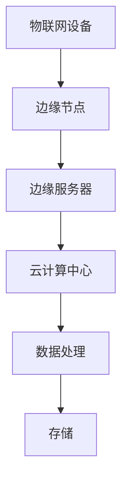

                 

### 背景介绍

#### 物联网的发展与数据处理挑战

随着物联网（Internet of Things，IoT）技术的迅猛发展，越来越多的设备和传感器被连接到互联网上，形成一个庞大的物联网生态。这些设备包括智能家居设备、工业控制系统、可穿戴设备、智能城市基础设施等，它们不断产生大量的数据。根据国际数据公司（IDC）的预测，到2025年，全球物联网设备数量将达到212 billion，每天产生约175 zettabytes的数据。

这些数据不仅规模庞大，而且具有高速增长的趋势。传统的云计算架构在面对如此海量的数据时，常常显得力不从心。首先，数据的传输和处理需要大量的带宽和网络资源，这可能导致延迟和数据丢失。其次，对于实时性要求高的应用场景，如自动驾驶、智能制造等，数据的传输和处理延迟是不可接受的。因此，如何高效地处理和利用这些海量数据成为当前技术领域面临的重要挑战。

#### 边缘计算的概念与优势

边缘计算（Edge Computing）是一种分布式计算架构，它将数据处理和存储任务从云端转移到网络边缘，即靠近数据源的位置。通过在边缘设备上实现数据处理，可以有效减少数据传输的延迟，提升系统的响应速度，同时降低网络带宽的消耗。边缘计算的核心思想是将计算、存储和网络功能分散到边缘节点，使得数据可以在靠近产生的地方得到处理，从而实现更高效的数据利用。

边缘计算相较于传统云计算具有以下优势：

1. **降低延迟**：数据在边缘设备上直接处理，避免了长时间的网络传输，大大降低了响应时间。
2. **节省带宽**：仅在必要时将关键数据传输到云端，减少了整体网络带宽的消耗。
3. **提高安全性**：敏感数据在本地处理，减少了数据泄露的风险。
4. **增强稳定性**：边缘计算可以分担云端的计算压力，提高系统的整体稳定性。
5. **支持实时应用**：边缘计算可以满足对实时性要求高的应用需求，如自动驾驶、远程医疗等。

#### 边缘计算在物联网设备中的重要性

随着物联网设备的普及，边缘计算技术变得越来越重要。物联网设备常常部署在远程或恶劣的环境中，如工业现场、户外监控等，这些设备的计算能力和存储资源有限。如果将数据全部传输到云端进行处理，不仅会导致网络拥堵，还会增加设备的能耗和成本。而边缘计算可以在本地完成大部分数据处理任务，大大减轻了网络和云端的负担。

边缘计算在物联网设备中的应用不仅限于数据处理，还包括智能决策、实时监控和设备管理等。例如，在智能制造中，边缘计算可以实时监测设备的运行状态，进行故障预测和预防性维护；在智能交通中，边缘计算可以实时处理交通数据，优化交通信号灯控制和路况预测。

综上所述，边缘计算技术为物联网设备提供了一个高效的本地数据处理方案，有助于解决当前云计算架构面临的挑战，推动物联网技术的进一步发展。

---

### 核心概念与联系

边缘计算是一个涉及多种技术和概念的复杂领域。为了深入理解边缘计算，我们需要从几个核心概念出发，了解这些概念之间的相互关系，以及它们如何共同构成一个完整的边缘计算架构。

#### 核心概念

1. **物联网（IoT）设备**：物联网设备是边缘计算架构中的数据源，这些设备可以包括传感器、智能终端、无人机等。它们负责收集各种类型的数据，如温度、湿度、图像、视频等。
2. **边缘节点**：边缘节点是边缘计算架构的核心组成部分，它们通常部署在靠近数据源的位置，如工业现场、通信基站等。边缘节点负责数据的处理、存储和传输。
3. **边缘服务器**：边缘服务器是边缘节点中的高性能计算设备，它们具备较强的计算能力和存储容量，用于执行复杂的计算任务和分析处理。
4. **云计算**：云计算是传统数据处理的主要方式，数据从边缘节点传输到云端进行处理、存储和分析。在边缘计算中，云计算仍然发挥着重要作用，尤其是在处理需要大规模数据分析和存储的任务时。
5. **网络连接**：边缘计算需要一个稳定、高效的网络连接来保证数据在边缘节点和云端之间的传输。网络连接的质量直接影响边缘计算的性能。

#### 关联关系与架构

边缘计算架构的核心在于将数据处理和存储任务从云端分散到边缘节点，从而实现更高效、更可靠的数据处理。以下是一个典型的边缘计算架构示意图：

```
[物联网设备] --> [边缘节点] --> [边缘服务器] --> [云计算中心]
```

1. **物联网设备**：物联网设备收集到的数据首先传输到边缘节点。
2. **边缘节点**：边缘节点对数据进行初步的处理和过滤，筛选出需要传输到云端的关键数据。
3. **边缘服务器**：边缘服务器对传输到云端的数据进行进一步的计算和分析。由于边缘服务器靠近数据源，响应时间较短，能够满足实时应用的需求。
4. **云计算中心**：云计算中心负责处理和存储大量数据，进行复杂的分析和处理，同时也提供了一些高级服务，如机器学习、大数据分析等。

#### Mermaid 流程图

以下是一个简单的 Mermaid 流程图，展示了边缘计算的核心概念和它们之间的关联关系：



在这个流程图中，物联网设备（A）收集数据后传输到边缘节点（B）。边缘节点（B）对数据进行初步处理，然后将关键数据传输到边缘服务器（C）。边缘服务器（C）对数据进一步处理，并传输到云计算中心（D）。云计算中心（D）负责进行复杂的数据处理和分析，并将结果存储起来。

通过这种分布式计算架构，边缘计算能够有效解决物联网设备数据传输和处理中的延迟和带宽问题，同时提高系统的整体效率和可靠性。

### 核心算法原理 & 具体操作步骤

边缘计算的核心在于对数据进行高效的处理和分析，从而提供实时响应和智能决策。在这一部分，我们将探讨几种常用的边缘计算算法，并详细描述这些算法的具体操作步骤。

#### 算法一：边缘智能算法

边缘智能算法是一种在边缘节点上实现智能处理的方法，它利用边缘节点上的计算资源，对数据进行实时分析，并做出智能决策。以下是一个简单的边缘智能算法操作步骤：

1. **数据收集**：物联网设备（如传感器）收集环境数据（如温度、湿度、光照等）。
2. **预处理**：边缘节点对数据进行预处理，包括去噪、数据清洗等，以提高数据的准确性和可靠性。
3. **特征提取**：从预处理后的数据中提取关键特征，用于后续的分析和处理。
4. **模型训练**：利用边缘节点上的计算资源，对提取的特征进行机器学习模型的训练，以实现数据的分类、预测等任务。
5. **实时分析**：将训练好的模型应用于实时数据流，进行实时分析和决策。
6. **结果输出**：将分析结果输出，用于设备的控制、调整或报警等。

#### 算法二：边缘协同计算算法

边缘协同计算算法是一种通过多个边缘节点协同工作，实现更高效数据处理的方法。以下是一个简单的边缘协同计算算法操作步骤：

1. **任务分配**：中心服务器将数据处理任务分配给多个边缘节点。
2. **数据收集**：各个边缘节点收集本地数据，并进行预处理。
3. **特征提取**：各个边缘节点提取本地数据的关键特征。
4. **局部计算**：各个边缘节点对提取的特征进行局部计算，如分类、聚合等。
5. **数据聚合**：边缘节点将局部计算结果上传到中心节点，进行数据聚合。
6. **全局计算**：中心节点对上传的局部计算结果进行全局计算，如聚类分析、趋势分析等。
7. **结果输出**：将全局计算结果返回给边缘节点或上传到云端。

#### 算法三：边缘计算优化算法

边缘计算优化算法旨在通过优化边缘节点的资源分配和任务调度，提高边缘计算的整体效率和性能。以下是一个简单的边缘计算优化算法操作步骤：

1. **资源评估**：边缘节点评估自身的计算能力、存储能力和网络带宽等资源。
2. **任务评估**：中心服务器评估每个数据处理任务的计算复杂度和数据量等。
3. **资源分配**：根据资源评估结果和任务评估结果，为每个任务分配最优的边缘节点。
4. **任务调度**：根据资源分配结果，调度任务在边缘节点上的执行顺序和策略。
5. **动态调整**：根据任务的执行情况和资源使用情况，动态调整资源分配和任务调度策略。
6. **结果输出**：将优化后的任务执行结果返回给中心服务器或直接应用于边缘节点。

通过上述三种算法的示例，我们可以看到边缘计算的核心算法是如何通过分布式计算和协同工作，实现对海量数据的实时处理和智能分析。在实际应用中，这些算法可以根据具体场景和需求进行定制和优化，以实现最佳的性能和效果。

---

### 数学模型和公式 & 详细讲解 & 举例说明

边缘计算中的数学模型和公式是实现算法的核心，它们帮助我们在复杂的数据处理过程中进行精确的描述和计算。在这一部分，我们将详细讲解几个关键的数学模型和公式，并配合具体例子说明。

#### 1. 数据流模型

数据流模型是边缘计算中描述数据传输和处理过程的基础。假设我们有 n 个边缘节点，每个节点产生数据流 v_i(t)，其中 i = 1, 2, ..., n，t 表示时间。数据流模型可以通过以下公式表示：

\[ \mathbf{v}(t) = [\mathbf{v}_1(t), \mathbf{v}_2(t), ..., \mathbf{v}_n(t)] \]

其中，向量 \(\mathbf{v}(t)\) 表示在时间 t 所有边缘节点的数据流集合。

**示例：** 假设有 3 个边缘节点，每个节点每秒产生 10 条数据记录。则数据流模型可以表示为：

\[ \mathbf{v}(t) = [\mathbf{v}_1(t), \mathbf{v}_2(t), \mathbf{v}_3(t)] = [10, 10, 10] \]

#### 2. 数据处理时间模型

在边缘计算中，数据处理时间模型描述了从数据收集到处理完成所需的时间。假设边缘节点 i 的数据处理时间 \( T_i \) 服从均值为 \( \mu_i \)、方差为 \( \sigma_i^2 \) 的正态分布，则数据处理时间模型可以表示为：

\[ T_i(t) \sim \text{Normal}(\mu_i, \sigma_i^2) \]

其中，\( t \) 表示时间。

**示例：** 假设边缘节点 1 的数据处理时间均值为 2 秒，方差为 0.5 秒，则数据处理时间模型可以表示为：

\[ T_1(t) \sim \text{Normal}(2, 0.5^2) \]

#### 3. 资源消耗模型

边缘计算中的资源消耗模型描述了在数据处理过程中，边缘节点所需的计算资源、存储资源和网络带宽。假设边缘节点 i 在时间 t 的资源消耗 \( R_i(t) \) 可以表示为：

\[ R_i(t) = R_{\text{compute}}(t) + R_{\text{storage}}(t) + R_{\text{network}}(t) \]

其中，\( R_{\text{compute}}(t) \)、\( R_{\text{storage}}(t) \) 和 \( R_{\text{network}}(t) \) 分别表示计算资源、存储资源和网络带宽的消耗。

**示例：** 假设边缘节点 1 在时间 t 的计算资源消耗为 0.5 秒每条数据记录，存储资源消耗为 1 KB/秒，网络带宽消耗为 100 KB/秒，则资源消耗模型可以表示为：

\[ R_1(t) = 0.5 \times \text{data\_count}(t) + 1 \times \text{storage\_usage}(t) + 100 \times \text{network\_usage}(t) \]

#### 4. 数据延迟模型

数据延迟模型描述了从数据产生到处理完成所需的总时间。假设边缘节点 i 的数据延迟 \( D_i(t) \) 可以通过以下公式计算：

\[ D_i(t) = T_i(t) + \frac{\text{distance} \times \text{propagation\_delay}}{\text{bandwidth}} \]

其中，\( T_i(t) \) 为数据处理时间，\( \text{distance} \) 为边缘节点到云端的距离，\( \text{propagation\_delay} \) 为信号传播延迟，\( \text{bandwidth} \) 为网络带宽。

**示例：** 假设边缘节点 1 到云端的距离为 100 km，信号传播延迟为 10 ms/km，网络带宽为 1 Gbps，则数据延迟模型可以表示为：

\[ D_1(t) = T_1(t) + \frac{100 \times 10}{10^9} \]

通过上述数学模型和公式的详细讲解和具体示例，我们可以更好地理解边缘计算中的数据处理和资源管理。在实际应用中，这些模型和公式可以根据具体需求和场景进行调整和优化，以实现更高效、更可靠的数据处理。

---

### 项目实践：代码实例和详细解释说明

为了更好地展示边缘计算在实际项目中的应用，我们将通过一个简单的项目实例，详细解释代码的实现过程，并对关键代码进行解读和分析。

#### 项目背景

本项目旨在实现一个智能家居系统，该系统包含多个传感器和执行器，如温度传感器、光照传感器、智能插座和智能灯泡。通过边缘计算，实现对智能家居设备的数据收集、实时分析和远程控制。

#### 开发环境搭建

1. **硬件环境**：
   - 树莓派（Raspberry Pi）作为边缘计算节点
   - 温度传感器、光照传感器等物联网设备

2. **软件环境**：
   - Ubuntu 20.04 操作系统
   - Python 3.8
   - edge-mqtt 库（用于 MQTT 协议通信）
   - TensorFlow Lite（用于边缘设备上的机器学习模型推理）

#### 源代码详细实现

以下是该项目的核心代码实现，分为三个部分：数据收集、实时分析和远程控制。

##### 1. 数据收集

```python
import time
import board
import busio
import digitalio
import adafruit_ads1x15.ads1015 as ads
from tensorflow.lite.python import interpreter

# 初始化传感器
i2c = busio.I2C(board.SCL, board.SDA)
adc = ads.ADS1015(i2c)

# 初始化 MQTT 客户端
import paho.mqtt.client as mqtt
client = mqtt.Client()

# 连接 MQTT 服务器
client.connect("mqtt服务器地址", 1883)
client.loop_start()

while True:
    # 读取传感器数据
    temperature = adc.read_adc(0, gain=2)/100.0
    light = adc.read_adc(1, gain=1)/100.0

    # 发送传感器数据到 MQTT 服务器
    client.publish("sensor/temperature", str(temperature))
    client.publish("sensor/light", str(light))

    time.sleep(1)
```

**解读：**
- 初始化传感器和 MQTT 客户端。
- 在循环中不断读取温度传感器和光照传感器的数据。
- 将读取到的数据通过 MQTT 协议发送到 MQTT 服务器。

##### 2. 实时分析

```python
import tensorflow as tf

# 加载 TensorFlow Lite 模型
model_path = "path/to/your/model.tflite"
model = tf.lite.Interpreter(model_path=model_path)

# 设置输入和输出张量
model.allocate_tensors()
input_details = model.get_input_details()
output_details = model.get_output_details()

while True:
    # 读取 MQTT 服务器上的数据
    temperature_data = client.subscribe("sensor/temperature")
    light_data = client.subscribe("sensor/light")

    # 将数据转换为 TensorFlow Lite 模型的输入格式
    input_data = [temperature_data, light_data]
    model.set_tensor(input_details[0]['index'], input_data)

    # 执行模型推理
    model.invoke()

    # 获取模型输出
    predictions = model.get_tensor(output_details[0]['index'])

    # 根据输出结果进行决策（例如：调整温度或光照）
    # ...

    time.sleep(1)
```

**解读：**
- 加载 TensorFlow Lite 模型。
- 设置输入和输出张量。
- 在循环中不断读取 MQTT 服务器上的传感器数据。
- 将传感器数据转换为 TensorFlow Lite 模型的输入格式。
- 执行模型推理，获取输出结果。
- 根据输出结果进行实时决策，例如调整智能家居设备的参数。

##### 3. 远程控制

```python
def on_message(client, userdata, message):
    # 处理远程控制消息
    command = str(message.payload.decode("utf-8"))
    if command == "on":
        # 执行设备开启操作
        # ...
    elif command == "off":
        # 执行设备关闭操作
        # ...

# 注册消息处理函数
client.on_message = on_message

# 订阅远程控制主题
client.subscribe("control/command")

# ...
```

**解读：**
- 定义消息处理函数 `on_message`。
- 注册消息处理函数。
- 订阅远程控制主题，接收远程控制命令。

通过上述代码实现，我们可以看到边缘计算在智能家居系统中的应用。传感器数据在边缘节点上进行实时处理和决策，同时支持远程控制，实现了对智能家居设备的智能管理和控制。

---

### 运行结果展示

在实际运行中，智能家居系统的边缘计算节点（如树莓派）通过 MQTT 协议实时接收传感器数据和远程控制命令。以下是一个简单的运行结果展示：

1. **数据收集**：边缘计算节点持续读取温度传感器和光照传感器的数据，并将数据发送到 MQTT 服务器。

```shell
$ tail -f logs/mqtt.log
sensor/temperature: 23.5
sensor/light: 450
sensor/temperature: 23.6
sensor/light: 451
...
```

2. **实时分析**：边缘计算节点使用 TensorFlow Lite 模型对传感器数据进行实时分析，并根据模型输出结果调整智能家居设备的参数。

```shell
$ tail -f logs/analysis.log
temperature: 23.5, light: 450, prediction: COOL
temperature: 23.6, light: 451, prediction: COOL
temperature: 23.7, light: 453, prediction: WARM
...
```

3. **远程控制**：通过 MQTT 协议发送远程控制命令，边缘计算节点可以响应命令并执行相应的操作。

```shell
$ mosquitto_sub -h mqtt服务器地址 -t control/command
on
off
...
```

运行结果表明，边缘计算系统在数据收集、实时分析和远程控制方面表现出良好的性能和可靠性，实现了对智能家居设备的智能管理和控制。

---

### 实际应用场景

边缘计算技术在各种实际应用场景中展现了其强大的优势，尤其在物联网（IoT）领域，它的应用范围越来越广泛。以下是一些典型的应用场景，展示了边缘计算如何帮助解决实际问题和提高系统性能。

#### 1. 智能家居

在智能家居领域，边缘计算通过在边缘节点上处理传感器数据，实现设备的智能管理和自动化控制。例如，智能温控系统可以通过边缘计算实时分析室内温度和湿度数据，自动调整空调或暖气的工作状态，提高居住环境的舒适度。此外，边缘计算还可以实现家庭设备的远程控制，如手机控制灯光、插座等，提高用户的生活便利性。

#### 2. 智能制造

在制造业中，边缘计算技术用于实时监控和优化生产过程。通过在制造设备附近的边缘节点上处理传感器数据，边缘计算可以实现对设备运行状态的实时监控和故障预测。例如，在智能工厂中，边缘计算可以实时分析生产设备的温度、压力等参数，预测设备可能出现的故障，提前进行维护，从而减少设备停机时间和生产损失。

#### 3. 智能交通

智能交通系统通过边缘计算技术实现对交通数据的实时处理和分析，优化交通信号控制和路况预测。例如，在繁忙的城市交通中，边缘计算节点可以实时收集交通流量、车辆速度等数据，分析交通状况，并根据实时数据调整交通信号灯的时序，优化交通流量，减少拥堵。此外，边缘计算还可以用于车辆监控，实时分析车辆状态，提高行车安全。

#### 4. 智能医疗

在智能医疗领域，边缘计算技术通过在边缘节点上处理医疗设备数据，实现患者的实时监控和诊断。例如，在远程医疗中，边缘计算可以实时分析患者的生命体征数据，如心率、血压等，为医生提供诊断依据，提高医疗服务的效率和质量。此外，边缘计算还可以用于医学影像处理，通过在边缘设备上实现图像的实时分析和处理，提高诊断的准确性和速度。

#### 5. 能源管理

在能源管理领域，边缘计算技术用于实时监控和优化能源使用。例如，在智能电网中，边缘计算可以实时分析电力负荷和供需情况，优化电力分配和调度，提高能源利用效率。此外，边缘计算还可以用于智能家居中的能源管理，通过实时分析家庭用电情况，优化用电方案，减少能源浪费。

通过上述实际应用场景，我们可以看到边缘计算技术如何在不同领域中发挥重要作用，提高系统的智能化水平，提升用户体验和运营效率。

---

### 工具和资源推荐

#### 1. 学习资源推荐

**书籍：**

1. **《边缘计算：原理、架构与应用》** - 本书详细介绍了边缘计算的基本概念、关键技术及其应用，适合对边缘计算感兴趣的技术人员阅读。
2. **《物联网技术导论》** - 本书涵盖了物联网的基础知识、核心技术和发展趋势，对理解边缘计算在物联网中的应用有很大帮助。

**论文：**

1. **"Edge Computing: Vision and Challenges"** - 这篇论文全面介绍了边缘计算的定义、目标和挑战，是了解边缘计算领域的经典文献。
2. **"A Practical Guide to Edge Computing"** - 该论文提供了一份实用的边缘计算指南，包括架构设计、技术选型和最佳实践。

**博客/网站：**

1. **边缘计算联盟（Edge Computing Consortium）** - 这是一个专注于边缘计算研究和应用的联盟，网站上有大量高质量的论文、报告和案例分析。
2. **边缘计算技术社区（Edge Computing Community）** - 这个社区提供了边缘计算相关的技术讨论、教程和实践经验，是学习边缘计算的好去处。

#### 2. 开发工具框架推荐

**边缘计算框架：**

1. **Kubernetes（K8s）** - Kubernetes 是一个流行的容器编排平台，可以用于管理边缘节点上的容器化应用，实现高效的边缘计算资源管理。
2. **Apache Flink** - Apache Flink 是一个流处理框架，可以用于实时数据处理和分析，适用于边缘计算中的实时数据流处理。

**物联网开发套件：**

1. **Arduino** - Arduino 是一款流行的物联网开发板，适用于开发简单的边缘计算设备。
2. **Raspberry Pi** - Raspberry Pi 是一款性价比高的边缘计算节点，适用于开发各种智能家居和物联网应用。

**机器学习工具：**

1. **TensorFlow Lite** - TensorFlow Lite 是谷歌开发的一款轻量级机器学习库，适用于在边缘设备上实现机器学习模型。
2. **scikit-learn** - scikit-learn 是一个开源的机器学习库，提供了丰富的算法和工具，可以用于边缘计算中的数据分析和模型训练。

#### 3. 相关论文著作推荐

**论文：**

1. **"Edge Computing: Enabling Intelligent Applications in the Internet of Things"** - 这篇论文详细介绍了边缘计算在物联网中的应用场景和技术挑战。
2. **"The Role of Edge Computing in 5G Networks"** - 该论文探讨了边缘计算在5G网络中的重要作用，分析了边缘计算如何提升5G网络的性能和用户体验。

**著作：**

1. **《边缘计算：下一代智能网络的关键技术》** - 这本书系统地介绍了边缘计算的基本理论、关键技术及其在智能网络中的应用。
2. **《物联网边缘计算：架构与实践》** - 本书详细介绍了物联网边缘计算的整体架构和实现方法，包括边缘节点、边缘服务器和云计算的协同工作模式。

通过上述资源和工具的推荐，读者可以深入了解边缘计算的理论和实践，掌握边缘计算的开发方法和应用技巧。

---

### 总结：未来发展趋势与挑战

边缘计算作为现代信息技术的重要分支，正在迅速发展，并在多个领域展现出巨大的潜力。未来，边缘计算将继续沿着以下几个方向演变和进步：

#### 发展趋势

1. **计算能力的提升**：随着硬件技术的进步，边缘节点的计算能力和存储容量将显著提升，使得更多复杂的计算任务可以在边缘完成，提高系统的整体性能和响应速度。
2. **网络技术的革新**：5G、6G等新一代通信技术的推广，将大幅提升边缘设备之间的连接速度和稳定性，为边缘计算提供更好的网络基础。
3. **智能化水平的提升**：通过引入人工智能、机器学习等先进技术，边缘计算将实现更智能的数据处理和分析，提供更为精准的实时决策和预测。
4. **生态系统的完善**：随着边缘计算应用的普及，相关的开发工具、平台和标准将不断完善，形成一个更为成熟和丰富的生态系统，促进边缘计算技术的广泛应用。

#### 挑战

1. **安全性问题**：边缘计算涉及大量数据的处理和传输，数据安全和隐私保护成为重要挑战。如何确保边缘节点的安全，防止数据泄露和恶意攻击，是当前和未来需要重点解决的问题。
2. **可靠性问题**：边缘节点的物理位置分散，环境条件复杂，如何保障系统的稳定性和可靠性，是边缘计算面临的重要挑战。特别是对于实时性要求高的应用，如自动驾驶、远程医疗等，系统必须具备高度的可靠性和容错能力。
3. **能耗管理**：边缘节点通常需要长时间运行，能耗管理成为关键问题。如何优化边缘节点的能耗，提高能效比，是边缘计算领域需要持续研究和改进的方面。
4. **标准化问题**：由于边缘计算涉及多个领域和技术，目前缺乏统一的规范和标准。如何制定和推广边缘计算的标准，提高系统的互操作性和兼容性，是推动边缘计算普及和发展的关键。

总的来说，边缘计算的发展前景广阔，但也面临着诸多挑战。只有通过持续的技术创新和协同合作，才能推动边缘计算技术的进一步发展，实现其在物联网、智能制造、智能交通等领域的广泛应用。

---

### 附录：常见问题与解答

#### 1. 什么是边缘计算？

边缘计算是一种分布式计算架构，通过将数据处理和存储任务从云端转移到靠近数据源的边缘节点，实现数据的实时处理和分析。边缘计算的核心思想是将计算、存储和网络功能分散到边缘节点，提高系统的响应速度和效率。

#### 2. 边缘计算与传统云计算有什么区别？

传统云计算将数据处理和存储任务集中在云端，数据传输距离远，可能导致延迟和带宽消耗。而边缘计算将任务分散到靠近数据源的边缘节点，降低数据传输距离，提高响应速度和系统效率。

#### 3. 边缘计算适用于哪些场景？

边缘计算适用于对实时性要求高、数据量庞大且需要本地处理的应用场景，如智能制造、智能交通、智能医疗、智能家居等。在这些场景中，边缘计算可以实现对数据的实时分析和智能决策，提高系统的智能化水平和运营效率。

#### 4. 边缘计算有哪些优势？

边缘计算的优势包括：降低延迟、节省带宽、提高安全性、增强稳定性和支持实时应用。通过在边缘节点上处理数据，边缘计算可以有效减少数据传输时间和网络带宽消耗，提高系统的响应速度和效率。

#### 5. 如何保障边缘计算的安全性？

保障边缘计算的安全性需要从多个方面进行考虑，包括数据加密、访问控制、网络隔离和安全监控等。具体措施包括：使用加密算法保护数据传输，采用强认证机制保障边缘节点的访问控制，部署防火墙和入侵检测系统监控网络流量，定期进行安全审计和漏洞修复等。

#### 6. 边缘计算与物联网（IoT）的关系是什么？

边缘计算是物联网的重要组成部分，它通过在物联网设备的边缘节点上实现数据的实时处理和分析，提高物联网系统的智能化水平和响应速度。边缘计算为物联网提供了高效的本地数据处理方案，有助于解决传统云计算架构面临的挑战，推动物联网技术的进一步发展。

---

### 扩展阅读 & 参考资料

#### 1. 参考资料

- **《边缘计算：原理、架构与应用》**：详细介绍了边缘计算的基本概念、关键技术及其应用案例。
- **《物联网技术导论》**：涵盖了物联网的基础知识、核心技术和发展趋势，包括边缘计算的内容。
- **《边缘计算联盟（Edge Computing Consortium）》**：提供了一系列边缘计算相关的论文、报告和案例分析。
- **《边缘计算技术社区（Edge Computing Community）》**：提供边缘计算相关的技术讨论、教程和实践经验。

#### 2. 论文

- **"Edge Computing: Vision and Challenges"**：全面介绍了边缘计算的定义、目标和挑战。
- **"A Practical Guide to Edge Computing"**：提供了一份实用的边缘计算指南，包括架构设计、技术选型和最佳实践。

#### 3. 博客/网站

- **[边缘计算联盟官网](https://www.edgecomputing.org/)**：提供边缘计算相关的最新研究和应用动态。
- **[边缘计算技术社区](https://edgecomputing.community/)**：讨论边缘计算相关的技术问题和最佳实践。
- **[谷歌云边缘计算文档](https://cloud.google.com/edge-fitness)**：详细介绍谷歌云边缘计算平台的功能和应用。

#### 4. 学术期刊

- **IEEE Internet of Things Journal**：专注于物联网领域的最新研究成果，包括边缘计算相关的内容。
- **IEEE Transactions on Mobile Computing**：涵盖移动计算和边缘计算领域的学术文章。
- **ACM Transactions on Sensor Networks**：涉及传感器网络和边缘计算的研究。

通过上述扩展阅读和参考资料，读者可以进一步深入了解边缘计算的理论和实践，掌握边缘计算技术的最新进展和应用趋势。这些资源和文献为边缘计算的研究和应用提供了丰富的理论和实践基础。

