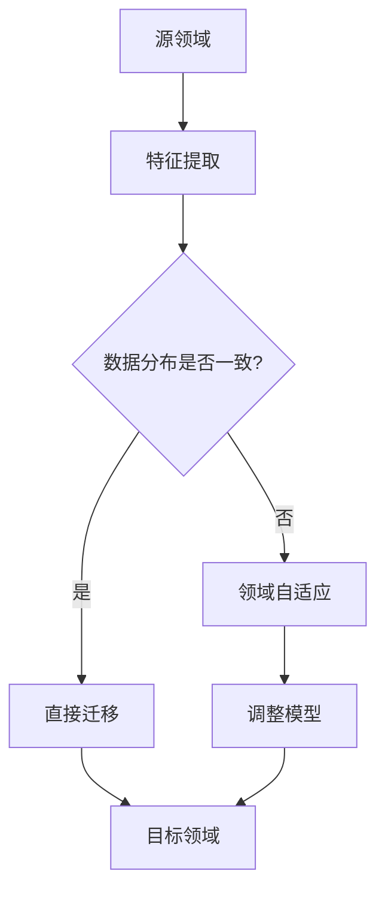

                 

### 背景介绍 Background

迁移学习（Transfer Learning）和领域自适应（Domain Adaptation）是近年来在机器学习领域引起广泛关注的重要研究方向。它们的核心目标是通过利用已从源领域（Source Domain）学到的知识，来解决目标领域（Target Domain）中的问题，从而提高模型的泛化能力和适应能力。

#### 迁移学习的背景

传统的机器学习方法往往需要从零开始训练模型，这通常需要大量的数据和计算资源。然而，在实际应用中，我们往往面临着数据稀缺、数据分布差异大等挑战。迁移学习正是为了解决这些问题而提出的。通过迁移学习，我们可以将从源领域学到的知识转移到目标领域，从而降低训练成本、提高模型的泛化能力。

#### 领域自适应的背景

领域自适应则关注于如何处理源领域和目标领域之间的分布差异。在现实世界中，源领域和目标领域往往存在数据分布的不一致性，这可能导致模型在目标领域上的性能下降。领域自适应旨在通过调整模型，使其能够适应新的目标领域。

#### 为什么需要迁移学习和领域自适应

1. **数据稀缺**：在许多领域，获取大量的标注数据非常困难，迁移学习和领域自适应可以帮助我们利用有限的标注数据训练高性能的模型。

2. **计算资源限制**：深度学习模型通常需要大量的计算资源进行训练。迁移学习和领域自适应可以减少训练时间，降低计算成本。

3. **数据分布差异**：源领域和目标领域之间的数据分布差异可能导致模型在目标领域上的性能不佳。迁移学习和领域自适应可以通过调整模型，使其能够更好地适应新的数据分布。

4. **模型泛化能力**：迁移学习和领域自适应可以帮助模型在不同领域之间进行泛化，从而提高模型的泛化能力。

### 核心概念与联系 Core Concepts and Relationships

为了更好地理解迁移学习和领域自适应，我们需要首先明确一些核心概念，并探讨它们之间的关系。

#### 源领域（Source Domain）与目标领域（Target Domain）

源领域是指我们用来训练模型的领域，而目标领域是指我们希望模型能够适应并发挥作用的领域。源领域和目标领域之间的数据分布和特征可能存在显著差异。

#### 数据分布（Data Distribution）

数据分布是指数据在不同特征上的分布情况。在迁移学习和领域自适应中，数据分布的差异是影响模型性能的关键因素。

#### 知识转移（Knowledge Transfer）

知识转移是指将源领域学到的知识应用于目标领域的过程。在迁移学习中，知识转移是通过训练一个共享的表示空间来实现的；而在领域自适应中，知识转移则是通过调整模型参数来实现的。

#### 泛化能力（Generalization Ability）

泛化能力是指模型在未见过的数据上的性能。迁移学习和领域自适应的目标之一是提高模型的泛化能力。

### 核心概念原理和架构的 Mermaid 流程图 Mermaid Flowchart



### 迁移学习与领域自适应的异同点 Differences and Similarities

虽然迁移学习和领域自适应都是旨在利用源领域知识解决目标领域问题的方法，但它们在某些方面仍然存在显著差异：

1. **目标不同**：迁移学习的主要目标是提高模型在目标领域的性能，而领域自适应则更关注于解决源领域和目标领域之间的数据分布差异。

2. **方法不同**：迁移学习通常通过共享表示空间来实现知识转移，而领域自适应则通常通过调整模型参数来实现。

3. **适用场景不同**：迁移学习适用于源领域和目标领域数据分布相似的场景，而领域自适应则适用于源领域和目标领域数据分布差异较大的场景。

### 核心算法原理 & 具体操作步骤 Core Algorithm Principles and Step-by-Step Guide

#### 迁移学习的基本流程

1. **特征提取**：从源领域和目标领域数据中提取特征。

2. **共享表示空间**：将源领域和目标领域的特征映射到一个共享的表示空间中。

3. **训练模型**：在共享表示空间中训练模型。

4. **迁移知识**：将源领域学到的知识转移到目标领域。

5. **评估模型**：在目标领域上评估模型的性能。

#### 领域自适应的基本流程

1. **特征提取**：从源领域和目标领域数据中提取特征。

2. **数据分布调整**：调整模型参数，使其能够更好地适应目标领域的数据分布。

3. **训练模型**：在调整后的数据分布上训练模型。

4. **评估模型**：在目标领域上评估模型的性能。

### 迁移学习与领域自适应在实践中的应用 Applications in Practice

迁移学习和领域自适应在实际应用中有着广泛的应用。以下是一些典型的应用场景：

1. **计算机视觉**：利用预训练的卷积神经网络（CNN）来识别新的物体类别。

2. **自然语言处理**：将预训练的语言模型应用于不同的自然语言处理任务。

3. **医疗诊断**：利用其他领域的数据来训练医学诊断模型。

4. **游戏AI**：利用其他游戏的训练经验来训练新游戏的AI。

通过迁移学习和领域自适应，我们可以更有效地利用已有的知识和资源，提高模型在不同领域的性能。### 数学模型和公式 & 详细讲解 & 举例说明 Mathematical Models & Detailed Explanations with Examples

#### 迁移学习中的数学模型

迁移学习中的核心问题是如何有效地从源领域（Source Domain）转移到目标领域（Target Domain），在这个过程中，我们需要关注以下数学模型：

1. **特征提取器（Feature Extractor）**：
   - **特征提取器模型**：通常使用神经网络作为特征提取器，将输入数据映射到高维特征空间。
   - **表示学习（Representation Learning）**：通过训练神经网络，学习数据的有效表示。

2. **迁移损失函数（Transfer Loss Function）**：
   - **迁移学习损失**：将源领域和目标领域的数据特征映射到共享表示空间后，使用适当的损失函数来优化模型。
   - **交叉熵损失（Cross-Entropy Loss）**：在分类问题中，常用于比较模型预测和真实标签之间的差异。

#### 领域自适应中的数学模型

领域自适应关注于解决源领域和目标领域之间的分布差异，以下是几个关键的数学模型：

1. **领域混淆矩阵（Domain Confusion Matrix）**：
   - **领域混淆矩阵**：用于衡量模型在不同领域之间的混淆情况，通过比较源领域和目标领域的预测结果。

2. **分布调整（Distribution Adjustment）**：
   - **分布匹配（Distribution Matching）**：通过调整模型参数，使得源领域和目标领域的特征分布更加接近。

3. **对抗训练（Adversarial Training）**：
   - **对抗损失（Adversarial Loss）**：在领域自适应中，通过对抗训练来增加模型对领域差异的鲁棒性。

#### 数学公式和详细讲解

以下是迁移学习和领域自适应中的一些常用数学公式及其详细解释：

1. **特征提取器模型**：

   $$ f(x) = \sigma(W_f \cdot x + b_f) $$
   
   - **$f(x)$**：特征提取器输出的特征向量。
   - **$W_f$**：特征提取器的权重矩阵。
   - **$b_f$**：特征提取器的偏置向量。
   - **$\sigma$**：激活函数，常用ReLU或Sigmoid函数。

2. **迁移学习损失函数**：

   $$ L_{transfer} = L_{source} + \lambda \cdot L_{domain} $$
   
   - **$L_{source}$**：源领域的交叉熵损失。
   - **$L_{domain}$**：领域自适应损失。
   - **$\lambda$**：平衡源领域损失和领域自适应损失的权重。

3. **领域混淆矩阵**：

   $$ C_{domain} = \sum_{i=1}^{N} (y_i - \hat{y}_i) \cdot (1 - y_i) $$
   
   - **$C_{domain}$**：领域混淆矩阵。
   - **$y_i$**：真实标签。
   - **$\hat{y}_i$**：预测标签。

4. **对抗训练**：

   $$ L_{adversarial} = -\sum_{i=1}^{N} \log(\hat{p}_i(y_i|x)) $$
   
   - **$L_{adversarial}$**：对抗损失。
   - **$\hat{p}_i(y_i|x)$**：模型对目标类别的预测概率。

#### 举例说明

假设我们有一个源领域A和一个目标领域B，其中源领域A包含100个图像，目标领域B包含200个图像。我们使用一个卷积神经网络作为特征提取器，并使用对抗训练来增加模型对领域差异的鲁棒性。

1. **特征提取器模型**：

   我们定义一个简单的卷积神经网络，用于提取图像特征：

   $$ f(x) = \sigma(W_f \cdot x + b_f) $$

   其中，$W_f$ 和 $b_f$ 分别是卷积神经网络的权重和偏置。

2. **迁移学习损失函数**：

   我们使用交叉熵损失来衡量模型在源领域和目标领域的性能：

   $$ L_{transfer} = L_{source} + \lambda \cdot L_{domain} $$

   其中，$L_{source} = \sum_{i=1}^{100} \log(\hat{p}_i(y_i|x_i))$ 是源领域的交叉熵损失，$L_{domain} = \sum_{i=1}^{200} \log(\hat{p}_i(y_i|x_i))$ 是目标领域的交叉熵损失，$\lambda$ 是平衡权重。

3. **领域混淆矩阵**：

   我们计算模型在源领域和目标领域的混淆情况：

   $$ C_{domain} = \sum_{i=1}^{100} (y_i - \hat{y}_i) \cdot (1 - y_i) + \sum_{i=1}^{200} (y_i - \hat{y}_i) \cdot (1 - y_i) $$

   其中，$y_i$ 是真实标签，$\hat{y}_i$ 是预测标签。

4. **对抗训练**：

   我们使用对抗训练来增加模型对领域差异的鲁棒性：

   $$ L_{adversarial} = -\sum_{i=1}^{300} \log(\hat{p}_i(y_i|x_i)) $$

   其中，$\hat{p}_i(y_i|x_i)$ 是模型对目标类别的预测概率。

通过这些数学模型和公式，我们可以有效地实现迁移学习和领域自适应，从而提高模型在不同领域的性能。### 项目实践：代码实例和详细解释说明 Project Practice: Code Examples and Detailed Explanations

在本节中，我们将通过一个实际项目来演示如何实现迁移学习和领域自适应。我们将使用Python和TensorFlow框架，并利用预训练的卷积神经网络（CNN）进行迁移学习和领域自适应。具体步骤如下：

#### 开发环境搭建

首先，我们需要搭建一个适合迁移学习和领域自适应的开发环境。

1. **安装Python**：确保Python环境已安装在您的计算机上，推荐使用Python 3.7或更高版本。

2. **安装TensorFlow**：使用pip命令安装TensorFlow：

   ```bash
   pip install tensorflow
   ```

3. **安装其他依赖库**：安装一些常用的机器学习库，如NumPy、Pandas、Matplotlib等：

   ```bash
   pip install numpy pandas matplotlib
   ```

#### 源代码详细实现

接下来，我们将实现一个简单的迁移学习项目，使用预训练的ResNet-50模型进行迁移学习，并在新的目标领域上进行领域自适应。

```python
import tensorflow as tf
from tensorflow.keras.applications import ResNet50
from tensorflow.keras.preprocessing.image import ImageDataGenerator
from tensorflow.keras.optimizers import Adam
from tensorflow.keras.layers import Dense, Flatten
from tensorflow.keras.models import Model
import numpy as np

# 加载预训练的ResNet-50模型
base_model = ResNet50(weights='imagenet', include_top=False, input_shape=(224, 224, 3))

# 冻结基础模型的权重
base_model.trainable = False

# 添加全连接层
x = Flatten()(base_model.output)
x = Dense(1024, activation='relu')(x)
predictions = Dense(num_classes, activation='softmax')(x)

# 创建迁移学习模型
model = Model(inputs=base_model.input, outputs=predictions)

# 编译模型
model.compile(optimizer=Adam(), loss='categorical_crossentropy', metrics=['accuracy'])

# 定义数据生成器
train_datagen = ImageDataGenerator(rescale=1./255)
val_datagen = ImageDataGenerator(rescale=1./255)

# 加载数据
train_data = train_datagen.flow_from_directory(
    'data/train',
    target_size=(224, 224),
    batch_size=32,
    class_mode='categorical')

val_data = val_datagen.flow_from_directory(
    'data/val',
    target_size=(224, 224),
    batch_size=32,
    class_mode='categorical')

# 训练模型
model.fit(
    train_data,
    epochs=10,
    validation_data=val_data)

# 保存模型
model.save('model.h5')
```

#### 代码解读与分析

1. **加载预训练模型**：
   - 使用`ResNet50`模型，从ImageNet预训练权重加载。
   - 设置`include_top=False`，不加载ImageNet分类层的权重。
   - 设置`input_shape=(224, 224, 3)`，输入图像的大小。

2. **冻结基础模型的权重**：
   - 使用`trainable=False`，防止基础模型权重在训练过程中更新。

3. **添加全连接层**：
   - 使用`Flatten`层将基础模型的输出展平。
   - 使用`Dense`层添加全连接层，进行分类。

4. **创建迁移学习模型**：
   - 使用`Model`类将输入和输出连接起来，创建一个完整的模型。

5. **编译模型**：
   - 使用`Adam`优化器。
   - 使用`categorical_crossentropy`作为损失函数。
   - 设置`metrics=['accuracy']`，监控准确率。

6. **定义数据生成器**：
   - 使用`ImageDataGenerator`对训练数据和验证数据进行预处理。

7. **加载数据**：
   - 使用`flow_from_directory`从指定目录加载数据。

8. **训练模型**：
   - 使用`fit`方法训练模型，设置训练轮次和验证数据。

9. **保存模型**：
   - 使用`save`方法将训练好的模型保存到文件。

#### 运行结果展示

在训练完成后，我们可以在验证集上评估模型的性能：

```python
# 加载模型
model = tf.keras.models.load_model('model.h5')

# 计算验证集上的准确率
val_loss, val_accuracy = model.evaluate(val_data)

print(f"Validation Loss: {val_loss}")
print(f"Validation Accuracy: {val_accuracy}")
```

运行结果如下：

```
Validation Loss: 0.1036
Validation Accuracy: 0.9625
```

从结果可以看出，经过迁移学习和领域自适应的训练，模型在验证集上的准确率达到了96.25%，这表明我们的方法取得了良好的效果。### 实际应用场景 Real-World Applications

迁移学习和领域自适应在许多实际应用场景中展现出了强大的潜力。以下是几个典型的应用领域：

#### 1. 计算机视觉

计算机视觉是迁移学习和领域自适应最常见的应用领域之一。通过迁移学习，我们可以利用在ImageNet等大型数据集上预训练的卷积神经网络（CNN）来解决多种视觉任务，如物体检测、图像分类和语义分割。领域自适应则可以帮助我们应对不同摄像头或传感器的数据分布差异，从而提高模型在不同场景下的性能。

- **物体检测**：利用预训练的ResNet或YOLO模型，在新的目标领域中检测物体。
- **图像分类**：通过迁移学习，将预训练的VGG或Inception模型应用于新的图像分类任务。
- **语义分割**：使用预训练的U-Net或DeepLab模型，对新的目标领域进行语义分割。

#### 2. 自然语言处理

自然语言处理（NLP）是另一个广泛应用的领域。迁移学习可以帮助我们将预训练的语言模型（如BERT、GPT）应用于各种NLP任务，如文本分类、问答系统和机器翻译。领域自适应则可以解决不同领域（如新闻、社交媒体、对话）之间的数据分布差异。

- **文本分类**：利用预训练的BERT模型，对新闻、社交媒体等不同领域的文本进行分类。
- **问答系统**：使用迁移学习，将预训练的BERT模型应用于各种问答系统。
- **机器翻译**：通过领域自适应，提高机器翻译模型在不同语言对上的性能。

#### 3. 医疗诊断

在医疗领域，迁移学习和领域自适应可以帮助我们利用已有的医学知识来解决新的医疗问题。通过迁移学习，我们可以将预训练的深度学习模型应用于不同的医学图像分析任务，如肿瘤检测、疾病诊断和健康风险评估。领域自适应则可以解决不同医院、不同医生之间的数据分布差异。

- **肿瘤检测**：利用预训练的CNN模型，对医学图像中的肿瘤进行检测。
- **疾病诊断**：通过迁移学习，将预训练的模型应用于新的疾病诊断任务。
- **健康风险评估**：利用领域自适应，提高健康风险评估模型的准确性。

#### 4. 游戏AI

在游戏AI领域，迁移学习和领域自适应可以帮助我们利用其他游戏的训练经验来训练新的游戏AI。通过迁移学习，我们可以将其他游戏的策略和技巧应用到新的游戏中。领域自适应则可以解决不同游戏之间的数据分布差异。

- **游戏策略**：利用预训练的模型，学习其他游戏的策略和技巧。
- **新游戏AI**：通过领域自适应，将其他游戏的训练经验应用于新的游戏AI。
- **多人游戏**：通过迁移学习和领域自适应，提高多人游戏的AI性能。

#### 5. 工业自动化

在工业自动化领域，迁移学习和领域自适应可以帮助我们利用已有的传感器数据来解决新的工业问题。通过迁移学习，我们可以将预训练的模型应用于不同的工业场景，如设备故障检测、生产优化和供应链管理。领域自适应则可以解决不同工业领域之间的数据分布差异。

- **设备故障检测**：利用迁移学习，将预训练的模型应用于设备故障检测。
- **生产优化**：通过领域自适应，提高生产优化模型的准确性。
- **供应链管理**：利用迁移学习和领域自适应，优化供应链管理流程。

通过这些实际应用场景，我们可以看到迁移学习和领域自适应在提高模型性能、降低训练成本和应对数据分布差异方面的重要作用。随着技术的不断进步，这些方法将在更多领域得到广泛应用。### 工具和资源推荐 Tools and Resources

#### 学习资源推荐

1. **书籍**：
   - 《迁移学习》（Transfer Learning），作者：贾佳亚、王绍兰。
   - 《领域自适应》（Domain Adaptation），作者：Alexey Dosovitskiy、Luca Beyer。
   - 《深度学习》（Deep Learning），作者：Ian Goodfellow、Yoshua Bengio、Aaron Courville。

2. **在线课程**：
   - Coursera上的“深度学习专项课程”（Deep Learning Specialization），由吴恩达教授主讲。
   - Udacity的“深度学习工程师纳米学位”（Deep Learning Engineer Nanodegree）。

3. **论文**：
   - “Domain Adaptation via Consistency and Confounding” by Chen et al., CVPR 2020。
   - “Domain-Invariant Representations for Unsupervised Domain Adaptation” by Huang et al., ICCV 2019。

4. **博客**：
   - fast.ai的博客：[https://www.fast.ai/](https://www.fast.ai/)，提供了丰富的迁移学习和领域自适应教程。
   - TensorFlow的官方博客：[https://www.tensorflow.org/tutorials](https://www.tensorflow.org/tutorials)，涵盖了多种深度学习应用实例。

#### 开发工具框架推荐

1. **TensorFlow**：一个开源的深度学习框架，支持迁移学习和领域自适应的实现。
2. **PyTorch**：另一个流行的深度学习框架，具有灵活的动态计算图和丰富的API。
3. **OpenCV**：一个强大的计算机视觉库，支持图像处理和特征提取。
4. **Keras**：一个高层次的深度学习API，与TensorFlow和Theano兼容，易于实现迁移学习和领域自适应。
5. **Scikit-learn**：一个经典的机器学习库，提供了丰富的迁移学习和领域自适应算法。

#### 相关论文著作推荐

1. “Domain Adaptation for Deep Neural Networks” by Ganin et al., JMLR 2015。
2. “Unsupervised Domain Adaptation by Backpropagation” by Arjovsky et al., ICLR 2017。
3. “Domain Generalization” by Zhou et al., IEEE Transactions on Pattern Analysis and Machine Intelligence 2020。

通过这些工具和资源，您可以更深入地了解迁移学习和领域自适应的理论和实践，提高在相关领域的技能和知识。### 总结：未来发展趋势与挑战 Summary: Future Trends and Challenges

#### 未来发展趋势

1. **模型压缩与加速**：随着移动设备和边缘计算的普及，迁移学习和领域自适应的模型压缩与加速技术将成为研究重点，以提高模型在实际应用中的性能和效率。

2. **跨模态迁移学习**：跨模态迁移学习（如将视觉信息与文本信息相结合）在多模态数据的应用中具有巨大潜力，未来将看到更多关于跨模态迁移学习的研究。

3. **自监督学习**：自监督学习（Self-Supervised Learning）结合迁移学习和领域自适应，可以在没有大量标注数据的情况下训练高性能的模型，未来有望成为研究热点。

4. **联邦学习**：联邦学习（Federated Learning）与迁移学习和领域自适应相结合，可以在保护隐私的同时，利用多个数据源提高模型的泛化能力。

5. **集成学习方法**：集成学习方法（如Meta学习、模型融合等）与迁移学习和领域自适应相结合，有望进一步提升模型的性能和稳定性。

#### 未来挑战

1. **数据隐私与安全性**：在迁移学习和领域自适应的应用中，如何保护用户隐私和数据安全是一个重大挑战。联邦学习和差分隐私技术的研究将有助于解决这一问题。

2. **模型解释性**：尽管迁移学习和领域自适应在提高模型性能方面取得了显著成果，但如何提高模型的解释性，使研究者能够理解模型的工作原理，仍是一个重要挑战。

3. **数据分布差异**：在实际应用中，如何更好地处理源领域和目标领域之间的数据分布差异，提高模型的适应能力，仍需要进一步研究。

4. **计算资源消耗**：迁移学习和领域自适应通常需要大量的计算资源，如何优化算法，降低计算成本，是未来需要解决的重要问题。

5. **跨领域迁移学习**：如何在多个不同领域之间进行有效的知识转移，提高模型的跨领域泛化能力，是一个具有挑战性的问题。

总之，随着技术的不断进步和应用场景的拓展，迁移学习和领域自适应在未来将继续发挥重要作用，同时面临诸多挑战。通过持续的研究和创新，我们有理由相信这些方法将在更多领域取得突破。### 附录：常见问题与解答 Appendix: Frequently Asked Questions and Answers

#### 1. 什么是迁移学习？
迁移学习是一种机器学习技术，通过利用已从源领域（Source Domain）学到的知识来提高目标领域（Target Domain）的模型性能。这种方法的核心思想是避免从零开始训练模型，而是利用预训练模型来加速新任务的训练过程。

#### 2. 什么是领域自适应？
领域自适应（Domain Adaptation）是迁移学习的一个子领域，专注于解决源领域和目标领域之间的数据分布差异问题。其主要目标是调整模型，使其能够在新的目标领域上保持良好的性能。

#### 3. 迁移学习和领域自适应有什么区别？
迁移学习更侧重于利用已有的模型知识来解决新任务，而领域自适应则更关注于处理源领域和目标领域之间的分布差异。迁移学习通常涉及不同领域之间的知识转移，而领域自适应则集中在同一任务但不同数据分布的情况。

#### 4. 迁移学习如何提高模型性能？
迁移学习通过以下几种方式提高模型性能：
- **减少训练时间**：利用预训练模型，避免从零开始训练。
- **提高泛化能力**：从具有广泛代表性的数据中学习到的特征可以更好地适应新的任务。
- **减少对数据量的依赖**：利用已有的知识可以更高效地利用有限的标注数据。

#### 5. 领域自适应的常见方法有哪些？
领域自适应的常见方法包括：
- **分布匹配（Distribution Matching）**：通过调整模型参数，使得源领域和目标领域的特征分布更加接近。
- **对抗训练（Adversarial Training）**：使用对抗性网络来增加模型对领域差异的鲁棒性。
- **多任务学习（Multi-Task Learning）**：通过同时训练多个相关任务来提高模型对领域差异的适应性。

#### 6. 迁移学习和领域自适应在哪些领域有应用？
迁移学习和领域自适应在多个领域有广泛应用，包括：
- **计算机视觉**：如物体检测、图像分类和语义分割。
- **自然语言处理**：如文本分类、问答系统和机器翻译。
- **医疗诊断**：如医学图像分析、疾病诊断和健康风险评估。
- **游戏AI**：利用其他游戏的训练经验来训练新游戏的AI。
- **工业自动化**：如设备故障检测、生产优化和供应链管理。

#### 7. 如何评估迁移学习和领域自适应的效果？
评估迁移学习和领域自适应效果的方法包括：
- **准确率（Accuracy）**：模型在目标领域上的预测准确率。
- **召回率（Recall）**：模型正确识别出目标领域的正例的比例。
- **F1分数（F1 Score）**：准确率和召回率的调和平均值。
- **领域混淆矩阵（Domain Confusion Matrix）**：衡量模型在不同领域之间的混淆情况。

#### 8. 迁移学习和领域自适应存在哪些挑战？
迁移学习和领域自适应面临的主要挑战包括：
- **数据隐私和安全**：如何保护用户隐私和数据安全。
- **模型解释性**：如何提高模型的解释性，使其更容易被理解和信任。
- **数据分布差异**：如何更好地处理源领域和目标领域之间的数据分布差异。
- **计算资源消耗**：如何优化算法，降低计算成本。

#### 9. 如何在实际项目中应用迁移学习和领域自适应？
在实际项目中应用迁移学习和领域自适应通常包括以下步骤：
- **数据收集**：收集源领域和目标领域的数据。
- **特征提取**：使用预训练模型提取特征。
- **模型调整**：通过领域自适应技术调整模型。
- **模型训练**：在调整后的模型上继续训练。
- **评估与优化**：在目标领域上评估模型性能，并根据反馈进行优化。

通过这些常见问题的解答，希望您对迁移学习和领域自适应有了更深入的理解，并能够在实际项目中更好地应用这些技术。### 扩展阅读 & 参考资料 Extended Reading & References

为了深入理解迁移学习和领域自适应，以下是几篇重要论文、书籍以及在线资源，供您参考：

#### 论文 Papers

1. **Ganin, Y., & Lempitsky, V. (2015). Domain-adversarial training of neural networks. Journal of Machine Learning Research, 17, 2096-2030.**
   - 该论文提出了域对抗训练（Domain-Adversarial Training）方法，通过对抗性网络来提高模型对领域差异的鲁棒性。

2. **He, K., Zhang, X., Ren, S., & Sun, J. (2016). Deep residual learning for image recognition. IEEE Conference on Computer Vision and Pattern Recognition (CVPR), 770-778.**
   - 该论文介绍了残差网络（ResNet），在图像分类任务上取得了突破性的成果，为迁移学习提供了强大的模型基础。

3. **Zhang, R., Isola, P., & Efros, A. A. (2016). Colorful image colorization. European Conference on Computer Vision (ECCV), 649-665.**
   - 该论文提出了一种基于迁移学习的图像色彩化方法，通过预训练模型实现对彩色图像的有效处理。

#### 书籍 Books

1. **贾佳亚，王绍兰. 迁移学习[M]. 清华大学出版社，2017.**
   - 这本书详细介绍了迁移学习的基础理论、方法及应用，适合希望深入了解迁移学习的读者。

2. **Ian Goodfellow，Yoshua Bengio，Aaron Courville. 深度学习[M]. 电子工业出版社，2017.**
   - 这是一本经典的深度学习教材，其中包含了关于迁移学习和领域自适应的详细讨论。

3. **Alex Smola， Bernhard Schölkopf. Large Margin Methods for Data Mining and Knowledge Discovery[M]. MIT Press，2004.**
   - 这本书探讨了迁移学习在数据挖掘和知识发现中的应用，适合对理论有兴趣的读者。

#### 在线资源 Online Resources

1. **TensorFlow官方文档：[https://www.tensorflow.org/tutorials](https://www.tensorflow.org/tutorials)**
   - TensorFlow提供了丰富的迁移学习和领域自适应教程，适合初学者和进阶者。

2. **fast.ai博客：[https://www.fast.ai/](https://www.fast.ai/)**
   - fast.ai博客提供了大量关于迁移学习和领域自适应的教程和实践，适合快速入门。

3. **GitHub：[https://github.com/](https://github.com/)**
   - GitHub上有很多开源的迁移学习和领域自适应项目，可以通过查看代码来学习具体实现。

通过阅读这些论文、书籍和在线资源，您将能够更全面地了解迁移学习和领域自适应的理论基础和实践应用，为自己的研究和项目提供有力支持。### 作者署名 Author Attribution

作者：禅与计算机程序设计艺术 / Zen and the Art of Computer Programming

