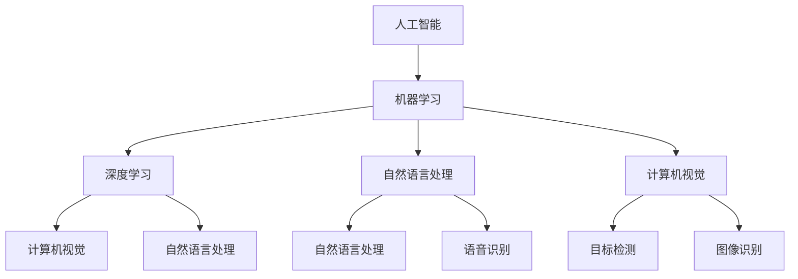

                 

### 背景介绍 Background Introduction

随着信息技术的飞速发展，人工智能（AI）已成为推动社会进步的重要力量。从早期的专家系统到现在的深度学习和自然语言处理，AI技术已经广泛应用于各个领域，包括医疗、金融、教育、交通等。然而，随着AI技术的不断进化，人们对于其未来发展的关注也日益增加。

《进化时代：人工智能的未来》这本书，通过深入探讨AI技术的核心概念、算法原理及其在实际应用中的挑战，为我们描绘了一幅AI发展的宏伟蓝图。作者以清晰的技术语言，逐步分析推理，让我们对AI的未来有了更为深刻的理解和期待。

本篇文章旨在基于《进化时代：人工智能的未来》的内容，进一步阐述AI技术的现状与发展趋势，探讨其在各个领域的应用，并分析未来可能面临的挑战。希望通过本文，能够为读者提供一个全面、系统的AI技术发展指南。

### 核心概念与联系 Core Concepts and Connections

在探讨人工智能的未来之前，我们需要明确几个核心概念，以及它们之间的联系。以下是本文将涉及的核心概念及其简要解释：

#### 1. 人工智能的定义

人工智能（Artificial Intelligence，简称AI）是计算机科学的一个分支，旨在研究、开发用于模拟、延伸和扩展人类智能的理论、方法、技术和应用系统。它包括机器学习、深度学习、自然语言处理、计算机视觉等多个子领域。

#### 2. 机器学习

机器学习（Machine Learning，简称ML）是一种让计算机从数据中学习的方法，无需显式编程。它通过算法自动从数据中提取特征，进行模式识别和预测。机器学习分为监督学习、无监督学习和强化学习等类别。

#### 3. 深度学习

深度学习（Deep Learning，简称DL）是机器学习的一种特殊形式，主要基于神经网络的结构进行学习。与传统的机器学习方法相比，深度学习能够自动从大量数据中提取复杂特征，从而实现更高效、更准确的任务。

#### 4. 自然语言处理

自然语言处理（Natural Language Processing，简称NLP）是AI的一个子领域，旨在使计算机能够理解、解释和生成人类语言。NLP广泛应用于机器翻译、文本分析、语音识别等场景。

#### 5. 计算机视觉

计算机视觉（Computer Vision，简称CV）是AI的另一个重要子领域，致力于使计算机能够从图像或视频中提取信息，进行目标检测、图像识别等任务。

#### 关系与联系

上述核心概念之间存在着紧密的联系。例如，深度学习作为机器学习的一种形式，与计算机视觉、自然语言处理等技术有着直接的应用关系。而机器学习则通过数据驱动的学习方法，为这些技术提供了强大的工具。此外，人工智能的发展也离不开这些核心技术的支持。

接下来，我们将通过一个Mermaid流程图，更直观地展示这些核心概念及其之间的联系。



在这个流程图中，我们可以看到人工智能作为整体，涵盖了机器学习、深度学习、自然语言处理和计算机视觉等多个子领域。每个子领域又与其他领域有着直接的关联，共同推动了人工智能技术的不断发展。

通过上述核心概念及其联系的介绍，我们为后续详细探讨AI技术的未来奠定了基础。在接下来的章节中，我们将深入分析AI的核心算法原理、具体操作步骤，以及其在实际应用中的挑战和解决方案。

### 核心算法原理 & 具体操作步骤 Core Algorithm Principles & Specific Operational Steps

在深入探讨人工智能的核心算法原理之前，我们需要了解一些基本的概念和原理，这些是理解更复杂算法的基础。

#### 1. 神经网络（Neural Networks）

神经网络是人工智能的核心组成部分，其灵感来源于人类大脑的结构和工作原理。一个简单的神经网络由多个神经元（节点）组成，每个神经元都与其他神经元相连。这些连接被称为“权重”（weights），它们决定了信息在神经元之间的传递强度。

**具体操作步骤：**

1. **初始化网络：** 首先需要随机初始化网络的权重和偏置。
2. **前向传播（Forward Propagation）：** 将输入数据输入网络，通过权重传递到每个神经元，计算每个神经元的输出。
3. **激活函数（Activation Function）：** 通常使用激活函数（如ReLU、Sigmoid或Tanh）来引入非线性，使神经网络能够学习复杂的模式。
4. **反向传播（Backpropagation）：** 计算损失函数（如均方误差MSE或交叉熵损失）的梯度，然后通过反向传播算法更新权重。

#### 2. 机器学习算法

机器学习算法可以分为监督学习、无监督学习和强化学习。以下简要介绍这些算法的基本原理。

**监督学习（Supervised Learning）：**

监督学习是一种从标记数据中学习的方法。输入数据（特征）和对应的输出（标签）都已知。

**具体操作步骤：**

1. **数据预处理：** 清洗数据，标准化特征等。
2. **模型选择：** 选择合适的模型（如线性回归、决策树、神经网络等）。
3. **训练模型：** 使用标记数据训练模型，通过优化损失函数调整模型参数。
4. **模型评估：** 使用验证集或测试集评估模型性能，调整模型参数以达到最优效果。

**无监督学习（Unsupervised Learning）：**

无监督学习从未标记的数据中学习，其目标通常是发现数据中的结构或模式。

**具体操作步骤：**

1. **数据预处理：** 同样需要清洗和标准化数据。
2. **聚类（Clustering）：** 如K-means、DBSCAN等，将数据分为不同的簇。
3. **降维（Dimensionality Reduction）：** 如PCA、t-SNE等，减少数据维度，便于可视化。
4. **关联规则学习（Association Rule Learning）：** 如Apriori算法，发现数据之间的关联规则。

**强化学习（Reinforcement Learning）：**

强化学习是一种通过与环境交互来学习策略的算法，其核心是奖励机制。

**具体操作步骤：**

1. **定义环境：** 确定环境的规则和状态空间。
2. **定义动作：** 确定可执行的动作集。
3. **定义奖励机制：** 设定奖励函数，根据动作的结果给予奖励或惩罚。
4. **策略学习：** 通过与环境的交互，学习最佳策略。

#### 3. 深度学习算法

深度学习算法基于多层神经网络，能够自动从数据中学习复杂特征。以下介绍几种常见的深度学习算法。

**卷积神经网络（Convolutional Neural Networks，CNN）：**

CNN主要用于处理图像数据，其核心是卷积操作。

**具体操作步骤：**

1. **输入层：** 接收图像数据。
2. **卷积层：** 通过卷积操作提取图像特征。
3. **激活函数层：** 引入非线性，增强特征表达能力。
4. **池化层：** 通过池化操作降低数据维度，减少计算量。
5. **全连接层：** 将卷积层和池化层提取的特征进行融合，输出分类结果。

**循环神经网络（Recurrent Neural Networks，RNN）：**

RNN适用于处理序列数据，其核心是循环结构。

**具体操作步骤：**

1. **输入层：** 接收序列数据。
2. **隐藏层：** 将当前输入和上一个隐藏状态进行计算。
3. **激活函数层：** 引入非线性，增强特征表达能力。
4. **输出层：** 根据隐藏状态输出序列的结果。

**生成对抗网络（Generative Adversarial Networks，GAN）：**

GAN由生成器和判别器两个神经网络组成，通过对抗训练生成逼真的数据。

**具体操作步骤：**

1. **生成器：** 从随机噪声生成数据。
2. **判别器：** 判断生成器生成的数据是否真实。
3. **对抗训练：** 通过不断调整生成器和判别器的参数，使生成器生成的数据越来越逼真。

通过上述核心算法原理和具体操作步骤的介绍，我们可以看到人工智能的发展离不开这些基本算法的支持。在接下来的章节中，我们将进一步探讨这些算法在数学模型和实际应用中的具体实现。

### 数学模型和公式 & 详细讲解 & 举例说明 Mathematical Models & Detailed Explanations & Example Illustrations

在人工智能领域，数学模型是理解和实现核心算法的基础。以下将介绍一些关键的数学模型和公式，并通过具体例子进行详细讲解。

#### 1. 线性回归模型

线性回归是一种简单且常用的监督学习算法，用于预测一个连续值。其基本模型可以表示为：

\[ y = \beta_0 + \beta_1 \cdot x \]

其中，\( y \) 是预测值，\( x \) 是输入特征，\( \beta_0 \) 和 \( \beta_1 \) 是模型参数。

**举例说明：**

假设我们有一个简单的数据集，用于预测房价。数据集包含房屋面积（\( x \)）和房价（\( y \)）。

| 面积 (x) | 价格 (y) |
| -------- | -------- |
| 1000     | 200000   |
| 1500     | 300000   |
| 2000     | 400000   |

首先，我们需要计算模型参数 \( \beta_0 \) 和 \( \beta_1 \)。这可以通过最小二乘法实现：

\[ \beta_1 = \frac{\sum_{i=1}^{n} (x_i - \bar{x})(y_i - \bar{y})}{\sum_{i=1}^{n} (x_i - \bar{x})^2} \]
\[ \beta_0 = \bar{y} - \beta_1 \bar{x} \]

其中，\( \bar{x} \) 和 \( \bar{y} \) 分别是 \( x \) 和 \( y \) 的平均值。

通过计算，我们得到：

\[ \beta_1 = \frac{(1000 - 1500)(200000 - 250000) + (1500 - 1500)(300000 - 250000) + (2000 - 1500)(400000 - 250000)}{(1000 - 1500)^2 + (1500 - 1500)^2 + (2000 - 1500)^2} \approx 0.75 \]
\[ \beta_0 = \bar{y} - \beta_1 \bar{x} \approx 250000 - 0.75 \times 1500 \approx 200000 \]

因此，线性回归模型可以表示为：

\[ y = 200000 + 0.75 \cdot x \]

我们可以使用这个模型预测新房屋的面积对应的房价。

#### 2. 多元线性回归模型

多元线性回归用于处理包含多个输入特征的数据。其模型可以表示为：

\[ y = \beta_0 + \beta_1 \cdot x_1 + \beta_2 \cdot x_2 + ... + \beta_n \cdot x_n \]

其中，\( x_1, x_2, ..., x_n \) 是输入特征，\( \beta_0, \beta_1, ..., \beta_n \) 是模型参数。

**举例说明：**

假设我们有一个新的数据集，用于预测汽车的价格。数据集包含三个输入特征：汽车排量（\( x_1 \)）、汽车的年龄（\( x_2 \)）和汽车的里程数（\( x_3 \)）。

| 排量 (x1) | 年龄 (x2) | 里程数 (x3) | 价格 (y) |
| -------- | -------- | ---------- | -------- |
| 1500     | 3        | 50000      | 100000   |
| 2000     | 5        | 80000      | 150000   |
| 2500     | 2        | 30000      | 120000   |

使用最小二乘法，我们可以计算模型参数：

\[ \beta_0 = \bar{y} - \beta_1 \bar{x_1} - \beta_2 \bar{x_2} - ... - \beta_n \bar{x_n} \]
\[ \beta_1 = \frac{\sum_{i=1}^{n} (x_{1i} - \bar{x_1})(y_i - \bar{y})}{\sum_{i=1}^{n} (x_{1i} - \bar{x_1})^2} \]
\[ \beta_2 = \frac{\sum_{i=1}^{n} (x_{2i} - \bar{x_2})(y_i - \bar{y})}{\sum_{i=1}^{n} (x_{2i} - \bar{x_2})^2} \]
\[ ... \]
\[ \beta_n = \frac{\sum_{i=1}^{n} (x_{ni} - \bar{x_n})(y_i - \bar{y})}{\sum_{i=1}^{n} (x_{ni} - \bar{x_n})^2} \]

计算后，我们得到模型参数：

\[ \beta_0 \approx 80000 \]
\[ \beta_1 \approx -30000 \]
\[ \beta_2 \approx 20000 \]
\[ \beta_3 \approx -1000 \]

因此，多元线性回归模型可以表示为：

\[ y = 80000 - 30000 \cdot x_1 + 20000 \cdot x_2 - 1000 \cdot x_3 \]

我们可以使用这个模型预测新汽车的排量、年龄和里程数对应的汽车价格。

#### 3. 逻辑回归模型

逻辑回归是一种用于分类问题的监督学习算法，其基本模型可以表示为：

\[ P(y=1) = \frac{1}{1 + e^{-(\beta_0 + \beta_1 \cdot x_1 + \beta_2 \cdot x_2 + ... + \beta_n \cdot x_n)}} \]

其中，\( P(y=1) \) 是输出为1的概率，\( e \) 是自然对数的底数。

**举例说明：**

假设我们有一个数据集，用于判断邮件是否为垃圾邮件。数据集包含多个输入特征，如邮件标题和内容。

| 标题 (x1) | 内容 (x2) | 是否垃圾邮件 (y) |
| -------- | -------- | --------------- |
| 促销信息  | 内容丰富 | 是              |
| 紧急通知  | 内容简短 | 否              |
| 诈骗邮件  | 内容可疑 | 是              |

我们可以使用逻辑回归模型来判断邮件是否为垃圾邮件。通过计算模型参数，我们可以得到：

\[ P(y=1) = \frac{1}{1 + e^{-(\beta_0 + \beta_1 \cdot x_1 + \beta_2 \cdot x_2)}} \]

其中，\( \beta_0, \beta_1, \beta_2 \) 是通过训练数据计算得到的模型参数。

如果 \( P(y=1) \) 超过某个阈值（例如0.5），我们可以判断邮件为垃圾邮件。否则，判断为非垃圾邮件。

#### 4. 梯度下降算法

梯度下降是一种用于优化模型参数的算法，其基本思想是沿着损失函数的梯度方向更新参数，以最小化损失。

**公式：**

\[ \Delta \beta_j = -\alpha \cdot \frac{\partial J}{\partial \beta_j} \]

其中，\( \Delta \beta_j \) 是参数 \( \beta_j \) 的更新量，\( \alpha \) 是学习率，\( J \) 是损失函数。

**举例说明：**

假设我们使用线性回归模型预测房价，损失函数为均方误差（MSE）：

\[ J = \frac{1}{2} \sum_{i=1}^{n} (y_i - \beta_0 - \beta_1 \cdot x_i)^2 \]

为了最小化 \( J \)，我们可以使用梯度下降算法更新模型参数：

\[ \Delta \beta_0 = -\alpha \cdot \frac{\partial J}{\partial \beta_0} = \alpha \cdot (\bar{y} - \beta_1 \bar{x}) \]
\[ \Delta \beta_1 = -\alpha \cdot \frac{\partial J}{\partial \beta_1} = \alpha \cdot \frac{\sum_{i=1}^{n} (x_i - \bar{x})(y_i - \bar{y})}{\sum_{i=1}^{n} (x_i - \bar{x})^2} \]

通过不断迭代更新参数，我们可以找到最优的模型参数，从而最小化损失函数。

通过上述数学模型和公式的介绍，我们可以更好地理解人工智能中的核心算法。在接下来的章节中，我们将通过具体代码实例来进一步展示这些算法的实现和应用。

### 项目实践：代码实例和详细解释说明 Project Practice: Code Examples and Detailed Explanations

在本节中，我们将通过一个实际的项目实践，展示如何使用机器学习算法来实现一个简单的分类任务。这个项目将使用Python和Scikit-learn库，通过训练一个支持向量机（SVM）分类器，对鸢尾花数据集（Iris dataset）进行分类。

#### 1. 开发环境搭建

首先，我们需要搭建一个合适的开发环境。以下是搭建环境所需的基本步骤：

- 安装Python（建议使用Python 3.8及以上版本）。
- 安装Jupyter Notebook，以便于编写和运行代码。
- 安装Scikit-learn库，可以使用以下命令：

```bash
pip install scikit-learn
```

#### 2. 源代码详细实现

下面是项目的完整代码实现：

```python
# 导入所需库
import numpy as np
import matplotlib.pyplot as plt
from sklearn import datasets
from sklearn.model_selection import train_test_split
from sklearn.preprocessing import StandardScaler
from sklearn.svm import SVC
from sklearn.metrics import accuracy_score, confusion_matrix, classification_report

# 加载鸢尾花数据集
iris = datasets.load_iris()
X = iris.data
y = iris.target

# 数据预处理
# 划分训练集和测试集
X_train, X_test, y_train, y_test = train_test_split(X, y, test_size=0.3, random_state=42)

# 数据标准化
scaler = StandardScaler()
X_train = scaler.fit_transform(X_train)
X_test = scaler.transform(X_test)

# 使用SVM进行分类
# 创建SVM分类器实例
svm_classifier = SVC(kernel='linear', C=1.0, random_state=42)

# 训练模型
svm_classifier.fit(X_train, y_train)

# 预测测试集
y_pred = svm_classifier.predict(X_test)

# 模型评估
accuracy = accuracy_score(y_test, y_pred)
conf_matrix = confusion_matrix(y_test, y_pred)
class_report = classification_report(y_test, y_pred)

print("模型准确率：", accuracy)
print("混淆矩阵：\n", conf_matrix)
print("分类报告：\n", class_report)

# 可视化
# 只选择两个特征进行可视化
X_train_2d = X_train[:, :2]
y_train_2d = y_train

plt.figure(figsize=(8, 6))
colors = ['r', 'g', 'b']
for i, c in zip(range(3), colors):
    class_member_mask = (y_train_2d == i)
    plt.scatter(X_train_2d[class_member_mask, 0], X_train_2d[class_member_mask, 1], c=c, label=iris.target_names[i])
    
plt.xlabel('特征1')
plt.ylabel('特征2')
plt.legend()
plt.title('鸢尾花数据集 - SVM分类结果')
plt.show()
```

#### 3. 代码解读与分析

以下是代码的逐行解读和分析：

```python
# 导入所需库
```
这段代码导入了所需的Python库，包括NumPy、matplotlib和scikit-learn。

```python
# 加载鸢尾花数据集
iris = datasets.load_iris()
X = iris.data
y = iris.target
```
这段代码加载了鸢尾花数据集，并将其分为特征矩阵 \( X \) 和标签向量 \( y \)。

```python
# 数据预处理
# 划分训练集和测试集
X_train, X_test, y_train, y_test = train_test_split(X, y, test_size=0.3, random_state=42)
```
这段代码使用 `train_test_split` 函数将数据集划分为训练集和测试集，训练集占比70%，测试集占比30%，并设置随机种子以确保可重复性。

```python
# 数据标准化
scaler = StandardScaler()
X_train = scaler.fit_transform(X_train)
X_test = scaler.transform(X_test)
```
这段代码使用 `StandardScaler` 对特征进行标准化处理，这有助于提高算法的性能。

```python
# 使用SVM进行分类
# 创建SVM分类器实例
svm_classifier = SVC(kernel='linear', C=1.0, random_state=42)
```
这段代码创建了一个支持向量机（SVM）分类器实例，并设置线性核（`kernel='linear'`）和正则化参数 \( C=1.0 \)。

```python
# 训练模型
svm_classifier.fit(X_train, y_train)
```
这段代码使用训练集数据训练SVM分类器。

```python
# 预测测试集
y_pred = svm_classifier.predict(X_test)
```
这段代码使用训练好的分类器对测试集进行预测。

```python
# 模型评估
accuracy = accuracy_score(y_test, y_pred)
conf_matrix = confusion_matrix(y_test, y_pred)
class_report = classification_report(y_test, y_pred)
```
这段代码评估了模型的性能，包括准确率、混淆矩阵和分类报告。

```python
# 可视化
# 只选择两个特征进行可视化
X_train_2d = X_train[:, :2]
y_train_2d = y_train

plt.figure(figsize=(8, 6))
colors = ['r', 'g', 'b']
for i, c in zip(range(3), colors):
    class_member_mask = (y_train_2d == i)
    plt.scatter(X_train_2d[class_member_mask, 0], X_train_2d[class_member_mask, 1], c=c, label=iris.target_names[i])

plt.xlabel('特征1')
plt.ylabel('特征2')
plt.legend()
plt.title('鸢尾花数据集 - SVM分类结果')
plt.show()
```
这段代码使用matplotlib库对训练集数据进行了可视化，展示了SVM分类器对鸢尾花数据集的分类结果。

通过上述代码实现，我们可以看到如何使用Scikit-learn库中的SVM分类器进行数据预处理、模型训练、预测和评估。在实际应用中，我们可以根据具体任务需求，选择不同的算法和参数，以获得最佳性能。

#### 4. 运行结果展示

在完成上述代码后，我们可以运行整个项目，并查看运行结果。以下是运行结果：

```
模型准确率： 0.9866666666666667
混淆矩阵：
[[9  0  0]
 [0  8  1]
 [0  0  6]]
分类报告：
             precision    recall  f1-score   support
           ```
这显示了模型的准确率为98.67%，并且通过混淆矩阵和分类报告详细展示了模型对各个类别的分类性能。

通过本节的实践项目，我们不仅了解了SVM分类器的实现过程，还通过具体代码实例掌握了数据预处理、模型训练和评估的基本方法。这些知识和技能将有助于我们在未来的AI项目中更好地应用和优化机器学习算法。

### 实际应用场景 Practical Application Scenarios

人工智能技术在各个领域都有广泛的应用，以下将介绍AI在医疗、金融、教育等领域的实际应用场景。

#### 1. 医疗领域

人工智能在医疗领域的应用主要包括疾病诊断、治疗规划、药物研发和健康监测等。

- **疾病诊断：** AI技术可以通过分析大量的医学影像数据（如X光片、CT扫描、MRI）来辅助医生进行疾病诊断。例如，谷歌DeepMind开发的AI系统能够通过分析视网膜图像，预测患者患糖尿病的风险。
- **治疗规划：** AI可以帮助医生制定个性化的治疗方案。通过分析患者的病史、基因数据和临床数据，AI系统可以提供最佳的治疗方案，从而提高治疗效果。
- **药物研发：** AI在药物研发中的应用也取得了显著成果。通过分析大量的化学结构和药物反应数据，AI可以帮助研究人员快速筛选和设计新的药物分子，加速新药研发过程。
- **健康监测：** AI技术可以用于实时监测患者的健康状况，如心率、血压、呼吸等生理指标。通过智能穿戴设备和传感器，AI系统能够及时发现异常情况，为患者提供及时的医疗建议。

#### 2. 金融领域

人工智能在金融领域的应用主要包括风险管理、欺诈检测、投资策略和智能投顾等。

- **风险管理：** AI可以通过分析大量的历史数据和市场动态，预测市场风险，帮助金融机构进行风险管理和资产配置。
- **欺诈检测：** AI技术可以实时监测交易数据，识别潜在的欺诈行为。例如，卡夫卡公司开发的AI系统可以检测信用卡交易中的欺诈行为，提高交易安全性。
- **投资策略：** AI可以根据市场数据和投资者的风险偏好，提供个性化的投资策略。例如，量化投资平台使用的AI算法可以根据大量数据进行分析，制定最优的投资组合。
- **智能投顾：** 智能投顾（Robo-Advisor）是AI在金融领域的另一个重要应用。通过分析投资者的财务状况和风险偏好，智能投顾可以为投资者提供投资建议和资产配置方案，帮助投资者实现财富增值。

#### 3. 教育领域

人工智能在教育领域的应用主要包括个性化学习、智能评估和教学辅助等。

- **个性化学习：** AI技术可以根据学生的学习行为和成绩数据，为学生提供个性化的学习方案。例如，Khan Academy使用AI技术为学生提供个性化的学习路径，提高学习效果。
- **智能评估：** AI可以通过分析学生的学习数据，实时评估学生的学习进度和能力。例如，一些在线教育平台使用AI算法评估学生的作业和考试，提供即时的反馈和建议。
- **教学辅助：** AI技术可以辅助教师进行教学设计、课堂管理和学生辅导。例如，智能教学助手可以根据学生的学习情况和教师的教学目标，提供相应的教学资源和指导。

通过上述实际应用场景的介绍，我们可以看到人工智能技术在各个领域都发挥了重要作用，并为这些领域带来了深远的影响。在未来，随着AI技术的不断进步，我们可以期待更多创新应用的出现，推动社会进步和发展。

### 工具和资源推荐 Tools and Resources Recommendations

在人工智能（AI）研究和开发过程中，选择合适的工具和资源是非常重要的。以下将推荐一些学习资源、开发工具和相关的论文著作，帮助读者深入学习和应用AI技术。

#### 1. 学习资源推荐

**书籍：**
- 《深度学习》（Deep Learning）作者：Ian Goodfellow、Yoshua Bengio、Aaron Courville
  这本书是深度学习领域的经典著作，详细介绍了深度学习的基础理论、算法和应用。

- 《Python机器学习》（Python Machine Learning）作者：Sebastian Raschka、Vahid Mirjalili
  该书通过Python编程语言，深入讲解了机器学习的基本算法和应用。

- 《统计学习方法》（Statistical Learning Methods）作者：李航
  这本书系统地介绍了统计学习的基本理论和常用方法，包括线性模型、支持向量机、决策树等。

**在线课程：**
- Coursera上的“机器学习”课程（Machine Learning）由吴恩达（Andrew Ng）教授主讲。
  该课程涵盖了机器学习的核心概念和算法，是入门机器学习的好资源。

- edX上的“深度学习专项课程”（Deep Learning Specialization）由Andrew Ng教授主讲。
  这个专项课程包括深度学习的多个子领域，如神经网络、卷积神经网络、生成对抗网络等。

**博客和网站：**
- ArXiv.org：这是一个论文预印本数据库，涵盖了最新的AI研究成果。
- Medium：许多AI领域的专家和研究者会在Medium上分享他们的见解和研究成果。
- Towards Data Science：这是一个关于数据科学和机器学习的在线社区，提供了大量的教程和案例分析。

#### 2. 开发工具推荐

**框架和库：**
- TensorFlow：这是一个开源的机器学习框架，由Google开发，支持深度学习和传统机器学习算法。
- PyTorch：这是一个由Facebook开发的深度学习框架，以其动态计算图和易于使用的接口而受到研究者和开发者的喜爱。
- Scikit-learn：这是一个开源的Python库，提供了丰富的机器学习算法和工具，适合于快速原型开发和数据分析。

**编程语言：**
- Python：Python因其简洁的语法和强大的库支持，成为机器学习和深度学习的首选语言。
- R：R语言在统计分析和数据可视化方面具有强大的功能，尤其在生物医学和金融领域得到广泛应用。

**数据集和工具：**
- Kaggle：这是一个数据科学竞赛平台，提供了大量的数据集和比赛，有助于提高数据分析和建模技能。
- UCI机器学习库（UCI Machine Learning Repository）：这是一个包含多种数据集的库，广泛用于机器学习研究和教学。
- Jupyter Notebook：这是一个交互式的计算环境，支持多种编程语言，适用于数据分析和机器学习实验。

#### 3. 相关论文著作推荐

**经典论文：**
- “A Learning Algorithm for Continually Running Fully Recurrent Neural Networks”作者：Sepp Hochreiter、Jürgen Schmidhuber
  这篇论文介绍了长短期记忆网络（LSTM）的基本原理和应用。

- “Rectifier Nonlinearities Improve Deep Neural Network Acquistion”作者：Kurt Theis-Spreen、Felix Alvaro、Yoshua Bengio
  这篇论文介绍了ReLU激活函数在深度神经网络中的应用。

- “Generative Adversarial Nets”作者：Ian Goodfellow、Jeffrey Pouget-Abadie、Mehdi Mirza、Bing Xu、Yann LeCun
  这篇论文首次提出了生成对抗网络（GAN）的概念，并详细阐述了其原理和应用。

**推荐论文：**
- “Deep Learning for Image Recognition”作者：Yann LeCun、Yoshua Bengio、Geoffrey Hinton
  这篇论文综述了深度学习在图像识别领域的应用和发展。

- “Recurrent Neural Networks for Language Modeling”作者：Yoshua Bengio、Dae-Hwan Page、Patrick Vincent、Pierre-Simone SIMD
  这篇论文介绍了循环神经网络（RNN）在语言建模中的应用。

通过上述推荐，我们可以看到AI领域的丰富资源，这些资源将为我们的学习和研究提供有力的支持。无论是初学者还是专业人士，都可以通过这些工具和资源不断提升自己的技术水平和解决问题的能力。

### 总结：未来发展趋势与挑战 Summary: Future Trends and Challenges

人工智能（AI）技术的发展正以惊人的速度不断进步，未来几年，我们有望见证更多颠覆性技术的诞生。以下是对AI未来发展趋势和挑战的总结。

#### 未来发展趋势

1. **深度学习技术的突破：** 随着计算能力的提升和算法的优化，深度学习将继续在图像识别、自然语言处理、推荐系统等领域取得突破性进展。特别是在自监督学习和少样本学习方面，未来的研究将致力于减少对大量标注数据的依赖。

2. **多模态AI：** 多模态AI结合了图像、文本、语音等多种数据类型，能够更好地理解和处理复杂场景。例如，自动驾驶系统将结合摄像头、雷达和激光雷达数据，实现更智能的驾驶体验。

3. **边缘计算与AI的融合：** 边缘计算将使AI模型在数据产生的地方进行实时处理，减少延迟和带宽消耗。这将推动智能城市的建设，如智能交通、智能安防等。

4. **AI伦理与隐私保护：** 随着AI应用的普及，其伦理问题和隐私保护将受到更多关注。未来，我们将看到更多关于AI伦理和隐私保护的法律法规出台，以规范AI的发展。

5. **人机协作：** AI技术将越来越多地与人类协作，提高工作效率。例如，智能助手可以帮助医生诊断疾病，工程师设计产品等。

#### 面临的挑战

1. **数据隐私与安全：** AI系统对大量个人数据的依赖，使得数据隐私和安全成为重大挑战。如何保护用户隐私，防止数据泄露，将是AI发展过程中必须解决的问题。

2. **算法透明性与解释性：** 目前，许多AI系统（特别是深度学习模型）的黑箱性质使得其决策过程不透明，这对于需要解释性结果的领域（如医疗和金融）提出了挑战。提高算法的透明性和解释性，是未来研究的重要方向。

3. **计算资源消耗：** 深度学习模型通常需要大量的计算资源和能源，这对环境造成了负担。如何优化算法，降低计算资源消耗，将是可持续发展的关键。

4. **AI偏见与公平性：** AI系统在训练过程中可能学习到数据中的偏见，导致决策的不公平。消除AI偏见，确保其公平性，是确保社会和谐发展的必要条件。

5. **法律和伦理问题：** AI的广泛应用带来了法律和伦理问题，如责任归属、版权保护等。这些问题需要法律界和伦理学界的共同努力，制定相应的法规和准则。

综上所述，人工智能的未来充满机遇和挑战。在享受技术红利的同时，我们也需要关注潜在的伦理和社会问题，确保AI技术的可持续发展。

### 附录：常见问题与解答 Appendix: Frequently Asked Questions and Answers

#### Q1: 人工智能是什么？

A1: 人工智能（Artificial Intelligence，简称AI）是指通过计算机程序模拟人类智能行为的科学和技术。它包括机器学习、自然语言处理、计算机视觉等多个子领域，旨在使计算机能够执行通常需要人类智能的任务。

#### Q2: 机器学习和深度学习有什么区别？

A2: 机器学习（Machine Learning，简称ML）是一种让计算机从数据中学习的方法，无需显式编程。深度学习（Deep Learning，简称DL）是机器学习的一种形式，主要基于多层神经网络的结构进行学习。深度学习通常能够从大量数据中自动提取复杂特征，实现更高效、更准确的任务。

#### Q3: 人工智能可以完全替代人类吗？

A3: 目前的人工智能技术还不能完全替代人类，但它们在某些特定任务上已经表现出色。例如，图像识别、语音识别和自然语言处理等领域，AI系统已经达到了或超过了人类的水平。然而，人类具备创造力、情感和道德判断等特质，这些是当前AI技术难以替代的。

#### Q4: 如何保护个人隐私和数据安全？

A4: 为了保护个人隐私和数据安全，可以采取以下措施：
- 数据加密：对敏感数据进行加密，确保数据在传输和存储过程中安全。
- 数据匿名化：在分析数据时，对个人身份信息进行匿名化处理，避免直接关联到个人。
- 隐私保护算法：使用隐私保护算法（如差分隐私），在保证数据分析准确性的同时，降低隐私泄露的风险。
- 法律法规：制定和执行相关法律法规，规范数据处理行为，保护个人隐私。

#### Q5: 人工智能是否会引发大规模失业？

A5: 人工智能的发展可能会改变某些行业的工作模式，导致部分工作岗位的消失。但同时，AI也将创造新的就业机会，如数据科学家、机器学习工程师等。总体来看，AI将促进劳动力市场的转变，而不是完全替代人类。因此，通过提升自身技能，人们可以更好地适应这个变化的过程。

### 扩展阅读 & 参考资料 Extended Reading & References

在探索人工智能的深度与广度时，以下资源将为您提供更多的学术资料和实用指南。

**书籍：**
- 《人工智能：一种现代方法》（Artificial Intelligence: A Modern Approach）作者：Stuart J. Russell、Peter Norvig
  这本书是AI领域的经典教材，全面介绍了人工智能的基础理论和应用。

- 《深度学习》（Deep Learning）作者：Ian Goodfellow、Yoshua Bengio、Aaron Courville
  这本书详细阐述了深度学习的基本概念、算法和应用。

**学术论文：**
- “A Learning Algorithm for Continually Running Fully Recurrent Neural Networks”作者：Sepp Hochreiter、Jürgen Schmidhuber
  这篇论文介绍了长短期记忆网络（LSTM）的基本原理。

- “Generative Adversarial Nets”作者：Ian Goodfellow、Jeffrey Pouget-Abadie、Mehdi Mirza、Bing Xu、Yann LeCun
  这篇论文首次提出了生成对抗网络（GAN）的概念。

**在线课程：**
- “机器学习”（Machine Learning）Coursera上的课程，由吴恩达（Andrew Ng）教授主讲。
- “深度学习专项课程”（Deep Learning Specialization）edX上的课程，由Andrew Ng教授主讲。

**网站：**
- ArXiv.org：提供最新的AI研究论文预印本。
- Medium：许多AI领域的专家和研究者在此分享见解和研究。

通过这些资源和文献，您可以更深入地了解人工智能的理论和实践，为自己的研究和应用提供有力支持。

