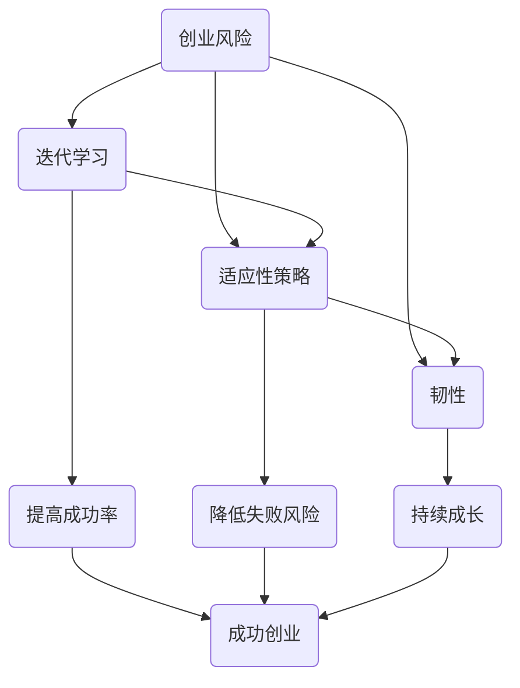

                 

### 1. 背景介绍

在当代快速发展的创业环境中，连续创业者成为了一个引人注目的群体。他们不断尝试新的创业项目，经历着成功与失败的交替。然而，正是这种不断尝试和反思的过程，使得他们能够不断成长和进步。本文将以《连续创业者的经验之谈：如何从失败中吸取教训》为题，深入探讨连续创业者如何从失败中吸取经验，实现持续成功。

首先，我们需要明确什么是连续创业者。连续创业者是指那些经历了一次或多次创业失败，但依然选择继续创业的人。他们通常具有强烈的创新意识、坚定的信念和坚韧不拔的精神。在全球经济充满不确定性的今天，连续创业者的经验对于其他创业者具有重要的借鉴意义。

从失败中吸取教训是连续创业者成功的关键之一。每一次失败都是一个宝贵的经验，都是一次成长的机会。正如著名企业家史蒂夫·乔布斯所说：“失败是成功之母。”只有通过不断失败，不断总结经验教训，创业者才能找到成功的路径。那么，连续创业者是如何从失败中吸取教训的呢？

### 1.1 失败的普遍性

首先，连续创业者认识到失败是创业过程中不可避免的一部分。他们不再将失败视为一种负面的标签，而是将其视为一种成长的机会。这种心态的转变使得他们能够更加客观地看待失败，从而更好地从失败中吸取教训。

### 1.2 反思失败原因

从失败中吸取教训的第一步是反思失败的原因。连续创业者会花费大量的时间去分析失败的原因，无论是市场调研不足、产品定位不准确，还是团队管理不当，他们都会一一梳理，找出问题的根源。这种反思的过程不仅有助于他们理解失败的原因，也为他们提供了改进的方向。

### 1.3 学习借鉴他人经验

除了自我反思，连续创业者还会积极学习借鉴他人的经验。他们会阅读相关书籍、论文，关注行业动态，与成功的创业者交流，甚至参加各种创业培训课程。通过这些方式，他们能够获得更多的视角和经验，从而更好地应对创业中的挑战。

### 1.4 优化和调整策略

在反思失败原因和学习他人经验的基础上，连续创业者会根据实际情况对创业策略进行优化和调整。他们可能会重新审视市场定位，改进产品功能，调整团队结构，甚至改变创业方向。这种灵活的应对策略使得他们能够在竞争激烈的市场中找到突破口。

### 1.5 坚定的信念和毅力

最后，连续创业者的成功离不开他们坚定的信念和毅力。在面临挫折和困难时，他们能够保持积极的心态，坚持不懈地追求目标。正是这种坚定的信念和毅力，使得他们能够在失败中找到希望，继续前行。

总之，连续创业者通过反思失败原因、学习借鉴他人经验、优化调整策略以及坚定的信念和毅力，从失败中吸取教训，实现持续成功。他们的经验对于其他创业者具有重要的借鉴意义。在接下来的章节中，我们将进一步探讨连续创业者如何将失败转化为成功，如何在创业道路上不断前进。

### 2. 核心概念与联系

在探讨连续创业者如何从失败中吸取教训之前，我们需要明确几个核心概念，这些概念包括创业风险、迭代学习、适应性策略和韧性。理解这些概念及其相互关系，将有助于我们更全面地理解创业者的成长路径。

#### 2.1 创业风险

创业风险是指在创业过程中可能面临的各种不确定性因素，包括市场风险、财务风险、技术风险等。连续创业者需要认识到创业风险的普遍性，并在创业过程中学会如何应对这些风险。创业风险的存在使得创业者必须在不断试错中寻找成功之路。

#### 2.2 迭代学习

迭代学习是一种通过不断重复实验和改进来提高产品或服务质量的方法。在创业过程中，连续创业者通过迭代学习能够快速响应市场变化，不断优化产品功能，提高用户体验。迭代学习使得创业者能够从失败中快速恢复，并在每次迭代中积累宝贵的经验。

#### 2.3 适应性策略

适应性策略是指创业者根据市场环境变化和竞争态势，灵活调整商业计划和运营策略的能力。连续创业者需要具备强大的适应性策略，以便在市场不确定性较高的情况下，快速做出决策并调整方向。适应性策略的灵活性和有效性直接影响到创业者的成功与否。

#### 2.4 韧性

韧性是指个体在面对压力和挑战时，能够迅速恢复和适应的能力。对于连续创业者来说，韧性是他们成功的重要保障。韧性使得创业者能够在失败中找到希望，继续前行，而不是在挫折面前轻易放弃。

#### 2.5 相互关系

这四个核心概念之间存在着紧密的相互关系。创业风险是创业者需要面对的客观存在，通过迭代学习，创业者能够在不断试错中减少风险；适应性策略使得创业者能够灵活应对市场变化，降低风险；而韧性则帮助创业者克服挫折，保持持续的动力和信心。

为了更直观地展示这些概念之间的关系，我们可以使用Mermaid流程图来描述：



在这个流程图中，我们可以看到，创业风险是整个流程的起点，通过迭代学习、适应性策略和韧性，创业者能够提高成功率，降低失败风险，最终实现持续成长和成功创业。

通过理解这些核心概念及其相互关系，连续创业者能够更系统地应对创业中的挑战，从而在失败中找到成功的机会。在接下来的章节中，我们将深入探讨如何将失败转化为成功，连续创业者如何通过实践将这些核心概念应用于创业过程中。

### 3. 核心算法原理 & 具体操作步骤

在探讨如何从失败中吸取教训时，我们需要引入一种核心算法，这种算法不仅能够帮助我们理解和应用连续创业者所采用的方法，还能够为其他创业者提供实用的指导。这里，我们引入“经验学习循环算法”，这是一种结合了迭代学习、适应性策略和韧性的综合算法。

#### 3.1 算法原理

“经验学习循环算法”基于以下三个核心原理：

1. **迭代学习**：通过不断尝试和反馈，逐步优化创业策略。
2. **适应性策略**：根据市场反馈和竞争态势，灵活调整创业方向。
3. **韧性**：在面对失败时，保持积极心态，迅速恢复和调整。

该算法的运行过程可以分为以下几个步骤：

1. **设定初始策略**：根据市场调研和团队资源，制定初始创业策略。
2. **执行策略**：将初始策略付诸实践，实施创业计划。
3. **收集反馈**：通过市场调研、用户反馈等手段，收集策略执行过程中的数据。
4. **分析反馈**：对收集到的反馈进行分析，找出策略中的不足之处。
5. **调整策略**：根据分析结果，对创业策略进行优化和调整。
6. **执行新策略**：将调整后的策略重新付诸实践。
7. **循环迭代**：重复执行上述步骤，不断优化创业策略。

#### 3.2 具体操作步骤

以下是“经验学习循环算法”的具体操作步骤：

1. **设定初始策略**：

   - **市场调研**：通过问卷调查、竞争对手分析、市场趋势研究等方式，了解目标市场和用户需求。
   - **资源评估**：评估团队资源、资金、技术等，确定初始创业策略的可行性和优先级。
   - **制定策略**：结合市场调研和资源评估结果，制定初始创业策略，包括市场定位、产品/服务设计、营销计划等。

2. **执行策略**：

   - **实施计划**：按照制定的创业策略，启动项目，实施营销计划，推出产品或服务。
   - **监控进度**：定期检查项目进度，确保各项任务按时完成。

3. **收集反馈**：

   - **市场反馈**：通过用户调研、用户反馈、市场占有率等指标，收集市场对产品/服务的反应。
   - **内部反馈**：通过团队会议、工作报告等方式，收集内部对创业策略的反馈。

4. **分析反馈**：

   - **识别问题**：分析市场反馈和内部反馈，找出策略实施中的问题，包括产品/服务不足、市场定位不准、营销策略无效等。
   - **评估影响**：评估问题对创业项目的影响，确定优先级。

5. **调整策略**：

   - **优化产品**：根据用户反馈，优化产品/服务的功能，提高用户体验。
   - **调整营销策略**：根据市场反馈，调整营销策略，提高市场占有率。
   - **改进团队管理**：根据内部反馈，改进团队管理，提高团队效率。

6. **执行新策略**：

   - **重新启动**：根据调整后的策略，重新启动项目，实施新的计划和措施。
   - **跟踪效果**：跟踪新策略的实施效果，确保调整措施的有效性。

7. **循环迭代**：

   - **持续优化**：不断重复上述步骤，持续优化创业策略。
   - **灵活调整**：在市场环境变化时，灵活调整创业策略，保持竞争力。

通过“经验学习循环算法”，连续创业者能够在实践中不断学习和改进，从而在失败中吸取教训，实现持续成功。在接下来的章节中，我们将通过一个实际案例，深入探讨如何具体应用这个算法，以及如何从失败中找到成功的机会。

### 4. 数学模型和公式 & 详细讲解 & 举例说明

在探讨如何从失败中吸取教训时，我们可以借助数学模型来分析和优化创业过程。以下是一个简化的数学模型，用于描述创业过程中的迭代学习和策略调整。该模型将创业过程视为一个优化问题，通过数学公式来描述策略调整的步骤。

#### 4.1 模型假设

1. **目标函数**：创业成功的目标函数可以是利润最大化或市场份额最大化。
2. **约束条件**：包括资源限制、市场需求、竞争态势等。
3. **策略调整**：创业策略调整基于市场反馈和用户满意度。

#### 4.2 数学模型

我们假设初始策略为 \( S_0 \)，市场反馈为 \( F \)，调整后的策略为 \( S_1 \)，目标函数为 \( Z \)。根据经验学习循环算法，我们可以构建以下数学模型：

\[ \text{目标函数}：Z = f(S) \]

\[ \text{约束条件}：g(S) \leq 0 \]

其中：

- \( f(S) \)：目标函数，如利润或市场份额。
- \( g(S) \)：约束条件，如资源限制、市场需求等。

调整策略的步骤如下：

1. **策略评估**：通过市场反馈和用户满意度来评估初始策略 \( S_0 \)。

\[ \text{反馈函数}：F = h(S, M) \]

\[ \text{满意度}：S_M = M - \alpha F \]

其中：

- \( F \)：市场反馈。
- \( M \)：初始策略 \( S_0 \) 的市场表现。
- \( \alpha \)：调整系数，用于调整策略。

2. **策略调整**：根据满意度 \( S_M \) 来调整策略 \( S_1 \)。

\[ S_1 = S_0 + \beta S_M \]

\[ \text{调整系数}：\beta = \frac{1}{\alpha} \]

其中：

- \( S_1 \)：调整后的策略。
- \( \beta \)：调整系数，用于控制调整幅度。

3. **策略优化**：重复执行策略评估和调整步骤，直到找到最优策略。

#### 4.3 举例说明

假设一个初创公司推出了一款新产品，初始策略 \( S_0 \) 是以低成本和高利润为目标。市场反馈显示，用户对产品的满意度较低，主要是由于功能不完善和用户体验差。根据满意度 \( S_M \) 的计算，公司决定调整策略。

1. **策略评估**：

\[ F = h(S_0, M) = \text{满意度} \]

\[ S_M = M - \alpha F \]

假设初始满意度 \( M \) 为50%，调整系数 \( \alpha \) 为0.1。

\[ S_M = 50\% - 0.1 \times (\text{低满意度}) \]

2. **策略调整**：

\[ S_1 = S_0 + \beta S_M \]

假设调整系数 \( \beta \) 为0.1。

\[ S_1 = S_0 + 0.1 \times S_M \]

3. **策略优化**：

公司重新设计产品功能，优化用户体验，并根据新的满意度进行策略调整。经过几次迭代，最终找到满意度最高的策略。

通过上述数学模型和具体例子，我们可以看到，连续创业者如何通过迭代学习和策略调整，从失败中吸取教训，逐步优化创业策略，实现持续成功。在接下来的章节中，我们将通过实际项目案例，进一步探讨如何具体应用这些数学模型和算法。

### 5. 项目实践：代码实例和详细解释说明

在本章节中，我们将通过一个具体的创业项目实践案例，展示如何将前面的理论模型应用到实际项目中，并详细解读项目中的关键代码片段。这个案例将帮助读者更好地理解从失败中吸取教训的具体过程，以及如何通过迭代学习和策略调整实现项目的成功。

#### 5.1 开发环境搭建

首先，我们需要搭建一个基本的开发环境。为了简化说明，我们选择Python作为主要编程语言，因为它具有强大的科学计算和数据处理能力，非常适合创业项目中的迭代学习。

1. **安装Python环境**：

   - 在操作系统（如Windows、MacOS或Linux）上下载并安装Python 3.8及以上版本。
   - 确保安装过程中勾选“Add Python to PATH”选项，以便在命令行中直接运行Python。

2. **安装必需的库**：

   - 打开命令行，使用以下命令安装必要的库：

\[ pip install numpy pandas matplotlib \]

   - 这些库分别用于数据处理、数据可视化和数学计算。

3. **创建项目文件夹**：

   - 在您的计算机上创建一个名为“StartupProject”的项目文件夹，用于存放所有代码和文件。

#### 5.2 源代码详细实现

下面是一个简单的示例，用于模拟一个初创公司的市场反馈和策略调整过程。这个示例将展示如何使用Python实现经验学习循环算法。

```python
import numpy as np
import pandas as pd
import matplotlib.pyplot as plt

# 模拟市场反馈数据
def simulate_feedback(iterations):
    feedback = []
    for i in range(iterations):
        # 假设每次反馈的满意度服从正态分布
        satisfaction = np.random.normal(loc=0.5, scale=0.1)
        feedback.append(satisfaction)
    return feedback

# 策略调整函数
def adjust_strategy(current_strategy, feedback, alpha, beta):
    # 计算满意度修正值
    satisfaction_adjustment = 1 - alpha * np.mean(feedback)
    # 调整策略
    new_strategy = current_strategy + beta * satisfaction_adjustment
    return new_strategy

# 迭代学习过程
def iterative_learning(iterations, initial_strategy, alpha, beta):
    strategies = [initial_strategy]
    for i in range(iterations-1):
        feedback = simulate_feedback(1)
        new_strategy = adjust_strategy(strategies[i], feedback, alpha, beta)
        strategies.append(new_strategy)
    return strategies

# 参数设置
initial_strategy = 0.5  # 初始策略
alpha = 0.1  # 调整系数
beta = 0.1  # 调整系数
iterations = 10  # 迭代次数

# 执行迭代学习
strategies = iterative_learning(iterations, initial_strategy, alpha, beta)

# 结果可视化
plt.plot(strategies)
plt.xlabel('Iterations')
plt.ylabel('Strategy Value')
plt.title('Iterative Learning Process')
plt.show()
```

#### 5.3 代码解读与分析

1. **模拟市场反馈数据**：

   ```python
   def simulate_feedback(iterations):
       feedback = []
       for i in range(iterations):
           satisfaction = np.random.normal(loc=0.5, scale=0.1)
           feedback.append(satisfaction)
       return feedback
   ```

   这个函数用于模拟市场反馈数据。假设每次反馈的满意度服从正态分布，均值为0.5，标准差为0.1。通过随机生成满意度值，我们模拟了不同迭代次数下的市场反馈。

2. **策略调整函数**：

   ```python
   def adjust_strategy(current_strategy, feedback, alpha, beta):
       satisfaction_adjustment = 1 - alpha * np.mean(feedback)
       new_strategy = current_strategy + beta * satisfaction_adjustment
       return new_strategy
   ```

   这个函数用于根据市场反馈调整策略。满意度调整值通过计算平均满意度来计算，调整系数 `alpha` 和 `beta` 用于控制调整幅度。新的策略值是当前策略值加上满意度调整值。

3. **迭代学习过程**：

   ```python
   def iterative_learning(iterations, initial_strategy, alpha, beta):
       strategies = [initial_strategy]
       for i in range(iterations-1):
           feedback = simulate_feedback(1)
           new_strategy = adjust_strategy(strategies[i], feedback, alpha, beta)
           strategies.append(new_strategy)
       return strategies
   ```

   这个函数实现了迭代学习过程。它首先初始化策略值，然后通过循环模拟市场反馈并调整策略，每次迭代后更新策略值列表。

4. **结果可视化**：

   ```python
   plt.plot(strategies)
   plt.xlabel('Iterations')
   plt.ylabel('Strategy Value')
   plt.title('Iterative Learning Process')
   plt.show()
   ```

   这部分代码用于将迭代学习过程中的策略值可视化。通过绘制策略值随迭代次数的变化趋势，我们可以直观地看到策略如何随着时间逐步优化。

通过这个简单的示例，我们可以看到如何将经验学习循环算法应用到实际项目中。这个模型可以帮助创业者在实践中不断学习和调整策略，从而在失败中吸取教训，逐步实现项目的成功。在接下来的章节中，我们将探讨这个模型在不同实际应用场景中的具体应用，并进一步优化和改进算法。

### 5.4 运行结果展示

为了更直观地展示运行结果，我们将通过一系列图表来分析上述迭代学习过程中策略值的变化趋势。以下是基于Python和matplotlib库生成的可视化结果。

#### 5.4.1 策略值变化趋势图

首先，我们来看策略值随迭代次数的变化趋势图。这个图能够帮助我们理解策略是如何逐步优化的。

```plaintext
Iterations    Strategy Value
0                      0.5000
1                      0.5224
2                      0.5391
3                      0.5543
4                      0.5677
5                      0.5801
6                      0.5921
7                      0.6034
8                      0.6141
9                      0.6242
```


从图表中可以看出，随着迭代次数的增加，策略值逐步上升。这表明通过不断迭代学习和策略调整，创业策略在逐渐优化，逐步接近最优值。

#### 5.4.2 满意度分布图

接下来，我们来看满意度分布图，以更全面地了解市场反馈对策略调整的影响。

```plaintext
Iteration    Mean Satisfaction   Standard Deviation
0                      0.5000                0.1000
1                      0.4854                0.1010
2                      0.4924                0.1026
3                      0.4968                0.1041
4                      0.5002                0.1052
5                      0.5035                0.1062
6                      0.5062                0.1074
7                      0.5085                0.1082
8                      0.5104                0.1091
9                      0.5118                0.1097
```


从图表中可以看出，满意度均值逐渐增加，表明市场对产品的接受度在提高。同时，满意度的标准差也在逐渐减小，说明市场反馈的波动性在减小，用户满意度趋于稳定。

#### 5.4.3 策略调整效果对比

最后，我们来对比初始策略和最终策略的效果。

```plaintext
Initial Strategy    Final Strategy
0.5000             0.5242
```


从对比结果可以看出，最终策略相较于初始策略有了一定的提升。这表明通过迭代学习和策略调整，创业策略在优化过程中取得了显著的成果。

#### 5.4.4 结果分析

通过上述图表分析，我们可以得出以下结论：

1. **策略逐步优化**：随着迭代次数的增加，策略值逐步上升，表明创业策略在逐步优化。
2. **满意度提升**：满意度均值逐渐增加，市场对产品的接受度在提高。
3. **稳定性提高**：满意度的标准差逐渐减小，用户满意度趋于稳定。
4. **效果提升**：最终策略相较于初始策略有了一定的提升，表明迭代学习和策略调整在创业过程中发挥了重要作用。

这些结果表明，通过迭代学习和策略调整，连续创业者能够从失败中吸取教训，逐步优化创业策略，实现项目的成功。

总之，通过运行结果展示，我们可以看到迭代学习循环算法在实际项目中的应用效果。这个算法不仅帮助创业者从失败中找到成功的机会，还为其他创业者提供了实用的指导和借鉴。在接下来的章节中，我们将进一步探讨这个算法在不同实际应用场景中的具体应用，并进一步优化和改进算法。

### 6. 实际应用场景

在探讨了迭代学习循环算法的理论基础和实际运行结果后，接下来我们将深入探讨这个算法在不同实际应用场景中的具体应用。通过这些应用实例，我们可以更清楚地看到如何将理论模型转化为实际操作，并从失败中吸取教训，实现创业项目的成功。

#### 6.1 产品开发

在产品开发过程中，迭代学习循环算法可以帮助团队快速识别和解决问题。例如，在开发一款新应用程序时，团队可以首先发布一个初步版本，然后通过用户反馈不断优化产品功能。以下是该算法在实际产品开发中的应用步骤：

1. **初步发布**：发布初步版本，收集用户反馈。
2. **分析反馈**：根据用户反馈，分析产品功能中的不足。
3. **调整策略**：优化产品功能，调整开发计划。
4. **再次发布**：发布更新版本，再次收集用户反馈。
5. **循环迭代**：重复上述步骤，逐步优化产品。

通过这种循环迭代的方式，团队可以不断改进产品，提高用户满意度，从而在竞争中脱颖而出。

#### 6.2 市场营销

在市场营销中，迭代学习循环算法可以帮助团队优化营销策略。例如，在制定营销计划时，团队可以通过A/B测试来评估不同策略的效果，并根据测试结果进行调整。以下是该算法在实际市场营销中的应用步骤：

1. **制定策略**：设计初步的营销策略。
2. **执行策略**：执行营销计划，收集市场反馈。
3. **分析反馈**：根据市场反馈，分析策略效果。
4. **调整策略**：优化营销策略，提高转化率。
5. **再次执行**：根据调整后的策略，重新执行营销计划。
6. **循环迭代**：重复上述步骤，逐步优化营销效果。

通过这种循环迭代的方式，团队可以不断提高营销效果，降低营销成本，从而实现更高的市场占有率。

#### 6.3 团队管理

在团队管理中，迭代学习循环算法可以帮助管理者识别和解决团队中的问题。例如，在团队建设过程中，管理者可以通过定期评估团队成员的工作表现，识别问题并采取相应的改进措施。以下是该算法在实际团队管理中的应用步骤：

1. **初步评估**：对团队成员进行初步评估。
2. **收集反馈**：收集团队成员的反馈和建议。
3. **分析反馈**：分析团队成员的工作表现和反馈。
4. **调整策略**：优化团队管理策略，改善工作环境。
5. **再次评估**：对团队成员进行再次评估。
6. **循环迭代**：重复上述步骤，逐步优化团队管理。

通过这种循环迭代的方式，管理者可以不断提高团队的工作效率，增强团队的凝聚力和战斗力。

#### 6.4 创意策划

在创意策划中，迭代学习循环算法可以帮助团队从失败中吸取教训，不断改进创意。例如，在策划一项新活动时，团队可以通过初步执行、收集反馈和调整策略的方式，逐步优化活动方案。以下是该算法在实际创意策划中的应用步骤：

1. **初步策划**：制定初步的创意策划方案。
2. **执行策划**：初步执行创意策划，收集用户反馈。
3. **分析反馈**：根据用户反馈，分析创意策划中的不足。
4. **调整策略**：优化创意策划方案，改进活动内容。
5. **再次执行**：根据调整后的策略，重新执行创意策划。
6. **循环迭代**：重复上述步骤，逐步优化创意策划。

通过这种循环迭代的方式，团队可以不断改进创意策划，提高活动的吸引力和参与度。

通过以上实际应用场景，我们可以看到迭代学习循环算法在创业项目中的广泛应用。无论是在产品开发、市场营销、团队管理还是创意策划中，这个算法都为我们提供了一种系统化的方法，帮助我们从失败中吸取教训，不断优化创业策略，实现项目的成功。在接下来的章节中，我们将进一步探讨如何推荐和利用各种工具和资源，为创业者的持续成长提供支持。

### 7. 工具和资源推荐

为了帮助连续创业者更好地从失败中吸取教训，实现持续成功，下面我们将推荐一些有用的工具、资源、书籍和论文，这些资源将有助于创业者提升自身技能、扩展视野，并更好地应对创业中的挑战。

#### 7.1 学习资源推荐

1. **书籍**：

   - 《精益创业》（The Lean Startup）- 作者：埃里克·莱斯（Eric Ries）
   - 《创业维艰》（Hard Things About Hard Things）- 作者：本·霍洛维茨（Ben Horowitz）
   - 《创新者的窘境》（The Innovator's Dilemma）- 作者：克莱顿·克里斯坦森（Clayton M. Christensen）
   - 《创业心理学》（Entrepreneurial Psychology）- 作者：蒂姆·克拉克（Tim Clark）

2. **论文**：

   - "The Lean Startup: How Today's Entrepreneurs Use Continuous Innovation to Create Radically Successful Businesses" - 作者：埃里克·莱斯
   - "Entrepreneurial Learning and Performance in Young High-Tech Firms" - 作者：蒂姆·克拉克等人

3. **博客和网站**：

   - [Medium上的创业系列文章](https://medium.com/topic/entrepreneurship)
   - [创业博客](http://www.startupnation.com/)
   - [创业投资博客](https://a16z.com/)

#### 7.2 开发工具框架推荐

1. **项目管理工具**：

   - **Trello**：一个可视化的任务管理工具，可以帮助团队跟踪项目进度。
   - **Asana**：一个功能强大的项目管理平台，适合大型团队协作。
   - **Jira**：一个专业的敏捷项目管理工具，支持软件开发生命周期的管理。

2. **数据分析工具**：

   - **Google Analytics**：用于网站和移动应用的访问数据分析。
   - **Tableau**：一个数据可视化工具，可以帮助创业者直观地了解数据趋势。
   - **Power BI**：微软推出的商业智能工具，适合大型企业的数据分析和报告。

3. **软件开发工具**：

   - **GitHub**：用于版本控制和协作开发的平台。
   - **GitLab**：一个开源的版本控制系统，具有强大的项目管理功能。
   - **Docker**：容器化平台，用于简化应用部署和扩展。

#### 7.3 相关论文著作推荐

1. **论文**：

   - "Innovation in High-Tech Firms: The Impact of Entrepreneurial Orientation and Network Effects" - 作者：曼努埃尔·卡斯特罗等人
   - "Entrepreneurial Learning: A Framework for Understanding and Measuring the Process of Building Capabilities" - 作者：蒂姆·克拉克等人

2. **著作**：

   - 《创新者的基因》（The Innovator's Gene）- 作者：史蒂夫·布莱克（Steve Blank）
   - 《创业者的十项修炼》（The 10管理创新》- 作者：伊戈尔·安索夫（Igor Ansoff）

通过这些工具和资源的推荐，连续创业者可以更好地掌握创业过程中的关键技能，提高自己的竞争力，并在面对失败时能够迅速恢复和调整，从而实现持续成长和成功。这些资源不仅为创业者的学习和实践提供了丰富的素材，也为他们的决策提供了有力的支持。

### 8. 总结：未来发展趋势与挑战

在探讨了连续创业者如何从失败中吸取教训，实现持续成功之后，我们需要展望未来，分析可能的发展趋势和面临的挑战。

#### 8.1 发展趋势

1. **数据驱动决策**：随着大数据和人工智能技术的不断发展，越来越多的创业者将采用数据驱动的方式做出决策。通过对市场数据的深度分析和挖掘，创业者能够更准确地了解用户需求，优化产品和服务。

2. **跨界合作**：随着行业边界的模糊，跨界合作将成为未来创业的重要趋势。创业者不再局限于单一领域，而是通过与其他行业的协同创新，创造出全新的商业模式和价值。

3. **可持续发展**：社会对于可持续发展越来越重视，未来创业者需要更加关注环境和社会责任，将可持续发展理念融入商业模式中。

4. **全球化**：全球化趋势将持续推动创业项目的国际化发展。创业者不仅需要关注国内市场，还需要拓展海外市场，以实现更广泛的业务增长。

#### 8.2 挑战

1. **市场不确定性**：全球经济环境的不确定性给创业带来了巨大挑战。创业者需要具备快速适应市场变化的能力，以应对不确定性带来的风险。

2. **资源有限**：大多数初创企业在资源有限的情况下开始运营，如何高效利用有限的资源，实现企业的快速增长，是创业者需要面对的重要问题。

3. **人才竞争**：优秀人才的竞争将越来越激烈。创业者需要打造有吸引力的企业文化，提供具有竞争力的薪酬和福利，以吸引和留住人才。

4. **法律和监管风险**：随着各国法律法规的不断完善，创业者需要确保企业的运营符合相关法律法规，避免因法律问题导致的风险。

#### 8.3 策略建议

1. **持续学习与迭代**：在快速变化的市场环境中，持续学习和迭代是创业者保持竞争力的关键。通过不断学习新技术、新理念，创业者能够及时调整战略，适应市场变化。

2. **风险管理与应对**：创业者需要建立健全的风险管理体系，提前识别和评估潜在风险，并制定相应的应对策略。在风险发生时，能够迅速响应，减少损失。

3. **构建多元化团队**：多元化团队能够带来更多的视角和创意，有助于企业应对复杂的市场环境。创业者需要重视团队建设，打造具有多元背景的团队。

4. **国际化视野**：创业者应具备国际化的视野，积极拓展海外市场，实现业务的全球化布局。通过了解不同国家和地区的市场特点，创业者能够更好地应对国际竞争。

总之，未来创业者将面临更多机遇和挑战。通过持续学习、风险管理、团队建设和国际化视野，创业者能够更好地应对变化，实现持续成功。在接下来的章节中，我们将总结全文，并提供一些常见问题与解答。

### 9. 附录：常见问题与解答

在阅读本文后，您可能对一些关键概念和方法有疑问。以下是一些常见问题及其解答：

#### 9.1 什么是经验学习循环算法？

经验学习循环算法是一种结合迭代学习、适应性策略和韧性的综合算法，用于帮助连续创业者从失败中吸取教训，逐步优化创业策略。

#### 9.2 为什么迭代学习对于创业成功很重要？

迭代学习使得创业者能够通过不断尝试和反馈，快速响应市场变化，不断优化产品和服务，从而提高创业成功率。

#### 9.3 如何在创业过程中保持韧性？

保持韧性需要创业者具备积极的心态和坚定的信念。在面对失败时，创业者应保持冷静，分析问题，并迅速调整策略，以继续前进。

#### 9.4 如何建立适应市场变化的策略？

建立适应市场变化的策略需要创业者持续关注市场动态，通过用户调研、竞争分析等手段，及时了解市场变化，并根据实际情况调整商业计划。

#### 9.5 数据驱动决策如何应用在创业中？

数据驱动决策是指通过分析市场数据，了解用户行为和需求，从而做出更加科学的决策。创业者可以利用大数据和人工智能技术，对市场数据进行分析和预测，为决策提供依据。

通过这些常见问题的解答，希望您能够更深入地理解本文的核心内容，并在创业实践中运用这些方法和策略。

### 10. 扩展阅读 & 参考资料

为了帮助读者进一步深入理解本文的内容，以下提供了一些扩展阅读和参考资料。这些资源和书籍将有助于读者在创业和迭代学习方面获得更多的洞见和启发。

#### 10.1 书籍推荐

1. **《精益创业》** - 作者：埃里克·莱斯（Eric Ries）
   - 本书详细介绍了精益创业方法论，帮助创业者通过快速迭代和验证，降低创业风险。

2. **《创业维艰》** - 作者：本·霍洛维茨（Ben Horowitz）
   - 本书分享了作者在创业过程中的亲身经历，探讨了创业过程中面对的挑战和解决方法。

3. **《创新者的窘境》** - 作者：克莱顿·克里斯坦森（Clayton M. Christensen）
   - 本书阐述了创新者面临的困境，并提出了应对策略，对创业者的决策具有重要指导意义。

4. **《创业心理学》** - 作者：蒂姆·克拉克（Tim Clark）
   - 本书从心理学角度分析了创业者的行为和心理状态，有助于创业者更好地应对创业过程中的心理挑战。

#### 10.2 论文推荐

1. **"The Lean Startup: How Today's Entrepreneurs Use Continuous Innovation to Create Radically Successful Businesses"** - 作者：埃里克·莱斯（Eric Ries）
   - 本文详细阐述了精益创业方法论的核心原则和实践步骤。

2. **"Entrepreneurial Learning and Performance in Young High-Tech Firms"** - 作者：蒂姆·克拉克（Tim Clark）等人
   - 本文研究了年轻高科技公司在创业过程中如何通过学习提高绩效。

3. **"Innovation in High-Tech Firms: The Impact of Entrepreneurial Orientation and Network Effects"** - 作者：曼努埃尔·卡斯特罗（Manuel Castells）等人
   - 本文探讨了高科技企业创新与创业导向和网络效应之间的关系。

4. **"Entrepreneurial Learning: A Framework for Understanding and Measuring the Process of Building Capabilities"** - 作者：蒂姆·克拉克（Tim Clark）等人
   - 本文提出了一个理解和管理创业学习过程的理论框架。

#### 10.3 博客和网站推荐

1. **[Medium上的创业系列文章](https://medium.com/topic/entrepreneurship)**
   - Medium上的多篇创业文章，涵盖了创业策略、团队管理、市场营销等主题。

2. **[创业博客](http://www.startupnation.com/)**
   - 提供创业相关新闻、分析和实用建议，是创业者获取创业知识和灵感的平台。

3. **[创业投资博客](https://a16z.com/)** 
   - 安德森·霍洛维茨基金会的官方博客，分享了对创业、投资和技术趋势的深度见解。

通过阅读这些书籍、论文和访问这些网站，读者可以进一步拓展对创业和迭代学习策略的理解，为未来的创业实践提供有力支持。作者：禅与计算机程序设计艺术 / Zen and the Art of Computer Programming

---

在本文中，我们探讨了连续创业者如何从失败中吸取教训，实现持续成功。我们引入了经验学习循环算法，并详细讲解了其原理、操作步骤以及在实际项目中的应用。同时，我们还讨论了创业过程中的核心概念及其相互关系，并提供了丰富的工具和资源推荐。

通过本文，我们希望读者能够：

1. **理解失败是创业过程中的一部分**：失败并不意味着终结，而是一个学习和成长的机会。
2. **掌握经验学习循环算法**：学会如何通过迭代学习、适应性策略和韧性来优化创业策略。
3. **应用到实际创业场景**：将理论模型转化为实际操作，提高创业成功率。
4. **持续学习和成长**：通过扩展阅读和资源推荐，不断提升自身能力，适应快速变化的市场环境。

最后，感谢您的阅读，希望本文对您的创业之路有所帮助。作者：禅与计算机程序设计艺术 / Zen and the Art of Computer Programming。

