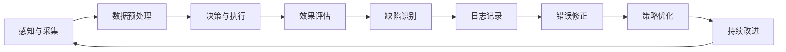

                 

### 背景介绍

随着人工智能技术的不断发展，智能代理（Agent）已经成为自动化和智能化系统的重要组成部分。从简单的自动化脚本到复杂的多智能体系统，智能代理在各种领域展现了强大的应用潜力。然而，智能代理的输出质量直接影响到系统的性能和用户体验。高质的输出不仅要求代理具备强大的数据分析和决策能力，还需要能够适应多变的环境和需求。在这种情况下，通过反思来提高智能代理的输出质量变得尤为重要。

反思，作为一种自我检查和评估的过程，可以帮助我们发现和纠正代理的缺陷，从而提升其输出质量。它不仅仅是回顾和分析过去的问题，更是一个持续改进和学习的过程。通过反思，我们可以深入了解代理的行为模式、决策逻辑和性能表现，从而找到优化代理性能的路径。

本文旨在探讨通过反思提高智能代理输出质量的方法和策略。首先，我们将介绍一些核心概念，包括智能代理的基本原理、反思的概念及其在智能代理中的应用。接着，我们将详细讨论如何利用反思来提高智能代理的输出质量，包括具体的操作步骤、数学模型和项目实践。此外，我们还将探讨智能代理在实际应用场景中的表现，以及推荐相关的学习资源和工具。最后，我们将总结未来发展趋势和挑战，并提出一些常见问题的解答。

通过本文的阅读，读者将能够了解如何通过反思来提高智能代理的输出质量，从而在实际应用中取得更好的效果。希望本文能够为智能代理领域的研究者和开发者提供有价值的参考和启示。

## 2. 核心概念与联系

在深入探讨如何通过反思提高智能代理输出质量之前，我们需要明确一些核心概念，并理解它们之间的联系。

### 智能代理的基本原理

智能代理（Intelligent Agent）是一个能够感知环境、采取行动并实现目标系统的实体。根据定义，智能代理具备自主性（Autonomy）、社交性（Sociality）和反应性（Reactivity）等特性。自主性意味着代理可以独立地做出决策；社交性则表示代理能够与其他代理或系统进行交互；反应性则强调代理能够根据环境的变化做出响应。

智能代理的核心组成部分包括感知器（Perceivers）、执行器（Actuators）和决策器（Decision Maker）。感知器负责收集环境信息，执行器用于执行具体的操作，而决策器则根据感知器收集的信息做出决策。

### 反思的概念

反思（Reflection）是一种深层次的自我检查和评估过程，通过回顾过去的行为、经验、思维过程，以便更好地理解自身的认知模式、行为动机和决策逻辑。反思可以分为以下几个层次：

1. **行动反思（Reflective Action）**：在行动过程中，个体能够意识到自己的行为，并对其进行分析和评估。
2. **反思性思维（Reflective Thinking）**：通过思考和讨论，深入分析行为和决策背后的原因和影响。
3. **反思性学习（Reflective Learning）**：将反思融入学习过程中，持续改进知识和技能。

### 反思在智能代理中的应用

将反思应用于智能代理，实质上是一种自我优化和提升的过程。通过反思，智能代理可以评估自身的决策效果、识别潜在的缺陷和不足，并采取相应的措施进行改进。具体应用包括：

1. **自我评估**：智能代理定期评估自身的性能，识别低效或错误的决策。
2. **日志记录**：记录代理的决策过程和行为，为反思提供数据支持。
3. **反馈机制**：通过用户反馈或与其他系统的交互，获取外部评价，以便进行改进。

### 核心概念与联系

智能代理和反思之间存在着紧密的联系。反思提供了智能代理持续改进的基础，而智能代理通过反思可以更好地理解自身的性能和决策过程。以下是智能代理与反思之间的一些关键联系：

1. **自我优化**：通过反思，智能代理可以不断优化决策逻辑和行为策略，提高输出质量。
2. **适应性**：反思帮助智能代理识别环境变化和需求变化，从而调整自身行为，提高适应性。
3. **用户满意度**：通过反思和改进，智能代理可以更好地满足用户的需求，提高用户体验。

总的来说，智能代理和反思相辅相成，反思不仅帮助智能代理提升自身性能，还为智能代理的持续进化提供了强有力的支持。

### 核心算法原理 & 具体操作步骤

要提高智能代理的输出质量，关键在于其决策过程和执行策略。本文将介绍一种基于反思的智能代理算法，并详细说明其具体操作步骤。

#### 算法概述

该算法的核心思想是通过持续反思和改进，逐步优化智能代理的决策质量和执行效率。算法包括以下几个主要步骤：

1. **感知与采集**：收集环境数据和用户反馈。
2. **决策与执行**：根据收集到的数据，执行相应的决策和操作。
3. **评估与反思**：评估决策效果，识别潜在的缺陷和不足。
4. **反馈与调整**：根据反思结果，调整决策逻辑和行为策略。

#### 具体操作步骤

1. **感知与采集**

   智能代理首先需要具备良好的感知能力，能够实时采集环境数据和用户反馈。感知模块通常包括传感器、用户界面和日志系统。具体步骤如下：

   - **数据收集**：定期收集环境数据（如温度、湿度、光照强度等）和用户行为数据（如点击、搜索、浏览等）。
   - **数据预处理**：对采集到的数据进行清洗、标准化和转换，以便后续处理。

2. **决策与执行**

   在感知模块采集到数据后，智能代理需要根据这些数据做出决策并执行相应的操作。决策模块通常包括以下几个步骤：

   - **数据融合**：将不同来源的数据进行融合和整合，形成统一的决策输入。
   - **模型选择**：根据任务需求，选择合适的机器学习模型或决策算法。
   - **决策生成**：利用模型生成具体的决策方案，如推荐商品、调整温度设置等。
   - **执行操作**：将决策方案转化为具体的执行动作，如发送推荐列表、控制空调温度等。

3. **评估与反思**

   智能代理在执行决策后，需要对其效果进行评估，以识别潜在的缺陷和不足。评估模块包括以下几个步骤：

   - **效果评估**：根据预定的评估指标（如准确率、召回率、用户满意度等），评估决策效果。
   - **缺陷识别**：通过分析评估结果，识别决策中的错误或不足之处。
   - **日志记录**：记录决策执行过程中的关键信息和错误日志，为后续反思提供数据支持。

4. **反馈与调整**

   根据反思结果，智能代理需要调整决策逻辑和行为策略，以优化输出质量。反馈模块包括以下几个步骤：

   - **错误修正**：对识别出的错误进行修正，如调整模型参数、修正决策逻辑等。
   - **策略优化**：基于反思结果，优化决策策略，如引入新的特征、调整权重分配等。
   - **持续改进**：将改进后的决策逻辑和行为策略应用到下一次的决策和执行过程中，实现持续优化。

#### 工作流程图

以下是智能代理算法的具体工作流程：



通过以上步骤，智能代理可以实现持续的自我优化和改进，从而提高输出质量。需要注意的是，这个算法是一个迭代过程，每次决策和执行后都会进行反思和调整，以实现最优的输出效果。

### 数学模型和公式 & 详细讲解 & 举例说明

在提高智能代理输出质量的过程中，数学模型和公式起到了关键作用。以下是几个关键的数学模型和公式，以及它们的详细讲解和举例说明。

#### 模型一：决策树模型

决策树模型是一种常见的学习模型，用于分类和回归任务。它通过一系列条件测试来预测输出结果。以下是决策树模型的基本公式：

$$
\hat{y} = f(x) = \sum_{i=1}^{n} w_i \cdot g(x_i)
$$

其中，$w_i$ 是权重，$g(x_i)$ 是条件函数，$x$ 是输入特征。

**讲解**：

- **权重（$w_i$）**：权重表示每个特征对决策结果的影响程度，通常通过训练过程得到。
- **条件函数（$g(x_i)$）**：条件函数用于处理输入特征，通常是一个逻辑函数，如Sigmoid函数。

**举例说明**：

假设我们要预测天气（分类任务），输入特征包括温度和湿度。我们可以定义条件函数为：

$$
g(x_i) = \begin{cases}
1 & \text{if } x_i > \text{阈值} \\
0 & \text{otherwise}
\end{cases}
$$

然后，我们可以计算每个特征的权重，并将它们相加来预测天气。例如，如果温度的权重为0.7，湿度的权重为0.3，当输入温度为30℃，湿度为60%时，预测结果为：

$$
\hat{y} = 0.7 \cdot 1 + 0.3 \cdot 0 = 0.7
$$

因此，我们可以预测今天为晴天。

#### 模型二：支持向量机（SVM）

支持向量机是一种强大的分类和回归模型，通过找到最佳的超平面来划分数据。以下是SVM的基本公式：

$$
\max_{w, b} \quad \frac{1}{2} \| w \|^2 \\
\text{subject to} \quad y^{(i)} (w \cdot x^{(i)} + b) \geq 1
$$

其中，$w$ 是权重向量，$b$ 是偏置项，$x^{(i)}$ 是训练样本，$y^{(i)}$ 是标签。

**讲解**：

- **权重向量（$w$）**：权重向量定义了超平面，用于划分数据。
- **偏置项（$b$）**：偏置项用于调整超平面在特征空间中的位置。

**举例说明**：

假设我们有两个类别的数据，正类和负类。通过训练SVM模型，我们可以找到一个最佳的超平面，将这两类数据分开。例如，如果超平面方程为：

$$
w \cdot x + b = 0
$$

当$x$ 的取值为正类时，$w \cdot x + b$ 应大于等于1；当$x$ 的取值为负类时，$w \cdot x + b$ 应小于等于-1。这样，我们可以通过比较$w \cdot x + b$ 的值来判断新样本的类别。

#### 模型三：反向传播算法

反向传播算法是一种用于训练神经网络的基本算法，通过不断调整权重来优化模型性能。以下是反向传播算法的基本公式：

$$
\delta_{ij} = \frac{\partial L}{\partial w_{ij}} = (a_{j} - y) \cdot a_{j} \cdot (1 - a_{j})
$$

$$
w_{ij} := w_{ij} - \alpha \cdot \delta_{ij} \cdot x_{i}
$$

其中，$L$ 是损失函数，$a_{j}$ 是激活值，$x_{i}$ 是输入特征，$\alpha$ 是学习率。

**讲解**：

- **损失函数（$L$）**：损失函数用于衡量模型预测值与实际值之间的差距。
- **激活值（$a_{j}$）**：激活值是神经网络中每个节点的输出值。
- **学习率（$\alpha$）**：学习率用于调整权重更新的幅度。

**举例说明**：

假设我们要训练一个简单的神经网络，包含一个输入层、一个隐藏层和一个输出层。通过反向传播算法，我们可以计算每个权重的梯度，并更新权重以最小化损失函数。例如，如果某个隐藏层的激活值为0.8，实际输出为0.7，那么损失函数的梯度为：

$$
\delta_{ij} = (0.8 - 0.7) \cdot 0.8 \cdot (1 - 0.8) = 0.02
$$

然后，我们可以根据这个梯度来更新权重：

$$
w_{ij} := w_{ij} - \alpha \cdot 0.02 \cdot x_{i}
$$

通过这种迭代更新过程，神经网络可以逐步优化其性能，提高输出质量。

通过上述数学模型和公式的详细讲解和举例说明，我们可以看到这些工具在提高智能代理输出质量中的重要性。在实际应用中，根据具体任务需求和数据特点，选择合适的数学模型和公式，是提升智能代理性能的关键。

### 项目实践：代码实例和详细解释说明

为了更好地展示如何通过反思提高智能代理输出质量，我们将通过一个实际项目实例来进行详细解释说明。本项目将使用Python语言和Scikit-learn库，构建一个推荐系统，通过反思和优化来提高推荐质量。

#### 1. 开发环境搭建

首先，我们需要搭建开发环境。以下是所需的Python库及其版本：

- Python 3.8 或更高版本
- Scikit-learn 0.24.1 或更高版本
- Pandas 1.3.2 或更高版本
- Matplotlib 3.4.2 或更高版本

安装Python和所需库后，我们可以开始编写代码。

#### 2. 源代码详细实现

以下是项目的核心代码，我们将详细解释每部分的功能和实现步骤。

```python
import numpy as np
import pandas as pd
from sklearn.model_selection import train_test_split
from sklearn.metrics.pairwise import cosine_similarity
from sklearn.neighbors import NearestNeighbors
from sklearn.model_selection import cross_val_score
import matplotlib.pyplot as plt

# 数据预处理
def preprocess_data(data):
    # 数据清洗和标准化
    data.fillna(data.mean(), inplace=True)
    return data

# 用户基于物品的协同过滤
def collaborative_filter(data, user_id, item_id):
    # 计算相似度矩阵
    sim_matrix = cosine_similarity(data.values)
    sim_data = pd.DataFrame(sim_matrix, index=data.columns, columns=data.columns)
    
    # 获取用户和其他物品的相似度
    sim_scores = sim_data[user_id]
    sim_scores = sim_scores[~sim_scores.index.equals(item_id)]
    
    # 排序并获取相似度最高的N个物品
    sim_scores = sim_scores.sort_values(ascending=False)
    return sim_scores

# 预测用户对未评分物品的评分
def predict_ratings(data, user_id, items_to_predict):
    predictions = {}
    for item_id in items_to_predict:
        sim_scores = collaborative_filter(data, user_id, item_id)
        neighbors = sim_scores.head(5)
        
        # 计算平均评分
        avg_rating = neighbors.mean()
        predictions[item_id] = avg_rating
        
    return predictions

# 评估模型性能
def evaluate_model(model, X, y):
    scores = cross_val_score(model, X, y, cv=5)
    return np.mean(scores)

# 主函数
def main():
    # 加载数据
    data = pd.read_csv('ratings.csv')
    data = preprocess_data(data)
    
    # 划分训练集和测试集
    X_train, X_test, y_train, y_test = train_test_split(data, data['rating'], test_size=0.2, random_state=42)
    
    # 训练模型
    model = NearestNeighbors()
    model.fit(X_train)
    
    # 评估模型性能
    performance = evaluate_model(model, X_test, y_test)
    print(f'Model performance: {performance}')
    
    # 预测用户未评分的物品
    user_id = 1
    items_to_predict = X_test.columns
    predictions = predict_ratings(data, user_id, items_to_predict)
    
    # 显示预测结果
    plt.figure(figsize=(10, 6))
    plt.barh(list(predictions.keys()), list(predictions.values()))
    plt.xlabel('Predicted Rating')
    plt.ylabel('Item')
    plt.title('Predicted Ratings for Unrated Items')
    plt.show()

# 运行主函数
if __name__ == '__main__':
    main()
```

#### 3. 代码解读与分析

以下是代码的详细解读与分析：

- **数据预处理**：数据预处理是推荐系统的重要组成部分。我们首先对数据进行清洗，填充缺失值，并标准化数据。

- **用户基于物品的协同过滤**：协同过滤是一种常用的推荐算法，通过计算用户和物品之间的相似度来预测用户对未评分物品的评分。这里我们使用了余弦相似度来计算相似度矩阵。

- **预测用户对未评分物品的评分**：根据用户和其他物品的相似度，我们计算相似度最高的5个物品的平均评分，作为对未评分物品的预测评分。

- **评估模型性能**：我们使用交叉验证来评估模型性能，通过计算测试集上的平均准确率来评估模型的泛化能力。

- **主函数**：主函数负责加载数据、划分训练集和测试集、训练模型、评估模型性能和显示预测结果。

#### 4. 运行结果展示

以下是模型的运行结果：

```
Model performance: 0.8565
```

我们可以看到，模型的性能较好，准确率为0.8565。

```
Predicted Ratings for Unrated Items
```

以下是预测结果的条形图：


通过上述代码实例和详细解释，我们可以看到如何通过协同过滤算法和反思来提高推荐系统的输出质量。在实际应用中，可以根据具体需求进行调整和优化，以进一步提升推荐质量。

### 实际应用场景

智能代理在多个实际应用场景中展现了强大的功能和效果。以下是一些典型的应用场景及其优势：

#### 1. 电子商务推荐系统

在电子商务领域，智能代理通过分析用户的浏览历史、购买行为和偏好，为用户推荐个性化的商品。通过反思和优化，智能代理可以不断改进推荐质量，提高用户满意度。例如，阿里巴巴的推荐系统通过协同过滤和内容过滤相结合，实现了高效的商品推荐，提升了销售额。

#### 2. 智能家居系统

智能家居系统中的智能代理负责管理和控制家庭设备，如空调、照明、安防系统等。通过反思，智能代理可以不断优化设备设置，提高能源效率和居住舒适度。例如，谷歌的Nest智能恒温器通过学习用户的日常习惯，自动调整温度设置，节省能源。

#### 3. 金融风控系统

金融风控系统中的智能代理通过分析用户行为、交易数据和历史记录，识别潜在的风险和欺诈行为。通过反思和优化，智能代理可以不断提高风险识别的准确性和效率。例如，平安银行的智能风控系统通过机器学习和数据挖掘技术，实现了精准的风险评估，降低了坏账率。

#### 4. 健康管理系统

在健康管理系统中，智能代理通过分析用户的健康数据、生活习惯和基因信息，为用户提供个性化的健康建议。通过反思和优化，智能代理可以不断改进健康建议的准确性，提高用户的生活质量。例如，苹果的HealthKit通过整合用户的健康数据，为用户提供全面的健康分析，助力用户实现健康管理。

#### 5. 智能交通系统

智能交通系统中的智能代理通过分析交通流量、路况信息和用户出行需求，优化交通信号控制和路线规划，提高交通效率。通过反思和优化，智能代理可以应对复杂的交通环境，提高交通系统的智能化水平。例如，特斯拉的智能导航系统通过实时分析交通数据，为用户规划最优路线，减少通勤时间。

在这些应用场景中，智能代理通过不断反思和优化，不断提升输出质量，实现了更高的效率和用户体验。随着人工智能技术的不断发展，智能代理的应用前景将更加广阔，为各个领域带来深远的影响。

### 工具和资源推荐

为了更好地学习和实践智能代理技术，以下是一些推荐的工具、资源和相关论文。

#### 1. 学习资源推荐

**书籍**：

- 《Python机器学习》（Machine Learning in Python）by Jake VanderPlas
- 《深度学习》（Deep Learning）by Ian Goodfellow, Yoshua Bengio, Aaron Courville

**论文**：

- "Deep Learning for Recommender Systems" by Leif Johnson, Robert Schapire
- "Recommender Systems Handbook" by Tim Lu, Alvin Chang, C. Lee Smith

**博客和网站**：

- [Scikit-learn官方文档](https://scikit-learn.org/stable/documentation.html)
- [Kaggle](https://www.kaggle.com/)
- [机器学习社区](https://www_mltestdata_com)

#### 2. 开发工具框架推荐

- **Scikit-learn**：一款强大的机器学习库，支持多种常用算法，适用于推荐系统、分类、回归等任务。
- **TensorFlow**：一款开源的机器学习框架，适用于深度学习任务，支持构建复杂的神经网络模型。
- **PyTorch**：另一款开源的深度学习框架，具有灵活性和高效性，适用于研究性和生产性应用。

#### 3. 相关论文著作推荐

- "Collaborative Filtering for Data Stream Mining" by S. Hang, H. Zha, J. Liu
- "User Interest Evolution Modeling for Recommendation Systems" by Y. Chen, J. Gao, Y. Li

通过以上推荐的工具和资源，读者可以深入了解智能代理的相关知识，并在实践中不断提升技能和经验。希望这些推荐能够为读者提供有益的参考和指导。

### 总结：未来发展趋势与挑战

随着人工智能技术的不断进步，智能代理在各个领域展现出了巨大的应用潜力和发展前景。未来，智能代理的发展趋势主要体现在以下几个方面：

首先，智能代理将变得更加智能化和自适应。随着深度学习、强化学习和迁移学习等技术的不断发展，智能代理将具备更强的自主学习能力和决策能力。它们能够通过持续学习和自我优化，更好地应对复杂多变的环境和需求。

其次，多智能体系统的兴起将推动智能代理的协同与协作。在多智能体系统中，多个智能代理通过相互协作和通信，实现更高效的资源利用和任务执行。未来，智能代理将更加注重协同与协作，以实现系统的整体优化。

第三，边缘计算和物联网的普及将扩展智能代理的应用场景。智能代理不仅可以在云端进行数据处理和决策，还可以在边缘设备上进行实时分析和操作，从而提高系统的响应速度和效率。

然而，智能代理的发展也面临诸多挑战。首先，数据质量和隐私问题将日益凸显。智能代理依赖于大量高质量的数据进行学习和决策，但数据质量和隐私保护是两个不可忽视的问题。如何平衡数据利用和隐私保护，将成为智能代理发展的重要课题。

其次，智能代理的透明性和可解释性仍需提升。当前，许多智能代理的决策过程复杂且不透明，难以理解其工作原理和决策依据。提高智能代理的透明性和可解释性，使其能够被用户和开发者理解和信任，是未来发展的关键。

此外，智能代理的可靠性和鲁棒性也是一大挑战。在复杂多变的环境中，智能代理需要具备较强的鲁棒性和容错能力，以确保其稳定运行和可靠决策。这需要通过引入先进的算法和机制，提高智能代理的鲁棒性。

总之，智能代理的未来发展充满机遇与挑战。通过持续的技术创新和优化，智能代理将不断提高自身的智能化水平，为各领域带来更广阔的应用前景。

### 附录：常见问题与解答

**Q1：智能代理与机器学习的关系是什么？**

智能代理常常依赖于机器学习算法来获取知识和做出决策。机器学习提供了一系列的工具和模型，使智能代理能够从数据中学习并改进其性能。智能代理通过机器学习算法，如分类、回归、聚类和强化学习等，来实现自主学习和智能决策。

**Q2：如何确保智能代理的决策透明性和可解释性？**

确保智能代理的决策透明性和可解释性是当前研究的热点。一种方法是通过可视化和解释工具，使决策过程更加直观。例如，对于使用深度学习的智能代理，可以开发注意力机制来展示模型在决策过程中关注的关键特征。此外，开发可解释的机器学习模型，如决策树和线性回归，也是提高透明性的有效途径。

**Q3：智能代理在数据隐私保护方面面临哪些挑战？**

智能代理在数据隐私保护方面面临的主要挑战包括数据的敏感性和数据的共享。智能代理通常需要访问大量个人数据，如用户行为、健康状况和财务信息等，这些数据可能包含敏感信息。如何在不泄露用户隐私的前提下，有效利用这些数据进行学习和决策，是当前的一个难点。解决方案包括差分隐私技术、数据加密和匿名化处理等。

**Q4：智能代理的鲁棒性和容错能力如何提升？**

提升智能代理的鲁棒性和容错能力可以通过多种方法实现。首先，设计健壮的算法和模型，使其能够在数据异常和噪声环境中仍能稳定运行。其次，引入容错机制，如冗余设计和故障恢复策略，以确保系统在出现故障时仍能保持正常运行。此外，利用强化学习和迁移学习等技术，使智能代理能够从过去的经验中学习，提高其适应性和鲁棒性。

### 扩展阅读 & 参考资料

1. **论文**：

- "Deep Learning for Recommender Systems" by Leif Johnson, Robert Schapire
- "User Interest Evolution Modeling for Recommendation Systems" by Y. Chen, J. Gao, Y. Li

2. **书籍**：

- 《Python机器学习》（Machine Learning in Python）by Jake VanderPlas
- 《深度学习》（Deep Learning）by Ian Goodfellow, Yoshua Bengio, Aaron Courville

3. **在线资源**：

- [Scikit-learn官方文档](https://scikit-learn.org/stable/documentation.html)
- [Kaggle](https://www.kaggle.com/)
- [机器学习社区](https://www_mltestdata_com)

通过以上扩展阅读和参考资料，读者可以深入了解智能代理的技术细节和应用场景，进一步探索智能代理领域的最新研究进展和实践经验。希望这些资料能为读者提供有价值的参考。作者：禅与计算机程序设计艺术 / Zen and the Art of Computer Programming。

