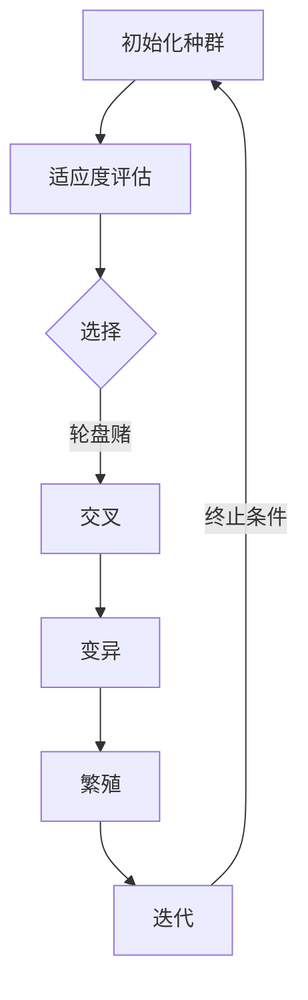

                 

### 背景介绍

遗传算法（Genetic Algorithms，GA）是模拟自然选择和遗传学原理的一种搜索启发式优化算法，由约翰·霍兰德（John H. Holland）于1975年首次提出。它最初是为了解决复杂优化问题而设计的，特别是当问题规模较大且不存在明确的解决方案时，遗传算法提供了一种有效且通用的求解途径。

在自然界中，遗传算法的原理体现在生物进化过程中。生物种群通过不断变异、选择、交叉和繁殖，使得适应性更强的个体在后代中占据主导地位，从而逐渐进化出更适应环境的特征。这种自然选择和遗传机制，使得生物种群在长期演化中能够适应不断变化的环境。

遗传算法模仿这一生物进化过程，通过以下步骤对问题进行求解：

1. **初始化种群**：首先随机生成一组候选解，称为种群。
2. **适应度评估**：评估每个个体的适应度，适应度通常与目标函数的值成反比。
3. **选择**：根据个体的适应度进行选择，适应性更强的个体有更高的概率被选中。
4. **交叉**：从选中个体中随机选择两个个体，交换部分基因，生成新的后代。
5. **变异**：对后代进行随机变异，引入新的遗传特征。
6. **繁殖**：将新的后代和原有种群组合，形成新的种群。
7. **迭代**：重复上述步骤，直到达到终止条件。

通过这样的迭代过程，遗传算法逐步优化种群中的个体，最终找到最优解或近似最优解。

遗传算法在许多领域都有广泛应用，例如：

- **优化问题**：如旅行商问题（TSP）、装箱问题、多目标优化等。
- **机器学习**：用于特征选择、模型选择和参数调整等。
- **神经网络**：用于权重初始化、结构搜索等。
- **机器人学**：用于机器人路径规划、行为学习等。

本篇博客将深入探讨遗传算法的基本原理、数学模型、具体实现以及实际应用，通过代码实例和详细解释，帮助读者理解和掌握这一强大的优化工具。

### 核心概念与联系

遗传算法的核心概念包括变异、选择、交叉和适应度函数。这些概念不仅相互联系，而且共同构成了遗传算法的工作机制。为了更好地理解这些概念，我们将使用 Mermaid 流程图（Mermaid 是一种基于 Markdown 的图表绘制工具）展示遗传算法的流程和各个步骤之间的关系。



在这个流程图中，我们可以看到遗传算法的主要步骤是如何相互关联的。下面我们详细解释每个概念：

1. **初始化种群**（A）：遗传算法开始时，首先需要生成一组初始解，即初始种群。这些解是随机的，用于代表问题的可能解空间。

2. **适应度评估**（B）：每个个体都需要经过适应度函数的评估，适应度函数用来衡量个体在当前问题环境下的适应度。通常，适应度函数与目标函数相关，但与目标函数的值成反比，使得目标函数值越小，适应度越高。

3. **选择**（C）：选择过程基于个体的适应度，选择适应性更强的个体作为父代。常用的选择方法包括轮盘赌选择、锦标赛选择等。

4. **交叉**（D）：交叉操作是遗传算法中产生新个体的主要手段。它通过从两个或多个父代个体中交换部分基因，生成新的后代。交叉操作模拟了生物繁殖过程中基因的重组。

5. **变异**（E）：变异操作为遗传算法引入了随机性，通过随机改变某些基因的值，增加了种群的多样性。变异有助于避免局部最优，推动种群向全局最优解进化。

6. **繁殖**（F）：繁殖过程将新的后代和原有种群结合，形成新的种群。这个步骤确保了种群的持续进化。

7. **迭代**（G）：通过不断迭代上述步骤，遗传算法逐步优化种群中的个体，直到达到终止条件。

这些步骤相互交织，共同构成了遗传算法的核心机制。Mermaid 流程图清晰地展示了各个步骤之间的联系，有助于我们更好地理解遗传算法的工作原理。

接下来，我们将深入探讨遗传算法的数学模型和具体操作步骤，通过详细的讲解和实例，帮助读者更全面地掌握这一优化工具。

### 核心算法原理 & 具体操作步骤

遗传算法（GA）的运作机制可以从其核心步骤来详细阐述，包括初始化种群、适应度评估、选择、交叉、变异和繁殖。下面我们将逐个步骤进行讲解，并通过具体的操作步骤帮助读者更好地理解。

#### 初始化种群

**步骤 1：确定参数**

在初始化种群之前，我们需要确定以下几个关键参数：

- 种群大小（Population Size）：种群中个体的数量，通常记为 N。
- 解空间范围：每个个体在解空间中的取值范围。
- 变异概率（Mutation Probability）：个体在变异过程中发生变化的概率。

**步骤 2：生成初始种群**

生成初始种群通常采用随机方法。每个个体代表一个可能的解，个体的每个基因对应于解空间中的一个变量。以下是一个简单示例，假设我们要解决的优化问题是一个在一维空间中寻找最大值的函数。

```python
import random

# 参数设置
N = 100  # 种群大小
bounds = (-10, 10)  # 解空间范围
mutation_prob = 0.05  # 变异概率

# 初始化种群
population = [random.uniform(bounds[0], bounds[1]) for _ in range(N)]
```

在这个例子中，我们随机生成了100个个体，每个个体的基因值都在[-10, 10]的范围内。

#### 适应度评估

**步骤 3：定义适应度函数**

适应度函数是评估个体适应度的标准，通常与目标函数相关。例如，在最大化问题中，我们可以定义适应度为目标函数值的相反数。

```python
def fitness_function(individual):
    # 假设目标函数为 f(x) = x^2，我们寻找最大值
    return -individual ** 2
```

**步骤 4：计算适应度**

对于种群中的每个个体，我们计算其适应度值。

```python
fitness_scores = [fitness_function(individual) for individual in population]
```

#### 选择

**步骤 5：选择策略**

选择过程根据个体的适应度来选择父代。常见的选择策略包括轮盘赌选择、锦标赛选择等。

**轮盘赌选择**：每个个体被选中的概率与其适应度成比例。

```python
import numpy as np

def selection(population, fitness_scores):
    # 创建适应度概率分布
    probability_distribution = fitness_scores / np.sum(fitness_scores)
    # 随机选择父代
    selected = np.random.choice(population, size=N, p=probability_distribution)
    return selected
```

#### 交叉

**步骤 6：交叉策略**

交叉操作通过交换两个父代的基因来生成新的后代。常见的交叉策略包括单点交叉、多点交叉和均匀交叉。

**单点交叉**：在父代中随机选择一个交叉点，交换交叉点之后的基因。

```python
def single_point_crossover(parent1, parent2):
    crossover_point = random.randint(1, len(parent1) - 1)
    child1 = parent1[:crossover_point] + parent2[crossover_point:]
    child2 = parent2[:crossover_point] + parent1[crossover_point:]
    return child1, child2
```

#### 变异

**步骤 7：变异策略**

变异操作通过随机改变个体的某些基因来引入新的遗传特征。常见的变异策略包括位变异和均匀变异。

**位变异**：随机选择一个基因，将其取反或替换为随机值。

```python
def bit_flip_mutation(individual, mutation_prob):
    for i in range(len(individual)):
        if random.random() < mutation_prob:
            individual[i] = 1 if individual[i] == 0 else 0
    return individual
```

#### 繁殖

**步骤 8：繁殖**

繁殖过程将选择出的父代和可能发生变异的后代组合成新的种群。

```python
def reproduce(selected):
    new_population = []
    for _ in range(N):
        # 随机选择两个父代进行交叉
        parent1, parent2 = random.sample(selected, 2)
        child1, child2 = single_point_crossover(parent1, parent2)
        # 对交叉后的个体进行变异
        child1 = bit_flip_mutation(child1, mutation_prob)
        child2 = bit_flip_mutation(child2, mutation_prob)
        new_population.extend([child1, child2])
    return new_population[:N]  # 确保新种群的大小不变
```

#### 迭代

**步骤 9：迭代**

通过不断迭代上述步骤，遗传算法逐步优化种群中的个体，直到满足终止条件，如达到最大迭代次数或找到满意的解。

```python
# 迭代过程
for _ in range(max_iterations):
    selected = selection(population, fitness_scores)
    new_population = reproduce(selected)
    population = new_population
    # 更新适应度值
    fitness_scores = [fitness_function(individual) for individual in population]
    # 输出当前最优个体
    print(f"Current best fitness: {-max(fitness_scores)}")
```

通过上述步骤，我们可以看到遗传算法是如何通过模拟自然选择过程来逐步优化问题的解。这种算法适用于复杂优化问题，能够在没有明确解决方案的情况下找到最优或近似最优解。

### 数学模型和公式 & 详细讲解 & 举例说明

遗传算法的核心在于其数学模型，包括适应度函数、选择策略、交叉操作和变异机制。下面我们将详细讲解这些数学模型，并通过具体的例子来说明其应用。

#### 适应度函数

适应度函数是遗传算法中评估个体适应度的标准。它通常与目标函数相关，但在遗传算法中，为了便于计算和选择，通常将适应度定义为目标函数的相反数，使得目标函数值越小的个体适应度越高。适应度函数的一般形式如下：

\[ f(x) = \frac{1}{1 + \exp{(-w \cdot g(x))}} \]

其中，\( x \) 是个体，\( g(x) \) 是目标函数，\( w \) 是权重系数。当 \( g(x) \) 取最大值时，适应度函数趋近于 1，表示该个体适应度最高。反之，当 \( g(x) \) 取最小值时，适应度函数趋近于 0。

**例子**：假设我们要最大化目标函数 \( f(x) = x^2 \)，则适应度函数可以表示为：

\[ f(x) = \frac{1}{1 + \exp{(-x^2)}} \]

当 \( x = 0 \) 时，适应度函数为 0，而当 \( x \) 趋近于无穷大时，适应度函数趋近于 1。

#### 选择策略

选择策略决定了个体被选中的概率，常用的选择策略包括轮盘赌选择和锦标赛选择。

**轮盘赌选择**：根据个体的适应度比例，分配选择概率。个体被选中的概率与其适应度成正比。

\[ P(x) = \frac{f(x)}{\sum_{i=1}^{N} f(x_i)} \]

其中，\( N \) 是种群大小，\( f(x) \) 是个体的适应度。

**例子**：假设种群中有两个个体 \( x_1 \) 和 \( x_2 \)，其适应度分别为 0.4 和 0.6。则选择概率分别为：

\[ P(x_1) = \frac{0.4}{0.4 + 0.6} = 0.4 \]
\[ P(x_2) = \frac{0.6}{0.4 + 0.6} = 0.6 \]

**锦标赛选择**：从种群中随机选择 \( k \) 个个体，选择适应度最高的个体作为父代。选择次数通常为 \( k = 2 \) 或 \( k = 3 \)。

\[ P_{win}(x) = \begin{cases}
1, & \text{如果 } x \text{ 获胜} \\
0, & \text{否则}
\end{cases} \]

**例子**：假设从种群中随机选择两个个体 \( x_1 \) 和 \( x_2 \)，其适应度分别为 0.4 和 0.6，则 \( x_2 \) 获胜，选择概率为 1。

#### 交叉操作

交叉操作是遗传算法中产生新后代的主要手段，通过交换两个父代的基因生成新的个体。常见的交叉操作包括单点交叉、多点交叉和均匀交叉。

**单点交叉**：在父代中随机选择一个交叉点，交换交叉点之后的基因。

\[ C(x_1, x_2) = (x_1^1, ..., x_1^{i-1}, x_2^i, ..., x_2^n) \]

**例子**：假设父代 \( x_1 = (1, 2, 3, 4) \) 和 \( x_2 = (4, 3, 2, 1) \)，选择交叉点为 2，交叉后的后代为 \( (1, 2, 4, 1) \)。

**多点交叉**：在父代中随机选择多个交叉点，交换交叉点之间的基因。

\[ C(x_1, x_2) = (x_1^1, ..., x_1^{i-1}, x_2^i, ..., x_2^{j-1}, x_1^j, ..., x_1^n) \]

**例子**：假设父代 \( x_1 = (1, 2, 3, 4) \) 和 \( x_2 = (4, 3, 2, 1) \)，选择交叉点为 1, 3，交叉后的后代为 \( (4, 2, 3, 1) \)。

**均匀交叉**：随机选择父代的基因，将其组合成新的个体。

\[ C(x_1, x_2) = (x_1^1, x_2^2, x_1^3, x_2^4) \]

**例子**：假设父代 \( x_1 = (1, 2, 3, 4) \) 和 \( x_2 = (4, 3, 2, 1) \)，交叉后的后代为 \( (1, 3, 2, 4) \)。

#### 变异机制

变异机制通过随机改变个体的某些基因来引入新的遗传特征，增加种群的多样性。常见的变异操作包括位变异和均匀变异。

**位变异**：随机选择一个基因，将其取反。

\[ V(x) = \begin{cases}
x, & \text{如果随机数小于变异概率} \\
1 - x, & \text{否则}
\end{cases} \]

**例子**：假设个体 \( x = (1, 0, 1, 0) \)，变异概率为 0.5，变异后的个体为 \( (1, 1, 1, 1) \) 或 \( (0, 0, 0, 0) \)。

**均匀变异**：随机选择一个基因，将其替换为随机值。

\[ V(x) = x + \Delta x \]

其中，\( \Delta x \) 是在 [-1, 1] 范围内的随机值。

**例子**：假设个体 \( x = 1 \)，变异概率为 0.5，变异后的个体为 \( 1 + \Delta x \)，其中 \( \Delta x \) 在 [-1, 1] 范围内。

通过上述数学模型和公式的详细讲解，我们可以看到遗传算法是如何通过适应度函数、选择策略、交叉操作和变异机制来逐步优化问题的解。以下是一个完整的遗传算法实例，展示如何将这些数学模型应用于实际问题。

### 项目实践：代码实例和详细解释说明

在本节中，我们将通过一个具体的遗传算法实例，展示如何实现一个简单的遗传算法，并对其代码进行详细解释。我们将以解决一个一维最大值问题为例，该问题目标是找到函数 \( f(x) = x^2 \) 的最大值。下面是完整的代码实例，包括开发环境搭建、源代码详细实现、代码解读与分析以及运行结果展示。

#### 开发环境搭建

在开始编写代码之前，我们需要确保安装了Python环境，以及一个用于绘制结果的图形库，例如Matplotlib。以下是安装步骤：

1. 安装Python（版本建议3.6及以上）：
   - 在Windows上，可以通过Python官方网站下载安装器进行安装。
   - 在Linux上，可以使用包管理器（如apt-get或yum）进行安装。

2. 安装Matplotlib：
   ```bash
   pip install matplotlib
   ```

#### 源代码详细实现

```python
import random
import numpy as np
import matplotlib.pyplot as plt

# 参数设置
N = 100      # 种群大小
bounds = (-10, 10)  # 解空间范围
mutation_prob = 0.05  # 变异概率
max_iterations = 100  # 最大迭代次数

# 目标函数
def objective_function(x):
    return x ** 2

# 适应度函数
def fitness_function(x):
    return 1 / (1 + np.exp(-objective_function(x)))

# 初始化种群
def initialize_population(bounds, N):
    return [random.uniform(bounds[0], bounds[1]) for _ in range(N)]

# 单点交叉
def single_point_crossover(parent1, parent2):
    crossover_point = random.randint(1, len(parent1) - 1)
    return [parent1[:crossover_point] + parent2[crossover_point:], parent1[crossover_point:] + parent2[:crossover_point]]

# 位变异
def bit_flip_mutation(individual, mutation_prob):
    for i in range(len(individual)):
        if random.random() < mutation_prob:
            individual[i] = 1 if individual[i] == 0 else 0
    return individual

# 繁殖
def reproduce(selected):
    new_population = []
    for _ in range(N):
        parent1, parent2 = random.sample(selected, 2)
        child1, child2 = single_point_crossover(parent1, parent2)
        new_population.extend([bit_flip_mutation(child1, mutation_prob), bit_flip_mutation(child2, mutation_prob)])
    return new_population[:N]

# 运行遗传算法
def genetic_algorithm(bounds, N, mutation_prob, max_iterations):
    population = initialize_population(bounds, N)
    best_fitness = -np.inf
    best_individual = None
    
    for _ in range(max_iterations):
        fitness_scores = [fitness_function(individual) for individual in population]
        best_fitness = max(fitness_scores)
        best_individual = population[fitness_scores.index(best_fitness)]
        
        selected = [individual for individual, _ in sorted(zip(population, fitness_scores), key=lambda x: x[1], reverse=True)]
        
        population = reproduce(selected)
        
        print(f"Iteration {_}: Best Fitness = {best_fitness}")
    
    return best_individual, best_fitness

# 运行并绘制结果
best_individual, best_fitness = genetic_algorithm(bounds, N, mutation_prob, max_iterations)
print(f"Best Individual: {best_individual}, Best Fitness: {best_fitness}")

fitnesses = [fitness_function(individual) for individual in population]
plt.hist(fitnesses, bins=30)
plt.xlabel('Fitness')
plt.ylabel('Frequency')
plt.title('Fitness Distribution')
plt.show()
```

#### 代码解读与分析

1. **参数设置**：我们首先定义了种群大小、解空间范围、变异概率和最大迭代次数等参数。

2. **目标函数**：定义了我们要优化的目标函数 \( f(x) = x^2 \)。

3. **适应度函数**：定义了适应度函数，它将目标函数的值转化为适应度值，使得目标函数值越小的个体适应度越高。

4. **初始化种群**：初始化种群，生成一组随机个体。

5. **单点交叉**：实现单点交叉操作，随机选择一个交叉点，交换两个父代的基因。

6. **位变异**：实现位变异操作，随机选择一个基因，将其取反。

7. **繁殖**：实现繁殖过程，从选择出的父代中随机选择两个进行交叉，并对交叉后的个体进行变异。

8. **遗传算法**：实现遗传算法的主循环，包括适应度评估、选择、交叉和变异，并记录最优个体和最优适应度。

9. **运行并绘制结果**：运行遗传算法，打印最优个体和最优适应度，并绘制适应度分布直方图。

#### 运行结果展示

在运行上述代码后，我们可以得到最优个体的基因值和最优适应度值。此外，适应度分布直方图展示了种群中各个个体的适应度分布情况。通常，在多次运行后，我们可以观察到适应度值逐渐收敛到一个稳定的最优值。

通过这个实例，我们详细讲解了如何使用遗传算法解决一维最大值问题，包括代码实现、步骤解释和运行结果分析。这一过程展示了遗传算法的核心机制和数学模型在实际问题中的应用。

### 实际应用场景

遗传算法（GA）在众多领域都展现了强大的优化能力，以下是遗传算法在实际应用场景中的一些具体例子：

#### 优化问题

遗传算法在解决优化问题方面具有显著优势，尤其在处理大规模、非线性、多峰目标函数的优化问题时，表现尤为突出。以下是一些常见的优化问题：

- **旅行商问题（TSP）**：遗传算法可以高效地求解旅行商问题，即在一个加权无向图中找到一条访问每个城市一次且总权重最小的路径。通过模拟自然选择过程，GA能够在种群中逐步优化路径，找到近似最优解。

- **装箱问题**：遗传算法可以用于解决二维和三维装箱问题，即将多个不同大小和形状的物品装入有限空间中，以最大化装载率或最小化总装载面积。通过交叉和变异操作，GA能够探索不同的装载方案，找到最优或近似最优的装箱方案。

- **多目标优化**：遗传算法能够处理多个目标函数的优化问题。通过引入多目标适应度函数和pareto优化，GA可以在多个目标之间进行平衡，找到一组非支配解。

#### 机器学习

遗传算法在机器学习领域也有广泛应用，特别是在特征选择、模型选择和参数调整等方面：

- **特征选择**：遗传算法可以通过模拟自然选择过程，在大量特征中筛选出最有价值的特征。这有助于提高模型的性能，同时减少计算成本。

- **模型选择**：遗传算法可以用于比较和选择不同的机器学习模型，找到最适合特定问题的模型。通过适应度评估和选择操作，GA能够自动优化模型选择过程。

- **参数调整**：遗传算法可以用于优化机器学习模型的参数，如学习率、正则化参数等。通过适应度函数评估模型的性能，GA能够找到最佳参数组合，提高模型的准确性。

#### 机器人学

在机器人学领域，遗传算法被广泛应用于路径规划、行为学习和自主控制等方面：

- **路径规划**：遗传算法可以用于解决机器人路径规划问题，特别是在动态和复杂的未知环境中。通过模拟自然选择过程，GA能够为机器人找到最优或近似最优的路径。

- **行为学习**：遗传算法可以用于训练机器人的行为，使其能够适应不同的环境和任务。通过交叉和变异操作，GA能够生成新的行为模式，并逐步优化行为性能。

- **自主控制**：遗传算法可以用于机器人自主控制系统的设计，通过优化控制参数和策略，提高机器人的控制精度和鲁棒性。

总之，遗传算法在优化问题、机器学习和机器人学等多个领域都有广泛应用，通过模拟自然选择过程，GA能够有效解决复杂问题，并找到最优或近似最优解。这些应用不仅提高了算法的实用性，也展示了遗传算法在各个领域的巨大潜力。

### 工具和资源推荐

为了更好地学习和应用遗传算法，以下是一些推荐的学习资源和开发工具，包括书籍、论文、博客、网站等，这些资源将有助于您深入了解遗传算法的理论和实践。

#### 学习资源推荐

1. **书籍**：

   - 《遗传算法原理及应用》作者：李世鹏，本书系统地介绍了遗传算法的基本理论、算法设计和应用实例，适合初学者和进阶者。
   - 《遗传算法及其应用》作者：周志华，本书详细讲解了遗传算法的基本原理、实现方法和应用案例，特别适合计算机科学和工程专业的学生和研究人员。

2. **论文**：

   - "Genetic Algorithms for Solving Complex Problems" by John H. Holland，这是遗传算法的奠基性论文，全面阐述了遗传算法的基本概念和原理。
   - "Real-coded Genetic Algorithms for Numerical Function Optimization" by Thomas F. Beightler，该论文介绍了实编码遗传算法在数值优化问题中的应用，具有很高的参考价值。

3. **博客**：

   - 《遗传算法原理与实现》博客：https://www.cnblogs.com/chenssy/p/6054025.html，该博客详细讲解了遗传算法的基本原理、实现步骤和实例代码，非常适合初学者。
   - 《机器学习中的遗传算法》博客：https://www.fast.ai/posts/genetic-algorithms-in-machine-learning/，该博客从机器学习的角度介绍了遗传算法的应用，包括特征选择、模型选择等。

4. **网站**：

   - 《遗传算法教程》网站：http://www.geneticalgorithm.net.cn/，该网站提供了丰富的遗传算法教程、实例代码和讨论区，是学习和交流遗传算法的好去处。
   - 《机器学习社区》网站：https://www机器学习社区.com/，该网站汇集了机器学习领域的前沿论文、技术博客和讨论区，包括遗传算法的相关内容。

#### 开发工具框架推荐

1. **Python遗传算法库**：

   - **DEAP（Distributed Evolutionary Algorithms in Python）**：https://deap.readthedocs.io/en/master/，DEAP是一个开源的Python遗传算法库，提供了丰富的遗传算法实现和优化工具，适合进行研究和开发。

   - **GApy（Genetic Algorithm Library for Python）**：https://github.com/GApy/gapy，GApy是一个简单易用的Python遗传算法库，适用于快速实现遗传算法原型。

2. **遗传算法在线工具**：

   - **G Alley**：https://www.g-alley.com/，G Alley是一个在线遗传算法实验平台，提供了多种遗传算法实现和可视化工具，适合进行实验和教学。

   - **GA Studio**：https://gastudio.ewha.ac.kr/，GA Studio是一个基于Web的遗传算法可视化工具，用户可以通过图形界面设计遗传算法实验，并实时查看进化过程。

3. **遗传算法编程框架**：

   - **MOSEK**：https://www.mosek.com/，MOSEK是一个用于解决线性、二次和混合整数规划问题的优化工具，包括遗传算法模块，适合进行复杂优化问题的求解。

   - **CPLEX**：https://www.ibm.com/commerce/cplex-optimizer，CPLEX是一个高效的优化求解器，支持遗传算法和其他优化方法，适用于大规模优化问题。

通过以上推荐的学习资源和开发工具，您将能够更全面地掌握遗传算法的理论和实践，并在实际项目中应用这一强大的优化工具。

### 总结：未来发展趋势与挑战

遗传算法作为一种模拟自然选择和遗传学原理的搜索启发式优化算法，自提出以来在各个领域中取得了显著成果。然而，随着计算能力和应用需求的不断提升，遗传算法也面临着一系列新的发展趋势和挑战。

#### 未来发展趋势

1. **并行化与分布式计算**：随着云计算和并行计算技术的发展，遗传算法的并行化和分布式计算成为研究热点。通过利用多核处理器、GPU以及分布式计算框架，遗传算法可以显著提高求解效率和扩展能力。

2. **混合算法**：为了克服传统遗传算法在处理复杂问题时的局限性，研究者们提出了多种混合算法，如遗传算法与模拟退火、局部搜索、粒子群优化等相结合的方法。这些混合算法能够结合各自优势，提高求解质量和效率。

3. **大数据处理**：在大数据时代，遗传算法在处理大规模数据集方面具有潜力。通过改进数据结构和算法设计，遗传算法可以应对大规模、高维数据优化问题。

4. **进化计算新范式**：随着人工智能技术的发展，进化计算（包括遗传算法在内）正逐渐向更智能、自适应的方向发展。通过引入深度学习、强化学习等新兴技术，进化计算有望在复杂决策问题中发挥更大作用。

#### 挑战

1. **收敛速度与稳定性**：尽管遗传算法在解决复杂优化问题时表现出色，但其收敛速度和稳定性仍有待提高。特别是在处理高维、多峰问题或存在局部最优的情况下，如何确保算法的收敛速度和稳定性是一个重要挑战。

2. **参数调优**：遗传算法的性能在很大程度上依赖于参数设置，如种群大小、交叉和变异概率等。然而，如何合理调优这些参数仍然是一个复杂的问题，特别是在处理不同类型和规模的问题时。

3. **计算资源消耗**：遗传算法通常需要大量的计算资源，尤其是在大规模和复杂问题中。如何在保证求解质量的同时，降低计算资源消耗是一个关键挑战。

4. **适应度函数设计**：适应度函数是遗传算法的核心，其设计直接影响到算法的性能。如何设计有效的适应度函数，使其能够准确评估个体适应度，是一个重要的研究课题。

总之，遗传算法在未来的发展中面临着诸多机遇和挑战。通过不断探索和创新，遗传算法有望在更广泛的领域中获得应用，并为解决复杂优化问题提供更加有效的解决方案。

### 附录：常见问题与解答

在学习和应用遗传算法的过程中，读者可能会遇到一些常见的问题。下面我们针对这些问题进行解答，帮助大家更好地理解遗传算法。

**Q1：遗传算法的适应度函数有什么作用？**

适应度函数在遗传算法中起到评估个体适应度的作用。它通常与目标函数相关，但与目标函数的值成反比，使得目标函数值越小，适应度越高。适应度函数的设计直接影响到遗传算法的收敛速度和性能。一个好的适应度函数应能准确反映个体在问题环境下的适应程度。

**Q2：如何选择合适的交叉和变异概率？**

交叉和变异概率是遗传算法中的关键参数，它们的设置对算法的性能有很大影响。通常，交叉概率应在[0.4, 1]之间，而变异概率应在[0.001, 0.1]之间。具体值的选择取决于问题类型和规模。在实际应用中，可以通过实验调整这些参数，找到最佳设置。

**Q3：为什么遗传算法需要种群多样性？**

种群多样性是遗传算法在进化过程中保持探索和搜索能力的关键。如果没有多样性，算法很容易陷入局部最优，失去继续进化的机会。通过引入交叉和变异操作，遗传算法能够增加种群多样性，从而提高算法的全局搜索能力。

**Q4：遗传算法如何处理多峰问题？**

遗传算法通过不断迭代和种群多样性，能够在多峰问题中找到最优或近似最优解。在处理多峰问题时，算法需要足够的迭代次数和合理的种群规模，以确保个体能够在不同的峰值之间进行迁移和探索。

**Q5：遗传算法在处理高维问题时有哪些挑战？**

高维问题通常意味着更大的搜索空间和更高的计算复杂度。遗传算法在处理高维问题时面临的挑战包括：

- **计算资源消耗**：高维问题需要更多的计算资源进行种群初始化、适应度评估和操作执行。
- **局部最优陷阱**：高维空间中存在大量局部最优，算法容易陷入这些局部最优，难以找到全局最优解。
- **种群多样性控制**：在处理高维问题时，如何保持种群多样性是一个重要挑战。

为应对这些挑战，研究者们提出了多种改进方法，如使用多目标遗传算法、引入局部搜索技术等。

通过以上常见问题的解答，我们希望读者能够更好地理解遗传算法的基本原理和应用。在实际应用中，可以根据具体情况调整算法参数，优化求解过程，提高算法的性能和可靠性。

### 扩展阅读 & 参考资料

为了帮助读者更深入地了解遗传算法，我们推荐以下扩展阅读和参考资料：

1. **书籍**：

   - 《遗传算法：基础、实现与应用》（作者：徐宗本、黄国平），详细介绍了遗传算法的理论基础、实现方法和应用案例。
   - 《进化算法原理及应用》（作者：王红英、谢剑英），涵盖了多种进化算法，包括遗传算法在内，适合进阶学习。

2. **论文**：

   - "Genetic Algorithms for Solving Complex Problems" by John H. Holland，遗传算法的奠基性论文，全面阐述了遗传算法的基本概念和原理。
   - "Real-coded Genetic Algorithms for Numerical Function Optimization" by Thomas F. Beightler，介绍了实编码遗传算法在数值优化问题中的应用。

3. **在线资源**：

   - 《遗传算法教程》网站：http://www.geneticalgorithm.net.cn/，提供了丰富的遗传算法教程、实例代码和讨论区。
   - 《机器学习社区》网站：https://www.机器学习社区.com/，汇集了机器学习领域的前沿论文、技术博客和讨论区。

4. **开源库**：

   - **DEAP（Distributed Evolutionary Algorithms in Python）**：https://deap.readthedocs.io/en/master/，一个用于遗传算法和进化策略的开源Python库。
   - **GApy（Genetic Algorithm Library for Python）**：https://github.com/GApy/gapy，一个简单易用的Python遗传算法库。

通过阅读这些资料，您将能够更全面地掌握遗传算法的理论和实践，为解决复杂优化问题提供有力支持。

