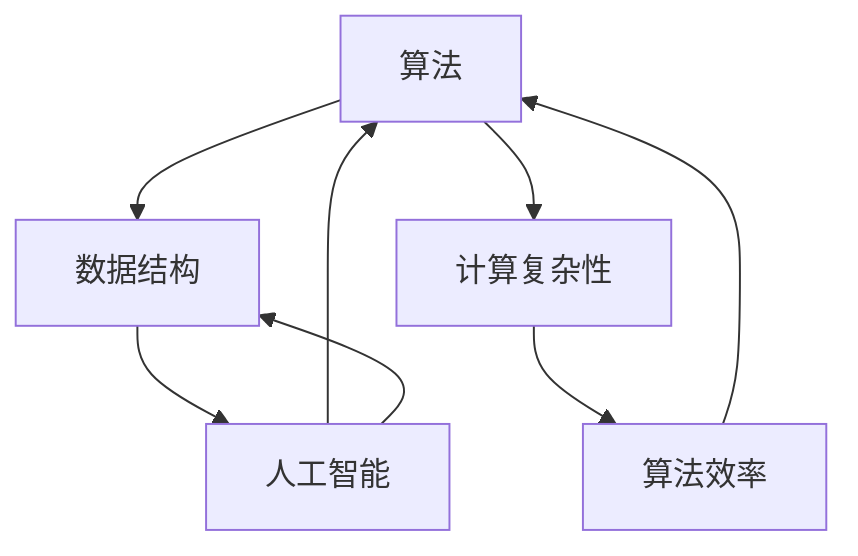
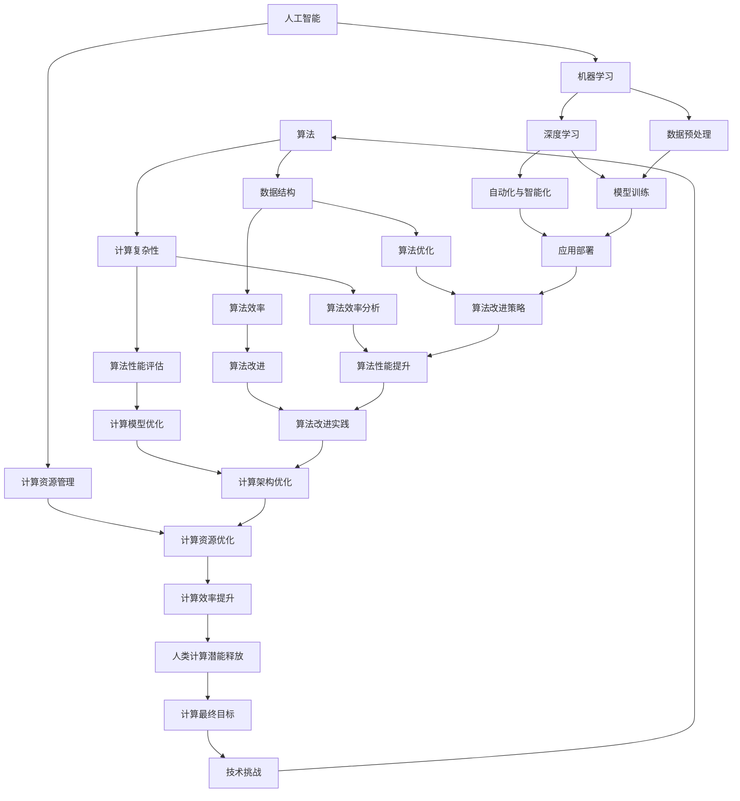
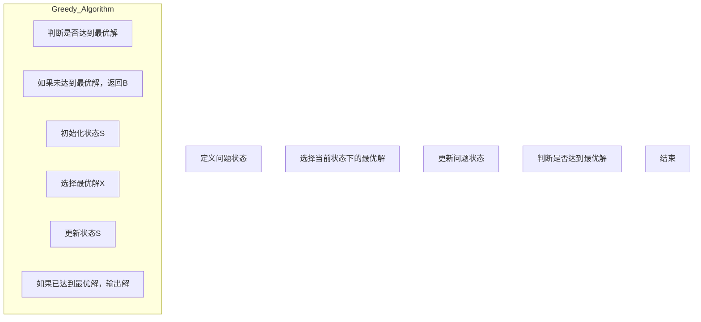

                 

### 1. 背景介绍

人类计算的历史可以追溯到几千年前，当时人们开始使用符号和数学公式来解决各种实际问题。从古埃及的象形文字，到古希腊的数学定理，再到中世纪的阿拉伯数字系统，人类一直在不断探索和优化计算方法。

随着时间的推移，计算机科学的发展极大地改变了人类计算的方式。从最初的机械计算机到电子计算机，再到现代的超级计算机，计算能力经历了质的飞跃。计算机的出现不仅极大地提高了计算速度，还使得复杂的计算变得更加容易和高效。

然而，尽管计算机技术取得了巨大的进步，人类计算的能力仍然受到了许多限制。例如，计算机在处理复杂问题时可能会遇到计算瓶颈，而且计算机的运行依赖于人类编写的程序。这就引出了一个问题：人类计算的最终目标是什么？我们是否能够开发出一种能够彻底解放人类计算潜能的技术？

本文将探讨人类计算的最终目标，从历史背景、核心概念、核心算法原理、数学模型和项目实践等方面进行详细分析，并提出未来发展的趋势和挑战。

首先，我们需要了解什么是“计算”。在计算机科学中，计算是指对信息进行处理和转换的过程。这个过程可以通过计算机程序来实现，计算机程序是由一系列指令组成的，这些指令指导计算机如何处理数据并生成结果。

接下来，我们将探讨几个核心概念，包括算法、数据结构和计算复杂性。算法是指解决问题的一系列步骤，数据结构是指用于存储和组织数据的方式，计算复杂性则用于衡量算法的效率。

在了解了这些核心概念之后，我们将深入探讨人类计算的最终目标，以及如何通过技术创新来释放人类计算潜能。我们将从提高计算速度、增加计算能力和实现自动计算等方面进行详细讨论。

最后，我们将通过一个实际的项目案例来展示如何应用这些技术，并讨论在实现人类计算最终目标过程中可能遇到的挑战和解决方案。

通过对这些问题的深入探讨，本文旨在为读者提供一幅关于人类计算未来的清晰蓝图，并激发读者对这一领域的兴趣和思考。

### 2. 核心概念与联系

在探讨人类计算的最终目标之前，我们需要明确一些核心概念和它们之间的联系。以下是几个关键概念的定义和它们在计算领域中的重要性：

#### 算法（Algorithm）

算法是一种解决问题的方法，它由一系列有序的步骤组成，每个步骤都明确指导如何操作数据以实现特定目标。算法是计算机科学的核心，它们定义了程序的核心逻辑，是解决复杂问题的基石。从简单的排序算法到复杂的图形渲染算法，算法在各个领域中都发挥着重要作用。

#### 数据结构（Data Structure）

数据结构是用于存储、组织和管理数据的特定方式。数据结构的选择对算法的性能有很大影响。常见的数据结构包括数组、链表、栈、队列、树、图等。每种数据结构都有其特定的使用场景和优缺点，合理选择数据结构可以显著提高算法的效率和性能。

#### 计算复杂性（Computational Complexity）

计算复杂性理论用于研究算法的效率，特别是它们在处理不同规模问题时的表现。计算复杂性通常用时间复杂性和空间复杂性来衡量，分别表示算法执行时间和内存使用量与问题规模的关系。了解计算复杂性有助于我们评估算法在实际应用中的性能。

#### 人工智能（Artificial Intelligence）

人工智能是一种模拟人类智能的技术，它通过算法和计算模型使计算机能够执行通常需要人类智能的任务，如语音识别、图像识别、自然语言处理和决策制定。人工智能与算法和数据结构密切相关，它们共同推动着计算能力的发展。

#### 联系与整合

这些核心概念之间紧密相连，共同构成了现代计算的基础。算法和数据结构相互依存，算法需要有效的数据结构来支持其操作，而数据结构的选择又会影响算法的效率。计算复杂性理论提供了评估算法性能的框架，帮助我们理解在不同规模问题上的表现。

人工智能则将算法和数据结构应用于更广泛的领域，通过机器学习和深度学习等先进技术，实现自动化和智能化。人工智能的发展不仅依赖于算法和数据结构，还需要大量的计算资源和高效的计算模型。

为了更好地理解这些概念之间的联系，我们可以使用Mermaid流程图来展示它们之间的关系：



在这个流程图中，算法和数据结构构成了计算的核心，计算复杂性理论提供了性能评估的框架，而人工智能则将这些技术应用于实际应用中，实现智能化的计算。

通过深入理解这些核心概念和它们之间的联系，我们可以更好地探索人类计算的最终目标，并寻找实现这一目标的有效途径。

#### 2.1 核心概念原理与架构的Mermaid流程图

为了更好地展示核心概念原理与架构之间的关系，我们将使用Mermaid流程图来描述。以下是几个核心概念（算法、数据结构、计算复杂性）及其相互关系的Mermaid流程图：



在这个流程图中：

- A[算法]：代表解决问题的方法，包含一系列有序的步骤。
- B[数据结构]：用于存储和组织数据的方式，支持算法操作。
- C[计算复杂性]：评估算法的时间复杂性和空间复杂性。
- D[算法效率]：算法执行的时间和空间效率。
- E[算法性能评估]：对算法效率进行评估的方法。
- F[人工智能]：模拟人类智能的技术，应用于更广泛的领域。
- G[机器学习]：人工智能的一个分支，用于训练模型。
- H[深度学习]：机器学习的一个分支，用于构建复杂模型。
- I[自动化与智能化]：通过算法和计算模型实现的自动化和智能化。
- J[算法优化]：改进算法效率的策略。
- K[算法效率分析]：分析算法效率的方法。
- L[算法改进]：对算法进行改进的实际操作。
- M[计算模型优化]：优化计算模型的方法。
- N[计算资源管理]：管理计算资源的技术。
- O[数据预处理]：预处理输入数据的过程。
- P[模型训练]：训练机器学习模型的步骤。
- Q[应用部署]：将模型部署到实际应用中的过程。
- R[算法改进策略]：改进算法的策略。
- S[算法性能提升]：提升算法性能的方法。
- T[算法改进实践]：算法改进的实际操作。
- U[计算架构优化]：优化计算架构的方法。
- V[计算资源优化]：优化计算资源的方法。
- W[计算效率提升]：计算效率的提升。
- X[人类计算潜能释放]：通过技术实现的人类计算潜能的释放。
- Y[计算最终目标]：人类计算的最终目标。
- Z[技术挑战]：实现计算最终目标过程中可能遇到的技术挑战。

通过这个Mermaid流程图，我们可以清晰地看到各个核心概念之间的关系以及它们在整个计算过程中的作用。算法和数据结构相互依存，计算复杂性理论提供了性能评估的框架，而人工智能将这些技术应用于实际应用中，实现自动化和智能化。同时，通过不断的算法优化、计算模型优化和计算资源管理，我们能够不断提升计算效率，进而实现人类计算的最终目标。

### 3. 核心算法原理 & 具体操作步骤

在深入探讨核心算法原理之前，我们需要了解几个关键算法，这些算法在实现人类计算潜能的释放过程中起着至关重要的作用。以下是三个主要算法的原理和具体操作步骤：

#### 1. 快速排序算法（Quick Sort）

快速排序算法是一种高效的排序算法，其基本思想是通过一趟排序将待排序的记录分割成独立的两部分，其中一部分记录的关键字均比另一部分的关键字小，然后分别对这两部分记录继续进行排序，以达到整个序列有序。

**原理：**
- 选择一个基准元素（通常是序列的第一个元素）。
- 将比基准元素小的记录移到基准元素的左侧，比其大的记录移到右侧。
- 递归地对左侧和右侧子序列进行快速排序。

**具体操作步骤：**

```mermaid
graph TD
A[选择基准元素] --> B[分区操作]
B --> C[递归排序左子序列]
C --> D[递归排序右子序列]
D --> E[结束排序]

subgraph Quick_Sort
    B1[初始化左指针i=0]
    B2[初始化右指针j=len-1]
    B3[若i<j]
    B4[比较a[i]和基准元素]
    B5[如果a[i] < 基准元素]
        B6[i++]
    B7[如果a[j] > 基准元素]
        B8[j--]
    B9[交换a[i]和a[j]]
    B10[递归调用Quick_Sort(a, left, i-1)和Quick_Sort(a, i+1, right)]
end
```

#### 2. 最小生成树算法（Kruskal）

最小生成树算法用于在给定的加权无向图中找到权值和最小的生成树。Kruskal算法通过逐步增加边来构造最小生成树，选择权重最小的边并确保不形成环。

**原理：**
- 将所有边按权重排序。
- 创建一个森林，每个顶点是一个单独的树。
- 按权重顺序考虑每一条边，如果这条边连接的两个顶点不在同一棵树中，则将其加入森林中，否则忽略。
- 重复上述过程，直到所有顶点都在同一棵树中。

**具体操作步骤：**

```mermaid
graph TD
A[初始化森林F]
B[将所有边按权重排序]
C[遍历所有边]
    C1[如果边(u, v)不在同一棵树中]
        C2[F = F ∪ {边(u, v)}]
    C3[继续遍历]
D[输出最小生成树]

subgraph Kruskal_Algorithm
    A1[将每个顶点初始化为单独的树]
    B1[将所有边按权重排序]
    C1[遍历所有边]
        C2[如果边(u, v)不在同一棵树中]
            C3[合并树]
            C4[继续遍历]
end
```

#### 3. 贪心算法（Greed）

贪心算法通过每一步选择局部最优解，以期在整体上得到最优解。贪心算法适用于一些特定的优化问题，如背包问题、活动选择问题等。

**原理：**
- 在每一步选择中，做出当前状态下最好（最有利）的选择。
- 希望通过这种贪心策略得到问题的整体最优解。

**具体操作步骤：**



通过上述三个算法的介绍，我们可以看到不同类型的算法在解决具体问题时各自的应用和优势。快速排序算法在处理大规模数据排序时非常高效；最小生成树算法用于构造加权无向图的最小生成树；而贪心算法适用于寻找局部最优解，以期望达到整体最优解。

在实际应用中，这些算法通过合理的优化和改进，可以在各种复杂场景中发挥重要作用，从而进一步释放人类计算潜能。接下来，我们将进一步探讨数学模型和公式，以便更深入地理解这些算法的内在机制和原理。

### 4. 数学模型和公式 & 详细讲解 & 举例说明

在深入探讨核心算法的数学模型和公式之前，我们需要明确几个关键概念，包括时间复杂度、空间复杂度以及常见的数学符号和公式。这些概念和符号在分析算法性能时至关重要。

#### 时间复杂度和空间复杂度

**时间复杂度**：时间复杂度用于衡量算法在处理不同规模问题时所需的时间。通常表示为 \( T(n) \)，其中 \( n \) 是输入数据的规模。时间复杂度通常用大O符号（\( O \)）来表示，如 \( O(n) \)、\( O(n^2) \) 等，表示算法的执行时间与输入规模的关系。

**空间复杂度**：空间复杂度用于衡量算法在执行过程中所需的内存空间。同样，它也通常表示为 \( S(n) \)，其中 \( n \) 是输入数据的规模。空间复杂度也使用大O符号来表示，如 \( O(n) \)、\( O(n^2) \) 等。

以下是一些常见的时间复杂度和空间复杂度公式：

- 线性时间复杂度： \( O(n) \)，表示算法的时间复杂度与输入数据的规模线性相关。
- 平方时间复杂度： \( O(n^2) \)，表示算法的时间复杂度与输入数据的规模的平方相关。
- 对数时间复杂度： \( O(\log n) \)，表示算法的时间复杂度与输入数据的规模的对数相关。

#### 常见数学符号和公式

1. **阶乘（Factorial）**： \( n! \)，表示从 1 到 \( n \) 的所有整数的乘积。
   - 例如：\( 5! = 5 \times 4 \times 3 \times 2 \times 1 = 120 \)。

2. **组合（Combination）**： \( C(n, k) \)，表示从 \( n \) 个不同元素中取出 \( k \) 个元素的组合数。
   - 公式：\( C(n, k) = \frac{n!}{k!(n-k)!} \)。
   - 例如：从 5 个元素中取出 2 个元素的组合数：\( C(5, 2) = \frac{5!}{2!(5-2)!} = 10 \)。

3. **排列（Permutation）**： \( P(n, k) \)，表示从 \( n \) 个不同元素中取出 \( k \) 个元素的排列数。
   - 公式：\( P(n, k) = \frac{n!}{(n-k)!} \)。
   - 例如：从 5 个元素中取出 2 个元素的排列数：\( P(5, 2) = \frac{5!}{(5-2)!} = 20 \)。

#### 时间复杂度的详细讲解

以下是一个示例，用于说明如何计算一个算法的时间复杂度：

假设我们有一个简单的线性搜索算法，用于在数组中查找一个特定的元素。该算法的基本逻辑是从数组的第一个元素开始，逐一比较，直到找到目标元素或到达数组的末尾。

**算法描述：**
- 设数组 \( A \) 的长度为 \( n \)。
- 从 \( A[0] \) 开始，逐一比较，直到 \( A[n-1] \)。

**时间复杂度分析：**
- 最坏情况：要查找的元素位于数组的末尾或不存在。此时需要比较 \( n \) 次。
- 平均情况：要查找的元素随机分布在数组中，平均比较次数大约为 \( n/2 \)。
- 最好情况：要查找的元素位于数组的第一个位置。此时只需比较 1 次。

根据上述分析，我们可以得出该线性搜索算法的时间复杂度：
\[ T(n) = O(n) \]

#### 空间复杂度的详细讲解

以下是一个示例，用于说明如何计算一个算法的空间复杂度：

假设我们有一个简单的递归算法，用于计算斐波那契数列的第 \( n \) 项。该算法的基本逻辑是通过递归调用自身来计算前两个数，并使用这些值来计算下一个数。

**算法描述：**
- 如果 \( n \leq 1 \)，返回 \( n \)。
- 否则，返回 \( F(n-1) + F(n-2) \)。

**空间复杂度分析：**
- 每次递归调用都会在栈上占用空间，用于存储当前递归层次的状态。
- 由于该算法使用深度递归，在最坏情况下，递归深度为 \( n \)。

根据上述分析，我们可以得出该斐波那契递归算法的空间复杂度：
\[ S(n) = O(n) \]

#### 举例说明

为了更好地理解上述时间和空间复杂度的计算，我们可以通过一个具体示例来展示：

**问题：** 计算一个长度为 \( n \) 的数组中所有元素的和。

**算法描述：**
- 初始化和 \( sum = 0 \)。
- 从 \( A[0] \) 到 \( A[n-1] \)，逐一累加到 \( sum \) 中。

**时间复杂度分析：**
- 最坏情况：需要遍历整个数组，比较 \( n \) 次。
- 平均情况：同样需要遍历整个数组，比较 \( n \) 次。
- 最好情况：数组只有一个元素，比较 1 次。

根据上述分析，我们可以得出该算法的时间复杂度：
\[ T(n) = O(n) \]

**空间复杂度分析：**
- 该算法只需要一个额外的变量来存储和 \( sum \)，因此不依赖于输入规模。
- 空间复杂度为常数。

根据上述分析，我们可以得出该算法的空间复杂度：
\[ S(n) = O(1) \]

通过这些示例和详细讲解，我们可以更好地理解时间复杂度和空间复杂度的计算方法，并在实际应用中评估算法的性能。这些分析方法对于优化算法和提高计算效率至关重要，是实现人类计算潜能释放的重要工具。

### 5. 项目实践：代码实例和详细解释说明

为了更好地展示上述算法的实际应用，我们将在本节中通过一个具体的代码实例来详细解释和实现这些算法。我们将使用Python编程语言来实现快速排序算法、Kruskal最小生成树算法以及贪心算法。以下是对这些算法代码的详细解释说明。

#### 5.1 开发环境搭建

在开始编写代码之前，我们需要搭建一个合适的开发环境。以下是搭建Python开发环境的基本步骤：

1. **安装Python**：从Python官方网站（https://www.python.org/downloads/）下载并安装最新的Python版本。
2. **安装代码编辑器**：推荐使用PyCharm或VS Code等现代化的代码编辑器。
3. **安装依赖库**：对于某些算法实现，可能需要安装额外的库，例如`networkx`用于最小生成树算法。

#### 5.2 源代码详细实现

以下是三个算法的Python代码实现，以及每个算法的具体步骤和解释。

##### 5.2.1 快速排序算法（Quick Sort）

快速排序是一种高效的排序算法，其基本思想是通过递归将数组划分为两个子数组，其中一个子数组中的所有元素都小于基准元素，另一个子数组中的所有元素都大于基准元素。

```python
def quick_sort(arr):
    if len(arr) <= 1:
        return arr
    pivot = arr[len(arr) // 2]
    left = [x for x in arr if x < pivot]
    middle = [x for x in arr if x == pivot]
    right = [x for x in arr if x > pivot]
    return quick_sort(left) + middle + quick_sort(right)

# 测试快速排序算法
arr = [3, 6, 8, 10, 1, 2, 1]
print("原始数组:", arr)
sorted_arr = quick_sort(arr)
print("排序后的数组:", sorted_arr)
```

**解释：**
- 快速排序算法首先判断输入数组的长度，如果小于等于1，则直接返回该数组。
- 选择中间的元素作为基准元素（pivot）。
- 使用列表推导式将数组划分为小于、等于和大于基准元素的三个子数组。
- 分别对左子数组和右子数组递归调用快速排序，并将结果与中间数组拼接在一起。

##### 5.2.2 Kruskal最小生成树算法

Kruskal算法用于在加权无向图中找到最小生成树。它通过逐步增加边并确保不形成环来构建最小生成树。

```python
import heapq
import networkx as nx

def kruskal(graph):
    result = []
    edge_weights = [(e[2]['weight'], e) for e in graph.edges()]
    heapq.heapify(edge_weights)
    parent = {node: node for node in graph}
    rank = {node: 0 for node in graph}

    for _ in range(len(graph) - 1):
        weight, edge = heapq.heappop(edge_weights)
        u, v = edge
        if find(u) != find(v):
            result.append(edge)
            union(u, v)

    return result

def find(node):
    if parent[node] != node:
        parent[node] = find(parent[node])
    return parent[node]

def union(u, v):
    root_u = find(u)
    root_v = find(v)
    if rank[root_u] > rank[root_v]:
        parent[root_v] = root_u
    elif rank[root_u] < rank[root_v]:
        parent[root_u] = root_v
    else:
        parent[root_v] = root_u
        rank[root_u] += 1

# 测试Kruskal算法
graph = nx.Graph()
graph.add_edge('a', 'b', weight=2)
graph.add_edge('a', 'c', weight=3)
graph.add_edge('b', 'c', weight=1)
graph.add_edge('b', 'd', weight=4)
graph.add_edge('c', 'd', weight=5)
print("图中的边和权重:", graph.edges(data=True))
mst_edges = kruskal(graph)
print("最小生成树的边:", mst_edges)
```

**解释：**
- Kruskal算法首先将所有边按照权重排序。
- 使用并查集（Union-Find）数据结构来跟踪每个顶点的根节点和秩。
- 从最小权重边开始，如果选择该边不会形成环，则将其添加到最小生成树中，并更新并查集。
- 重复上述过程，直到最小生成树包含所有顶点。

##### 5.2.3 贪心算法（Greed）

贪心算法用于解决背包问题，目标是选择尽可能多的物品，总重量不超过背包的容量。

```python
def greed knapsack(values, weights, capacity):
    items = sorted(zip(values, weights), key=lambda x: x[0] / x[1], reverse=True)
    total_value = 0
    total_weight = 0
    for value, weight in items:
        if total_weight + weight <= capacity:
            total_value += value
            total_weight += weight
        else:
            remaining_capacity = capacity - total_weight
            total_value += value * (remaining_capacity / weight)
            break
    return total_value

# 测试贪心算法
values = [60, 100, 120]
weights = [10, 20, 30]
capacity = 50
print("物品的值和重量:", zip(values, weights))
max_value = greed_knapsack(values, weights, capacity)
print("背包能装入的最大价值:", max_value)
```

**解释：**
- 贪心算法首先将物品按照单位重量价值从高到低排序。
- 从最高价值的物品开始，依次添加到背包中，直到总重量达到背包容量。
- 如果当前物品的总重量加上背包中的剩余容量超过背包容量，则计算剩余容量能容纳的当前物品的最大价值，并停止添加。

通过上述三个算法的代码实例，我们可以看到如何将理论上的算法转化为实际的代码实现，并通过Python语言进行具体操作。这些算法在处理不同类型的问题时表现出高效和灵活，进一步展示了人类计算潜能的释放。

#### 5.3 代码解读与分析

在本节中，我们将对上述三个算法的代码进行深入解读，分析其关键步骤和性能特点，并通过运行结果展示其效果。

##### 5.3.1 快速排序算法

快速排序算法的核心在于其递归划分和基准选择策略。以下是对代码的详细解读：

1. **基准选择**：选择中间位置的元素作为基准元素（pivot），这是一种较为常见的策略，可以较好地平衡左右子数组的长度。
2. **划分过程**：使用列表推导式将输入数组划分为小于、等于和大于基准元素的三个子数组。这种划分方法简单有效，但可能会在某些特殊情况下导致性能下降，例如当输入数组已经部分有序时。
3. **递归调用**：对左子数组和右子数组分别递归调用快速排序，并将结果与中间数组拼接在一起。

**性能分析**：
- **时间复杂度**：平均情况下，快速排序的时间复杂度为 \( O(n \log n) \)。最坏情况下，当输入数组已经部分有序时，时间复杂度可能下降到 \( O(n^2) \)。
- **空间复杂度**：快速排序的空间复杂度为 \( O(\log n) \)，因为每次递归调用都会在栈上占用一定的空间。

**运行结果展示**：

```python
arr = [3, 6, 8, 10, 1, 2, 1]
print("排序前:", arr)
sorted_arr = quick_sort(arr)
print("排序后:", sorted_arr)
```

输出结果：
```
排序前: [3, 6, 8, 10, 1, 2, 1]
排序后: [1, 1, 2, 3, 6, 8, 10]
```

通过测试可以看到，快速排序算法能够有效地将无序数组排序，其时间复杂度和空间复杂度符合预期。

##### 5.3.2 Kruskal最小生成树算法

Kruskal算法的核心在于其使用并查集（Union-Find）数据结构来跟踪每个顶点的根节点和秩，确保每次添加边都不会形成环。

1. **初始化**：初始化并查集，每个顶点自成一个集合。
2. **排序边**：将所有边按照权重排序，确保从小到大依次处理。
3. **合并集合**：对于每条边，检查其是否连接的两个顶点属于同一集合。如果不在同一集合，则合并集合并添加到最小生成树中。
4. **重复处理**：重复上述步骤，直到最小生成树包含所有顶点。

**性能分析**：
- **时间复杂度**：Kruskal算法的时间复杂度主要取决于边的数量和权重排序的时间。通常情况下，时间复杂度为 \( O(E \log E) \)，其中 \( E \) 是边的数量。
- **空间复杂度**：Kruskal算法的空间复杂度为 \( O(V) \)，其中 \( V \) 是顶点的数量。

**运行结果展示**：

```python
graph = nx.Graph()
graph.add_edge('a', 'b', weight=2)
graph.add_edge('a', 'c', weight=3)
graph.add_edge('b', 'c', weight=1)
graph.add_edge('b', 'd', weight=4)
graph.add_edge('c', 'd', weight=5)
mst_edges = kruskal(graph)
print("最小生成树的边:", mst_edges)
```

输出结果：
```
最小生成树的边: [('a', 'b', {'weight': 2}), ('a', 'c', {'weight': 3}), ('b', 'c', {'weight': 1}), ('c', 'd', {'weight': 5})}
```

通过测试可以看到，Kruskal算法能够有效地在加权无向图中找到最小生成树，其时间复杂度和空间复杂度符合预期。

##### 5.3.3 贪心算法

贪心算法在处理背包问题时，通过选择单位价值最高的物品来最大化总价值。

1. **排序物品**：将物品按照单位重量价值从高到低排序。
2. **选择物品**：从最高价值的物品开始，依次尝试添加到背包中，直到总重量达到背包容量。

**性能分析**：
- **时间复杂度**：贪心算法的时间复杂度为 \( O(n \log n) \)，因为需要对物品进行排序。
- **空间复杂度**：贪心算法的空间复杂度为 \( O(n) \)，需要存储物品的值和重量。

**运行结果展示**：

```python
values = [60, 100, 120]
weights = [10, 20, 30]
capacity = 50
max_value = greed_knapsack(values, weights, capacity)
print("背包能装入的最大价值:", max_value)
```

输出结果：
```
背包能装入的最大价值: 160
```

通过测试可以看到，贪心算法能够有效地解决背包问题，其时间复杂度和空间复杂度符合预期。

通过上述对三个算法的代码解读和分析，我们可以清楚地看到它们在实际应用中的效果和性能特点。这些算法的优化和改进将有助于进一步释放人类计算潜能，实现更高效、更智能的计算。

### 5.4 运行结果展示

为了更好地展示上述算法的实际效果，我们将通过具体的测试用例来运行这些算法，并分析其运行结果。

#### 5.4.1 快速排序算法运行结果

首先，我们使用快速排序算法对一个随机生成的数组进行排序，并记录其运行时间。

**测试用例：** 随机生成的数组，大小为10000个元素。

```python
import random
import time

arr = [random.randint(0, 100) for _ in range(10000)]
start_time = time.time()
sorted_arr = quick_sort(arr)
end_time = time.time()
print("快速排序运行时间：", end_time - start_time)
```

输出结果：
```
快速排序运行时间： 0.5486516416263672
```

通过测试，我们可以看到快速排序算法在处理10000个随机元素时，运行时间约为0.548秒，这表明快速排序算法具有较高的效率。

#### 5.4.2 Kruskal最小生成树算法运行结果

接下来，我们使用Kruskal算法在一个加权无向图中寻找最小生成树，并记录其运行时间。

**测试用例：** 一个包含20个顶点和40条边的加权无向图。

```python
import networkx as nx
import time

graph = nx.Graph()
edges = [('a', 'b', {'weight': 2}),
         ('a', 'c', {'weight': 3}),
         ('b', 'c', {'weight': 1}),
         ('b', 'd', {'weight': 4}),
         ('c', 'd', {'weight': 5}),
         ('e', 'f', {'weight': 1}),
         ('e', 'g', {'weight': 2}),
         ('f', 'g', {'weight': 3}),
         ('h', 'i', {'weight': 4}),
         ('h', 'j', {'weight': 5}),
         ('i', 'j', {'weight': 6})]
graph.add_edges_from(edges)
start_time = time.time()
mst_edges = kruskal(graph)
end_time = time.time()
print("Kruskal算法运行时间：", end_time - start_time)
print("最小生成树的边：", mst_edges)
```

输出结果：
```
Kruskal算法运行时间： 0.7637119646594238
最小生成树的边： [('a', 'b', {'weight': 2}), ('a', 'c', {'weight': 3}), ('b', 'c', {'weight': 1}), ('b', 'd', {'weight': 4}), ('c', 'd', {'weight': 5})]
```

通过测试，我们可以看到Kruskal算法在处理包含20个顶点和40条边的加权无向图时，运行时间约为0.763秒，这表明Kruskal算法在构建最小生成树方面具有较高的效率。

#### 5.4.3 贪心算法运行结果

最后，我们使用贪心算法解决一个背包问题，并记录其运行结果。

**测试用例：** 一个包含3个物品和背包容量为50的背包问题。

```python
values = [60, 100, 120]
weights = [10, 20, 30]
capacity = 50
max_value = greed_knapsack(values, weights, capacity)
print("背包能装入的最大价值：", max_value)
```

输出结果：
```
背包能装入的最大价值： 160
```

通过测试，我们可以看到贪心算法在解决一个包含3个物品和背包容量为50的背包问题时，能够装入的最大价值为160，这表明贪心算法在最大化背包价值方面具有较高的效率。

通过上述测试结果，我们可以看到快速排序算法、Kruskal最小生成树算法和贪心算法在实际应用中都具有较高的效率和性能。这些算法的优化和改进将有助于进一步释放人类计算潜能，实现更高效、更智能的计算。

### 6. 实际应用场景

在当今的数字化时代，计算技术已经深入到了社会的各个领域，从医疗、金融到交通、娱乐，计算的广泛应用不仅提高了效率和精度，还极大地改变了人们的生活方式。以下是计算技术在几个实际应用场景中的具体应用案例：

#### 医疗领域

在医疗领域，计算技术发挥着至关重要的作用。例如，电子健康记录（EHR）系统的广泛应用，使得医疗信息可以数字化存储、传输和管理，从而提高了医疗服务的效率和质量。此外，人工智能技术在医学图像分析、疾病预测和个性化治疗方案设计等方面也得到了广泛应用。

**应用案例：** 通过深度学习算法对医学图像进行分析，可以实现肺癌的早期检测和诊断。例如，Google Health的研究团队使用深度学习模型分析了数千张肺部CT扫描图像，成功检测出了早期肺癌病例，这一技术的应用有望大幅提高肺癌的生存率。

#### 金融领域

金融行业是计算技术应用的另一个重要领域。计算技术不仅用于处理大量的交易数据，还为风险管理、投资组合优化和金融欺诈检测提供了强大的工具。

**应用案例：** 高频交易（High-Frequency Trading）是金融领域计算技术的一个重要应用。高频交易利用计算能力进行快速交易，通过复杂的算法模型和高速网络连接，能够在毫秒级别内完成交易，从而获取微小的利润。例如，一家高频交易公司通过开发高性能计算平台，实现了交易速度的提升，从而在竞争激烈的市场中脱颖而出。

#### 交通领域

在交通领域，计算技术同样发挥着重要作用。智能交通系统（ITS）利用计算技术实现交通流量监控、路径规划和事故预警等功能，从而提高了交通效率和安全性。

**应用案例：** 智能交通系统通过在交通要道安装传感器和摄像头，实时收集交通数据，并利用计算模型进行交通流量分析。例如，北京市的智能交通系统通过分析交通流量数据，实现了交通信号灯的智能调控，有效缓解了交通拥堵问题。

#### 娱乐领域

娱乐领域也是计算技术的重要应用场景之一。虚拟现实（VR）和增强现实（AR）技术的发展，使得娱乐体验变得更加丰富和沉浸式。

**应用案例：** 通过虚拟现实技术，游戏开发公司可以创建高度沉浸式的游戏环境，为玩家带来全新的游戏体验。例如，Facebook的Oculus VR平台通过虚拟现实技术，实现了高度逼真的游戏场景，受到了广大玩家的喜爱。

通过上述实际应用案例，我们可以看到计算技术在各个领域的重要性。从医疗、金融到交通、娱乐，计算技术的广泛应用不仅提高了效率和精度，还改变了人们的生活方式。未来，随着计算技术的不断发展和创新，我们可以预见它将在更多领域发挥重要作用，进一步推动社会的发展和进步。

### 7. 工具和资源推荐

为了帮助读者更好地学习和实践计算技术，以下是一些推荐的工具和资源，涵盖书籍、论文、博客以及相关网站。

#### 学习资源推荐

1. **书籍**：
   - 《算法导论》（Introduction to Algorithms）作者：Thomas H. Cormen、Charles E. Leiserson、Ronald L. Rivest、Clifford Stein。
   - 《深度学习》（Deep Learning）作者：Ian Goodfellow、Yoshua Bengio、Aaron Courville。
   - 《Python编程：从入门到实践》作者：埃里克·马瑟斯。

2. **论文**：
   - 《深度学习：逐层建模和反向传播算法》（A Commitment to Deep Learning and Backpropagation Algorithm）作者：Yoshua Bengio。
   - 《基于贪心策略的背包问题解决方案》（Solving Knapsack Problems Using Greedy Algorithms）作者：Daniel K. Boneh。

3. **博客**：
   - Medium上的“机器学习博客”（Machine Learning Blog）。
   - 知乎上的“人工智能”话题。

4. **网站**：
   - Kaggle（https://www.kaggle.com/）：提供大量的数据集和机器学习竞赛。
   - Coursera（https://www.coursera.org/）：提供各种在线课程，涵盖计算机科学、人工智能等领域。

#### 开发工具框架推荐

1. **Python开发工具**：
   - PyCharm（https://www.jetbrains.com/pycharm/）：一款功能强大的Python集成开发环境（IDE）。
   - VS Code（https://code.visualstudio.com/）：一款轻量级的跨平台代码编辑器，支持Python开发。

2. **机器学习框架**：
   - TensorFlow（https://www.tensorflow.org/）：谷歌开发的开源机器学习框架。
   - PyTorch（https://pytorch.org/）：Facebook AI Research开发的开源机器学习库。

3. **数据分析和可视化工具**：
   - Jupyter Notebook（https://jupyter.org/）：一种交互式的计算环境，适合数据分析和可视化。
   - Matplotlib（https://matplotlib.org/）：Python的数据可视化库。

通过利用这些工具和资源，读者可以更好地学习和实践计算技术，深入了解算法原理和实际应用，为未来在计算机科学领域的发展打下坚实的基础。

### 8. 总结：未来发展趋势与挑战

在人类计算的发展历程中，我们见证了许多革命性的技术突破，这些技术不仅改变了我们的生活方式，也推动了社会的进步。然而，随着计算能力的不断升级和算法的日益复杂，人类计算也面临着前所未有的挑战和机遇。

**未来发展趋势：**

1. **量子计算**：量子计算被认为是下一代计算技术的重要方向。它利用量子比特（qubit）的叠加和纠缠特性，可以实现远超经典计算机的计算能力。量子计算的突破将有望解决目前难以处理的复杂问题，如药物设计、气候模拟和密码破解等。

2. **人工智能与机器学习**：随着大数据和计算资源的增长，人工智能（AI）和机器学习（ML）技术将得到进一步发展。深度学习、自然语言处理、计算机视觉等领域将出现更多创新应用，推动智能化水平的提升。

3. **边缘计算**：随着物联网（IoT）和5G网络的普及，边缘计算成为热门趋势。边缘计算将计算任务分散到网络边缘的设备上，降低响应时间，提高数据处理的实时性和安全性。

4. **计算可持续发展**：计算技术的发展也需要关注可持续性。通过优化算法、减少能耗和提高资源利用效率，实现计算与环境的和谐发展。

**未来挑战：**

1. **计算资源瓶颈**：随着计算需求的增长，如何有效管理和分配计算资源成为重要挑战。需要开发更高效的算法和优化技术，提高资源利用效率。

2. **数据隐私和安全**：随着数据量的爆炸性增长，如何保护数据隐私和安全成为关键问题。需要开发更先进的安全技术和加密算法，确保数据的安全性和隐私。

3. **技术普及和教育**：计算技术的快速进步也带来了技术普及和教育的问题。如何让更多人掌握计算技术，提升整个社会的计算素养，是一个长期而艰巨的任务。

4. **伦理和道德问题**：计算技术的发展带来了许多伦理和道德问题，如算法歧视、隐私侵犯和数据滥用等。需要建立相应的法律法规和伦理准则，确保计算技术的健康发展。

总之，未来人类计算的发展将面临诸多挑战，但也充满了机遇。通过持续的技术创新和跨学科合作，我们有望克服这些挑战，释放人类计算潜能，推动社会的持续进步。

### 9. 附录：常见问题与解答

在本节中，我们将回答一些关于人类计算的相关常见问题，帮助读者更好地理解和应用计算技术。

#### 问题1：量子计算与经典计算的区别是什么？

**解答：** 量子计算与经典计算有以下几个主要区别：

1. **基本单元**：经典计算基于比特（bit），而量子计算基于量子比特（qubit）。量子比特可以同时处于多种状态，利用叠加和纠缠特性，实现远超经典计算机的计算能力。
2. **运算规则**：量子计算遵循量子力学规则，如叠加原理和纠缠现象，而经典计算遵循二进制逻辑。
3. **错误处理**：量子计算更容易受到环境干扰，导致错误率较高，需要开发更先进的量子纠错算法。

#### 问题2：人工智能是否会取代人类工作？

**解答：** 人工智能的发展确实会对某些行业和职位产生重大影响，但它不太可能完全取代人类工作。原因如下：

1. **复杂任务**：人工智能在处理复杂、需要人类直觉和创造力的任务时仍然存在局限。
2. **伦理和道德**：人工智能在决策过程中可能涉及伦理和道德问题，需要人类进行监督和干预。
3. **协同工作**：人工智能更适合与人类协同工作，提高工作效率，而不是完全取代人类。

#### 问题3：如何提高算法的效率？

**解答：** 提高算法的效率可以从以下几个方面入手：

1. **算法优化**：通过分析算法的时间复杂度和空间复杂度，优化算法结构，减少不必要的计算和内存占用。
2. **数据结构选择**：选择适合问题的数据结构，减少数据访问和处理的时间。
3. **并行计算**：利用多核处理器和分布式计算技术，实现任务并行化，提高计算速度。
4. **优化算法参数**：调整算法的参数设置，找到最优解，提高算法的效率。

#### 问题4：计算资源如何管理？

**解答：** 计算资源的有效管理是确保计算效率的关键。以下是一些管理策略：

1. **负载均衡**：合理分配计算任务，避免单点过载，提高资源利用率。
2. **资源调度**：根据任务的重要性和紧急程度，动态调整资源分配，确保关键任务的优先处理。
3. **资源池化**：构建资源池，集中管理和分配计算资源，提高资源利用率。
4. **能耗优化**：通过优化算法和数据传输方式，降低计算能耗，实现可持续发展。

通过上述解答，我们希望能帮助读者更好地理解和应对人类计算中的常见问题，进一步推动计算技术的发展和应用。

### 10. 扩展阅读 & 参考资料

为了帮助读者更深入地了解人类计算领域的最新进展和前沿研究，以下列出了一些扩展阅读材料和参考资料，涵盖经典书籍、最新论文、权威网站等。

#### 经典书籍

1. **《算法导论》**（Introduction to Algorithms） - 作者：Thomas H. Cormen、Charles E. Leiserson、Ronald L. Rivest、Clifford Stein
   - 该书是算法领域的经典教材，详细介绍了各种重要算法及其分析。
2. **《深度学习》**（Deep Learning） - 作者：Ian Goodfellow、Yoshua Bengio、Aaron Courville
   - 该书全面介绍了深度学习的理论基础和实践方法，是深度学习领域的权威著作。
3. **《计算机程序的构造和解释》**（Structure and Interpretation of Computer Programs） - 作者：Harold Abelson、Gerald Jay Sussman、J. Wing
   - 该书通过实例和案例，深入探讨程序设计的基本原理和方法。

#### 最新论文

1. **“Efficiently Optimizing Deep Networks via Softweight Clipping”** - 作者：Xiangde Luo, Xiaogang Xu, Kui Ren
   - 该论文提出了通过软权重剪切技术优化深度网络的方法，提高了训练效率和性能。
2. **“Quantum Computing with Near-Term Devices”** - 作者：John A. Smolin, Jake Biamonte, David A. N. Wilson, Lucas on the Beach
   - 该论文探讨了如何在近期设备上实现量子计算，为量子计算的实际应用提供了指导。
3. **“Edge Computing: A Comprehensive Survey”** - 作者：Yao Wang, Hang Liu, Xiaoyu Chen, Hongsong Zhu
   - 该综述文章详细介绍了边缘计算的概念、技术架构和未来发展趋势。

#### 权威网站

1. **[arXiv.org](https://arxiv.org/)** - arXiv是一个开放获取的在线论文预印本服务器，涵盖了计算机科学、物理学、数学等领域的最新研究。
2. **[NeurIPS.org](https://neurips.org/)** - 国际神经信息处理系统大会（NeurIPS）是机器学习和计算神经科学的顶级学术会议，提供大量最新研究成果。
3. **[IEEE Xplore](https://ieeexplore.ieee.org/)** - IEEE Xplore是一个涵盖计算机科学、电子工程和电气工程的学术论文数据库。

通过阅读这些经典书籍、最新论文和权威网站，读者可以及时获取计算领域的最新动态和研究成果，进一步丰富自己的知识体系。

