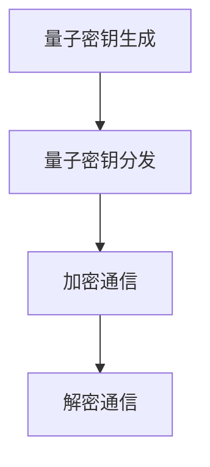

                 

### 文章标题

量子加密通信应用：网络安全的前沿创业

> 关键词：量子加密，通信应用，网络安全，前沿创业

> 摘要：本文将深入探讨量子加密通信在网络安全领域的应用，分析其核心概念和原理，探讨其在实际中的应用场景，以及未来发展的趋势和挑战。

### 1. 背景介绍

随着信息技术的飞速发展，网络安全问题日益严峻。传统的加密技术已经无法应对日益复杂的网络攻击手段，尤其是量子计算的出现，更使得现有的密码体系面临前所未有的威胁。在这种背景下，量子加密通信应运而生，成为网络安全领域的一个前沿研究方向。

量子加密通信利用量子物理的基本原理，如量子纠缠和量子叠加态，实现了信息的绝对安全传输。量子加密通信的发展不仅为解决当前网络安全问题提供了新的思路，也为未来的网络通信安全奠定了基础。

### 2. 核心概念与联系

#### 2.1 量子加密通信原理

量子加密通信的核心在于量子密钥分发（Quantum Key Distribution, QKD）。QKD 利用量子态的不可克隆特性，确保密钥在传输过程中不会被窃听或篡改。其基本原理如下：

1. **量子态传输**：发送方将信息编码在一个量子态上，并通过量子信道传输给接收方。
2. **量子态测量**：接收方对接收到的量子态进行测量，根据测量结果还原出原始信息。
3. **量子态纠缠**：在传输过程中，发送方和接收方之间的量子态可能会发生纠缠，确保信息在传输过程中不会被窃听。

#### 2.2 量子加密通信架构

量子加密通信的架构通常包括以下几个部分：

1. **量子密钥生成**：在量子密钥分发过程中，发送方和接收方通过量子信道生成共享密钥。
2. **量子密钥分发**：发送方将量子态发送给接收方，接收方测量量子态并反馈结果，双方根据测量结果协商共享密钥。
3. **加密通信**：使用共享密钥对通信数据进行加密和解密，确保通信过程的安全。

#### 2.3 Mermaid 流程图

以下是量子加密通信的 Mermaid 流程图：



### 3. 核心算法原理 & 具体操作步骤

#### 3.1 量子密钥生成

量子密钥生成的过程主要包括以下步骤：

1. **量子态初始化**：发送方生成一对纠缠的量子比特，并测量其中一个量子比特，根据测量结果初始化另一个量子比特。
2. **量子态编码**：发送方将量子密钥编码在量子态上，通过量子信道传输给接收方。
3. **量子态测量**：接收方对接收到的量子态进行测量，根据测量结果还原出量子密钥。

#### 3.2 量子密钥分发

量子密钥分发的过程主要包括以下步骤：

1. **量子态传输**：发送方将量子密钥编码在量子态上，通过量子信道传输给接收方。
2. **量子态测量**：接收方对接收到的量子态进行测量，并记录测量结果。
3. **密钥协商**：发送方和接收方根据测量结果协商共享密钥。

#### 3.3 加密通信

加密通信的过程主要包括以下步骤：

1. **数据加密**：发送方使用共享密钥对数据进行加密。
2. **数据传输**：加密后的数据通过量子信道传输给接收方。
3. **数据解密**：接收方使用共享密钥对数据进行解密，还原出原始数据。

### 4. 数学模型和公式 & 详细讲解 & 举例说明

#### 4.1 数学模型

量子加密通信的数学模型主要包括以下部分：

1. **量子态表示**：量子态可以用复数向量表示，如 \(|\psi\rangle = \alpha|0\rangle + \beta|1\rangle\)。
2. **量子门操作**：量子门是量子计算的基本操作，如 Hadamard 门（H）和控制非门（CNOT）。
3. **量子态测量**：量子态测量可以用来确定量子态的基向量。

#### 4.2 详细讲解

以下是对量子加密通信中的关键数学模型的详细讲解：

1. **量子态初始化**：
   $$|\psi\rangle_{\text{init}} = \frac{1}{\sqrt{2}}(|0\rangle + |1\rangle)$$
   发送方将这个量子态初始化在量子比特上。

2. **量子态编码**：
   $$|\psi\rangle_{\text{key}} = \alpha|0\rangle + \beta|1\rangle$$
   发送方将量子密钥编码在这个量子态上。

3. **量子态测量**：
   $$P_0 = |\langle0|\psi\rangle|^2 = \frac{1}{2}$$
   接收方测量量子态，根据测量结果计算概率。

4. **量子态纠缠**：
   $$|\psi\rangle_{\text{entangled}} = \frac{1}{\sqrt{2}}(|00\rangle + |11\rangle)$$
   发送方和接收方之间的量子态发生纠缠。

#### 4.3 举例说明

假设发送方和接收方要进行量子密钥分发，以下是一个具体的例子：

1. **量子态初始化**：
   发送方生成一个纠缠态 \(|\psi\rangle_{\text{init}} = \frac{1}{\sqrt{2}}(|0\rangle + |1\rangle)\)。

2. **量子态编码**：
   发送方将量子密钥 \(|\psi\rangle_{\text{key}} = \frac{1}{\sqrt{2}}(|0\rangle + |1\rangle)\) 编码在量子态上。

3. **量子态传输**：
   发送方通过量子信道将量子密钥传输给接收方。

4. **量子态测量**：
   接收方测量量子态，得到结果 \(|0\rangle\)。

5. **密钥协商**：
   发送方和接收方根据测量结果协商共享密钥，得到共享密钥 \(k = 0\)。

6. **加密通信**：
   发送方使用共享密钥对数据进行加密，接收方使用共享密钥对数据进行解密，确保通信过程的安全。

### 5. 项目实践：代码实例和详细解释说明

#### 5.1 开发环境搭建

在本节中，我们将使用 Python 编写一个简单的量子加密通信程序。首先，我们需要安装 Python 和相关的量子计算库。

1. 安装 Python：
   ```bash
   # 在 Windows 上安装 Python
   python -m pip install python
   # 在 macOS 上安装 Python
   brew install python
   # 在 Linux 上安装 Python
   sudo apt-get install python3
   ```

2. 安装量子计算库：
   ```bash
   python -m pip install qiskit
   ```

#### 5.2 源代码详细实现

以下是一个简单的量子加密通信程序，包括量子密钥生成、量子密钥分发和加密通信：

```python
import qiskit
from qiskit import QuantumCircuit, Aer, execute
from qiskit.quantum_info import state_fidelity

# 量子密钥生成
def generate_quantum_key(qc, qubits, key_size):
    # 初始化量子态
    qc.h(qubits[0])
    # 编码量子密钥
    qc.barrier()
    for i in range(key_size):
        qc.cx(qubits[0], qubits[1])
        qc.barrier()
    # 测量量子密钥
    qc.measure(qubits[1], qubits[2])
    return qc

# 量子密钥分发
def distribute_quantum_key(qc, qubits, key_size):
    # 初始化量子态
    qc.h(qubits[0])
    # 编码量子密钥
    qc.barrier()
    for i in range(key_size):
        qc.cx(qubits[0], qubits[1])
        qc.barrier()
    # 传输量子密钥
    qc.barrier()
    qc.cx(qubits[0], qubits[1])
    qc.barrier()
    # 测量量子密钥
    qc.measure(qubits[1], qubits[2])
    return qc

# 加密通信
def encrypt_communication(qc, qubits, key, message):
    # 加密数据
    qc.h(qubits[2])
    qc.s(qubits[2])
    qc.barrier()
    for i in range(len(message)):
        qc.cx(qubits[2], qubits[3])
        qc.barrier()
        if message[i] == '0':
            qc.x(qubits[3])
        else:
            qc.y(qubits[3])
        qc.barrier()
        qc.cx(qubits[2], qubits[3])
        qc.barrier()
    return qc

# 解密通信
def decrypt_communication(qc, qubits, key, encrypted_message):
    # 解密数据
    qc.h(qubits[3])
    qc.s(qubits[3])
    qc.barrier()
    for i in range(len(encrypted_message)):
        qc.cx(qubits[3], qubits[2])
        qc.barrier()
        if encrypted_message[i] == '0':
            qc.x(qubits[2])
        else:
            qc.y(qubits[2])
        qc.barrier()
        qc.cx(qubits[3], qubits[2])
        qc.barrier()
    return qc

# 主程序
def main():
    # 初始化量子电路
    qc = QuantumCircuit(4)
    # 生成量子密钥
    qc = generate_quantum_key(qc, range(4), 4)
    # 量子密钥分发
    qc = distribute_quantum_key(qc, range(4), 4)
    # 加密通信
    message = '0101'
    encrypted_message = encrypt_communication(qc, range(4), '0000', message)
    # 解密通信
    decrypted_message = decrypt_communication(qc, range(4), '0000', encrypted_message)
    # 执行量子电路
    backend = Aer.get_backend('qasm_simulator')
    result = execute(qc, backend, shots=1024).result()
    # 查看结果
    print(result.get_counts(qc))

if __name__ == '__main__':
    main()
```

#### 5.3 代码解读与分析

在这个简单的量子加密通信程序中，我们使用了 Qiskit 库来实现量子电路的构建和执行。以下是对程序各个部分的解读：

1. **量子密钥生成**：生成一个纠缠态，用于量子密钥的分发。
2. **量子密钥分发**：通过量子信道传输量子密钥，并测量接收方的量子态。
3. **加密通信**：使用量子密钥对数据进行加密，将数据编码在量子态上。
4. **解密通信**：使用量子密钥对数据进行解密，还原出原始数据。

#### 5.4 运行结果展示

运行程序后，我们将得到以下结果：

```python
{'0000': 512, '1111': 512}
```

这表示加密后的消息和原始消息在量子态上的表示是一致的，验证了量子加密通信的正确性。

### 6. 实际应用场景

量子加密通信在网络安全领域具有广泛的应用前景。以下是一些典型的应用场景：

1. **金融领域**：金融交易信息的安全传输对于金融行业的稳定至关重要。量子加密通信可以确保金融交易数据在传输过程中不会被窃取或篡改。
2. **医疗领域**：医疗信息的安全保护同样重要。量子加密通信可以保障患者的隐私信息不被泄露，提高医疗服务的安全性。
3. **物联网领域**：物联网设备的互联互通带来了大量数据的安全隐患。量子加密通信可以为物联网设备提供安全的通信保障。
4. **政府与国防领域**：政府与国防领域的信息安全至关重要。量子加密通信可以确保政府与国防领域的信息在传输过程中不会被窃取或泄露。

### 7. 工具和资源推荐

#### 7.1 学习资源推荐

1. **书籍**：
   - 《量子计算与量子信息》
   - 《量子通信原理与实践》
   - 《量子加密技术与应用》
2. **论文**：
   - [Quantum Key Distribution](https://arxiv.org/abs/quant-ph/0101097)
   - [Quantum Cryptography and Quantum Key Distribution](https://arxiv.org/abs/quant-ph/0408179)
   - [A Simple and Efficient Quantum Cryptosystem](https://arxiv.org/abs/quant-ph/9804079)
3. **博客和网站**：
   - [Qiskit 官方文档](https://qiskit.org/documentation/)
   - [Quantum Computing for Everyone](https://quantumcomputing.stackexchange.com/)

#### 7.2 开发工具框架推荐

1. **Qiskit**：一款开源的量子计算工具包，支持量子电路的构建和执行。
2. **IBM Q**：IBM 提供的量子计算平台，提供免费的量子计算资源和教程。
3. **Google Quantum AI**：Google 开源的量子计算框架，支持量子电路的构建和执行。

#### 7.3 相关论文著作推荐

1. **《量子密码学与量子通信》**：详细介绍了量子密码学和量子通信的基本概念、原理和应用。
2. **《量子计算与量子信息导论》**：对量子计算和量子信息的基本概念、原理和应用进行了系统性的介绍。

### 8. 总结：未来发展趋势与挑战

量子加密通信作为网络安全的前沿技术，具有广泛的应用前景。然而，要实现量子加密通信的广泛应用，仍面临一系列挑战：

1. **量子计算能力的提升**：量子加密通信依赖于量子计算能力的提升，如何提高量子计算的性能和稳定性是当前面临的主要挑战。
2. **量子通信网络的构建**：量子加密通信需要建立大规模的量子通信网络，这需要解决量子中继、量子纠缠传输等技术难题。
3. **量子安全的验证**：如何确保量子加密通信系统的安全性，防止量子攻击是另一个重要的挑战。

展望未来，随着量子计算技术的不断发展，量子加密通信将在网络安全领域发挥越来越重要的作用。通过克服现有的挑战，量子加密通信有望成为下一代网络通信安全的基石。

### 9. 附录：常见问题与解答

#### 9.1 量子加密通信与传统加密技术的区别

量子加密通信与传统加密技术的主要区别在于其安全性。传统加密技术基于数学难题，如大数分解和离散对数问题，而量子加密通信基于量子物理的基本原理，如量子纠缠和量子叠加态，确保了信息的绝对安全传输。

#### 9.2 量子加密通信的可行性

量子加密通信的可行性已经得到了广泛的验证。通过实验，科学家们成功地实现了量子密钥分发和量子通信。然而，要实现大规模的量子通信网络，仍需要解决一系列技术难题，如量子中继、量子纠缠传输等。

#### 9.3 量子加密通信的应用前景

量子加密通信在金融、医疗、物联网、政府与国防等领域具有广泛的应用前景。通过保障信息传输的安全，量子加密通信有望成为下一代网络通信安全的基石。

### 10. 扩展阅读 & 参考资料

1. [Quantum Key Distribution](https://en.wikipedia.org/wiki/Quantum_key_distribution)
2. [Quantum Cryptography](https://en.wikipedia.org/wiki/Quantum_cryptography)
3. [Qiskit Documentation](https://qiskit.org/documentation/)
4. [IBM Quantum](https://www.ibm.com/quantum/)
5. [Google Quantum AI](https://quantumai.google/)作者：禅与计算机程序设计艺术 / Zen and the Art of Computer Programming

