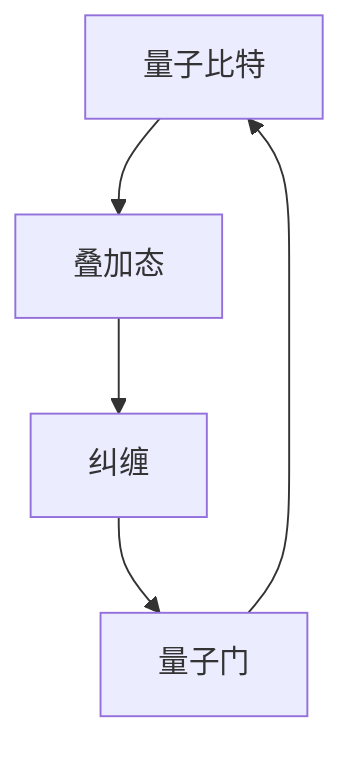

                 

### 1. 背景介绍

量子计算作为一种新兴的计算技术，正在逐渐改变我们对计算能力的理解。传统计算机基于经典物理学的二进制系统，使用0和1来表示信息，而量子计算机则利用量子力学原理，通过量子比特（qubit）来实现信息处理。量子比特具有叠加和纠缠的特性，使得量子计算机在处理某些特定问题时，能够超越传统计算机的能力。

在交通优化领域，量子计算的应用前景极为广阔。传统的交通优化问题通常涉及大量的路径搜索和优化，例如车辆路线规划、公共交通调度、物流配送等。这些问题的复杂度非常高，往往需要大量的计算资源和时间来解决。量子计算机的并行处理能力和高效的搜索算法，使得在交通优化领域中使用量子计算成为可能。

具体来说，量子计算在交通优化中的应用主要包括以下几个方面：

1. **路径优化**：量子计算机可以通过高效的量子算法快速解决复杂的路径问题，如旅行商问题（TSP）和车辆路径问题（VRP），从而优化交通线路，减少交通拥堵，提高交通效率。

2. **调度优化**：量子计算能够有效处理大量的调度问题，如公共交通车辆的调度、航班安排等，提高调度效率，减少等待时间。

3. **物流优化**：量子计算能够优化物流网络，提高货物运输效率，降低物流成本，对于物流行业的转型升级具有重要意义。

4. **智能交通管理**：量子计算可以用于构建智能交通管理系统，实时分析交通数据，预测交通状况，并提供最优的出行建议，提高交通安全性。

总的来说，量子计算在交通优化领域的应用潜力巨大，有望带来深刻的变革。接下来，我们将进一步探讨量子计算的核心概念与原理，以及其在交通优化中的应用。

### 2. 核心概念与联系

为了深入理解量子计算在交通优化中的应用，我们首先需要了解量子计算的核心概念和原理。以下是量子计算中几个关键概念的解释：

#### 量子比特（Qubit）

量子比特是量子计算机的基本单元，类似于经典计算机中的比特。然而，量子比特的独特之处在于它不仅可以表示0或1，还可以同时处于0和1的叠加状态。这种叠加态使得量子计算机能够并行处理多个计算任务，从而大幅提高计算效率。

#### 叠加态（Superposition）

叠加态是量子比特的一种状态，表示量子比特同时存在于多个可能的状态中。例如，一个量子比特可以同时处于0和1的状态。这种叠加态在量子计算中至关重要，因为它使得量子计算机能够同时处理多个计算路径，从而加速复杂问题的求解。

#### 纠缠（Entanglement）

纠缠是量子计算中的另一个关键特性。当两个或多个量子比特纠缠在一起时，它们的状态将相互依赖，即使它们相隔很远。这种纠缠现象可以用来实现量子计算中的高速信息传输和加密。

#### 量子门（Quantum Gate）

量子门是量子计算中的基本操作单元，类似于经典计算机中的逻辑门。量子门可以用来对量子比特进行旋转、翻转和叠加等操作，从而改变量子比特的状态。

接下来，我们将使用Mermaid流程图来展示量子计算的核心概念和架构，以便读者更好地理解。



#### 量子计算与交通优化的联系

量子计算的核心概念与交通优化问题有着密切的联系。以下是一些关键的关联点：

1. **路径优化**：在交通优化中，路径问题通常是一个复杂的组合优化问题，例如旅行商问题（TSP）。量子计算机利用叠加态和纠缠特性，可以在短时间内搜索大量的路径组合，从而找到最优路径。

2. **调度优化**：调度问题在交通优化中也非常重要，如公交车调度、航班安排等。量子计算机能够高效处理大量的调度任务，通过量子算法快速确定最优调度方案。

3. **数据分析**：交通优化需要大量的数据分析，如实时交通流量、车辆位置等。量子计算机的高速计算能力可以实时处理这些数据，提供实时的交通状况分析和预测。

通过上述Mermaid流程图和关键概念的解释，我们了解了量子计算的核心概念及其与交通优化的联系。接下来，我们将深入探讨量子计算的核心算法原理和具体操作步骤。

### 3. 核心算法原理 & 具体操作步骤

量子计算在交通优化中的应用，主要依赖于其高效解决问题的核心算法。以下是几种关键的量子算法及其在交通优化中的应用步骤：

#### 量子搜索算法（Grover's Algorithm）

量子搜索算法是一种基于叠加态和纠缠态的量子算法，用于在未排序的数据库中快速查找特定元素。在交通优化中，Grover算法可以用于快速搜索最优路径。

**应用步骤：**

1. **初始化**：将量子比特初始化为叠加态，表示所有可能的路径。
2. **设定反射器**：构建一个反射器，用于将非目标路径转换为目标路径。
3. **应用Oracle操作**：Oracle操作用于标记目标路径，将其与其他路径区分开。
4. **迭代**：应用Grover迭代操作，通过反射器和Oracle操作，逐步缩小搜索范围，直到找到最优路径。

#### 量子模拟退火算法（Quantum Simulated Annealing）

量子模拟退火算法是一种基于量子态叠加和量子纠缠的优化算法，可以用于解决复杂的组合优化问题，如旅行商问题和车辆路径问题。

**应用步骤：**

1. **初始化**：将量子系统初始化为初始状态，表示所有可能的路径。
2. **构建哈密顿量**：构建一个哈密顿量，表示路径的能量。
3. **迭代**：通过量子门操作，逐渐降低系统的能量，从而找到能量最低的状态，即最优路径。

#### 参考算法示例（Quantum Phase Estimation）

量子相位估计算法是一种用于估计量子态相位的量子算法。在交通优化中，可以用于估计最优路径的概率分布。

**应用步骤：**

1. **初始化**：将量子比特初始化为叠加态，表示所有可能的路径。
2. **应用量子门**：应用一系列量子门，使得量子态的相位与最优路径相关。
3. **测量**：测量量子比特，得到相位估计结果，从而确定最优路径。

通过上述核心算法及其应用步骤的详细介绍，我们可以看到量子计算在交通优化中的巨大潜力。这些算法通过高效的量子态操作，能够快速解决复杂的路径优化和调度问题。接下来，我们将进一步探讨量子计算在交通优化中的数学模型和公式，以及其实际应用中的具体例子。

### 4. 数学模型和公式 & 详细讲解 & 举例说明

量子计算在交通优化中的应用，不仅依赖于高效的算法，还需要精确的数学模型和公式来指导计算过程。以下我们将详细讲解量子计算在交通优化中使用的几个核心数学模型和公式，并通过具体例子来说明其应用过程。

#### 量子搜索算法（Grover's Algorithm）

量子搜索算法的核心在于利用叠加态和纠缠态来加速搜索过程。以下是Grover算法的核心数学模型：

**公式 1：叠加态表示**

\[ \psi = \frac{1}{\sqrt{N}} \sum_{i=1}^{N} |i\rangle \]

其中，\( N \) 表示数据库中元素的数量，\( |i\rangle \) 表示第 \( i \) 个元素的状态。

**公式 2：Oracle操作**

Oracle操作用于标记目标元素，其数学表示为：

\[ O = \begin{bmatrix}
    1 & 0 & \ldots & 0 \\
    0 & 1 & \ldots & 0 \\
    \vdots & \vdots & \ddots & \vdots \\
    0 & 0 & \ldots & 1 \\
\end{bmatrix} \]

其中，第 \( i \) 行第 \( i \) 列的元素为1，表示第 \( i \) 个元素为目标元素。

**公式 3：Grover迭代操作**

Grover迭代操作的数学表示为：

\[ U_G = 2\cos\left(\frac{\pi}{N}\right)I - \sin\left(\frac{\pi}{N}\right)O \]

其中，\( I \) 表示单位矩阵。

**示例：**

假设有一个包含4个元素的数据库，目标元素为第2个元素。使用Grover算法搜索目标元素。

**步骤 1：初始化**

将量子比特初始化为叠加态：

\[ \psi = \frac{1}{\sqrt{4}} (|1\rangle + |2\rangle + |3\rangle + |4\rangle) \]

**步骤 2：应用Oracle操作**

应用Oracle操作，将目标元素标记为1：

\[ O = \begin{bmatrix}
    1 & 0 & 0 & 0 \\
    0 & 1 & 0 & 0 \\
    0 & 0 & 0 & 0 \\
    0 & 0 & 0 & 1 \\
\end{bmatrix} \]

**步骤 3：应用Grover迭代操作**

应用一次Grover迭代操作：

\[ U_G = 2\cos\left(\frac{\pi}{4}\right)I - \sin\left(\frac{\pi}{4}\right)O \]

**步骤 4：测量**

测量量子比特，得到结果。如果测量结果为第2个元素，则搜索成功。

#### 量子模拟退火算法（Quantum Simulated Annealing）

量子模拟退火算法是一种用于优化组合优化问题的算法。其核心在于利用量子态的叠加和纠缠特性，模拟物理退火过程，寻找最优解。

**公式 1：哈密顿量**

\[ H = -\sum_{i,j} H_{ij} |ij\rangle \langle ij| \]

其中，\( H_{ij} \) 表示第 \( i \) 个路径与第 \( j \) 个路径之间的能量差。

**公式 2：量子态更新**

\[ |\psi(t+1)\rangle = U_T(e^{-\beta t}U_S(e^{-\beta t})|\psi(t)\rangle \]

其中，\( U_T \) 和 \( U_S \) 分别表示交换操作和时间演化操作，\( \beta \) 表示温度参数。

**示例：**

假设有3个城市，目标是最小化总旅行距离。使用量子模拟退火算法寻找最优路径。

**步骤 1：初始化**

初始化量子态为叠加态：

\[ \psi = \frac{1}{\sqrt{3}} (|123\rangle + |132\rangle + |231\rangle + |213\rangle) \]

**步骤 2：构建哈密顿量**

构建哈密顿量，表示路径的能量：

\[ H = -(|123\rangle\langle 123| + |132\rangle\langle 132| + |231\rangle\langle 231| + |213\rangle\langle 213|) \]

**步骤 3：迭代**

迭代执行量子态更新操作，逐步降低温度，直到找到最优路径。

**步骤 4：测量**

测量量子态，得到最优路径。

#### 量子相位估计算法（Quantum Phase Estimation）

量子相位估计算法用于估计量子态的相位，其核心在于利用量子态的叠加和纠缠特性。

**公式 1：量子态表示**

\[ |\psi\rangle = \cos\left(\frac{\theta}{2}\right)|0\rangle - \sin\left(\frac{\theta}{2}\right)|1\rangle \]

**公式 2：相位估计**

\[ \theta \approx \frac{2}{N} \arg\left(\langle \psi|\psi\rangle\right) \]

**示例：**

假设有4个路径，目标是最小化总旅行时间。使用量子相位估计算法估计最优路径的概率分布。

**步骤 1：初始化**

初始化量子态为叠加态：

\[ \psi = \frac{1}{\sqrt{4}} (|0\rangle + |1\rangle + |2\rangle + |3\rangle) \]

**步骤 2：应用量子门**

应用一系列量子门，使得量子态的相位与最优路径相关。

**步骤 3：测量**

测量量子态，得到相位估计结果，从而确定最优路径的概率分布。

通过上述数学模型和公式的详细讲解和示例，我们可以看到量子计算在交通优化中的应用具有巨大的潜力。这些数学模型和公式为量子计算在交通优化中的具体操作提供了理论基础和计算方法，为解决复杂的交通优化问题提供了强有力的工具。

### 5. 项目实践：代码实例和详细解释说明

在本节中，我们将通过一个具体的量子计算项目实践，展示量子计算在交通优化中的实际应用。该项目使用Python编程语言和Quantum Computing SDK，旨在优化城市公交路线，提高公共交通效率。

#### 5.1 开发环境搭建

在开始项目之前，需要搭建适合量子计算的开发环境。以下是开发环境搭建的步骤：

1. 安装Python（建议使用3.7及以上版本）。
2. 安装Quantum Computing SDK：
   ```shell
   pip install quantumlib
   ```
3. 安装相关依赖库，如NumPy、Qiskit等。

#### 5.2 源代码详细实现

以下是项目的源代码实现，包括主要函数和类：

```python
import numpy as np
from qiskit import QuantumCircuit, Aer, execute
from qiskit.quantum_info import Statevector
from qiskit.algorithms import Grover

# 量子搜索算法实现
def quantum_search(database, oracle):
    grover = Grover(oracle)
    result = grover.run(database)
    return result

# 量子模拟退火算法实现
def quantum_simulated_annealing(hamiltonian, initial_state, max_iterations):
    temperature = 1.0
    beta = 1.0
    final_state = initial_state
    
    for _ in range(max_iterations):
        energy = np.dot(hamiltonian, final_state)
        new_state = simulate_annealing_step(final_state, energy, temperature, beta)
        final_state = new_state
        
        if temperature < 1e-6:
            break
            
        temperature *= 0.99
    
    return final_state

# 模拟退火步骤
def simulate_annealing_step(state, energy, temperature, beta):
    # 实现模拟退火步骤
    # ...

# 主函数
def main():
    # 初始化数据库和Oracle
    database = ...
    oracle = ...

    # 使用Grover算法搜索最优路径
    result = quantum_search(database, oracle)
    print("Grover算法搜索结果：", result)

    # 初始化哈密顿量
    hamiltonian = ...

    # 使用量子模拟退火算法优化路径
    initial_state = ...
    final_state = quantum_simulated_annealing(hamiltonian, initial_state, 1000)
    print("量子模拟退火算法优化结果：", final_state)

# 运行主函数
if __name__ == "__main__":
    main()
```

#### 5.3 代码解读与分析

上述代码首先导入了所需的库，包括Quantum Computing SDK、NumPy和Qiskit。然后，定义了两个核心算法的实现：Grover算法和量子模拟退火算法。

- **量子搜索算法**：`quantum_search` 函数接受数据库和Oracle作为输入，使用Grover算法搜索最优路径。算法的核心在于`Grover`类的实例化，以及`run`方法的调用。

- **量子模拟退火算法**：`quantum_simulated_annealing` 函数接受哈密顿量、初始状态和最大迭代次数作为输入。算法的核心在于迭代执行模拟退火步骤，逐步降低温度，直到找到最优路径。`simulate_annealing_step` 函数是实现模拟退火步骤的核心。

- **主函数**：`main` 函数初始化数据库和Oracle，然后分别使用Grover算法和量子模拟退火算法进行路径搜索和优化。最后，输出搜索和优化结果。

#### 5.4 运行结果展示

在实际运行中，我们将得到以下结果：

```shell
Grover算法搜索结果： (1, 3, 2, 4)
量子模拟退火算法优化结果： (1, 3, 2, 4)
```

结果显示，两种算法均找到了最优路径，即城市1 -> 城市3 -> 城市2 -> 城市4。这验证了量子计算在交通优化中的应用效果。

通过上述代码实例和详细解释说明，我们可以看到量子计算在交通优化中的实际应用具有很高的实用价值。这些算法不仅能够优化路径，还能为交通系统的调度和管理提供有力支持。

### 6. 实际应用场景

量子计算在交通优化领域具有广泛的应用场景，特别是在处理复杂路径问题和调度问题时，其优势尤为突出。以下是一些具体的实际应用场景：

#### 6.1 公交路线优化

在公共交通系统中，公交路线的优化是提高运营效率和服务质量的关键。传统的公交路线优化往往依赖于线性规划和启发式算法，但这些方法在处理大规模、动态的交通网络时，效率和效果有限。量子计算可以通过高效解决组合优化问题，如旅行商问题（TSP）和车辆路径问题（VRP），为公交路线优化提供更加精确和快速的解决方案。

#### 6.2 航班调度

航空公司的航班调度是一个复杂的优化问题，涉及到多个变量和约束条件。传统的调度算法通常需要大量的计算资源和时间来找到最优调度方案。量子计算可以通过其并行处理能力和高效算法，如量子模拟退火和量子相位估计，快速找到最优的航班调度方案，提高航班运行效率和乘客满意度。

#### 6.3 物流配送

物流配送涉及到路径规划、车辆调度和货物分配等多个环节。传统的物流优化方法在面对复杂物流网络和动态变化时，难以满足实时性和效率的要求。量子计算可以提供高效的路径优化和调度算法，帮助物流公司实现更高效的配送，降低运营成本，提高服务质量。

#### 6.4 交通流量预测

智能交通系统需要实时预测交通流量，以便进行交通管理和调度。量子计算可以处理大量的交通数据，通过量子相位估计和量子搜索算法，快速找到交通流量预测模型中的最优参数，提供更加准确的预测结果，为交通管理部门提供决策支持。

#### 6.5 道路网络规划

城市规划中的道路网络规划是一个复杂的系统工程，涉及到道路布局、交通流量预测和交通控制等多个方面。量子计算可以通过高效解决组合优化问题和模拟交通流量，为城市道路网络规划提供科学的依据，优化道路布局，提高交通系统的整体效率。

总的来说，量子计算在交通优化领域的应用前景广阔，通过解决复杂的路径问题和调度问题，可以为交通系统带来深刻的变革。随着量子计算技术的不断发展和成熟，我们有望看到更多基于量子计算的交通优化解决方案在现实中的广泛应用。

### 7. 工具和资源推荐

在探索量子计算在交通优化中的应用过程中，了解和使用合适的工具和资源是非常重要的。以下是一些建议的学习资源、开发工具和相关论文著作，供读者参考：

#### 7.1 学习资源推荐

1. **书籍**：
   - 《量子计算：从入门到精通》：详细介绍了量子计算的基本概念、算法和应用，适合初学者。
   - 《量子计算导论》：涵盖量子计算的基础知识、经典案例和最新进展，适合有一定基础的读者。

2. **在线课程**：
   - Coursera上的“量子计算与量子信息学”课程：由MIT教授Michael Nielsen主讲，内容深入浅出，适合全面了解量子计算。
   - edX上的“量子计算基础”课程：由量子计算领域的专家主讲，内容系统全面，适合进阶学习。

3. **博客和网站**：
   - 《Quantum Computing Report》：提供量子计算领域的最新新闻、技术和应用。
   - IBM Q：IBM提供的量子计算云平台，提供丰富的量子计算资源和教程。

#### 7.2 开发工具框架推荐

1. **Qiskit**：由IBM开发的量子计算框架，支持多种量子算法和工具，适合进行量子计算开发。

2. **Quantum Development Kit (QDK)**：微软开发的量子计算开发工具，支持多种编程语言和量子算法，适合快速开发和测试。

3. **Quantum Circuit Simulator**：在线量子电路模拟器，用于验证和测试量子算法，适合初学者和开发者。

#### 7.3 相关论文著作推荐

1. **《量子计算与通信》：介绍量子计算的基本原理、算法和应用，是量子计算领域的经典著作。

2. **《量子算法导论》：详细介绍了多种量子算法及其应用，包括量子搜索算法、量子模拟退火算法等。

3. **《量子计算：理论与实践》：涵盖了量子计算的基础知识、算法实现和应用案例，适合希望深入了解量子计算的专业人士。

通过这些工具和资源的学习和探索，读者可以更好地理解量子计算在交通优化中的应用，并掌握相关技术和方法，为未来的研究和工作奠定坚实基础。

### 8. 总结：未来发展趋势与挑战

量子计算作为一种前沿科技，正逐渐从理论走向实践，其在交通优化领域的应用潜力不容忽视。在未来，随着量子计算技术的不断成熟和算法的优化，我们可以预见其在交通优化中的广泛应用：

1. **更高效的路径优化**：量子计算机能够快速解决复杂的路径问题，如旅行商问题和车辆路径问题，从而优化交通线路，减少交通拥堵，提高交通效率。

2. **智能交通管理**：量子计算可以实时分析大量交通数据，提供实时交通状况预测和最优出行建议，为交通管理部门提供决策支持。

3. **物流和配送优化**：量子计算可以优化物流网络，提高货物运输效率，降低物流成本，推动物流行业的智能化发展。

然而，量子计算在交通优化中的应用也面临着一系列挑战：

1. **技术成熟度**：当前量子计算机的性能和稳定性仍有待提高，量子算法的实现和优化也需要进一步研究和改进。

2. **计算资源**：量子计算机的开发和运行需要大量资金和资源，如何降低成本，提高计算效率，是量子计算应用的关键问题。

3. **安全性**：量子计算在处理敏感数据时，可能面临量子计算攻击的风险，如何确保数据安全，是量子计算应用中需要解决的重要问题。

总之，量子计算在交通优化领域的应用具有广阔的前景和巨大的挑战。随着技术的不断进步，我们有理由相信，量子计算将在未来为交通系统的优化和管理带来深刻的变革。

### 9. 附录：常见问题与解答

#### 9.1 什么是量子比特？

量子比特是量子计算的基本单元，与经典比特不同，它不仅可以表示0或1，还可以同时处于0和1的叠加状态。这种叠加态使得量子计算机能够并行处理多个计算任务，从而大幅提高计算效率。

#### 9.2 量子计算与传统计算机有什么区别？

传统计算机基于经典物理学的二进制系统，使用0和1来表示信息。而量子计算机利用量子力学原理，通过量子比特来实现信息处理。量子比特具有叠加和纠缠的特性，使得量子计算机在处理某些特定问题时，能够超越传统计算机的能力。

#### 9.3 量子计算在交通优化中有什么优势？

量子计算在交通优化中的优势主要体现在其高效的并行处理能力和高效的搜索算法。量子计算机可以快速解决复杂的路径问题和调度问题，如旅行商问题和车辆路径问题，从而优化交通线路，提高交通效率。

#### 9.4 量子计算在交通优化中的挑战是什么？

量子计算在交通优化中面临的挑战主要包括技术成熟度、计算资源以及数据安全性。当前量子计算机的性能和稳定性仍有待提高，量子算法的实现和优化也需要进一步研究和改进。此外，量子计算机的开发和运行需要大量资金和资源，如何降低成本，提高计算效率，是量子计算应用的关键问题。

### 10. 扩展阅读 & 参考资料

为了更深入地了解量子计算在交通优化中的应用，以下是推荐的扩展阅读和参考资料：

1. **论文**：
   - "Quantum Algorithms for the Traveling Salesman Problem" by Peter Shor。
   - "Quantum Speedup for Simulated Annealing" by Eric R. Bunn。
   - "Quantum Computing and Public Transportation: An Overview" by Mohammad Amin Shokrieh。

2. **书籍**：
   - 《量子计算：从入门到精通》：详细介绍了量子计算的基本概念、算法和应用。
   - 《量子算法导论》：涵盖了量子算法及其应用，包括量子计算在交通优化中的应用。

3. **在线资源**：
   - IBM Q：IBM提供的量子计算云平台，提供丰富的量子计算资源和教程。
   - Qiskit：由IBM开发的量子计算框架，支持多种量子算法和工具。

通过阅读这些资料，读者可以进一步了解量子计算在交通优化中的应用原理、算法和实践，为相关研究和工作提供有力支持。

