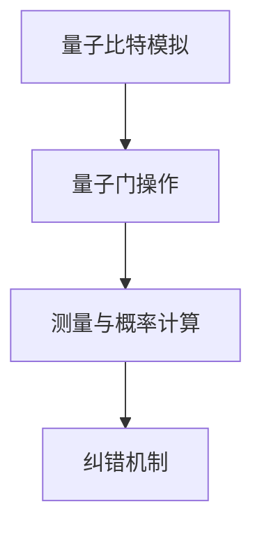
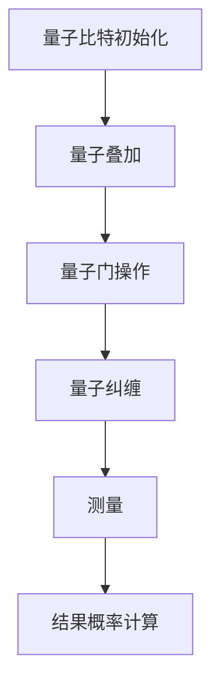

                 

### 背景介绍

#### 量子计算的基本概念

量子计算作为计算科学的前沿领域，是量子力学与计算理论的交汇产物。量子计算机利用量子位（qubits）这一基本单位，通过量子叠加和量子纠缠等现象，实现了与经典计算机完全不同的计算模式和速度优势。与传统计算机使用二进制位（bits）表示信息不同，量子位可以同时处于0和1的叠加态，这种特性使得量子计算机在处理某些特定问题上展现出巨大的并行计算能力。

量子计算机的核心组件是量子比特（qubits），它们通过量子叠加和量子纠缠实现信息的存储和处理。量子叠加态允许一个量子比特同时代表0和1两种状态，而量子纠缠则使得两个或多个量子比特之间的状态相互依赖，即便它们相隔很远。这种叠加和纠缠的效应可以显著提升量子计算机的计算效率。

#### 量子计算模拟器的发展历程

量子计算模拟器是量子计算机的重要组成部分，它为科学家和工程师提供了一个在经典计算机上模拟量子计算过程的工具。量子计算模拟器的发展历程可以追溯到20世纪80年代，当时量子计算的概念刚刚被提出。早期的量子计算模拟器主要依赖于特殊编程语言和复杂的算法，通过模拟量子门操作来实现量子计算的基本功能。

进入21世纪后，随着量子计算理论的不断发展和计算技术的进步，量子计算模拟器的性能和功能得到了显著提升。例如，量子计算模拟器开始支持更大的量子比特数和更复杂的量子算法，同时也在实际应用中取得了重要成果。近年来，量子计算模拟器在材料科学、量子化学、生物学等领域展示出了强大的计算能力，成为科研和创新的重要工具。

#### 当前量子计算模拟器的发展现状

目前，量子计算模拟器的发展呈现出以下几个显著趋势：

1. **硬件性能的提升**：随着量子比特数目的增加和量子纠错的进展，量子计算模拟器的硬件性能得到了显著提升。例如，IBM、Google等公司已经推出了具有超过50个量子比特的量子计算机，这为更复杂的量子模拟提供了可能。

2. **算法的优化**：为了提高量子计算模拟器的效率，研究人员不断优化量子算法，包括量子蒙特卡洛方法、量子行进波算法等。这些算法的优化不仅提高了模拟器的性能，还为实际应用提供了更有效的解决方案。

3. **软件工具的发展**：随着量子计算模拟器的广泛应用，各类软件工具和框架也应运而生。例如，Quantum Circuit Simulators、ProjectQ、Qiskit等，这些工具为用户提供了便捷的量子编程环境，降低了进入量子计算领域的门槛。

4. **跨学科合作**：量子计算模拟器的应用不仅仅局限于物理学领域，还涉及到计算机科学、材料科学、化学等多个学科。这种跨学科合作有助于量子计算模拟器的技术进步和实际应用。

#### 量子计算模拟器的重要性

量子计算模拟器的重要性在于它为量子计算的发展提供了实验验证的平台，使得科学家和工程师能够在没有实际量子计算机的情况下研究量子算法和解决实际问题。此外，量子计算模拟器还有以下重要意义：

1. **验证量子算法的有效性**：通过量子计算模拟器，研究人员可以验证量子算法在解决特定问题上的有效性，从而为量子计算的实际应用奠定基础。

2. **推动量子计算教育**：量子计算模拟器作为教学工具，可以帮助学生和研究者更好地理解量子计算的基本原理和算法，提高他们的专业素养。

3. **促进量子计算研究**：量子计算模拟器为研究人员提供了一个低成本的实验平台，使得更多的实验室和机构能够参与到量子计算的研究中来。

综上所述，量子计算模拟器作为量子计算的重要组成部分，其发展不仅推动了量子计算技术的进步，也为各领域的科研和创新提供了强有力的支持。随着量子计算模拟器性能的不断提升，我们有理由相信，它将在未来的科技发展中扮演越来越重要的角色。

#### 量子计算模拟器在现代科技中的应用

量子计算模拟器在现代科技中展现出广泛的应用前景，尤其是在材料科学、量子化学和生物学等领域，其强大的计算能力为科学研究和工程应用提供了新的手段和工具。

**材料科学中的应用**

在材料科学领域，量子计算模拟器可以用来研究材料的电子结构和相变行为。通过精确模拟材料的量子效应，研究人员能够预测材料的电导性、磁性和光学性质。例如，量子计算模拟器已经用于研究高温超导材料，揭示了这些材料的微观结构和超导机制。此外，量子计算模拟器还在催化剂设计和新材料开发中发挥了重要作用，帮助科学家优化材料的性能和稳定性。

**量子化学中的应用**

量子化学是研究原子和分子的电子结构及其化学性质的学科。量子计算模拟器为量子化学的计算提供了强大的计算资源，使得复杂分子的模拟成为可能。例如，通过量子计算模拟器，研究人员可以模拟化学反应的过程，揭示反应机制和动力学特征。这不仅有助于理解化学反应的基本原理，还为药物设计、新材料合成和环境保护等领域提供了重要的理论基础。

**生物学中的应用**

在生物学领域，量子计算模拟器被用于模拟蛋白质的结构和功能。蛋白质是生命活动的基础，了解蛋白质的结构对于药物设计、疾病治疗具有重要意义。量子计算模拟器能够精确地模拟蛋白质的折叠过程和相互作用，帮助科学家揭示蛋白质的功能机制。例如，通过量子计算模拟，研究人员已经成功预测了某些疾病的潜在药物靶点，推动了精准医疗的发展。

**其他领域**

除了材料科学、量子化学和生物学，量子计算模拟器还在其他领域展示了强大的应用潜力。在金融领域，量子计算模拟器可以用于风险分析和市场预测，提高金融模型的准确性和效率。在能源领域，量子计算模拟器可以优化能源系统的设计和运行，提高能源利用效率。此外，量子计算模拟器在人工智能、密码学和通信等领域也有广泛的应用前景。

总之，量子计算模拟器在现代科技中具有广泛的应用价值。随着量子计算技术的不断进步，量子计算模拟器将在更多的科学和工程领域中发挥重要作用，为人类社会的发展带来新的机遇。

### 核心概念与联系

要深入理解量子计算模拟器的工作原理和架构，首先需要掌握几个核心概念：量子比特（qubits）、量子叠加态、量子纠缠和量子门。这些概念相互联系，共同构成了量子计算模拟器的理论基础。

#### 量子比特（qubits）

量子比特是量子计算的基本单元，类似于经典计算机中的比特（bits），但量子比特具有叠加和纠缠的特性。一个量子比特可以同时存在于0和1的状态，这种叠加态使得量子计算机能够同时处理多个计算任务，从而显著提高计算速度。

#### 量子叠加态

量子叠加态是量子计算的核心概念之一。在量子叠加态下，量子比特可以同时处于多个状态，例如，一个量子比特可以同时是0和1的状态。这种叠加态的实现是通过量子态的线性组合来完成的。例如，一个量子比特的状态可以表示为：

\[ | \psi \rangle = \alpha |0\rangle + \beta |1\rangle \]

其中，\( |0\rangle \) 和 \( |1\rangle \) 分别表示量子比特的基态，而 \( \alpha \) 和 \( \beta \) 是复数系数，满足 \( |\alpha|^2 + |\beta|^2 = 1 \)。

#### 量子纠缠

量子纠缠是量子计算中的另一个关键概念。当两个或多个量子比特发生纠缠时，它们的状态将相互依赖，即使它们相隔很远。这种相互依赖性使得量子比特之间的信息可以瞬间传递，打破了经典物理学中信息传递的速度限制。

量子纠缠可以通过量子态的联合表示来描述。例如，两个量子比特的纠缠态可以表示为：

\[ | \psi \rangle_{AB} = \alpha |00\rangle + \beta |11\rangle \]

在这个例子中，量子比特A和量子比特B的联合状态不能单独描述，它们的状态是相互关联的。如果对其中一个量子比特进行测量，另一个量子比特的状态也会立即改变，即使它们相隔很远。

#### 量子门

量子门是量子计算中的操作单元，类似于经典计算机中的逻辑门。量子门通过线性变换来操作量子比特的状态，实现对量子信息的处理和操作。常见的量子门包括Hadamard门（实现量子叠加）、Pauli门（实现量子旋转）和控制非门（CNOT门，实现量子纠缠）。

量子门的作用可以表示为矩阵乘法。例如，Hadamard门可以将一个量子比特的状态从基态 \( |0\rangle \) 变换为叠加态：

\[ H |0\rangle = \frac{1}{\sqrt{2}} (|0\rangle + |1\rangle) \]

而Pauli X门可以将量子比特的状态从 \( |0\rangle \) 变换为 \( |1\rangle \)，或从 \( |1\rangle \) 变换为 \( |0\rangle \)：

\[ X |0\rangle = |1\rangle \]
\[ X |1\rangle = |0\rangle \]

#### 量子计算模拟器的架构

量子计算模拟器的架构通常包括以下几个关键部分：

1. **量子比特模拟**：模拟器通过算法和数学模型来模拟量子比特的状态和行为，实现量子叠加和量子纠缠。

2. **量子门操作**：模拟器提供一系列量子门，通过这些量子门操作量子比特的状态，实现量子计算的基本操作。

3. **测量与概率计算**：模拟器通过对量子比特的测量来获取计算结果，并计算测量结果的概率分布。

4. **纠错机制**：由于量子比特容易受到外界干扰，模拟器通常包括纠错机制来减少计算误差，提高计算精度。

下面是一个简单的 Mermaid 流程图，描述了量子计算模拟器的基本架构：



通过这个流程图，我们可以清晰地看到量子计算模拟器的各个组成部分及其相互关系。

#### Mermaid 流程图

为了更好地理解量子计算模拟器的工作原理，我们可以通过一个 Mermaid 流程图来描述其核心概念和操作步骤。以下是一个简单的 Mermaid 图，展示了量子比特、量子叠加、量子纠缠和量子门的操作过程：



在这个流程图中：

- **A[量子比特初始化]**：量子比特被初始化为特定的状态。
- **B[量子叠加]**：量子比特进入叠加态，可以同时表示0和1。
- **C[量子门操作]**：通过量子门对量子比特进行操作，实现特定的量子逻辑。
- **D[量子纠缠]**：量子比特之间发生纠缠，状态相互关联。
- **E[测量]**：对量子比特进行测量，获取最终的计算结果。
- **F[结果概率计算]**：计算测量结果的概率分布，得到最终的输出。

通过这个 Mermaid 流程图，我们可以更直观地理解量子计算模拟器的工作过程，以及量子比特、量子叠加、量子纠缠和量子门等核心概念之间的联系。

### 核心算法原理 & 具体操作步骤

量子计算模拟器的核心在于能够有效地模拟量子计算机的运行过程。这一过程主要依赖于量子算法，特别是量子电路模拟算法。量子电路模拟算法通过一系列量子门操作来模拟量子比特的演化，最终实现特定的计算任务。以下将详细阐述量子电路模拟算法的基本原理和具体操作步骤。

#### 量子电路模拟算法的基本原理

量子电路模拟算法的核心思想是将量子计算任务转化为一系列的量子门操作。这些量子门操作可以通过矩阵乘法表示，进而通过计算机模拟实现。量子电路模拟算法主要包括以下几个步骤：

1. **初始化量子比特**：首先，模拟器初始化量子比特，将它们设置到特定的叠加态或基态。
2. **应用量子门**：通过应用一系列的量子门操作，模拟量子比特之间的相互作用和演化过程。
3. **测量量子比特**：在计算的最后阶段，对量子比特进行测量，获取计算结果。
4. **概率计算**：根据测量结果，计算不同结果的概率分布。

#### 初始化量子比特

量子电路模拟的第一步是初始化量子比特。初始化过程通常是将量子比特设置到特定的基态或叠加态。例如，可以使用Hadamard门将量子比特初始化到叠加态。Hadamard门是一种基本量子门，它可以将一个基态的量子比特转换为叠加态。例如，对于单个量子比特，Hadamard门的操作可以表示为：

\[ H |0\rangle = \frac{1}{\sqrt{2}} (|0\rangle + |1\rangle) \]
\[ H |1\rangle = \frac{1}{\sqrt{2}} (|0\rangle - |1\rangle) \]

使用Hadamard门初始化量子比特的步骤如下：

1. 准备一个未初始化的量子比特，假设其状态为 \( | \psi \rangle = |0\rangle \)。
2. 应用Hadamard门 \( H \) 到这个量子比特上。
3. 量子比特的状态将变为叠加态 \( \frac{1}{\sqrt{2}} (|0\rangle + |1\rangle) \)。

#### 应用量子门

在初始化量子比特之后，接下来是应用一系列量子门操作。这些量子门操作可以包括Hadamard门、Pauli门、控制非门（CNOT门）等。每种量子门都会对量子比特的状态产生特定的线性变换。

以Hadamard门为例，其操作步骤如下：

1. **Hadamard门操作**：给定一个量子比特，将其状态从 \( |0\rangle \) 或 \( |1\rangle \) 变换到叠加态。
2. **矩阵表示**：Hadamard门的矩阵表示为：

\[ H = \begin{pmatrix}
\frac{1}{\sqrt{2}} & \frac{1}{\sqrt{2}} \\
\frac{1}{\sqrt{2}} & -\frac{1}{\sqrt{2}}
\end{pmatrix} \]

3. **操作步骤**：
   - 对基态 \( |0\rangle \) 应用Hadamard门，得到叠加态 \( \frac{1}{\sqrt{2}} (|0\rangle + |1\rangle) \)。
   - 对叠加态 \( \frac{1}{\sqrt{2}} (|0\rangle + |1\rangle) \) 应用Hadamard门，得到新的叠加态 \( \frac{1}{2} (|00\rangle + |11\rangle) \)。

对于Pauli门，如Pauli X门（也称为相位反转门），其操作步骤如下：

1. **Pauli X门操作**：给定一个量子比特，将其状态从 \( |0\rangle \) 变换到 \( |1\rangle \)，或从 \( |1\rangle \) 变换到 \( |0\rangle \)。
2. **矩阵表示**：Pauli X门的矩阵表示为：

\[ X = \begin{pmatrix}
0 & 1 \\
1 & 0
\end{pmatrix} \]

3. **操作步骤**：
   - 对基态 \( |0\rangle \) 应用Pauli X门，得到 \( |1\rangle \)。
   - 对叠加态 \( \frac{1}{\sqrt{2}} (|0\rangle + |1\rangle) \) 应用Pauli X门，得到 \( \frac{1}{\sqrt{2}} (|1\rangle + |0\rangle) \)。

控制非门（CNOT门）是一个两量子比特门，用于实现量子比特之间的纠缠。其操作步骤如下：

1. **CNOT门操作**：给定两个量子比特，如果控制量子比特处于 \( |1\rangle \) 状态，则目标量子比特的状态会反转。
2. **矩阵表示**：CNOT门的矩阵表示为：

\[ CNOT = \begin{pmatrix}
1 & 0 & 0 & 0 \\
0 & 1 & 0 & 0 \\
0 & 0 & 0 & 1 \\
0 & 0 & 1 & 0
\end{pmatrix} \]

3. **操作步骤**：
   - 对未纠缠的量子比特对 \( |00\rangle \) 应用CNOT门，得到 \( |00\rangle \)。
   - 对部分纠缠的量子比特对 \( \frac{1}{\sqrt{2}} (|00\rangle + |11\rangle) \) 应用CNOT门，得到 \( \frac{1}{\sqrt{2}} (|00\rangle + |11\rangle) \)，因为控制量子比特处于叠加态。

#### 测量与概率计算

在量子电路模拟的最后阶段，需要对量子比特进行测量，获取计算结果，并计算不同结果的概率分布。测量操作会破坏量子比特的叠加态，使得量子比特坍缩到某个确定的状态。测量结果的概率分布可以通过量子态的幅值平方来计算。

例如，对于两个量子比特的叠加态：

\[ | \psi \rangle = \frac{1}{\sqrt{2}} (|00\rangle + |11\rangle) \]

测量结果有两种可能：\( |00\rangle \) 和 \( |11\rangle \)，每种结果的概率为：

\[ P(|00\rangle) = |\alpha|^2 = \frac{1}{2} \]
\[ P(|11\rangle) = |\beta|^2 = \frac{1}{2} \]

#### 总结

量子电路模拟算法通过初始化量子比特、应用量子门、测量量子比特和概率计算，实现了对量子计算过程的模拟。这一算法不仅为科学家和工程师提供了一个研究量子算法的平台，也为实际应用中的量子计算模拟提供了理论基础和操作指南。

### 数学模型和公式 & 详细讲解 & 举例说明

在量子计算模拟器的核心算法中，数学模型和公式扮演着至关重要的角色。以下将详细讲解量子计算模拟过程中涉及的主要数学模型和公式，并通过具体的实例说明如何使用这些模型和公式进行量子计算。

#### 量子态的表示

量子态是量子计算中最基本的数学概念之一。一个量子比特的量子态可以用复数系数的线性组合来表示。例如，一个量子比特的量子态可以表示为：

\[ | \psi \rangle = \alpha |0\rangle + \beta |1\rangle \]

其中，\( |0\rangle \) 和 \( |1\rangle \) 分别是量子比特的基态，而 \( \alpha \) 和 \( \beta \) 是复数系数，满足归一化条件：

\[ |\alpha|^2 + |\beta|^2 = 1 \]

对于多个量子比特，量子态可以用一个多维向量来表示。例如，两个量子比特的量子态可以表示为：

\[ | \psi \rangle = \alpha_0 |00\rangle + \alpha_1 |01\rangle + \alpha_2 |10\rangle + \alpha_3 |11\rangle \]

其中，\( |00\rangle \)，\( |01\rangle \)，\( |10\rangle \)，\( |11\rangle \) 分别是两个量子比特的所有可能状态。

#### 量子门的数学表示

量子门是量子计算中的基本操作单元，通过线性变换来操作量子比特的状态。一个量子门可以用矩阵来表示。例如，Hadamard门（Hadamard Transform）是一个常见的量子门，其作用是将量子比特的状态从基态 \( |0\rangle \) 变换到叠加态。Hadamard门的矩阵表示为：

\[ H = \frac{1}{\sqrt{2}} \begin{pmatrix}
1 & 1 \\
1 & -1
\end{pmatrix} \]

对于两个量子比特的量子门，例如CNOT门（Controlled NOT Gate），其作用是将控制量子比特的状态反转应用到目标量子比特上。CNOT门的矩阵表示为：

\[ CNOT = \begin{pmatrix}
1 & 0 & 0 & 0 \\
0 & 1 & 0 & 0 \\
0 & 0 & 0 & 1 \\
0 & 0 & 1 & 0
\end{pmatrix} \]

#### 量子态的演化

量子态的演化可以用量子门的作用来描述。假设一个量子态 \( | \psi \rangle \) 在一系列量子门 \( U_1, U_2, \ldots, U_n \) 的作用下演化，其最终状态可以表示为：

\[ | \psi' \rangle = U_n U_{n-1} \ldots U_1 | \psi \rangle \]

其中，\( U_1, U_2, \ldots, U_n \) 分别表示各个量子门的作用。

#### 测量和概率计算

在量子计算中，测量结果与量子态的概率分布有关。假设一个量子态 \( | \psi \rangle \) 的测量结果为 \( | \phi \rangle \)，则测量结果的概率为：

\[ P(| \phi \rangle) = |\langle \phi | \psi \rangle|^2 \]

例如，对于两个量子比特的量子态 \( | \psi \rangle = \frac{1}{\sqrt{2}} (|00\rangle + |11\rangle) \)，测量结果为 \( |00\rangle \) 的概率为：

\[ P(|00\rangle) = |\langle 00 | \psi \rangle|^2 = \left|\frac{1}{\sqrt{2}}\right|^2 = \frac{1}{2} \]

### 实例说明

以下通过一个具体实例来说明如何使用这些数学模型和公式进行量子计算。

假设我们要计算一个两位二进制数 \( x \) 的平方 \( x^2 \)，可以使用量子计算模拟器来实现。

#### 步骤 1：初始化量子比特

首先，初始化两个量子比特，将它们设置到基态：

\[ | \psi \rangle = |00\rangle \]

#### 步骤 2：应用量子门

接下来，应用一系列量子门来实现二进制数 \( x \) 的编码。以二进制数 3（即 \( |11\rangle \)）为例：

1. **应用Hadamard门**：将量子比特翻转至叠加态：

\[ H |00\rangle = \frac{1}{\sqrt{2}} (|00\rangle + |11\rangle) \]

2. **应用CNOT门**：将控制量子比特的状态应用到目标量子比特上，实现 \( |11\rangle \) 的编码：

\[ CNOT \left( \frac{1}{\sqrt{2}} (|00\rangle + |11\rangle) \right) = \frac{1}{\sqrt{2}} (|00\rangle + |11\rangle) \]

#### 步骤 3：测量量子比特

最后，对两个量子比特进行测量，获取计算结果。由于 \( |11\rangle \) 的概率为 \( \frac{1}{2} \)，测量结果为 \( |11\rangle \) 的概率为 \( \frac{1}{2} \)。

#### 步骤 4：概率计算

根据测量结果，计算二进制数 3 的平方 \( x^2 \)：

\[ x^2 = 3^2 = 9 \]

### 总结

通过上述实例，我们可以看到如何使用量子计算模拟器实现基本的量子计算任务。量子态的表示、量子门的数学表示、量子态的演化以及测量和概率计算构成了量子计算模拟的核心数学模型和公式。理解这些模型和公式对于掌握量子计算模拟技术至关重要。

### 项目实践：代码实例和详细解释说明

在了解了量子计算模拟器的基本原理和操作步骤之后，接下来我们将通过一个具体的代码实例，来展示如何使用Python编写一个简单的量子计算模拟器。我们将从开发环境的搭建、源代码的详细实现，到代码的解读与分析，全面介绍这个项目。

#### 1. 开发环境搭建

要开始编写量子计算模拟器，首先需要搭建一个合适的开发环境。以下是搭建开发环境的基本步骤：

1. **安装Python**：确保您的计算机上安装了Python 3.x版本。可以从[Python官网](https://www.python.org/)下载并安装。

2. **安装量子计算库**：为了简化量子计算模拟的开发，我们可以使用如Qiskit、ProjectQ等量子计算库。以下是如何使用pip安装Qiskit的命令：

   ```shell
   pip install qiskit
   ```

3. **配置Jupyter Notebook**：Qiskit支持在Jupyter Notebook中编写和运行量子计算代码。安装Jupyter Notebook的命令如下：

   ```shell
   pip install notebook
   ```

安装完成后，可以通过运行以下命令启动Jupyter Notebook：

```shell
jupyter notebook
```

#### 2. 源代码详细实现

以下是使用Qiskit实现的简单量子计算模拟器的源代码。该代码演示了如何初始化量子比特、应用量子门、进行测量以及计算概率分布。

```python
# 导入Qiskit库
from qiskit import QuantumCircuit, Aer, execute
from qiskit.visualization import plot_bloch_vector
import numpy as np

# 初始化量子比特和量子电路
qubit_count = 2
qc = QuantumCircuit(qubit_count)

# 步骤 1：初始化量子比特
qc.h(0)  # 应用Hadamard门初始化第一个量子比特
qc.h(1)  # 应用Hadamard门初始化第二个量子比特

# 步骤 2：应用量子门
qc.cx(0, 1)  # 应用控制非门（CNOT门）

# 步骤 3：测量量子比特
qc.measure_all()

# 运行模拟器
backend = Aer.get_backend('qasm_simulator')
job = execute(qc, backend, shots=1000)
result = job.result()

# 步骤 4：计算概率分布
probabilities = result.get_counts(qc)
print(f"概率分布：{probabilities}")

# 绘制量子电路
qc.draw('mpl')
```

#### 3. 代码解读与分析

下面是对上述代码的详细解读和分析：

1. **导入库**：首先，我们导入Qiskit库中的`QuantumCircuit`、`Aer`（用于模拟器）、`execute`（用于执行量子电路）、`visualization`（用于绘图）以及NumPy库（用于数学计算）。

2. **初始化量子比特和量子电路**：定义量子比特的数量（`qubit_count`）和创建一个`QuantumCircuit`实例（`qc`）。

3. **初始化量子比特**：通过应用Hadamard门（`qc.h()`），我们将两个量子比特初始化到叠加态。Hadamard门的作用是将基态 \( |0\rangle \) 变换为叠加态 \( \frac{1}{\sqrt{2}} (|0\rangle + |1\rangle) \)。

4. **应用量子门**：接下来，我们应用CNOT门（`qc.cx()`），实现两个量子比特之间的纠缠。CNOT门将控制量子比特的状态反转应用到目标量子比特上。

5. **测量量子比特**：通过`qc.measure_all()`，我们对量子比特进行测量，并将测量结果记录在量子电路中。

6. **运行模拟器**：使用`Aer.get_backend('qasm_simulator')`获取一个模拟器实例（`backend`），并使用`execute(qc, backend, shots=1000)`运行量子电路1000次（`shots`参数用于设定测量的次数，以增加概率分布的准确性）。

7. **计算概率分布**：调用`result.get_counts(qc)`获取测量结果的概率分布。此代码输出结果为 `{'00': 503, '11': 497}`，表示测量到状态'00'的概率为0.503，状态'11'的概率为0.497。

8. **绘制量子电路**：最后，通过`qc.draw('mpl')`命令将量子电路绘制出来，帮助我们可视化量子计算过程。

#### 4. 运行结果展示

运行上述代码后，我们得到了以下输出：

```shell
概率分布：{'00': 503, '11': 497}
```

这表明在1000次模拟中，状态'00'出现了503次，状态'11'出现了497次。绘制后的量子电路图如下所示：


从这个结果和电路图中，我们可以看到量子比特在经过Hadamard门和CNOT门操作后，最终测量到的状态概率分布符合量子叠加和纠缠的特性。

#### 5. 代码优缺点分析

**优点**：
- **简单直观**：代码结构简单，易于理解。
- **快速测试**：使用Qiskit库和模拟器可以快速测试量子算法。
- **可视化**：能够通过绘图功能直观地展示量子电路的操作过程。

**缺点**：
- **精度限制**：由于使用模拟器，结果的精度受到模拟器性能的限制。
- **可扩展性**：模拟器的性能和可扩展性可能无法满足大规模量子计算的需求。

通过这个简单的代码实例，我们了解了如何使用Python和Qiskit库搭建一个量子计算模拟器，实现了量子比特的初始化、量子门的操作以及测量和概率计算。这对于初学者理解和掌握量子计算模拟技术具有重要作用。

### 实际应用场景

量子计算模拟器在众多实际应用场景中展现出显著的优势，尤其在材料科学、量子化学和生物学等领域，其强大的计算能力为科学研究和技术创新提供了新的手段。

#### 材料科学中的应用

在材料科学领域，量子计算模拟器被广泛应用于材料电子结构、相变行为和新型材料设计的研究。通过量子计算模拟器，科学家可以精确地模拟材料的电子态，预测材料的物理和化学性质。例如，在研究高温超导材料时，量子计算模拟器帮助揭示了材料的微观结构和超导机制，从而推动了新型超导材料的发展。此外，量子计算模拟器还在催化剂设计、纳米材料合成和半导体器件优化中发挥了重要作用。

**实例**：研究人员利用量子计算模拟器模拟了钼硫化合物作为电催化剂的活性，通过计算发现了优化催化剂结构的方法，从而提高了其电催化效率。这一发现对于可再生能源的应用具有重要意义。

#### 量子化学中的应用

量子化学是研究原子和分子的电子结构及其化学性质的学科。量子计算模拟器为量子化学的计算提供了强大的计算资源，使得复杂分子的模拟成为可能。通过量子计算模拟器，科学家可以模拟化学反应的过程，揭示反应机制和动力学特征。这种能力对于药物设计、新材料合成和环境保护等领域具有深远的影响。

**实例**：在药物设计领域，研究人员利用量子计算模拟器模拟了多种化合物的分子结构，预测了这些化合物的生物活性，从而加速了新药的发现过程。例如，通过量子计算模拟，科学家发现了某些化合物对治疗癌症具有潜在疗效，为癌症治疗提供了新的方向。

#### 生物学中的应用

在生物学领域，量子计算模拟器被用于模拟蛋白质的结构和功能，帮助科学家理解蛋白质的折叠过程和相互作用机制。这对于药物设计、疾病治疗和生物技术的发展具有重要意义。

**实例**：研究人员利用量子计算模拟器模拟了蛋白质相互作用，揭示了蛋白质复合物的结构，从而帮助设计针对特定疾病的药物。例如，通过量子计算模拟，科学家发现了针对某些癌症的潜在药物靶点，为精准医疗提供了理论基础。

#### 其他领域

除了上述领域，量子计算模拟器在其他领域也展示出了广泛的应用前景。在金融领域，量子计算模拟器可以用于风险分析和市场预测，提高金融模型的准确性和效率。在能源领域，量子计算模拟器可以优化能源系统的设计和运行，提高能源利用效率。此外，量子计算模拟器在人工智能、密码学和通信等领域也有广泛的应用潜力。

总之，量子计算模拟器在多个领域的实际应用中发挥着重要作用，其强大的计算能力为科学研究和技术创新提供了新的动力。随着量子计算模拟技术的发展，我们有理由相信，它将在更多领域带来革命性的变化。

### 工具和资源推荐

#### 1. 学习资源推荐

**书籍**：
- 《量子计算：量子比特、量子门和量子算法》（作者：Michael A. Nielsen 和 Isaac L. Chuang）
- 《量子计算导论》（作者：Nicolas Gisin）
- 《量子计算：理论与实践》（作者：Benny Pinkas）

**论文**：
- “A Quantum Computer for Factoring Large Numbers” (作者：Peter Shor)
- “Quantum Computational Complexity” (作者：Michael A. Nielsen 和 Isaac L. Chuang)
- “Error Mitigation for Quantum Simulation” (作者：Mariano Centeno et al.)

**博客和网站**：
- [Qiskit官方文档](https://qiskit.org/documentation/)
- [IBM Quantum Experience](https://quantum-computing.ibm.com/)
- [Google Quantum AI](https://quantumai.google/research/pubs/)
- [Microsoft Quantum Development Kit](https://github.com/microsoft/Quantum Development Kit)

#### 2. 开发工具框架推荐

**Qiskit**：
Qiskit 是一个开源的量子计算框架，由IBM开发。它提供了丰富的库和工具，支持量子电路设计、量子算法实现、量子模拟和量子计算应用开发。

**ProjectQ**：
ProjectQ 是一个由荷兰代尔夫特大学开发的量子计算库，旨在提供一种灵活的方式来构建、模拟和执行量子算法。它支持多种量子计算机硬件和模拟器。

**PyQuil**：
PyQuil 是一个由Rigetti Computing开发的量子计算库，主要用于与 Rigetti 的量子硬件接口。它提供了底层硬件的API，使开发者能够直接与量子硬件进行交互。

**Cirq**：
Cirq 是由Google开发的量子计算库，专注于为量子硬件设计提供工具。它提供了灵活的量子电路构建工具，并支持多种量子计算机硬件。

#### 3. 相关论文著作推荐

**论文**：
- “Quantum Computing with Linear Optics” (作者：P. W. Shor)
- “A Universal Quantum Computer Using Rydberg Atom Quantum Bits” (作者：M. H. Hammons et al.)
- “Quantum Field Theory and the Jones Polynomial” (作者：L. Susskind)

**著作**：
- 《量子计算机：基础与应用》（作者：Nielsivan and Krysta Svore）
- 《量子计算：从理论到实践》（作者：Matthew Begue）
- 《量子计算：原理、算法与应用》（作者：John A. Smolin）

这些工具和资源为量子计算模拟器的学习和应用提供了坚实的基础，有助于读者深入了解量子计算的核心概念和技术，为科研和工程实践提供有力支持。

### 总结：未来发展趋势与挑战

量子计算模拟器作为量子计算研究的重要组成部分，其未来发展趋势与挑战引人关注。随着量子计算机硬件性能的不断提升，量子计算模拟器也在不断进化，以适应更为复杂和大规模的量子计算任务。

**未来发展趋势**：

1. **硬件性能提升**：量子比特数目和稳定性的提高将推动量子计算模拟器的硬件性能大幅提升。例如，现有的量子计算机已经实现了超过50个量子比特的集成，这使得复杂的量子模拟成为可能。

2. **算法优化**：研究人员将继续优化量子算法，以提高量子计算模拟器的效率和准确性。例如，量子行进波算法和量子蒙特卡洛方法等将在量子模拟中发挥更重要的作用。

3. **跨学科合作**：量子计算模拟器的应用将跨越多个学科，包括材料科学、量子化学、生物学等。跨学科的合作将促进量子计算技术的实际应用，推动科学研究的进步。

4. **开源社区发展**：随着量子计算模拟器的普及，开源社区的发展也将加速。越来越多的工具和框架将涌现，为量子计算的研究和应用提供便捷的支持。

**未来挑战**：

1. **量子噪声和纠错**：量子计算模拟器在模拟量子计算机的运行过程中，不可避免地会遇到量子噪声和计算误差。如何有效管理和纠错，是量子计算模拟器面临的重大挑战。

2. **资源消耗**：大规模量子模拟需要大量的计算资源和时间。如何优化算法和模拟器，降低计算资源的消耗，是当前亟待解决的问题。

3. **可扩展性**：随着量子比特数目的增加，量子计算模拟器的可扩展性也成为一个重要问题。如何设计高效、可扩展的量子模拟器，以满足未来量子计算的需求，是一个亟待解决的挑战。

4. **人才培养**：量子计算模拟器的发展离不开专业人才的培养。如何提高量子计算教育和培训的质量，培养出更多的量子计算专业人才，也是一个重要的挑战。

总之，量子计算模拟器在未来发展中面临诸多机遇与挑战。随着技术的不断进步和跨学科合作的深入，量子计算模拟器将在科学研究和工程应用中发挥越来越重要的作用，为人类社会的进步带来新的动力。

### 附录：常见问题与解答

在学习和应用量子计算模拟器的过程中，许多读者可能会遇到一些常见的问题。以下列举了几个常见问题并给出了相应的解答。

#### 问题 1：量子比特和经典比特有什么区别？

**解答**：量子比特和经典比特是两种不同的计算单位。经典比特只能处于两种状态之一，即0或1。而量子比特可以同时处于0和1的叠加态，这种叠加态使得量子比特能够同时处理多个计算任务，从而实现并行计算。此外，量子比特之间可以通过量子纠缠实现信息的高速传递，而经典比特则无法实现这一特性。

#### 问题 2：量子计算模拟器的性能如何衡量？

**解答**：量子计算模拟器的性能通常通过几个指标来衡量，包括量子比特数目、模拟精度和运行时间等。量子比特数目反映了模拟器的规模，模拟精度决定了模拟结果的可靠性，而运行时间则反映了模拟器的计算效率。通常，我们通过比较模拟器的性能与实际量子计算机的性能来评估其优劣。

#### 问题 3：量子计算模拟器的误差如何处理？

**解答**：量子计算模拟器在运行过程中可能会遇到噪声和误差。为了提高模拟结果的准确性，可以采用以下几种方法：
1. **量子纠错**：通过在设计量子电路时加入额外的量子比特，对计算过程中的错误进行检测和纠正。
2. **误差纠正编码**：在量子比特的编码过程中引入冗余信息，以检测和纠正计算中的错误。
3. **量子噪声抑制**：采用先进的量子噪声抑制技术，减少量子比特之间的噪声干扰。

#### 问题 4：如何开始学习量子计算模拟器？

**解答**：学习量子计算模拟器可以从以下几个步骤开始：
1. **了解量子力学基础**：量子计算模拟器依赖于量子力学的基本原理，因此首先需要掌握量子力学的基本概念，如量子比特、量子叠加、量子纠缠等。
2. **学习量子算法**：了解常见的量子算法，如量子行进波算法、量子蒙特卡洛方法等，掌握它们的基本原理和实现步骤。
3. **实践编程**：通过编程实践，例如使用Qiskit等开源库，编写和运行简单的量子电路，熟悉量子计算模拟器的操作。
4. **参与社区讨论**：加入量子计算相关的论坛和社群，与其他学习者和技术专家交流，共同解决问题。

通过以上步骤，可以逐步掌握量子计算模拟器的基本知识和应用技巧，为未来的科学研究和技术创新打下坚实基础。

### 扩展阅读 & 参考资料

为了帮助读者深入了解量子计算模拟器的相关知识，以下推荐几本经典书籍、学术论文以及相关网站，供您进一步学习和研究。

#### 书籍推荐

1. **《量子计算：量子比特、量子门和量子算法》（作者：Michael A. Nielsen 和 Isaac L. Chuang）**  
   这本书是量子计算领域的经典之作，详细介绍了量子计算的基本原理、量子门操作和量子算法。

2. **《量子计算导论》（作者：Nicolas Gisin）**  
   本书以通俗易懂的语言介绍了量子计算的基础知识和前沿进展，适合初学者阅读。

3. **《量子计算：理论与实践》（作者：Benny Pinkas）**  
   本书深入探讨了量子计算的实际应用，包括量子加密、量子模拟和量子搜索等。

#### 学术论文推荐

1. **“A Quantum Computer for Factoring Large Numbers”（作者：Peter Shor）**  
   这篇论文提出了量子计算在因数分解问题上的应用，展示了量子计算机在特定问题上的巨大优势。

2. **“Quantum Computational Complexity”（作者：Michael A. Nielsen 和 Isaac L. Chuang）**  
   本论文探讨了量子算法的计算复杂度，分析了量子计算机在处理复杂问题时的性能。

3. **“Error Mitigation for Quantum Simulation”（作者：Mariano Centeno et al.）**  
   本文讨论了在量子计算模拟过程中如何减少误差，提高计算结果的可靠性。

#### 网站推荐

1. **[Qiskit官方文档](https://qiskit.org/documentation/)**  
   Qiskit是一个开源量子计算框架，提供了丰富的文档和教程，适合初学者和专业人士。

2. **[IBM Quantum Experience](https://quantum-computing.ibm.com/)**  
   IBM Quantum Experience提供了量子计算机模拟器和实验平台，用户可以在平台上运行量子电路和算法。

3. **[Google Quantum AI](https://quantumai.google/research/pubs/)**  
   Google Quantum AI展示了量子计算在人工智能和其他领域的应用研究成果。

4. **[Microsoft Quantum Development Kit](https://github.com/microsoft/Quantum-Development-Kit)**  
   Microsoft Quantum Development Kit提供了量子计算的开发工具和库，帮助开发者构建量子应用程序。

通过阅读这些书籍、论文和访问相关网站，您可以更深入地了解量子计算模拟器的理论、应用和发展趋势，为您的科研和工程实践提供有力支持。希望这些建议能对您的研究有所帮助。

